cola Report for GDS4284
==================

**Date**: 2019-12-25 21:27:37 CET, **cola version**: 1.3.2

----------------------------------------------------------------

<style type='text/css'>

body, td, th {
   font-family: Arial,Helvetica,sans-serif;
   background-color: white;
   font-size: 13px;
  max-width: 800px;
  margin: auto;
  margin-left:210px;
  padding: 0px 10px 0px 10px;
  border-left: 1px solid #EEEEEE;
  line-height: 150%;
}

tt, code, pre {
   font-family: 'DejaVu Sans Mono', 'Droid Sans Mono', 'Lucida Console', Consolas, Monaco, 

monospace;
}

h1 {
   font-size:2.2em;
}

h2 {
   font-size:1.8em;
}

h3 {
   font-size:1.4em;
}

h4 {
   font-size:1.0em;
}

h5 {
   font-size:0.9em;
}

h6 {
   font-size:0.8em;
}

a {
  text-decoration: none;
  color: #0366d6;
}

a:hover {
  text-decoration: underline;
}

a:visited {
   color: #0366d6;
}

pre, img {
  max-width: 100%;
}
pre {
  overflow-x: auto;
}
pre code {
   display: block; padding: 0.5em;
}

code {
  font-size: 92%;
  border: 1px solid #ccc;
}

code[class] {
  background-color: #F8F8F8;
}

table, td, th {
  border: 1px solid #ccc;
}

blockquote {
   color:#666666;
   margin:0;
   padding-left: 1em;
   border-left: 0.5em #EEE solid;
}

hr {
   height: 0px;
   border-bottom: none;
   border-top-width: thin;
   border-top-style: dotted;
   border-top-color: #999999;
}

@media print {
   * {
      background: transparent !important;
      color: black !important;
      filter:none !important;
      -ms-filter: none !important;
   }

   body {
      font-size:12pt;
      max-width:100%;
   }

   a, a:visited {
      text-decoration: underline;
   }

   hr {
      visibility: hidden;
      page-break-before: always;
   }

   pre, blockquote {
      padding-right: 1em;
      page-break-inside: avoid;
   }

   tr, img {
      page-break-inside: avoid;
   }

   img {
      max-width: 100% !important;
   }

   @page :left {
      margin: 15mm 20mm 15mm 10mm;
   }

   @page :right {
      margin: 15mm 10mm 15mm 20mm;
   }

   p, h2, h3 {
      orphans: 3; widows: 3;
   }

   h2, h3 {
      page-break-after: avoid;
   }
}
</style>


## Summary


All available functions which can be applied to this `res_list` object:


```r
res_list
```

```
#> A 'ConsensusPartitionList' object with 24 methods.
#>   On a matrix with 51941 rows and 56 columns.
#>   Top rows are extracted by 'SD, CV, MAD, ATC' methods.
#>   Subgroups are detected by 'hclust, kmeans, skmeans, pam, mclust, NMF' method.
#>   Number of partitions are tried for k = 2, 3, 4, 5, 6.
#>   Performed in total 30000 partitions by row resampling.
#> 
#> Following methods can be applied to this 'ConsensusPartitionList' object:
#>  [1] "cola_report"           "collect_classes"       "collect_plots"         "collect_stats"        
#>  [5] "colnames"              "functional_enrichment" "get_anno_col"          "get_anno"             
#>  [9] "get_classes"           "get_matrix"            "get_membership"        "get_stats"            
#> [13] "is_best_k"             "is_stable_k"           "ncol"                  "nrow"                 
#> [17] "rownames"              "show"                  "suggest_best_k"        "test_to_known_factors"
#> [21] "top_rows_heatmap"      "top_rows_overlap"     
#> 
#> You can get result for a single method by, e.g. object["SD", "hclust"] or object["SD:hclust"]
#> or a subset of methods by object[c("SD", "CV")], c("hclust", "kmeans")]
```

The call of `run_all_consensus_partition_methods()` was:


```
#> run_all_consensus_partition_methods(data = mat, mc.cores = 4, anno = anno)
```

Dimension of the input matrix:


```r
mat = get_matrix(res_list)
dim(mat)
```

```
#> [1] 51941    56
```

### Density distribution

The density distribution for each sample is visualized as in one column in the
following heatmap. The clustering is based on the distance which is the
Kolmogorov-Smirnov statistic between two distributions.


```r
library(ComplexHeatmap)
densityHeatmap(mat, top_annotation = HeatmapAnnotation(df = get_anno(res_list), 
    col = get_anno_col(res_list)), ylab = "value", cluster_columns = TRUE, show_column_names = FALSE,
    mc.cores = 4)
```

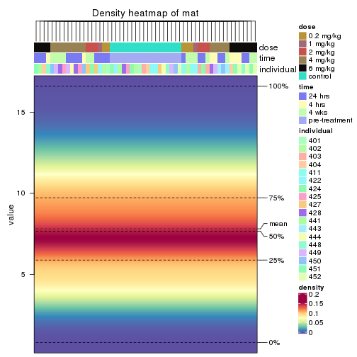


### Suggest the best k


Folowing table shows the best `k` (number of partitions) for each combination
of top-value methods and partition methods. Clicking on the method name in
the table goes to the section for a single combination of methods.

[The cola vignette](http://bioconductor.org/packages/devel/bioc/vignettes/cola/inst/doc/cola.html#toc_13)
explains the definition of the metrics used for determining the best
number of partitions.


```r
suggest_best_k(res_list)
```


|                            | The best k| 1-PAC| Mean silhouette| Concordance|   |
|:---------------------------|----------:|-----:|---------------:|-----------:|:--|
|[ATC:hclust](#ATC-hclust)   |          2| 1.000|           1.000|       1.000|** |
|[ATC:kmeans](#ATC-kmeans)   |          2| 1.000|           1.000|       1.000|** |
|[ATC:skmeans](#ATC-skmeans) |          2| 1.000|           0.999|       0.999|** |
|[ATC:pam](#ATC-pam)         |          2| 1.000|           1.000|       1.000|** |
|[ATC:NMF](#ATC-NMF)         |          2| 0.963|           0.963|       0.983|** |
|[SD:skmeans](#SD-skmeans)   |          2| 0.852|           0.913|       0.963|   |
|[SD:NMF](#SD-NMF)           |          2| 0.715|           0.870|       0.941|   |
|[ATC:mclust](#ATC-mclust)   |          2| 0.657|           0.898|       0.947|   |
|[SD:mclust](#SD-mclust)     |          5| 0.642|           0.777|       0.833|   |
|[MAD:NMF](#MAD-NMF)         |          2| 0.633|           0.841|       0.932|   |
|[CV:mclust](#CV-mclust)     |          6| 0.607|           0.675|       0.767|   |
|[MAD:mclust](#MAD-mclust)   |          5| 0.558|           0.659|       0.789|   |
|[MAD:pam](#MAD-pam)         |          2| 0.549|           0.824|       0.906|   |
|[CV:NMF](#CV-NMF)           |          2| 0.546|           0.851|       0.919|   |
|[MAD:skmeans](#MAD-skmeans) |          2| 0.488|           0.749|       0.886|   |
|[SD:pam](#SD-pam)           |          2| 0.472|           0.863|       0.898|   |
|[CV:hclust](#CV-hclust)     |          5| 0.382|           0.639|       0.730|   |
|[SD:hclust](#SD-hclust)     |          3| 0.380|           0.746|       0.706|   |
|[MAD:hclust](#MAD-hclust)   |          3| 0.297|           0.678|       0.800|   |
|[SD:kmeans](#SD-kmeans)     |          3| 0.275|           0.309|       0.701|   |
|[MAD:kmeans](#MAD-kmeans)   |          2| 0.274|           0.850|       0.869|   |
|[CV:skmeans](#CV-skmeans)   |          2| 0.153|           0.652|       0.822|   |
|[CV:kmeans](#CV-kmeans)     |          2| 0.144|           0.728|       0.778|   |
|[CV:pam](#CV-pam)           |          2| 0.086|           0.683|       0.793|   |

\*\*: 1-PAC > 0.95, \*: 1-PAC > 0.9


### CDF of consensus matrices

Cumulative distribution function curves of consensus matrix for all methods.


```r
collect_plots(res_list, fun = plot_ecdf)
```

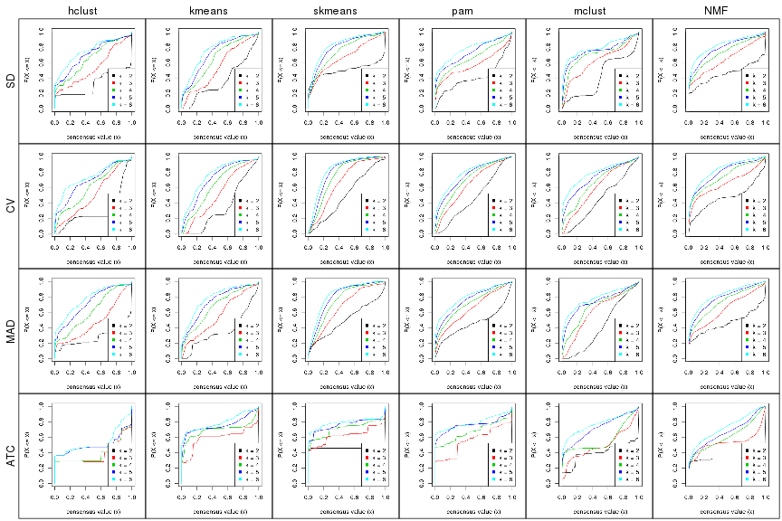


### Consensus heatmap

Consensus heatmaps for all methods. ([What is a consensus heatmap?](http://bioconductor.org/packages/devel/bioc/vignettes/cola/inst/doc/cola.html#toc_9))


<style type='text/css'>


.ui-helper-hidden {
	display: none;
}
.ui-helper-hidden-accessible {
	border: 0;
	clip: rect(0 0 0 0);
	height: 1px;
	margin: -1px;
	overflow: hidden;
	padding: 0;
	position: absolute;
	width: 1px;
}
.ui-helper-reset {
	margin: 0;
	padding: 0;
	border: 0;
	outline: 0;
	line-height: 1.3;
	text-decoration: none;
	font-size: 100%;
	list-style: none;
}
.ui-helper-clearfix:before,
.ui-helper-clearfix:after {
	content: "";
	display: table;
	border-collapse: collapse;
}
.ui-helper-clearfix:after {
	clear: both;
}
.ui-helper-zfix {
	width: 100%;
	height: 100%;
	top: 0;
	left: 0;
	position: absolute;
	opacity: 0;
	filter:Alpha(Opacity=0); 
}

.ui-front {
	z-index: 100;
}


.ui-state-disabled {
	cursor: default !important;
	pointer-events: none;
}


.ui-icon {
	display: inline-block;
	vertical-align: middle;
	margin-top: -.25em;
	position: relative;
	text-indent: -99999px;
	overflow: hidden;
	background-repeat: no-repeat;
}

.ui-widget-icon-block {
	left: 50%;
	margin-left: -8px;
	display: block;
}


.ui-widget-overlay {
	position: fixed;
	top: 0;
	left: 0;
	width: 100%;
	height: 100%;
}
.ui-accordion .ui-accordion-header {
	display: block;
	cursor: pointer;
	position: relative;
	margin: 2px 0 0 0;
	padding: .5em .5em .5em .7em;
	font-size: 100%;
}
.ui-accordion .ui-accordion-content {
	padding: 1em 2.2em;
	border-top: 0;
	overflow: auto;
}
.ui-autocomplete {
	position: absolute;
	top: 0;
	left: 0;
	cursor: default;
}
.ui-menu {
	list-style: none;
	padding: 0;
	margin: 0;
	display: block;
	outline: 0;
}
.ui-menu .ui-menu {
	position: absolute;
}
.ui-menu .ui-menu-item {
	margin: 0;
	cursor: pointer;
	
	list-style-image: url("data:image/gif;base64,R0lGODlhAQABAIAAAAAAAP///yH5BAEAAAAALAAAAAABAAEAAAIBRAA7");
}
.ui-menu .ui-menu-item-wrapper {
	position: relative;
	padding: 3px 1em 3px .4em;
}
.ui-menu .ui-menu-divider {
	margin: 5px 0;
	height: 0;
	font-size: 0;
	line-height: 0;
	border-width: 1px 0 0 0;
}
.ui-menu .ui-state-focus,
.ui-menu .ui-state-active {
	margin: -1px;
}


.ui-menu-icons {
	position: relative;
}
.ui-menu-icons .ui-menu-item-wrapper {
	padding-left: 2em;
}


.ui-menu .ui-icon {
	position: absolute;
	top: 0;
	bottom: 0;
	left: .2em;
	margin: auto 0;
}


.ui-menu .ui-menu-icon {
	left: auto;
	right: 0;
}
.ui-button {
	padding: .4em 1em;
	display: inline-block;
	position: relative;
	line-height: normal;
	margin-right: .1em;
	cursor: pointer;
	vertical-align: middle;
	text-align: center;
	-webkit-user-select: none;
	-moz-user-select: none;
	-ms-user-select: none;
	user-select: none;

	
	overflow: visible;
}

.ui-button,
.ui-button:link,
.ui-button:visited,
.ui-button:hover,
.ui-button:active {
	text-decoration: none;
}


.ui-button-icon-only {
	width: 2em;
	box-sizing: border-box;
	text-indent: -9999px;
	white-space: nowrap;
}


input.ui-button.ui-button-icon-only {
	text-indent: 0;
}


.ui-button-icon-only .ui-icon {
	position: absolute;
	top: 50%;
	left: 50%;
	margin-top: -8px;
	margin-left: -8px;
}

.ui-button.ui-icon-notext .ui-icon {
	padding: 0;
	width: 2.1em;
	height: 2.1em;
	text-indent: -9999px;
	white-space: nowrap;

}

input.ui-button.ui-icon-notext .ui-icon {
	width: auto;
	height: auto;
	text-indent: 0;
	white-space: normal;
	padding: .4em 1em;
}


input.ui-button::-moz-focus-inner,
button.ui-button::-moz-focus-inner {
	border: 0;
	padding: 0;
}
.ui-controlgroup {
	vertical-align: middle;
	display: inline-block;
}
.ui-controlgroup > .ui-controlgroup-item {
	float: left;
	margin-left: 0;
	margin-right: 0;
}
.ui-controlgroup > .ui-controlgroup-item:focus,
.ui-controlgroup > .ui-controlgroup-item.ui-visual-focus {
	z-index: 9999;
}
.ui-controlgroup-vertical > .ui-controlgroup-item {
	display: block;
	float: none;
	width: 100%;
	margin-top: 0;
	margin-bottom: 0;
	text-align: left;
}
.ui-controlgroup-vertical .ui-controlgroup-item {
	box-sizing: border-box;
}
.ui-controlgroup .ui-controlgroup-label {
	padding: .4em 1em;
}
.ui-controlgroup .ui-controlgroup-label span {
	font-size: 80%;
}
.ui-controlgroup-horizontal .ui-controlgroup-label + .ui-controlgroup-item {
	border-left: none;
}
.ui-controlgroup-vertical .ui-controlgroup-label + .ui-controlgroup-item {
	border-top: none;
}
.ui-controlgroup-horizontal .ui-controlgroup-label.ui-widget-content {
	border-right: none;
}
.ui-controlgroup-vertical .ui-controlgroup-label.ui-widget-content {
	border-bottom: none;
}


.ui-controlgroup-vertical .ui-spinner-input {

	
	width: 75%;
	width: calc( 100% - 2.4em );
}
.ui-controlgroup-vertical .ui-spinner .ui-spinner-up {
	border-top-style: solid;
}

.ui-checkboxradio-label .ui-icon-background {
	box-shadow: inset 1px 1px 1px #ccc;
	border-radius: .12em;
	border: none;
}
.ui-checkboxradio-radio-label .ui-icon-background {
	width: 16px;
	height: 16px;
	border-radius: 1em;
	overflow: visible;
	border: none;
}
.ui-checkboxradio-radio-label.ui-checkboxradio-checked .ui-icon,
.ui-checkboxradio-radio-label.ui-checkboxradio-checked:hover .ui-icon {
	background-image: none;
	width: 8px;
	height: 8px;
	border-width: 4px;
	border-style: solid;
}
.ui-checkboxradio-disabled {
	pointer-events: none;
}
.ui-datepicker {
	width: 17em;
	padding: .2em .2em 0;
	display: none;
}
.ui-datepicker .ui-datepicker-header {
	position: relative;
	padding: .2em 0;
}
.ui-datepicker .ui-datepicker-prev,
.ui-datepicker .ui-datepicker-next {
	position: absolute;
	top: 2px;
	width: 1.8em;
	height: 1.8em;
}
.ui-datepicker .ui-datepicker-prev-hover,
.ui-datepicker .ui-datepicker-next-hover {
	top: 1px;
}
.ui-datepicker .ui-datepicker-prev {
	left: 2px;
}
.ui-datepicker .ui-datepicker-next {
	right: 2px;
}
.ui-datepicker .ui-datepicker-prev-hover {
	left: 1px;
}
.ui-datepicker .ui-datepicker-next-hover {
	right: 1px;
}
.ui-datepicker .ui-datepicker-prev span,
.ui-datepicker .ui-datepicker-next span {
	display: block;
	position: absolute;
	left: 50%;
	margin-left: -8px;
	top: 50%;
	margin-top: -8px;
}
.ui-datepicker .ui-datepicker-title {
	margin: 0 2.3em;
	line-height: 1.8em;
	text-align: center;
}
.ui-datepicker .ui-datepicker-title select {
	font-size: 1em;
	margin: 1px 0;
}
.ui-datepicker select.ui-datepicker-month,
.ui-datepicker select.ui-datepicker-year {
	width: 45%;
}
.ui-datepicker table {
	width: 100%;
	font-size: .9em;
	border-collapse: collapse;
	margin: 0 0 .4em;
}
.ui-datepicker th {
	padding: .7em .3em;
	text-align: center;
	font-weight: bold;
	border: 0;
}
.ui-datepicker td {
	border: 0;
	padding: 1px;
}
.ui-datepicker td span,
.ui-datepicker td a {
	display: block;
	padding: .2em;
	text-align: right;
	text-decoration: none;
}
.ui-datepicker .ui-datepicker-buttonpane {
	background-image: none;
	margin: .7em 0 0 0;
	padding: 0 .2em;
	border-left: 0;
	border-right: 0;
	border-bottom: 0;
}
.ui-datepicker .ui-datepicker-buttonpane button {
	float: right;
	margin: .5em .2em .4em;
	cursor: pointer;
	padding: .2em .6em .3em .6em;
	width: auto;
	overflow: visible;
}
.ui-datepicker .ui-datepicker-buttonpane button.ui-datepicker-current {
	float: left;
}


.ui-datepicker.ui-datepicker-multi {
	width: auto;
}
.ui-datepicker-multi .ui-datepicker-group {
	float: left;
}
.ui-datepicker-multi .ui-datepicker-group table {
	width: 95%;
	margin: 0 auto .4em;
}
.ui-datepicker-multi-2 .ui-datepicker-group {
	width: 50%;
}
.ui-datepicker-multi-3 .ui-datepicker-group {
	width: 33.3%;
}
.ui-datepicker-multi-4 .ui-datepicker-group {
	width: 25%;
}
.ui-datepicker-multi .ui-datepicker-group-last .ui-datepicker-header,
.ui-datepicker-multi .ui-datepicker-group-middle .ui-datepicker-header {
	border-left-width: 0;
}
.ui-datepicker-multi .ui-datepicker-buttonpane {
	clear: left;
}
.ui-datepicker-row-break {
	clear: both;
	width: 100%;
	font-size: 0;
}


.ui-datepicker-rtl {
	direction: rtl;
}
.ui-datepicker-rtl .ui-datepicker-prev {
	right: 2px;
	left: auto;
}
.ui-datepicker-rtl .ui-datepicker-next {
	left: 2px;
	right: auto;
}
.ui-datepicker-rtl .ui-datepicker-prev:hover {
	right: 1px;
	left: auto;
}
.ui-datepicker-rtl .ui-datepicker-next:hover {
	left: 1px;
	right: auto;
}
.ui-datepicker-rtl .ui-datepicker-buttonpane {
	clear: right;
}
.ui-datepicker-rtl .ui-datepicker-buttonpane button {
	float: left;
}
.ui-datepicker-rtl .ui-datepicker-buttonpane button.ui-datepicker-current,
.ui-datepicker-rtl .ui-datepicker-group {
	float: right;
}
.ui-datepicker-rtl .ui-datepicker-group-last .ui-datepicker-header,
.ui-datepicker-rtl .ui-datepicker-group-middle .ui-datepicker-header {
	border-right-width: 0;
	border-left-width: 1px;
}


.ui-datepicker .ui-icon {
	display: block;
	text-indent: -99999px;
	overflow: hidden;
	background-repeat: no-repeat;
	left: .5em;
	top: .3em;
}
.ui-dialog {
	position: absolute;
	top: 0;
	left: 0;
	padding: .2em;
	outline: 0;
}
.ui-dialog .ui-dialog-titlebar {
	padding: .4em 1em;
	position: relative;
}
.ui-dialog .ui-dialog-title {
	float: left;
	margin: .1em 0;
	white-space: nowrap;
	width: 90%;
	overflow: hidden;
	text-overflow: ellipsis;
}
.ui-dialog .ui-dialog-titlebar-close {
	position: absolute;
	right: .3em;
	top: 50%;
	width: 20px;
	margin: -10px 0 0 0;
	padding: 1px;
	height: 20px;
}
.ui-dialog .ui-dialog-content {
	position: relative;
	border: 0;
	padding: .5em 1em;
	background: none;
	overflow: auto;
}
.ui-dialog .ui-dialog-buttonpane {
	text-align: left;
	border-width: 1px 0 0 0;
	background-image: none;
	margin-top: .5em;
	padding: .3em 1em .5em .4em;
}
.ui-dialog .ui-dialog-buttonpane .ui-dialog-buttonset {
	float: right;
}
.ui-dialog .ui-dialog-buttonpane button {
	margin: .5em .4em .5em 0;
	cursor: pointer;
}
.ui-dialog .ui-resizable-n {
	height: 2px;
	top: 0;
}
.ui-dialog .ui-resizable-e {
	width: 2px;
	right: 0;
}
.ui-dialog .ui-resizable-s {
	height: 2px;
	bottom: 0;
}
.ui-dialog .ui-resizable-w {
	width: 2px;
	left: 0;
}
.ui-dialog .ui-resizable-se,
.ui-dialog .ui-resizable-sw,
.ui-dialog .ui-resizable-ne,
.ui-dialog .ui-resizable-nw {
	width: 7px;
	height: 7px;
}
.ui-dialog .ui-resizable-se {
	right: 0;
	bottom: 0;
}
.ui-dialog .ui-resizable-sw {
	left: 0;
	bottom: 0;
}
.ui-dialog .ui-resizable-ne {
	right: 0;
	top: 0;
}
.ui-dialog .ui-resizable-nw {
	left: 0;
	top: 0;
}
.ui-draggable .ui-dialog-titlebar {
	cursor: move;
}
.ui-draggable-handle {
	-ms-touch-action: none;
	touch-action: none;
}
.ui-resizable {
	position: relative;
}
.ui-resizable-handle {
	position: absolute;
	font-size: 0.1px;
	display: block;
	-ms-touch-action: none;
	touch-action: none;
}
.ui-resizable-disabled .ui-resizable-handle,
.ui-resizable-autohide .ui-resizable-handle {
	display: none;
}
.ui-resizable-n {
	cursor: n-resize;
	height: 7px;
	width: 100%;
	top: -5px;
	left: 0;
}
.ui-resizable-s {
	cursor: s-resize;
	height: 7px;
	width: 100%;
	bottom: -5px;
	left: 0;
}
.ui-resizable-e {
	cursor: e-resize;
	width: 7px;
	right: -5px;
	top: 0;
	height: 100%;
}
.ui-resizable-w {
	cursor: w-resize;
	width: 7px;
	left: -5px;
	top: 0;
	height: 100%;
}
.ui-resizable-se {
	cursor: se-resize;
	width: 12px;
	height: 12px;
	right: 1px;
	bottom: 1px;
}
.ui-resizable-sw {
	cursor: sw-resize;
	width: 9px;
	height: 9px;
	left: -5px;
	bottom: -5px;
}
.ui-resizable-nw {
	cursor: nw-resize;
	width: 9px;
	height: 9px;
	left: -5px;
	top: -5px;
}
.ui-resizable-ne {
	cursor: ne-resize;
	width: 9px;
	height: 9px;
	right: -5px;
	top: -5px;
}
.ui-progressbar {
	height: 2em;
	text-align: left;
	overflow: hidden;
}
.ui-progressbar .ui-progressbar-value {
	margin: -1px;
	height: 100%;
}
.ui-progressbar .ui-progressbar-overlay {
	background: url("");
	height: 100%;
	filter: alpha(opacity=25); 
	opacity: 0.25;
}
.ui-progressbar-indeterminate .ui-progressbar-value {
	background-image: none;
}
.ui-selectable {
	-ms-touch-action: none;
	touch-action: none;
}
.ui-selectable-helper {
	position: absolute;
	z-index: 100;
	border: 1px dotted black;
}
.ui-selectmenu-menu {
	padding: 0;
	margin: 0;
	position: absolute;
	top: 0;
	left: 0;
	display: none;
}
.ui-selectmenu-menu .ui-menu {
	overflow: auto;
	overflow-x: hidden;
	padding-bottom: 1px;
}
.ui-selectmenu-menu .ui-menu .ui-selectmenu-optgroup {
	font-size: 1em;
	font-weight: bold;
	line-height: 1.5;
	padding: 2px 0.4em;
	margin: 0.5em 0 0 0;
	height: auto;
	border: 0;
}
.ui-selectmenu-open {
	display: block;
}
.ui-selectmenu-text {
	display: block;
	margin-right: 20px;
	overflow: hidden;
	text-overflow: ellipsis;
}
.ui-selectmenu-button.ui-button {
	text-align: left;
	white-space: nowrap;
	width: 14em;
}
.ui-selectmenu-icon.ui-icon {
	float: right;
	margin-top: 0;
}
.ui-slider {
	position: relative;
	text-align: left;
}
.ui-slider .ui-slider-handle {
	position: absolute;
	z-index: 2;
	width: 1.2em;
	height: 1.2em;
	cursor: default;
	-ms-touch-action: none;
	touch-action: none;
}
.ui-slider .ui-slider-range {
	position: absolute;
	z-index: 1;
	font-size: .7em;
	display: block;
	border: 0;
	background-position: 0 0;
}


.ui-slider.ui-state-disabled .ui-slider-handle,
.ui-slider.ui-state-disabled .ui-slider-range {
	filter: inherit;
}

.ui-slider-horizontal {
	height: .8em;
}
.ui-slider-horizontal .ui-slider-handle {
	top: -.3em;
	margin-left: -.6em;
}
.ui-slider-horizontal .ui-slider-range {
	top: 0;
	height: 100%;
}
.ui-slider-horizontal .ui-slider-range-min {
	left: 0;
}
.ui-slider-horizontal .ui-slider-range-max {
	right: 0;
}

.ui-slider-vertical {
	width: .8em;
	height: 100px;
}
.ui-slider-vertical .ui-slider-handle {
	left: -.3em;
	margin-left: 0;
	margin-bottom: -.6em;
}
.ui-slider-vertical .ui-slider-range {
	left: 0;
	width: 100%;
}
.ui-slider-vertical .ui-slider-range-min {
	bottom: 0;
}
.ui-slider-vertical .ui-slider-range-max {
	top: 0;
}
.ui-sortable-handle {
	-ms-touch-action: none;
	touch-action: none;
}
.ui-spinner {
	position: relative;
	display: inline-block;
	overflow: hidden;
	padding: 0;
	vertical-align: middle;
}
.ui-spinner-input {
	border: none;
	background: none;
	color: inherit;
	padding: .222em 0;
	margin: .2em 0;
	vertical-align: middle;
	margin-left: .4em;
	margin-right: 2em;
}
.ui-spinner-button {
	width: 1.6em;
	height: 50%;
	font-size: .5em;
	padding: 0;
	margin: 0;
	text-align: center;
	position: absolute;
	cursor: default;
	display: block;
	overflow: hidden;
	right: 0;
}

.ui-spinner a.ui-spinner-button {
	border-top-style: none;
	border-bottom-style: none;
	border-right-style: none;
}
.ui-spinner-up {
	top: 0;
}
.ui-spinner-down {
	bottom: 0;
}
.ui-tabs {
	position: relative;
	padding: .2em;
}
.ui-tabs .ui-tabs-nav {
	margin: 0;
	padding: .2em .2em 0;
}
.ui-tabs .ui-tabs-nav li {
	list-style: none;
	float: left;
	position: relative;
	top: 0;
	margin: 1px .2em 0 0;
	border-bottom-width: 0;
	padding: 0;
	white-space: nowrap;
}
.ui-tabs .ui-tabs-nav .ui-tabs-anchor {
	float: left;
	padding: .5em 1em;
	text-decoration: none;
}
.ui-tabs .ui-tabs-nav li.ui-tabs-active {
	margin-bottom: -1px;
	padding-bottom: 1px;
}
.ui-tabs .ui-tabs-nav li.ui-tabs-active .ui-tabs-anchor,
.ui-tabs .ui-tabs-nav li.ui-state-disabled .ui-tabs-anchor,
.ui-tabs .ui-tabs-nav li.ui-tabs-loading .ui-tabs-anchor {
	cursor: text;
}
.ui-tabs-collapsible .ui-tabs-nav li.ui-tabs-active .ui-tabs-anchor {
	cursor: pointer;
}
.ui-tabs .ui-tabs-panel {
	display: block;
	border-width: 0;
	padding: 1em 1.4em;
	background: none;
}
.ui-tooltip {
	padding: 8px;
	position: absolute;
	z-index: 9999;
	max-width: 300px;
}
body .ui-tooltip {
	border-width: 2px;
}

.ui-widget {
	font-family: Arial,Helvetica,sans-serif;
	font-size: 1em;
}
.ui-widget .ui-widget {
	font-size: 1em;
}
.ui-widget input,
.ui-widget select,
.ui-widget textarea,
.ui-widget button {
	font-family: Arial,Helvetica,sans-serif;
	font-size: 1em;
}
.ui-widget.ui-widget-content {
	border: 1px solid #c5c5c5;
}
.ui-widget-content {
	border: 1px solid #dddddd;
	background: #ffffff;
	color: #333333;
}
.ui-widget-content a {
	color: #333333;
}
.ui-widget-header {
	border: 1px solid #dddddd;
	background: #e9e9e9;
	color: #333333;
	font-weight: bold;
}
.ui-widget-header a {
	color: #333333;
}


.ui-state-default,
.ui-widget-content .ui-state-default,
.ui-widget-header .ui-state-default,
.ui-button,


html .ui-button.ui-state-disabled:hover,
html .ui-button.ui-state-disabled:active {
	border: 1px solid #c5c5c5;
	background: #f6f6f6;
	font-weight: normal;
	color: #454545;
}
.ui-state-default a,
.ui-state-default a:link,
.ui-state-default a:visited,
a.ui-button,
a:link.ui-button,
a:visited.ui-button,
.ui-button {
	color: #454545;
	text-decoration: none;
}
.ui-state-hover,
.ui-widget-content .ui-state-hover,
.ui-widget-header .ui-state-hover,
.ui-state-focus,
.ui-widget-content .ui-state-focus,
.ui-widget-header .ui-state-focus,
.ui-button:hover,
.ui-button:focus {
	border: 1px solid #cccccc;
	background: #ededed;
	font-weight: normal;
	color: #2b2b2b;
}
.ui-state-hover a,
.ui-state-hover a:hover,
.ui-state-hover a:link,
.ui-state-hover a:visited,
.ui-state-focus a,
.ui-state-focus a:hover,
.ui-state-focus a:link,
.ui-state-focus a:visited,
a.ui-button:hover,
a.ui-button:focus {
	color: #2b2b2b;
	text-decoration: none;
}

.ui-visual-focus {
	box-shadow: 0 0 3px 1px rgb(94, 158, 214);
}
.ui-state-active,
.ui-widget-content .ui-state-active,
.ui-widget-header .ui-state-active,
a.ui-button:active,
.ui-button:active,
.ui-button.ui-state-active:hover {
	border: 1px solid #003eff;
	background: #007fff;
	font-weight: normal;
	color: #ffffff;
}
.ui-icon-background,
.ui-state-active .ui-icon-background {
	border: #003eff;
	background-color: #ffffff;
}
.ui-state-active a,
.ui-state-active a:link,
.ui-state-active a:visited {
	color: #ffffff;
	text-decoration: none;
}


.ui-state-highlight,
.ui-widget-content .ui-state-highlight,
.ui-widget-header .ui-state-highlight {
	border: 1px solid #dad55e;
	background: #fffa90;
	color: #777620;
}
.ui-state-checked {
	border: 1px solid #dad55e;
	background: #fffa90;
}
.ui-state-highlight a,
.ui-widget-content .ui-state-highlight a,
.ui-widget-header .ui-state-highlight a {
	color: #777620;
}
.ui-state-error,
.ui-widget-content .ui-state-error,
.ui-widget-header .ui-state-error {
	border: 1px solid #f1a899;
	background: #fddfdf;
	color: #5f3f3f;
}
.ui-state-error a,
.ui-widget-content .ui-state-error a,
.ui-widget-header .ui-state-error a {
	color: #5f3f3f;
}
.ui-state-error-text,
.ui-widget-content .ui-state-error-text,
.ui-widget-header .ui-state-error-text {
	color: #5f3f3f;
}
.ui-priority-primary,
.ui-widget-content .ui-priority-primary,
.ui-widget-header .ui-priority-primary {
	font-weight: bold;
}
.ui-priority-secondary,
.ui-widget-content .ui-priority-secondary,
.ui-widget-header .ui-priority-secondary {
	opacity: .7;
	filter:Alpha(Opacity=70); 
	font-weight: normal;
}
.ui-state-disabled,
.ui-widget-content .ui-state-disabled,
.ui-widget-header .ui-state-disabled {
	opacity: .35;
	filter:Alpha(Opacity=35); 
	background-image: none;
}
.ui-state-disabled .ui-icon {
	filter:Alpha(Opacity=35); 
}


.ui-icon {
	width: 16px;
	height: 16px;
}
.ui-icon,
.ui-widget-content .ui-icon {
	background-image: url("images/ui-icons_444444_256x240.png");
}
.ui-widget-header .ui-icon {
	background-image: url("images/ui-icons_444444_256x240.png");
}
.ui-state-hover .ui-icon,
.ui-state-focus .ui-icon,
.ui-button:hover .ui-icon,
.ui-button:focus .ui-icon {
	background-image: url("images/ui-icons_555555_256x240.png");
}
.ui-state-active .ui-icon,
.ui-button:active .ui-icon {
	background-image: url("images/ui-icons_ffffff_256x240.png");
}
.ui-state-highlight .ui-icon,
.ui-button .ui-state-highlight.ui-icon {
	background-image: url("images/ui-icons_777620_256x240.png");
}
.ui-state-error .ui-icon,
.ui-state-error-text .ui-icon {
	background-image: url("images/ui-icons_cc0000_256x240.png");
}
.ui-button .ui-icon {
	background-image: url("images/ui-icons_777777_256x240.png");
}


.ui-icon-blank { background-position: 16px 16px; }
.ui-icon-caret-1-n { background-position: 0 0; }
.ui-icon-caret-1-ne { background-position: -16px 0; }
.ui-icon-caret-1-e { background-position: -32px 0; }
.ui-icon-caret-1-se { background-position: -48px 0; }
.ui-icon-caret-1-s { background-position: -65px 0; }
.ui-icon-caret-1-sw { background-position: -80px 0; }
.ui-icon-caret-1-w { background-position: -96px 0; }
.ui-icon-caret-1-nw { background-position: -112px 0; }
.ui-icon-caret-2-n-s { background-position: -128px 0; }
.ui-icon-caret-2-e-w { background-position: -144px 0; }
.ui-icon-triangle-1-n { background-position: 0 -16px; }
.ui-icon-triangle-1-ne { background-position: -16px -16px; }
.ui-icon-triangle-1-e { background-position: -32px -16px; }
.ui-icon-triangle-1-se { background-position: -48px -16px; }
.ui-icon-triangle-1-s { background-position: -65px -16px; }
.ui-icon-triangle-1-sw { background-position: -80px -16px; }
.ui-icon-triangle-1-w { background-position: -96px -16px; }
.ui-icon-triangle-1-nw { background-position: -112px -16px; }
.ui-icon-triangle-2-n-s { background-position: -128px -16px; }
.ui-icon-triangle-2-e-w { background-position: -144px -16px; }
.ui-icon-arrow-1-n { background-position: 0 -32px; }
.ui-icon-arrow-1-ne { background-position: -16px -32px; }
.ui-icon-arrow-1-e { background-position: -32px -32px; }
.ui-icon-arrow-1-se { background-position: -48px -32px; }
.ui-icon-arrow-1-s { background-position: -65px -32px; }
.ui-icon-arrow-1-sw { background-position: -80px -32px; }
.ui-icon-arrow-1-w { background-position: -96px -32px; }
.ui-icon-arrow-1-nw { background-position: -112px -32px; }
.ui-icon-arrow-2-n-s { background-position: -128px -32px; }
.ui-icon-arrow-2-ne-sw { background-position: -144px -32px; }
.ui-icon-arrow-2-e-w { background-position: -160px -32px; }
.ui-icon-arrow-2-se-nw { background-position: -176px -32px; }
.ui-icon-arrowstop-1-n { background-position: -192px -32px; }
.ui-icon-arrowstop-1-e { background-position: -208px -32px; }
.ui-icon-arrowstop-1-s { background-position: -224px -32px; }
.ui-icon-arrowstop-1-w { background-position: -240px -32px; }
.ui-icon-arrowthick-1-n { background-position: 1px -48px; }
.ui-icon-arrowthick-1-ne { background-position: -16px -48px; }
.ui-icon-arrowthick-1-e { background-position: -32px -48px; }
.ui-icon-arrowthick-1-se { background-position: -48px -48px; }
.ui-icon-arrowthick-1-s { background-position: -64px -48px; }
.ui-icon-arrowthick-1-sw { background-position: -80px -48px; }
.ui-icon-arrowthick-1-w { background-position: -96px -48px; }
.ui-icon-arrowthick-1-nw { background-position: -112px -48px; }
.ui-icon-arrowthick-2-n-s { background-position: -128px -48px; }
.ui-icon-arrowthick-2-ne-sw { background-position: -144px -48px; }
.ui-icon-arrowthick-2-e-w { background-position: -160px -48px; }
.ui-icon-arrowthick-2-se-nw { background-position: -176px -48px; }
.ui-icon-arrowthickstop-1-n { background-position: -192px -48px; }
.ui-icon-arrowthickstop-1-e { background-position: -208px -48px; }
.ui-icon-arrowthickstop-1-s { background-position: -224px -48px; }
.ui-icon-arrowthickstop-1-w { background-position: -240px -48px; }
.ui-icon-arrowreturnthick-1-w { background-position: 0 -64px; }
.ui-icon-arrowreturnthick-1-n { background-position: -16px -64px; }
.ui-icon-arrowreturnthick-1-e { background-position: -32px -64px; }
.ui-icon-arrowreturnthick-1-s { background-position: -48px -64px; }
.ui-icon-arrowreturn-1-w { background-position: -64px -64px; }
.ui-icon-arrowreturn-1-n { background-position: -80px -64px; }
.ui-icon-arrowreturn-1-e { background-position: -96px -64px; }
.ui-icon-arrowreturn-1-s { background-position: -112px -64px; }
.ui-icon-arrowrefresh-1-w { background-position: -128px -64px; }
.ui-icon-arrowrefresh-1-n { background-position: -144px -64px; }
.ui-icon-arrowrefresh-1-e { background-position: -160px -64px; }
.ui-icon-arrowrefresh-1-s { background-position: -176px -64px; }
.ui-icon-arrow-4 { background-position: 0 -80px; }
.ui-icon-arrow-4-diag { background-position: -16px -80px; }
.ui-icon-extlink { background-position: -32px -80px; }
.ui-icon-newwin { background-position: -48px -80px; }
.ui-icon-refresh { background-position: -64px -80px; }
.ui-icon-shuffle { background-position: -80px -80px; }
.ui-icon-transfer-e-w { background-position: -96px -80px; }
.ui-icon-transferthick-e-w { background-position: -112px -80px; }
.ui-icon-folder-collapsed { background-position: 0 -96px; }
.ui-icon-folder-open { background-position: -16px -96px; }
.ui-icon-document { background-position: -32px -96px; }
.ui-icon-document-b { background-position: -48px -96px; }
.ui-icon-note { background-position: -64px -96px; }
.ui-icon-mail-closed { background-position: -80px -96px; }
.ui-icon-mail-open { background-position: -96px -96px; }
.ui-icon-suitcase { background-position: -112px -96px; }
.ui-icon-comment { background-position: -128px -96px; }
.ui-icon-person { background-position: -144px -96px; }
.ui-icon-print { background-position: -160px -96px; }
.ui-icon-trash { background-position: -176px -96px; }
.ui-icon-locked { background-position: -192px -96px; }
.ui-icon-unlocked { background-position: -208px -96px; }
.ui-icon-bookmark { background-position: -224px -96px; }
.ui-icon-tag { background-position: -240px -96px; }
.ui-icon-home { background-position: 0 -112px; }
.ui-icon-flag { background-position: -16px -112px; }
.ui-icon-calendar { background-position: -32px -112px; }
.ui-icon-cart { background-position: -48px -112px; }
.ui-icon-pencil { background-position: -64px -112px; }
.ui-icon-clock { background-position: -80px -112px; }
.ui-icon-disk { background-position: -96px -112px; }
.ui-icon-calculator { background-position: -112px -112px; }
.ui-icon-zoomin { background-position: -128px -112px; }
.ui-icon-zoomout { background-position: -144px -112px; }
.ui-icon-search { background-position: -160px -112px; }
.ui-icon-wrench { background-position: -176px -112px; }
.ui-icon-gear { background-position: -192px -112px; }
.ui-icon-heart { background-position: -208px -112px; }
.ui-icon-star { background-position: -224px -112px; }
.ui-icon-link { background-position: -240px -112px; }
.ui-icon-cancel { background-position: 0 -128px; }
.ui-icon-plus { background-position: -16px -128px; }
.ui-icon-plusthick { background-position: -32px -128px; }
.ui-icon-minus { background-position: -48px -128px; }
.ui-icon-minusthick { background-position: -64px -128px; }
.ui-icon-close { background-position: -80px -128px; }
.ui-icon-closethick { background-position: -96px -128px; }
.ui-icon-key { background-position: -112px -128px; }
.ui-icon-lightbulb { background-position: -128px -128px; }
.ui-icon-scissors { background-position: -144px -128px; }
.ui-icon-clipboard { background-position: -160px -128px; }
.ui-icon-copy { background-position: -176px -128px; }
.ui-icon-contact { background-position: -192px -128px; }
.ui-icon-image { background-position: -208px -128px; }
.ui-icon-video { background-position: -224px -128px; }
.ui-icon-script { background-position: -240px -128px; }
.ui-icon-alert { background-position: 0 -144px; }
.ui-icon-info { background-position: -16px -144px; }
.ui-icon-notice { background-position: -32px -144px; }
.ui-icon-help { background-position: -48px -144px; }
.ui-icon-check { background-position: -64px -144px; }
.ui-icon-bullet { background-position: -80px -144px; }
.ui-icon-radio-on { background-position: -96px -144px; }
.ui-icon-radio-off { background-position: -112px -144px; }
.ui-icon-pin-w { background-position: -128px -144px; }
.ui-icon-pin-s { background-position: -144px -144px; }
.ui-icon-play { background-position: 0 -160px; }
.ui-icon-pause { background-position: -16px -160px; }
.ui-icon-seek-next { background-position: -32px -160px; }
.ui-icon-seek-prev { background-position: -48px -160px; }
.ui-icon-seek-end { background-position: -64px -160px; }
.ui-icon-seek-start { background-position: -80px -160px; }

.ui-icon-seek-first { background-position: -80px -160px; }
.ui-icon-stop { background-position: -96px -160px; }
.ui-icon-eject { background-position: -112px -160px; }
.ui-icon-volume-off { background-position: -128px -160px; }
.ui-icon-volume-on { background-position: -144px -160px; }
.ui-icon-power { background-position: 0 -176px; }
.ui-icon-signal-diag { background-position: -16px -176px; }
.ui-icon-signal { background-position: -32px -176px; }
.ui-icon-battery-0 { background-position: -48px -176px; }
.ui-icon-battery-1 { background-position: -64px -176px; }
.ui-icon-battery-2 { background-position: -80px -176px; }
.ui-icon-battery-3 { background-position: -96px -176px; }
.ui-icon-circle-plus { background-position: 0 -192px; }
.ui-icon-circle-minus { background-position: -16px -192px; }
.ui-icon-circle-close { background-position: -32px -192px; }
.ui-icon-circle-triangle-e { background-position: -48px -192px; }
.ui-icon-circle-triangle-s { background-position: -64px -192px; }
.ui-icon-circle-triangle-w { background-position: -80px -192px; }
.ui-icon-circle-triangle-n { background-position: -96px -192px; }
.ui-icon-circle-arrow-e { background-position: -112px -192px; }
.ui-icon-circle-arrow-s { background-position: -128px -192px; }
.ui-icon-circle-arrow-w { background-position: -144px -192px; }
.ui-icon-circle-arrow-n { background-position: -160px -192px; }
.ui-icon-circle-zoomin { background-position: -176px -192px; }
.ui-icon-circle-zoomout { background-position: -192px -192px; }
.ui-icon-circle-check { background-position: -208px -192px; }
.ui-icon-circlesmall-plus { background-position: 0 -208px; }
.ui-icon-circlesmall-minus { background-position: -16px -208px; }
.ui-icon-circlesmall-close { background-position: -32px -208px; }
.ui-icon-squaresmall-plus { background-position: -48px -208px; }
.ui-icon-squaresmall-minus { background-position: -64px -208px; }
.ui-icon-squaresmall-close { background-position: -80px -208px; }
.ui-icon-grip-dotted-vertical { background-position: 0 -224px; }
.ui-icon-grip-dotted-horizontal { background-position: -16px -224px; }
.ui-icon-grip-solid-vertical { background-position: -32px -224px; }
.ui-icon-grip-solid-horizontal { background-position: -48px -224px; }
.ui-icon-gripsmall-diagonal-se { background-position: -64px -224px; }
.ui-icon-grip-diagonal-se { background-position: -80px -224px; }


.ui-corner-all,
.ui-corner-top,
.ui-corner-left,
.ui-corner-tl {
	border-top-left-radius: 3px;
}
.ui-corner-all,
.ui-corner-top,
.ui-corner-right,
.ui-corner-tr {
	border-top-right-radius: 3px;
}
.ui-corner-all,
.ui-corner-bottom,
.ui-corner-left,
.ui-corner-bl {
	border-bottom-left-radius: 3px;
}
.ui-corner-all,
.ui-corner-bottom,
.ui-corner-right,
.ui-corner-br {
	border-bottom-right-radius: 3px;
}


.ui-widget-overlay {
	background: #aaaaaa;
	opacity: .3;
	filter: Alpha(Opacity=30); 
}
.ui-widget-shadow {
	-webkit-box-shadow: 0px 0px 5px #666666;
	box-shadow: 0px 0px 5px #666666;
} 
</style>
<script src='js/jquery-1.12.4.js'></script>
<script src='js/jquery-ui.js'></script>

<script>
$( function() {
	$( '#tabs-collect-consensus-heatmap' ).tabs();
} );
</script>
<div id='tabs-collect-consensus-heatmap'>
<ul>
<li><a href='#tab-collect-consensus-heatmap-1'>k = 2</a></li>
<li><a href='#tab-collect-consensus-heatmap-2'>k = 3</a></li>
<li><a href='#tab-collect-consensus-heatmap-3'>k = 4</a></li>
<li><a href='#tab-collect-consensus-heatmap-4'>k = 5</a></li>
<li><a href='#tab-collect-consensus-heatmap-5'>k = 6</a></li>
</ul>
<div id='tab-collect-consensus-heatmap-1'>
<pre><code class="r">collect_plots(res_list, k = 2, fun = consensus_heatmap, mc.cores = 4)
</code></pre>

<p>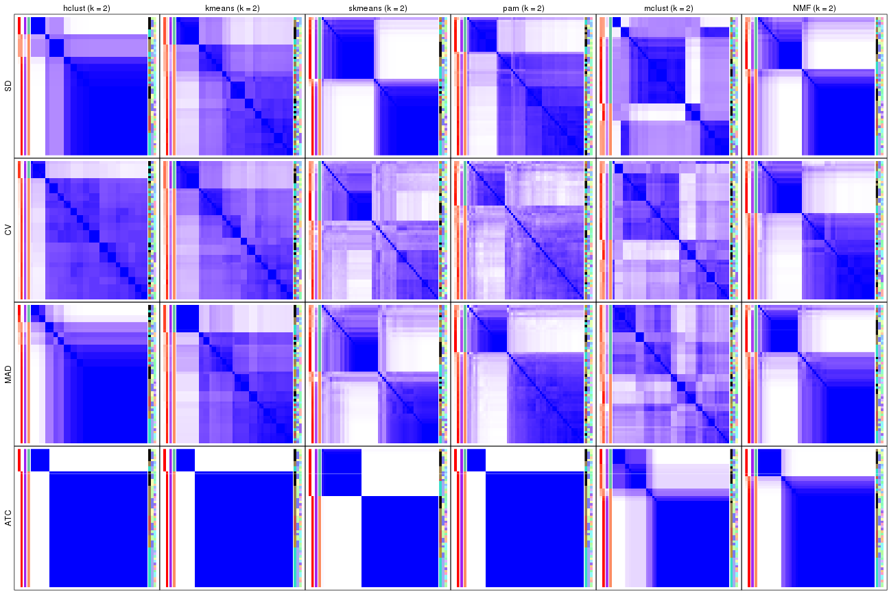</p>

</div>
<div id='tab-collect-consensus-heatmap-2'>
<pre><code class="r">collect_plots(res_list, k = 3, fun = consensus_heatmap, mc.cores = 4)
</code></pre>

<p>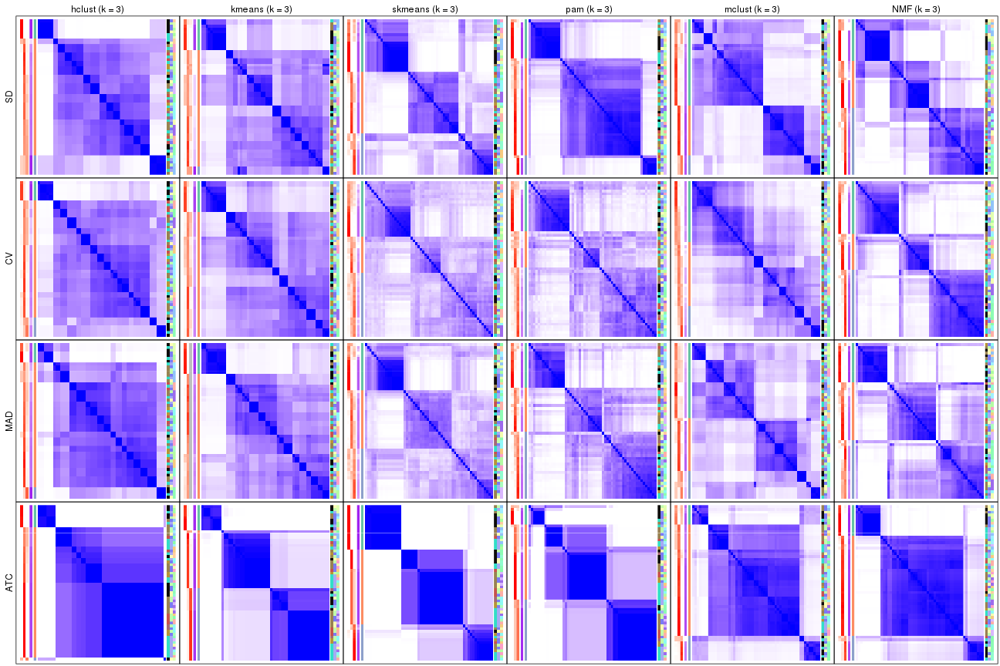</p>

</div>
<div id='tab-collect-consensus-heatmap-3'>
<pre><code class="r">collect_plots(res_list, k = 4, fun = consensus_heatmap, mc.cores = 4)
</code></pre>

<p>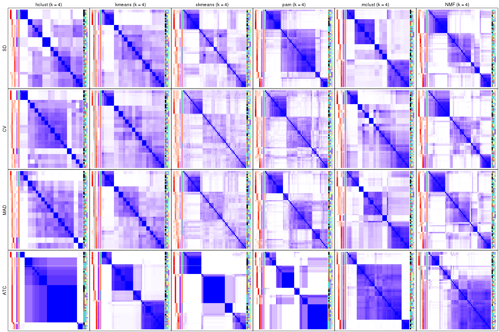</p>

</div>
<div id='tab-collect-consensus-heatmap-4'>
<pre><code class="r">collect_plots(res_list, k = 5, fun = consensus_heatmap, mc.cores = 4)
</code></pre>

<p>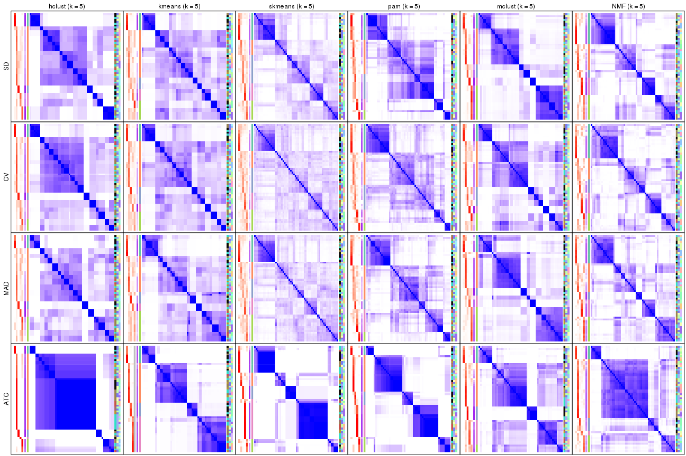</p>

</div>
<div id='tab-collect-consensus-heatmap-5'>
<pre><code class="r">collect_plots(res_list, k = 6, fun = consensus_heatmap, mc.cores = 4)
</code></pre>

<p>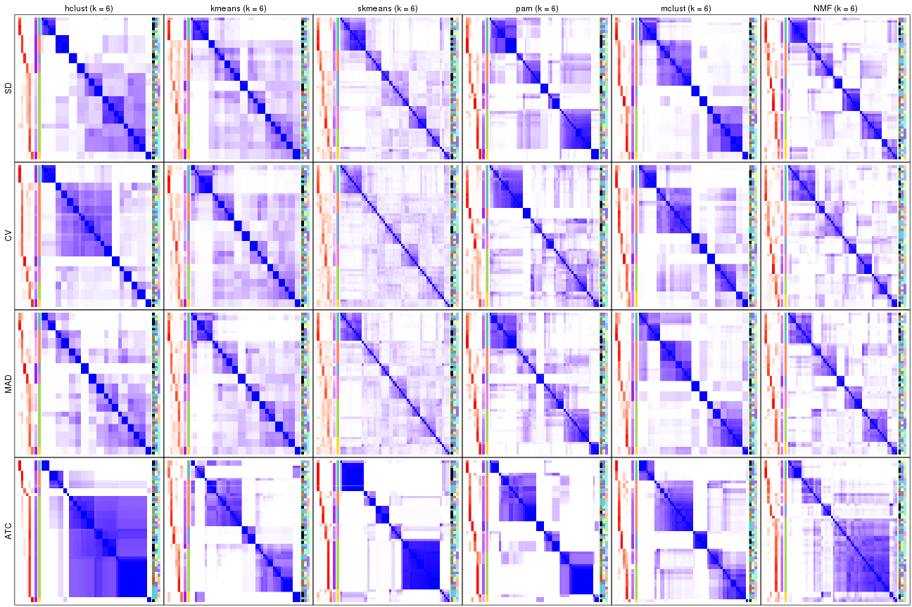</p>

</div>
</div>


### Membership heatmap

Membership heatmaps for all methods. ([What is a membership heatmap?](http://bioconductor.org/packages/devel/bioc/vignettes/cola/inst/doc/cola.html#toc_12))


<script>
$( function() {
	$( '#tabs-collect-membership-heatmap' ).tabs();
} );
</script>
<div id='tabs-collect-membership-heatmap'>
<ul>
<li><a href='#tab-collect-membership-heatmap-1'>k = 2</a></li>
<li><a href='#tab-collect-membership-heatmap-2'>k = 3</a></li>
<li><a href='#tab-collect-membership-heatmap-3'>k = 4</a></li>
<li><a href='#tab-collect-membership-heatmap-4'>k = 5</a></li>
<li><a href='#tab-collect-membership-heatmap-5'>k = 6</a></li>
</ul>
<div id='tab-collect-membership-heatmap-1'>
<pre><code class="r">collect_plots(res_list, k = 2, fun = membership_heatmap, mc.cores = 4)
</code></pre>

<p>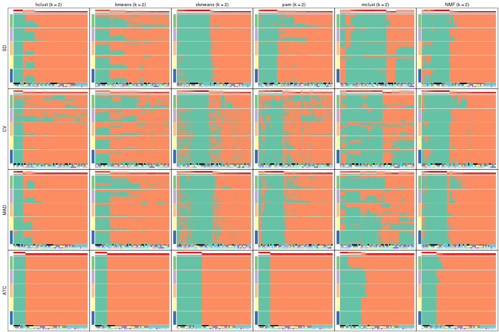</p>

</div>
<div id='tab-collect-membership-heatmap-2'>
<pre><code class="r">collect_plots(res_list, k = 3, fun = membership_heatmap, mc.cores = 4)
</code></pre>

<p>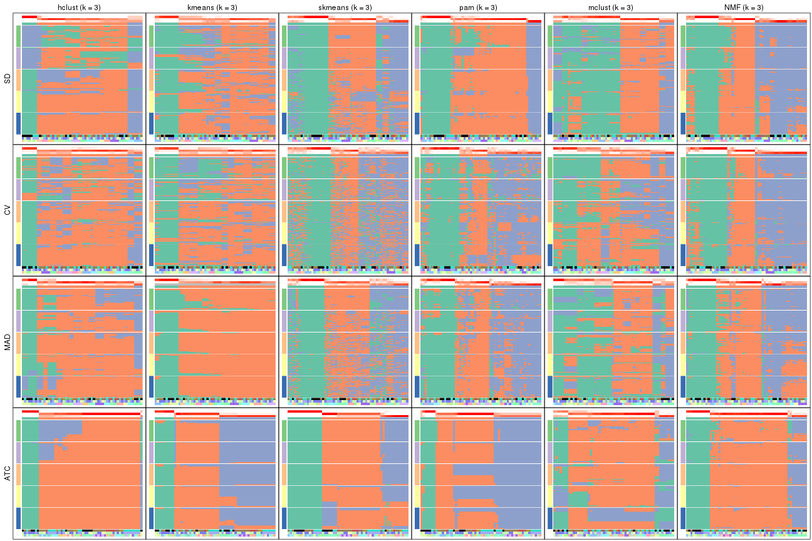</p>

</div>
<div id='tab-collect-membership-heatmap-3'>
<pre><code class="r">collect_plots(res_list, k = 4, fun = membership_heatmap, mc.cores = 4)
</code></pre>

<p>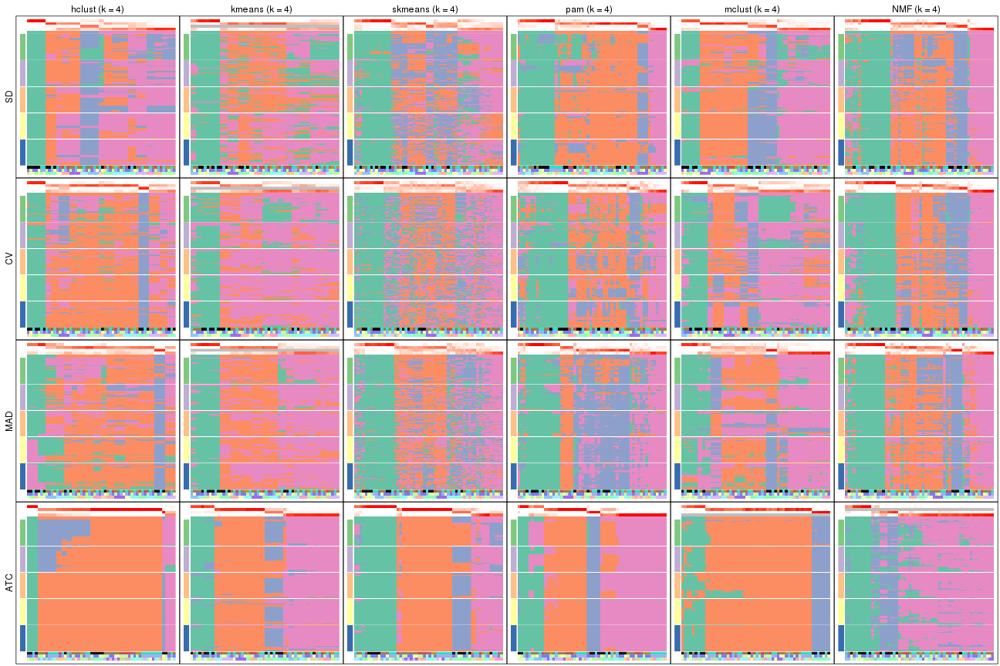</p>

</div>
<div id='tab-collect-membership-heatmap-4'>
<pre><code class="r">collect_plots(res_list, k = 5, fun = membership_heatmap, mc.cores = 4)
</code></pre>

<p>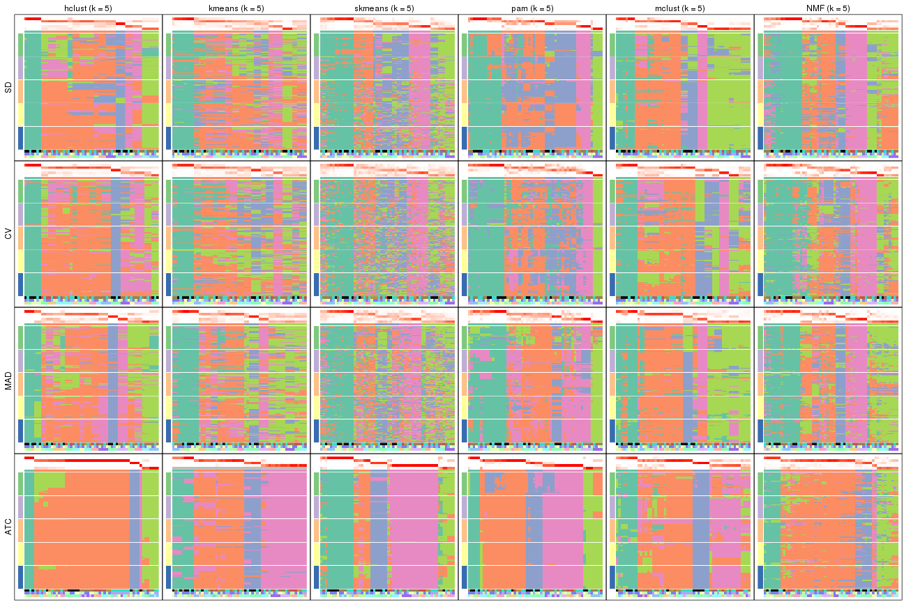</p>

</div>
<div id='tab-collect-membership-heatmap-5'>
<pre><code class="r">collect_plots(res_list, k = 6, fun = membership_heatmap, mc.cores = 4)
</code></pre>

<p>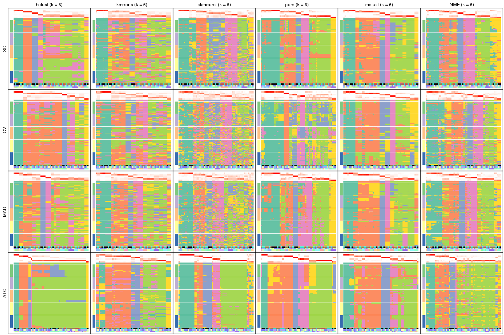</p>

</div>
</div>


### Signature heatmap

Signature heatmaps for all methods. ([What is a signature heatmap?](http://bioconductor.org/packages/devel/bioc/vignettes/cola/inst/doc/cola.html#toc_22))


Note in following heatmaps, rows are scaled.


<script>
$( function() {
	$( '#tabs-collect-get-signatures' ).tabs();
} );
</script>
<div id='tabs-collect-get-signatures'>
<ul>
<li><a href='#tab-collect-get-signatures-1'>k = 2</a></li>
<li><a href='#tab-collect-get-signatures-2'>k = 3</a></li>
<li><a href='#tab-collect-get-signatures-3'>k = 4</a></li>
<li><a href='#tab-collect-get-signatures-4'>k = 5</a></li>
<li><a href='#tab-collect-get-signatures-5'>k = 6</a></li>
</ul>
<div id='tab-collect-get-signatures-1'>
<pre><code class="r">collect_plots(res_list, k = 2, fun = get_signatures, mc.cores = 4)
</code></pre>

<p>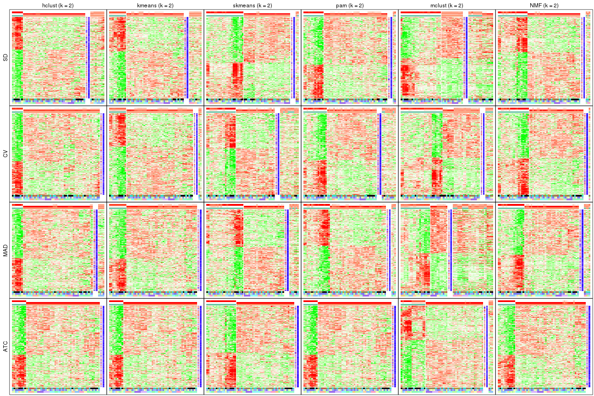</p>

</div>
<div id='tab-collect-get-signatures-2'>
<pre><code class="r">collect_plots(res_list, k = 3, fun = get_signatures, mc.cores = 4)
</code></pre>

<p>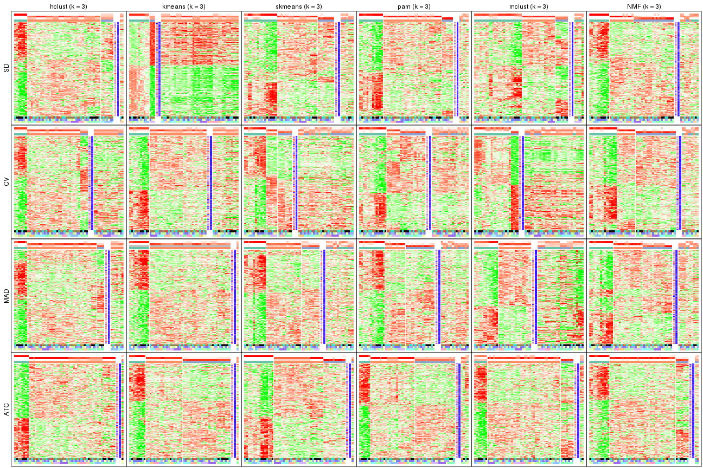</p>

</div>
<div id='tab-collect-get-signatures-3'>
<pre><code class="r">collect_plots(res_list, k = 4, fun = get_signatures, mc.cores = 4)
</code></pre>

<p>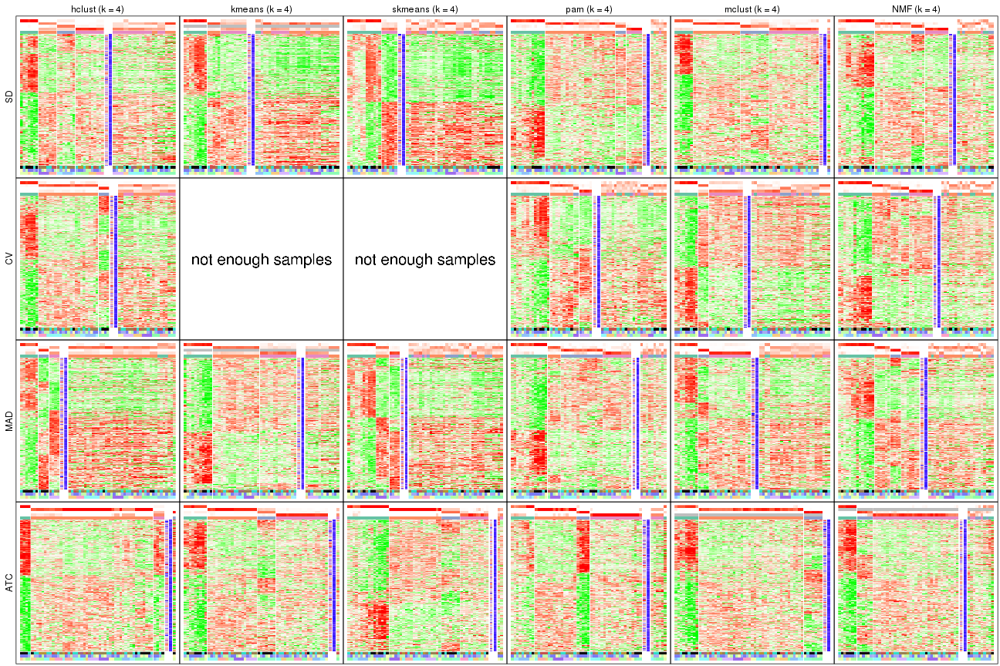</p>

</div>
<div id='tab-collect-get-signatures-4'>
<pre><code class="r">collect_plots(res_list, k = 5, fun = get_signatures, mc.cores = 4)
</code></pre>

<p>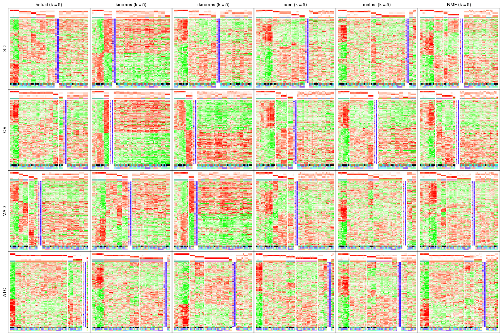</p>

</div>
<div id='tab-collect-get-signatures-5'>
<pre><code class="r">collect_plots(res_list, k = 6, fun = get_signatures, mc.cores = 4)
</code></pre>

<p>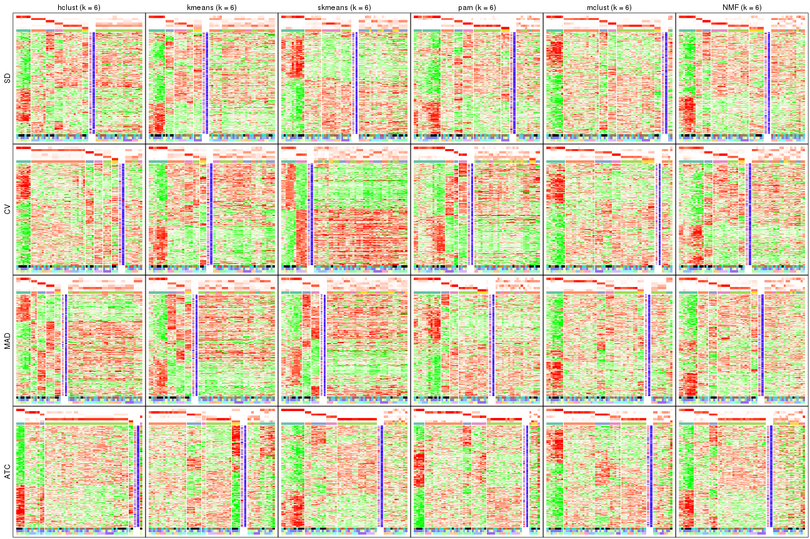</p>

</div>
</div>


### Statistics table

The statistics used for measuring the stability of consensus partitioning.
([How are they
defined?](http://bioconductor.org/packages/devel/bioc/vignettes/cola/inst/doc/cola.html#toc_13))


<script>
$( function() {
	$( '#tabs-get-stats-from-consensus-partition-list' ).tabs();
} );
</script>
<div id='tabs-get-stats-from-consensus-partition-list'>
<ul>
<li><a href='#tab-get-stats-from-consensus-partition-list-1'>k = 2</a></li>
<li><a href='#tab-get-stats-from-consensus-partition-list-2'>k = 3</a></li>
<li><a href='#tab-get-stats-from-consensus-partition-list-3'>k = 4</a></li>
<li><a href='#tab-get-stats-from-consensus-partition-list-4'>k = 5</a></li>
<li><a href='#tab-get-stats-from-consensus-partition-list-5'>k = 6</a></li>
</ul>
<div id='tab-get-stats-from-consensus-partition-list-1'>
<pre><code class="r">get_stats(res_list, k = 2)
</code></pre>

<pre><code>#&gt;             k  1-PAC mean_silhouette concordance area_increased  Rand Jaccard
#&gt; SD:NMF      2 0.7148           0.870       0.941          0.457 0.523   0.523
#&gt; CV:NMF      2 0.5457           0.851       0.919          0.474 0.523   0.523
#&gt; MAD:NMF     2 0.6328           0.841       0.932          0.464 0.544   0.544
#&gt; ATC:NMF     2 0.9630           0.963       0.983          0.341 0.679   0.679
#&gt; SD:skmeans  2 0.8520           0.913       0.963          0.504 0.497   0.497
#&gt; CV:skmeans  2 0.1531           0.652       0.822          0.505 0.501   0.501
#&gt; MAD:skmeans 2 0.4884           0.749       0.886          0.504 0.492   0.492
#&gt; ATC:skmeans 2 1.0000           0.999       0.999          0.457 0.544   0.544
#&gt; SD:mclust   2 0.4049           0.536       0.776          0.417 0.523   0.523
#&gt; CV:mclust   2 0.1380           0.669       0.776          0.447 0.501   0.501
#&gt; MAD:mclust  2 0.1045           0.480       0.725          0.418 0.491   0.491
#&gt; ATC:mclust  2 0.6575           0.898       0.947          0.399 0.584   0.584
#&gt; SD:kmeans   2 0.2250           0.771       0.840          0.370 0.679   0.679
#&gt; CV:kmeans   2 0.1444           0.728       0.778          0.346 0.679   0.679
#&gt; MAD:kmeans  2 0.2736           0.850       0.869          0.362 0.679   0.679
#&gt; ATC:kmeans  2 1.0000           1.000       1.000          0.275 0.725   0.725
#&gt; SD:pam      2 0.4724           0.863       0.898          0.410 0.618   0.618
#&gt; CV:pam      2 0.0856           0.683       0.793          0.472 0.556   0.556
#&gt; MAD:pam     2 0.5486           0.824       0.906          0.460 0.544   0.544
#&gt; ATC:pam     2 1.0000           1.000       1.000          0.275 0.725   0.725
#&gt; SD:hclust   2 0.7162           0.805       0.918          0.322 0.777   0.777
#&gt; CV:hclust   2 0.2648           0.896       0.892          0.298 0.777   0.777
#&gt; MAD:hclust  2 0.6968           0.861       0.938          0.288 0.777   0.777
#&gt; ATC:hclust  2 1.0000           1.000       1.000          0.275 0.725   0.725
</code></pre>

</div>
<div id='tab-get-stats-from-consensus-partition-list-2'>
<pre><code class="r">get_stats(res_list, k = 3)
</code></pre>

<pre><code>#&gt;             k 1-PAC mean_silhouette concordance area_increased  Rand Jaccard
#&gt; SD:NMF      3 0.502           0.654       0.839          0.409 0.688   0.467
#&gt; CV:NMF      3 0.582           0.710       0.854          0.383 0.722   0.513
#&gt; MAD:NMF     3 0.456           0.629       0.807          0.385 0.674   0.457
#&gt; ATC:NMF     3 0.714           0.898       0.927          0.556 0.790   0.690
#&gt; SD:skmeans  3 0.427           0.668       0.794          0.332 0.740   0.522
#&gt; CV:skmeans  3 0.175           0.464       0.693          0.335 0.769   0.569
#&gt; MAD:skmeans 3 0.266           0.564       0.734          0.335 0.701   0.464
#&gt; ATC:skmeans 3 0.731           0.899       0.891          0.365 0.774   0.599
#&gt; SD:mclust   3 0.428           0.736       0.801          0.486 0.819   0.677
#&gt; CV:mclust   3 0.227           0.423       0.645          0.356 0.680   0.453
#&gt; MAD:mclust  3 0.216           0.497       0.711          0.478 0.753   0.553
#&gt; ATC:mclust  3 0.551           0.752       0.783          0.253 0.959   0.930
#&gt; SD:kmeans   3 0.275           0.309       0.701          0.483 0.918   0.879
#&gt; CV:kmeans   3 0.115           0.623       0.682          0.517 1.000   1.000
#&gt; MAD:kmeans  3 0.313           0.688       0.690          0.560 1.000   1.000
#&gt; ATC:kmeans  3 0.586           0.922       0.921          1.156 0.645   0.511
#&gt; SD:pam      3 0.592           0.791       0.888          0.395 0.841   0.743
#&gt; CV:pam      3 0.283           0.517       0.728          0.364 0.751   0.567
#&gt; MAD:pam     3 0.395           0.618       0.805          0.412 0.715   0.510
#&gt; ATC:pam     3 0.541           0.817       0.869          1.021 0.601   0.474
#&gt; SD:hclust   3 0.380           0.746       0.706          0.669 0.809   0.754
#&gt; CV:hclust   3 0.181           0.572       0.750          0.720 0.809   0.754
#&gt; MAD:hclust  3 0.297           0.678       0.800          0.649 0.883   0.850
#&gt; ATC:hclust  3 0.563           0.861       0.909          0.359 0.995   0.993
</code></pre>

</div>
<div id='tab-get-stats-from-consensus-partition-list-3'>
<pre><code class="r">get_stats(res_list, k = 4)
</code></pre>

<pre><code>#&gt;             k 1-PAC mean_silhouette concordance area_increased  Rand Jaccard
#&gt; SD:NMF      4 0.547           0.636       0.787         0.1393 0.766   0.444
#&gt; CV:NMF      4 0.575           0.581       0.773         0.1368 0.865   0.638
#&gt; MAD:NMF     4 0.515           0.507       0.763         0.1439 0.755   0.424
#&gt; ATC:NMF     4 0.483           0.662       0.804         0.1538 0.988   0.974
#&gt; SD:skmeans  4 0.430           0.426       0.622         0.1189 0.799   0.478
#&gt; CV:skmeans  4 0.215           0.308       0.575         0.1222 0.914   0.759
#&gt; MAD:skmeans 4 0.311           0.386       0.625         0.1200 0.874   0.643
#&gt; ATC:skmeans 4 0.796           0.873       0.891         0.1413 0.888   0.698
#&gt; SD:mclust   4 0.572           0.792       0.808         0.1427 0.821   0.586
#&gt; CV:mclust   4 0.330           0.423       0.649         0.0987 0.682   0.349
#&gt; MAD:mclust  4 0.370           0.527       0.662         0.0868 0.744   0.440
#&gt; ATC:mclust  4 0.546           0.839       0.832         0.1376 0.982   0.967
#&gt; SD:kmeans   4 0.306           0.500       0.613         0.1985 0.691   0.509
#&gt; CV:kmeans   4 0.240           0.415       0.568         0.2112 0.699   0.556
#&gt; MAD:kmeans  4 0.386           0.615       0.699         0.2040 0.671   0.516
#&gt; ATC:kmeans  4 0.856           0.918       0.905         0.1717 0.914   0.767
#&gt; SD:pam      4 0.528           0.713       0.829         0.1582 0.919   0.825
#&gt; CV:pam      4 0.342           0.474       0.683         0.0974 0.921   0.780
#&gt; MAD:pam     4 0.459           0.636       0.776         0.0998 0.914   0.754
#&gt; ATC:pam     4 0.652           0.774       0.898         0.2072 0.748   0.471
#&gt; SD:hclust   4 0.398           0.523       0.691         0.2281 0.755   0.583
#&gt; CV:hclust   4 0.335           0.528       0.733         0.1913 0.819   0.699
#&gt; MAD:hclust  4 0.311           0.363       0.655         0.3130 0.779   0.675
#&gt; ATC:hclust  4 0.563           0.849       0.899         0.0516 0.990   0.986
</code></pre>

</div>
<div id='tab-get-stats-from-consensus-partition-list-4'>
<pre><code class="r">get_stats(res_list, k = 5)
</code></pre>

<pre><code>#&gt;             k 1-PAC mean_silhouette concordance area_increased  Rand Jaccard
#&gt; SD:NMF      5 0.587           0.558       0.728         0.0705 0.870   0.579
#&gt; CV:NMF      5 0.597           0.413       0.667         0.0651 0.838   0.494
#&gt; MAD:NMF     5 0.557           0.580       0.729         0.0716 0.829   0.482
#&gt; ATC:NMF     5 0.446           0.665       0.807         0.0860 0.851   0.692
#&gt; SD:skmeans  5 0.508           0.530       0.687         0.0690 0.910   0.661
#&gt; CV:skmeans  5 0.297           0.313       0.540         0.0628 0.840   0.499
#&gt; MAD:skmeans 5 0.357           0.320       0.564         0.0649 0.878   0.574
#&gt; ATC:skmeans 5 0.875           0.769       0.882         0.0681 0.953   0.829
#&gt; SD:mclust   5 0.642           0.777       0.833         0.0625 0.965   0.873
#&gt; CV:mclust   5 0.521           0.476       0.697         0.1004 0.861   0.607
#&gt; MAD:mclust  5 0.558           0.659       0.789         0.1036 0.861   0.588
#&gt; ATC:mclust  5 0.558           0.642       0.780         0.2644 0.712   0.471
#&gt; SD:kmeans   5 0.321           0.382       0.562         0.0978 0.690   0.333
#&gt; CV:kmeans   5 0.338           0.408       0.546         0.1240 0.797   0.517
#&gt; MAD:kmeans  5 0.422           0.477       0.630         0.0910 0.888   0.681
#&gt; ATC:kmeans  5 0.772           0.817       0.848         0.0854 1.000   1.000
#&gt; SD:pam      5 0.578           0.529       0.709         0.1058 0.819   0.540
#&gt; CV:pam      5 0.457           0.513       0.708         0.0691 0.834   0.518
#&gt; MAD:pam     5 0.511           0.466       0.694         0.0671 0.855   0.558
#&gt; ATC:pam     5 0.780           0.827       0.913         0.1311 0.864   0.602
#&gt; SD:hclust   5 0.452           0.625       0.716         0.0760 0.748   0.464
#&gt; CV:hclust   5 0.382           0.639       0.730         0.1307 0.856   0.679
#&gt; MAD:hclust  5 0.458           0.456       0.681         0.1654 0.795   0.589
#&gt; ATC:hclust  5 0.655           0.870       0.946         0.2640 0.818   0.744
</code></pre>

</div>
<div id='tab-get-stats-from-consensus-partition-list-5'>
<pre><code class="r">get_stats(res_list, k = 6)
</code></pre>

<pre><code>#&gt;             k 1-PAC mean_silhouette concordance area_increased  Rand Jaccard
#&gt; SD:NMF      6 0.699           0.615       0.777         0.0543 0.868   0.483
#&gt; CV:NMF      6 0.607           0.469       0.695         0.0448 0.850   0.437
#&gt; MAD:NMF     6 0.643           0.549       0.724         0.0471 0.940   0.736
#&gt; ATC:NMF     6 0.493           0.554       0.770         0.0945 0.910   0.764
#&gt; SD:skmeans  6 0.575           0.523       0.663         0.0381 0.933   0.693
#&gt; CV:skmeans  6 0.425           0.303       0.516         0.0417 0.955   0.778
#&gt; MAD:skmeans 6 0.444           0.364       0.538         0.0411 0.886   0.523
#&gt; ATC:skmeans 6 0.874           0.774       0.871         0.0398 0.953   0.806
#&gt; SD:mclust   6 0.722           0.752       0.805         0.0527 0.975   0.902
#&gt; CV:mclust   6 0.607           0.675       0.767         0.0736 0.871   0.555
#&gt; MAD:mclust  6 0.636           0.681       0.753         0.0559 0.949   0.805
#&gt; ATC:mclust  6 0.684           0.660       0.827         0.0749 0.941   0.781
#&gt; SD:kmeans   6 0.417           0.546       0.550         0.0627 0.784   0.360
#&gt; CV:kmeans   6 0.398           0.501       0.558         0.0671 0.763   0.293
#&gt; MAD:kmeans  6 0.486           0.528       0.643         0.0655 0.910   0.662
#&gt; ATC:kmeans  6 0.725           0.582       0.720         0.0519 0.934   0.772
#&gt; SD:pam      6 0.624           0.693       0.805         0.0654 0.882   0.565
#&gt; CV:pam      6 0.532           0.369       0.622         0.0449 0.841   0.464
#&gt; MAD:pam     6 0.601           0.570       0.766         0.0502 0.883   0.558
#&gt; ATC:pam     6 0.769           0.738       0.856         0.0413 0.992   0.967
#&gt; SD:hclust   6 0.549           0.645       0.705         0.0692 0.992   0.978
#&gt; CV:hclust   6 0.540           0.701       0.749         0.0756 0.971   0.911
#&gt; MAD:hclust  6 0.511           0.481       0.683         0.0708 0.951   0.847
#&gt; ATC:hclust  6 0.522           0.832       0.883         0.0796 0.997   0.995
</code></pre>

</div>
</div>

Following heatmap plots the partition for each combination of methods and the
lightness correspond to the silhouette scores for samples in each method. On
top the consensus subgroup is inferred from all methods by taking the mean
silhouette scores as weight.


<script>
$( function() {
	$( '#tabs-collect-stats-from-consensus-partition-list' ).tabs();
} );
</script>
<div id='tabs-collect-stats-from-consensus-partition-list'>
<ul>
<li><a href='#tab-collect-stats-from-consensus-partition-list-1'>k = 2</a></li>
<li><a href='#tab-collect-stats-from-consensus-partition-list-2'>k = 3</a></li>
<li><a href='#tab-collect-stats-from-consensus-partition-list-3'>k = 4</a></li>
<li><a href='#tab-collect-stats-from-consensus-partition-list-4'>k = 5</a></li>
<li><a href='#tab-collect-stats-from-consensus-partition-list-5'>k = 6</a></li>
</ul>
<div id='tab-collect-stats-from-consensus-partition-list-1'>
<pre><code class="r">collect_stats(res_list, k = 2)
</code></pre>

<p>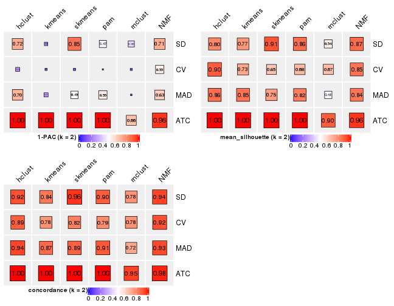</p>

</div>
<div id='tab-collect-stats-from-consensus-partition-list-2'>
<pre><code class="r">collect_stats(res_list, k = 3)
</code></pre>

<p>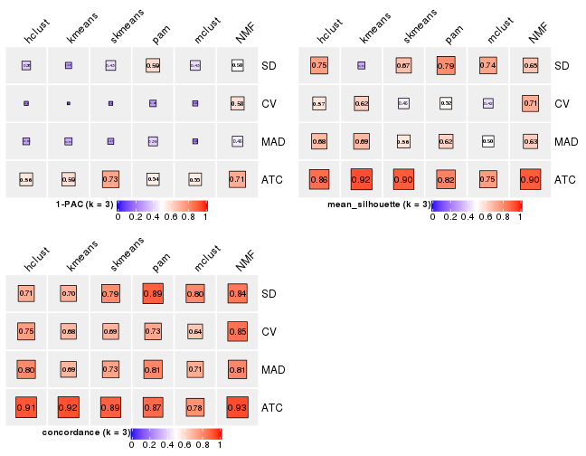</p>

</div>
<div id='tab-collect-stats-from-consensus-partition-list-3'>
<pre><code class="r">collect_stats(res_list, k = 4)
</code></pre>

<p>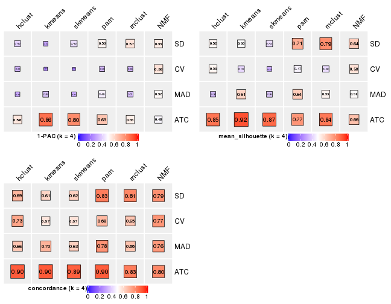</p>

</div>
<div id='tab-collect-stats-from-consensus-partition-list-4'>
<pre><code class="r">collect_stats(res_list, k = 5)
</code></pre>

<p>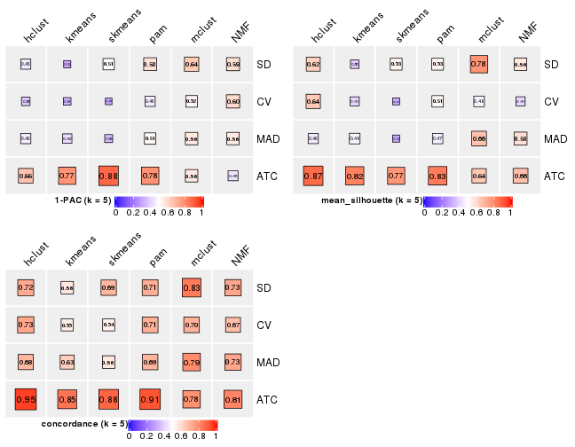</p>

</div>
<div id='tab-collect-stats-from-consensus-partition-list-5'>
<pre><code class="r">collect_stats(res_list, k = 6)
</code></pre>

<p>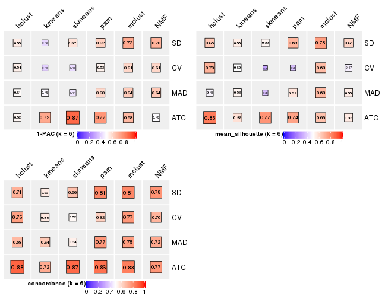</p>

</div>
</div>

### Partition from all methods


Collect partitions from all methods:


<script>
$( function() {
	$( '#tabs-collect-classes-from-consensus-partition-list' ).tabs();
} );
</script>
<div id='tabs-collect-classes-from-consensus-partition-list'>
<ul>
<li><a href='#tab-collect-classes-from-consensus-partition-list-1'>k = 2</a></li>
<li><a href='#tab-collect-classes-from-consensus-partition-list-2'>k = 3</a></li>
<li><a href='#tab-collect-classes-from-consensus-partition-list-3'>k = 4</a></li>
<li><a href='#tab-collect-classes-from-consensus-partition-list-4'>k = 5</a></li>
<li><a href='#tab-collect-classes-from-consensus-partition-list-5'>k = 6</a></li>
</ul>
<div id='tab-collect-classes-from-consensus-partition-list-1'>
<pre><code class="r">collect_classes(res_list, k = 2)
</code></pre>

<p>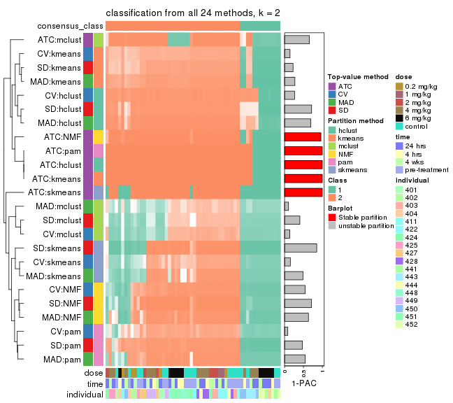</p>

</div>
<div id='tab-collect-classes-from-consensus-partition-list-2'>
<pre><code class="r">collect_classes(res_list, k = 3)
</code></pre>

<p>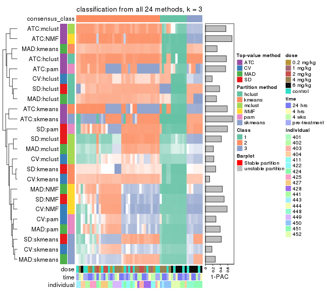</p>

</div>
<div id='tab-collect-classes-from-consensus-partition-list-3'>
<pre><code class="r">collect_classes(res_list, k = 4)
</code></pre>

<p>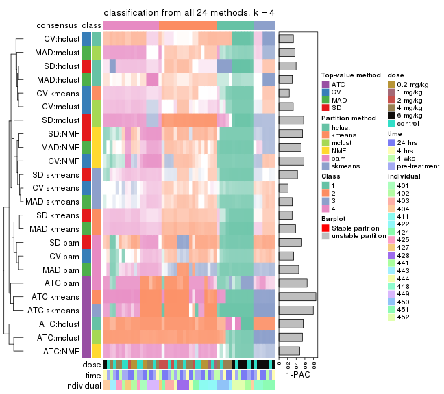</p>

</div>
<div id='tab-collect-classes-from-consensus-partition-list-4'>
<pre><code class="r">collect_classes(res_list, k = 5)
</code></pre>

<p>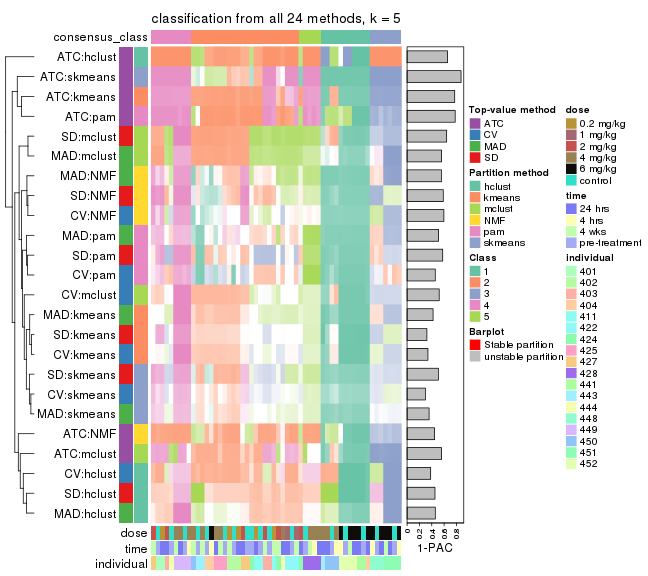</p>

</div>
<div id='tab-collect-classes-from-consensus-partition-list-5'>
<pre><code class="r">collect_classes(res_list, k = 6)
</code></pre>

<p>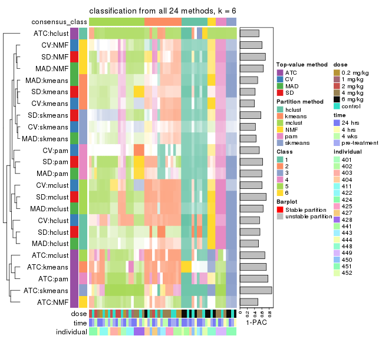</p>

</div>
</div>


### Top rows overlap


Overlap of top rows from different top-row methods:


<script>
$( function() {
	$( '#tabs-top-rows-overlap-by-euler' ).tabs();
} );
</script>
<div id='tabs-top-rows-overlap-by-euler'>
<ul>
<li><a href='#tab-top-rows-overlap-by-euler-1'>top_n = 1000</a></li>
<li><a href='#tab-top-rows-overlap-by-euler-2'>top_n = 2000</a></li>
<li><a href='#tab-top-rows-overlap-by-euler-3'>top_n = 3000</a></li>
<li><a href='#tab-top-rows-overlap-by-euler-4'>top_n = 4000</a></li>
<li><a href='#tab-top-rows-overlap-by-euler-5'>top_n = 5000</a></li>
</ul>
<div id='tab-top-rows-overlap-by-euler-1'>
<pre><code class="r">top_rows_overlap(res_list, top_n = 1000, method = &quot;euler&quot;)
</code></pre>

<p>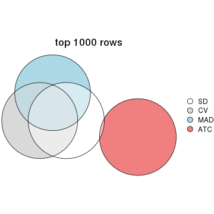</p>

</div>
<div id='tab-top-rows-overlap-by-euler-2'>
<pre><code class="r">top_rows_overlap(res_list, top_n = 2000, method = &quot;euler&quot;)
</code></pre>

<p>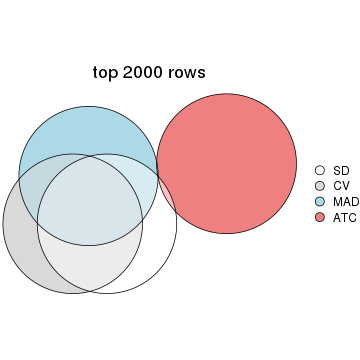</p>

</div>
<div id='tab-top-rows-overlap-by-euler-3'>
<pre><code class="r">top_rows_overlap(res_list, top_n = 3000, method = &quot;euler&quot;)
</code></pre>

<p>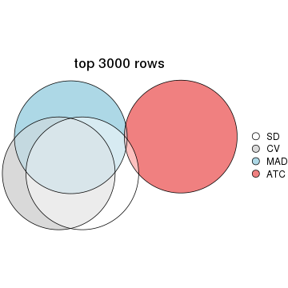</p>

</div>
<div id='tab-top-rows-overlap-by-euler-4'>
<pre><code class="r">top_rows_overlap(res_list, top_n = 4000, method = &quot;euler&quot;)
</code></pre>

<p>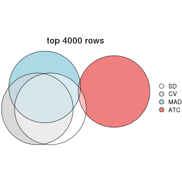</p>

</div>
<div id='tab-top-rows-overlap-by-euler-5'>
<pre><code class="r">top_rows_overlap(res_list, top_n = 5000, method = &quot;euler&quot;)
</code></pre>

<p>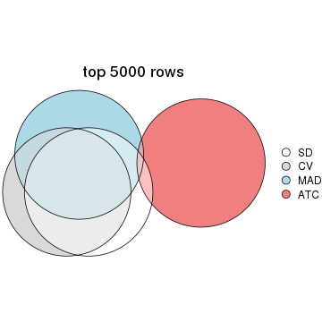</p>

</div>
</div>

Also visualize the correspondance of rankings between different top-row methods:


<script>
$( function() {
	$( '#tabs-top-rows-overlap-by-correspondance' ).tabs();
} );
</script>
<div id='tabs-top-rows-overlap-by-correspondance'>
<ul>
<li><a href='#tab-top-rows-overlap-by-correspondance-1'>top_n = 1000</a></li>
<li><a href='#tab-top-rows-overlap-by-correspondance-2'>top_n = 2000</a></li>
<li><a href='#tab-top-rows-overlap-by-correspondance-3'>top_n = 3000</a></li>
<li><a href='#tab-top-rows-overlap-by-correspondance-4'>top_n = 4000</a></li>
<li><a href='#tab-top-rows-overlap-by-correspondance-5'>top_n = 5000</a></li>
</ul>
<div id='tab-top-rows-overlap-by-correspondance-1'>
<pre><code class="r">top_rows_overlap(res_list, top_n = 1000, method = &quot;correspondance&quot;)
</code></pre>

<p>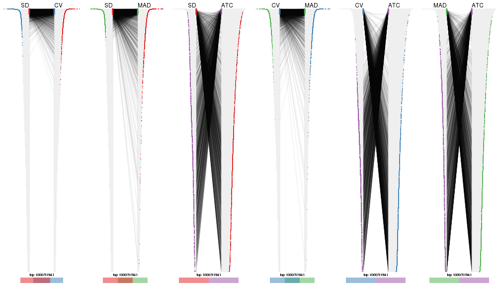</p>

</div>
<div id='tab-top-rows-overlap-by-correspondance-2'>
<pre><code class="r">top_rows_overlap(res_list, top_n = 2000, method = &quot;correspondance&quot;)
</code></pre>

<p>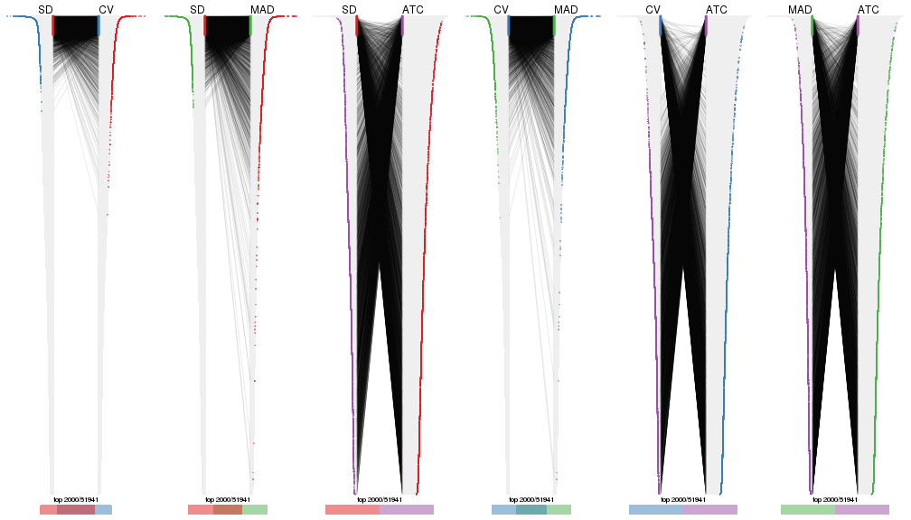</p>

</div>
<div id='tab-top-rows-overlap-by-correspondance-3'>
<pre><code class="r">top_rows_overlap(res_list, top_n = 3000, method = &quot;correspondance&quot;)
</code></pre>

<p>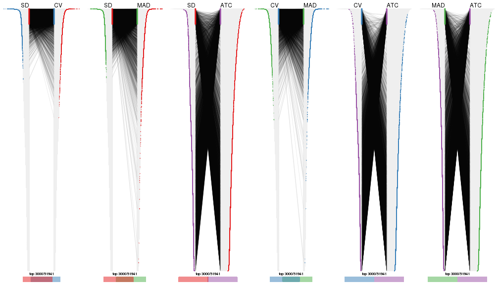</p>

</div>
<div id='tab-top-rows-overlap-by-correspondance-4'>
<pre><code class="r">top_rows_overlap(res_list, top_n = 4000, method = &quot;correspondance&quot;)
</code></pre>

<p>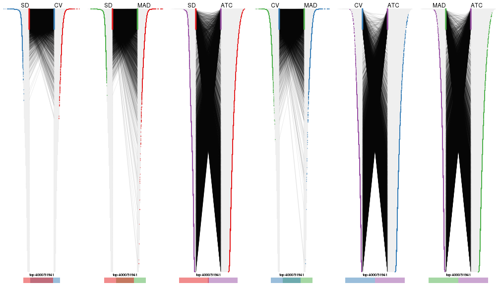</p>

</div>
<div id='tab-top-rows-overlap-by-correspondance-5'>
<pre><code class="r">top_rows_overlap(res_list, top_n = 5000, method = &quot;correspondance&quot;)
</code></pre>

<p>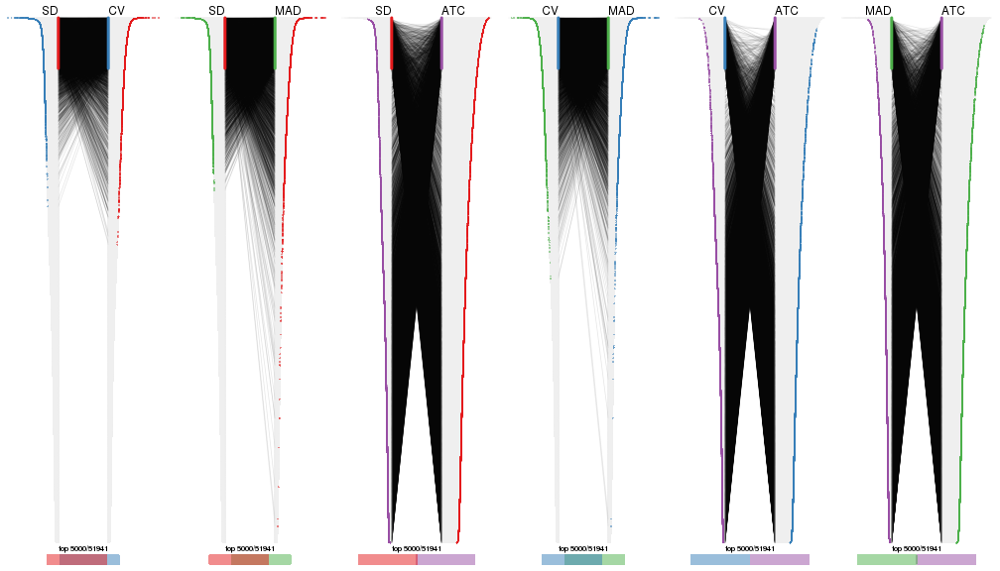</p>

</div>
</div>


Heatmaps of the top rows:


<script>
$( function() {
	$( '#tabs-top-rows-heatmap' ).tabs();
} );
</script>
<div id='tabs-top-rows-heatmap'>
<ul>
<li><a href='#tab-top-rows-heatmap-1'>top_n = 1000</a></li>
<li><a href='#tab-top-rows-heatmap-2'>top_n = 2000</a></li>
<li><a href='#tab-top-rows-heatmap-3'>top_n = 3000</a></li>
<li><a href='#tab-top-rows-heatmap-4'>top_n = 4000</a></li>
<li><a href='#tab-top-rows-heatmap-5'>top_n = 5000</a></li>
</ul>
<div id='tab-top-rows-heatmap-1'>
<pre><code class="r">top_rows_heatmap(res_list, top_n = 1000)
</code></pre>

<p></p>

</div>
<div id='tab-top-rows-heatmap-2'>
<pre><code class="r">top_rows_heatmap(res_list, top_n = 2000)
</code></pre>

<p>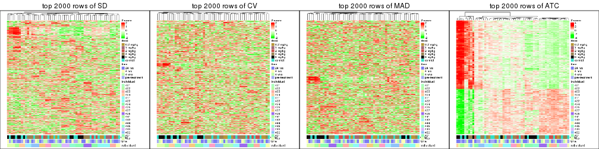</p>

</div>
<div id='tab-top-rows-heatmap-3'>
<pre><code class="r">top_rows_heatmap(res_list, top_n = 3000)
</code></pre>

<p>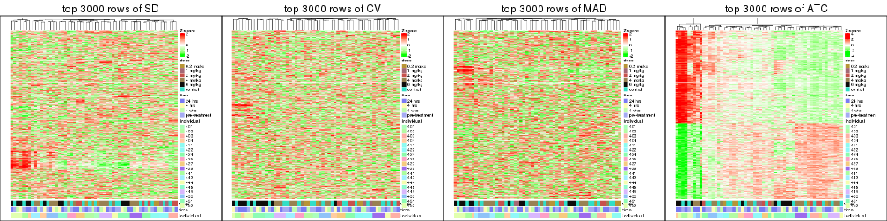</p>

</div>
<div id='tab-top-rows-heatmap-4'>
<pre><code class="r">top_rows_heatmap(res_list, top_n = 4000)
</code></pre>

<p>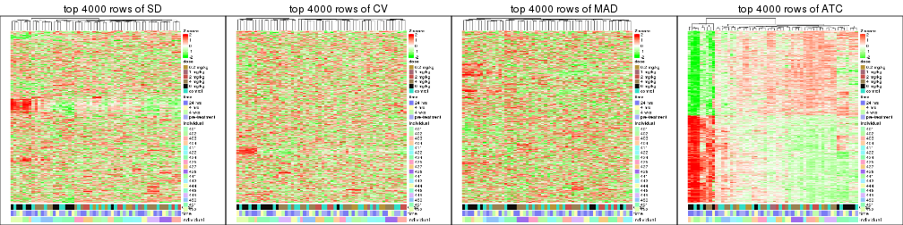</p>

</div>
<div id='tab-top-rows-heatmap-5'>
<pre><code class="r">top_rows_heatmap(res_list, top_n = 5000)
</code></pre>

<p>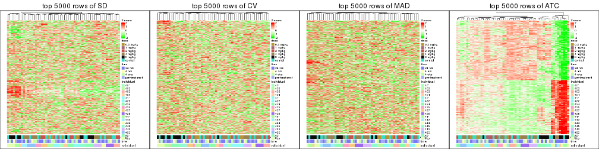</p>

</div>
</div>


### Test to known annotations


Test correlation between subgroups and known annotations. If the known
annotation is numeric, one-way ANOVA test is applied, and if the known
annotation is discrete, chi-squared contingency table test is applied.


<script>
$( function() {
	$( '#tabs-test-to-known-factors-from-consensus-partition-list' ).tabs();
} );
</script>
<div id='tabs-test-to-known-factors-from-consensus-partition-list'>
<ul>
<li><a href='#tab-test-to-known-factors-from-consensus-partition-list-1'>k = 2</a></li>
<li><a href='#tab-test-to-known-factors-from-consensus-partition-list-2'>k = 3</a></li>
<li><a href='#tab-test-to-known-factors-from-consensus-partition-list-3'>k = 4</a></li>
<li><a href='#tab-test-to-known-factors-from-consensus-partition-list-4'>k = 5</a></li>
<li><a href='#tab-test-to-known-factors-from-consensus-partition-list-5'>k = 6</a></li>
</ul>
<div id='tab-test-to-known-factors-from-consensus-partition-list-1'>
<pre><code class="r">test_to_known_factors(res_list, k = 2)
</code></pre>

<pre><code>#&gt;              n  dose(p) time(p) individual(p) k
#&gt; SD:NMF      53 4.11e-01   0.685      1.14e-04 2
#&gt; CV:NMF      55 4.27e-01   0.711      3.20e-04 2
#&gt; MAD:NMF     52 4.32e-01   0.642      1.76e-04 2
#&gt; ATC:NMF     56 1.59e-01   0.496      5.13e-04 2
#&gt; SD:skmeans  54 6.25e-01   0.941      2.65e-05 2
#&gt; CV:skmeans  44 1.35e-01   0.878      1.97e-04 2
#&gt; MAD:skmeans 50 4.17e-01   0.818      1.57e-04 2
#&gt; ATC:skmeans 56 4.98e-01   0.769      4.15e-05 2
#&gt; SD:mclust   40 1.34e-01   0.713      2.55e-04 2
#&gt; CV:mclust   51 4.83e-01   0.988      1.59e-05 2
#&gt; MAD:mclust  30 1.70e-01   0.630      1.58e-03 2
#&gt; ATC:mclust  53 8.37e-05   0.284      3.09e-04 2
#&gt; SD:kmeans   48 1.37e-01   0.617      4.75e-05 2
#&gt; CV:kmeans   54 1.72e-01   0.562      1.30e-04 2
#&gt; MAD:kmeans  56 1.59e-01   0.496      5.13e-04 2
#&gt; ATC:kmeans  56 7.84e-02   0.415      1.08e-03 2
#&gt; SD:pam      54 2.07e-01   0.830      1.58e-04 2
#&gt; CV:pam      47 3.23e-01   0.687      2.70e-04 2
#&gt; MAD:pam     53 2.10e-01   0.600      2.81e-04 2
#&gt; ATC:pam     56 7.84e-02   0.415      1.08e-03 2
#&gt; SD:hclust   47 1.83e-02   0.894      3.68e-05 2
#&gt; CV:hclust   56 1.12e-02   0.894      4.37e-05 2
#&gt; MAD:hclust  52 1.96e-02   0.891      8.82e-05 2
#&gt; ATC:hclust  56 7.84e-02   0.415      1.08e-03 2
</code></pre>

</div>
<div id='tab-test-to-known-factors-from-consensus-partition-list-2'>
<pre><code class="r">test_to_known_factors(res_list, k = 3)
</code></pre>

<pre><code>#&gt;              n dose(p) time(p) individual(p) k
#&gt; SD:NMF      46 0.18429   0.885      3.80e-07 3
#&gt; CV:NMF      47 0.38993   1.000      5.18e-08 3
#&gt; MAD:NMF     45 0.13585   0.819      1.95e-07 3
#&gt; ATC:NMF     54 0.00365   0.537      1.26e-07 3
#&gt; SD:skmeans  49 0.19318   0.995      3.83e-09 3
#&gt; CV:skmeans  26 0.06357   0.702      1.14e-04 3
#&gt; MAD:skmeans 41 0.11043   0.767      2.87e-06 3
#&gt; ATC:skmeans 55 0.38738   0.925      2.88e-07 3
#&gt; SD:mclust   51 0.01335   0.747      3.12e-09 3
#&gt; CV:mclust   24 0.19205   0.947      1.14e-03 3
#&gt; MAD:mclust  31 0.45148   0.720      5.87e-04 3
#&gt; ATC:mclust  54 0.00114   0.225      7.88e-07 3
#&gt; SD:kmeans   14 0.07844   0.548      1.56e-02 3
#&gt; CV:kmeans   42 0.00246   0.393      2.25e-04 3
#&gt; MAD:kmeans  55 0.16147   0.542      1.37e-04 3
#&gt; ATC:kmeans  55 0.18511   0.744      6.29e-06 3
#&gt; SD:pam      51 0.29291   0.969      1.08e-07 3
#&gt; CV:pam      36 0.35938   0.948      2.61e-05 3
#&gt; MAD:pam     41 0.25702   0.947      8.33e-06 3
#&gt; ATC:pam     52 0.28100   0.333      1.30e-04 3
#&gt; SD:hclust   54 0.00564   0.992      1.24e-09 3
#&gt; CV:hclust   40 0.00762   0.904      3.39e-07 3
#&gt; MAD:hclust  49 0.01279   0.970      2.76e-08 3
#&gt; ATC:hclust  55 0.17988   0.239      2.28e-03 3
</code></pre>

</div>
<div id='tab-test-to-known-factors-from-consensus-partition-list-3'>
<pre><code class="r">test_to_known_factors(res_list, k = 4)
</code></pre>

<pre><code>#&gt;              n  dose(p) time(p) individual(p) k
#&gt; SD:NMF      42 0.076986   0.852      6.36e-09 4
#&gt; CV:NMF      36 0.219502   1.000      2.14e-08 4
#&gt; MAD:NMF     31 0.041354   0.944      1.27e-07 4
#&gt; ATC:NMF     46 0.010089   0.359      3.51e-06 4
#&gt; SD:skmeans  19 0.025833   0.544      8.19e-03 4
#&gt; CV:skmeans  10       NA      NA            NA 4
#&gt; MAD:skmeans 20 0.174603   0.854      2.55e-04 4
#&gt; ATC:skmeans 54 0.026109   0.889      1.48e-10 4
#&gt; SD:mclust   55 0.006846   0.911      7.52e-13 4
#&gt; CV:mclust   26 0.057303   0.684      2.76e-04 4
#&gt; MAD:mclust  29 0.114153   0.645      1.16e-04 4
#&gt; ATC:mclust  56 0.001142   0.541      7.68e-08 4
#&gt; SD:kmeans   24 0.034292   0.746      5.11e-04 4
#&gt; CV:kmeans    9       NA      NA            NA 4
#&gt; MAD:kmeans  43 0.030893   0.758      2.05e-06 4
#&gt; ATC:kmeans  55 0.005688   0.786      1.09e-09 4
#&gt; SD:pam      50 0.193081   0.990      1.21e-10 4
#&gt; CV:pam      31 0.225135   0.632      1.00e-05 4
#&gt; MAD:pam     46 0.225887   0.984      1.38e-08 4
#&gt; ATC:pam     50 0.335880   0.597      1.22e-05 4
#&gt; SD:hclust   32 0.000697   0.983      7.87e-09 4
#&gt; CV:hclust   34 0.010367   0.952      1.83e-06 4
#&gt; MAD:hclust  15 0.024582   0.992      2.11e-04 4
#&gt; ATC:hclust  55 0.264757   0.527      3.35e-03 4
</code></pre>

</div>
<div id='tab-test-to-known-factors-from-consensus-partition-list-4'>
<pre><code class="r">test_to_known_factors(res_list, k = 5)
</code></pre>

<pre><code>#&gt;              n dose(p) time(p) individual(p) k
#&gt; SD:NMF      30 0.04081   0.911      3.49e-07 5
#&gt; CV:NMF      27 0.26952   0.983      1.42e-06 5
#&gt; MAD:NMF     39 0.00327   0.996      2.52e-12 5
#&gt; ATC:NMF     47 0.00868   0.618      4.20e-09 5
#&gt; SD:skmeans  32 0.06265   0.879      4.03e-08 5
#&gt; CV:skmeans  14 0.11813   0.496      2.96e-02 5
#&gt; MAD:skmeans 15 0.17427   0.816      1.04e-02 5
#&gt; ATC:skmeans 44 0.04307   0.750      5.15e-08 5
#&gt; SD:mclust   51 0.00330   0.991      1.69e-15 5
#&gt; CV:mclust   27 0.14793   0.742      1.88e-04 5
#&gt; MAD:mclust  49 0.00471   0.985      2.57e-14 5
#&gt; ATC:mclust  45 0.01568   0.491      1.23e-07 5
#&gt; SD:kmeans   15 0.12001   0.870      2.03e-02 5
#&gt; CV:kmeans   13 0.12021   0.738      2.34e-02 5
#&gt; MAD:kmeans  27 0.07031   0.866      1.74e-07 5
#&gt; ATC:kmeans  54 0.01104   0.731      2.65e-09 5
#&gt; SD:pam      37 0.23477   0.992      5.52e-10 5
#&gt; CV:pam      28 0.05477   0.799      1.04e-05 5
#&gt; MAD:pam     29 0.19476   0.993      1.86e-07 5
#&gt; ATC:pam     54 0.06876   0.621      4.95e-10 5
#&gt; SD:hclust   34 0.00359   0.985      2.19e-12 5
#&gt; CV:hclust   40 0.06661   0.934      3.27e-10 5
#&gt; MAD:hclust  21 0.00342   0.998      1.39e-08 5
#&gt; ATC:hclust  55 0.40468   0.757      5.24e-05 5
</code></pre>

</div>
<div id='tab-test-to-known-factors-from-consensus-partition-list-5'>
<pre><code class="r">test_to_known_factors(res_list, k = 6)
</code></pre>

<pre><code>#&gt;              n dose(p) time(p) individual(p) k
#&gt; SD:NMF      40 0.01122   0.970      1.34e-14 6
#&gt; CV:NMF      31 0.10152   0.996      1.58e-10 6
#&gt; MAD:NMF     37 0.00666   0.937      1.56e-11 6
#&gt; ATC:NMF     41 0.02189   0.743      3.98e-07 6
#&gt; SD:skmeans  33 0.03727   0.834      8.34e-08 6
#&gt; CV:skmeans  12 0.02606   0.712      1.74e-02 6
#&gt; MAD:skmeans 18 0.12241   0.924      3.24e-04 6
#&gt; ATC:skmeans 46 0.00764   0.886      7.07e-12 6
#&gt; SD:mclust   54 0.02629   0.983      3.80e-19 6
#&gt; CV:mclust   51 0.05000   0.970      2.31e-17 6
#&gt; MAD:mclust  46 0.03342   0.938      3.69e-16 6
#&gt; ATC:mclust  47 0.00897   0.225      2.22e-08 6
#&gt; SD:kmeans   25 0.01355   0.998      6.36e-09 6
#&gt; CV:kmeans   27 0.03215   0.847      1.74e-08 6
#&gt; MAD:kmeans  20 0.19666   0.967      1.28e-05 6
#&gt; ATC:kmeans  43 0.00029   0.779      6.65e-09 6
#&gt; SD:pam      45 0.03481   0.995      7.13e-14 6
#&gt; CV:pam      25 0.38239   0.940      2.11e-06 6
#&gt; MAD:pam     35 0.07061   0.892      5.29e-10 6
#&gt; ATC:pam     51 0.13279   0.745      1.27e-09 6
#&gt; SD:hclust   34 0.00388   0.995      5.49e-15 6
#&gt; CV:hclust   48 0.03820   0.997      1.42e-19 6
#&gt; MAD:hclust  21 0.05614   0.997      1.39e-08 6
#&gt; ATC:hclust  55 0.35522   0.555      2.34e-05 6
</code></pre>

</div>
</div>


 
## Results for each method


---------------------------------------------------


### SD:hclust


The object with results only for a single top-value method and a single partition method 
can be extracted as:

```r
res = res_list["SD", "hclust"]
# you can also extract it by
# res = res_list["SD:hclust"]
```

A summary of `res` and all the functions that can be applied to it:

```r
res
```

```
#> A 'ConsensusPartition' object with k = 2, 3, 4, 5, 6.
#>   On a matrix with 51941 rows and 56 columns.
#>   Top rows (1000, 2000, 3000, 4000, 5000) are extracted by 'SD' method.
#>   Subgroups are detected by 'hclust' method.
#>   Performed in total 1250 partitions by row resampling.
#>   Best k for subgroups seems to be 3.
#> 
#> Following methods can be applied to this 'ConsensusPartition' object:
#>  [1] "cola_report"             "collect_classes"         "collect_plots"          
#>  [4] "collect_stats"           "colnames"                "compare_signatures"     
#>  [7] "consensus_heatmap"       "dimension_reduction"     "functional_enrichment"  
#> [10] "get_anno_col"            "get_anno"                "get_classes"            
#> [13] "get_consensus"           "get_matrix"              "get_membership"         
#> [16] "get_param"               "get_signatures"          "get_stats"              
#> [19] "is_best_k"               "is_stable_k"             "membership_heatmap"     
#> [22] "ncol"                    "nrow"                    "plot_ecdf"              
#> [25] "rownames"                "select_partition_number" "show"                   
#> [28] "suggest_best_k"          "test_to_known_factors"
```

`collect_plots()` function collects all the plots made from `res` for all `k` (number of partitions)
into one single page to provide an easy and fast comparison between different `k`.

```r
collect_plots(res)
```

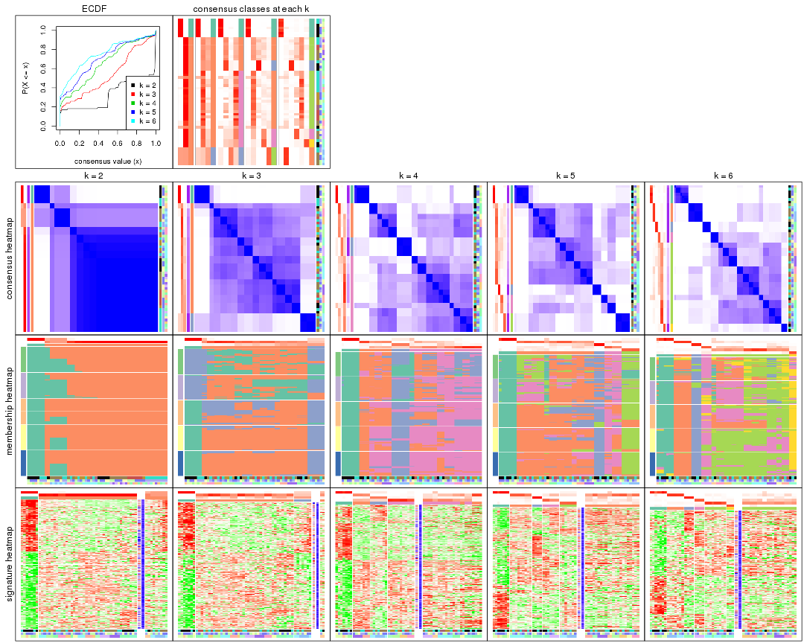

The plots are:

- The first row: a plot of the ECDF (empirical cumulative distribution
  function) curves of the consensus matrix for each `k` and the heatmap of
  predicted classes for each `k`.
- The second row: heatmaps of the consensus matrix for each `k`.
- The third row: heatmaps of the membership matrix for each `k`.
- The fouth row: heatmaps of the signatures for each `k`.

All the plots in panels can be made by individual functions and they are
plotted later in this section.

`select_partition_number()` produces several plots showing different
statistics for choosing "optimized" `k`. There are following statistics:

- ECDF curves of the consensus matrix for each `k`;
- 1-PAC. [The PAC
  score](https://en.wikipedia.org/wiki/Consensus_clustering#Over-interpretation_potential_of_consensus_clustering)
  measures the proportion of the ambiguous subgrouping.
- Mean silhouette score.
- Concordance. The mean probability of fiting the consensus class ids in all
  partitions.
- Area increased. Denote $A_k$ as the area under the ECDF curve for current
  `k`, the area increased is defined as $A_k - A_{k-1}$.
- Rand index. The percent of pairs of samples that are both in a same cluster
  or both are not in a same cluster in the partition of k and k-1.
- Jaccard index. The ratio of pairs of samples are both in a same cluster in
  the partition of k and k-1 and the pairs of samples are both in a same
  cluster in the partition k or k-1.

The detailed explanations of these statistics can be found in [the _cola_
vignette](http://bioconductor.org/packages/devel/bioc/vignettes/cola/inst/doc/cola.html#toc_13).

Generally speaking, lower PAC score, higher mean silhouette score or higher
concordance corresponds to better partition. Rand index and Jaccard index
measure how similar the current partition is compared to partition with `k-1`.
If they are too similar, we won't accept `k` is better than `k-1`.

```r
select_partition_number(res)
```

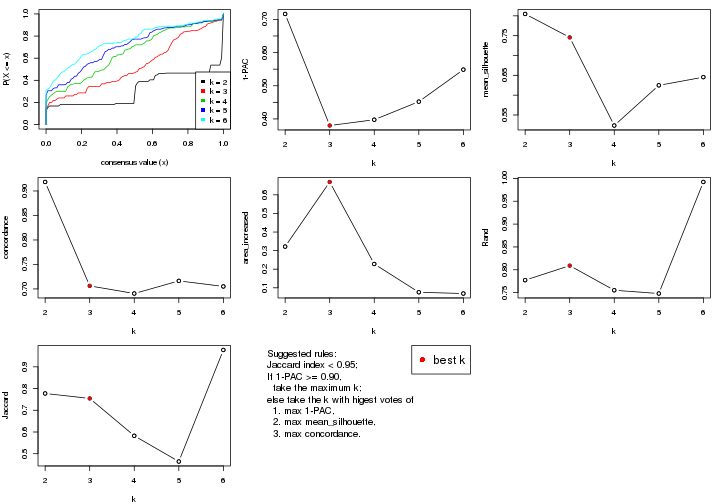

The numeric values for all these statistics can be obtained by `get_stats()`.

```r
get_stats(res)
```

```
#>   k 1-PAC mean_silhouette concordance area_increased  Rand Jaccard
#> 2 2 0.716           0.805       0.918         0.3218 0.777   0.777
#> 3 3 0.380           0.746       0.706         0.6693 0.809   0.754
#> 4 4 0.398           0.523       0.691         0.2281 0.755   0.583
#> 5 5 0.452           0.625       0.716         0.0760 0.748   0.464
#> 6 6 0.549           0.645       0.705         0.0692 0.992   0.978
```

`suggest_best_k()` suggests the best $k$ based on these statistics. The rules are as follows:

- All $k$ with Jaccard index larger than 0.95 are removed because increasing
  $k$ does not provide enough extra information. If all $k$ are removed, it is
  marked as no subgroup is detected.
- For all $k$ with 1-PAC score larger than 0.9, the maximal $k$ is taken as
  the best $k$, and other $k$ are marked as optional $k$.
- If it does not fit the second rule. The $k$ with the maximal vote of the
  highest 1-PAC score, highest mean silhouette, and highest concordance is
  taken as the best $k$.

```r
suggest_best_k(res)
```

```
#> [1] 3
```


Following shows the table of the partitions (You need to click the **show/hide
code output** link to see it). The membership matrix (columns with name `p*`)
is inferred by
[`clue::cl_consensus()`](https://www.rdocumentation.org/link/cl_consensus?package=clue)
function with the `SE` method. Basically the value in the membership matrix
represents the probability to belong to a certain group. The finall class
label for an item is determined with the group with highest probability it
belongs to.

In `get_classes()` function, the entropy is calculated from the membership
matrix and the silhouette score is calculated from the consensus matrix.


<script>
$( function() {
	$( '#tabs-SD-hclust-get-classes' ).tabs();
} );
</script>
<div id='tabs-SD-hclust-get-classes'>
<ul>
<li><a href='#tab-SD-hclust-get-classes-1'>k = 2</a></li>
<li><a href='#tab-SD-hclust-get-classes-2'>k = 3</a></li>
<li><a href='#tab-SD-hclust-get-classes-3'>k = 4</a></li>
<li><a href='#tab-SD-hclust-get-classes-4'>k = 5</a></li>
<li><a href='#tab-SD-hclust-get-classes-5'>k = 6</a></li>
</ul>

<div id='tab-SD-hclust-get-classes-1'>
<p><a id='tab-SD-hclust-get-classes-1-a' style='color:#0366d6' href='#'>show/hide code output</a></p>
<pre><code class="r">cbind(get_classes(res, k = 2), get_membership(res, k = 2))
</code></pre>

<pre><code>#&gt;           class entropy silhouette    p1    p2
#&gt; GSM687644     2  0.0000      0.900 0.000 1.000
#&gt; GSM687648     2  0.1184      0.892 0.016 0.984
#&gt; GSM687653     2  0.0000      0.900 0.000 1.000
#&gt; GSM687658     2  0.9635      0.446 0.388 0.612
#&gt; GSM687663     2  0.0672      0.897 0.008 0.992
#&gt; GSM687668     2  0.0376      0.898 0.004 0.996
#&gt; GSM687673     2  0.0000      0.900 0.000 1.000
#&gt; GSM687678     2  0.4022      0.847 0.080 0.920
#&gt; GSM687683     2  0.0000      0.900 0.000 1.000
#&gt; GSM687688     2  0.0000      0.900 0.000 1.000
#&gt; GSM687695     1  0.0000      1.000 1.000 0.000
#&gt; GSM687699     2  1.0000      0.197 0.496 0.504
#&gt; GSM687704     2  0.0000      0.900 0.000 1.000
#&gt; GSM687707     2  0.0000      0.900 0.000 1.000
#&gt; GSM687712     2  0.0000      0.900 0.000 1.000
#&gt; GSM687719     2  1.0000      0.197 0.496 0.504
#&gt; GSM687724     2  0.0000      0.900 0.000 1.000
#&gt; GSM687728     1  0.0000      1.000 1.000 0.000
#&gt; GSM687646     2  0.0000      0.900 0.000 1.000
#&gt; GSM687649     2  0.1184      0.892 0.016 0.984
#&gt; GSM687665     2  0.0672      0.897 0.008 0.992
#&gt; GSM687651     2  0.1184      0.892 0.016 0.984
#&gt; GSM687667     2  0.0672      0.897 0.008 0.992
#&gt; GSM687670     2  0.0376      0.898 0.004 0.996
#&gt; GSM687671     2  0.0376      0.898 0.004 0.996
#&gt; GSM687654     2  0.0000      0.900 0.000 1.000
#&gt; GSM687675     2  0.0000      0.900 0.000 1.000
#&gt; GSM687685     2  0.0000      0.900 0.000 1.000
#&gt; GSM687656     2  0.0000      0.900 0.000 1.000
#&gt; GSM687677     2  0.0000      0.900 0.000 1.000
#&gt; GSM687687     2  0.0000      0.900 0.000 1.000
#&gt; GSM687692     2  0.0000      0.900 0.000 1.000
#&gt; GSM687716     2  0.0000      0.900 0.000 1.000
#&gt; GSM687722     2  1.0000      0.197 0.496 0.504
#&gt; GSM687680     2  0.4022      0.847 0.080 0.920
#&gt; GSM687690     2  0.0000      0.900 0.000 1.000
#&gt; GSM687700     2  1.0000      0.197 0.496 0.504
#&gt; GSM687705     2  0.0000      0.900 0.000 1.000
#&gt; GSM687714     2  0.0000      0.900 0.000 1.000
#&gt; GSM687721     2  1.0000      0.197 0.496 0.504
#&gt; GSM687682     2  0.4022      0.847 0.080 0.920
#&gt; GSM687694     2  0.0000      0.900 0.000 1.000
#&gt; GSM687702     2  1.0000      0.197 0.496 0.504
#&gt; GSM687718     2  0.0000      0.900 0.000 1.000
#&gt; GSM687723     2  1.0000      0.197 0.496 0.504
#&gt; GSM687661     2  0.9635      0.446 0.388 0.612
#&gt; GSM687710     2  0.0000      0.900 0.000 1.000
#&gt; GSM687726     2  0.0000      0.900 0.000 1.000
#&gt; GSM687730     1  0.0000      1.000 1.000 0.000
#&gt; GSM687660     1  0.0000      1.000 1.000 0.000
#&gt; GSM687697     1  0.0000      1.000 1.000 0.000
#&gt; GSM687709     2  0.0000      0.900 0.000 1.000
#&gt; GSM687725     2  0.0000      0.900 0.000 1.000
#&gt; GSM687729     1  0.0000      1.000 1.000 0.000
#&gt; GSM687727     2  0.0000      0.900 0.000 1.000
#&gt; GSM687731     1  0.0000      1.000 1.000 0.000
</code></pre>

<script>
$('#tab-SD-hclust-get-classes-1-a').parent().next().next().hide();
$('#tab-SD-hclust-get-classes-1-a').click(function(){
  $('#tab-SD-hclust-get-classes-1-a').parent().next().next().toggle();
  return(false);
});
</script>
</div>

<div id='tab-SD-hclust-get-classes-2'>
<p><a id='tab-SD-hclust-get-classes-2-a' style='color:#0366d6' href='#'>show/hide code output</a></p>
<pre><code class="r">cbind(get_classes(res, k = 3), get_membership(res, k = 3))
</code></pre>

<pre><code>#&gt;           class entropy silhouette    p1    p2    p3
#&gt; GSM687644     2  0.2066      0.640 0.000 0.940 0.060
#&gt; GSM687648     2  0.2682      0.619 0.004 0.920 0.076
#&gt; GSM687653     2  0.6260      0.715 0.000 0.552 0.448
#&gt; GSM687658     2  0.8158      0.183 0.364 0.556 0.080
#&gt; GSM687663     2  0.4931      0.716 0.000 0.768 0.232
#&gt; GSM687668     2  0.4842      0.714 0.000 0.776 0.224
#&gt; GSM687673     2  0.5678      0.723 0.000 0.684 0.316
#&gt; GSM687678     2  0.4642      0.553 0.060 0.856 0.084
#&gt; GSM687683     2  0.1643      0.659 0.000 0.956 0.044
#&gt; GSM687688     2  0.6126      0.723 0.000 0.600 0.400
#&gt; GSM687695     1  0.0000      0.999 1.000 0.000 0.000
#&gt; GSM687699     3  0.9528      0.996 0.228 0.288 0.484
#&gt; GSM687704     2  0.6045      0.735 0.000 0.620 0.380
#&gt; GSM687707     2  0.5254      0.692 0.000 0.736 0.264
#&gt; GSM687712     2  0.4796      0.699 0.000 0.780 0.220
#&gt; GSM687719     3  0.9555      0.997 0.232 0.288 0.480
#&gt; GSM687724     2  0.6280      0.704 0.000 0.540 0.460
#&gt; GSM687728     1  0.0000      0.999 1.000 0.000 0.000
#&gt; GSM687646     2  0.2066      0.640 0.000 0.940 0.060
#&gt; GSM687649     2  0.2682      0.619 0.004 0.920 0.076
#&gt; GSM687665     2  0.4931      0.716 0.000 0.768 0.232
#&gt; GSM687651     2  0.2682      0.619 0.004 0.920 0.076
#&gt; GSM687667     2  0.4931      0.716 0.000 0.768 0.232
#&gt; GSM687670     2  0.4842      0.714 0.000 0.776 0.224
#&gt; GSM687671     2  0.4842      0.714 0.000 0.776 0.224
#&gt; GSM687654     2  0.6260      0.715 0.000 0.552 0.448
#&gt; GSM687675     2  0.5678      0.723 0.000 0.684 0.316
#&gt; GSM687685     2  0.1643      0.659 0.000 0.956 0.044
#&gt; GSM687656     2  0.6260      0.715 0.000 0.552 0.448
#&gt; GSM687677     2  0.5678      0.723 0.000 0.684 0.316
#&gt; GSM687687     2  0.1643      0.659 0.000 0.956 0.044
#&gt; GSM687692     2  0.6126      0.723 0.000 0.600 0.400
#&gt; GSM687716     2  0.4796      0.699 0.000 0.780 0.220
#&gt; GSM687722     3  0.9555      0.997 0.232 0.288 0.480
#&gt; GSM687680     2  0.4642      0.553 0.060 0.856 0.084
#&gt; GSM687690     2  0.6126      0.723 0.000 0.600 0.400
#&gt; GSM687700     3  0.9528      0.996 0.228 0.288 0.484
#&gt; GSM687705     2  0.6045      0.735 0.000 0.620 0.380
#&gt; GSM687714     2  0.4796      0.699 0.000 0.780 0.220
#&gt; GSM687721     3  0.9555      0.997 0.232 0.288 0.480
#&gt; GSM687682     2  0.4642      0.553 0.060 0.856 0.084
#&gt; GSM687694     2  0.6126      0.723 0.000 0.600 0.400
#&gt; GSM687702     3  0.9528      0.996 0.228 0.288 0.484
#&gt; GSM687718     2  0.4796      0.699 0.000 0.780 0.220
#&gt; GSM687723     3  0.9555      0.997 0.232 0.288 0.480
#&gt; GSM687661     2  0.8158      0.183 0.364 0.556 0.080
#&gt; GSM687710     2  0.5254      0.692 0.000 0.736 0.264
#&gt; GSM687726     2  0.6280      0.704 0.000 0.540 0.460
#&gt; GSM687730     1  0.0000      0.999 1.000 0.000 0.000
#&gt; GSM687660     1  0.0237      0.994 0.996 0.000 0.004
#&gt; GSM687697     1  0.0000      0.999 1.000 0.000 0.000
#&gt; GSM687709     2  0.5254      0.692 0.000 0.736 0.264
#&gt; GSM687725     2  0.6280      0.704 0.000 0.540 0.460
#&gt; GSM687729     1  0.0000      0.999 1.000 0.000 0.000
#&gt; GSM687727     2  0.6280      0.704 0.000 0.540 0.460
#&gt; GSM687731     1  0.0000      0.999 1.000 0.000 0.000
</code></pre>

<script>
$('#tab-SD-hclust-get-classes-2-a').parent().next().next().hide();
$('#tab-SD-hclust-get-classes-2-a').click(function(){
  $('#tab-SD-hclust-get-classes-2-a').parent().next().next().toggle();
  return(false);
});
</script>
</div>

<div id='tab-SD-hclust-get-classes-3'>
<p><a id='tab-SD-hclust-get-classes-3-a' style='color:#0366d6' href='#'>show/hide code output</a></p>
<pre><code class="r">cbind(get_classes(res, k = 4), get_membership(res, k = 4))
</code></pre>

<pre><code>#&gt;           class entropy silhouette    p1    p2    p3    p4
#&gt; GSM687644     4   0.147      0.539 0.000 0.000 0.052 0.948
#&gt; GSM687648     4   0.179      0.541 0.000 0.000 0.068 0.932
#&gt; GSM687653     2   0.628      0.547 0.000 0.572 0.068 0.360
#&gt; GSM687658     4   0.867      0.216 0.308 0.100 0.120 0.472
#&gt; GSM687663     4   0.592      0.176 0.000 0.320 0.056 0.624
#&gt; GSM687668     4   0.579      0.181 0.000 0.324 0.048 0.628
#&gt; GSM687673     4   0.639     -0.186 0.000 0.456 0.064 0.480
#&gt; GSM687678     4   0.421      0.521 0.044 0.024 0.088 0.844
#&gt; GSM687683     4   0.152      0.536 0.000 0.020 0.024 0.956
#&gt; GSM687688     2   0.498      0.574 0.000 0.612 0.004 0.384
#&gt; GSM687695     1   0.000      0.992 1.000 0.000 0.000 0.000
#&gt; GSM687699     3   0.612      0.996 0.112 0.000 0.668 0.220
#&gt; GSM687704     2   0.604      0.428 0.000 0.532 0.044 0.424
#&gt; GSM687707     4   0.768      0.192 0.000 0.252 0.292 0.456
#&gt; GSM687712     4   0.644      0.317 0.000 0.176 0.176 0.648
#&gt; GSM687719     3   0.617      0.997 0.116 0.000 0.664 0.220
#&gt; GSM687724     2   0.306      0.495 0.000 0.888 0.072 0.040
#&gt; GSM687728     1   0.000      0.992 1.000 0.000 0.000 0.000
#&gt; GSM687646     4   0.147      0.539 0.000 0.000 0.052 0.948
#&gt; GSM687649     4   0.179      0.541 0.000 0.000 0.068 0.932
#&gt; GSM687665     4   0.592      0.176 0.000 0.320 0.056 0.624
#&gt; GSM687651     4   0.179      0.541 0.000 0.000 0.068 0.932
#&gt; GSM687667     4   0.592      0.176 0.000 0.320 0.056 0.624
#&gt; GSM687670     4   0.579      0.181 0.000 0.324 0.048 0.628
#&gt; GSM687671     4   0.579      0.181 0.000 0.324 0.048 0.628
#&gt; GSM687654     2   0.628      0.547 0.000 0.572 0.068 0.360
#&gt; GSM687675     4   0.639     -0.186 0.000 0.456 0.064 0.480
#&gt; GSM687685     4   0.152      0.536 0.000 0.020 0.024 0.956
#&gt; GSM687656     2   0.628      0.547 0.000 0.572 0.068 0.360
#&gt; GSM687677     4   0.639     -0.186 0.000 0.456 0.064 0.480
#&gt; GSM687687     4   0.152      0.536 0.000 0.020 0.024 0.956
#&gt; GSM687692     2   0.498      0.574 0.000 0.612 0.004 0.384
#&gt; GSM687716     4   0.644      0.317 0.000 0.176 0.176 0.648
#&gt; GSM687722     3   0.617      0.997 0.116 0.000 0.664 0.220
#&gt; GSM687680     4   0.421      0.521 0.044 0.024 0.088 0.844
#&gt; GSM687690     2   0.498      0.574 0.000 0.612 0.004 0.384
#&gt; GSM687700     3   0.612      0.996 0.112 0.000 0.668 0.220
#&gt; GSM687705     2   0.604      0.428 0.000 0.532 0.044 0.424
#&gt; GSM687714     4   0.644      0.317 0.000 0.176 0.176 0.648
#&gt; GSM687721     3   0.617      0.997 0.116 0.000 0.664 0.220
#&gt; GSM687682     4   0.421      0.521 0.044 0.024 0.088 0.844
#&gt; GSM687694     2   0.498      0.574 0.000 0.612 0.004 0.384
#&gt; GSM687702     3   0.612      0.996 0.112 0.000 0.668 0.220
#&gt; GSM687718     4   0.644      0.317 0.000 0.176 0.176 0.648
#&gt; GSM687723     3   0.617      0.997 0.116 0.000 0.664 0.220
#&gt; GSM687661     4   0.867      0.216 0.308 0.100 0.120 0.472
#&gt; GSM687710     4   0.768      0.192 0.000 0.252 0.292 0.456
#&gt; GSM687726     2   0.306      0.495 0.000 0.888 0.072 0.040
#&gt; GSM687730     1   0.000      0.992 1.000 0.000 0.000 0.000
#&gt; GSM687660     1   0.121      0.951 0.960 0.000 0.040 0.000
#&gt; GSM687697     1   0.000      0.992 1.000 0.000 0.000 0.000
#&gt; GSM687709     4   0.768      0.192 0.000 0.252 0.292 0.456
#&gt; GSM687725     2   0.306      0.495 0.000 0.888 0.072 0.040
#&gt; GSM687729     1   0.000      0.992 1.000 0.000 0.000 0.000
#&gt; GSM687727     2   0.306      0.495 0.000 0.888 0.072 0.040
#&gt; GSM687731     1   0.000      0.992 1.000 0.000 0.000 0.000
</code></pre>

<script>
$('#tab-SD-hclust-get-classes-3-a').parent().next().next().hide();
$('#tab-SD-hclust-get-classes-3-a').click(function(){
  $('#tab-SD-hclust-get-classes-3-a').parent().next().next().toggle();
  return(false);
});
</script>
</div>

<div id='tab-SD-hclust-get-classes-4'>
<p><a id='tab-SD-hclust-get-classes-4-a' style='color:#0366d6' href='#'>show/hide code output</a></p>
<pre><code class="r">cbind(get_classes(res, k = 5), get_membership(res, k = 5))
</code></pre>

<pre><code>#&gt;           class entropy silhouette    p1    p2    p3    p4    p5
#&gt; GSM687644     2  0.4569      0.383 0.000 0.748 0.000 0.148 0.104
#&gt; GSM687648     2  0.4634      0.398 0.000 0.744 0.000 0.120 0.136
#&gt; GSM687653     2  0.7447      0.381 0.000 0.484 0.212 0.240 0.064
#&gt; GSM687658     2  0.7812      0.265 0.264 0.488 0.048 0.032 0.168
#&gt; GSM687663     2  0.4017      0.565 0.000 0.808 0.132 0.020 0.040
#&gt; GSM687668     2  0.3896      0.564 0.000 0.816 0.128 0.036 0.020
#&gt; GSM687673     2  0.5881      0.522 0.000 0.672 0.188 0.092 0.048
#&gt; GSM687678     2  0.5429      0.391 0.032 0.712 0.000 0.104 0.152
#&gt; GSM687683     2  0.3868      0.410 0.000 0.800 0.000 0.140 0.060
#&gt; GSM687688     2  0.6914      0.401 0.000 0.508 0.316 0.132 0.044
#&gt; GSM687695     1  0.0000      0.983 1.000 0.000 0.000 0.000 0.000
#&gt; GSM687699     5  0.4215      0.994 0.064 0.168 0.000 0.000 0.768
#&gt; GSM687704     2  0.7102      0.318 0.000 0.536 0.188 0.220 0.056
#&gt; GSM687707     4  0.4651      0.523 0.000 0.124 0.032 0.776 0.068
#&gt; GSM687712     4  0.5316      0.608 0.000 0.348 0.000 0.588 0.064
#&gt; GSM687719     5  0.4138      0.995 0.064 0.160 0.000 0.000 0.776
#&gt; GSM687724     3  0.0290      1.000 0.000 0.008 0.992 0.000 0.000
#&gt; GSM687728     1  0.0162      0.983 0.996 0.000 0.000 0.004 0.000
#&gt; GSM687646     2  0.4569      0.383 0.000 0.748 0.000 0.148 0.104
#&gt; GSM687649     2  0.4634      0.398 0.000 0.744 0.000 0.120 0.136
#&gt; GSM687665     2  0.4017      0.565 0.000 0.808 0.132 0.020 0.040
#&gt; GSM687651     2  0.4634      0.398 0.000 0.744 0.000 0.120 0.136
#&gt; GSM687667     2  0.4017      0.565 0.000 0.808 0.132 0.020 0.040
#&gt; GSM687670     2  0.3896      0.564 0.000 0.816 0.128 0.036 0.020
#&gt; GSM687671     2  0.3896      0.564 0.000 0.816 0.128 0.036 0.020
#&gt; GSM687654     2  0.7447      0.381 0.000 0.484 0.212 0.240 0.064
#&gt; GSM687675     2  0.5881      0.522 0.000 0.672 0.188 0.092 0.048
#&gt; GSM687685     2  0.3868      0.410 0.000 0.800 0.000 0.140 0.060
#&gt; GSM687656     2  0.7447      0.381 0.000 0.484 0.212 0.240 0.064
#&gt; GSM687677     2  0.5881      0.522 0.000 0.672 0.188 0.092 0.048
#&gt; GSM687687     2  0.3868      0.410 0.000 0.800 0.000 0.140 0.060
#&gt; GSM687692     2  0.6914      0.401 0.000 0.508 0.316 0.132 0.044
#&gt; GSM687716     4  0.5316      0.608 0.000 0.348 0.000 0.588 0.064
#&gt; GSM687722     5  0.4138      0.995 0.064 0.160 0.000 0.000 0.776
#&gt; GSM687680     2  0.5429      0.391 0.032 0.712 0.000 0.104 0.152
#&gt; GSM687690     2  0.6914      0.401 0.000 0.508 0.316 0.132 0.044
#&gt; GSM687700     5  0.4215      0.994 0.064 0.168 0.000 0.000 0.768
#&gt; GSM687705     2  0.7102      0.318 0.000 0.536 0.188 0.220 0.056
#&gt; GSM687714     4  0.5316      0.608 0.000 0.348 0.000 0.588 0.064
#&gt; GSM687721     5  0.4138      0.995 0.064 0.160 0.000 0.000 0.776
#&gt; GSM687682     2  0.5429      0.391 0.032 0.712 0.000 0.104 0.152
#&gt; GSM687694     2  0.6914      0.401 0.000 0.508 0.316 0.132 0.044
#&gt; GSM687702     5  0.4215      0.994 0.064 0.168 0.000 0.000 0.768
#&gt; GSM687718     4  0.5316      0.608 0.000 0.348 0.000 0.588 0.064
#&gt; GSM687723     5  0.4138      0.995 0.064 0.160 0.000 0.000 0.776
#&gt; GSM687661     2  0.7812      0.265 0.264 0.488 0.048 0.032 0.168
#&gt; GSM687710     4  0.4651      0.523 0.000 0.124 0.032 0.776 0.068
#&gt; GSM687726     3  0.0290      1.000 0.000 0.008 0.992 0.000 0.000
#&gt; GSM687730     1  0.0162      0.983 0.996 0.000 0.000 0.004 0.000
#&gt; GSM687660     1  0.1892      0.902 0.916 0.000 0.004 0.000 0.080
#&gt; GSM687697     1  0.0000      0.983 1.000 0.000 0.000 0.000 0.000
#&gt; GSM687709     4  0.4651      0.523 0.000 0.124 0.032 0.776 0.068
#&gt; GSM687725     3  0.0290      1.000 0.000 0.008 0.992 0.000 0.000
#&gt; GSM687729     1  0.0000      0.983 1.000 0.000 0.000 0.000 0.000
#&gt; GSM687727     3  0.0290      1.000 0.000 0.008 0.992 0.000 0.000
#&gt; GSM687731     1  0.0162      0.983 0.996 0.000 0.000 0.004 0.000
</code></pre>

<script>
$('#tab-SD-hclust-get-classes-4-a').parent().next().next().hide();
$('#tab-SD-hclust-get-classes-4-a').click(function(){
  $('#tab-SD-hclust-get-classes-4-a').parent().next().next().toggle();
  return(false);
});
</script>
</div>

<div id='tab-SD-hclust-get-classes-5'>
<p><a id='tab-SD-hclust-get-classes-5-a' style='color:#0366d6' href='#'>show/hide code output</a></p>
<pre><code class="r">cbind(get_classes(res, k = 6), get_membership(res, k = 6))
</code></pre>

<pre><code>#&gt;           class entropy silhouette    p1    p2    p3    p4    p5    p6
#&gt; GSM687644     5  0.6223      0.377 0.000 0.120 0.008 0.336 0.504 0.032
#&gt; GSM687648     5  0.6451      0.390 0.000 0.156 0.008 0.300 0.500 0.036
#&gt; GSM687653     5  0.6450      0.271 0.000 0.044 0.028 0.240 0.568 0.120
#&gt; GSM687658     5  0.6919      0.290 0.188 0.240 0.016 0.012 0.508 0.036
#&gt; GSM687663     5  0.1787      0.550 0.000 0.068 0.000 0.008 0.920 0.004
#&gt; GSM687668     5  0.2369      0.548 0.000 0.060 0.004 0.028 0.900 0.008
#&gt; GSM687673     5  0.3766      0.512 0.000 0.028 0.032 0.028 0.828 0.084
#&gt; GSM687678     5  0.6392      0.370 0.008 0.220 0.004 0.288 0.472 0.008
#&gt; GSM687683     5  0.5632      0.405 0.000 0.096 0.000 0.308 0.568 0.028
#&gt; GSM687688     5  0.6287      0.276 0.000 0.040 0.136 0.236 0.572 0.016
#&gt; GSM687695     1  0.2132      0.907 0.912 0.004 0.004 0.028 0.000 0.052
#&gt; GSM687699     2  0.1909      0.993 0.024 0.920 0.000 0.000 0.052 0.004
#&gt; GSM687704     5  0.5617      0.159 0.000 0.020 0.056 0.368 0.540 0.016
#&gt; GSM687707     6  0.3041      1.000 0.000 0.000 0.012 0.068 0.064 0.856
#&gt; GSM687712     4  0.3620      1.000 0.000 0.000 0.012 0.808 0.060 0.120
#&gt; GSM687719     2  0.1700      0.995 0.024 0.928 0.000 0.000 0.048 0.000
#&gt; GSM687724     3  0.0865      1.000 0.000 0.000 0.964 0.000 0.036 0.000
#&gt; GSM687728     1  0.0909      0.924 0.968 0.000 0.000 0.012 0.000 0.020
#&gt; GSM687646     5  0.6223      0.377 0.000 0.120 0.008 0.336 0.504 0.032
#&gt; GSM687649     5  0.6451      0.390 0.000 0.156 0.008 0.300 0.500 0.036
#&gt; GSM687665     5  0.1787      0.550 0.000 0.068 0.000 0.008 0.920 0.004
#&gt; GSM687651     5  0.6451      0.390 0.000 0.156 0.008 0.300 0.500 0.036
#&gt; GSM687667     5  0.1787      0.550 0.000 0.068 0.000 0.008 0.920 0.004
#&gt; GSM687670     5  0.2369      0.548 0.000 0.060 0.004 0.028 0.900 0.008
#&gt; GSM687671     5  0.2369      0.548 0.000 0.060 0.004 0.028 0.900 0.008
#&gt; GSM687654     5  0.6450      0.271 0.000 0.044 0.028 0.240 0.568 0.120
#&gt; GSM687675     5  0.3766      0.512 0.000 0.028 0.032 0.028 0.828 0.084
#&gt; GSM687685     5  0.5632      0.405 0.000 0.096 0.000 0.308 0.568 0.028
#&gt; GSM687656     5  0.6450      0.271 0.000 0.044 0.028 0.240 0.568 0.120
#&gt; GSM687677     5  0.3766      0.512 0.000 0.028 0.032 0.028 0.828 0.084
#&gt; GSM687687     5  0.5632      0.405 0.000 0.096 0.000 0.308 0.568 0.028
#&gt; GSM687692     5  0.6287      0.276 0.000 0.040 0.136 0.236 0.572 0.016
#&gt; GSM687716     4  0.3620      1.000 0.000 0.000 0.012 0.808 0.060 0.120
#&gt; GSM687722     2  0.1700      0.995 0.024 0.928 0.000 0.000 0.048 0.000
#&gt; GSM687680     5  0.6392      0.370 0.008 0.220 0.004 0.288 0.472 0.008
#&gt; GSM687690     5  0.6287      0.276 0.000 0.040 0.136 0.236 0.572 0.016
#&gt; GSM687700     2  0.1909      0.993 0.024 0.920 0.000 0.000 0.052 0.004
#&gt; GSM687705     5  0.5617      0.159 0.000 0.020 0.056 0.368 0.540 0.016
#&gt; GSM687714     4  0.3620      1.000 0.000 0.000 0.012 0.808 0.060 0.120
#&gt; GSM687721     2  0.1700      0.995 0.024 0.928 0.000 0.000 0.048 0.000
#&gt; GSM687682     5  0.6392      0.370 0.008 0.220 0.004 0.288 0.472 0.008
#&gt; GSM687694     5  0.6287      0.276 0.000 0.040 0.136 0.236 0.572 0.016
#&gt; GSM687702     2  0.1909      0.993 0.024 0.920 0.000 0.000 0.052 0.004
#&gt; GSM687718     4  0.3620      1.000 0.000 0.000 0.012 0.808 0.060 0.120
#&gt; GSM687723     2  0.1700      0.995 0.024 0.928 0.000 0.000 0.048 0.000
#&gt; GSM687661     5  0.6919      0.290 0.188 0.240 0.016 0.012 0.508 0.036
#&gt; GSM687710     6  0.3041      1.000 0.000 0.000 0.012 0.068 0.064 0.856
#&gt; GSM687726     3  0.0865      1.000 0.000 0.000 0.964 0.000 0.036 0.000
#&gt; GSM687730     1  0.1092      0.921 0.960 0.000 0.000 0.020 0.000 0.020
#&gt; GSM687660     1  0.4526      0.777 0.764 0.128 0.016 0.028 0.000 0.064
#&gt; GSM687697     1  0.2132      0.907 0.912 0.004 0.004 0.028 0.000 0.052
#&gt; GSM687709     6  0.3041      1.000 0.000 0.000 0.012 0.068 0.064 0.856
#&gt; GSM687725     3  0.0865      1.000 0.000 0.000 0.964 0.000 0.036 0.000
#&gt; GSM687729     1  0.0000      0.924 1.000 0.000 0.000 0.000 0.000 0.000
#&gt; GSM687727     3  0.0865      1.000 0.000 0.000 0.964 0.000 0.036 0.000
#&gt; GSM687731     1  0.0909      0.924 0.968 0.000 0.000 0.012 0.000 0.020
</code></pre>

<script>
$('#tab-SD-hclust-get-classes-5-a').parent().next().next().hide();
$('#tab-SD-hclust-get-classes-5-a').click(function(){
  $('#tab-SD-hclust-get-classes-5-a').parent().next().next().toggle();
  return(false);
});
</script>
</div>
</div>

Heatmaps for the consensus matrix. It visualizes the probability of two
samples to be in a same group.


<script>
$( function() {
	$( '#tabs-SD-hclust-consensus-heatmap' ).tabs();
} );
</script>
<div id='tabs-SD-hclust-consensus-heatmap'>
<ul>
<li><a href='#tab-SD-hclust-consensus-heatmap-1'>k = 2</a></li>
<li><a href='#tab-SD-hclust-consensus-heatmap-2'>k = 3</a></li>
<li><a href='#tab-SD-hclust-consensus-heatmap-3'>k = 4</a></li>
<li><a href='#tab-SD-hclust-consensus-heatmap-4'>k = 5</a></li>
<li><a href='#tab-SD-hclust-consensus-heatmap-5'>k = 6</a></li>
</ul>
<div id='tab-SD-hclust-consensus-heatmap-1'>
<pre><code class="r">consensus_heatmap(res, k = 2)
</code></pre>

<p>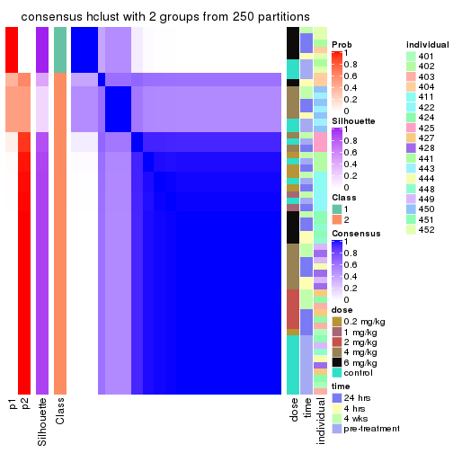</p>

</div>
<div id='tab-SD-hclust-consensus-heatmap-2'>
<pre><code class="r">consensus_heatmap(res, k = 3)
</code></pre>

<p>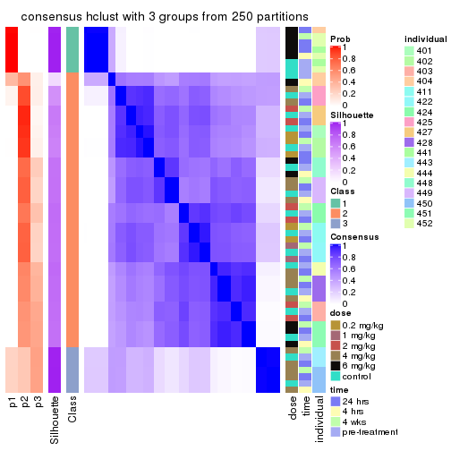</p>

</div>
<div id='tab-SD-hclust-consensus-heatmap-3'>
<pre><code class="r">consensus_heatmap(res, k = 4)
</code></pre>

<p>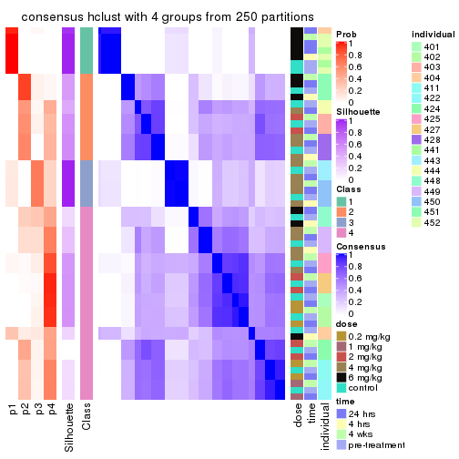</p>

</div>
<div id='tab-SD-hclust-consensus-heatmap-4'>
<pre><code class="r">consensus_heatmap(res, k = 5)
</code></pre>

<p>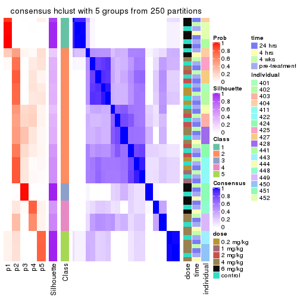</p>

</div>
<div id='tab-SD-hclust-consensus-heatmap-5'>
<pre><code class="r">consensus_heatmap(res, k = 6)
</code></pre>

<p>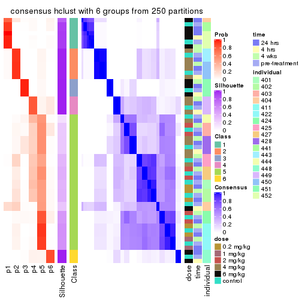</p>

</div>
</div>

Heatmaps for the membership of samples in all partitions to see how consistent they are:


<script>
$( function() {
	$( '#tabs-SD-hclust-membership-heatmap' ).tabs();
} );
</script>
<div id='tabs-SD-hclust-membership-heatmap'>
<ul>
<li><a href='#tab-SD-hclust-membership-heatmap-1'>k = 2</a></li>
<li><a href='#tab-SD-hclust-membership-heatmap-2'>k = 3</a></li>
<li><a href='#tab-SD-hclust-membership-heatmap-3'>k = 4</a></li>
<li><a href='#tab-SD-hclust-membership-heatmap-4'>k = 5</a></li>
<li><a href='#tab-SD-hclust-membership-heatmap-5'>k = 6</a></li>
</ul>
<div id='tab-SD-hclust-membership-heatmap-1'>
<pre><code class="r">membership_heatmap(res, k = 2)
</code></pre>

<p>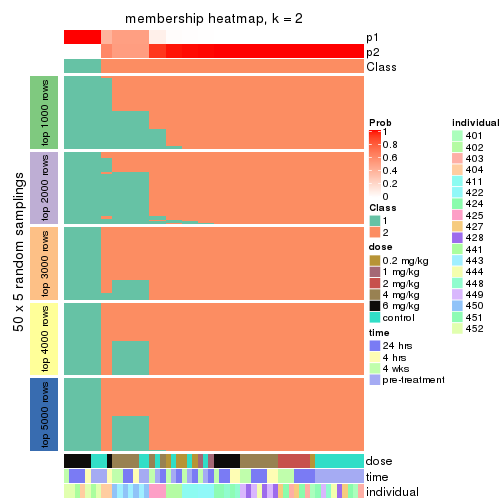</p>

</div>
<div id='tab-SD-hclust-membership-heatmap-2'>
<pre><code class="r">membership_heatmap(res, k = 3)
</code></pre>

<p>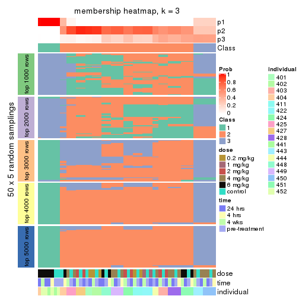</p>

</div>
<div id='tab-SD-hclust-membership-heatmap-3'>
<pre><code class="r">membership_heatmap(res, k = 4)
</code></pre>

<p>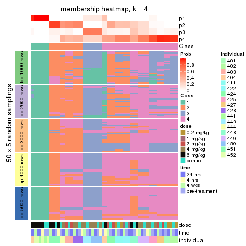</p>

</div>
<div id='tab-SD-hclust-membership-heatmap-4'>
<pre><code class="r">membership_heatmap(res, k = 5)
</code></pre>

<p>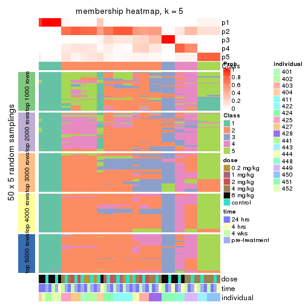</p>

</div>
<div id='tab-SD-hclust-membership-heatmap-5'>
<pre><code class="r">membership_heatmap(res, k = 6)
</code></pre>

<p>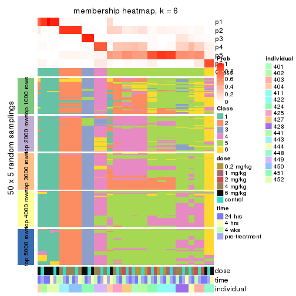</p>

</div>
</div>

As soon as we have had the classes for columns, we can look for signatures
which are significantly different between classes which can be candidate marks
for certain classes. Following are the heatmaps for signatures.


Signature heatmaps where rows are scaled:


<script>
$( function() {
	$( '#tabs-SD-hclust-get-signatures' ).tabs();
} );
</script>
<div id='tabs-SD-hclust-get-signatures'>
<ul>
<li><a href='#tab-SD-hclust-get-signatures-1'>k = 2</a></li>
<li><a href='#tab-SD-hclust-get-signatures-2'>k = 3</a></li>
<li><a href='#tab-SD-hclust-get-signatures-3'>k = 4</a></li>
<li><a href='#tab-SD-hclust-get-signatures-4'>k = 5</a></li>
<li><a href='#tab-SD-hclust-get-signatures-5'>k = 6</a></li>
</ul>
<div id='tab-SD-hclust-get-signatures-1'>
<pre><code class="r">get_signatures(res, k = 2)
</code></pre>

<p>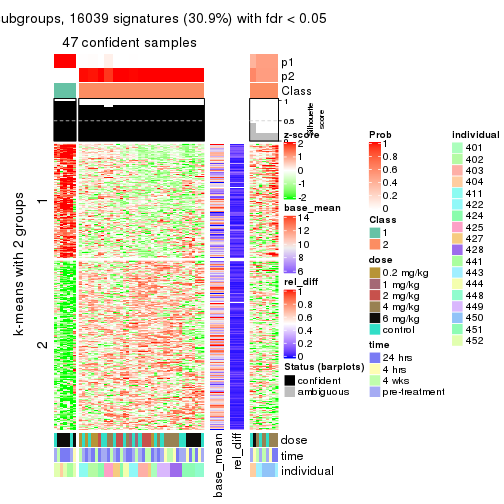</p>

</div>
<div id='tab-SD-hclust-get-signatures-2'>
<pre><code class="r">get_signatures(res, k = 3)
</code></pre>

<p>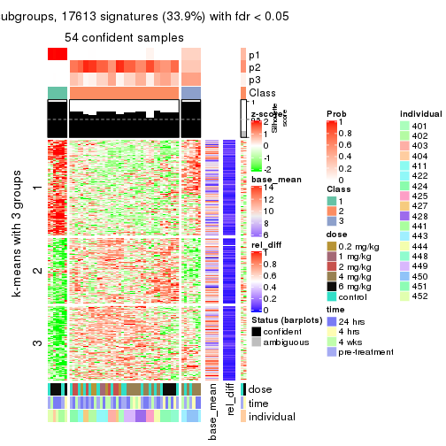</p>

</div>
<div id='tab-SD-hclust-get-signatures-3'>
<pre><code class="r">get_signatures(res, k = 4)
</code></pre>

<p>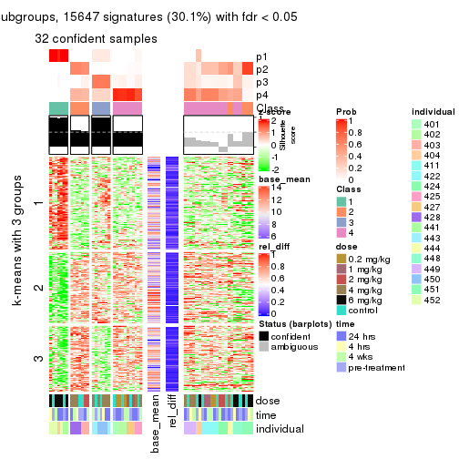</p>

</div>
<div id='tab-SD-hclust-get-signatures-4'>
<pre><code class="r">get_signatures(res, k = 5)
</code></pre>

<p>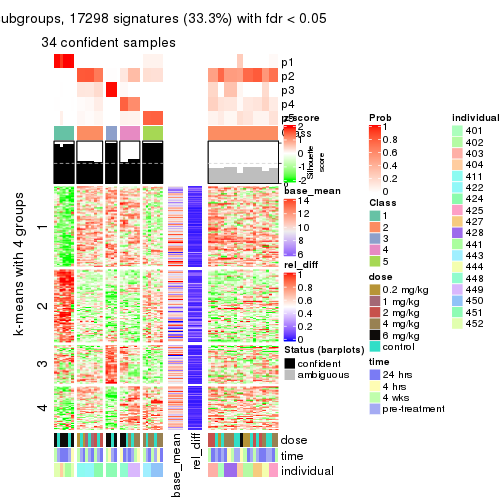</p>

</div>
<div id='tab-SD-hclust-get-signatures-5'>
<pre><code class="r">get_signatures(res, k = 6)
</code></pre>

<p>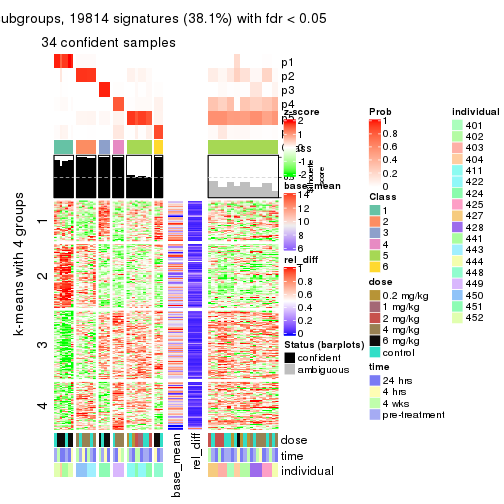</p>

</div>
</div>


Signature heatmaps where rows are not scaled:


<script>
$( function() {
	$( '#tabs-SD-hclust-get-signatures-no-scale' ).tabs();
} );
</script>
<div id='tabs-SD-hclust-get-signatures-no-scale'>
<ul>
<li><a href='#tab-SD-hclust-get-signatures-no-scale-1'>k = 2</a></li>
<li><a href='#tab-SD-hclust-get-signatures-no-scale-2'>k = 3</a></li>
<li><a href='#tab-SD-hclust-get-signatures-no-scale-3'>k = 4</a></li>
<li><a href='#tab-SD-hclust-get-signatures-no-scale-4'>k = 5</a></li>
<li><a href='#tab-SD-hclust-get-signatures-no-scale-5'>k = 6</a></li>
</ul>
<div id='tab-SD-hclust-get-signatures-no-scale-1'>
<pre><code class="r">get_signatures(res, k = 2, scale_rows = FALSE)
</code></pre>

<p>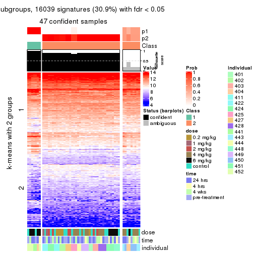</p>

</div>
<div id='tab-SD-hclust-get-signatures-no-scale-2'>
<pre><code class="r">get_signatures(res, k = 3, scale_rows = FALSE)
</code></pre>

<p>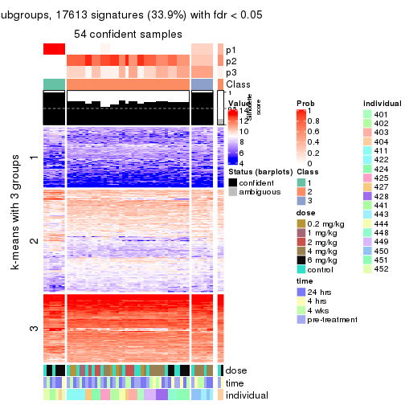</p>

</div>
<div id='tab-SD-hclust-get-signatures-no-scale-3'>
<pre><code class="r">get_signatures(res, k = 4, scale_rows = FALSE)
</code></pre>

<p>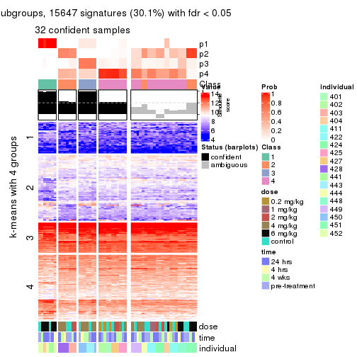</p>

</div>
<div id='tab-SD-hclust-get-signatures-no-scale-4'>
<pre><code class="r">get_signatures(res, k = 5, scale_rows = FALSE)
</code></pre>

<p>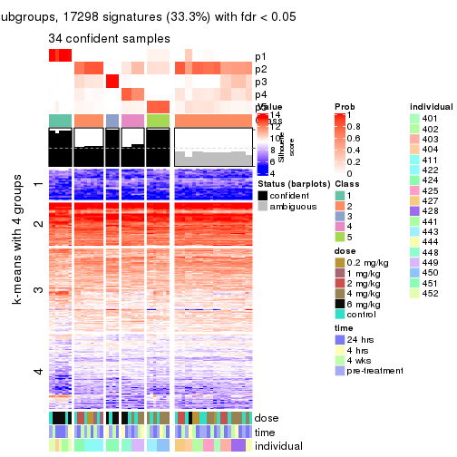</p>

</div>
<div id='tab-SD-hclust-get-signatures-no-scale-5'>
<pre><code class="r">get_signatures(res, k = 6, scale_rows = FALSE)
</code></pre>

<p>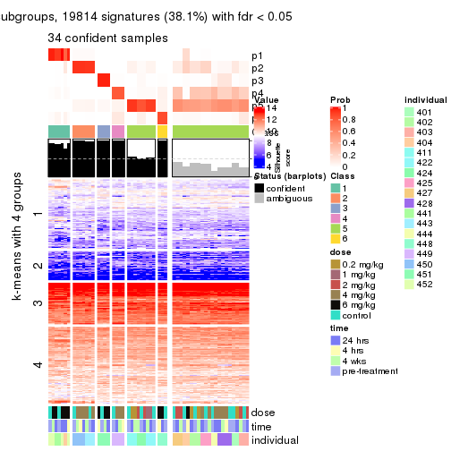</p>

</div>
</div>


Compare the overlap of signatures from different k:

```r
compare_signatures(res)
```

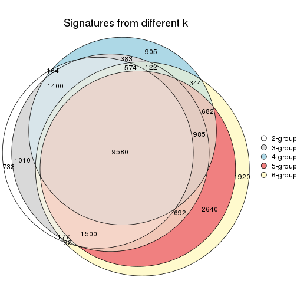

`get_signature()` returns a data frame invisibly. TO get the list of signatures, the function
call should be assigned to a variable explicitly. In following code, if `plot` argument is set
to `FALSE`, no heatmap is plotted while only the differential analysis is performed.

```r
# code only for demonstration
tb = get_signature(res, k = ..., plot = FALSE)
```

An example of the output of `tb` is:

```
#>   which_row         fdr    mean_1    mean_2 scaled_mean_1 scaled_mean_2 km
#> 1        38 0.042760348  8.373488  9.131774    -0.5533452     0.5164555  1
#> 2        40 0.018707592  7.106213  8.469186    -0.6173731     0.5762149  1
#> 3        55 0.019134737 10.221463 11.207825    -0.6159697     0.5749050  1
#> 4        59 0.006059896  5.921854  7.869574    -0.6899429     0.6439467  1
#> 5        60 0.018055526  8.928898 10.211722    -0.6204761     0.5791110  1
#> 6        98 0.009384629 15.714769 14.887706     0.6635654    -0.6193277  2
...
```

The columns in `tb` are:

1. `which_row`: row indices corresponding to the input matrix.
2. `fdr`: FDR for the differential test. 
3. `mean_x`: The mean value in group x.
4. `scaled_mean_x`: The mean value in group x after rows are scaled.
5. `km`: Row groups if k-means clustering is applied to rows.


UMAP plot which shows how samples are separated.


<script>
$( function() {
	$( '#tabs-SD-hclust-dimension-reduction' ).tabs();
} );
</script>
<div id='tabs-SD-hclust-dimension-reduction'>
<ul>
<li><a href='#tab-SD-hclust-dimension-reduction-1'>k = 2</a></li>
<li><a href='#tab-SD-hclust-dimension-reduction-2'>k = 3</a></li>
<li><a href='#tab-SD-hclust-dimension-reduction-3'>k = 4</a></li>
<li><a href='#tab-SD-hclust-dimension-reduction-4'>k = 5</a></li>
<li><a href='#tab-SD-hclust-dimension-reduction-5'>k = 6</a></li>
</ul>
<div id='tab-SD-hclust-dimension-reduction-1'>
<pre><code class="r">dimension_reduction(res, k = 2, method = &quot;UMAP&quot;)
</code></pre>

<p>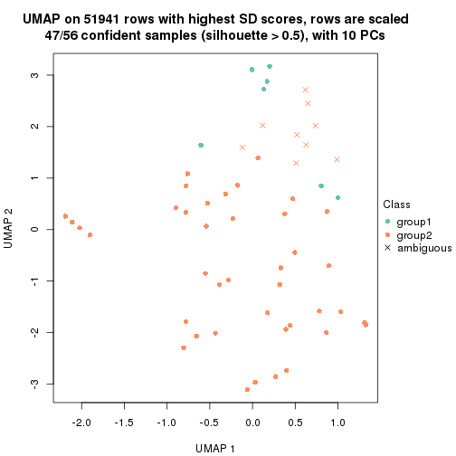</p>

</div>
<div id='tab-SD-hclust-dimension-reduction-2'>
<pre><code class="r">dimension_reduction(res, k = 3, method = &quot;UMAP&quot;)
</code></pre>

<p>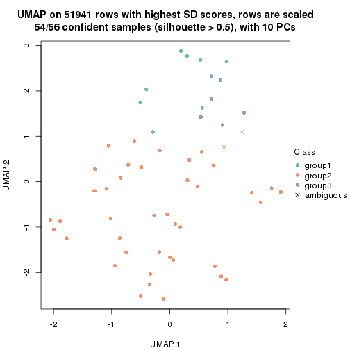</p>

</div>
<div id='tab-SD-hclust-dimension-reduction-3'>
<pre><code class="r">dimension_reduction(res, k = 4, method = &quot;UMAP&quot;)
</code></pre>

<p>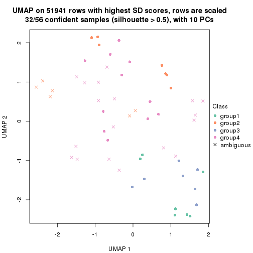</p>

</div>
<div id='tab-SD-hclust-dimension-reduction-4'>
<pre><code class="r">dimension_reduction(res, k = 5, method = &quot;UMAP&quot;)
</code></pre>

<p>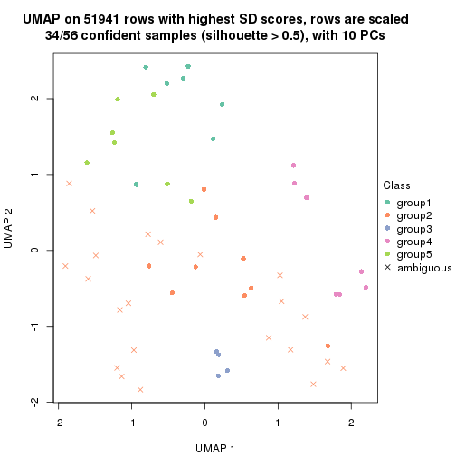</p>

</div>
<div id='tab-SD-hclust-dimension-reduction-5'>
<pre><code class="r">dimension_reduction(res, k = 6, method = &quot;UMAP&quot;)
</code></pre>

<p>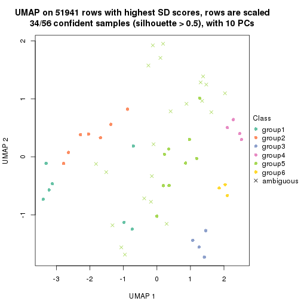</p>

</div>
</div>


Following heatmap shows how subgroups are split when increasing `k`:

```r
collect_classes(res)
```

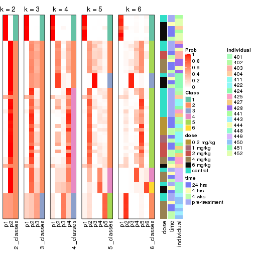


Test correlation between subgroups and known annotations. If the known
annotation is numeric, one-way ANOVA test is applied, and if the known
annotation is discrete, chi-squared contingency table test is applied.

```r
test_to_known_factors(res)
```

```
#>            n  dose(p) time(p) individual(p) k
#> SD:hclust 47 0.018345   0.894      3.68e-05 2
#> SD:hclust 54 0.005642   0.992      1.24e-09 3
#> SD:hclust 32 0.000697   0.983      7.87e-09 4
#> SD:hclust 34 0.003591   0.985      2.19e-12 5
#> SD:hclust 34 0.003884   0.995      5.49e-15 6
```


If matrix rows can be associated to genes, consider to use `functional_enrichment(res,
...)` to perform function enrichment for the signature genes. See [this vignette](http://bioconductor.org/packages/devel/bioc/vignettes/cola/inst/doc/functional_enrichment.html) for more detailed explanations.


 

---------------------------------------------------


### SD:kmeans


The object with results only for a single top-value method and a single partition method 
can be extracted as:

```r
res = res_list["SD", "kmeans"]
# you can also extract it by
# res = res_list["SD:kmeans"]
```

A summary of `res` and all the functions that can be applied to it:

```r
res
```

```
#> A 'ConsensusPartition' object with k = 2, 3, 4, 5, 6.
#>   On a matrix with 51941 rows and 56 columns.
#>   Top rows (1000, 2000, 3000, 4000, 5000) are extracted by 'SD' method.
#>   Subgroups are detected by 'kmeans' method.
#>   Performed in total 1250 partitions by row resampling.
#>   Best k for subgroups seems to be 3.
#> 
#> Following methods can be applied to this 'ConsensusPartition' object:
#>  [1] "cola_report"             "collect_classes"         "collect_plots"          
#>  [4] "collect_stats"           "colnames"                "compare_signatures"     
#>  [7] "consensus_heatmap"       "dimension_reduction"     "functional_enrichment"  
#> [10] "get_anno_col"            "get_anno"                "get_classes"            
#> [13] "get_consensus"           "get_matrix"              "get_membership"         
#> [16] "get_param"               "get_signatures"          "get_stats"              
#> [19] "is_best_k"               "is_stable_k"             "membership_heatmap"     
#> [22] "ncol"                    "nrow"                    "plot_ecdf"              
#> [25] "rownames"                "select_partition_number" "show"                   
#> [28] "suggest_best_k"          "test_to_known_factors"
```

`collect_plots()` function collects all the plots made from `res` for all `k` (number of partitions)
into one single page to provide an easy and fast comparison between different `k`.

```r
collect_plots(res)
```

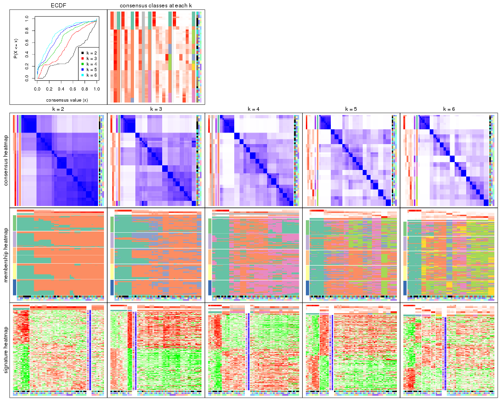

The plots are:

- The first row: a plot of the ECDF (empirical cumulative distribution
  function) curves of the consensus matrix for each `k` and the heatmap of
  predicted classes for each `k`.
- The second row: heatmaps of the consensus matrix for each `k`.
- The third row: heatmaps of the membership matrix for each `k`.
- The fouth row: heatmaps of the signatures for each `k`.

All the plots in panels can be made by individual functions and they are
plotted later in this section.

`select_partition_number()` produces several plots showing different
statistics for choosing "optimized" `k`. There are following statistics:

- ECDF curves of the consensus matrix for each `k`;
- 1-PAC. [The PAC
  score](https://en.wikipedia.org/wiki/Consensus_clustering#Over-interpretation_potential_of_consensus_clustering)
  measures the proportion of the ambiguous subgrouping.
- Mean silhouette score.
- Concordance. The mean probability of fiting the consensus class ids in all
  partitions.
- Area increased. Denote $A_k$ as the area under the ECDF curve for current
  `k`, the area increased is defined as $A_k - A_{k-1}$.
- Rand index. The percent of pairs of samples that are both in a same cluster
  or both are not in a same cluster in the partition of k and k-1.
- Jaccard index. The ratio of pairs of samples are both in a same cluster in
  the partition of k and k-1 and the pairs of samples are both in a same
  cluster in the partition k or k-1.

The detailed explanations of these statistics can be found in [the _cola_
vignette](http://bioconductor.org/packages/devel/bioc/vignettes/cola/inst/doc/cola.html#toc_13).

Generally speaking, lower PAC score, higher mean silhouette score or higher
concordance corresponds to better partition. Rand index and Jaccard index
measure how similar the current partition is compared to partition with `k-1`.
If they are too similar, we won't accept `k` is better than `k-1`.

```r
select_partition_number(res)
```

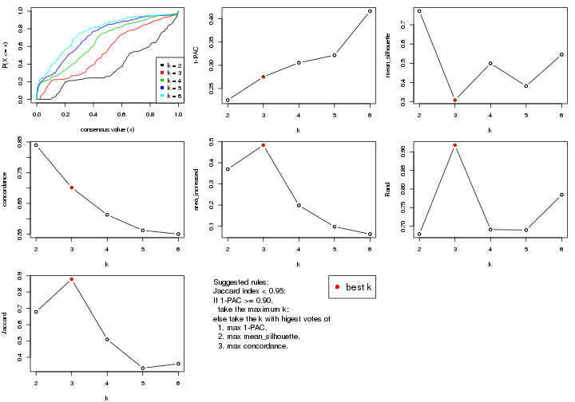

The numeric values for all these statistics can be obtained by `get_stats()`.

```r
get_stats(res)
```

```
#>   k 1-PAC mean_silhouette concordance area_increased  Rand Jaccard
#> 2 2 0.225           0.771       0.840         0.3697 0.679   0.679
#> 3 3 0.275           0.309       0.701         0.4833 0.918   0.879
#> 4 4 0.306           0.500       0.613         0.1985 0.691   0.509
#> 5 5 0.321           0.382       0.562         0.0978 0.690   0.333
#> 6 6 0.417           0.546       0.550         0.0627 0.784   0.360
```

`suggest_best_k()` suggests the best $k$ based on these statistics. The rules are as follows:

- All $k$ with Jaccard index larger than 0.95 are removed because increasing
  $k$ does not provide enough extra information. If all $k$ are removed, it is
  marked as no subgroup is detected.
- For all $k$ with 1-PAC score larger than 0.9, the maximal $k$ is taken as
  the best $k$, and other $k$ are marked as optional $k$.
- If it does not fit the second rule. The $k$ with the maximal vote of the
  highest 1-PAC score, highest mean silhouette, and highest concordance is
  taken as the best $k$.

```r
suggest_best_k(res)
```

```
#> [1] 3
```


Following shows the table of the partitions (You need to click the **show/hide
code output** link to see it). The membership matrix (columns with name `p*`)
is inferred by
[`clue::cl_consensus()`](https://www.rdocumentation.org/link/cl_consensus?package=clue)
function with the `SE` method. Basically the value in the membership matrix
represents the probability to belong to a certain group. The finall class
label for an item is determined with the group with highest probability it
belongs to.

In `get_classes()` function, the entropy is calculated from the membership
matrix and the silhouette score is calculated from the consensus matrix.


<script>
$( function() {
	$( '#tabs-SD-kmeans-get-classes' ).tabs();
} );
</script>
<div id='tabs-SD-kmeans-get-classes'>
<ul>
<li><a href='#tab-SD-kmeans-get-classes-1'>k = 2</a></li>
<li><a href='#tab-SD-kmeans-get-classes-2'>k = 3</a></li>
<li><a href='#tab-SD-kmeans-get-classes-3'>k = 4</a></li>
<li><a href='#tab-SD-kmeans-get-classes-4'>k = 5</a></li>
<li><a href='#tab-SD-kmeans-get-classes-5'>k = 6</a></li>
</ul>

<div id='tab-SD-kmeans-get-classes-1'>
<p><a id='tab-SD-kmeans-get-classes-1-a' style='color:#0366d6' href='#'>show/hide code output</a></p>
<pre><code class="r">cbind(get_classes(res, k = 2), get_membership(res, k = 2))
</code></pre>

<pre><code>#&gt;           class entropy silhouette    p1    p2
#&gt; GSM687644     2  0.5737      0.791 0.136 0.864
#&gt; GSM687648     2  0.9323      0.525 0.348 0.652
#&gt; GSM687653     2  0.1414      0.817 0.020 0.980
#&gt; GSM687658     2  0.9661      0.422 0.392 0.608
#&gt; GSM687663     2  0.1414      0.819 0.020 0.980
#&gt; GSM687668     2  0.1414      0.820 0.020 0.980
#&gt; GSM687673     2  0.3879      0.806 0.076 0.924
#&gt; GSM687678     2  0.9522      0.468 0.372 0.628
#&gt; GSM687683     2  0.8016      0.710 0.244 0.756
#&gt; GSM687688     2  0.2423      0.820 0.040 0.960
#&gt; GSM687695     1  0.6531      0.990 0.832 0.168
#&gt; GSM687699     2  0.9580      0.462 0.380 0.620
#&gt; GSM687704     2  0.0672      0.818 0.008 0.992
#&gt; GSM687707     2  0.3733      0.817 0.072 0.928
#&gt; GSM687712     2  0.5629      0.792 0.132 0.868
#&gt; GSM687719     1  0.7056      0.961 0.808 0.192
#&gt; GSM687724     2  0.4161      0.782 0.084 0.916
#&gt; GSM687728     1  0.6531      0.990 0.832 0.168
#&gt; GSM687646     2  0.5737      0.791 0.136 0.864
#&gt; GSM687649     2  0.9323      0.525 0.348 0.652
#&gt; GSM687665     2  0.5629      0.764 0.132 0.868
#&gt; GSM687651     2  0.9323      0.525 0.348 0.652
#&gt; GSM687667     2  0.0938      0.818 0.012 0.988
#&gt; GSM687670     2  0.1414      0.820 0.020 0.980
#&gt; GSM687671     2  0.1414      0.820 0.020 0.980
#&gt; GSM687654     2  0.1414      0.817 0.020 0.980
#&gt; GSM687675     2  0.5294      0.780 0.120 0.880
#&gt; GSM687685     2  0.8016      0.710 0.244 0.756
#&gt; GSM687656     2  0.1414      0.817 0.020 0.980
#&gt; GSM687677     2  0.1414      0.817 0.020 0.980
#&gt; GSM687687     2  0.5408      0.796 0.124 0.876
#&gt; GSM687692     2  0.2423      0.820 0.040 0.960
#&gt; GSM687716     2  0.5629      0.792 0.132 0.868
#&gt; GSM687722     1  0.7056      0.961 0.808 0.192
#&gt; GSM687680     2  0.9522      0.468 0.372 0.628
#&gt; GSM687690     2  0.2423      0.820 0.040 0.960
#&gt; GSM687700     1  0.6623      0.987 0.828 0.172
#&gt; GSM687705     2  0.0672      0.818 0.008 0.992
#&gt; GSM687714     2  0.5629      0.792 0.132 0.868
#&gt; GSM687721     1  0.6531      0.984 0.832 0.168
#&gt; GSM687682     2  0.9522      0.468 0.372 0.628
#&gt; GSM687694     2  0.2423      0.820 0.040 0.960
#&gt; GSM687702     2  0.9580      0.462 0.380 0.620
#&gt; GSM687718     2  0.5629      0.792 0.132 0.868
#&gt; GSM687723     2  0.9686      0.411 0.396 0.604
#&gt; GSM687661     2  0.9661      0.422 0.392 0.608
#&gt; GSM687710     2  0.3733      0.817 0.072 0.928
#&gt; GSM687726     2  0.4161      0.782 0.084 0.916
#&gt; GSM687730     1  0.6531      0.990 0.832 0.168
#&gt; GSM687660     1  0.6531      0.990 0.832 0.168
#&gt; GSM687697     1  0.6531      0.990 0.832 0.168
#&gt; GSM687709     2  0.3733      0.817 0.072 0.928
#&gt; GSM687725     2  0.4161      0.782 0.084 0.916
#&gt; GSM687729     1  0.6531      0.990 0.832 0.168
#&gt; GSM687727     2  0.4161      0.782 0.084 0.916
#&gt; GSM687731     1  0.6531      0.990 0.832 0.168
</code></pre>

<script>
$('#tab-SD-kmeans-get-classes-1-a').parent().next().next().hide();
$('#tab-SD-kmeans-get-classes-1-a').click(function(){
  $('#tab-SD-kmeans-get-classes-1-a').parent().next().next().toggle();
  return(false);
});
</script>
</div>

<div id='tab-SD-kmeans-get-classes-2'>
<p><a id='tab-SD-kmeans-get-classes-2-a' style='color:#0366d6' href='#'>show/hide code output</a></p>
<pre><code class="r">cbind(get_classes(res, k = 3), get_membership(res, k = 3))
</code></pre>

<pre><code>#&gt;           class entropy silhouette    p1    p2    p3
#&gt; GSM687644     2   0.717    -0.7488 0.024 0.520 0.456
#&gt; GSM687648     2   0.894     0.2435 0.292 0.548 0.160
#&gt; GSM687653     2   0.541     0.2395 0.016 0.772 0.212
#&gt; GSM687658     2   0.884     0.2454 0.328 0.536 0.136
#&gt; GSM687663     2   0.341     0.3400 0.020 0.900 0.080
#&gt; GSM687668     2   0.260     0.2595 0.016 0.932 0.052
#&gt; GSM687673     2   0.425     0.3493 0.028 0.864 0.108
#&gt; GSM687678     2   0.878     0.2489 0.316 0.548 0.136
#&gt; GSM687683     2   0.813    -0.2001 0.096 0.600 0.304
#&gt; GSM687688     2   0.475     0.1569 0.012 0.816 0.172
#&gt; GSM687695     1   0.196     0.9402 0.944 0.056 0.000
#&gt; GSM687699     2   0.893     0.2505 0.316 0.536 0.148
#&gt; GSM687704     2   0.406     0.2395 0.000 0.836 0.164
#&gt; GSM687707     2   0.811     0.0263 0.088 0.588 0.324
#&gt; GSM687712     2   0.719    -1.0000 0.024 0.488 0.488
#&gt; GSM687719     1   0.723     0.7218 0.712 0.172 0.116
#&gt; GSM687724     2   0.699     0.1147 0.024 0.592 0.384
#&gt; GSM687728     1   0.196     0.9402 0.944 0.056 0.000
#&gt; GSM687646     2   0.717    -0.7488 0.024 0.520 0.456
#&gt; GSM687649     2   0.894     0.2435 0.292 0.548 0.160
#&gt; GSM687665     2   0.423     0.3502 0.044 0.872 0.084
#&gt; GSM687651     2   0.892     0.2426 0.288 0.552 0.160
#&gt; GSM687667     2   0.287     0.3324 0.008 0.916 0.076
#&gt; GSM687670     2   0.260     0.2595 0.016 0.932 0.052
#&gt; GSM687671     2   0.260     0.2595 0.016 0.932 0.052
#&gt; GSM687654     2   0.541     0.2395 0.016 0.772 0.212
#&gt; GSM687675     2   0.449     0.3515 0.036 0.856 0.108
#&gt; GSM687685     2   0.813    -0.2001 0.096 0.600 0.304
#&gt; GSM687656     2   0.541     0.2395 0.016 0.772 0.212
#&gt; GSM687677     2   0.354     0.3414 0.012 0.888 0.100
#&gt; GSM687687     2   0.692    -0.5746 0.024 0.608 0.368
#&gt; GSM687692     2   0.469     0.1636 0.012 0.820 0.168
#&gt; GSM687716     3   0.719     1.0000 0.024 0.488 0.488
#&gt; GSM687722     1   0.723     0.7218 0.712 0.172 0.116
#&gt; GSM687680     2   0.880     0.2489 0.320 0.544 0.136
#&gt; GSM687690     2   0.469     0.1636 0.012 0.820 0.168
#&gt; GSM687700     1   0.210     0.9369 0.944 0.052 0.004
#&gt; GSM687705     2   0.406     0.2395 0.000 0.836 0.164
#&gt; GSM687714     3   0.719     1.0000 0.024 0.488 0.488
#&gt; GSM687721     1   0.369     0.9112 0.896 0.048 0.056
#&gt; GSM687682     2   0.880     0.2489 0.320 0.544 0.136
#&gt; GSM687694     2   0.469     0.1636 0.012 0.820 0.168
#&gt; GSM687702     2   0.893     0.2505 0.316 0.536 0.148
#&gt; GSM687718     3   0.719     1.0000 0.024 0.488 0.488
#&gt; GSM687723     2   0.902     0.2283 0.336 0.516 0.148
#&gt; GSM687661     2   0.884     0.2454 0.328 0.536 0.136
#&gt; GSM687710     2   0.811     0.0263 0.088 0.588 0.324
#&gt; GSM687726     2   0.699     0.1147 0.024 0.592 0.384
#&gt; GSM687730     1   0.255     0.9357 0.932 0.056 0.012
#&gt; GSM687660     1   0.196     0.9402 0.944 0.056 0.000
#&gt; GSM687697     1   0.196     0.9402 0.944 0.056 0.000
#&gt; GSM687709     2   0.811     0.0263 0.088 0.588 0.324
#&gt; GSM687725     2   0.699     0.1147 0.024 0.592 0.384
#&gt; GSM687729     1   0.196     0.9402 0.944 0.056 0.000
#&gt; GSM687727     2   0.700     0.1095 0.024 0.588 0.388
#&gt; GSM687731     1   0.196     0.9402 0.944 0.056 0.000
</code></pre>

<script>
$('#tab-SD-kmeans-get-classes-2-a').parent().next().next().hide();
$('#tab-SD-kmeans-get-classes-2-a').click(function(){
  $('#tab-SD-kmeans-get-classes-2-a').parent().next().next().toggle();
  return(false);
});
</script>
</div>

<div id='tab-SD-kmeans-get-classes-3'>
<p><a id='tab-SD-kmeans-get-classes-3-a' style='color:#0366d6' href='#'>show/hide code output</a></p>
<pre><code class="r">cbind(get_classes(res, k = 4), get_membership(res, k = 4))
</code></pre>

<pre><code>#&gt;           class entropy silhouette    p1    p2 p3    p4
#&gt; GSM687644     4  0.6926     0.3558 0.004 0.376 NA 0.520
#&gt; GSM687648     4  0.8236     0.5470 0.144 0.288 NA 0.512
#&gt; GSM687653     2  0.6382     0.4752 0.004 0.664 NA 0.136
#&gt; GSM687658     4  0.8736     0.5057 0.200 0.364 NA 0.384
#&gt; GSM687663     2  0.4413     0.4861 0.008 0.812 NA 0.140
#&gt; GSM687668     2  0.3979     0.4552 0.008 0.836 NA 0.128
#&gt; GSM687673     2  0.4540     0.5233 0.008 0.816 NA 0.104
#&gt; GSM687678     4  0.7824     0.5586 0.156 0.336 NA 0.488
#&gt; GSM687683     4  0.6868     0.4505 0.028 0.404 NA 0.520
#&gt; GSM687688     2  0.5562     0.4672 0.004 0.740 NA 0.124
#&gt; GSM687695     1  0.0188     0.8736 0.996 0.004 NA 0.000
#&gt; GSM687699     4  0.8048     0.5536 0.168 0.320 NA 0.484
#&gt; GSM687704     2  0.4353     0.5454 0.004 0.820 NA 0.060
#&gt; GSM687707     2  0.8547     0.0581 0.032 0.400 NA 0.328
#&gt; GSM687712     4  0.7833     0.2624 0.004 0.364 NA 0.416
#&gt; GSM687719     1  0.8262     0.3403 0.536 0.124 NA 0.260
#&gt; GSM687724     2  0.5292     0.4215 0.000 0.512 NA 0.008
#&gt; GSM687728     1  0.1247     0.8709 0.968 0.004 NA 0.016
#&gt; GSM687646     4  0.6926     0.3558 0.004 0.376 NA 0.520
#&gt; GSM687649     4  0.8236     0.5470 0.144 0.288 NA 0.512
#&gt; GSM687665     2  0.4463     0.4812 0.008 0.808 NA 0.144
#&gt; GSM687651     4  0.8236     0.5470 0.144 0.288 NA 0.512
#&gt; GSM687667     2  0.4362     0.4897 0.008 0.816 NA 0.136
#&gt; GSM687670     2  0.3979     0.4552 0.008 0.836 NA 0.128
#&gt; GSM687671     2  0.3979     0.4552 0.008 0.836 NA 0.128
#&gt; GSM687654     2  0.6382     0.4752 0.004 0.664 NA 0.136
#&gt; GSM687675     2  0.4540     0.5233 0.008 0.816 NA 0.104
#&gt; GSM687685     4  0.6860     0.4534 0.028 0.400 NA 0.524
#&gt; GSM687656     2  0.6382     0.4752 0.004 0.664 NA 0.136
#&gt; GSM687677     2  0.4356     0.5297 0.008 0.828 NA 0.092
#&gt; GSM687687     4  0.6671     0.3436 0.004 0.452 NA 0.472
#&gt; GSM687692     2  0.5562     0.4672 0.004 0.740 NA 0.124
#&gt; GSM687716     4  0.7833     0.2624 0.004 0.364 NA 0.416
#&gt; GSM687722     1  0.8262     0.3403 0.536 0.124 NA 0.260
#&gt; GSM687680     4  0.7824     0.5586 0.156 0.336 NA 0.488
#&gt; GSM687690     2  0.5562     0.4672 0.004 0.740 NA 0.124
#&gt; GSM687700     1  0.0564     0.8720 0.988 0.004 NA 0.004
#&gt; GSM687705     2  0.4353     0.5454 0.004 0.820 NA 0.060
#&gt; GSM687714     4  0.7833     0.2624 0.004 0.364 NA 0.416
#&gt; GSM687721     1  0.4371     0.7695 0.820 0.004 NA 0.112
#&gt; GSM687682     4  0.7824     0.5586 0.156 0.336 NA 0.488
#&gt; GSM687694     2  0.5562     0.4672 0.004 0.740 NA 0.124
#&gt; GSM687702     4  0.8048     0.5536 0.168 0.320 NA 0.484
#&gt; GSM687718     4  0.7833     0.2624 0.004 0.364 NA 0.416
#&gt; GSM687723     4  0.9160     0.4681 0.208 0.348 NA 0.360
#&gt; GSM687661     4  0.8736     0.5057 0.200 0.364 NA 0.384
#&gt; GSM687710     2  0.8547     0.0581 0.032 0.400 NA 0.328
#&gt; GSM687726     2  0.5292     0.4215 0.000 0.512 NA 0.008
#&gt; GSM687730     1  0.1598     0.8666 0.956 0.004 NA 0.020
#&gt; GSM687660     1  0.0188     0.8736 0.996 0.004 NA 0.000
#&gt; GSM687697     1  0.0188     0.8736 0.996 0.004 NA 0.000
#&gt; GSM687709     2  0.8547     0.0581 0.032 0.400 NA 0.328
#&gt; GSM687725     2  0.5292     0.4215 0.000 0.512 NA 0.008
#&gt; GSM687729     1  0.0992     0.8721 0.976 0.004 NA 0.008
#&gt; GSM687727     2  0.5292     0.4215 0.000 0.512 NA 0.008
#&gt; GSM687731     1  0.1247     0.8709 0.968 0.004 NA 0.016
</code></pre>

<script>
$('#tab-SD-kmeans-get-classes-3-a').parent().next().next().hide();
$('#tab-SD-kmeans-get-classes-3-a').click(function(){
  $('#tab-SD-kmeans-get-classes-3-a').parent().next().next().toggle();
  return(false);
});
</script>
</div>

<div id='tab-SD-kmeans-get-classes-4'>
<p><a id='tab-SD-kmeans-get-classes-4-a' style='color:#0366d6' href='#'>show/hide code output</a></p>
<pre><code class="r">cbind(get_classes(res, k = 5), get_membership(res, k = 5))
</code></pre>

<pre><code>#&gt;           class entropy silhouette    p1    p2    p3    p4    p5
#&gt; GSM687644     4  0.5913    0.69542 0.000 0.396 0.044 0.528 0.032
#&gt; GSM687648     2  0.6054    0.32279 0.100 0.704 0.060 0.116 0.020
#&gt; GSM687653     3  0.8318    0.33474 0.000 0.196 0.340 0.156 0.308
#&gt; GSM687658     2  0.6356    0.36278 0.164 0.652 0.136 0.032 0.016
#&gt; GSM687663     2  0.7031   -0.01477 0.004 0.504 0.136 0.040 0.316
#&gt; GSM687668     2  0.7731   -0.03366 0.012 0.480 0.120 0.096 0.292
#&gt; GSM687673     2  0.7555   -0.08186 0.000 0.384 0.248 0.044 0.324
#&gt; GSM687678     2  0.5499    0.36236 0.128 0.736 0.052 0.072 0.012
#&gt; GSM687683     2  0.6247    0.01784 0.036 0.620 0.048 0.272 0.024
#&gt; GSM687688     5  0.8572    0.37879 0.004 0.272 0.156 0.264 0.304
#&gt; GSM687695     1  0.0162    0.93175 0.996 0.004 0.000 0.000 0.000
#&gt; GSM687699     2  0.5367    0.37026 0.128 0.732 0.072 0.068 0.000
#&gt; GSM687704     5  0.7909    0.02575 0.004 0.312 0.180 0.088 0.416
#&gt; GSM687707     3  0.8135    0.46612 0.020 0.268 0.452 0.092 0.168
#&gt; GSM687712     4  0.5240    0.86352 0.004 0.228 0.000 0.676 0.092
#&gt; GSM687719     2  0.7847    0.03925 0.356 0.360 0.224 0.052 0.008
#&gt; GSM687724     5  0.1364    0.34964 0.000 0.036 0.000 0.012 0.952
#&gt; GSM687728     1  0.2053    0.92408 0.932 0.012 0.028 0.024 0.004
#&gt; GSM687646     4  0.5913    0.69542 0.000 0.396 0.044 0.528 0.032
#&gt; GSM687649     2  0.6054    0.32279 0.100 0.704 0.060 0.116 0.020
#&gt; GSM687665     2  0.6966   -0.00958 0.004 0.508 0.136 0.036 0.316
#&gt; GSM687651     2  0.6054    0.32279 0.100 0.704 0.060 0.116 0.020
#&gt; GSM687667     2  0.6966   -0.00978 0.004 0.508 0.136 0.036 0.316
#&gt; GSM687670     2  0.7731   -0.03366 0.012 0.480 0.120 0.096 0.292
#&gt; GSM687671     2  0.7731   -0.03366 0.012 0.480 0.120 0.096 0.292
#&gt; GSM687654     3  0.8318    0.33474 0.000 0.196 0.340 0.156 0.308
#&gt; GSM687675     2  0.7555   -0.08186 0.000 0.384 0.248 0.044 0.324
#&gt; GSM687685     2  0.6247    0.01784 0.036 0.620 0.048 0.272 0.024
#&gt; GSM687656     3  0.8318    0.33474 0.000 0.196 0.340 0.156 0.308
#&gt; GSM687677     2  0.7565   -0.09020 0.000 0.380 0.252 0.044 0.324
#&gt; GSM687687     2  0.6343   -0.37254 0.008 0.516 0.052 0.388 0.036
#&gt; GSM687692     5  0.8572    0.37879 0.004 0.272 0.156 0.264 0.304
#&gt; GSM687716     4  0.5240    0.86352 0.004 0.228 0.000 0.676 0.092
#&gt; GSM687722     2  0.7847    0.03925 0.356 0.360 0.224 0.052 0.008
#&gt; GSM687680     2  0.5499    0.36236 0.128 0.736 0.052 0.072 0.012
#&gt; GSM687690     5  0.8572    0.37879 0.004 0.272 0.156 0.264 0.304
#&gt; GSM687700     1  0.0960    0.92690 0.972 0.016 0.008 0.004 0.000
#&gt; GSM687705     5  0.7909    0.02575 0.004 0.312 0.180 0.088 0.416
#&gt; GSM687714     4  0.5240    0.86352 0.004 0.228 0.000 0.676 0.092
#&gt; GSM687721     1  0.5955    0.59951 0.656 0.108 0.200 0.036 0.000
#&gt; GSM687682     2  0.5499    0.36236 0.128 0.736 0.052 0.072 0.012
#&gt; GSM687694     5  0.8572    0.37879 0.004 0.272 0.156 0.264 0.304
#&gt; GSM687702     2  0.5367    0.37026 0.128 0.732 0.072 0.068 0.000
#&gt; GSM687718     4  0.5240    0.86352 0.004 0.228 0.000 0.676 0.092
#&gt; GSM687723     2  0.7448    0.29644 0.164 0.532 0.232 0.056 0.016
#&gt; GSM687661     2  0.6411    0.36345 0.160 0.652 0.136 0.032 0.020
#&gt; GSM687710     3  0.8135    0.46612 0.020 0.268 0.452 0.092 0.168
#&gt; GSM687726     5  0.1525    0.34873 0.000 0.036 0.004 0.012 0.948
#&gt; GSM687730     1  0.2680    0.91322 0.904 0.012 0.036 0.040 0.008
#&gt; GSM687660     1  0.0162    0.93175 0.996 0.004 0.000 0.000 0.000
#&gt; GSM687697     1  0.0162    0.93175 0.996 0.004 0.000 0.000 0.000
#&gt; GSM687709     3  0.8135    0.46612 0.020 0.268 0.452 0.092 0.168
#&gt; GSM687725     5  0.1364    0.34964 0.000 0.036 0.000 0.012 0.952
#&gt; GSM687729     1  0.1235    0.93041 0.964 0.004 0.016 0.012 0.004
#&gt; GSM687727     5  0.1364    0.34964 0.000 0.036 0.000 0.012 0.952
#&gt; GSM687731     1  0.2053    0.92408 0.932 0.012 0.028 0.024 0.004
</code></pre>

<script>
$('#tab-SD-kmeans-get-classes-4-a').parent().next().next().hide();
$('#tab-SD-kmeans-get-classes-4-a').click(function(){
  $('#tab-SD-kmeans-get-classes-4-a').parent().next().next().toggle();
  return(false);
});
</script>
</div>

<div id='tab-SD-kmeans-get-classes-5'>
<p><a id='tab-SD-kmeans-get-classes-5-a' style='color:#0366d6' href='#'>show/hide code output</a></p>
<pre><code class="r">cbind(get_classes(res, k = 6), get_membership(res, k = 6))
</code></pre>

<pre><code>#&gt;           class entropy silhouette    p1    p2    p3    p4    p5    p6
#&gt; GSM687644     4  0.6537      0.518 0.000 0.168 0.020 0.588 0.144 0.080
#&gt; GSM687648     2  0.8339      0.305 0.048 0.396 0.028 0.196 0.240 0.092
#&gt; GSM687653     5  0.7458      0.317 0.000 0.068 0.120 0.096 0.504 0.212
#&gt; GSM687658     2  0.7313      0.358 0.088 0.432 0.020 0.104 0.344 0.012
#&gt; GSM687663     5  0.2307      0.554 0.000 0.028 0.044 0.016 0.908 0.004
#&gt; GSM687668     5  0.5088      0.405 0.004 0.040 0.032 0.136 0.736 0.052
#&gt; GSM687673     5  0.5524      0.426 0.000 0.080 0.092 0.016 0.696 0.116
#&gt; GSM687678     2  0.8642      0.288 0.092 0.320 0.024 0.184 0.300 0.080
#&gt; GSM687683     4  0.7363      0.235 0.008 0.292 0.016 0.356 0.288 0.040
#&gt; GSM687688     6  0.7316      1.000 0.004 0.016 0.124 0.104 0.324 0.428
#&gt; GSM687695     1  0.0458      0.899 0.984 0.016 0.000 0.000 0.000 0.000
#&gt; GSM687699     2  0.7729      0.373 0.064 0.480 0.016 0.148 0.232 0.060
#&gt; GSM687704     5  0.5045      0.460 0.000 0.016 0.108 0.076 0.736 0.064
#&gt; GSM687707     2  0.9057      0.127 0.016 0.284 0.180 0.132 0.244 0.144
#&gt; GSM687712     4  0.2631      0.640 0.000 0.004 0.012 0.856 0.128 0.000
#&gt; GSM687719     2  0.7111      0.326 0.244 0.500 0.040 0.032 0.176 0.008
#&gt; GSM687724     3  0.4492      0.982 0.000 0.000 0.684 0.040 0.260 0.016
#&gt; GSM687728     1  0.1862      0.889 0.928 0.016 0.008 0.004 0.000 0.044
#&gt; GSM687646     4  0.6537      0.518 0.000 0.168 0.020 0.588 0.144 0.080
#&gt; GSM687649     2  0.8339      0.305 0.048 0.396 0.028 0.196 0.240 0.092
#&gt; GSM687665     5  0.2457      0.551 0.000 0.036 0.044 0.016 0.900 0.004
#&gt; GSM687651     2  0.8339      0.305 0.048 0.396 0.028 0.196 0.240 0.092
#&gt; GSM687667     5  0.2307      0.554 0.000 0.028 0.044 0.016 0.908 0.004
#&gt; GSM687670     5  0.5088      0.405 0.004 0.040 0.032 0.136 0.736 0.052
#&gt; GSM687671     5  0.5088      0.405 0.004 0.040 0.032 0.136 0.736 0.052
#&gt; GSM687654     5  0.7458      0.317 0.000 0.068 0.120 0.096 0.504 0.212
#&gt; GSM687675     5  0.5524      0.426 0.000 0.080 0.092 0.016 0.696 0.116
#&gt; GSM687685     4  0.7362      0.236 0.008 0.296 0.016 0.356 0.284 0.040
#&gt; GSM687656     5  0.7458      0.317 0.000 0.068 0.120 0.096 0.504 0.212
#&gt; GSM687677     5  0.5524      0.426 0.000 0.080 0.092 0.016 0.696 0.116
#&gt; GSM687687     4  0.7104      0.400 0.000 0.240 0.020 0.444 0.248 0.048
#&gt; GSM687692     6  0.7316      1.000 0.004 0.016 0.124 0.104 0.324 0.428
#&gt; GSM687716     4  0.2631      0.640 0.000 0.004 0.012 0.856 0.128 0.000
#&gt; GSM687722     2  0.7111      0.326 0.244 0.500 0.040 0.032 0.176 0.008
#&gt; GSM687680     2  0.8642      0.288 0.092 0.320 0.024 0.184 0.300 0.080
#&gt; GSM687690     6  0.7316      1.000 0.004 0.016 0.124 0.104 0.324 0.428
#&gt; GSM687700     1  0.1364      0.881 0.944 0.048 0.004 0.000 0.000 0.004
#&gt; GSM687705     5  0.5045      0.460 0.000 0.016 0.108 0.076 0.736 0.064
#&gt; GSM687714     4  0.2631      0.640 0.000 0.004 0.012 0.856 0.128 0.000
#&gt; GSM687721     1  0.5296      0.338 0.528 0.404 0.040 0.000 0.020 0.008
#&gt; GSM687682     2  0.8642      0.288 0.092 0.320 0.024 0.184 0.300 0.080
#&gt; GSM687694     6  0.7316      1.000 0.004 0.016 0.124 0.104 0.324 0.428
#&gt; GSM687702     2  0.7729      0.373 0.064 0.480 0.016 0.148 0.232 0.060
#&gt; GSM687718     4  0.2631      0.640 0.000 0.004 0.012 0.856 0.128 0.000
#&gt; GSM687723     2  0.7095      0.354 0.096 0.536 0.040 0.080 0.240 0.008
#&gt; GSM687661     2  0.7313      0.358 0.088 0.432 0.020 0.104 0.344 0.012
#&gt; GSM687710     2  0.9044      0.128 0.016 0.284 0.188 0.128 0.244 0.140
#&gt; GSM687726     3  0.4002      0.994 0.000 0.000 0.704 0.036 0.260 0.000
#&gt; GSM687730     1  0.2513      0.877 0.896 0.016 0.020 0.008 0.000 0.060
#&gt; GSM687660     1  0.0717      0.897 0.976 0.016 0.008 0.000 0.000 0.000
#&gt; GSM687697     1  0.0458      0.899 0.984 0.016 0.000 0.000 0.000 0.000
#&gt; GSM687709     2  0.9044      0.128 0.016 0.284 0.188 0.128 0.244 0.140
#&gt; GSM687725     3  0.4002      0.994 0.000 0.000 0.704 0.036 0.260 0.000
#&gt; GSM687729     1  0.0862      0.898 0.972 0.004 0.008 0.000 0.000 0.016
#&gt; GSM687727     3  0.4002      0.994 0.000 0.000 0.704 0.036 0.260 0.000
#&gt; GSM687731     1  0.1862      0.889 0.928 0.016 0.008 0.004 0.000 0.044
</code></pre>

<script>
$('#tab-SD-kmeans-get-classes-5-a').parent().next().next().hide();
$('#tab-SD-kmeans-get-classes-5-a').click(function(){
  $('#tab-SD-kmeans-get-classes-5-a').parent().next().next().toggle();
  return(false);
});
</script>
</div>
</div>

Heatmaps for the consensus matrix. It visualizes the probability of two
samples to be in a same group.


<script>
$( function() {
	$( '#tabs-SD-kmeans-consensus-heatmap' ).tabs();
} );
</script>
<div id='tabs-SD-kmeans-consensus-heatmap'>
<ul>
<li><a href='#tab-SD-kmeans-consensus-heatmap-1'>k = 2</a></li>
<li><a href='#tab-SD-kmeans-consensus-heatmap-2'>k = 3</a></li>
<li><a href='#tab-SD-kmeans-consensus-heatmap-3'>k = 4</a></li>
<li><a href='#tab-SD-kmeans-consensus-heatmap-4'>k = 5</a></li>
<li><a href='#tab-SD-kmeans-consensus-heatmap-5'>k = 6</a></li>
</ul>
<div id='tab-SD-kmeans-consensus-heatmap-1'>
<pre><code class="r">consensus_heatmap(res, k = 2)
</code></pre>

<p>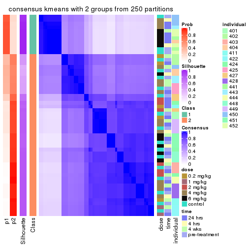</p>

</div>
<div id='tab-SD-kmeans-consensus-heatmap-2'>
<pre><code class="r">consensus_heatmap(res, k = 3)
</code></pre>

<p>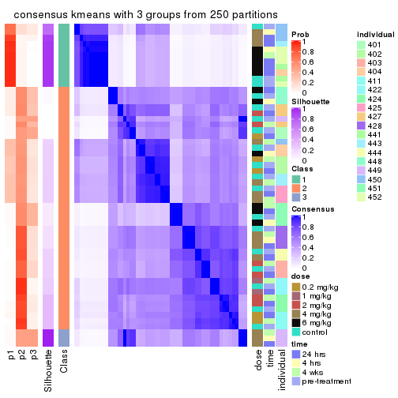</p>

</div>
<div id='tab-SD-kmeans-consensus-heatmap-3'>
<pre><code class="r">consensus_heatmap(res, k = 4)
</code></pre>

<p>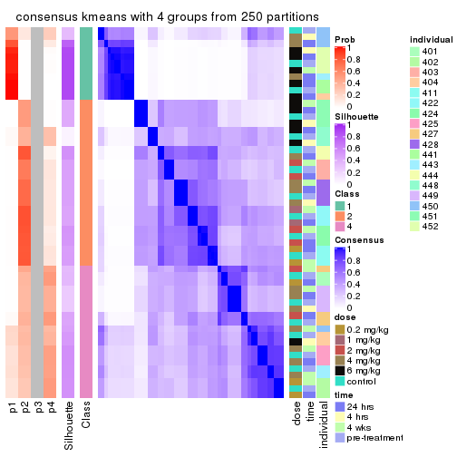</p>

</div>
<div id='tab-SD-kmeans-consensus-heatmap-4'>
<pre><code class="r">consensus_heatmap(res, k = 5)
</code></pre>

<p>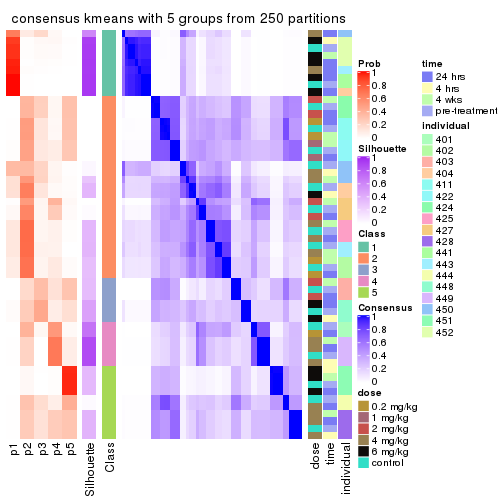</p>

</div>
<div id='tab-SD-kmeans-consensus-heatmap-5'>
<pre><code class="r">consensus_heatmap(res, k = 6)
</code></pre>

<p>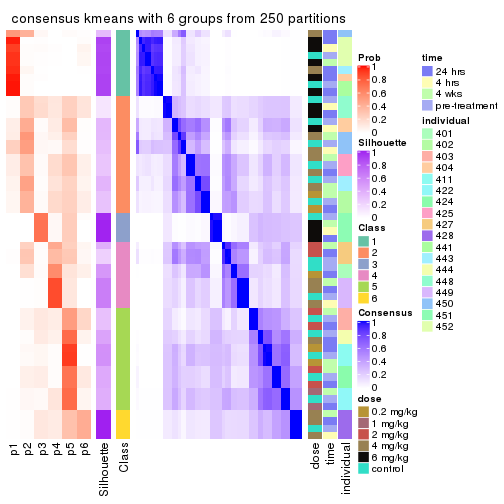</p>

</div>
</div>

Heatmaps for the membership of samples in all partitions to see how consistent they are:


<script>
$( function() {
	$( '#tabs-SD-kmeans-membership-heatmap' ).tabs();
} );
</script>
<div id='tabs-SD-kmeans-membership-heatmap'>
<ul>
<li><a href='#tab-SD-kmeans-membership-heatmap-1'>k = 2</a></li>
<li><a href='#tab-SD-kmeans-membership-heatmap-2'>k = 3</a></li>
<li><a href='#tab-SD-kmeans-membership-heatmap-3'>k = 4</a></li>
<li><a href='#tab-SD-kmeans-membership-heatmap-4'>k = 5</a></li>
<li><a href='#tab-SD-kmeans-membership-heatmap-5'>k = 6</a></li>
</ul>
<div id='tab-SD-kmeans-membership-heatmap-1'>
<pre><code class="r">membership_heatmap(res, k = 2)
</code></pre>

<p>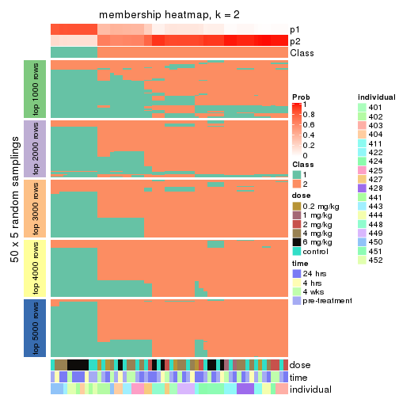</p>

</div>
<div id='tab-SD-kmeans-membership-heatmap-2'>
<pre><code class="r">membership_heatmap(res, k = 3)
</code></pre>

<p>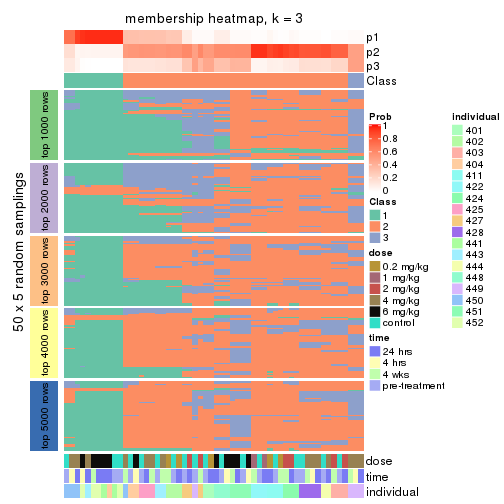</p>

</div>
<div id='tab-SD-kmeans-membership-heatmap-3'>
<pre><code class="r">membership_heatmap(res, k = 4)
</code></pre>

<p>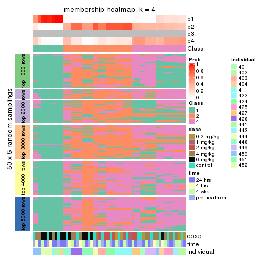</p>

</div>
<div id='tab-SD-kmeans-membership-heatmap-4'>
<pre><code class="r">membership_heatmap(res, k = 5)
</code></pre>

<p>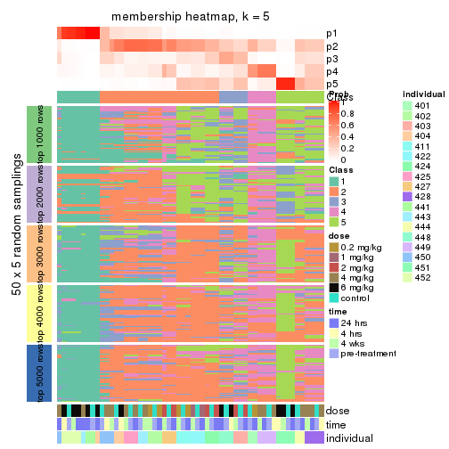</p>

</div>
<div id='tab-SD-kmeans-membership-heatmap-5'>
<pre><code class="r">membership_heatmap(res, k = 6)
</code></pre>

<p>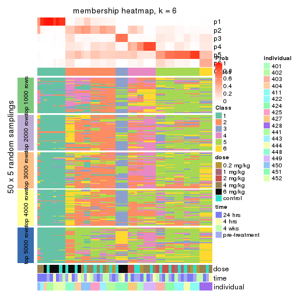</p>

</div>
</div>

As soon as we have had the classes for columns, we can look for signatures
which are significantly different between classes which can be candidate marks
for certain classes. Following are the heatmaps for signatures.


Signature heatmaps where rows are scaled:


<script>
$( function() {
	$( '#tabs-SD-kmeans-get-signatures' ).tabs();
} );
</script>
<div id='tabs-SD-kmeans-get-signatures'>
<ul>
<li><a href='#tab-SD-kmeans-get-signatures-1'>k = 2</a></li>
<li><a href='#tab-SD-kmeans-get-signatures-2'>k = 3</a></li>
<li><a href='#tab-SD-kmeans-get-signatures-3'>k = 4</a></li>
<li><a href='#tab-SD-kmeans-get-signatures-4'>k = 5</a></li>
<li><a href='#tab-SD-kmeans-get-signatures-5'>k = 6</a></li>
</ul>
<div id='tab-SD-kmeans-get-signatures-1'>
<pre><code class="r">get_signatures(res, k = 2)
</code></pre>

<p>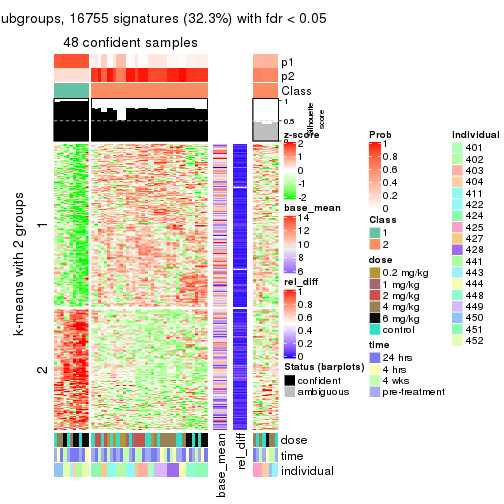</p>

</div>
<div id='tab-SD-kmeans-get-signatures-2'>
<pre><code class="r">get_signatures(res, k = 3)
</code></pre>

<p>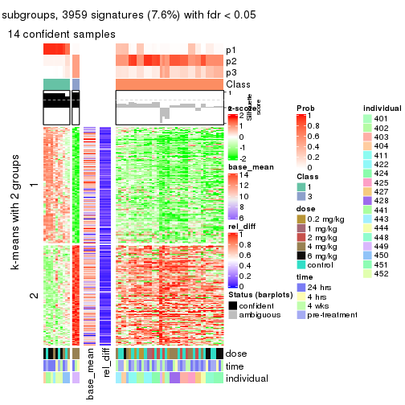</p>

</div>
<div id='tab-SD-kmeans-get-signatures-3'>
<pre><code class="r">get_signatures(res, k = 4)
</code></pre>

<p>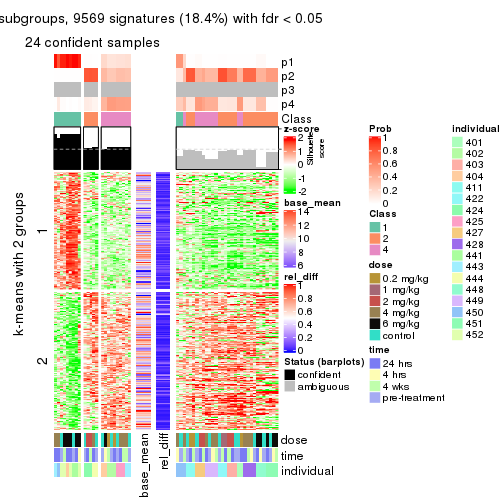</p>

</div>
<div id='tab-SD-kmeans-get-signatures-4'>
<pre><code class="r">get_signatures(res, k = 5)
</code></pre>

<p>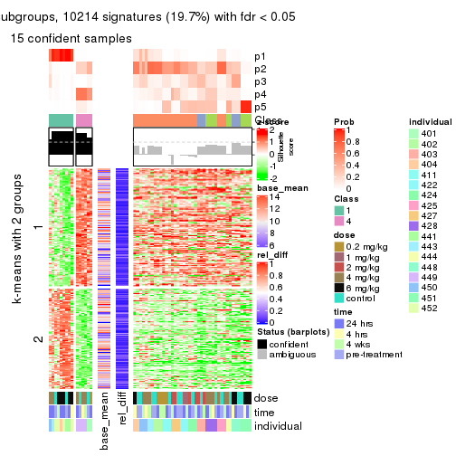</p>

</div>
<div id='tab-SD-kmeans-get-signatures-5'>
<pre><code class="r">get_signatures(res, k = 6)
</code></pre>

<p>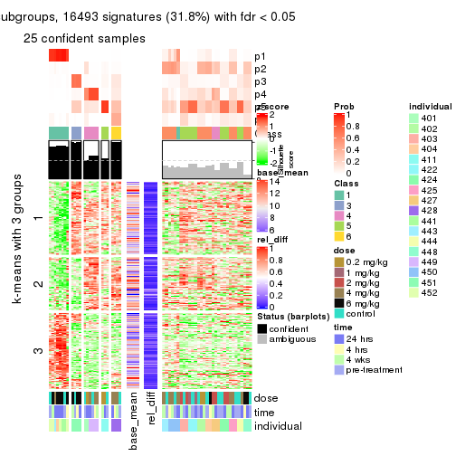</p>

</div>
</div>


Signature heatmaps where rows are not scaled:


<script>
$( function() {
	$( '#tabs-SD-kmeans-get-signatures-no-scale' ).tabs();
} );
</script>
<div id='tabs-SD-kmeans-get-signatures-no-scale'>
<ul>
<li><a href='#tab-SD-kmeans-get-signatures-no-scale-1'>k = 2</a></li>
<li><a href='#tab-SD-kmeans-get-signatures-no-scale-2'>k = 3</a></li>
<li><a href='#tab-SD-kmeans-get-signatures-no-scale-3'>k = 4</a></li>
<li><a href='#tab-SD-kmeans-get-signatures-no-scale-4'>k = 5</a></li>
<li><a href='#tab-SD-kmeans-get-signatures-no-scale-5'>k = 6</a></li>
</ul>
<div id='tab-SD-kmeans-get-signatures-no-scale-1'>
<pre><code class="r">get_signatures(res, k = 2, scale_rows = FALSE)
</code></pre>

<p>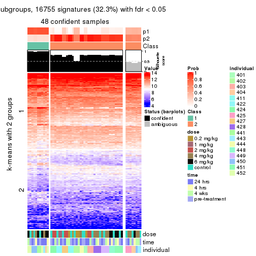</p>

</div>
<div id='tab-SD-kmeans-get-signatures-no-scale-2'>
<pre><code class="r">get_signatures(res, k = 3, scale_rows = FALSE)
</code></pre>

<p>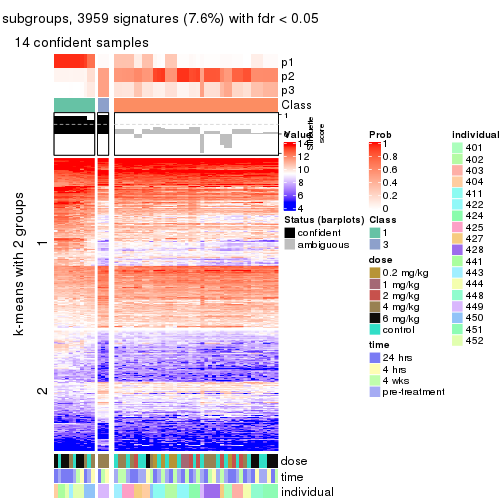</p>

</div>
<div id='tab-SD-kmeans-get-signatures-no-scale-3'>
<pre><code class="r">get_signatures(res, k = 4, scale_rows = FALSE)
</code></pre>

<p></p>

</div>
<div id='tab-SD-kmeans-get-signatures-no-scale-4'>
<pre><code class="r">get_signatures(res, k = 5, scale_rows = FALSE)
</code></pre>

<p>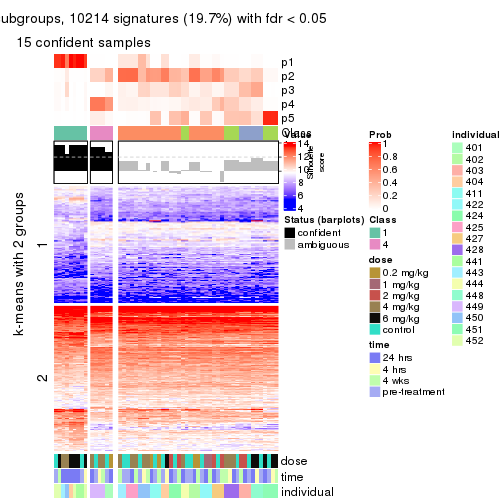</p>

</div>
<div id='tab-SD-kmeans-get-signatures-no-scale-5'>
<pre><code class="r">get_signatures(res, k = 6, scale_rows = FALSE)
</code></pre>

<p>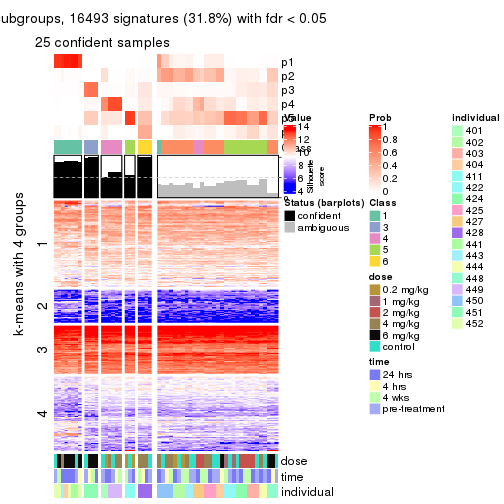</p>

</div>
</div>


Compare the overlap of signatures from different k:

```r
compare_signatures(res)
```

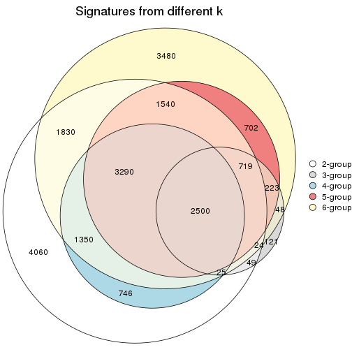

`get_signature()` returns a data frame invisibly. TO get the list of signatures, the function
call should be assigned to a variable explicitly. In following code, if `plot` argument is set
to `FALSE`, no heatmap is plotted while only the differential analysis is performed.

```r
# code only for demonstration
tb = get_signature(res, k = ..., plot = FALSE)
```

An example of the output of `tb` is:

```
#>   which_row         fdr    mean_1    mean_2 scaled_mean_1 scaled_mean_2 km
#> 1        38 0.042760348  8.373488  9.131774    -0.5533452     0.5164555  1
#> 2        40 0.018707592  7.106213  8.469186    -0.6173731     0.5762149  1
#> 3        55 0.019134737 10.221463 11.207825    -0.6159697     0.5749050  1
#> 4        59 0.006059896  5.921854  7.869574    -0.6899429     0.6439467  1
#> 5        60 0.018055526  8.928898 10.211722    -0.6204761     0.5791110  1
#> 6        98 0.009384629 15.714769 14.887706     0.6635654    -0.6193277  2
...
```

The columns in `tb` are:

1. `which_row`: row indices corresponding to the input matrix.
2. `fdr`: FDR for the differential test. 
3. `mean_x`: The mean value in group x.
4. `scaled_mean_x`: The mean value in group x after rows are scaled.
5. `km`: Row groups if k-means clustering is applied to rows.


UMAP plot which shows how samples are separated.


<script>
$( function() {
	$( '#tabs-SD-kmeans-dimension-reduction' ).tabs();
} );
</script>
<div id='tabs-SD-kmeans-dimension-reduction'>
<ul>
<li><a href='#tab-SD-kmeans-dimension-reduction-1'>k = 2</a></li>
<li><a href='#tab-SD-kmeans-dimension-reduction-2'>k = 3</a></li>
<li><a href='#tab-SD-kmeans-dimension-reduction-3'>k = 4</a></li>
<li><a href='#tab-SD-kmeans-dimension-reduction-4'>k = 5</a></li>
<li><a href='#tab-SD-kmeans-dimension-reduction-5'>k = 6</a></li>
</ul>
<div id='tab-SD-kmeans-dimension-reduction-1'>
<pre><code class="r">dimension_reduction(res, k = 2, method = &quot;UMAP&quot;)
</code></pre>

<p>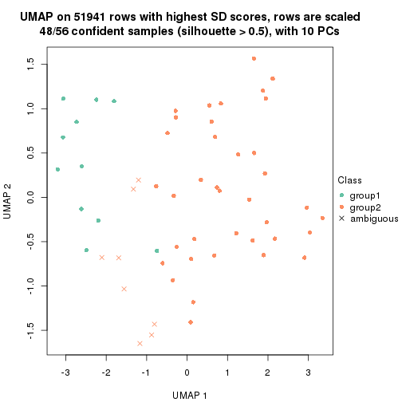</p>

</div>
<div id='tab-SD-kmeans-dimension-reduction-2'>
<pre><code class="r">dimension_reduction(res, k = 3, method = &quot;UMAP&quot;)
</code></pre>

<p>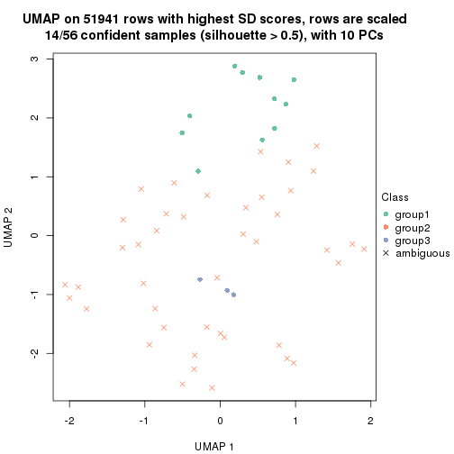</p>

</div>
<div id='tab-SD-kmeans-dimension-reduction-3'>
<pre><code class="r">dimension_reduction(res, k = 4, method = &quot;UMAP&quot;)
</code></pre>

<p>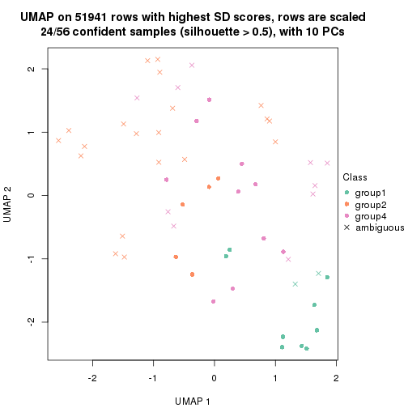</p>

</div>
<div id='tab-SD-kmeans-dimension-reduction-4'>
<pre><code class="r">dimension_reduction(res, k = 5, method = &quot;UMAP&quot;)
</code></pre>

<p>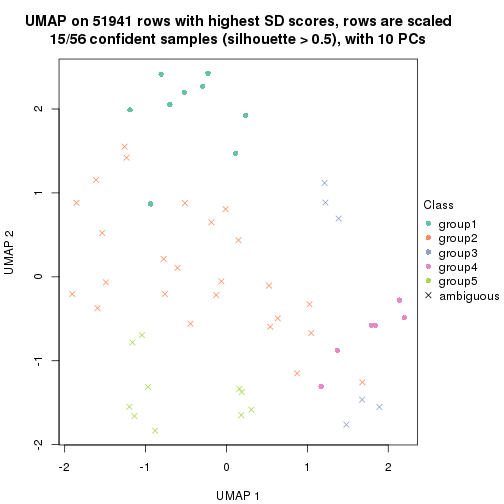</p>

</div>
<div id='tab-SD-kmeans-dimension-reduction-5'>
<pre><code class="r">dimension_reduction(res, k = 6, method = &quot;UMAP&quot;)
</code></pre>

<p>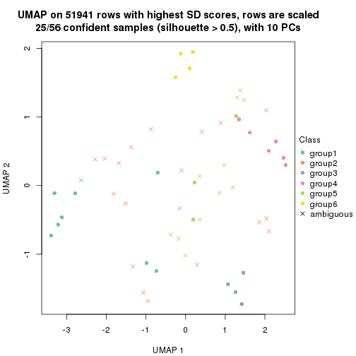</p>

</div>
</div>


Following heatmap shows how subgroups are split when increasing `k`:

```r
collect_classes(res)
```

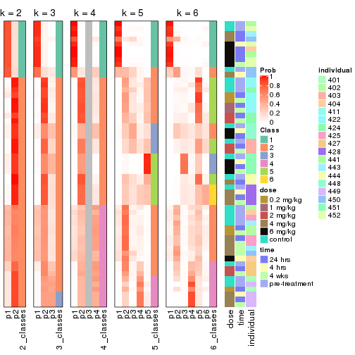


Test correlation between subgroups and known annotations. If the known
annotation is numeric, one-way ANOVA test is applied, and if the known
annotation is discrete, chi-squared contingency table test is applied.

```r
test_to_known_factors(res)
```

```
#>            n dose(p) time(p) individual(p) k
#> SD:kmeans 48  0.1368   0.617      4.75e-05 2
#> SD:kmeans 14  0.0784   0.548      1.56e-02 3
#> SD:kmeans 24  0.0343   0.746      5.11e-04 4
#> SD:kmeans 15  0.1200   0.870      2.03e-02 5
#> SD:kmeans 25  0.0136   0.998      6.36e-09 6
```


If matrix rows can be associated to genes, consider to use `functional_enrichment(res,
...)` to perform function enrichment for the signature genes. See [this vignette](http://bioconductor.org/packages/devel/bioc/vignettes/cola/inst/doc/functional_enrichment.html) for more detailed explanations.


 

---------------------------------------------------


### SD:skmeans


The object with results only for a single top-value method and a single partition method 
can be extracted as:

```r
res = res_list["SD", "skmeans"]
# you can also extract it by
# res = res_list["SD:skmeans"]
```

A summary of `res` and all the functions that can be applied to it:

```r
res
```

```
#> A 'ConsensusPartition' object with k = 2, 3, 4, 5, 6.
#>   On a matrix with 51941 rows and 56 columns.
#>   Top rows (1000, 2000, 3000, 4000, 5000) are extracted by 'SD' method.
#>   Subgroups are detected by 'skmeans' method.
#>   Performed in total 1250 partitions by row resampling.
#>   Best k for subgroups seems to be 2.
#> 
#> Following methods can be applied to this 'ConsensusPartition' object:
#>  [1] "cola_report"             "collect_classes"         "collect_plots"          
#>  [4] "collect_stats"           "colnames"                "compare_signatures"     
#>  [7] "consensus_heatmap"       "dimension_reduction"     "functional_enrichment"  
#> [10] "get_anno_col"            "get_anno"                "get_classes"            
#> [13] "get_consensus"           "get_matrix"              "get_membership"         
#> [16] "get_param"               "get_signatures"          "get_stats"              
#> [19] "is_best_k"               "is_stable_k"             "membership_heatmap"     
#> [22] "ncol"                    "nrow"                    "plot_ecdf"              
#> [25] "rownames"                "select_partition_number" "show"                   
#> [28] "suggest_best_k"          "test_to_known_factors"
```

`collect_plots()` function collects all the plots made from `res` for all `k` (number of partitions)
into one single page to provide an easy and fast comparison between different `k`.

```r
collect_plots(res)
```

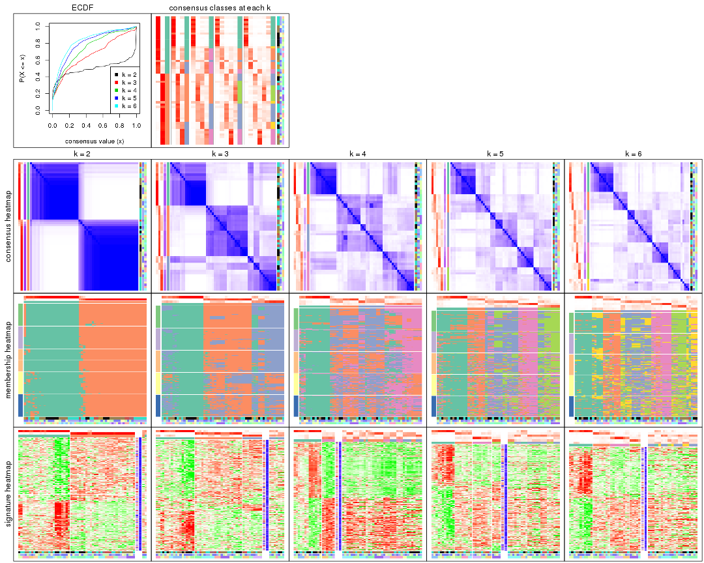

The plots are:

- The first row: a plot of the ECDF (empirical cumulative distribution
  function) curves of the consensus matrix for each `k` and the heatmap of
  predicted classes for each `k`.
- The second row: heatmaps of the consensus matrix for each `k`.
- The third row: heatmaps of the membership matrix for each `k`.
- The fouth row: heatmaps of the signatures for each `k`.

All the plots in panels can be made by individual functions and they are
plotted later in this section.

`select_partition_number()` produces several plots showing different
statistics for choosing "optimized" `k`. There are following statistics:

- ECDF curves of the consensus matrix for each `k`;
- 1-PAC. [The PAC
  score](https://en.wikipedia.org/wiki/Consensus_clustering#Over-interpretation_potential_of_consensus_clustering)
  measures the proportion of the ambiguous subgrouping.
- Mean silhouette score.
- Concordance. The mean probability of fiting the consensus class ids in all
  partitions.
- Area increased. Denote $A_k$ as the area under the ECDF curve for current
  `k`, the area increased is defined as $A_k - A_{k-1}$.
- Rand index. The percent of pairs of samples that are both in a same cluster
  or both are not in a same cluster in the partition of k and k-1.
- Jaccard index. The ratio of pairs of samples are both in a same cluster in
  the partition of k and k-1 and the pairs of samples are both in a same
  cluster in the partition k or k-1.

The detailed explanations of these statistics can be found in [the _cola_
vignette](http://bioconductor.org/packages/devel/bioc/vignettes/cola/inst/doc/cola.html#toc_13).

Generally speaking, lower PAC score, higher mean silhouette score or higher
concordance corresponds to better partition. Rand index and Jaccard index
measure how similar the current partition is compared to partition with `k-1`.
If they are too similar, we won't accept `k` is better than `k-1`.

```r
select_partition_number(res)
```

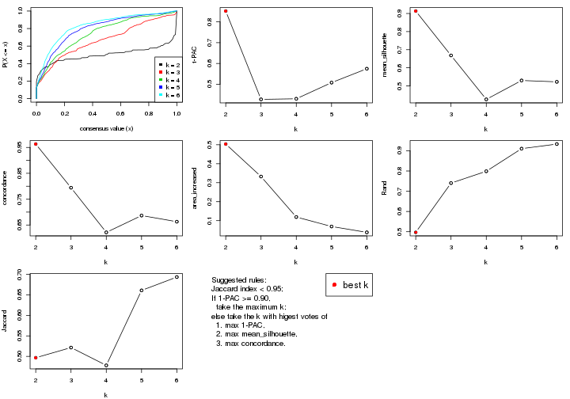

The numeric values for all these statistics can be obtained by `get_stats()`.

```r
get_stats(res)
```

```
#>   k 1-PAC mean_silhouette concordance area_increased  Rand Jaccard
#> 2 2 0.852           0.913       0.963         0.5037 0.497   0.497
#> 3 3 0.427           0.668       0.794         0.3324 0.740   0.522
#> 4 4 0.430           0.426       0.622         0.1189 0.799   0.478
#> 5 5 0.508           0.530       0.687         0.0690 0.910   0.661
#> 6 6 0.575           0.523       0.663         0.0381 0.933   0.693
```

`suggest_best_k()` suggests the best $k$ based on these statistics. The rules are as follows:

- All $k$ with Jaccard index larger than 0.95 are removed because increasing
  $k$ does not provide enough extra information. If all $k$ are removed, it is
  marked as no subgroup is detected.
- For all $k$ with 1-PAC score larger than 0.9, the maximal $k$ is taken as
  the best $k$, and other $k$ are marked as optional $k$.
- If it does not fit the second rule. The $k$ with the maximal vote of the
  highest 1-PAC score, highest mean silhouette, and highest concordance is
  taken as the best $k$.

```r
suggest_best_k(res)
```

```
#> [1] 2
```


Following shows the table of the partitions (You need to click the **show/hide
code output** link to see it). The membership matrix (columns with name `p*`)
is inferred by
[`clue::cl_consensus()`](https://www.rdocumentation.org/link/cl_consensus?package=clue)
function with the `SE` method. Basically the value in the membership matrix
represents the probability to belong to a certain group. The finall class
label for an item is determined with the group with highest probability it
belongs to.

In `get_classes()` function, the entropy is calculated from the membership
matrix and the silhouette score is calculated from the consensus matrix.


<script>
$( function() {
	$( '#tabs-SD-skmeans-get-classes' ).tabs();
} );
</script>
<div id='tabs-SD-skmeans-get-classes'>
<ul>
<li><a href='#tab-SD-skmeans-get-classes-1'>k = 2</a></li>
<li><a href='#tab-SD-skmeans-get-classes-2'>k = 3</a></li>
<li><a href='#tab-SD-skmeans-get-classes-3'>k = 4</a></li>
<li><a href='#tab-SD-skmeans-get-classes-4'>k = 5</a></li>
<li><a href='#tab-SD-skmeans-get-classes-5'>k = 6</a></li>
</ul>

<div id='tab-SD-skmeans-get-classes-1'>
<p><a id='tab-SD-skmeans-get-classes-1-a' style='color:#0366d6' href='#'>show/hide code output</a></p>
<pre><code class="r">cbind(get_classes(res, k = 2), get_membership(res, k = 2))
</code></pre>

<pre><code>#&gt;           class entropy silhouette    p1    p2
#&gt; GSM687644     2  0.1843      0.940 0.028 0.972
#&gt; GSM687648     1  0.1843      0.946 0.972 0.028
#&gt; GSM687653     2  0.0000      0.960 0.000 1.000
#&gt; GSM687658     1  0.0000      0.960 1.000 0.000
#&gt; GSM687663     2  0.7219      0.745 0.200 0.800
#&gt; GSM687668     2  0.0000      0.960 0.000 1.000
#&gt; GSM687673     2  0.9044      0.539 0.320 0.680
#&gt; GSM687678     1  0.2948      0.930 0.948 0.052
#&gt; GSM687683     1  0.5294      0.865 0.880 0.120
#&gt; GSM687688     2  0.0000      0.960 0.000 1.000
#&gt; GSM687695     1  0.0000      0.960 1.000 0.000
#&gt; GSM687699     1  0.0000      0.960 1.000 0.000
#&gt; GSM687704     2  0.0000      0.960 0.000 1.000
#&gt; GSM687707     2  0.1633      0.944 0.024 0.976
#&gt; GSM687712     2  0.0000      0.960 0.000 1.000
#&gt; GSM687719     1  0.0000      0.960 1.000 0.000
#&gt; GSM687724     2  0.0000      0.960 0.000 1.000
#&gt; GSM687728     1  0.0000      0.960 1.000 0.000
#&gt; GSM687646     2  0.0376      0.958 0.004 0.996
#&gt; GSM687649     1  0.4298      0.900 0.912 0.088
#&gt; GSM687665     1  0.9522      0.387 0.628 0.372
#&gt; GSM687651     1  0.5629      0.853 0.868 0.132
#&gt; GSM687667     2  0.0376      0.958 0.004 0.996
#&gt; GSM687670     2  0.0000      0.960 0.000 1.000
#&gt; GSM687671     2  0.0000      0.960 0.000 1.000
#&gt; GSM687654     2  0.0000      0.960 0.000 1.000
#&gt; GSM687675     2  0.9998      0.042 0.492 0.508
#&gt; GSM687685     1  0.4690      0.888 0.900 0.100
#&gt; GSM687656     2  0.0000      0.960 0.000 1.000
#&gt; GSM687677     2  0.0376      0.958 0.004 0.996
#&gt; GSM687687     2  0.0672      0.956 0.008 0.992
#&gt; GSM687692     2  0.0000      0.960 0.000 1.000
#&gt; GSM687716     2  0.0000      0.960 0.000 1.000
#&gt; GSM687722     1  0.0000      0.960 1.000 0.000
#&gt; GSM687680     1  0.0376      0.959 0.996 0.004
#&gt; GSM687690     2  0.0000      0.960 0.000 1.000
#&gt; GSM687700     1  0.0000      0.960 1.000 0.000
#&gt; GSM687705     2  0.0000      0.960 0.000 1.000
#&gt; GSM687714     2  0.0000      0.960 0.000 1.000
#&gt; GSM687721     1  0.0000      0.960 1.000 0.000
#&gt; GSM687682     1  0.0938      0.955 0.988 0.012
#&gt; GSM687694     2  0.0000      0.960 0.000 1.000
#&gt; GSM687702     1  0.0000      0.960 1.000 0.000
#&gt; GSM687718     2  0.0000      0.960 0.000 1.000
#&gt; GSM687723     1  0.0376      0.959 0.996 0.004
#&gt; GSM687661     1  0.0000      0.960 1.000 0.000
#&gt; GSM687710     2  0.2043      0.939 0.032 0.968
#&gt; GSM687726     2  0.0000      0.960 0.000 1.000
#&gt; GSM687730     1  0.0000      0.960 1.000 0.000
#&gt; GSM687660     1  0.0000      0.960 1.000 0.000
#&gt; GSM687697     1  0.0000      0.960 1.000 0.000
#&gt; GSM687709     2  0.2603      0.929 0.044 0.956
#&gt; GSM687725     2  0.0000      0.960 0.000 1.000
#&gt; GSM687729     1  0.0000      0.960 1.000 0.000
#&gt; GSM687727     2  0.0000      0.960 0.000 1.000
#&gt; GSM687731     1  0.0000      0.960 1.000 0.000
</code></pre>

<script>
$('#tab-SD-skmeans-get-classes-1-a').parent().next().next().hide();
$('#tab-SD-skmeans-get-classes-1-a').click(function(){
  $('#tab-SD-skmeans-get-classes-1-a').parent().next().next().toggle();
  return(false);
});
</script>
</div>

<div id='tab-SD-skmeans-get-classes-2'>
<p><a id='tab-SD-skmeans-get-classes-2-a' style='color:#0366d6' href='#'>show/hide code output</a></p>
<pre><code class="r">cbind(get_classes(res, k = 3), get_membership(res, k = 3))
</code></pre>

<pre><code>#&gt;           class entropy silhouette    p1    p2    p3
#&gt; GSM687644     3  0.2356     0.7070 0.000 0.072 0.928
#&gt; GSM687648     3  0.8128    -0.0618 0.440 0.068 0.492
#&gt; GSM687653     2  0.2356     0.7895 0.000 0.928 0.072
#&gt; GSM687658     1  0.4453     0.7708 0.836 0.012 0.152
#&gt; GSM687663     2  0.5793     0.7334 0.116 0.800 0.084
#&gt; GSM687668     2  0.6262     0.6788 0.020 0.696 0.284
#&gt; GSM687673     2  0.5466     0.7124 0.160 0.800 0.040
#&gt; GSM687678     1  0.7962     0.2701 0.512 0.060 0.428
#&gt; GSM687683     3  0.4679     0.6414 0.148 0.020 0.832
#&gt; GSM687688     2  0.5678     0.6482 0.000 0.684 0.316
#&gt; GSM687695     1  0.0000     0.8452 1.000 0.000 0.000
#&gt; GSM687699     1  0.6090     0.6498 0.716 0.020 0.264
#&gt; GSM687704     2  0.3116     0.7831 0.000 0.892 0.108
#&gt; GSM687707     3  0.7752     0.2758 0.048 0.456 0.496
#&gt; GSM687712     3  0.2878     0.7048 0.000 0.096 0.904
#&gt; GSM687719     1  0.0424     0.8424 0.992 0.000 0.008
#&gt; GSM687724     2  0.2261     0.7837 0.000 0.932 0.068
#&gt; GSM687728     1  0.0000     0.8452 1.000 0.000 0.000
#&gt; GSM687646     3  0.2796     0.7091 0.000 0.092 0.908
#&gt; GSM687649     3  0.8034     0.1072 0.392 0.068 0.540
#&gt; GSM687665     2  0.6723     0.6395 0.212 0.724 0.064
#&gt; GSM687651     3  0.8738     0.2689 0.328 0.128 0.544
#&gt; GSM687667     2  0.2772     0.7874 0.004 0.916 0.080
#&gt; GSM687670     2  0.6621     0.6869 0.032 0.684 0.284
#&gt; GSM687671     2  0.5656     0.6987 0.004 0.712 0.284
#&gt; GSM687654     2  0.2537     0.7893 0.000 0.920 0.080
#&gt; GSM687675     2  0.6539     0.5695 0.288 0.684 0.028
#&gt; GSM687685     3  0.5375     0.6540 0.128 0.056 0.816
#&gt; GSM687656     2  0.2625     0.7904 0.000 0.916 0.084
#&gt; GSM687677     2  0.3276     0.7945 0.024 0.908 0.068
#&gt; GSM687687     3  0.2711     0.7015 0.000 0.088 0.912
#&gt; GSM687692     2  0.5706     0.6432 0.000 0.680 0.320
#&gt; GSM687716     3  0.3038     0.7041 0.000 0.104 0.896
#&gt; GSM687722     1  0.0747     0.8408 0.984 0.000 0.016
#&gt; GSM687680     1  0.6155     0.5828 0.664 0.008 0.328
#&gt; GSM687690     2  0.5982     0.6381 0.004 0.668 0.328
#&gt; GSM687700     1  0.0000     0.8452 1.000 0.000 0.000
#&gt; GSM687705     2  0.3983     0.7779 0.004 0.852 0.144
#&gt; GSM687714     3  0.3038     0.7062 0.000 0.104 0.896
#&gt; GSM687721     1  0.0237     0.8437 0.996 0.000 0.004
#&gt; GSM687682     1  0.6209     0.5188 0.628 0.004 0.368
#&gt; GSM687694     2  0.5810     0.6357 0.000 0.664 0.336
#&gt; GSM687702     1  0.6543     0.5319 0.640 0.016 0.344
#&gt; GSM687718     3  0.3038     0.7052 0.000 0.104 0.896
#&gt; GSM687723     1  0.6142     0.6685 0.748 0.040 0.212
#&gt; GSM687661     1  0.5858     0.6757 0.740 0.020 0.240
#&gt; GSM687710     3  0.7757     0.3576 0.052 0.408 0.540
#&gt; GSM687726     2  0.1753     0.7861 0.000 0.952 0.048
#&gt; GSM687730     1  0.0000     0.8452 1.000 0.000 0.000
#&gt; GSM687660     1  0.0000     0.8452 1.000 0.000 0.000
#&gt; GSM687697     1  0.0000     0.8452 1.000 0.000 0.000
#&gt; GSM687709     3  0.8085     0.3496 0.068 0.412 0.520
#&gt; GSM687725     2  0.1860     0.7855 0.000 0.948 0.052
#&gt; GSM687729     1  0.0000     0.8452 1.000 0.000 0.000
#&gt; GSM687727     2  0.1860     0.7855 0.000 0.948 0.052
#&gt; GSM687731     1  0.0000     0.8452 1.000 0.000 0.000
</code></pre>

<script>
$('#tab-SD-skmeans-get-classes-2-a').parent().next().next().hide();
$('#tab-SD-skmeans-get-classes-2-a').click(function(){
  $('#tab-SD-skmeans-get-classes-2-a').parent().next().next().toggle();
  return(false);
});
</script>
</div>

<div id='tab-SD-skmeans-get-classes-3'>
<p><a id='tab-SD-skmeans-get-classes-3-a' style='color:#0366d6' href='#'>show/hide code output</a></p>
<pre><code class="r">cbind(get_classes(res, k = 4), get_membership(res, k = 4))
</code></pre>

<pre><code>#&gt;           class entropy silhouette    p1    p2    p3    p4
#&gt; GSM687644     4  0.5664     0.5446 0.000 0.156 0.124 0.720
#&gt; GSM687648     4  0.7319     0.4698 0.204 0.040 0.132 0.624
#&gt; GSM687653     3  0.6430     0.2547 0.000 0.428 0.504 0.068
#&gt; GSM687658     1  0.6923     0.6122 0.656 0.028 0.160 0.156
#&gt; GSM687663     3  0.8243     0.1646 0.096 0.392 0.440 0.072
#&gt; GSM687668     2  0.6154     0.4108 0.012 0.704 0.128 0.156
#&gt; GSM687673     2  0.7679     0.1524 0.136 0.540 0.296 0.028
#&gt; GSM687678     4  0.6702     0.4311 0.308 0.032 0.052 0.608
#&gt; GSM687683     4  0.8042     0.5325 0.096 0.160 0.152 0.592
#&gt; GSM687688     2  0.3611     0.4504 0.000 0.860 0.060 0.080
#&gt; GSM687695     1  0.0376     0.8761 0.992 0.000 0.004 0.004
#&gt; GSM687699     4  0.8269     0.1119 0.404 0.056 0.120 0.420
#&gt; GSM687704     3  0.6392     0.2615 0.000 0.404 0.528 0.068
#&gt; GSM687707     3  0.4905     0.2946 0.020 0.060 0.800 0.120
#&gt; GSM687712     4  0.7216     0.5011 0.000 0.208 0.244 0.548
#&gt; GSM687719     1  0.2644     0.8524 0.908 0.000 0.060 0.032
#&gt; GSM687724     3  0.5604     0.1274 0.000 0.476 0.504 0.020
#&gt; GSM687728     1  0.0469     0.8729 0.988 0.000 0.000 0.012
#&gt; GSM687646     4  0.5849     0.5403 0.000 0.164 0.132 0.704
#&gt; GSM687649     4  0.6614     0.4952 0.156 0.024 0.140 0.680
#&gt; GSM687665     3  0.9442     0.0623 0.240 0.320 0.336 0.104
#&gt; GSM687651     4  0.6762     0.4757 0.120 0.032 0.176 0.672
#&gt; GSM687667     2  0.6734    -0.2062 0.008 0.488 0.436 0.068
#&gt; GSM687670     2  0.5512     0.4318 0.012 0.756 0.120 0.112
#&gt; GSM687671     2  0.5380     0.4122 0.000 0.744 0.120 0.136
#&gt; GSM687654     3  0.6555     0.2344 0.000 0.444 0.480 0.076
#&gt; GSM687675     2  0.8523     0.0519 0.300 0.420 0.248 0.032
#&gt; GSM687685     4  0.7486     0.5454 0.080 0.132 0.148 0.640
#&gt; GSM687656     3  0.6650     0.2473 0.000 0.432 0.484 0.084
#&gt; GSM687677     2  0.5840     0.1133 0.004 0.612 0.348 0.036
#&gt; GSM687687     4  0.6739     0.5204 0.000 0.216 0.172 0.612
#&gt; GSM687692     2  0.3687     0.4563 0.000 0.856 0.064 0.080
#&gt; GSM687716     4  0.7344     0.4864 0.000 0.224 0.248 0.528
#&gt; GSM687722     1  0.2908     0.8472 0.896 0.000 0.064 0.040
#&gt; GSM687680     4  0.6980     0.2230 0.416 0.040 0.040 0.504
#&gt; GSM687690     2  0.3616     0.4491 0.000 0.852 0.036 0.112
#&gt; GSM687700     1  0.0895     0.8724 0.976 0.000 0.004 0.020
#&gt; GSM687705     3  0.6114     0.2335 0.000 0.428 0.524 0.048
#&gt; GSM687714     4  0.7244     0.4969 0.000 0.212 0.244 0.544
#&gt; GSM687721     1  0.2385     0.8574 0.920 0.000 0.052 0.028
#&gt; GSM687682     4  0.7314     0.3028 0.388 0.068 0.036 0.508
#&gt; GSM687694     2  0.3301     0.4674 0.000 0.876 0.048 0.076
#&gt; GSM687702     4  0.7680     0.3061 0.324 0.048 0.092 0.536
#&gt; GSM687718     4  0.7293     0.4931 0.000 0.216 0.248 0.536
#&gt; GSM687723     1  0.8433     0.4120 0.548 0.100 0.156 0.196
#&gt; GSM687661     1  0.7732     0.5040 0.588 0.044 0.172 0.196
#&gt; GSM687710     3  0.5031     0.2859 0.016 0.056 0.784 0.144
#&gt; GSM687726     3  0.5512     0.1083 0.000 0.488 0.496 0.016
#&gt; GSM687730     1  0.0524     0.8736 0.988 0.000 0.004 0.008
#&gt; GSM687660     1  0.0707     0.8740 0.980 0.000 0.020 0.000
#&gt; GSM687697     1  0.0376     0.8761 0.992 0.000 0.004 0.004
#&gt; GSM687709     3  0.5365     0.2766 0.024 0.060 0.768 0.148
#&gt; GSM687725     2  0.5409    -0.2245 0.000 0.496 0.492 0.012
#&gt; GSM687729     1  0.0188     0.8750 0.996 0.000 0.000 0.004
#&gt; GSM687727     2  0.5408    -0.2250 0.000 0.500 0.488 0.012
#&gt; GSM687731     1  0.0707     0.8685 0.980 0.000 0.000 0.020
</code></pre>

<script>
$('#tab-SD-skmeans-get-classes-3-a').parent().next().next().hide();
$('#tab-SD-skmeans-get-classes-3-a').click(function(){
  $('#tab-SD-skmeans-get-classes-3-a').parent().next().next().toggle();
  return(false);
});
</script>
</div>

<div id='tab-SD-skmeans-get-classes-4'>
<p><a id='tab-SD-skmeans-get-classes-4-a' style='color:#0366d6' href='#'>show/hide code output</a></p>
<pre><code class="r">cbind(get_classes(res, k = 5), get_membership(res, k = 5))
</code></pre>

<pre><code>#&gt;           class entropy silhouette    p1    p2    p3    p4    p5
#&gt; GSM687644     4  0.5240      0.635 0.000 0.204 0.040 0.708 0.048
#&gt; GSM687648     2  0.6247      0.664 0.112 0.676 0.024 0.152 0.036
#&gt; GSM687653     3  0.5956      0.401 0.000 0.068 0.668 0.072 0.192
#&gt; GSM687658     1  0.7756      0.369 0.516 0.276 0.060 0.060 0.088
#&gt; GSM687663     3  0.7369      0.324 0.088 0.128 0.600 0.036 0.148
#&gt; GSM687668     5  0.7159      0.478 0.004 0.092 0.168 0.160 0.576
#&gt; GSM687673     5  0.7981      0.200 0.104 0.100 0.340 0.024 0.432
#&gt; GSM687678     2  0.8120      0.625 0.208 0.504 0.048 0.168 0.072
#&gt; GSM687683     4  0.7221      0.537 0.084 0.188 0.056 0.608 0.064
#&gt; GSM687688     5  0.4814      0.536 0.000 0.020 0.076 0.152 0.752
#&gt; GSM687695     1  0.0290      0.771 0.992 0.008 0.000 0.000 0.000
#&gt; GSM687699     2  0.7557      0.561 0.308 0.504 0.044 0.096 0.048
#&gt; GSM687704     3  0.5660      0.429 0.000 0.024 0.684 0.152 0.140
#&gt; GSM687707     3  0.7981      0.306 0.004 0.200 0.432 0.268 0.096
#&gt; GSM687712     4  0.1314      0.786 0.000 0.016 0.012 0.960 0.012
#&gt; GSM687719     1  0.4640      0.680 0.732 0.220 0.012 0.004 0.032
#&gt; GSM687724     3  0.6229      0.370 0.000 0.040 0.588 0.080 0.292
#&gt; GSM687728     1  0.1121      0.756 0.956 0.044 0.000 0.000 0.000
#&gt; GSM687646     4  0.5168      0.650 0.000 0.188 0.036 0.720 0.056
#&gt; GSM687649     2  0.5594      0.623 0.072 0.700 0.016 0.192 0.020
#&gt; GSM687665     3  0.7336      0.256 0.196 0.112 0.564 0.008 0.120
#&gt; GSM687651     2  0.6505      0.618 0.076 0.660 0.080 0.164 0.020
#&gt; GSM687667     3  0.6127      0.329 0.004 0.080 0.640 0.044 0.232
#&gt; GSM687670     5  0.7111      0.476 0.012 0.080 0.220 0.108 0.580
#&gt; GSM687671     5  0.6711      0.495 0.004 0.080 0.152 0.140 0.624
#&gt; GSM687654     3  0.5907      0.401 0.000 0.052 0.668 0.084 0.196
#&gt; GSM687675     5  0.8358      0.174 0.232 0.096 0.296 0.012 0.364
#&gt; GSM687685     4  0.7066      0.528 0.064 0.220 0.036 0.600 0.080
#&gt; GSM687656     3  0.6130      0.386 0.000 0.072 0.648 0.072 0.208
#&gt; GSM687677     5  0.6621      0.107 0.008 0.076 0.424 0.032 0.460
#&gt; GSM687687     4  0.4349      0.736 0.000 0.120 0.032 0.796 0.052
#&gt; GSM687692     5  0.4281      0.548 0.000 0.004 0.056 0.172 0.768
#&gt; GSM687716     4  0.1885      0.784 0.000 0.012 0.020 0.936 0.032
#&gt; GSM687722     1  0.5145      0.668 0.716 0.212 0.020 0.012 0.040
#&gt; GSM687680     2  0.7488      0.642 0.268 0.520 0.012 0.112 0.088
#&gt; GSM687690     5  0.4504      0.550 0.000 0.024 0.048 0.156 0.772
#&gt; GSM687700     1  0.1205      0.766 0.956 0.040 0.000 0.000 0.004
#&gt; GSM687705     3  0.5711      0.433 0.004 0.040 0.704 0.136 0.116
#&gt; GSM687714     4  0.1393      0.786 0.000 0.012 0.008 0.956 0.024
#&gt; GSM687721     1  0.3692      0.719 0.812 0.152 0.008 0.000 0.028
#&gt; GSM687682     2  0.8076      0.601 0.300 0.460 0.040 0.128 0.072
#&gt; GSM687694     5  0.4002      0.558 0.000 0.024 0.028 0.144 0.804
#&gt; GSM687702     2  0.6882      0.623 0.212 0.604 0.028 0.120 0.036
#&gt; GSM687718     4  0.1372      0.781 0.000 0.004 0.016 0.956 0.024
#&gt; GSM687723     1  0.8517      0.244 0.416 0.308 0.064 0.136 0.076
#&gt; GSM687661     1  0.8337      0.285 0.456 0.288 0.064 0.104 0.088
#&gt; GSM687710     3  0.8009      0.265 0.004 0.224 0.404 0.284 0.084
#&gt; GSM687726     3  0.5951      0.375 0.000 0.032 0.604 0.068 0.296
#&gt; GSM687730     1  0.1282      0.758 0.952 0.044 0.000 0.000 0.004
#&gt; GSM687660     1  0.1124      0.771 0.960 0.036 0.004 0.000 0.000
#&gt; GSM687697     1  0.0162      0.771 0.996 0.004 0.000 0.000 0.000
#&gt; GSM687709     3  0.8307      0.284 0.020 0.228 0.428 0.232 0.092
#&gt; GSM687725     3  0.6204      0.369 0.000 0.036 0.596 0.088 0.280
#&gt; GSM687729     1  0.0609      0.767 0.980 0.020 0.000 0.000 0.000
#&gt; GSM687727     3  0.6250      0.379 0.000 0.036 0.592 0.092 0.280
#&gt; GSM687731     1  0.1557      0.747 0.940 0.052 0.000 0.000 0.008
</code></pre>

<script>
$('#tab-SD-skmeans-get-classes-4-a').parent().next().next().hide();
$('#tab-SD-skmeans-get-classes-4-a').click(function(){
  $('#tab-SD-skmeans-get-classes-4-a').parent().next().next().toggle();
  return(false);
});
</script>
</div>

<div id='tab-SD-skmeans-get-classes-5'>
<p><a id='tab-SD-skmeans-get-classes-5-a' style='color:#0366d6' href='#'>show/hide code output</a></p>
<pre><code class="r">cbind(get_classes(res, k = 6), get_membership(res, k = 6))
</code></pre>

<pre><code>#&gt;           class entropy silhouette    p1    p2    p3    p4    p5    p6
#&gt; GSM687644     4  0.6183     0.5350 0.000 0.232 0.040 0.608 0.060 0.060
#&gt; GSM687648     2  0.3660     0.6817 0.048 0.840 0.012 0.060 0.004 0.036
#&gt; GSM687653     3  0.7029     0.3778 0.000 0.060 0.564 0.080 0.148 0.148
#&gt; GSM687658     1  0.7815     0.2627 0.448 0.128 0.040 0.040 0.056 0.288
#&gt; GSM687663     3  0.6507     0.3869 0.056 0.088 0.656 0.028 0.112 0.060
#&gt; GSM687668     5  0.7611     0.4828 0.000 0.080 0.176 0.144 0.500 0.100
#&gt; GSM687673     3  0.7819     0.0832 0.052 0.032 0.308 0.012 0.308 0.288
#&gt; GSM687678     2  0.7782     0.6034 0.128 0.532 0.032 0.136 0.060 0.112
#&gt; GSM687683     4  0.6894     0.5538 0.056 0.112 0.024 0.608 0.052 0.148
#&gt; GSM687688     5  0.4277     0.6442 0.000 0.012 0.084 0.096 0.784 0.024
#&gt; GSM687695     1  0.0146     0.7838 0.996 0.004 0.000 0.000 0.000 0.000
#&gt; GSM687699     2  0.6696     0.5845 0.172 0.616 0.020 0.072 0.040 0.080
#&gt; GSM687704     3  0.6392     0.4238 0.000 0.040 0.620 0.156 0.120 0.064
#&gt; GSM687707     6  0.7226     0.3701 0.008 0.036 0.240 0.140 0.064 0.512
#&gt; GSM687712     4  0.1439     0.7606 0.000 0.012 0.012 0.952 0.016 0.008
#&gt; GSM687719     1  0.4381     0.6240 0.684 0.020 0.000 0.012 0.008 0.276
#&gt; GSM687724     3  0.6846     0.3936 0.000 0.032 0.552 0.068 0.196 0.152
#&gt; GSM687728     1  0.1350     0.7757 0.952 0.020 0.000 0.000 0.008 0.020
#&gt; GSM687646     4  0.5475     0.5555 0.000 0.256 0.024 0.640 0.044 0.036
#&gt; GSM687649     2  0.3768     0.6657 0.016 0.836 0.028 0.076 0.012 0.032
#&gt; GSM687665     3  0.7321     0.2510 0.192 0.104 0.560 0.036 0.056 0.052
#&gt; GSM687651     2  0.4562     0.6547 0.016 0.788 0.048 0.076 0.012 0.060
#&gt; GSM687667     3  0.5383     0.4043 0.000 0.076 0.712 0.024 0.120 0.068
#&gt; GSM687670     5  0.7424     0.4810 0.004 0.060 0.176 0.096 0.528 0.136
#&gt; GSM687671     5  0.7380     0.5191 0.000 0.064 0.204 0.108 0.516 0.108
#&gt; GSM687654     3  0.6850     0.3736 0.000 0.064 0.576 0.056 0.144 0.160
#&gt; GSM687675     6  0.8250    -0.0983 0.188 0.036 0.244 0.000 0.232 0.300
#&gt; GSM687685     4  0.7426     0.5323 0.064 0.144 0.028 0.568 0.088 0.108
#&gt; GSM687656     3  0.7052     0.3845 0.000 0.076 0.564 0.068 0.148 0.144
#&gt; GSM687677     3  0.6804     0.1569 0.000 0.016 0.368 0.020 0.364 0.232
#&gt; GSM687687     4  0.4957     0.6942 0.000 0.060 0.016 0.740 0.120 0.064
#&gt; GSM687692     5  0.3082     0.6755 0.004 0.008 0.024 0.100 0.856 0.008
#&gt; GSM687716     4  0.1363     0.7561 0.000 0.004 0.004 0.952 0.028 0.012
#&gt; GSM687722     1  0.5177     0.5698 0.624 0.052 0.016 0.012 0.000 0.296
#&gt; GSM687680     2  0.7478     0.6034 0.204 0.544 0.036 0.072 0.056 0.088
#&gt; GSM687690     5  0.4212     0.6609 0.004 0.020 0.072 0.072 0.804 0.028
#&gt; GSM687700     1  0.1713     0.7744 0.928 0.044 0.000 0.000 0.000 0.028
#&gt; GSM687705     3  0.6971     0.3733 0.004 0.012 0.528 0.188 0.180 0.088
#&gt; GSM687714     4  0.1396     0.7617 0.000 0.012 0.008 0.952 0.024 0.004
#&gt; GSM687721     1  0.3941     0.6620 0.732 0.028 0.000 0.008 0.000 0.232
#&gt; GSM687682     2  0.7850     0.5840 0.208 0.508 0.036 0.092 0.068 0.088
#&gt; GSM687694     5  0.3763     0.6745 0.000 0.028 0.028 0.096 0.824 0.024
#&gt; GSM687702     2  0.6379     0.6163 0.144 0.628 0.012 0.104 0.012 0.100
#&gt; GSM687718     4  0.1439     0.7581 0.000 0.008 0.012 0.952 0.016 0.012
#&gt; GSM687723     6  0.7932    -0.1341 0.312 0.112 0.020 0.084 0.056 0.416
#&gt; GSM687661     1  0.7864     0.1123 0.388 0.128 0.020 0.088 0.036 0.340
#&gt; GSM687710     6  0.7382     0.4144 0.016 0.080 0.184 0.172 0.028 0.520
#&gt; GSM687726     3  0.6769     0.4019 0.000 0.040 0.560 0.056 0.208 0.136
#&gt; GSM687730     1  0.2113     0.7650 0.920 0.028 0.008 0.000 0.012 0.032
#&gt; GSM687660     1  0.0858     0.7823 0.968 0.000 0.000 0.000 0.004 0.028
#&gt; GSM687697     1  0.0291     0.7842 0.992 0.004 0.000 0.000 0.000 0.004
#&gt; GSM687709     6  0.7338     0.4183 0.020 0.048 0.200 0.132 0.060 0.540
#&gt; GSM687725     3  0.6803     0.3994 0.000 0.028 0.564 0.084 0.180 0.144
#&gt; GSM687729     1  0.0881     0.7795 0.972 0.012 0.000 0.000 0.008 0.008
#&gt; GSM687727     3  0.6861     0.4025 0.000 0.032 0.548 0.072 0.212 0.136
#&gt; GSM687731     1  0.1893     0.7643 0.928 0.036 0.004 0.000 0.008 0.024
</code></pre>

<script>
$('#tab-SD-skmeans-get-classes-5-a').parent().next().next().hide();
$('#tab-SD-skmeans-get-classes-5-a').click(function(){
  $('#tab-SD-skmeans-get-classes-5-a').parent().next().next().toggle();
  return(false);
});
</script>
</div>
</div>

Heatmaps for the consensus matrix. It visualizes the probability of two
samples to be in a same group.


<script>
$( function() {
	$( '#tabs-SD-skmeans-consensus-heatmap' ).tabs();
} );
</script>
<div id='tabs-SD-skmeans-consensus-heatmap'>
<ul>
<li><a href='#tab-SD-skmeans-consensus-heatmap-1'>k = 2</a></li>
<li><a href='#tab-SD-skmeans-consensus-heatmap-2'>k = 3</a></li>
<li><a href='#tab-SD-skmeans-consensus-heatmap-3'>k = 4</a></li>
<li><a href='#tab-SD-skmeans-consensus-heatmap-4'>k = 5</a></li>
<li><a href='#tab-SD-skmeans-consensus-heatmap-5'>k = 6</a></li>
</ul>
<div id='tab-SD-skmeans-consensus-heatmap-1'>
<pre><code class="r">consensus_heatmap(res, k = 2)
</code></pre>

<p>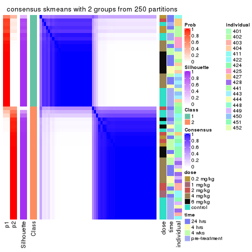</p>

</div>
<div id='tab-SD-skmeans-consensus-heatmap-2'>
<pre><code class="r">consensus_heatmap(res, k = 3)
</code></pre>

<p>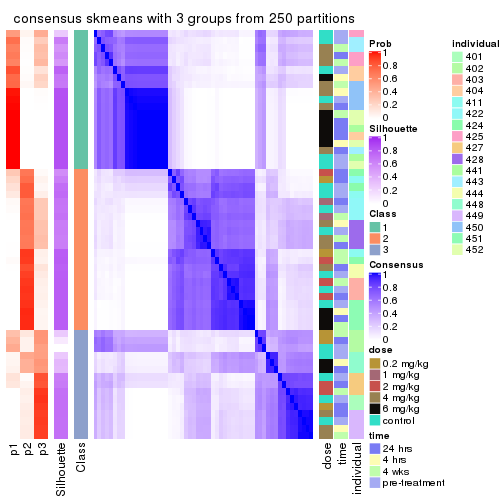</p>

</div>
<div id='tab-SD-skmeans-consensus-heatmap-3'>
<pre><code class="r">consensus_heatmap(res, k = 4)
</code></pre>

<p>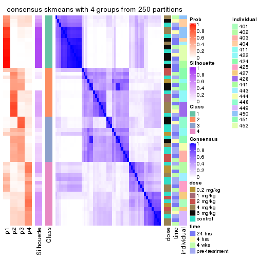</p>

</div>
<div id='tab-SD-skmeans-consensus-heatmap-4'>
<pre><code class="r">consensus_heatmap(res, k = 5)
</code></pre>

<p>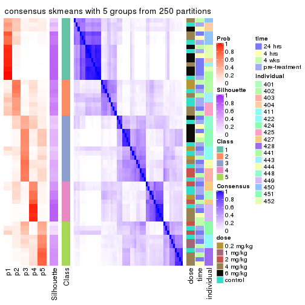</p>

</div>
<div id='tab-SD-skmeans-consensus-heatmap-5'>
<pre><code class="r">consensus_heatmap(res, k = 6)
</code></pre>

<p>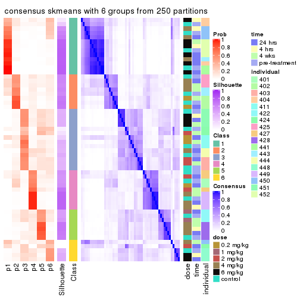</p>

</div>
</div>

Heatmaps for the membership of samples in all partitions to see how consistent they are:


<script>
$( function() {
	$( '#tabs-SD-skmeans-membership-heatmap' ).tabs();
} );
</script>
<div id='tabs-SD-skmeans-membership-heatmap'>
<ul>
<li><a href='#tab-SD-skmeans-membership-heatmap-1'>k = 2</a></li>
<li><a href='#tab-SD-skmeans-membership-heatmap-2'>k = 3</a></li>
<li><a href='#tab-SD-skmeans-membership-heatmap-3'>k = 4</a></li>
<li><a href='#tab-SD-skmeans-membership-heatmap-4'>k = 5</a></li>
<li><a href='#tab-SD-skmeans-membership-heatmap-5'>k = 6</a></li>
</ul>
<div id='tab-SD-skmeans-membership-heatmap-1'>
<pre><code class="r">membership_heatmap(res, k = 2)
</code></pre>

<p>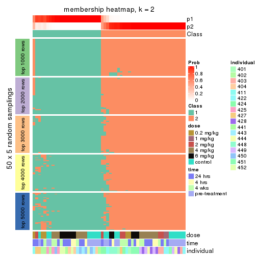</p>

</div>
<div id='tab-SD-skmeans-membership-heatmap-2'>
<pre><code class="r">membership_heatmap(res, k = 3)
</code></pre>

<p>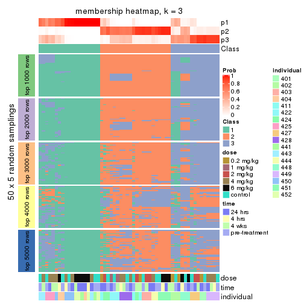</p>

</div>
<div id='tab-SD-skmeans-membership-heatmap-3'>
<pre><code class="r">membership_heatmap(res, k = 4)
</code></pre>

<p>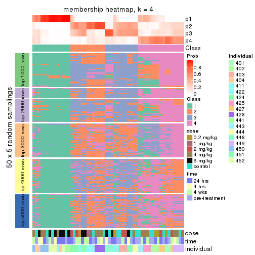</p>

</div>
<div id='tab-SD-skmeans-membership-heatmap-4'>
<pre><code class="r">membership_heatmap(res, k = 5)
</code></pre>

<p>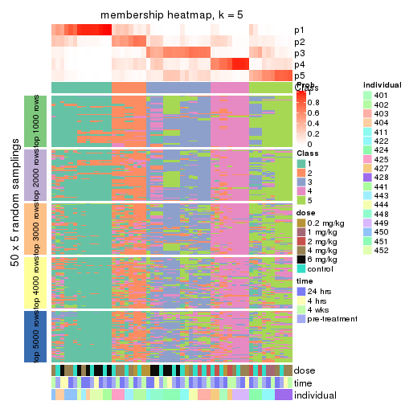</p>

</div>
<div id='tab-SD-skmeans-membership-heatmap-5'>
<pre><code class="r">membership_heatmap(res, k = 6)
</code></pre>

<p>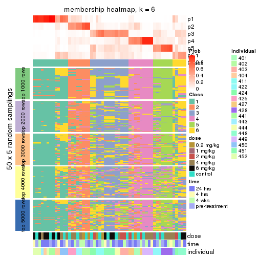</p>

</div>
</div>

As soon as we have had the classes for columns, we can look for signatures
which are significantly different between classes which can be candidate marks
for certain classes. Following are the heatmaps for signatures.


Signature heatmaps where rows are scaled:


<script>
$( function() {
	$( '#tabs-SD-skmeans-get-signatures' ).tabs();
} );
</script>
<div id='tabs-SD-skmeans-get-signatures'>
<ul>
<li><a href='#tab-SD-skmeans-get-signatures-1'>k = 2</a></li>
<li><a href='#tab-SD-skmeans-get-signatures-2'>k = 3</a></li>
<li><a href='#tab-SD-skmeans-get-signatures-3'>k = 4</a></li>
<li><a href='#tab-SD-skmeans-get-signatures-4'>k = 5</a></li>
<li><a href='#tab-SD-skmeans-get-signatures-5'>k = 6</a></li>
</ul>
<div id='tab-SD-skmeans-get-signatures-1'>
<pre><code class="r">get_signatures(res, k = 2)
</code></pre>

<p>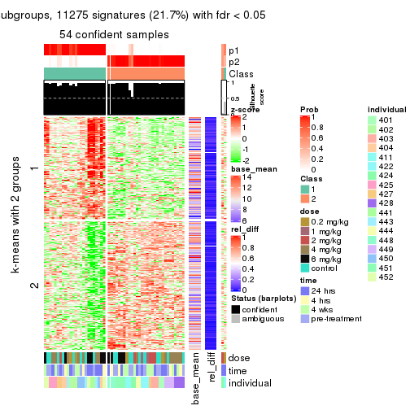</p>

</div>
<div id='tab-SD-skmeans-get-signatures-2'>
<pre><code class="r">get_signatures(res, k = 3)
</code></pre>

<p>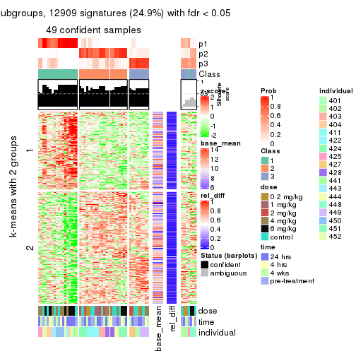</p>

</div>
<div id='tab-SD-skmeans-get-signatures-3'>
<pre><code class="r">get_signatures(res, k = 4)
</code></pre>

<p>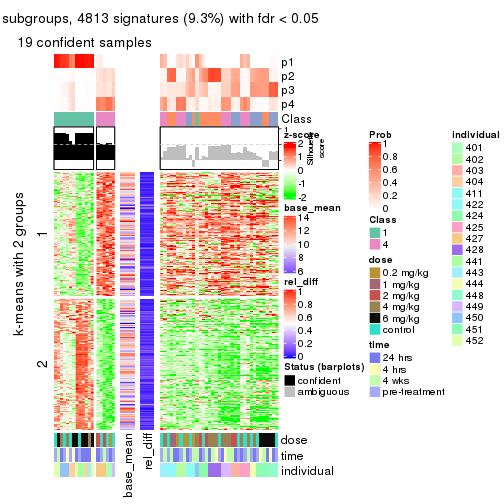</p>

</div>
<div id='tab-SD-skmeans-get-signatures-4'>
<pre><code class="r">get_signatures(res, k = 5)
</code></pre>

<p>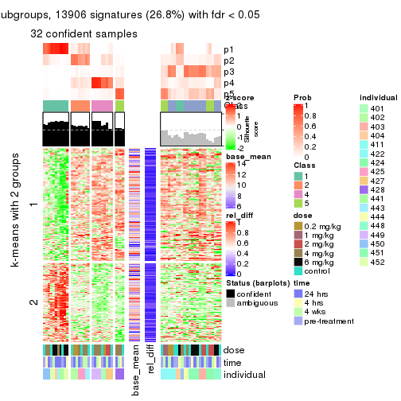</p>

</div>
<div id='tab-SD-skmeans-get-signatures-5'>
<pre><code class="r">get_signatures(res, k = 6)
</code></pre>

<p>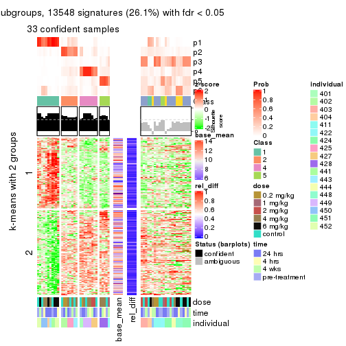</p>

</div>
</div>


Signature heatmaps where rows are not scaled:


<script>
$( function() {
	$( '#tabs-SD-skmeans-get-signatures-no-scale' ).tabs();
} );
</script>
<div id='tabs-SD-skmeans-get-signatures-no-scale'>
<ul>
<li><a href='#tab-SD-skmeans-get-signatures-no-scale-1'>k = 2</a></li>
<li><a href='#tab-SD-skmeans-get-signatures-no-scale-2'>k = 3</a></li>
<li><a href='#tab-SD-skmeans-get-signatures-no-scale-3'>k = 4</a></li>
<li><a href='#tab-SD-skmeans-get-signatures-no-scale-4'>k = 5</a></li>
<li><a href='#tab-SD-skmeans-get-signatures-no-scale-5'>k = 6</a></li>
</ul>
<div id='tab-SD-skmeans-get-signatures-no-scale-1'>
<pre><code class="r">get_signatures(res, k = 2, scale_rows = FALSE)
</code></pre>

<p>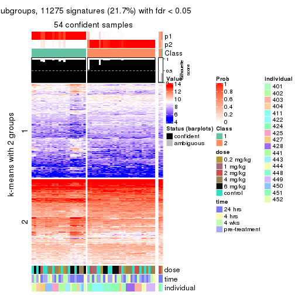</p>

</div>
<div id='tab-SD-skmeans-get-signatures-no-scale-2'>
<pre><code class="r">get_signatures(res, k = 3, scale_rows = FALSE)
</code></pre>

<p>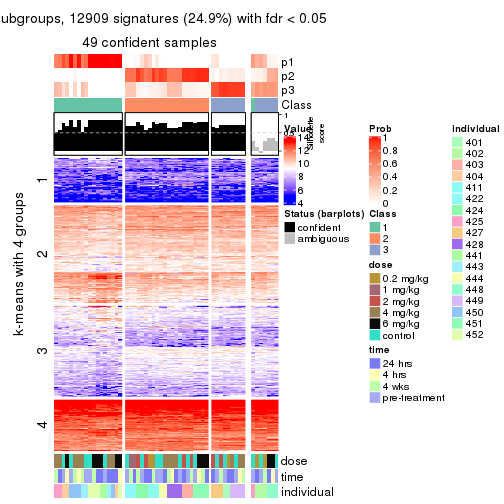</p>

</div>
<div id='tab-SD-skmeans-get-signatures-no-scale-3'>
<pre><code class="r">get_signatures(res, k = 4, scale_rows = FALSE)
</code></pre>

<p>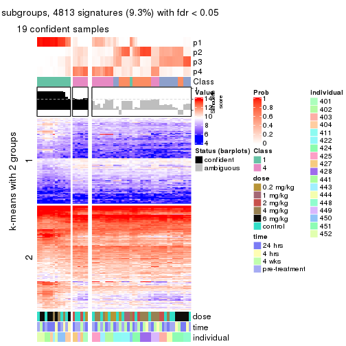</p>

</div>
<div id='tab-SD-skmeans-get-signatures-no-scale-4'>
<pre><code class="r">get_signatures(res, k = 5, scale_rows = FALSE)
</code></pre>

<p>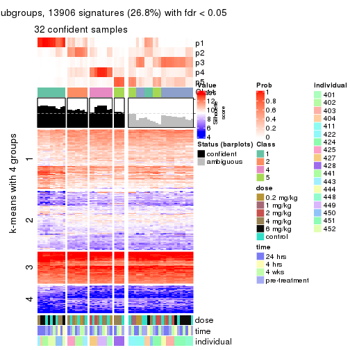</p>

</div>
<div id='tab-SD-skmeans-get-signatures-no-scale-5'>
<pre><code class="r">get_signatures(res, k = 6, scale_rows = FALSE)
</code></pre>

<p>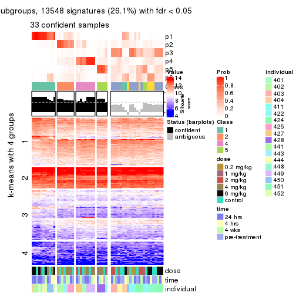</p>

</div>
</div>


Compare the overlap of signatures from different k:

```r
compare_signatures(res)
```

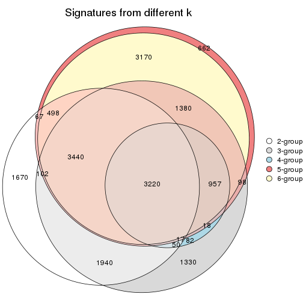

`get_signature()` returns a data frame invisibly. TO get the list of signatures, the function
call should be assigned to a variable explicitly. In following code, if `plot` argument is set
to `FALSE`, no heatmap is plotted while only the differential analysis is performed.

```r
# code only for demonstration
tb = get_signature(res, k = ..., plot = FALSE)
```

An example of the output of `tb` is:

```
#>   which_row         fdr    mean_1    mean_2 scaled_mean_1 scaled_mean_2 km
#> 1        38 0.042760348  8.373488  9.131774    -0.5533452     0.5164555  1
#> 2        40 0.018707592  7.106213  8.469186    -0.6173731     0.5762149  1
#> 3        55 0.019134737 10.221463 11.207825    -0.6159697     0.5749050  1
#> 4        59 0.006059896  5.921854  7.869574    -0.6899429     0.6439467  1
#> 5        60 0.018055526  8.928898 10.211722    -0.6204761     0.5791110  1
#> 6        98 0.009384629 15.714769 14.887706     0.6635654    -0.6193277  2
...
```

The columns in `tb` are:

1. `which_row`: row indices corresponding to the input matrix.
2. `fdr`: FDR for the differential test. 
3. `mean_x`: The mean value in group x.
4. `scaled_mean_x`: The mean value in group x after rows are scaled.
5. `km`: Row groups if k-means clustering is applied to rows.


UMAP plot which shows how samples are separated.


<script>
$( function() {
	$( '#tabs-SD-skmeans-dimension-reduction' ).tabs();
} );
</script>
<div id='tabs-SD-skmeans-dimension-reduction'>
<ul>
<li><a href='#tab-SD-skmeans-dimension-reduction-1'>k = 2</a></li>
<li><a href='#tab-SD-skmeans-dimension-reduction-2'>k = 3</a></li>
<li><a href='#tab-SD-skmeans-dimension-reduction-3'>k = 4</a></li>
<li><a href='#tab-SD-skmeans-dimension-reduction-4'>k = 5</a></li>
<li><a href='#tab-SD-skmeans-dimension-reduction-5'>k = 6</a></li>
</ul>
<div id='tab-SD-skmeans-dimension-reduction-1'>
<pre><code class="r">dimension_reduction(res, k = 2, method = &quot;UMAP&quot;)
</code></pre>

<p>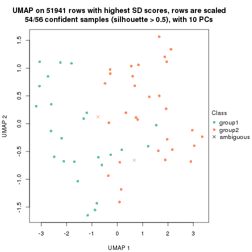</p>

</div>
<div id='tab-SD-skmeans-dimension-reduction-2'>
<pre><code class="r">dimension_reduction(res, k = 3, method = &quot;UMAP&quot;)
</code></pre>

<p>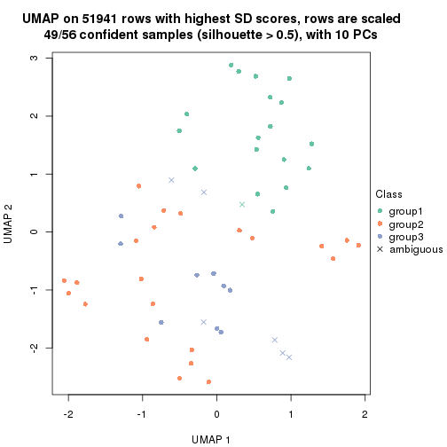</p>

</div>
<div id='tab-SD-skmeans-dimension-reduction-3'>
<pre><code class="r">dimension_reduction(res, k = 4, method = &quot;UMAP&quot;)
</code></pre>

<p>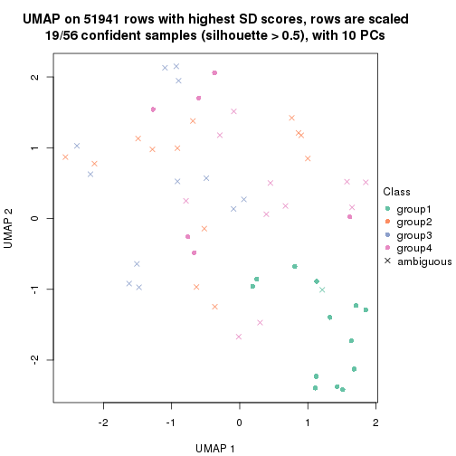</p>

</div>
<div id='tab-SD-skmeans-dimension-reduction-4'>
<pre><code class="r">dimension_reduction(res, k = 5, method = &quot;UMAP&quot;)
</code></pre>

<p>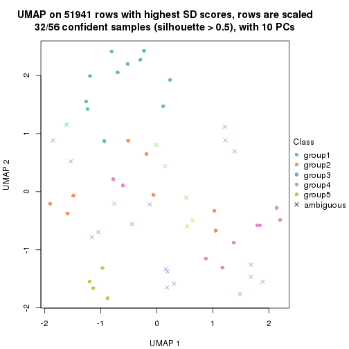</p>

</div>
<div id='tab-SD-skmeans-dimension-reduction-5'>
<pre><code class="r">dimension_reduction(res, k = 6, method = &quot;UMAP&quot;)
</code></pre>

<p>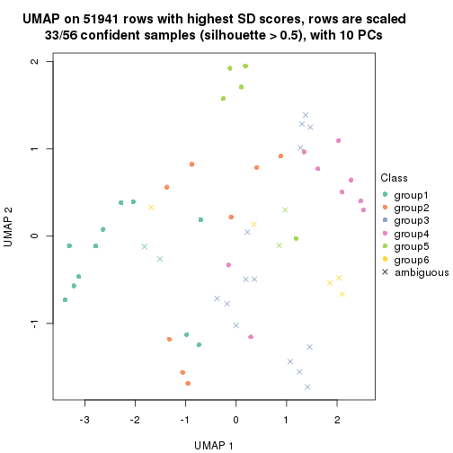</p>

</div>
</div>


Following heatmap shows how subgroups are split when increasing `k`:

```r
collect_classes(res)
```

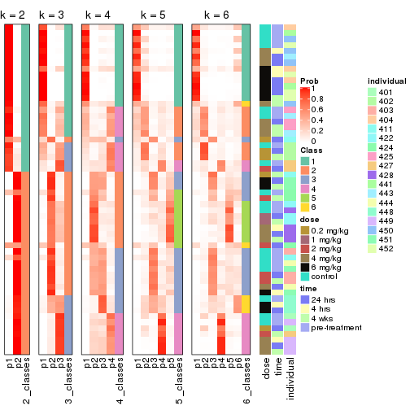


Test correlation between subgroups and known annotations. If the known
annotation is numeric, one-way ANOVA test is applied, and if the known
annotation is discrete, chi-squared contingency table test is applied.

```r
test_to_known_factors(res)
```

```
#>             n dose(p) time(p) individual(p) k
#> SD:skmeans 54  0.6250   0.941      2.65e-05 2
#> SD:skmeans 49  0.1932   0.995      3.83e-09 3
#> SD:skmeans 19  0.0258   0.544      8.19e-03 4
#> SD:skmeans 32  0.0626   0.879      4.03e-08 5
#> SD:skmeans 33  0.0373   0.834      8.34e-08 6
```


If matrix rows can be associated to genes, consider to use `functional_enrichment(res,
...)` to perform function enrichment for the signature genes. See [this vignette](http://bioconductor.org/packages/devel/bioc/vignettes/cola/inst/doc/functional_enrichment.html) for more detailed explanations.


 

---------------------------------------------------


### SD:pam


The object with results only for a single top-value method and a single partition method 
can be extracted as:

```r
res = res_list["SD", "pam"]
# you can also extract it by
# res = res_list["SD:pam"]
```

A summary of `res` and all the functions that can be applied to it:

```r
res
```

```
#> A 'ConsensusPartition' object with k = 2, 3, 4, 5, 6.
#>   On a matrix with 51941 rows and 56 columns.
#>   Top rows (1000, 2000, 3000, 4000, 5000) are extracted by 'SD' method.
#>   Subgroups are detected by 'pam' method.
#>   Performed in total 1250 partitions by row resampling.
#>   Best k for subgroups seems to be 2.
#> 
#> Following methods can be applied to this 'ConsensusPartition' object:
#>  [1] "cola_report"             "collect_classes"         "collect_plots"          
#>  [4] "collect_stats"           "colnames"                "compare_signatures"     
#>  [7] "consensus_heatmap"       "dimension_reduction"     "functional_enrichment"  
#> [10] "get_anno_col"            "get_anno"                "get_classes"            
#> [13] "get_consensus"           "get_matrix"              "get_membership"         
#> [16] "get_param"               "get_signatures"          "get_stats"              
#> [19] "is_best_k"               "is_stable_k"             "membership_heatmap"     
#> [22] "ncol"                    "nrow"                    "plot_ecdf"              
#> [25] "rownames"                "select_partition_number" "show"                   
#> [28] "suggest_best_k"          "test_to_known_factors"
```

`collect_plots()` function collects all the plots made from `res` for all `k` (number of partitions)
into one single page to provide an easy and fast comparison between different `k`.

```r
collect_plots(res)
```

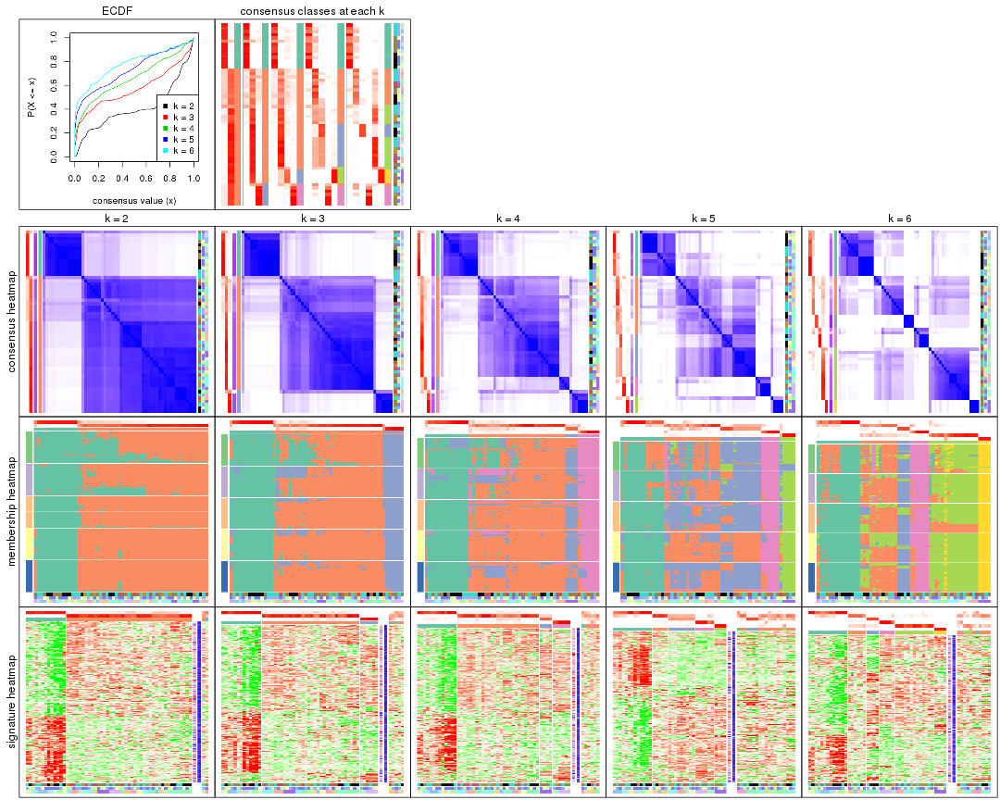

The plots are:

- The first row: a plot of the ECDF (empirical cumulative distribution
  function) curves of the consensus matrix for each `k` and the heatmap of
  predicted classes for each `k`.
- The second row: heatmaps of the consensus matrix for each `k`.
- The third row: heatmaps of the membership matrix for each `k`.
- The fouth row: heatmaps of the signatures for each `k`.

All the plots in panels can be made by individual functions and they are
plotted later in this section.

`select_partition_number()` produces several plots showing different
statistics for choosing "optimized" `k`. There are following statistics:

- ECDF curves of the consensus matrix for each `k`;
- 1-PAC. [The PAC
  score](https://en.wikipedia.org/wiki/Consensus_clustering#Over-interpretation_potential_of_consensus_clustering)
  measures the proportion of the ambiguous subgrouping.
- Mean silhouette score.
- Concordance. The mean probability of fiting the consensus class ids in all
  partitions.
- Area increased. Denote $A_k$ as the area under the ECDF curve for current
  `k`, the area increased is defined as $A_k - A_{k-1}$.
- Rand index. The percent of pairs of samples that are both in a same cluster
  or both are not in a same cluster in the partition of k and k-1.
- Jaccard index. The ratio of pairs of samples are both in a same cluster in
  the partition of k and k-1 and the pairs of samples are both in a same
  cluster in the partition k or k-1.

The detailed explanations of these statistics can be found in [the _cola_
vignette](http://bioconductor.org/packages/devel/bioc/vignettes/cola/inst/doc/cola.html#toc_13).

Generally speaking, lower PAC score, higher mean silhouette score or higher
concordance corresponds to better partition. Rand index and Jaccard index
measure how similar the current partition is compared to partition with `k-1`.
If they are too similar, we won't accept `k` is better than `k-1`.

```r
select_partition_number(res)
```

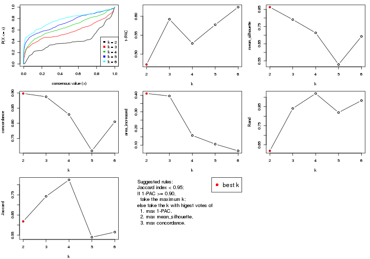

The numeric values for all these statistics can be obtained by `get_stats()`.

```r
get_stats(res)
```

```
#>   k 1-PAC mean_silhouette concordance area_increased  Rand Jaccard
#> 2 2 0.472           0.863       0.898         0.4104 0.618   0.618
#> 3 3 0.592           0.791       0.888         0.3954 0.841   0.743
#> 4 4 0.528           0.713       0.829         0.1582 0.919   0.825
#> 5 5 0.578           0.529       0.709         0.1058 0.819   0.540
#> 6 6 0.624           0.693       0.805         0.0654 0.882   0.565
```

`suggest_best_k()` suggests the best $k$ based on these statistics. The rules are as follows:

- All $k$ with Jaccard index larger than 0.95 are removed because increasing
  $k$ does not provide enough extra information. If all $k$ are removed, it is
  marked as no subgroup is detected.
- For all $k$ with 1-PAC score larger than 0.9, the maximal $k$ is taken as
  the best $k$, and other $k$ are marked as optional $k$.
- If it does not fit the second rule. The $k$ with the maximal vote of the
  highest 1-PAC score, highest mean silhouette, and highest concordance is
  taken as the best $k$.

```r
suggest_best_k(res)
```

```
#> [1] 2
```


Following shows the table of the partitions (You need to click the **show/hide
code output** link to see it). The membership matrix (columns with name `p*`)
is inferred by
[`clue::cl_consensus()`](https://www.rdocumentation.org/link/cl_consensus?package=clue)
function with the `SE` method. Basically the value in the membership matrix
represents the probability to belong to a certain group. The finall class
label for an item is determined with the group with highest probability it
belongs to.

In `get_classes()` function, the entropy is calculated from the membership
matrix and the silhouette score is calculated from the consensus matrix.


<script>
$( function() {
	$( '#tabs-SD-pam-get-classes' ).tabs();
} );
</script>
<div id='tabs-SD-pam-get-classes'>
<ul>
<li><a href='#tab-SD-pam-get-classes-1'>k = 2</a></li>
<li><a href='#tab-SD-pam-get-classes-2'>k = 3</a></li>
<li><a href='#tab-SD-pam-get-classes-3'>k = 4</a></li>
<li><a href='#tab-SD-pam-get-classes-4'>k = 5</a></li>
<li><a href='#tab-SD-pam-get-classes-5'>k = 6</a></li>
</ul>

<div id='tab-SD-pam-get-classes-1'>
<p><a id='tab-SD-pam-get-classes-1-a' style='color:#0366d6' href='#'>show/hide code output</a></p>
<pre><code class="r">cbind(get_classes(res, k = 2), get_membership(res, k = 2))
</code></pre>

<pre><code>#&gt;           class entropy silhouette    p1    p2
#&gt; GSM687644     2  0.4815      0.887 0.104 0.896
#&gt; GSM687648     2  0.9970      0.283 0.468 0.532
#&gt; GSM687653     2  0.0376      0.882 0.004 0.996
#&gt; GSM687658     2  0.8386      0.785 0.268 0.732
#&gt; GSM687663     2  0.2043      0.893 0.032 0.968
#&gt; GSM687668     2  0.2236      0.895 0.036 0.964
#&gt; GSM687673     2  0.2778      0.895 0.048 0.952
#&gt; GSM687678     2  0.8327      0.771 0.264 0.736
#&gt; GSM687683     2  0.7453      0.835 0.212 0.788
#&gt; GSM687688     2  0.0672      0.883 0.008 0.992
#&gt; GSM687695     1  0.1184      0.958 0.984 0.016
#&gt; GSM687699     1  0.3431      0.916 0.936 0.064
#&gt; GSM687704     2  0.1414      0.892 0.020 0.980
#&gt; GSM687707     2  0.7376      0.836 0.208 0.792
#&gt; GSM687712     2  0.5178      0.883 0.116 0.884
#&gt; GSM687719     1  0.1843      0.951 0.972 0.028
#&gt; GSM687724     2  0.1184      0.886 0.016 0.984
#&gt; GSM687728     1  0.1184      0.958 0.984 0.016
#&gt; GSM687646     2  0.4815      0.887 0.104 0.896
#&gt; GSM687649     2  0.8016      0.790 0.244 0.756
#&gt; GSM687665     2  0.1843      0.892 0.028 0.972
#&gt; GSM687651     2  0.7056      0.842 0.192 0.808
#&gt; GSM687667     2  0.1633      0.891 0.024 0.976
#&gt; GSM687670     2  0.4690      0.888 0.100 0.900
#&gt; GSM687671     2  0.2423      0.895 0.040 0.960
#&gt; GSM687654     2  0.0672      0.888 0.008 0.992
#&gt; GSM687675     2  0.8081      0.768 0.248 0.752
#&gt; GSM687685     2  0.7674      0.826 0.224 0.776
#&gt; GSM687656     2  0.0376      0.882 0.004 0.996
#&gt; GSM687677     2  0.1414      0.890 0.020 0.980
#&gt; GSM687687     2  0.4690      0.888 0.100 0.900
#&gt; GSM687692     2  0.2423      0.894 0.040 0.960
#&gt; GSM687716     2  0.4562      0.888 0.096 0.904
#&gt; GSM687722     1  0.2236      0.944 0.964 0.036
#&gt; GSM687680     1  0.9087      0.382 0.676 0.324
#&gt; GSM687690     2  0.2778      0.895 0.048 0.952
#&gt; GSM687700     1  0.0938      0.957 0.988 0.012
#&gt; GSM687705     2  0.2603      0.895 0.044 0.956
#&gt; GSM687714     2  0.5059      0.884 0.112 0.888
#&gt; GSM687721     1  0.1184      0.958 0.984 0.016
#&gt; GSM687682     2  0.8267      0.789 0.260 0.740
#&gt; GSM687694     2  0.1184      0.888 0.016 0.984
#&gt; GSM687702     1  0.1184      0.958 0.984 0.016
#&gt; GSM687718     2  0.4939      0.886 0.108 0.892
#&gt; GSM687723     2  0.8327      0.791 0.264 0.736
#&gt; GSM687661     2  0.9129      0.691 0.328 0.672
#&gt; GSM687710     2  0.7453      0.833 0.212 0.788
#&gt; GSM687726     2  0.1414      0.887 0.020 0.980
#&gt; GSM687730     1  0.1184      0.958 0.984 0.016
#&gt; GSM687660     1  0.1184      0.958 0.984 0.016
#&gt; GSM687697     1  0.1184      0.958 0.984 0.016
#&gt; GSM687709     2  0.7674      0.826 0.224 0.776
#&gt; GSM687725     2  0.1414      0.887 0.020 0.980
#&gt; GSM687729     1  0.1184      0.958 0.984 0.016
#&gt; GSM687727     2  0.0376      0.882 0.004 0.996
#&gt; GSM687731     1  0.1633      0.951 0.976 0.024
</code></pre>

<script>
$('#tab-SD-pam-get-classes-1-a').parent().next().next().hide();
$('#tab-SD-pam-get-classes-1-a').click(function(){
  $('#tab-SD-pam-get-classes-1-a').parent().next().next().toggle();
  return(false);
});
</script>
</div>

<div id='tab-SD-pam-get-classes-2'>
<p><a id='tab-SD-pam-get-classes-2-a' style='color:#0366d6' href='#'>show/hide code output</a></p>
<pre><code class="r">cbind(get_classes(res, k = 3), get_membership(res, k = 3))
</code></pre>

<pre><code>#&gt;           class entropy silhouette    p1    p2    p3
#&gt; GSM687644     3  0.1163     0.8711 0.000 0.028 0.972
#&gt; GSM687648     2  0.7169     0.3859 0.404 0.568 0.028
#&gt; GSM687653     2  0.1031     0.8426 0.000 0.976 0.024
#&gt; GSM687658     2  0.8504     0.6230 0.216 0.612 0.172
#&gt; GSM687663     2  0.0892     0.8520 0.020 0.980 0.000
#&gt; GSM687668     2  0.2550     0.8493 0.024 0.936 0.040
#&gt; GSM687673     2  0.3459     0.8323 0.096 0.892 0.012
#&gt; GSM687678     2  0.6452     0.7624 0.088 0.760 0.152
#&gt; GSM687683     2  0.9273     0.3270 0.164 0.472 0.364
#&gt; GSM687688     2  0.0892     0.8436 0.000 0.980 0.020
#&gt; GSM687695     1  0.0000     0.9338 1.000 0.000 0.000
#&gt; GSM687699     1  0.0829     0.9293 0.984 0.004 0.012
#&gt; GSM687704     2  0.1620     0.8523 0.024 0.964 0.012
#&gt; GSM687707     2  0.5375     0.8039 0.128 0.816 0.056
#&gt; GSM687712     3  0.0237     0.8814 0.000 0.004 0.996
#&gt; GSM687719     1  0.2261     0.8831 0.932 0.000 0.068
#&gt; GSM687724     2  0.0000     0.8464 0.000 1.000 0.000
#&gt; GSM687728     1  0.0000     0.9338 1.000 0.000 0.000
#&gt; GSM687646     3  0.0892     0.8764 0.000 0.020 0.980
#&gt; GSM687649     2  0.3742     0.8382 0.072 0.892 0.036
#&gt; GSM687665     2  0.0892     0.8520 0.020 0.980 0.000
#&gt; GSM687651     2  0.1999     0.8521 0.036 0.952 0.012
#&gt; GSM687667     2  0.0747     0.8514 0.016 0.984 0.000
#&gt; GSM687670     2  0.4665     0.8205 0.100 0.852 0.048
#&gt; GSM687671     2  0.0892     0.8520 0.020 0.980 0.000
#&gt; GSM687654     2  0.1491     0.8508 0.016 0.968 0.016
#&gt; GSM687675     2  0.7666     0.6847 0.148 0.684 0.168
#&gt; GSM687685     2  0.8527     0.6227 0.196 0.612 0.192
#&gt; GSM687656     2  0.0829     0.8469 0.004 0.984 0.012
#&gt; GSM687677     2  0.0661     0.8508 0.004 0.988 0.008
#&gt; GSM687687     3  0.6252    -0.0987 0.000 0.444 0.556
#&gt; GSM687692     2  0.2066     0.8432 0.000 0.940 0.060
#&gt; GSM687716     3  0.0237     0.8814 0.000 0.004 0.996
#&gt; GSM687722     1  0.2955     0.8609 0.912 0.008 0.080
#&gt; GSM687680     1  0.8710     0.0815 0.508 0.380 0.112
#&gt; GSM687690     2  0.2599     0.8456 0.016 0.932 0.052
#&gt; GSM687700     1  0.0000     0.9338 1.000 0.000 0.000
#&gt; GSM687705     2  0.1031     0.8523 0.024 0.976 0.000
#&gt; GSM687714     3  0.0237     0.8814 0.000 0.004 0.996
#&gt; GSM687721     1  0.0592     0.9304 0.988 0.000 0.012
#&gt; GSM687682     2  0.6295     0.7648 0.072 0.764 0.164
#&gt; GSM687694     2  0.3377     0.8277 0.012 0.896 0.092
#&gt; GSM687702     1  0.0592     0.9304 0.988 0.000 0.012
#&gt; GSM687718     3  0.0237     0.8814 0.000 0.004 0.996
#&gt; GSM687723     2  0.8466     0.6295 0.212 0.616 0.172
#&gt; GSM687661     2  0.9108     0.4760 0.316 0.520 0.164
#&gt; GSM687710     2  0.6915     0.7489 0.124 0.736 0.140
#&gt; GSM687726     2  0.0000     0.8464 0.000 1.000 0.000
#&gt; GSM687730     1  0.0000     0.9338 1.000 0.000 0.000
#&gt; GSM687660     1  0.0237     0.9328 0.996 0.000 0.004
#&gt; GSM687697     1  0.0000     0.9338 1.000 0.000 0.000
#&gt; GSM687709     2  0.6731     0.7420 0.172 0.740 0.088
#&gt; GSM687725     2  0.1031     0.8489 0.000 0.976 0.024
#&gt; GSM687729     1  0.0000     0.9338 1.000 0.000 0.000
#&gt; GSM687727     2  0.0424     0.8455 0.000 0.992 0.008
#&gt; GSM687731     1  0.0237     0.9312 0.996 0.004 0.000
</code></pre>

<script>
$('#tab-SD-pam-get-classes-2-a').parent().next().next().hide();
$('#tab-SD-pam-get-classes-2-a').click(function(){
  $('#tab-SD-pam-get-classes-2-a').parent().next().next().toggle();
  return(false);
});
</script>
</div>

<div id='tab-SD-pam-get-classes-3'>
<p><a id='tab-SD-pam-get-classes-3-a' style='color:#0366d6' href='#'>show/hide code output</a></p>
<pre><code class="r">cbind(get_classes(res, k = 4), get_membership(res, k = 4))
</code></pre>

<pre><code>#&gt;           class entropy silhouette    p1    p2    p3    p4
#&gt; GSM687644     4  0.3166    0.75985 0.000 0.016 0.116 0.868
#&gt; GSM687648     2  0.7395    0.40096 0.324 0.548 0.100 0.028
#&gt; GSM687653     2  0.1452    0.72897 0.000 0.956 0.008 0.036
#&gt; GSM687658     2  0.8490    0.52849 0.164 0.528 0.224 0.084
#&gt; GSM687663     2  0.0000    0.73759 0.000 1.000 0.000 0.000
#&gt; GSM687668     2  0.3169    0.71740 0.004 0.884 0.084 0.028
#&gt; GSM687673     2  0.3029    0.73423 0.068 0.896 0.028 0.008
#&gt; GSM687678     2  0.6748    0.65685 0.080 0.696 0.144 0.080
#&gt; GSM687683     2  0.9298    0.35813 0.120 0.428 0.212 0.240
#&gt; GSM687688     3  0.5025    0.87514 0.000 0.252 0.716 0.032
#&gt; GSM687695     1  0.0000    0.88152 1.000 0.000 0.000 0.000
#&gt; GSM687699     1  0.2983    0.86443 0.892 0.040 0.068 0.000
#&gt; GSM687704     2  0.1118    0.73267 0.000 0.964 0.000 0.036
#&gt; GSM687707     2  0.5414    0.69472 0.072 0.760 0.152 0.016
#&gt; GSM687712     4  0.0000    0.82732 0.000 0.000 0.000 1.000
#&gt; GSM687719     1  0.4057    0.83749 0.836 0.008 0.120 0.036
#&gt; GSM687724     2  0.1474    0.72492 0.000 0.948 0.052 0.000
#&gt; GSM687728     1  0.0000    0.88152 1.000 0.000 0.000 0.000
#&gt; GSM687646     4  0.2222    0.80006 0.000 0.016 0.060 0.924
#&gt; GSM687649     2  0.4507    0.72908 0.060 0.836 0.060 0.044
#&gt; GSM687665     2  0.0000    0.73759 0.000 1.000 0.000 0.000
#&gt; GSM687651     2  0.2563    0.74494 0.000 0.908 0.072 0.020
#&gt; GSM687667     2  0.0000    0.73759 0.000 1.000 0.000 0.000
#&gt; GSM687670     2  0.5412    0.69086 0.060 0.764 0.152 0.024
#&gt; GSM687671     2  0.1489    0.73047 0.004 0.952 0.044 0.000
#&gt; GSM687654     2  0.1305    0.73285 0.000 0.960 0.004 0.036
#&gt; GSM687675     2  0.7355    0.60402 0.092 0.644 0.180 0.084
#&gt; GSM687685     2  0.8509    0.53504 0.136 0.532 0.228 0.104
#&gt; GSM687656     2  0.1305    0.73098 0.000 0.960 0.004 0.036
#&gt; GSM687677     2  0.4643    0.22999 0.000 0.656 0.344 0.000
#&gt; GSM687687     4  0.7261   -0.00598 0.000 0.368 0.152 0.480
#&gt; GSM687692     3  0.3873    0.92800 0.000 0.228 0.772 0.000
#&gt; GSM687716     4  0.0000    0.82732 0.000 0.000 0.000 1.000
#&gt; GSM687722     1  0.4749    0.80623 0.804 0.020 0.132 0.044
#&gt; GSM687680     1  0.7829    0.15593 0.516 0.332 0.108 0.044
#&gt; GSM687690     3  0.3801    0.92310 0.000 0.220 0.780 0.000
#&gt; GSM687700     1  0.1389    0.88149 0.952 0.000 0.048 0.000
#&gt; GSM687705     2  0.0376    0.74042 0.004 0.992 0.004 0.000
#&gt; GSM687714     4  0.0000    0.82732 0.000 0.000 0.000 1.000
#&gt; GSM687721     1  0.2611    0.87263 0.896 0.008 0.096 0.000
#&gt; GSM687682     2  0.7101    0.63357 0.108 0.676 0.120 0.096
#&gt; GSM687694     3  0.4175    0.91116 0.000 0.212 0.776 0.012
#&gt; GSM687702     1  0.2675    0.87327 0.892 0.008 0.100 0.000
#&gt; GSM687718     4  0.0000    0.82732 0.000 0.000 0.000 1.000
#&gt; GSM687723     2  0.8480    0.52963 0.160 0.528 0.228 0.084
#&gt; GSM687661     2  0.8957    0.42655 0.240 0.456 0.220 0.084
#&gt; GSM687710     2  0.6789    0.65995 0.076 0.684 0.172 0.068
#&gt; GSM687726     2  0.2149    0.71450 0.000 0.912 0.088 0.000
#&gt; GSM687730     1  0.0188    0.87953 0.996 0.000 0.004 0.000
#&gt; GSM687660     1  0.2611    0.87263 0.896 0.008 0.096 0.000
#&gt; GSM687697     1  0.0000    0.88152 1.000 0.000 0.000 0.000
#&gt; GSM687709     2  0.6929    0.64343 0.120 0.672 0.160 0.048
#&gt; GSM687725     2  0.2412    0.73287 0.000 0.908 0.084 0.008
#&gt; GSM687729     1  0.0000    0.88152 1.000 0.000 0.000 0.000
#&gt; GSM687727     2  0.1940    0.71523 0.000 0.924 0.076 0.000
#&gt; GSM687731     1  0.0895    0.86521 0.976 0.020 0.004 0.000
</code></pre>

<script>
$('#tab-SD-pam-get-classes-3-a').parent().next().next().hide();
$('#tab-SD-pam-get-classes-3-a').click(function(){
  $('#tab-SD-pam-get-classes-3-a').parent().next().next().toggle();
  return(false);
});
</script>
</div>

<div id='tab-SD-pam-get-classes-4'>
<p><a id='tab-SD-pam-get-classes-4-a' style='color:#0366d6' href='#'>show/hide code output</a></p>
<pre><code class="r">cbind(get_classes(res, k = 5), get_membership(res, k = 5))
</code></pre>

<pre><code>#&gt;           class entropy silhouette    p1    p2    p3    p4    p5
#&gt; GSM687644     4  0.4280     0.6487 0.004 0.312 0.000 0.676 0.008
#&gt; GSM687648     2  0.7241     0.1846 0.312 0.388 0.280 0.020 0.000
#&gt; GSM687653     3  0.6033     0.6409 0.000 0.376 0.536 0.028 0.060
#&gt; GSM687658     2  0.1538     0.5409 0.036 0.948 0.008 0.008 0.000
#&gt; GSM687663     3  0.5352     0.6270 0.000 0.408 0.536 0.000 0.056
#&gt; GSM687668     2  0.6160    -0.4707 0.000 0.448 0.420 0.000 0.132
#&gt; GSM687673     2  0.5511    -0.3526 0.004 0.524 0.416 0.000 0.056
#&gt; GSM687678     2  0.4974     0.4056 0.088 0.720 0.184 0.008 0.000
#&gt; GSM687683     2  0.2304     0.5154 0.008 0.892 0.000 0.100 0.000
#&gt; GSM687688     5  0.0162     0.7962 0.000 0.004 0.000 0.000 0.996
#&gt; GSM687695     1  0.0162     0.8173 0.996 0.004 0.000 0.000 0.000
#&gt; GSM687699     1  0.3810     0.7995 0.788 0.176 0.000 0.000 0.036
#&gt; GSM687704     3  0.5986     0.6400 0.000 0.380 0.536 0.028 0.056
#&gt; GSM687707     2  0.4656     0.2387 0.004 0.576 0.412 0.004 0.004
#&gt; GSM687712     4  0.0404     0.8875 0.000 0.012 0.000 0.988 0.000
#&gt; GSM687719     1  0.4009     0.7374 0.684 0.312 0.000 0.004 0.000
#&gt; GSM687724     3  0.2193     0.4309 0.000 0.092 0.900 0.008 0.000
#&gt; GSM687728     1  0.0162     0.8173 0.996 0.004 0.000 0.000 0.000
#&gt; GSM687646     4  0.2930     0.8023 0.000 0.164 0.000 0.832 0.004
#&gt; GSM687649     2  0.6934    -0.2282 0.132 0.452 0.384 0.028 0.004
#&gt; GSM687665     3  0.5302     0.6216 0.000 0.412 0.536 0.000 0.052
#&gt; GSM687651     2  0.5474    -0.4890 0.004 0.480 0.476 0.012 0.028
#&gt; GSM687667     3  0.5352     0.6270 0.000 0.408 0.536 0.000 0.056
#&gt; GSM687670     2  0.5617     0.0855 0.004 0.620 0.276 0.000 0.100
#&gt; GSM687671     3  0.5939     0.5720 0.000 0.400 0.492 0.000 0.108
#&gt; GSM687654     3  0.6033     0.6391 0.000 0.376 0.536 0.028 0.060
#&gt; GSM687675     2  0.5763     0.4552 0.064 0.712 0.140 0.008 0.076
#&gt; GSM687685     2  0.1488     0.5395 0.008 0.956 0.012 0.016 0.008
#&gt; GSM687656     3  0.6033     0.6409 0.000 0.376 0.536 0.028 0.060
#&gt; GSM687677     5  0.6634    -0.2591 0.000 0.288 0.260 0.000 0.452
#&gt; GSM687687     2  0.5687     0.1557 0.000 0.580 0.020 0.348 0.052
#&gt; GSM687692     5  0.0290     0.7960 0.000 0.008 0.000 0.000 0.992
#&gt; GSM687716     4  0.0404     0.8875 0.000 0.012 0.000 0.988 0.000
#&gt; GSM687722     1  0.4088     0.6761 0.632 0.368 0.000 0.000 0.000
#&gt; GSM687680     1  0.4858     0.1487 0.556 0.424 0.012 0.008 0.000
#&gt; GSM687690     5  0.0290     0.7960 0.000 0.008 0.000 0.000 0.992
#&gt; GSM687700     1  0.2377     0.8207 0.872 0.128 0.000 0.000 0.000
#&gt; GSM687705     3  0.5408     0.6236 0.000 0.408 0.532 0.000 0.060
#&gt; GSM687714     4  0.0404     0.8875 0.000 0.012 0.000 0.988 0.000
#&gt; GSM687721     1  0.3305     0.8002 0.776 0.224 0.000 0.000 0.000
#&gt; GSM687682     2  0.5091     0.4383 0.204 0.720 0.052 0.008 0.016
#&gt; GSM687694     5  0.0162     0.7962 0.000 0.004 0.000 0.000 0.996
#&gt; GSM687702     1  0.3177     0.8068 0.792 0.208 0.000 0.000 0.000
#&gt; GSM687718     4  0.0404     0.8875 0.000 0.012 0.000 0.988 0.000
#&gt; GSM687723     2  0.1538     0.5405 0.036 0.948 0.008 0.008 0.000
#&gt; GSM687661     2  0.2339     0.5299 0.072 0.908 0.004 0.008 0.008
#&gt; GSM687710     2  0.4074     0.4634 0.004 0.720 0.268 0.004 0.004
#&gt; GSM687726     3  0.3301     0.3996 0.000 0.088 0.856 0.008 0.048
#&gt; GSM687730     1  0.0000     0.8151 1.000 0.000 0.000 0.000 0.000
#&gt; GSM687660     1  0.3177     0.8073 0.792 0.208 0.000 0.000 0.000
#&gt; GSM687697     1  0.0162     0.8173 0.996 0.004 0.000 0.000 0.000
#&gt; GSM687709     2  0.4275     0.4098 0.004 0.684 0.304 0.004 0.004
#&gt; GSM687725     3  0.2753     0.3878 0.000 0.136 0.856 0.008 0.000
#&gt; GSM687729     1  0.0162     0.8173 0.996 0.004 0.000 0.000 0.000
#&gt; GSM687727     3  0.2938     0.4135 0.000 0.084 0.876 0.008 0.032
#&gt; GSM687731     1  0.0162     0.8127 0.996 0.000 0.004 0.000 0.000
</code></pre>

<script>
$('#tab-SD-pam-get-classes-4-a').parent().next().next().hide();
$('#tab-SD-pam-get-classes-4-a').click(function(){
  $('#tab-SD-pam-get-classes-4-a').parent().next().next().toggle();
  return(false);
});
</script>
</div>

<div id='tab-SD-pam-get-classes-5'>
<p><a id='tab-SD-pam-get-classes-5-a' style='color:#0366d6' href='#'>show/hide code output</a></p>
<pre><code class="r">cbind(get_classes(res, k = 6), get_membership(res, k = 6))
</code></pre>

<pre><code>#&gt;           class entropy silhouette    p1    p2    p3    p4    p5    p6
#&gt; GSM687644     4  0.4211     0.2646 0.000 0.456 0.004 0.532 0.008 0.000
#&gt; GSM687648     5  0.5746     0.1628 0.300 0.156 0.004 0.004 0.536 0.000
#&gt; GSM687653     5  0.0767     0.7946 0.000 0.000 0.008 0.004 0.976 0.012
#&gt; GSM687658     2  0.3543     0.6631 0.016 0.756 0.000 0.004 0.224 0.000
#&gt; GSM687663     5  0.0865     0.8039 0.000 0.036 0.000 0.000 0.964 0.000
#&gt; GSM687668     5  0.3252     0.7198 0.000 0.068 0.000 0.000 0.824 0.108
#&gt; GSM687673     5  0.2737     0.6923 0.004 0.160 0.000 0.000 0.832 0.004
#&gt; GSM687678     2  0.5066     0.4031 0.064 0.496 0.000 0.004 0.436 0.000
#&gt; GSM687683     2  0.4113     0.6602 0.008 0.744 0.000 0.056 0.192 0.000
#&gt; GSM687688     6  0.0363     1.0000 0.000 0.000 0.000 0.000 0.012 0.988
#&gt; GSM687695     1  0.0000     0.8086 1.000 0.000 0.000 0.000 0.000 0.000
#&gt; GSM687699     1  0.3309     0.7786 0.788 0.192 0.004 0.000 0.016 0.000
#&gt; GSM687704     5  0.0692     0.8062 0.000 0.020 0.000 0.004 0.976 0.000
#&gt; GSM687707     2  0.5379     0.1137 0.000 0.516 0.120 0.000 0.364 0.000
#&gt; GSM687712     4  0.0000     0.8207 0.000 0.000 0.000 1.000 0.000 0.000
#&gt; GSM687719     1  0.3607     0.6517 0.652 0.348 0.000 0.000 0.000 0.000
#&gt; GSM687724     3  0.2346     0.9919 0.000 0.000 0.868 0.000 0.124 0.008
#&gt; GSM687728     1  0.0000     0.8086 1.000 0.000 0.000 0.000 0.000 0.000
#&gt; GSM687646     4  0.3298     0.6522 0.000 0.236 0.000 0.756 0.008 0.000
#&gt; GSM687649     5  0.4114     0.6423 0.116 0.108 0.004 0.004 0.768 0.000
#&gt; GSM687665     5  0.0858     0.8062 0.004 0.028 0.000 0.000 0.968 0.000
#&gt; GSM687651     5  0.2243     0.7566 0.000 0.112 0.004 0.004 0.880 0.000
#&gt; GSM687667     5  0.0363     0.8049 0.000 0.012 0.000 0.000 0.988 0.000
#&gt; GSM687670     5  0.4476     0.4630 0.004 0.256 0.000 0.000 0.680 0.060
#&gt; GSM687671     5  0.2030     0.7874 0.000 0.028 0.000 0.000 0.908 0.064
#&gt; GSM687654     5  0.0767     0.7946 0.000 0.000 0.008 0.004 0.976 0.012
#&gt; GSM687675     2  0.5506     0.5193 0.036 0.544 0.000 0.004 0.368 0.048
#&gt; GSM687685     2  0.3593     0.6635 0.004 0.756 0.000 0.012 0.224 0.004
#&gt; GSM687656     5  0.0767     0.7946 0.000 0.000 0.008 0.004 0.976 0.012
#&gt; GSM687677     5  0.4385     0.1857 0.000 0.024 0.000 0.000 0.532 0.444
#&gt; GSM687687     2  0.6242     0.2945 0.000 0.488 0.000 0.292 0.196 0.024
#&gt; GSM687692     6  0.0363     1.0000 0.000 0.000 0.000 0.000 0.012 0.988
#&gt; GSM687716     4  0.0000     0.8207 0.000 0.000 0.000 1.000 0.000 0.000
#&gt; GSM687722     1  0.3841     0.5933 0.616 0.380 0.000 0.000 0.004 0.000
#&gt; GSM687680     1  0.5283    -0.0142 0.528 0.376 0.000 0.004 0.092 0.000
#&gt; GSM687690     6  0.0363     1.0000 0.000 0.000 0.000 0.000 0.012 0.988
#&gt; GSM687700     1  0.1957     0.8047 0.888 0.112 0.000 0.000 0.000 0.000
#&gt; GSM687705     5  0.0865     0.8039 0.000 0.036 0.000 0.000 0.964 0.000
#&gt; GSM687714     4  0.0000     0.8207 0.000 0.000 0.000 1.000 0.000 0.000
#&gt; GSM687721     1  0.2969     0.7707 0.776 0.224 0.000 0.000 0.000 0.000
#&gt; GSM687682     2  0.6105     0.4979 0.200 0.488 0.000 0.004 0.300 0.008
#&gt; GSM687694     6  0.0363     1.0000 0.000 0.000 0.000 0.000 0.012 0.988
#&gt; GSM687702     1  0.2994     0.7790 0.788 0.208 0.004 0.000 0.000 0.000
#&gt; GSM687718     4  0.0000     0.8207 0.000 0.000 0.000 1.000 0.000 0.000
#&gt; GSM687723     2  0.3593     0.6647 0.024 0.764 0.000 0.004 0.208 0.000
#&gt; GSM687661     2  0.3753     0.6614 0.028 0.748 0.000 0.004 0.220 0.000
#&gt; GSM687710     2  0.4734     0.3947 0.000 0.672 0.120 0.000 0.208 0.000
#&gt; GSM687726     3  0.2346     0.9919 0.000 0.000 0.868 0.000 0.124 0.008
#&gt; GSM687730     1  0.0000     0.8086 1.000 0.000 0.000 0.000 0.000 0.000
#&gt; GSM687660     1  0.2854     0.7800 0.792 0.208 0.000 0.000 0.000 0.000
#&gt; GSM687697     1  0.0000     0.8086 1.000 0.000 0.000 0.000 0.000 0.000
#&gt; GSM687709     2  0.5103     0.2715 0.000 0.604 0.120 0.000 0.276 0.000
#&gt; GSM687725     3  0.2178     0.9889 0.000 0.000 0.868 0.000 0.132 0.000
#&gt; GSM687729     1  0.0000     0.8086 1.000 0.000 0.000 0.000 0.000 0.000
#&gt; GSM687727     3  0.2278     0.9902 0.000 0.000 0.868 0.000 0.128 0.004
#&gt; GSM687731     1  0.0146     0.8059 0.996 0.000 0.000 0.000 0.004 0.000
</code></pre>

<script>
$('#tab-SD-pam-get-classes-5-a').parent().next().next().hide();
$('#tab-SD-pam-get-classes-5-a').click(function(){
  $('#tab-SD-pam-get-classes-5-a').parent().next().next().toggle();
  return(false);
});
</script>
</div>
</div>

Heatmaps for the consensus matrix. It visualizes the probability of two
samples to be in a same group.


<script>
$( function() {
	$( '#tabs-SD-pam-consensus-heatmap' ).tabs();
} );
</script>
<div id='tabs-SD-pam-consensus-heatmap'>
<ul>
<li><a href='#tab-SD-pam-consensus-heatmap-1'>k = 2</a></li>
<li><a href='#tab-SD-pam-consensus-heatmap-2'>k = 3</a></li>
<li><a href='#tab-SD-pam-consensus-heatmap-3'>k = 4</a></li>
<li><a href='#tab-SD-pam-consensus-heatmap-4'>k = 5</a></li>
<li><a href='#tab-SD-pam-consensus-heatmap-5'>k = 6</a></li>
</ul>
<div id='tab-SD-pam-consensus-heatmap-1'>
<pre><code class="r">consensus_heatmap(res, k = 2)
</code></pre>

<p>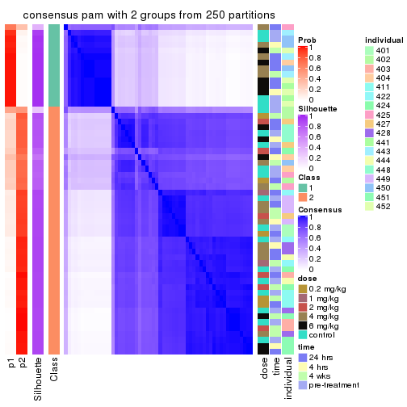</p>

</div>
<div id='tab-SD-pam-consensus-heatmap-2'>
<pre><code class="r">consensus_heatmap(res, k = 3)
</code></pre>

<p>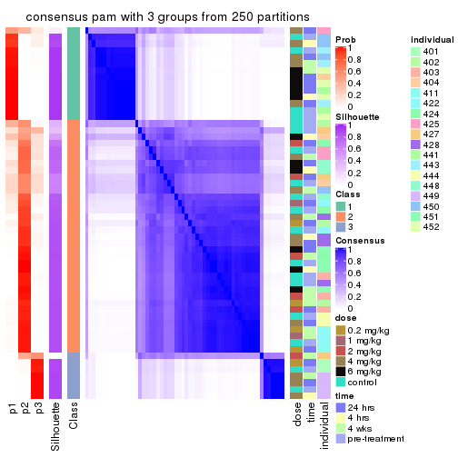</p>

</div>
<div id='tab-SD-pam-consensus-heatmap-3'>
<pre><code class="r">consensus_heatmap(res, k = 4)
</code></pre>

<p>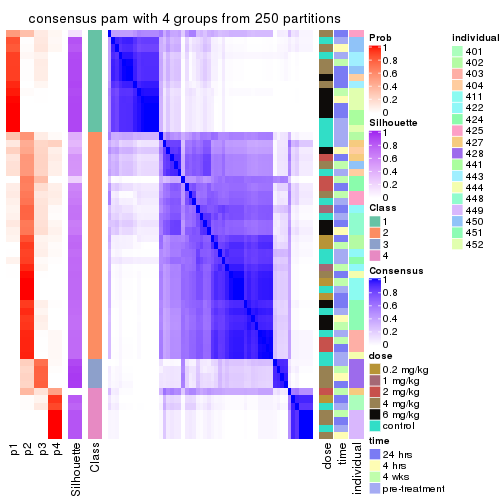</p>

</div>
<div id='tab-SD-pam-consensus-heatmap-4'>
<pre><code class="r">consensus_heatmap(res, k = 5)
</code></pre>

<p>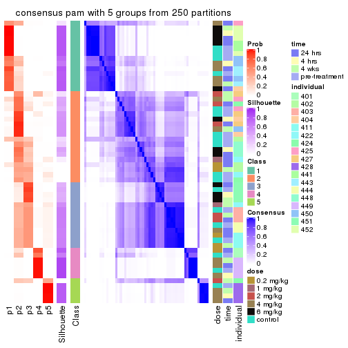</p>

</div>
<div id='tab-SD-pam-consensus-heatmap-5'>
<pre><code class="r">consensus_heatmap(res, k = 6)
</code></pre>

<p>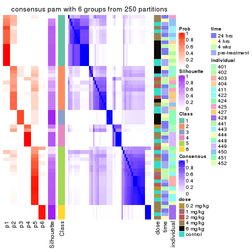</p>

</div>
</div>

Heatmaps for the membership of samples in all partitions to see how consistent they are:


<script>
$( function() {
	$( '#tabs-SD-pam-membership-heatmap' ).tabs();
} );
</script>
<div id='tabs-SD-pam-membership-heatmap'>
<ul>
<li><a href='#tab-SD-pam-membership-heatmap-1'>k = 2</a></li>
<li><a href='#tab-SD-pam-membership-heatmap-2'>k = 3</a></li>
<li><a href='#tab-SD-pam-membership-heatmap-3'>k = 4</a></li>
<li><a href='#tab-SD-pam-membership-heatmap-4'>k = 5</a></li>
<li><a href='#tab-SD-pam-membership-heatmap-5'>k = 6</a></li>
</ul>
<div id='tab-SD-pam-membership-heatmap-1'>
<pre><code class="r">membership_heatmap(res, k = 2)
</code></pre>

<p>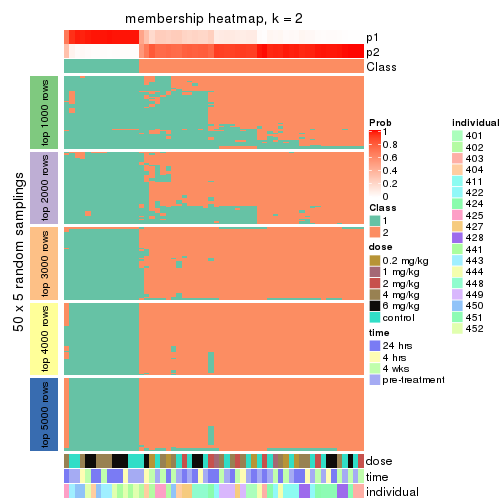</p>

</div>
<div id='tab-SD-pam-membership-heatmap-2'>
<pre><code class="r">membership_heatmap(res, k = 3)
</code></pre>

<p>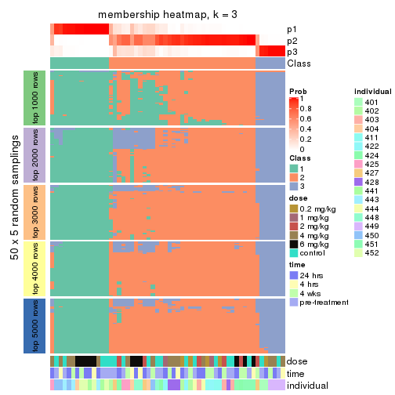</p>

</div>
<div id='tab-SD-pam-membership-heatmap-3'>
<pre><code class="r">membership_heatmap(res, k = 4)
</code></pre>

<p>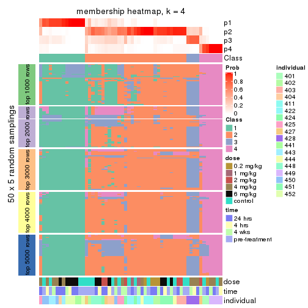</p>

</div>
<div id='tab-SD-pam-membership-heatmap-4'>
<pre><code class="r">membership_heatmap(res, k = 5)
</code></pre>

<p>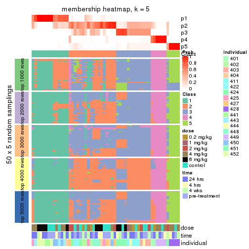</p>

</div>
<div id='tab-SD-pam-membership-heatmap-5'>
<pre><code class="r">membership_heatmap(res, k = 6)
</code></pre>

<p>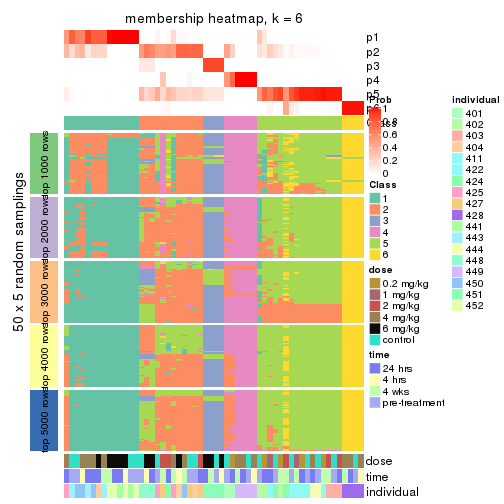</p>

</div>
</div>

As soon as we have had the classes for columns, we can look for signatures
which are significantly different between classes which can be candidate marks
for certain classes. Following are the heatmaps for signatures.


Signature heatmaps where rows are scaled:


<script>
$( function() {
	$( '#tabs-SD-pam-get-signatures' ).tabs();
} );
</script>
<div id='tabs-SD-pam-get-signatures'>
<ul>
<li><a href='#tab-SD-pam-get-signatures-1'>k = 2</a></li>
<li><a href='#tab-SD-pam-get-signatures-2'>k = 3</a></li>
<li><a href='#tab-SD-pam-get-signatures-3'>k = 4</a></li>
<li><a href='#tab-SD-pam-get-signatures-4'>k = 5</a></li>
<li><a href='#tab-SD-pam-get-signatures-5'>k = 6</a></li>
</ul>
<div id='tab-SD-pam-get-signatures-1'>
<pre><code class="r">get_signatures(res, k = 2)
</code></pre>

<p>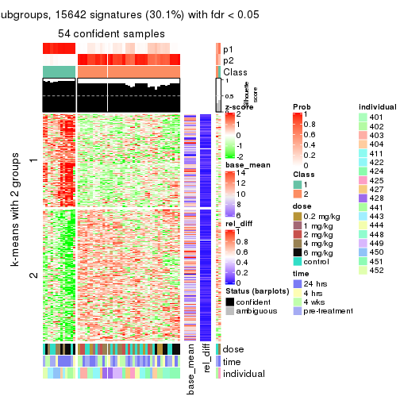</p>

</div>
<div id='tab-SD-pam-get-signatures-2'>
<pre><code class="r">get_signatures(res, k = 3)
</code></pre>

<p>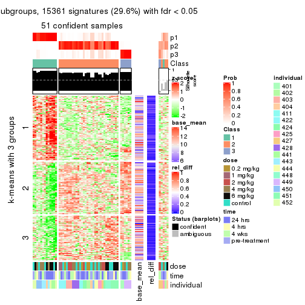</p>

</div>
<div id='tab-SD-pam-get-signatures-3'>
<pre><code class="r">get_signatures(res, k = 4)
</code></pre>

<p>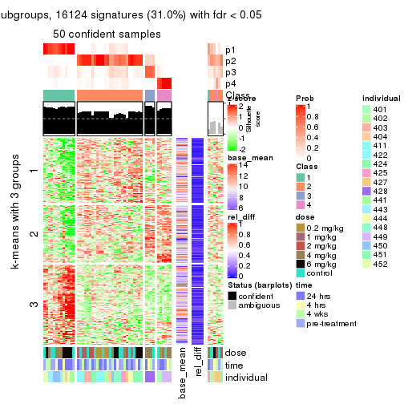</p>

</div>
<div id='tab-SD-pam-get-signatures-4'>
<pre><code class="r">get_signatures(res, k = 5)
</code></pre>

<p>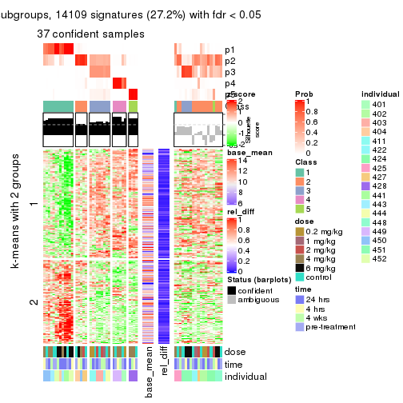</p>

</div>
<div id='tab-SD-pam-get-signatures-5'>
<pre><code class="r">get_signatures(res, k = 6)
</code></pre>

<p>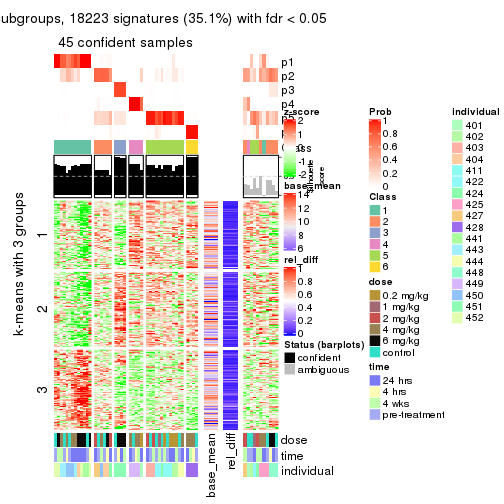</p>

</div>
</div>


Signature heatmaps where rows are not scaled:


<script>
$( function() {
	$( '#tabs-SD-pam-get-signatures-no-scale' ).tabs();
} );
</script>
<div id='tabs-SD-pam-get-signatures-no-scale'>
<ul>
<li><a href='#tab-SD-pam-get-signatures-no-scale-1'>k = 2</a></li>
<li><a href='#tab-SD-pam-get-signatures-no-scale-2'>k = 3</a></li>
<li><a href='#tab-SD-pam-get-signatures-no-scale-3'>k = 4</a></li>
<li><a href='#tab-SD-pam-get-signatures-no-scale-4'>k = 5</a></li>
<li><a href='#tab-SD-pam-get-signatures-no-scale-5'>k = 6</a></li>
</ul>
<div id='tab-SD-pam-get-signatures-no-scale-1'>
<pre><code class="r">get_signatures(res, k = 2, scale_rows = FALSE)
</code></pre>

<p>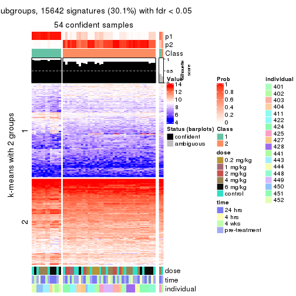</p>

</div>
<div id='tab-SD-pam-get-signatures-no-scale-2'>
<pre><code class="r">get_signatures(res, k = 3, scale_rows = FALSE)
</code></pre>

<p>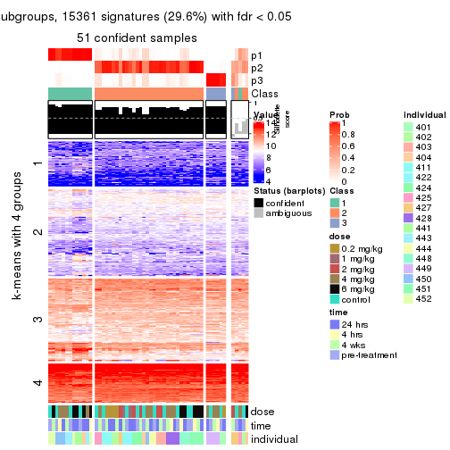</p>

</div>
<div id='tab-SD-pam-get-signatures-no-scale-3'>
<pre><code class="r">get_signatures(res, k = 4, scale_rows = FALSE)
</code></pre>

<p>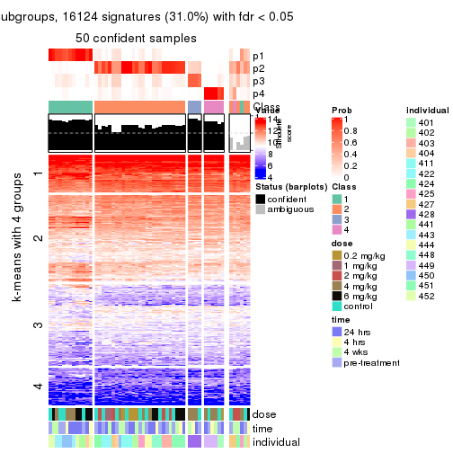</p>

</div>
<div id='tab-SD-pam-get-signatures-no-scale-4'>
<pre><code class="r">get_signatures(res, k = 5, scale_rows = FALSE)
</code></pre>

<p>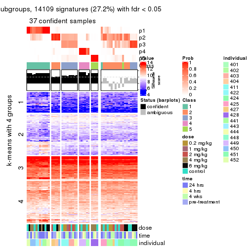</p>

</div>
<div id='tab-SD-pam-get-signatures-no-scale-5'>
<pre><code class="r">get_signatures(res, k = 6, scale_rows = FALSE)
</code></pre>

<p>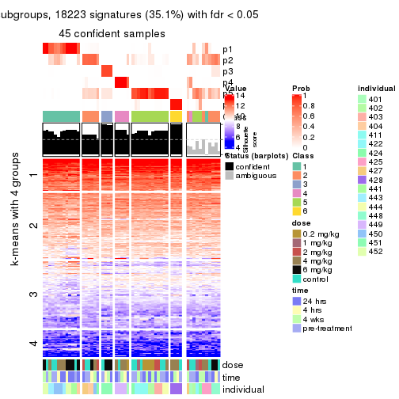</p>

</div>
</div>


Compare the overlap of signatures from different k:

```r
compare_signatures(res)
```

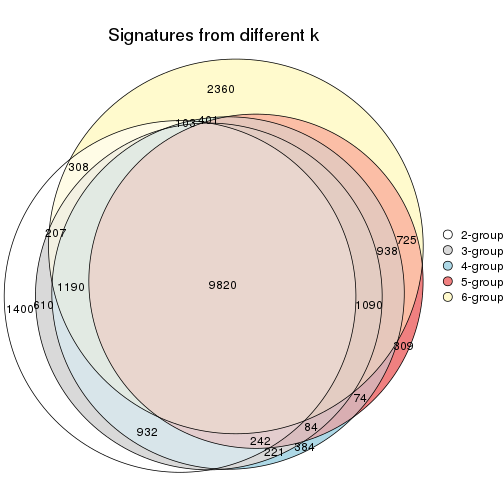

`get_signature()` returns a data frame invisibly. TO get the list of signatures, the function
call should be assigned to a variable explicitly. In following code, if `plot` argument is set
to `FALSE`, no heatmap is plotted while only the differential analysis is performed.

```r
# code only for demonstration
tb = get_signature(res, k = ..., plot = FALSE)
```

An example of the output of `tb` is:

```
#>   which_row         fdr    mean_1    mean_2 scaled_mean_1 scaled_mean_2 km
#> 1        38 0.042760348  8.373488  9.131774    -0.5533452     0.5164555  1
#> 2        40 0.018707592  7.106213  8.469186    -0.6173731     0.5762149  1
#> 3        55 0.019134737 10.221463 11.207825    -0.6159697     0.5749050  1
#> 4        59 0.006059896  5.921854  7.869574    -0.6899429     0.6439467  1
#> 5        60 0.018055526  8.928898 10.211722    -0.6204761     0.5791110  1
#> 6        98 0.009384629 15.714769 14.887706     0.6635654    -0.6193277  2
...
```

The columns in `tb` are:

1. `which_row`: row indices corresponding to the input matrix.
2. `fdr`: FDR for the differential test. 
3. `mean_x`: The mean value in group x.
4. `scaled_mean_x`: The mean value in group x after rows are scaled.
5. `km`: Row groups if k-means clustering is applied to rows.


UMAP plot which shows how samples are separated.


<script>
$( function() {
	$( '#tabs-SD-pam-dimension-reduction' ).tabs();
} );
</script>
<div id='tabs-SD-pam-dimension-reduction'>
<ul>
<li><a href='#tab-SD-pam-dimension-reduction-1'>k = 2</a></li>
<li><a href='#tab-SD-pam-dimension-reduction-2'>k = 3</a></li>
<li><a href='#tab-SD-pam-dimension-reduction-3'>k = 4</a></li>
<li><a href='#tab-SD-pam-dimension-reduction-4'>k = 5</a></li>
<li><a href='#tab-SD-pam-dimension-reduction-5'>k = 6</a></li>
</ul>
<div id='tab-SD-pam-dimension-reduction-1'>
<pre><code class="r">dimension_reduction(res, k = 2, method = &quot;UMAP&quot;)
</code></pre>

<p>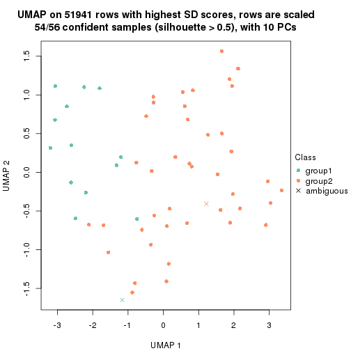</p>

</div>
<div id='tab-SD-pam-dimension-reduction-2'>
<pre><code class="r">dimension_reduction(res, k = 3, method = &quot;UMAP&quot;)
</code></pre>

<p>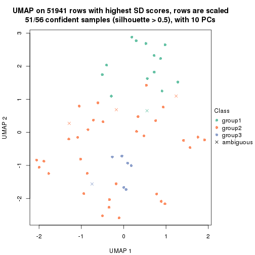</p>

</div>
<div id='tab-SD-pam-dimension-reduction-3'>
<pre><code class="r">dimension_reduction(res, k = 4, method = &quot;UMAP&quot;)
</code></pre>

<p>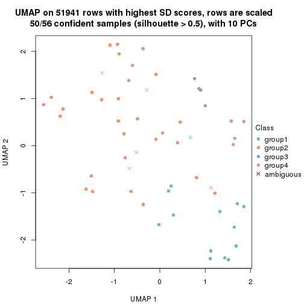</p>

</div>
<div id='tab-SD-pam-dimension-reduction-4'>
<pre><code class="r">dimension_reduction(res, k = 5, method = &quot;UMAP&quot;)
</code></pre>

<p>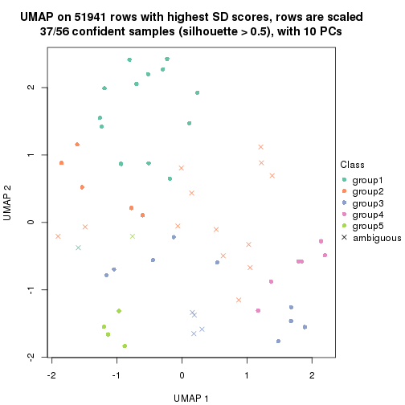</p>

</div>
<div id='tab-SD-pam-dimension-reduction-5'>
<pre><code class="r">dimension_reduction(res, k = 6, method = &quot;UMAP&quot;)
</code></pre>

<p>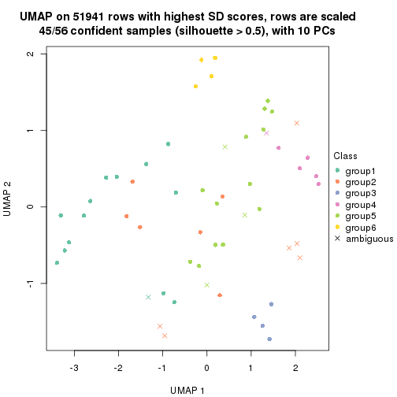</p>

</div>
</div>


Following heatmap shows how subgroups are split when increasing `k`:

```r
collect_classes(res)
```

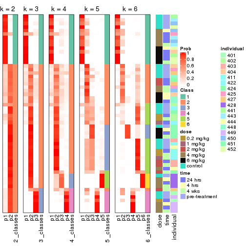


Test correlation between subgroups and known annotations. If the known
annotation is numeric, one-way ANOVA test is applied, and if the known
annotation is discrete, chi-squared contingency table test is applied.

```r
test_to_known_factors(res)
```

```
#>         n dose(p) time(p) individual(p) k
#> SD:pam 54  0.2066   0.830      1.58e-04 2
#> SD:pam 51  0.2929   0.969      1.08e-07 3
#> SD:pam 50  0.1931   0.990      1.21e-10 4
#> SD:pam 37  0.2348   0.992      5.52e-10 5
#> SD:pam 45  0.0348   0.995      7.13e-14 6
```


If matrix rows can be associated to genes, consider to use `functional_enrichment(res,
...)` to perform function enrichment for the signature genes. See [this vignette](http://bioconductor.org/packages/devel/bioc/vignettes/cola/inst/doc/functional_enrichment.html) for more detailed explanations.


 

---------------------------------------------------


### SD:mclust


The object with results only for a single top-value method and a single partition method 
can be extracted as:

```r
res = res_list["SD", "mclust"]
# you can also extract it by
# res = res_list["SD:mclust"]
```

A summary of `res` and all the functions that can be applied to it:

```r
res
```

```
#> A 'ConsensusPartition' object with k = 2, 3, 4, 5, 6.
#>   On a matrix with 51941 rows and 56 columns.
#>   Top rows (1000, 2000, 3000, 4000, 5000) are extracted by 'SD' method.
#>   Subgroups are detected by 'mclust' method.
#>   Performed in total 1250 partitions by row resampling.
#>   Best k for subgroups seems to be 5.
#> 
#> Following methods can be applied to this 'ConsensusPartition' object:
#>  [1] "cola_report"             "collect_classes"         "collect_plots"          
#>  [4] "collect_stats"           "colnames"                "compare_signatures"     
#>  [7] "consensus_heatmap"       "dimension_reduction"     "functional_enrichment"  
#> [10] "get_anno_col"            "get_anno"                "get_classes"            
#> [13] "get_consensus"           "get_matrix"              "get_membership"         
#> [16] "get_param"               "get_signatures"          "get_stats"              
#> [19] "is_best_k"               "is_stable_k"             "membership_heatmap"     
#> [22] "ncol"                    "nrow"                    "plot_ecdf"              
#> [25] "rownames"                "select_partition_number" "show"                   
#> [28] "suggest_best_k"          "test_to_known_factors"
```

`collect_plots()` function collects all the plots made from `res` for all `k` (number of partitions)
into one single page to provide an easy and fast comparison between different `k`.

```r
collect_plots(res)
```

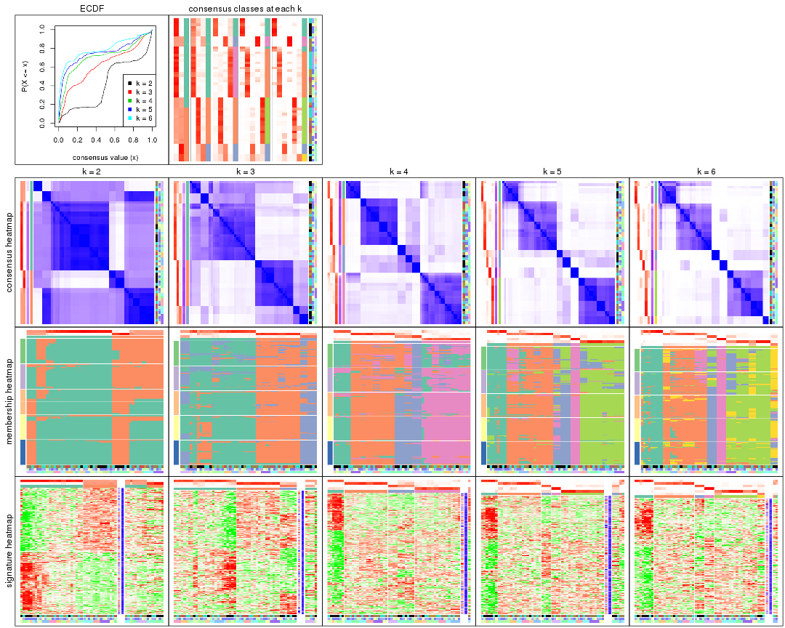

The plots are:

- The first row: a plot of the ECDF (empirical cumulative distribution
  function) curves of the consensus matrix for each `k` and the heatmap of
  predicted classes for each `k`.
- The second row: heatmaps of the consensus matrix for each `k`.
- The third row: heatmaps of the membership matrix for each `k`.
- The fouth row: heatmaps of the signatures for each `k`.

All the plots in panels can be made by individual functions and they are
plotted later in this section.

`select_partition_number()` produces several plots showing different
statistics for choosing "optimized" `k`. There are following statistics:

- ECDF curves of the consensus matrix for each `k`;
- 1-PAC. [The PAC
  score](https://en.wikipedia.org/wiki/Consensus_clustering#Over-interpretation_potential_of_consensus_clustering)
  measures the proportion of the ambiguous subgrouping.
- Mean silhouette score.
- Concordance. The mean probability of fiting the consensus class ids in all
  partitions.
- Area increased. Denote $A_k$ as the area under the ECDF curve for current
  `k`, the area increased is defined as $A_k - A_{k-1}$.
- Rand index. The percent of pairs of samples that are both in a same cluster
  or both are not in a same cluster in the partition of k and k-1.
- Jaccard index. The ratio of pairs of samples are both in a same cluster in
  the partition of k and k-1 and the pairs of samples are both in a same
  cluster in the partition k or k-1.

The detailed explanations of these statistics can be found in [the _cola_
vignette](http://bioconductor.org/packages/devel/bioc/vignettes/cola/inst/doc/cola.html#toc_13).

Generally speaking, lower PAC score, higher mean silhouette score or higher
concordance corresponds to better partition. Rand index and Jaccard index
measure how similar the current partition is compared to partition with `k-1`.
If they are too similar, we won't accept `k` is better than `k-1`.

```r
select_partition_number(res)
```

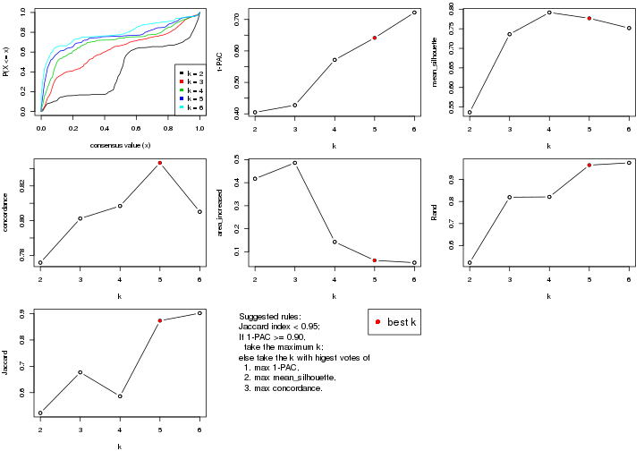

The numeric values for all these statistics can be obtained by `get_stats()`.

```r
get_stats(res)
```

```
#>   k 1-PAC mean_silhouette concordance area_increased  Rand Jaccard
#> 2 2 0.405           0.536       0.776         0.4174 0.523   0.523
#> 3 3 0.428           0.736       0.801         0.4864 0.819   0.677
#> 4 4 0.572           0.792       0.808         0.1427 0.821   0.586
#> 5 5 0.642           0.777       0.833         0.0625 0.965   0.873
#> 6 6 0.722           0.752       0.805         0.0527 0.975   0.902
```

`suggest_best_k()` suggests the best $k$ based on these statistics. The rules are as follows:

- All $k$ with Jaccard index larger than 0.95 are removed because increasing
  $k$ does not provide enough extra information. If all $k$ are removed, it is
  marked as no subgroup is detected.
- For all $k$ with 1-PAC score larger than 0.9, the maximal $k$ is taken as
  the best $k$, and other $k$ are marked as optional $k$.
- If it does not fit the second rule. The $k$ with the maximal vote of the
  highest 1-PAC score, highest mean silhouette, and highest concordance is
  taken as the best $k$.

```r
suggest_best_k(res)
```

```
#> [1] 5
```


Following shows the table of the partitions (You need to click the **show/hide
code output** link to see it). The membership matrix (columns with name `p*`)
is inferred by
[`clue::cl_consensus()`](https://www.rdocumentation.org/link/cl_consensus?package=clue)
function with the `SE` method. Basically the value in the membership matrix
represents the probability to belong to a certain group. The finall class
label for an item is determined with the group with highest probability it
belongs to.

In `get_classes()` function, the entropy is calculated from the membership
matrix and the silhouette score is calculated from the consensus matrix.


<script>
$( function() {
	$( '#tabs-SD-mclust-get-classes' ).tabs();
} );
</script>
<div id='tabs-SD-mclust-get-classes'>
<ul>
<li><a href='#tab-SD-mclust-get-classes-1'>k = 2</a></li>
<li><a href='#tab-SD-mclust-get-classes-2'>k = 3</a></li>
<li><a href='#tab-SD-mclust-get-classes-3'>k = 4</a></li>
<li><a href='#tab-SD-mclust-get-classes-4'>k = 5</a></li>
<li><a href='#tab-SD-mclust-get-classes-5'>k = 6</a></li>
</ul>

<div id='tab-SD-mclust-get-classes-1'>
<p><a id='tab-SD-mclust-get-classes-1-a' style='color:#0366d6' href='#'>show/hide code output</a></p>
<pre><code class="r">cbind(get_classes(res, k = 2), get_membership(res, k = 2))
</code></pre>

<pre><code>#&gt;           class entropy silhouette    p1    p2
#&gt; GSM687644     1  0.0672      0.759 0.992 0.008
#&gt; GSM687648     1  0.5294      0.646 0.880 0.120
#&gt; GSM687653     2  0.9998      0.587 0.492 0.508
#&gt; GSM687658     1  0.0000      0.760 1.000 0.000
#&gt; GSM687663     1  0.9983     -0.543 0.524 0.476
#&gt; GSM687668     2  0.9988      0.600 0.480 0.520
#&gt; GSM687673     1  0.9977     -0.536 0.528 0.472
#&gt; GSM687678     1  0.4161      0.690 0.916 0.084
#&gt; GSM687683     1  0.1184      0.757 0.984 0.016
#&gt; GSM687688     2  0.9983      0.604 0.476 0.524
#&gt; GSM687695     1  0.1414      0.757 0.980 0.020
#&gt; GSM687699     1  0.1843      0.749 0.972 0.028
#&gt; GSM687704     2  0.9896      0.593 0.440 0.560
#&gt; GSM687707     2  0.4939      0.454 0.108 0.892
#&gt; GSM687712     1  0.9993      0.194 0.516 0.484
#&gt; GSM687719     1  0.0376      0.761 0.996 0.004
#&gt; GSM687724     2  0.0938      0.493 0.012 0.988
#&gt; GSM687728     1  0.0938      0.759 0.988 0.012
#&gt; GSM687646     1  0.0938      0.758 0.988 0.012
#&gt; GSM687649     1  0.5842      0.613 0.860 0.140
#&gt; GSM687665     1  0.9970     -0.532 0.532 0.468
#&gt; GSM687651     1  0.7453      0.435 0.788 0.212
#&gt; GSM687667     2  0.9998      0.582 0.492 0.508
#&gt; GSM687670     2  0.9988      0.600 0.480 0.520
#&gt; GSM687671     2  0.9988      0.600 0.480 0.520
#&gt; GSM687654     2  0.9998      0.587 0.492 0.508
#&gt; GSM687675     1  0.9963     -0.526 0.536 0.464
#&gt; GSM687685     1  0.1843      0.751 0.972 0.028
#&gt; GSM687656     2  0.9998      0.587 0.492 0.508
#&gt; GSM687677     2  1.0000      0.573 0.496 0.504
#&gt; GSM687687     1  0.1414      0.755 0.980 0.020
#&gt; GSM687692     2  0.9983      0.604 0.476 0.524
#&gt; GSM687716     1  0.9993      0.194 0.516 0.484
#&gt; GSM687722     1  0.0376      0.761 0.996 0.004
#&gt; GSM687680     1  0.2603      0.738 0.956 0.044
#&gt; GSM687690     2  0.9983      0.604 0.476 0.524
#&gt; GSM687700     1  0.0938      0.759 0.988 0.012
#&gt; GSM687705     2  0.9815      0.598 0.420 0.580
#&gt; GSM687714     1  0.9993      0.194 0.516 0.484
#&gt; GSM687721     1  0.1414      0.757 0.980 0.020
#&gt; GSM687682     1  0.3114      0.726 0.944 0.056
#&gt; GSM687694     2  0.9983      0.604 0.476 0.524
#&gt; GSM687702     1  0.2603      0.735 0.956 0.044
#&gt; GSM687718     1  0.9993      0.194 0.516 0.484
#&gt; GSM687723     1  0.0938      0.761 0.988 0.012
#&gt; GSM687661     1  0.0376      0.760 0.996 0.004
#&gt; GSM687710     2  0.4815      0.456 0.104 0.896
#&gt; GSM687726     2  0.0938      0.493 0.012 0.988
#&gt; GSM687730     1  0.1184      0.759 0.984 0.016
#&gt; GSM687660     1  0.1414      0.757 0.980 0.020
#&gt; GSM687697     1  0.1414      0.757 0.980 0.020
#&gt; GSM687709     2  0.4815      0.456 0.104 0.896
#&gt; GSM687725     2  0.0938      0.493 0.012 0.988
#&gt; GSM687729     1  0.1414      0.757 0.980 0.020
#&gt; GSM687727     2  0.0938      0.493 0.012 0.988
#&gt; GSM687731     1  0.0938      0.759 0.988 0.012
</code></pre>

<script>
$('#tab-SD-mclust-get-classes-1-a').parent().next().next().hide();
$('#tab-SD-mclust-get-classes-1-a').click(function(){
  $('#tab-SD-mclust-get-classes-1-a').parent().next().next().toggle();
  return(false);
});
</script>
</div>

<div id='tab-SD-mclust-get-classes-2'>
<p><a id='tab-SD-mclust-get-classes-2-a' style='color:#0366d6' href='#'>show/hide code output</a></p>
<pre><code class="r">cbind(get_classes(res, k = 3), get_membership(res, k = 3))
</code></pre>

<pre><code>#&gt;           class entropy silhouette    p1    p2    p3
#&gt; GSM687644     1   0.390      0.765 0.888 0.060 0.052
#&gt; GSM687648     1   0.685      0.685 0.740 0.136 0.124
#&gt; GSM687653     2   0.350      0.825 0.004 0.880 0.116
#&gt; GSM687658     1   0.304      0.767 0.920 0.040 0.040
#&gt; GSM687663     2   0.210      0.898 0.004 0.944 0.052
#&gt; GSM687668     2   0.220      0.895 0.004 0.940 0.056
#&gt; GSM687673     2   0.210      0.898 0.004 0.944 0.052
#&gt; GSM687678     1   0.490      0.750 0.844 0.092 0.064
#&gt; GSM687683     1   0.341      0.767 0.904 0.068 0.028
#&gt; GSM687688     2   0.176      0.902 0.004 0.956 0.040
#&gt; GSM687695     1   0.794      0.521 0.616 0.296 0.088
#&gt; GSM687699     1   0.377      0.763 0.888 0.084 0.028
#&gt; GSM687704     2   0.304      0.874 0.000 0.896 0.104
#&gt; GSM687707     3   0.670      0.788 0.036 0.280 0.684
#&gt; GSM687712     1   0.782      0.297 0.504 0.052 0.444
#&gt; GSM687719     1   0.206      0.764 0.952 0.024 0.024
#&gt; GSM687724     3   0.583      0.830 0.000 0.340 0.660
#&gt; GSM687728     1   0.784      0.536 0.624 0.292 0.084
#&gt; GSM687646     1   0.429      0.760 0.872 0.060 0.068
#&gt; GSM687649     1   0.716      0.666 0.720 0.136 0.144
#&gt; GSM687665     2   0.199      0.898 0.004 0.948 0.048
#&gt; GSM687651     1   0.788      0.610 0.668 0.164 0.168
#&gt; GSM687667     2   0.199      0.898 0.004 0.948 0.048
#&gt; GSM687670     2   0.210      0.895 0.004 0.944 0.052
#&gt; GSM687671     2   0.230      0.894 0.004 0.936 0.060
#&gt; GSM687654     2   0.350      0.825 0.004 0.880 0.116
#&gt; GSM687675     2   0.210      0.898 0.004 0.944 0.052
#&gt; GSM687685     1   0.367      0.767 0.896 0.064 0.040
#&gt; GSM687656     2   0.350      0.825 0.004 0.880 0.116
#&gt; GSM687677     2   0.230      0.901 0.004 0.936 0.060
#&gt; GSM687687     1   0.456      0.754 0.860 0.064 0.076
#&gt; GSM687692     2   0.210      0.899 0.004 0.944 0.052
#&gt; GSM687716     1   0.782      0.305 0.508 0.052 0.440
#&gt; GSM687722     1   0.231      0.764 0.944 0.024 0.032
#&gt; GSM687680     1   0.371      0.765 0.892 0.076 0.032
#&gt; GSM687690     2   0.275      0.890 0.012 0.924 0.064
#&gt; GSM687700     1   0.380      0.750 0.888 0.032 0.080
#&gt; GSM687705     2   0.288      0.857 0.000 0.904 0.096
#&gt; GSM687714     1   0.782      0.297 0.504 0.052 0.444
#&gt; GSM687721     1   0.341      0.754 0.900 0.020 0.080
#&gt; GSM687682     1   0.409      0.763 0.876 0.088 0.036
#&gt; GSM687694     2   0.318      0.875 0.024 0.912 0.064
#&gt; GSM687702     1   0.341      0.767 0.904 0.068 0.028
#&gt; GSM687718     1   0.782      0.297 0.504 0.052 0.444
#&gt; GSM687723     1   0.256      0.767 0.936 0.028 0.036
#&gt; GSM687661     1   0.304      0.767 0.920 0.040 0.040
#&gt; GSM687710     3   0.670      0.788 0.036 0.280 0.684
#&gt; GSM687726     3   0.583      0.830 0.000 0.340 0.660
#&gt; GSM687730     1   0.828      0.173 0.468 0.456 0.076
#&gt; GSM687660     1   0.616      0.687 0.780 0.128 0.092
#&gt; GSM687697     1   0.706      0.620 0.708 0.212 0.080
#&gt; GSM687709     3   0.680      0.785 0.040 0.280 0.680
#&gt; GSM687725     3   0.583      0.830 0.000 0.340 0.660
#&gt; GSM687729     1   0.811      0.505 0.604 0.300 0.096
#&gt; GSM687727     3   0.583      0.830 0.000 0.340 0.660
#&gt; GSM687731     1   0.780      0.534 0.624 0.296 0.080
</code></pre>

<script>
$('#tab-SD-mclust-get-classes-2-a').parent().next().next().hide();
$('#tab-SD-mclust-get-classes-2-a').click(function(){
  $('#tab-SD-mclust-get-classes-2-a').parent().next().next().toggle();
  return(false);
});
</script>
</div>

<div id='tab-SD-mclust-get-classes-3'>
<p><a id='tab-SD-mclust-get-classes-3-a' style='color:#0366d6' href='#'>show/hide code output</a></p>
<pre><code class="r">cbind(get_classes(res, k = 4), get_membership(res, k = 4))
</code></pre>

<pre><code>#&gt;           class entropy silhouette    p1    p2    p3    p4
#&gt; GSM687644     4   0.487      0.795 0.012 0.056 0.140 0.792
#&gt; GSM687648     4   0.545      0.767 0.072 0.104 0.044 0.780
#&gt; GSM687653     2   0.474      0.835 0.080 0.820 0.068 0.032
#&gt; GSM687658     4   0.223      0.819 0.036 0.036 0.000 0.928
#&gt; GSM687663     2   0.362      0.895 0.064 0.876 0.028 0.032
#&gt; GSM687668     2   0.172      0.901 0.012 0.952 0.008 0.028
#&gt; GSM687673     2   0.342      0.895 0.064 0.884 0.024 0.028
#&gt; GSM687678     4   0.286      0.822 0.024 0.072 0.004 0.900
#&gt; GSM687683     4   0.515      0.795 0.032 0.060 0.116 0.792
#&gt; GSM687688     2   0.220      0.883 0.032 0.936 0.016 0.016
#&gt; GSM687695     1   0.349      0.958 0.824 0.004 0.000 0.172
#&gt; GSM687699     4   0.267      0.825 0.024 0.072 0.000 0.904
#&gt; GSM687704     2   0.337      0.886 0.024 0.888 0.056 0.032
#&gt; GSM687707     3   0.754      0.675 0.104 0.196 0.624 0.076
#&gt; GSM687712     3   0.351      0.644 0.016 0.012 0.864 0.108
#&gt; GSM687719     4   0.423      0.727 0.156 0.024 0.008 0.812
#&gt; GSM687724     3   0.662      0.660 0.072 0.324 0.592 0.012
#&gt; GSM687728     1   0.411      0.958 0.804 0.016 0.004 0.176
#&gt; GSM687646     4   0.503      0.789 0.016 0.056 0.144 0.784
#&gt; GSM687649     4   0.540      0.770 0.072 0.100 0.044 0.784
#&gt; GSM687665     2   0.352      0.894 0.064 0.880 0.028 0.028
#&gt; GSM687651     4   0.626      0.721 0.084 0.152 0.044 0.720
#&gt; GSM687667     2   0.312      0.901 0.044 0.900 0.024 0.032
#&gt; GSM687670     2   0.172      0.901 0.012 0.952 0.008 0.028
#&gt; GSM687671     2   0.185      0.902 0.012 0.948 0.012 0.028
#&gt; GSM687654     2   0.468      0.837 0.076 0.824 0.068 0.032
#&gt; GSM687675     2   0.342      0.895 0.064 0.884 0.024 0.028
#&gt; GSM687685     4   0.509      0.797 0.032 0.060 0.112 0.796
#&gt; GSM687656     2   0.468      0.837 0.076 0.824 0.068 0.032
#&gt; GSM687677     2   0.308      0.901 0.052 0.900 0.020 0.028
#&gt; GSM687687     4   0.519      0.765 0.004 0.068 0.172 0.756
#&gt; GSM687692     2   0.210      0.881 0.028 0.940 0.016 0.016
#&gt; GSM687716     3   0.351      0.644 0.016 0.012 0.864 0.108
#&gt; GSM687722     4   0.391      0.774 0.116 0.032 0.008 0.844
#&gt; GSM687680     4   0.260      0.822 0.024 0.068 0.000 0.908
#&gt; GSM687690     2   0.210      0.881 0.028 0.940 0.016 0.016
#&gt; GSM687700     4   0.500     -0.201 0.484 0.000 0.000 0.516
#&gt; GSM687705     2   0.321      0.885 0.024 0.896 0.044 0.036
#&gt; GSM687714     3   0.351      0.644 0.016 0.012 0.864 0.108
#&gt; GSM687721     4   0.457      0.536 0.276 0.008 0.000 0.716
#&gt; GSM687682     4   0.249      0.823 0.020 0.068 0.000 0.912
#&gt; GSM687694     2   0.210      0.881 0.028 0.940 0.016 0.016
#&gt; GSM687702     4   0.292      0.828 0.020 0.060 0.016 0.904
#&gt; GSM687718     3   0.351      0.644 0.016 0.012 0.864 0.108
#&gt; GSM687723     4   0.265      0.810 0.056 0.028 0.004 0.912
#&gt; GSM687661     4   0.213      0.818 0.036 0.032 0.000 0.932
#&gt; GSM687710     3   0.754      0.675 0.104 0.196 0.624 0.076
#&gt; GSM687726     3   0.662      0.660 0.072 0.324 0.592 0.012
#&gt; GSM687730     1   0.523      0.904 0.772 0.064 0.016 0.148
#&gt; GSM687660     1   0.409      0.908 0.764 0.004 0.000 0.232
#&gt; GSM687697     1   0.363      0.955 0.812 0.004 0.000 0.184
#&gt; GSM687709     3   0.754      0.675 0.104 0.196 0.624 0.076
#&gt; GSM687725     3   0.662      0.660 0.072 0.324 0.592 0.012
#&gt; GSM687729     1   0.359      0.957 0.824 0.008 0.000 0.168
#&gt; GSM687727     3   0.662      0.660 0.072 0.324 0.592 0.012
#&gt; GSM687731     1   0.417      0.957 0.804 0.020 0.004 0.172
</code></pre>

<script>
$('#tab-SD-mclust-get-classes-3-a').parent().next().next().hide();
$('#tab-SD-mclust-get-classes-3-a').click(function(){
  $('#tab-SD-mclust-get-classes-3-a').parent().next().next().toggle();
  return(false);
});
</script>
</div>

<div id='tab-SD-mclust-get-classes-4'>
<p><a id='tab-SD-mclust-get-classes-4-a' style='color:#0366d6' href='#'>show/hide code output</a></p>
<pre><code class="r">cbind(get_classes(res, k = 5), get_membership(res, k = 5))
</code></pre>

<pre><code>#&gt;           class entropy silhouette    p1    p2    p3    p4    p5
#&gt; GSM687644     2  0.5558      0.714 0.040 0.668 0.000 0.240 0.052
#&gt; GSM687648     2  0.3073      0.782 0.000 0.872 0.068 0.008 0.052
#&gt; GSM687653     5  0.3509      0.746 0.004 0.020 0.148 0.004 0.824
#&gt; GSM687658     2  0.2544      0.815 0.064 0.900 0.000 0.028 0.008
#&gt; GSM687663     5  0.0889      0.860 0.004 0.012 0.004 0.004 0.976
#&gt; GSM687668     5  0.2880      0.849 0.012 0.028 0.068 0.004 0.888
#&gt; GSM687673     5  0.1235      0.859 0.004 0.012 0.016 0.004 0.964
#&gt; GSM687678     2  0.1186      0.808 0.008 0.964 0.000 0.008 0.020
#&gt; GSM687683     2  0.5168      0.756 0.056 0.720 0.000 0.188 0.036
#&gt; GSM687688     5  0.3668      0.809 0.008 0.012 0.148 0.012 0.820
#&gt; GSM687695     1  0.0727      0.864 0.980 0.004 0.000 0.004 0.012
#&gt; GSM687699     2  0.1018      0.810 0.016 0.968 0.000 0.000 0.016
#&gt; GSM687704     5  0.3818      0.818 0.012 0.032 0.104 0.016 0.836
#&gt; GSM687707     3  0.8018      0.493 0.036 0.096 0.520 0.196 0.152
#&gt; GSM687712     4  0.0510      1.000 0.000 0.016 0.000 0.984 0.000
#&gt; GSM687719     2  0.5245      0.642 0.292 0.648 0.000 0.044 0.016
#&gt; GSM687724     3  0.3333      0.697 0.000 0.000 0.788 0.004 0.208
#&gt; GSM687728     1  0.1704      0.858 0.928 0.004 0.000 0.000 0.068
#&gt; GSM687646     2  0.5743      0.698 0.040 0.652 0.004 0.256 0.048
#&gt; GSM687649     2  0.3142      0.780 0.000 0.868 0.068 0.008 0.056
#&gt; GSM687665     5  0.0889      0.860 0.004 0.012 0.004 0.004 0.976
#&gt; GSM687651     2  0.4899      0.764 0.036 0.788 0.072 0.024 0.080
#&gt; GSM687667     5  0.1143      0.861 0.004 0.012 0.008 0.008 0.968
#&gt; GSM687670     5  0.2943      0.849 0.012 0.028 0.072 0.004 0.884
#&gt; GSM687671     5  0.2943      0.849 0.012 0.028 0.072 0.004 0.884
#&gt; GSM687654     5  0.3509      0.746 0.004 0.020 0.148 0.004 0.824
#&gt; GSM687675     5  0.1235      0.859 0.004 0.012 0.016 0.004 0.964
#&gt; GSM687685     2  0.5036      0.762 0.052 0.732 0.000 0.180 0.036
#&gt; GSM687656     5  0.3509      0.746 0.004 0.020 0.148 0.004 0.824
#&gt; GSM687677     5  0.0994      0.859 0.004 0.004 0.016 0.004 0.972
#&gt; GSM687687     2  0.5594      0.701 0.044 0.656 0.000 0.256 0.044
#&gt; GSM687692     5  0.3668      0.809 0.008 0.012 0.148 0.012 0.820
#&gt; GSM687716     4  0.0510      1.000 0.000 0.016 0.000 0.984 0.000
#&gt; GSM687722     2  0.5035      0.706 0.240 0.696 0.000 0.044 0.020
#&gt; GSM687680     2  0.1200      0.809 0.012 0.964 0.000 0.008 0.016
#&gt; GSM687690     5  0.3769      0.807 0.008 0.016 0.148 0.012 0.816
#&gt; GSM687700     1  0.3928      0.468 0.700 0.296 0.000 0.000 0.004
#&gt; GSM687705     5  0.4204      0.801 0.028 0.028 0.104 0.020 0.820
#&gt; GSM687714     4  0.0510      1.000 0.000 0.016 0.000 0.984 0.000
#&gt; GSM687721     2  0.4807      0.353 0.448 0.532 0.000 0.020 0.000
#&gt; GSM687682     2  0.0960      0.808 0.004 0.972 0.000 0.008 0.016
#&gt; GSM687694     5  0.3769      0.807 0.008 0.016 0.148 0.012 0.816
#&gt; GSM687702     2  0.1940      0.813 0.028 0.936 0.004 0.008 0.024
#&gt; GSM687718     4  0.0510      1.000 0.000 0.016 0.000 0.984 0.000
#&gt; GSM687723     2  0.3755      0.794 0.116 0.828 0.004 0.044 0.008
#&gt; GSM687661     2  0.2854      0.812 0.084 0.880 0.000 0.028 0.008
#&gt; GSM687710     3  0.8029      0.491 0.036 0.100 0.520 0.196 0.148
#&gt; GSM687726     3  0.3333      0.697 0.000 0.000 0.788 0.004 0.208
#&gt; GSM687730     1  0.3544      0.708 0.788 0.008 0.000 0.004 0.200
#&gt; GSM687660     1  0.2026      0.832 0.924 0.056 0.000 0.008 0.012
#&gt; GSM687697     1  0.1074      0.867 0.968 0.012 0.000 0.004 0.016
#&gt; GSM687709     3  0.8029      0.491 0.036 0.100 0.520 0.196 0.148
#&gt; GSM687725     3  0.3333      0.697 0.000 0.000 0.788 0.004 0.208
#&gt; GSM687729     1  0.0671      0.865 0.980 0.004 0.000 0.000 0.016
#&gt; GSM687727     3  0.3333      0.697 0.000 0.000 0.788 0.004 0.208
#&gt; GSM687731     1  0.1704      0.858 0.928 0.004 0.000 0.000 0.068
</code></pre>

<script>
$('#tab-SD-mclust-get-classes-4-a').parent().next().next().hide();
$('#tab-SD-mclust-get-classes-4-a').click(function(){
  $('#tab-SD-mclust-get-classes-4-a').parent().next().next().toggle();
  return(false);
});
</script>
</div>

<div id='tab-SD-mclust-get-classes-5'>
<p><a id='tab-SD-mclust-get-classes-5-a' style='color:#0366d6' href='#'>show/hide code output</a></p>
<pre><code class="r">cbind(get_classes(res, k = 6), get_membership(res, k = 6))
</code></pre>

<pre><code>#&gt;           class entropy silhouette    p1    p2    p3    p4    p5    p6
#&gt; GSM687644     2  0.5186      0.663 0.020 0.664 0.004 0.240 0.008 0.064
#&gt; GSM687648     2  0.3383      0.703 0.008 0.796 0.000 0.008 0.008 0.180
#&gt; GSM687653     5  0.4523      0.549 0.000 0.004 0.032 0.000 0.592 0.372
#&gt; GSM687658     2  0.3093      0.750 0.044 0.852 0.008 0.000 0.004 0.092
#&gt; GSM687663     5  0.0767      0.767 0.000 0.004 0.012 0.000 0.976 0.008
#&gt; GSM687668     5  0.3298      0.752 0.008 0.052 0.048 0.000 0.856 0.036
#&gt; GSM687673     5  0.0837      0.767 0.000 0.004 0.020 0.000 0.972 0.004
#&gt; GSM687678     2  0.2359      0.757 0.020 0.904 0.000 0.008 0.012 0.056
#&gt; GSM687683     2  0.5368      0.709 0.032 0.696 0.012 0.168 0.008 0.084
#&gt; GSM687688     5  0.5576      0.604 0.004 0.016 0.276 0.000 0.592 0.112
#&gt; GSM687695     1  0.0000      0.838 1.000 0.000 0.000 0.000 0.000 0.000
#&gt; GSM687699     2  0.2022      0.757 0.024 0.916 0.000 0.000 0.008 0.052
#&gt; GSM687704     5  0.3171      0.742 0.000 0.044 0.060 0.004 0.860 0.032
#&gt; GSM687707     6  0.5948      0.954 0.000 0.040 0.212 0.044 0.068 0.636
#&gt; GSM687712     4  0.0000      1.000 0.000 0.000 0.000 1.000 0.000 0.000
#&gt; GSM687719     2  0.5817      0.254 0.356 0.500 0.008 0.004 0.000 0.132
#&gt; GSM687724     3  0.2416      1.000 0.000 0.000 0.844 0.000 0.156 0.000
#&gt; GSM687728     1  0.0972      0.835 0.964 0.008 0.000 0.000 0.028 0.000
#&gt; GSM687646     2  0.5087      0.650 0.016 0.656 0.000 0.252 0.008 0.068
#&gt; GSM687649     2  0.3462      0.700 0.004 0.792 0.000 0.008 0.016 0.180
#&gt; GSM687665     5  0.0767      0.767 0.000 0.004 0.012 0.000 0.976 0.008
#&gt; GSM687651     2  0.4348      0.683 0.020 0.748 0.008 0.008 0.024 0.192
#&gt; GSM687667     5  0.0870      0.767 0.000 0.004 0.012 0.000 0.972 0.012
#&gt; GSM687670     5  0.3151      0.754 0.008 0.052 0.048 0.000 0.864 0.028
#&gt; GSM687671     5  0.3151      0.754 0.008 0.052 0.048 0.000 0.864 0.028
#&gt; GSM687654     5  0.4523      0.549 0.000 0.004 0.032 0.000 0.592 0.372
#&gt; GSM687675     5  0.0837      0.767 0.000 0.004 0.020 0.000 0.972 0.004
#&gt; GSM687685     2  0.5224      0.710 0.024 0.704 0.012 0.168 0.008 0.084
#&gt; GSM687656     5  0.4523      0.549 0.000 0.004 0.032 0.000 0.592 0.372
#&gt; GSM687677     5  0.0837      0.767 0.000 0.004 0.020 0.000 0.972 0.004
#&gt; GSM687687     2  0.4914      0.660 0.008 0.668 0.000 0.244 0.008 0.072
#&gt; GSM687692     5  0.5671      0.603 0.004 0.020 0.280 0.000 0.584 0.112
#&gt; GSM687716     4  0.0000      1.000 0.000 0.000 0.000 1.000 0.000 0.000
#&gt; GSM687722     2  0.5469      0.510 0.252 0.604 0.008 0.004 0.000 0.132
#&gt; GSM687680     2  0.2359      0.757 0.020 0.904 0.000 0.008 0.012 0.056
#&gt; GSM687690     5  0.5707      0.596 0.004 0.024 0.280 0.000 0.584 0.108
#&gt; GSM687700     1  0.3460      0.632 0.760 0.220 0.000 0.000 0.000 0.020
#&gt; GSM687705     5  0.3123      0.744 0.000 0.048 0.048 0.004 0.864 0.036
#&gt; GSM687714     4  0.0000      1.000 0.000 0.000 0.000 1.000 0.000 0.000
#&gt; GSM687721     1  0.5625      0.151 0.512 0.356 0.008 0.000 0.000 0.124
#&gt; GSM687682     2  0.2479      0.757 0.020 0.896 0.000 0.008 0.012 0.064
#&gt; GSM687694     5  0.5813      0.595 0.004 0.028 0.280 0.000 0.576 0.112
#&gt; GSM687702     2  0.2786      0.766 0.036 0.888 0.004 0.012 0.012 0.048
#&gt; GSM687718     4  0.0000      1.000 0.000 0.000 0.000 1.000 0.000 0.000
#&gt; GSM687723     2  0.4044      0.718 0.080 0.784 0.008 0.008 0.000 0.120
#&gt; GSM687661     2  0.2813      0.750 0.036 0.864 0.008 0.000 0.000 0.092
#&gt; GSM687710     6  0.6002      0.977 0.000 0.056 0.208 0.048 0.052 0.636
#&gt; GSM687726     3  0.2416      1.000 0.000 0.000 0.844 0.000 0.156 0.000
#&gt; GSM687730     1  0.2400      0.769 0.872 0.004 0.000 0.000 0.116 0.008
#&gt; GSM687660     1  0.2123      0.811 0.908 0.064 0.000 0.000 0.008 0.020
#&gt; GSM687697     1  0.0146      0.838 0.996 0.004 0.000 0.000 0.000 0.000
#&gt; GSM687709     6  0.6002      0.977 0.000 0.056 0.208 0.048 0.052 0.636
#&gt; GSM687725     3  0.2416      1.000 0.000 0.000 0.844 0.000 0.156 0.000
#&gt; GSM687729     1  0.0260      0.838 0.992 0.000 0.000 0.000 0.008 0.000
#&gt; GSM687727     3  0.2416      1.000 0.000 0.000 0.844 0.000 0.156 0.000
#&gt; GSM687731     1  0.1049      0.833 0.960 0.008 0.000 0.000 0.032 0.000
</code></pre>

<script>
$('#tab-SD-mclust-get-classes-5-a').parent().next().next().hide();
$('#tab-SD-mclust-get-classes-5-a').click(function(){
  $('#tab-SD-mclust-get-classes-5-a').parent().next().next().toggle();
  return(false);
});
</script>
</div>
</div>

Heatmaps for the consensus matrix. It visualizes the probability of two
samples to be in a same group.


<script>
$( function() {
	$( '#tabs-SD-mclust-consensus-heatmap' ).tabs();
} );
</script>
<div id='tabs-SD-mclust-consensus-heatmap'>
<ul>
<li><a href='#tab-SD-mclust-consensus-heatmap-1'>k = 2</a></li>
<li><a href='#tab-SD-mclust-consensus-heatmap-2'>k = 3</a></li>
<li><a href='#tab-SD-mclust-consensus-heatmap-3'>k = 4</a></li>
<li><a href='#tab-SD-mclust-consensus-heatmap-4'>k = 5</a></li>
<li><a href='#tab-SD-mclust-consensus-heatmap-5'>k = 6</a></li>
</ul>
<div id='tab-SD-mclust-consensus-heatmap-1'>
<pre><code class="r">consensus_heatmap(res, k = 2)
</code></pre>

<p>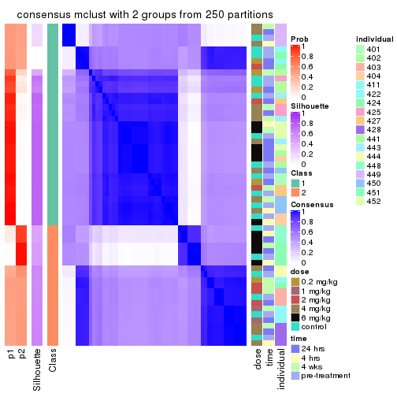</p>

</div>
<div id='tab-SD-mclust-consensus-heatmap-2'>
<pre><code class="r">consensus_heatmap(res, k = 3)
</code></pre>

<p>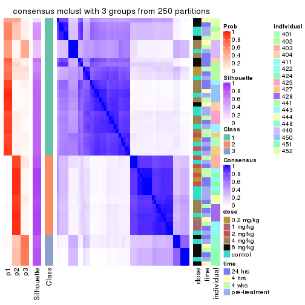</p>

</div>
<div id='tab-SD-mclust-consensus-heatmap-3'>
<pre><code class="r">consensus_heatmap(res, k = 4)
</code></pre>

<p>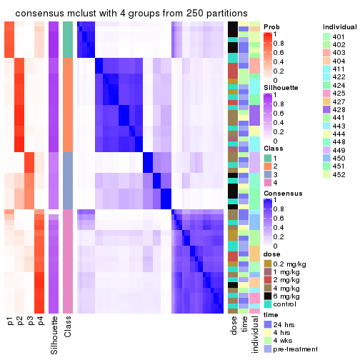</p>

</div>
<div id='tab-SD-mclust-consensus-heatmap-4'>
<pre><code class="r">consensus_heatmap(res, k = 5)
</code></pre>

<p>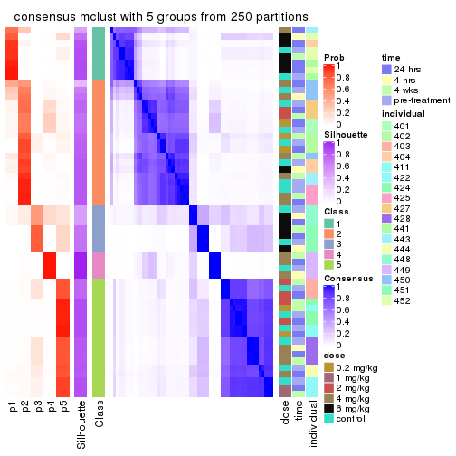</p>

</div>
<div id='tab-SD-mclust-consensus-heatmap-5'>
<pre><code class="r">consensus_heatmap(res, k = 6)
</code></pre>

<p>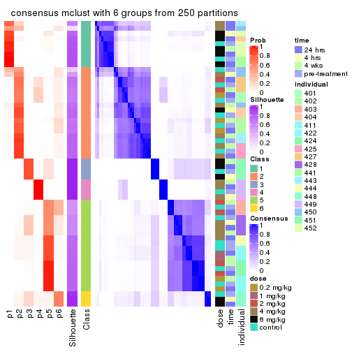</p>

</div>
</div>

Heatmaps for the membership of samples in all partitions to see how consistent they are:


<script>
$( function() {
	$( '#tabs-SD-mclust-membership-heatmap' ).tabs();
} );
</script>
<div id='tabs-SD-mclust-membership-heatmap'>
<ul>
<li><a href='#tab-SD-mclust-membership-heatmap-1'>k = 2</a></li>
<li><a href='#tab-SD-mclust-membership-heatmap-2'>k = 3</a></li>
<li><a href='#tab-SD-mclust-membership-heatmap-3'>k = 4</a></li>
<li><a href='#tab-SD-mclust-membership-heatmap-4'>k = 5</a></li>
<li><a href='#tab-SD-mclust-membership-heatmap-5'>k = 6</a></li>
</ul>
<div id='tab-SD-mclust-membership-heatmap-1'>
<pre><code class="r">membership_heatmap(res, k = 2)
</code></pre>

<p>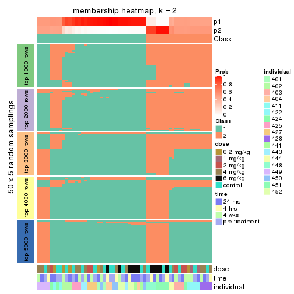</p>

</div>
<div id='tab-SD-mclust-membership-heatmap-2'>
<pre><code class="r">membership_heatmap(res, k = 3)
</code></pre>

<p>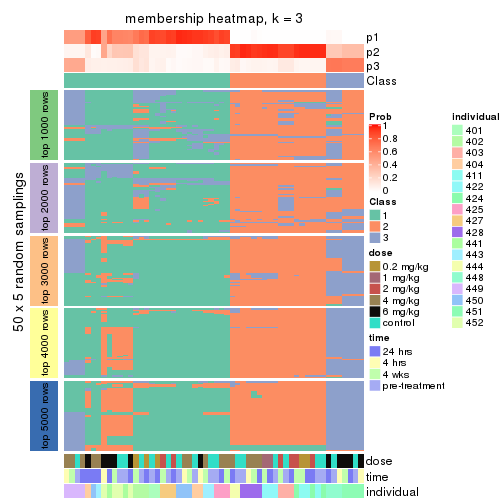</p>

</div>
<div id='tab-SD-mclust-membership-heatmap-3'>
<pre><code class="r">membership_heatmap(res, k = 4)
</code></pre>

<p>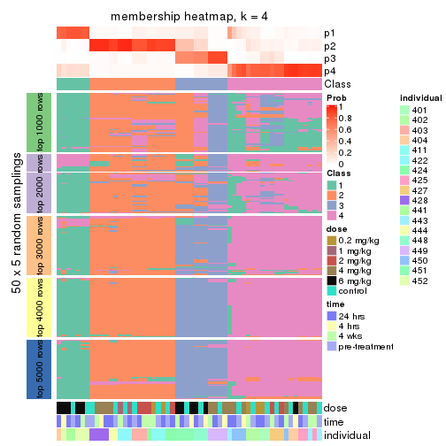</p>

</div>
<div id='tab-SD-mclust-membership-heatmap-4'>
<pre><code class="r">membership_heatmap(res, k = 5)
</code></pre>

<p>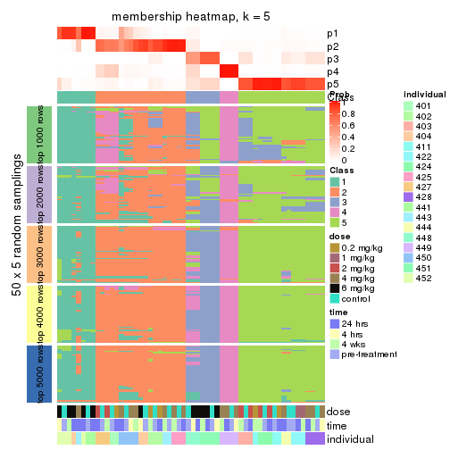</p>

</div>
<div id='tab-SD-mclust-membership-heatmap-5'>
<pre><code class="r">membership_heatmap(res, k = 6)
</code></pre>

<p>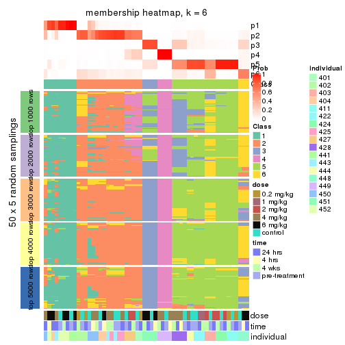</p>

</div>
</div>

As soon as we have had the classes for columns, we can look for signatures
which are significantly different between classes which can be candidate marks
for certain classes. Following are the heatmaps for signatures.


Signature heatmaps where rows are scaled:


<script>
$( function() {
	$( '#tabs-SD-mclust-get-signatures' ).tabs();
} );
</script>
<div id='tabs-SD-mclust-get-signatures'>
<ul>
<li><a href='#tab-SD-mclust-get-signatures-1'>k = 2</a></li>
<li><a href='#tab-SD-mclust-get-signatures-2'>k = 3</a></li>
<li><a href='#tab-SD-mclust-get-signatures-3'>k = 4</a></li>
<li><a href='#tab-SD-mclust-get-signatures-4'>k = 5</a></li>
<li><a href='#tab-SD-mclust-get-signatures-5'>k = 6</a></li>
</ul>
<div id='tab-SD-mclust-get-signatures-1'>
<pre><code class="r">get_signatures(res, k = 2)
</code></pre>

<p>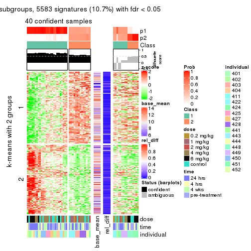</p>

</div>
<div id='tab-SD-mclust-get-signatures-2'>
<pre><code class="r">get_signatures(res, k = 3)
</code></pre>

<p>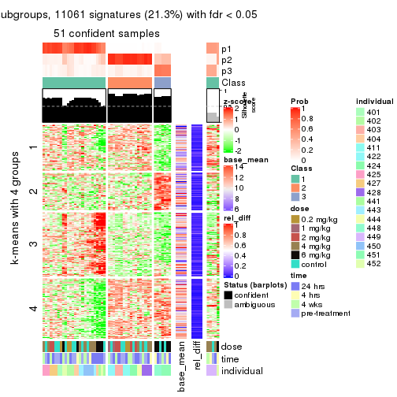</p>

</div>
<div id='tab-SD-mclust-get-signatures-3'>
<pre><code class="r">get_signatures(res, k = 4)
</code></pre>

<p>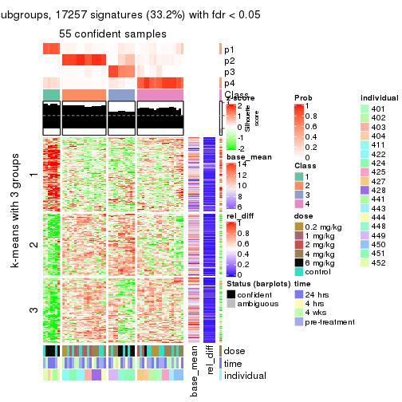</p>

</div>
<div id='tab-SD-mclust-get-signatures-4'>
<pre><code class="r">get_signatures(res, k = 5)
</code></pre>

<p>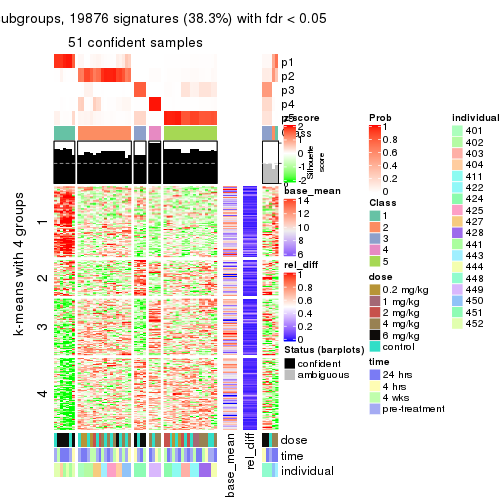</p>

</div>
<div id='tab-SD-mclust-get-signatures-5'>
<pre><code class="r">get_signatures(res, k = 6)
</code></pre>

<p></p>

</div>
</div>


Signature heatmaps where rows are not scaled:


<script>
$( function() {
	$( '#tabs-SD-mclust-get-signatures-no-scale' ).tabs();
} );
</script>
<div id='tabs-SD-mclust-get-signatures-no-scale'>
<ul>
<li><a href='#tab-SD-mclust-get-signatures-no-scale-1'>k = 2</a></li>
<li><a href='#tab-SD-mclust-get-signatures-no-scale-2'>k = 3</a></li>
<li><a href='#tab-SD-mclust-get-signatures-no-scale-3'>k = 4</a></li>
<li><a href='#tab-SD-mclust-get-signatures-no-scale-4'>k = 5</a></li>
<li><a href='#tab-SD-mclust-get-signatures-no-scale-5'>k = 6</a></li>
</ul>
<div id='tab-SD-mclust-get-signatures-no-scale-1'>
<pre><code class="r">get_signatures(res, k = 2, scale_rows = FALSE)
</code></pre>

<p>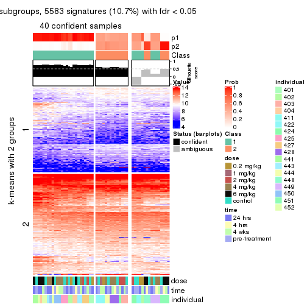</p>

</div>
<div id='tab-SD-mclust-get-signatures-no-scale-2'>
<pre><code class="r">get_signatures(res, k = 3, scale_rows = FALSE)
</code></pre>

<p>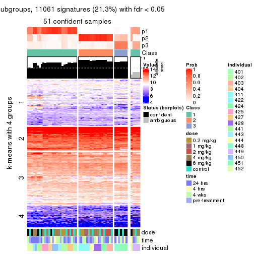</p>

</div>
<div id='tab-SD-mclust-get-signatures-no-scale-3'>
<pre><code class="r">get_signatures(res, k = 4, scale_rows = FALSE)
</code></pre>

<p>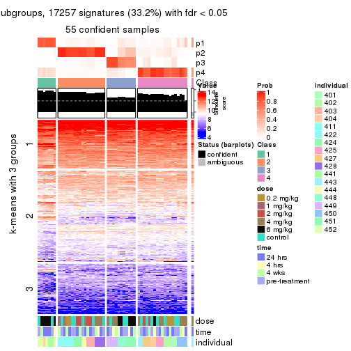</p>

</div>
<div id='tab-SD-mclust-get-signatures-no-scale-4'>
<pre><code class="r">get_signatures(res, k = 5, scale_rows = FALSE)
</code></pre>

<p>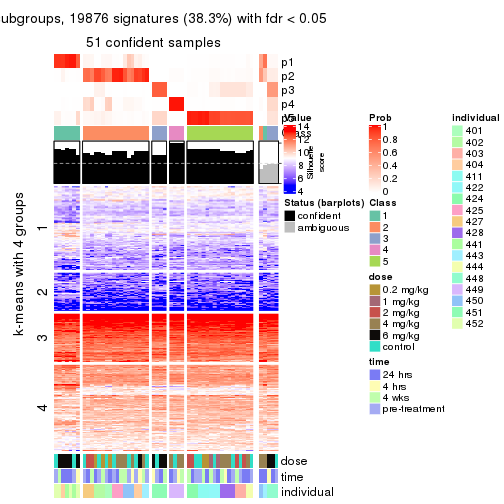</p>

</div>
<div id='tab-SD-mclust-get-signatures-no-scale-5'>
<pre><code class="r">get_signatures(res, k = 6, scale_rows = FALSE)
</code></pre>

<p>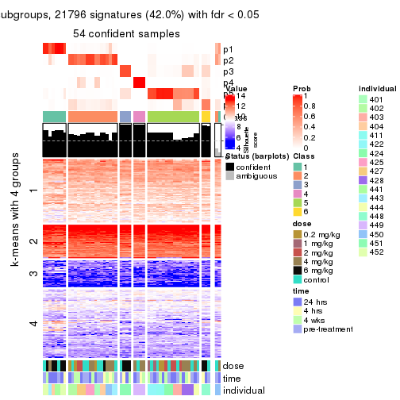</p>

</div>
</div>


Compare the overlap of signatures from different k:

```r
compare_signatures(res)
```

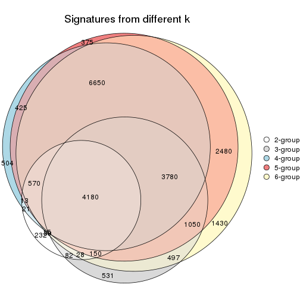

`get_signature()` returns a data frame invisibly. TO get the list of signatures, the function
call should be assigned to a variable explicitly. In following code, if `plot` argument is set
to `FALSE`, no heatmap is plotted while only the differential analysis is performed.

```r
# code only for demonstration
tb = get_signature(res, k = ..., plot = FALSE)
```

An example of the output of `tb` is:

```
#>   which_row         fdr    mean_1    mean_2 scaled_mean_1 scaled_mean_2 km
#> 1        38 0.042760348  8.373488  9.131774    -0.5533452     0.5164555  1
#> 2        40 0.018707592  7.106213  8.469186    -0.6173731     0.5762149  1
#> 3        55 0.019134737 10.221463 11.207825    -0.6159697     0.5749050  1
#> 4        59 0.006059896  5.921854  7.869574    -0.6899429     0.6439467  1
#> 5        60 0.018055526  8.928898 10.211722    -0.6204761     0.5791110  1
#> 6        98 0.009384629 15.714769 14.887706     0.6635654    -0.6193277  2
...
```

The columns in `tb` are:

1. `which_row`: row indices corresponding to the input matrix.
2. `fdr`: FDR for the differential test. 
3. `mean_x`: The mean value in group x.
4. `scaled_mean_x`: The mean value in group x after rows are scaled.
5. `km`: Row groups if k-means clustering is applied to rows.


UMAP plot which shows how samples are separated.


<script>
$( function() {
	$( '#tabs-SD-mclust-dimension-reduction' ).tabs();
} );
</script>
<div id='tabs-SD-mclust-dimension-reduction'>
<ul>
<li><a href='#tab-SD-mclust-dimension-reduction-1'>k = 2</a></li>
<li><a href='#tab-SD-mclust-dimension-reduction-2'>k = 3</a></li>
<li><a href='#tab-SD-mclust-dimension-reduction-3'>k = 4</a></li>
<li><a href='#tab-SD-mclust-dimension-reduction-4'>k = 5</a></li>
<li><a href='#tab-SD-mclust-dimension-reduction-5'>k = 6</a></li>
</ul>
<div id='tab-SD-mclust-dimension-reduction-1'>
<pre><code class="r">dimension_reduction(res, k = 2, method = &quot;UMAP&quot;)
</code></pre>

<p>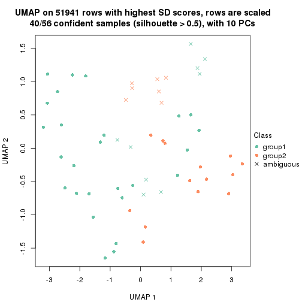</p>

</div>
<div id='tab-SD-mclust-dimension-reduction-2'>
<pre><code class="r">dimension_reduction(res, k = 3, method = &quot;UMAP&quot;)
</code></pre>

<p>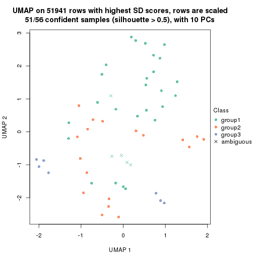</p>

</div>
<div id='tab-SD-mclust-dimension-reduction-3'>
<pre><code class="r">dimension_reduction(res, k = 4, method = &quot;UMAP&quot;)
</code></pre>

<p>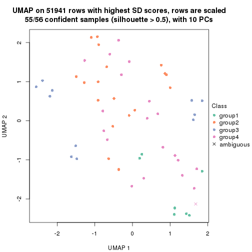</p>

</div>
<div id='tab-SD-mclust-dimension-reduction-4'>
<pre><code class="r">dimension_reduction(res, k = 5, method = &quot;UMAP&quot;)
</code></pre>

<p>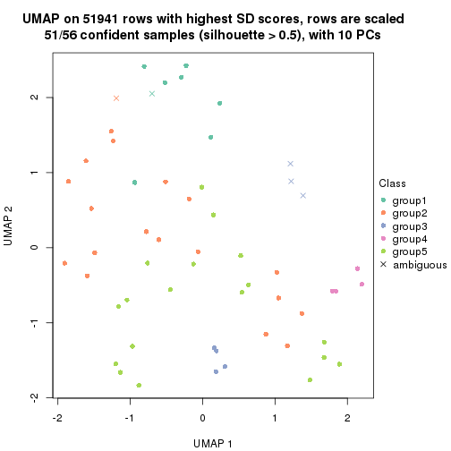</p>

</div>
<div id='tab-SD-mclust-dimension-reduction-5'>
<pre><code class="r">dimension_reduction(res, k = 6, method = &quot;UMAP&quot;)
</code></pre>

<p>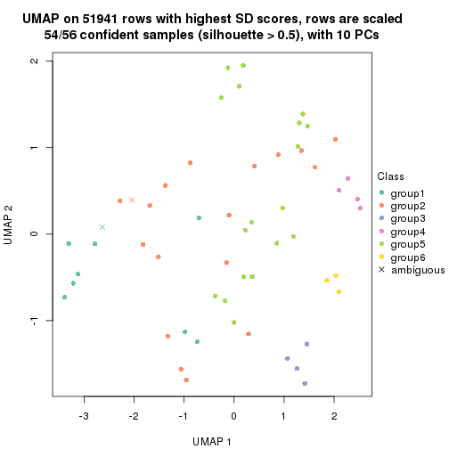</p>

</div>
</div>


Following heatmap shows how subgroups are split when increasing `k`:

```r
collect_classes(res)
```

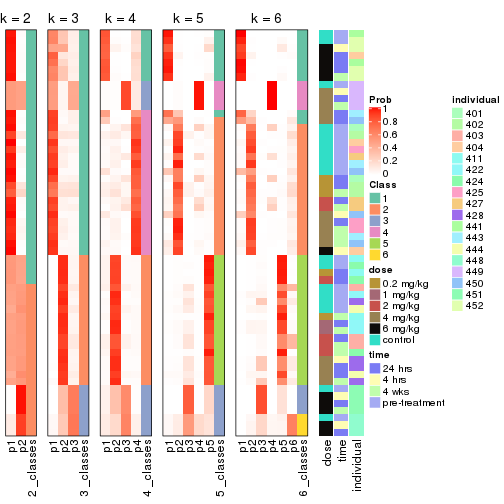


Test correlation between subgroups and known annotations. If the known
annotation is numeric, one-way ANOVA test is applied, and if the known
annotation is discrete, chi-squared contingency table test is applied.

```r
test_to_known_factors(res)
```

```
#>            n dose(p) time(p) individual(p) k
#> SD:mclust 40 0.13390   0.713      2.55e-04 2
#> SD:mclust 51 0.01335   0.747      3.12e-09 3
#> SD:mclust 55 0.00685   0.911      7.52e-13 4
#> SD:mclust 51 0.00330   0.991      1.69e-15 5
#> SD:mclust 54 0.02629   0.983      3.80e-19 6
```


If matrix rows can be associated to genes, consider to use `functional_enrichment(res,
...)` to perform function enrichment for the signature genes. See [this vignette](http://bioconductor.org/packages/devel/bioc/vignettes/cola/inst/doc/functional_enrichment.html) for more detailed explanations.


 

---------------------------------------------------


### SD:NMF


The object with results only for a single top-value method and a single partition method 
can be extracted as:

```r
res = res_list["SD", "NMF"]
# you can also extract it by
# res = res_list["SD:NMF"]
```

A summary of `res` and all the functions that can be applied to it:

```r
res
```

```
#> A 'ConsensusPartition' object with k = 2, 3, 4, 5, 6.
#>   On a matrix with 51941 rows and 56 columns.
#>   Top rows (1000, 2000, 3000, 4000, 5000) are extracted by 'SD' method.
#>   Subgroups are detected by 'NMF' method.
#>   Performed in total 1250 partitions by row resampling.
#>   Best k for subgroups seems to be 2.
#> 
#> Following methods can be applied to this 'ConsensusPartition' object:
#>  [1] "cola_report"             "collect_classes"         "collect_plots"          
#>  [4] "collect_stats"           "colnames"                "compare_signatures"     
#>  [7] "consensus_heatmap"       "dimension_reduction"     "functional_enrichment"  
#> [10] "get_anno_col"            "get_anno"                "get_classes"            
#> [13] "get_consensus"           "get_matrix"              "get_membership"         
#> [16] "get_param"               "get_signatures"          "get_stats"              
#> [19] "is_best_k"               "is_stable_k"             "membership_heatmap"     
#> [22] "ncol"                    "nrow"                    "plot_ecdf"              
#> [25] "rownames"                "select_partition_number" "show"                   
#> [28] "suggest_best_k"          "test_to_known_factors"
```

`collect_plots()` function collects all the plots made from `res` for all `k` (number of partitions)
into one single page to provide an easy and fast comparison between different `k`.

```r
collect_plots(res)
```

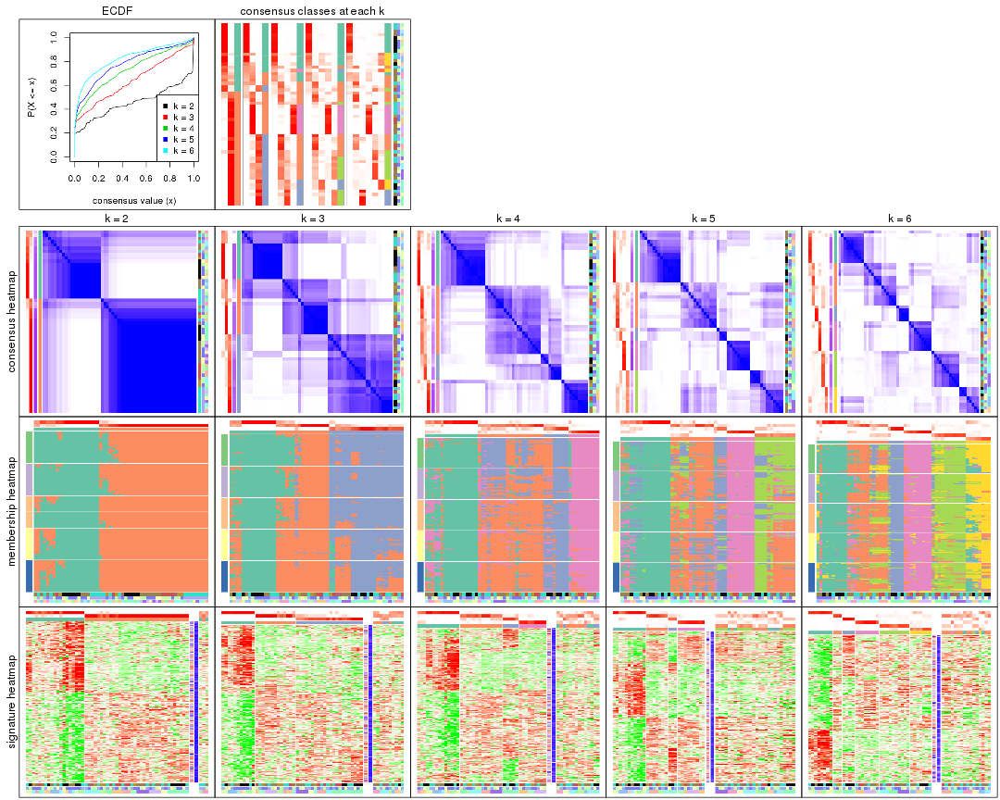

The plots are:

- The first row: a plot of the ECDF (empirical cumulative distribution
  function) curves of the consensus matrix for each `k` and the heatmap of
  predicted classes for each `k`.
- The second row: heatmaps of the consensus matrix for each `k`.
- The third row: heatmaps of the membership matrix for each `k`.
- The fouth row: heatmaps of the signatures for each `k`.

All the plots in panels can be made by individual functions and they are
plotted later in this section.

`select_partition_number()` produces several plots showing different
statistics for choosing "optimized" `k`. There are following statistics:

- ECDF curves of the consensus matrix for each `k`;
- 1-PAC. [The PAC
  score](https://en.wikipedia.org/wiki/Consensus_clustering#Over-interpretation_potential_of_consensus_clustering)
  measures the proportion of the ambiguous subgrouping.
- Mean silhouette score.
- Concordance. The mean probability of fiting the consensus class ids in all
  partitions.
- Area increased. Denote $A_k$ as the area under the ECDF curve for current
  `k`, the area increased is defined as $A_k - A_{k-1}$.
- Rand index. The percent of pairs of samples that are both in a same cluster
  or both are not in a same cluster in the partition of k and k-1.
- Jaccard index. The ratio of pairs of samples are both in a same cluster in
  the partition of k and k-1 and the pairs of samples are both in a same
  cluster in the partition k or k-1.

The detailed explanations of these statistics can be found in [the _cola_
vignette](http://bioconductor.org/packages/devel/bioc/vignettes/cola/inst/doc/cola.html#toc_13).

Generally speaking, lower PAC score, higher mean silhouette score or higher
concordance corresponds to better partition. Rand index and Jaccard index
measure how similar the current partition is compared to partition with `k-1`.
If they are too similar, we won't accept `k` is better than `k-1`.

```r
select_partition_number(res)
```

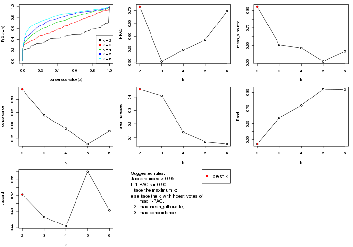

The numeric values for all these statistics can be obtained by `get_stats()`.

```r
get_stats(res)
```

```
#>   k 1-PAC mean_silhouette concordance area_increased  Rand Jaccard
#> 2 2 0.715           0.870       0.941         0.4569 0.523   0.523
#> 3 3 0.502           0.654       0.839         0.4094 0.688   0.467
#> 4 4 0.547           0.636       0.787         0.1393 0.766   0.444
#> 5 5 0.587           0.558       0.728         0.0705 0.870   0.579
#> 6 6 0.699           0.615       0.777         0.0543 0.868   0.483
```

`suggest_best_k()` suggests the best $k$ based on these statistics. The rules are as follows:

- All $k$ with Jaccard index larger than 0.95 are removed because increasing
  $k$ does not provide enough extra information. If all $k$ are removed, it is
  marked as no subgroup is detected.
- For all $k$ with 1-PAC score larger than 0.9, the maximal $k$ is taken as
  the best $k$, and other $k$ are marked as optional $k$.
- If it does not fit the second rule. The $k$ with the maximal vote of the
  highest 1-PAC score, highest mean silhouette, and highest concordance is
  taken as the best $k$.

```r
suggest_best_k(res)
```

```
#> [1] 2
```


Following shows the table of the partitions (You need to click the **show/hide
code output** link to see it). The membership matrix (columns with name `p*`)
is inferred by
[`clue::cl_consensus()`](https://www.rdocumentation.org/link/cl_consensus?package=clue)
function with the `SE` method. Basically the value in the membership matrix
represents the probability to belong to a certain group. The finall class
label for an item is determined with the group with highest probability it
belongs to.

In `get_classes()` function, the entropy is calculated from the membership
matrix and the silhouette score is calculated from the consensus matrix.


<script>
$( function() {
	$( '#tabs-SD-NMF-get-classes' ).tabs();
} );
</script>
<div id='tabs-SD-NMF-get-classes'>
<ul>
<li><a href='#tab-SD-NMF-get-classes-1'>k = 2</a></li>
<li><a href='#tab-SD-NMF-get-classes-2'>k = 3</a></li>
<li><a href='#tab-SD-NMF-get-classes-3'>k = 4</a></li>
<li><a href='#tab-SD-NMF-get-classes-4'>k = 5</a></li>
<li><a href='#tab-SD-NMF-get-classes-5'>k = 6</a></li>
</ul>

<div id='tab-SD-NMF-get-classes-1'>
<p><a id='tab-SD-NMF-get-classes-1-a' style='color:#0366d6' href='#'>show/hide code output</a></p>
<pre><code class="r">cbind(get_classes(res, k = 2), get_membership(res, k = 2))
</code></pre>

<pre><code>#&gt;           class entropy silhouette    p1    p2
#&gt; GSM687644     2  0.0000      0.963 0.000 1.000
#&gt; GSM687648     1  0.9996      0.173 0.512 0.488
#&gt; GSM687653     2  0.0000      0.963 0.000 1.000
#&gt; GSM687658     1  0.6343      0.805 0.840 0.160
#&gt; GSM687663     2  0.4431      0.874 0.092 0.908
#&gt; GSM687668     2  0.0000      0.963 0.000 1.000
#&gt; GSM687673     2  0.7674      0.679 0.224 0.776
#&gt; GSM687678     2  0.9000      0.478 0.316 0.684
#&gt; GSM687683     2  0.0938      0.954 0.012 0.988
#&gt; GSM687688     2  0.0000      0.963 0.000 1.000
#&gt; GSM687695     1  0.0000      0.880 1.000 0.000
#&gt; GSM687699     1  0.8016      0.722 0.756 0.244
#&gt; GSM687704     2  0.0000      0.963 0.000 1.000
#&gt; GSM687707     2  0.0000      0.963 0.000 1.000
#&gt; GSM687712     2  0.0000      0.963 0.000 1.000
#&gt; GSM687719     1  0.0000      0.880 1.000 0.000
#&gt; GSM687724     2  0.0000      0.963 0.000 1.000
#&gt; GSM687728     1  0.0000      0.880 1.000 0.000
#&gt; GSM687646     2  0.0000      0.963 0.000 1.000
#&gt; GSM687649     2  0.8713      0.538 0.292 0.708
#&gt; GSM687665     1  0.4690      0.846 0.900 0.100
#&gt; GSM687651     2  0.3274      0.910 0.060 0.940
#&gt; GSM687667     2  0.0000      0.963 0.000 1.000
#&gt; GSM687670     2  0.0376      0.960 0.004 0.996
#&gt; GSM687671     2  0.0000      0.963 0.000 1.000
#&gt; GSM687654     2  0.0000      0.963 0.000 1.000
#&gt; GSM687675     1  0.4161      0.854 0.916 0.084
#&gt; GSM687685     2  0.3733      0.897 0.072 0.928
#&gt; GSM687656     2  0.0000      0.963 0.000 1.000
#&gt; GSM687677     2  0.0000      0.963 0.000 1.000
#&gt; GSM687687     2  0.0000      0.963 0.000 1.000
#&gt; GSM687692     2  0.0000      0.963 0.000 1.000
#&gt; GSM687716     2  0.0000      0.963 0.000 1.000
#&gt; GSM687722     1  0.0000      0.880 1.000 0.000
#&gt; GSM687680     1  0.8661      0.658 0.712 0.288
#&gt; GSM687690     2  0.0000      0.963 0.000 1.000
#&gt; GSM687700     1  0.0000      0.880 1.000 0.000
#&gt; GSM687705     2  0.0000      0.963 0.000 1.000
#&gt; GSM687714     2  0.0000      0.963 0.000 1.000
#&gt; GSM687721     1  0.0000      0.880 1.000 0.000
#&gt; GSM687682     1  0.9896      0.327 0.560 0.440
#&gt; GSM687694     2  0.0000      0.963 0.000 1.000
#&gt; GSM687702     1  0.8386      0.690 0.732 0.268
#&gt; GSM687718     2  0.0000      0.963 0.000 1.000
#&gt; GSM687723     1  0.5408      0.833 0.876 0.124
#&gt; GSM687661     1  0.2778      0.869 0.952 0.048
#&gt; GSM687710     2  0.0000      0.963 0.000 1.000
#&gt; GSM687726     2  0.0000      0.963 0.000 1.000
#&gt; GSM687730     1  0.0000      0.880 1.000 0.000
#&gt; GSM687660     1  0.0000      0.880 1.000 0.000
#&gt; GSM687697     1  0.0000      0.880 1.000 0.000
#&gt; GSM687709     2  0.0000      0.963 0.000 1.000
#&gt; GSM687725     2  0.0000      0.963 0.000 1.000
#&gt; GSM687729     1  0.0000      0.880 1.000 0.000
#&gt; GSM687727     2  0.0000      0.963 0.000 1.000
#&gt; GSM687731     1  0.0000      0.880 1.000 0.000
</code></pre>

<script>
$('#tab-SD-NMF-get-classes-1-a').parent().next().next().hide();
$('#tab-SD-NMF-get-classes-1-a').click(function(){
  $('#tab-SD-NMF-get-classes-1-a').parent().next().next().toggle();
  return(false);
});
</script>
</div>

<div id='tab-SD-NMF-get-classes-2'>
<p><a id='tab-SD-NMF-get-classes-2-a' style='color:#0366d6' href='#'>show/hide code output</a></p>
<pre><code class="r">cbind(get_classes(res, k = 3), get_membership(res, k = 3))
</code></pre>

<pre><code>#&gt;           class entropy silhouette    p1    p2    p3
#&gt; GSM687644     2  0.0237     0.7783 0.000 0.996 0.004
#&gt; GSM687648     2  0.6500     0.2383 0.464 0.532 0.004
#&gt; GSM687653     3  0.4002     0.7942 0.000 0.160 0.840
#&gt; GSM687658     1  0.6286    -0.0489 0.536 0.464 0.000
#&gt; GSM687663     3  0.2096     0.8028 0.004 0.052 0.944
#&gt; GSM687668     2  0.6298    -0.0486 0.004 0.608 0.388
#&gt; GSM687673     3  0.1289     0.7847 0.032 0.000 0.968
#&gt; GSM687678     2  0.5480     0.6060 0.264 0.732 0.004
#&gt; GSM687683     2  0.0000     0.7790 0.000 1.000 0.000
#&gt; GSM687688     3  0.5016     0.7372 0.000 0.240 0.760
#&gt; GSM687695     1  0.0000     0.8341 1.000 0.000 0.000
#&gt; GSM687699     1  0.6468    -0.0365 0.552 0.444 0.004
#&gt; GSM687704     3  0.3816     0.8028 0.000 0.148 0.852
#&gt; GSM687707     3  0.2448     0.7727 0.000 0.076 0.924
#&gt; GSM687712     2  0.0000     0.7790 0.000 1.000 0.000
#&gt; GSM687719     1  0.0237     0.8322 0.996 0.004 0.000
#&gt; GSM687724     3  0.0237     0.7864 0.000 0.004 0.996
#&gt; GSM687728     1  0.0000     0.8341 1.000 0.000 0.000
#&gt; GSM687646     2  0.0237     0.7783 0.000 0.996 0.004
#&gt; GSM687649     2  0.6307     0.5243 0.328 0.660 0.012
#&gt; GSM687665     3  0.5497     0.6197 0.292 0.000 0.708
#&gt; GSM687651     2  0.5075     0.7173 0.096 0.836 0.068
#&gt; GSM687667     3  0.4291     0.7843 0.000 0.180 0.820
#&gt; GSM687670     3  0.6305     0.3791 0.000 0.484 0.516
#&gt; GSM687671     3  0.6225     0.4779 0.000 0.432 0.568
#&gt; GSM687654     3  0.3879     0.7972 0.000 0.152 0.848
#&gt; GSM687675     3  0.5138     0.6629 0.252 0.000 0.748
#&gt; GSM687685     2  0.0000     0.7790 0.000 1.000 0.000
#&gt; GSM687656     3  0.4235     0.7874 0.000 0.176 0.824
#&gt; GSM687677     3  0.2356     0.8047 0.000 0.072 0.928
#&gt; GSM687687     2  0.0000     0.7790 0.000 1.000 0.000
#&gt; GSM687692     3  0.5760     0.6382 0.000 0.328 0.672
#&gt; GSM687716     2  0.0237     0.7774 0.000 0.996 0.004
#&gt; GSM687722     1  0.0424     0.8296 0.992 0.008 0.000
#&gt; GSM687680     2  0.6509     0.2061 0.472 0.524 0.004
#&gt; GSM687690     3  0.5968     0.5825 0.000 0.364 0.636
#&gt; GSM687700     1  0.0000     0.8341 1.000 0.000 0.000
#&gt; GSM687705     3  0.3686     0.8042 0.000 0.140 0.860
#&gt; GSM687714     2  0.0000     0.7790 0.000 1.000 0.000
#&gt; GSM687721     1  0.0000     0.8341 1.000 0.000 0.000
#&gt; GSM687682     2  0.6359     0.3872 0.404 0.592 0.004
#&gt; GSM687694     3  0.6140     0.5092 0.000 0.404 0.596
#&gt; GSM687702     2  0.5982     0.5239 0.328 0.668 0.004
#&gt; GSM687718     2  0.0237     0.7774 0.000 0.996 0.004
#&gt; GSM687723     1  0.6295    -0.0310 0.528 0.472 0.000
#&gt; GSM687661     1  0.5968     0.3050 0.636 0.364 0.000
#&gt; GSM687710     3  0.4504     0.6985 0.000 0.196 0.804
#&gt; GSM687726     3  0.0237     0.7864 0.000 0.004 0.996
#&gt; GSM687730     1  0.0237     0.8317 0.996 0.000 0.004
#&gt; GSM687660     1  0.0000     0.8341 1.000 0.000 0.000
#&gt; GSM687697     1  0.0000     0.8341 1.000 0.000 0.000
#&gt; GSM687709     3  0.4062     0.7207 0.000 0.164 0.836
#&gt; GSM687725     3  0.0237     0.7864 0.000 0.004 0.996
#&gt; GSM687729     1  0.0000     0.8341 1.000 0.000 0.000
#&gt; GSM687727     3  0.0237     0.7864 0.000 0.004 0.996
#&gt; GSM687731     1  0.0000     0.8341 1.000 0.000 0.000
</code></pre>

<script>
$('#tab-SD-NMF-get-classes-2-a').parent().next().next().hide();
$('#tab-SD-NMF-get-classes-2-a').click(function(){
  $('#tab-SD-NMF-get-classes-2-a').parent().next().next().toggle();
  return(false);
});
</script>
</div>

<div id='tab-SD-NMF-get-classes-3'>
<p><a id='tab-SD-NMF-get-classes-3-a' style='color:#0366d6' href='#'>show/hide code output</a></p>
<pre><code class="r">cbind(get_classes(res, k = 4), get_membership(res, k = 4))
</code></pre>

<pre><code>#&gt;           class entropy silhouette    p1    p2    p3    p4
#&gt; GSM687644     4  0.2921      0.785 0.000 0.140 0.000 0.860
#&gt; GSM687648     2  0.5433      0.409 0.220 0.720 0.004 0.056
#&gt; GSM687653     2  0.0817      0.612 0.000 0.976 0.024 0.000
#&gt; GSM687658     1  0.5382      0.666 0.728 0.012 0.040 0.220
#&gt; GSM687663     2  0.3791      0.605 0.000 0.796 0.200 0.004
#&gt; GSM687668     2  0.7516      0.480 0.004 0.524 0.244 0.228
#&gt; GSM687673     2  0.4891      0.600 0.012 0.680 0.308 0.000
#&gt; GSM687678     2  0.7212      0.203 0.160 0.516 0.000 0.324
#&gt; GSM687683     4  0.1004      0.887 0.000 0.024 0.004 0.972
#&gt; GSM687688     2  0.5322      0.600 0.000 0.660 0.312 0.028
#&gt; GSM687695     1  0.0336      0.844 0.992 0.000 0.008 0.000
#&gt; GSM687699     1  0.6222      0.247 0.532 0.412 0.000 0.056
#&gt; GSM687704     2  0.6010      0.227 0.000 0.488 0.472 0.040
#&gt; GSM687707     3  0.5790      0.504 0.000 0.340 0.616 0.044
#&gt; GSM687712     4  0.0000      0.883 0.000 0.000 0.000 1.000
#&gt; GSM687719     1  0.1639      0.834 0.952 0.004 0.036 0.008
#&gt; GSM687724     3  0.2081      0.673 0.000 0.084 0.916 0.000
#&gt; GSM687728     1  0.0000      0.844 1.000 0.000 0.000 0.000
#&gt; GSM687646     4  0.2345      0.834 0.000 0.100 0.000 0.900
#&gt; GSM687649     2  0.4339      0.525 0.064 0.832 0.012 0.092
#&gt; GSM687665     2  0.4843      0.587 0.112 0.784 0.104 0.000
#&gt; GSM687651     2  0.4686      0.458 0.016 0.780 0.020 0.184
#&gt; GSM687667     2  0.2593      0.645 0.000 0.892 0.104 0.004
#&gt; GSM687670     2  0.7153      0.494 0.000 0.532 0.308 0.160
#&gt; GSM687671     2  0.5775      0.637 0.000 0.696 0.212 0.092
#&gt; GSM687654     2  0.1022      0.608 0.000 0.968 0.032 0.000
#&gt; GSM687675     2  0.7064      0.392 0.164 0.556 0.280 0.000
#&gt; GSM687685     4  0.1022      0.885 0.000 0.032 0.000 0.968
#&gt; GSM687656     2  0.0895      0.617 0.000 0.976 0.020 0.004
#&gt; GSM687677     2  0.4401      0.615 0.000 0.724 0.272 0.004
#&gt; GSM687687     4  0.1389      0.877 0.000 0.048 0.000 0.952
#&gt; GSM687692     2  0.5472      0.617 0.000 0.676 0.280 0.044
#&gt; GSM687716     4  0.0188      0.885 0.000 0.004 0.000 0.996
#&gt; GSM687722     1  0.1492      0.835 0.956 0.004 0.036 0.004
#&gt; GSM687680     1  0.6373      0.535 0.636 0.116 0.000 0.248
#&gt; GSM687690     2  0.5742      0.616 0.000 0.664 0.276 0.060
#&gt; GSM687700     1  0.0188      0.844 0.996 0.004 0.000 0.000
#&gt; GSM687705     3  0.4401      0.328 0.000 0.272 0.724 0.004
#&gt; GSM687714     4  0.0188      0.880 0.000 0.000 0.004 0.996
#&gt; GSM687721     1  0.0844      0.842 0.980 0.004 0.012 0.004
#&gt; GSM687682     1  0.7474      0.326 0.500 0.220 0.000 0.280
#&gt; GSM687694     2  0.5478      0.633 0.000 0.696 0.248 0.056
#&gt; GSM687702     1  0.7270      0.419 0.548 0.168 0.004 0.280
#&gt; GSM687718     4  0.0188      0.885 0.000 0.004 0.000 0.996
#&gt; GSM687723     4  0.6934      0.055 0.384 0.012 0.080 0.524
#&gt; GSM687661     1  0.4666      0.703 0.768 0.004 0.028 0.200
#&gt; GSM687710     3  0.7175      0.437 0.000 0.360 0.496 0.144
#&gt; GSM687726     3  0.2081      0.673 0.000 0.084 0.916 0.000
#&gt; GSM687730     1  0.0469      0.842 0.988 0.000 0.012 0.000
#&gt; GSM687660     1  0.0336      0.844 0.992 0.000 0.008 0.000
#&gt; GSM687697     1  0.0188      0.844 0.996 0.000 0.004 0.000
#&gt; GSM687709     3  0.6897      0.480 0.000 0.332 0.544 0.124
#&gt; GSM687725     3  0.2011      0.673 0.000 0.080 0.920 0.000
#&gt; GSM687729     1  0.0336      0.843 0.992 0.000 0.008 0.000
#&gt; GSM687727     3  0.2345      0.660 0.000 0.100 0.900 0.000
#&gt; GSM687731     1  0.0000      0.844 1.000 0.000 0.000 0.000
</code></pre>

<script>
$('#tab-SD-NMF-get-classes-3-a').parent().next().next().hide();
$('#tab-SD-NMF-get-classes-3-a').click(function(){
  $('#tab-SD-NMF-get-classes-3-a').parent().next().next().toggle();
  return(false);
});
</script>
</div>

<div id='tab-SD-NMF-get-classes-4'>
<p><a id='tab-SD-NMF-get-classes-4-a' style='color:#0366d6' href='#'>show/hide code output</a></p>
<pre><code class="r">cbind(get_classes(res, k = 5), get_membership(res, k = 5))
</code></pre>

<pre><code>#&gt;           class entropy silhouette    p1    p2    p3    p4    p5
#&gt; GSM687644     4  0.2935     0.8307 0.000 0.120 0.016 0.860 0.004
#&gt; GSM687648     2  0.4391     0.5155 0.116 0.800 0.056 0.020 0.008
#&gt; GSM687653     2  0.1399     0.6033 0.000 0.952 0.028 0.000 0.020
#&gt; GSM687658     1  0.6540     0.4345 0.576 0.008 0.252 0.148 0.016
#&gt; GSM687663     2  0.5243     0.3703 0.004 0.684 0.104 0.000 0.208
#&gt; GSM687668     5  0.6335     0.3784 0.000 0.284 0.004 0.176 0.536
#&gt; GSM687673     2  0.6432     0.0510 0.004 0.468 0.156 0.000 0.372
#&gt; GSM687678     2  0.6907     0.2879 0.116 0.540 0.024 0.300 0.020
#&gt; GSM687683     4  0.0324     0.9410 0.000 0.000 0.004 0.992 0.004
#&gt; GSM687688     5  0.5116     0.4340 0.000 0.304 0.004 0.052 0.640
#&gt; GSM687695     1  0.0000     0.7894 1.000 0.000 0.000 0.000 0.000
#&gt; GSM687699     2  0.5442     0.2242 0.396 0.560 0.020 0.012 0.012
#&gt; GSM687704     5  0.6324     0.1750 0.000 0.388 0.104 0.016 0.492
#&gt; GSM687707     3  0.4111     0.7420 0.000 0.216 0.756 0.016 0.012
#&gt; GSM687712     4  0.0404     0.9433 0.000 0.000 0.012 0.988 0.000
#&gt; GSM687719     1  0.3583     0.6676 0.792 0.000 0.192 0.004 0.012
#&gt; GSM687724     5  0.4444     0.3138 0.000 0.012 0.364 0.000 0.624
#&gt; GSM687728     1  0.0162     0.7891 0.996 0.004 0.000 0.000 0.000
#&gt; GSM687646     4  0.1901     0.9076 0.000 0.056 0.012 0.928 0.004
#&gt; GSM687649     2  0.3210     0.5766 0.024 0.880 0.056 0.028 0.012
#&gt; GSM687665     2  0.5281     0.5172 0.124 0.728 0.032 0.000 0.116
#&gt; GSM687651     2  0.4346     0.4117 0.004 0.768 0.184 0.032 0.012
#&gt; GSM687667     2  0.3412     0.5043 0.000 0.820 0.028 0.000 0.152
#&gt; GSM687670     5  0.5811     0.4348 0.000 0.272 0.004 0.120 0.604
#&gt; GSM687671     5  0.5974     0.3207 0.000 0.380 0.004 0.100 0.516
#&gt; GSM687654     2  0.1830     0.6026 0.000 0.932 0.040 0.000 0.028
#&gt; GSM687675     2  0.8227     0.1213 0.184 0.364 0.148 0.000 0.304
#&gt; GSM687685     4  0.1443     0.9148 0.000 0.004 0.004 0.948 0.044
#&gt; GSM687656     2  0.1300     0.6013 0.000 0.956 0.016 0.000 0.028
#&gt; GSM687677     2  0.5766     0.0179 0.000 0.516 0.092 0.000 0.392
#&gt; GSM687687     4  0.1377     0.9264 0.000 0.020 0.004 0.956 0.020
#&gt; GSM687692     5  0.5789     0.4421 0.004 0.296 0.008 0.084 0.608
#&gt; GSM687716     4  0.0404     0.9435 0.000 0.000 0.012 0.988 0.000
#&gt; GSM687722     1  0.4335     0.5775 0.708 0.000 0.268 0.004 0.020
#&gt; GSM687680     1  0.6550     0.4812 0.608 0.124 0.016 0.228 0.024
#&gt; GSM687690     5  0.5691     0.4401 0.004 0.300 0.004 0.084 0.608
#&gt; GSM687700     1  0.0324     0.7891 0.992 0.004 0.004 0.000 0.000
#&gt; GSM687705     5  0.5679     0.4154 0.000 0.152 0.172 0.012 0.664
#&gt; GSM687714     4  0.0510     0.9419 0.000 0.000 0.016 0.984 0.000
#&gt; GSM687721     1  0.1484     0.7705 0.944 0.000 0.048 0.000 0.008
#&gt; GSM687682     1  0.7659     0.3011 0.484 0.188 0.020 0.264 0.044
#&gt; GSM687694     5  0.5916     0.4077 0.004 0.328 0.008 0.084 0.576
#&gt; GSM687702     1  0.7127     0.3363 0.504 0.168 0.024 0.292 0.012
#&gt; GSM687718     4  0.0609     0.9391 0.000 0.000 0.020 0.980 0.000
#&gt; GSM687723     3  0.7310     0.2403 0.216 0.004 0.444 0.308 0.028
#&gt; GSM687661     1  0.6274     0.4876 0.604 0.004 0.204 0.176 0.012
#&gt; GSM687710     3  0.4436     0.7486 0.000 0.224 0.736 0.028 0.012
#&gt; GSM687726     5  0.4430     0.3179 0.000 0.012 0.360 0.000 0.628
#&gt; GSM687730     1  0.1211     0.7753 0.960 0.000 0.024 0.000 0.016
#&gt; GSM687660     1  0.0162     0.7890 0.996 0.000 0.004 0.000 0.000
#&gt; GSM687697     1  0.0000     0.7894 1.000 0.000 0.000 0.000 0.000
#&gt; GSM687709     3  0.4406     0.7507 0.000 0.220 0.740 0.028 0.012
#&gt; GSM687725     5  0.4354     0.3115 0.000 0.008 0.368 0.000 0.624
#&gt; GSM687729     1  0.0162     0.7892 0.996 0.000 0.004 0.000 0.000
#&gt; GSM687727     5  0.4268     0.3296 0.000 0.008 0.344 0.000 0.648
#&gt; GSM687731     1  0.0162     0.7891 0.996 0.004 0.000 0.000 0.000
</code></pre>

<script>
$('#tab-SD-NMF-get-classes-4-a').parent().next().next().hide();
$('#tab-SD-NMF-get-classes-4-a').click(function(){
  $('#tab-SD-NMF-get-classes-4-a').parent().next().next().toggle();
  return(false);
});
</script>
</div>

<div id='tab-SD-NMF-get-classes-5'>
<p><a id='tab-SD-NMF-get-classes-5-a' style='color:#0366d6' href='#'>show/hide code output</a></p>
<pre><code class="r">cbind(get_classes(res, k = 6), get_membership(res, k = 6))
</code></pre>

<pre><code>#&gt;           class entropy silhouette    p1    p2    p3    p4    p5    p6
#&gt; GSM687644     4  0.3782     0.4838 0.000 0.360 0.000 0.636 0.004 0.000
#&gt; GSM687648     2  0.3128     0.5699 0.084 0.860 0.000 0.020 0.020 0.016
#&gt; GSM687653     2  0.4544     0.4479 0.000 0.668 0.000 0.000 0.256 0.076
#&gt; GSM687658     6  0.5510     0.6295 0.228 0.004 0.000 0.064 0.060 0.644
#&gt; GSM687663     2  0.7276     0.2459 0.012 0.400 0.292 0.000 0.224 0.072
#&gt; GSM687668     5  0.3525     0.7495 0.008 0.060 0.004 0.072 0.840 0.016
#&gt; GSM687673     5  0.4489     0.6466 0.012 0.068 0.000 0.000 0.712 0.208
#&gt; GSM687678     2  0.5507     0.3661 0.180 0.596 0.000 0.216 0.000 0.008
#&gt; GSM687683     4  0.2803     0.8058 0.000 0.012 0.000 0.872 0.052 0.064
#&gt; GSM687688     5  0.3298     0.7456 0.000 0.044 0.064 0.020 0.856 0.016
#&gt; GSM687695     1  0.0405     0.8251 0.988 0.000 0.000 0.000 0.004 0.008
#&gt; GSM687699     2  0.4427     0.4057 0.284 0.676 0.000 0.016 0.016 0.008
#&gt; GSM687704     5  0.7497     0.0360 0.000 0.196 0.316 0.020 0.380 0.088
#&gt; GSM687707     6  0.2964     0.5759 0.000 0.108 0.040 0.004 0.000 0.848
#&gt; GSM687712     4  0.0260     0.8858 0.000 0.000 0.000 0.992 0.000 0.008
#&gt; GSM687719     6  0.5648     0.3140 0.448 0.016 0.000 0.008 0.072 0.456
#&gt; GSM687724     3  0.0260     0.8688 0.000 0.000 0.992 0.000 0.008 0.000
#&gt; GSM687728     1  0.1375     0.8254 0.952 0.028 0.008 0.000 0.004 0.008
#&gt; GSM687646     4  0.2738     0.7616 0.000 0.176 0.000 0.820 0.004 0.000
#&gt; GSM687649     2  0.2608     0.5766 0.044 0.896 0.000 0.020 0.028 0.012
#&gt; GSM687665     2  0.7860     0.3772 0.148 0.436 0.112 0.000 0.240 0.064
#&gt; GSM687651     2  0.2176     0.5575 0.024 0.916 0.000 0.020 0.004 0.036
#&gt; GSM687667     2  0.6173     0.3031 0.000 0.524 0.088 0.000 0.316 0.072
#&gt; GSM687670     5  0.3344     0.7592 0.016 0.040 0.008 0.036 0.864 0.036
#&gt; GSM687671     5  0.2886     0.7564 0.000 0.076 0.008 0.032 0.872 0.012
#&gt; GSM687654     2  0.4680     0.4365 0.000 0.652 0.000 0.000 0.264 0.084
#&gt; GSM687675     5  0.5587     0.5911 0.064 0.060 0.012 0.000 0.656 0.208
#&gt; GSM687685     4  0.2151     0.8533 0.000 0.016 0.000 0.912 0.048 0.024
#&gt; GSM687656     2  0.4516     0.4468 0.000 0.668 0.000 0.000 0.260 0.072
#&gt; GSM687677     5  0.3906     0.6859 0.000 0.088 0.012 0.000 0.788 0.112
#&gt; GSM687687     4  0.1176     0.8781 0.000 0.024 0.000 0.956 0.020 0.000
#&gt; GSM687692     5  0.3140     0.7501 0.000 0.036 0.052 0.028 0.868 0.016
#&gt; GSM687716     4  0.0520     0.8849 0.000 0.000 0.000 0.984 0.008 0.008
#&gt; GSM687722     6  0.5716     0.5087 0.344 0.016 0.000 0.008 0.092 0.540
#&gt; GSM687680     1  0.6276    -0.0294 0.424 0.324 0.000 0.240 0.000 0.012
#&gt; GSM687690     5  0.3041     0.7552 0.004 0.040 0.048 0.016 0.876 0.016
#&gt; GSM687700     1  0.1620     0.8076 0.940 0.024 0.000 0.000 0.012 0.024
#&gt; GSM687705     3  0.6092     0.1933 0.004 0.044 0.508 0.032 0.380 0.032
#&gt; GSM687714     4  0.0260     0.8855 0.000 0.000 0.000 0.992 0.000 0.008
#&gt; GSM687721     1  0.4604     0.3562 0.700 0.016 0.000 0.000 0.064 0.220
#&gt; GSM687682     2  0.6370     0.0610 0.372 0.416 0.000 0.192 0.008 0.012
#&gt; GSM687694     5  0.2732     0.7627 0.000 0.036 0.028 0.024 0.892 0.020
#&gt; GSM687702     2  0.6954     0.1100 0.300 0.396 0.000 0.260 0.020 0.024
#&gt; GSM687718     4  0.0363     0.8850 0.000 0.000 0.000 0.988 0.000 0.012
#&gt; GSM687723     6  0.5334     0.6466 0.076 0.016 0.000 0.116 0.080 0.712
#&gt; GSM687661     6  0.6364     0.5708 0.288 0.012 0.000 0.084 0.072 0.544
#&gt; GSM687710     6  0.3004     0.5853 0.000 0.112 0.028 0.012 0.000 0.848
#&gt; GSM687726     3  0.0260     0.8688 0.000 0.000 0.992 0.000 0.008 0.000
#&gt; GSM687730     1  0.2177     0.7930 0.908 0.024 0.060 0.000 0.004 0.004
#&gt; GSM687660     1  0.1003     0.8133 0.964 0.004 0.000 0.000 0.004 0.028
#&gt; GSM687697     1  0.0291     0.8294 0.992 0.004 0.000 0.000 0.004 0.000
#&gt; GSM687709     6  0.2815     0.5915 0.000 0.096 0.028 0.012 0.000 0.864
#&gt; GSM687725     3  0.0260     0.8688 0.000 0.000 0.992 0.000 0.008 0.000
#&gt; GSM687729     1  0.0862     0.8297 0.972 0.016 0.008 0.000 0.000 0.004
#&gt; GSM687727     3  0.0632     0.8629 0.000 0.000 0.976 0.000 0.024 0.000
#&gt; GSM687731     1  0.1065     0.8292 0.964 0.020 0.008 0.000 0.000 0.008
</code></pre>

<script>
$('#tab-SD-NMF-get-classes-5-a').parent().next().next().hide();
$('#tab-SD-NMF-get-classes-5-a').click(function(){
  $('#tab-SD-NMF-get-classes-5-a').parent().next().next().toggle();
  return(false);
});
</script>
</div>
</div>

Heatmaps for the consensus matrix. It visualizes the probability of two
samples to be in a same group.


<script>
$( function() {
	$( '#tabs-SD-NMF-consensus-heatmap' ).tabs();
} );
</script>
<div id='tabs-SD-NMF-consensus-heatmap'>
<ul>
<li><a href='#tab-SD-NMF-consensus-heatmap-1'>k = 2</a></li>
<li><a href='#tab-SD-NMF-consensus-heatmap-2'>k = 3</a></li>
<li><a href='#tab-SD-NMF-consensus-heatmap-3'>k = 4</a></li>
<li><a href='#tab-SD-NMF-consensus-heatmap-4'>k = 5</a></li>
<li><a href='#tab-SD-NMF-consensus-heatmap-5'>k = 6</a></li>
</ul>
<div id='tab-SD-NMF-consensus-heatmap-1'>
<pre><code class="r">consensus_heatmap(res, k = 2)
</code></pre>

<p>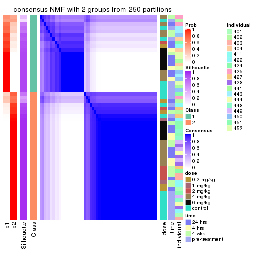</p>

</div>
<div id='tab-SD-NMF-consensus-heatmap-2'>
<pre><code class="r">consensus_heatmap(res, k = 3)
</code></pre>

<p>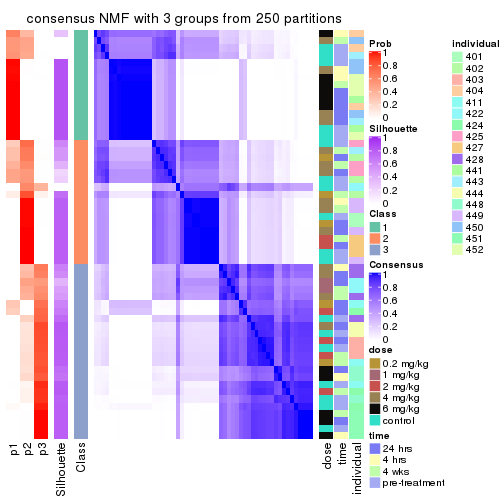</p>

</div>
<div id='tab-SD-NMF-consensus-heatmap-3'>
<pre><code class="r">consensus_heatmap(res, k = 4)
</code></pre>

<p>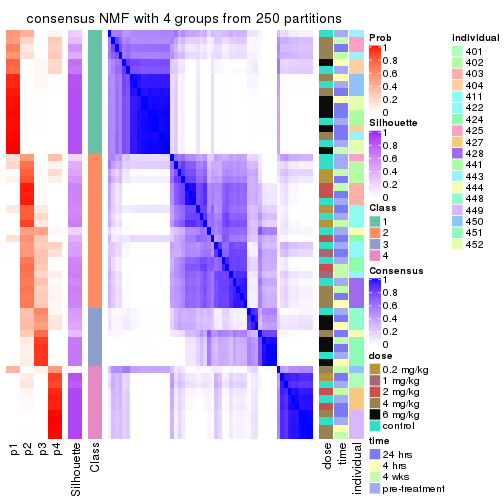</p>

</div>
<div id='tab-SD-NMF-consensus-heatmap-4'>
<pre><code class="r">consensus_heatmap(res, k = 5)
</code></pre>

<p>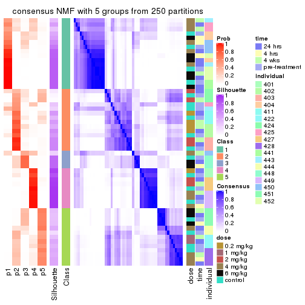</p>

</div>
<div id='tab-SD-NMF-consensus-heatmap-5'>
<pre><code class="r">consensus_heatmap(res, k = 6)
</code></pre>

<p>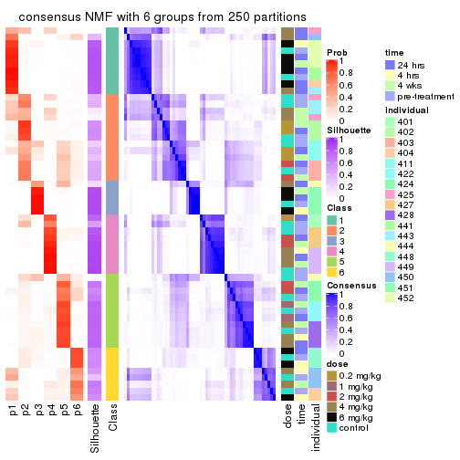</p>

</div>
</div>

Heatmaps for the membership of samples in all partitions to see how consistent they are:


<script>
$( function() {
	$( '#tabs-SD-NMF-membership-heatmap' ).tabs();
} );
</script>
<div id='tabs-SD-NMF-membership-heatmap'>
<ul>
<li><a href='#tab-SD-NMF-membership-heatmap-1'>k = 2</a></li>
<li><a href='#tab-SD-NMF-membership-heatmap-2'>k = 3</a></li>
<li><a href='#tab-SD-NMF-membership-heatmap-3'>k = 4</a></li>
<li><a href='#tab-SD-NMF-membership-heatmap-4'>k = 5</a></li>
<li><a href='#tab-SD-NMF-membership-heatmap-5'>k = 6</a></li>
</ul>
<div id='tab-SD-NMF-membership-heatmap-1'>
<pre><code class="r">membership_heatmap(res, k = 2)
</code></pre>

<p>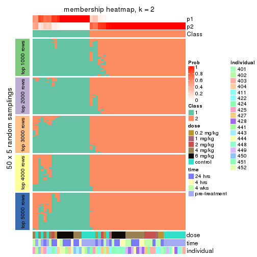</p>

</div>
<div id='tab-SD-NMF-membership-heatmap-2'>
<pre><code class="r">membership_heatmap(res, k = 3)
</code></pre>

<p>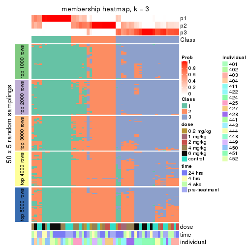</p>

</div>
<div id='tab-SD-NMF-membership-heatmap-3'>
<pre><code class="r">membership_heatmap(res, k = 4)
</code></pre>

<p>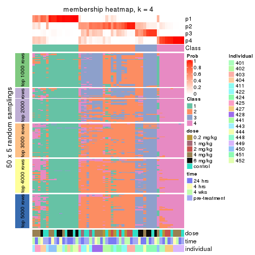</p>

</div>
<div id='tab-SD-NMF-membership-heatmap-4'>
<pre><code class="r">membership_heatmap(res, k = 5)
</code></pre>

<p>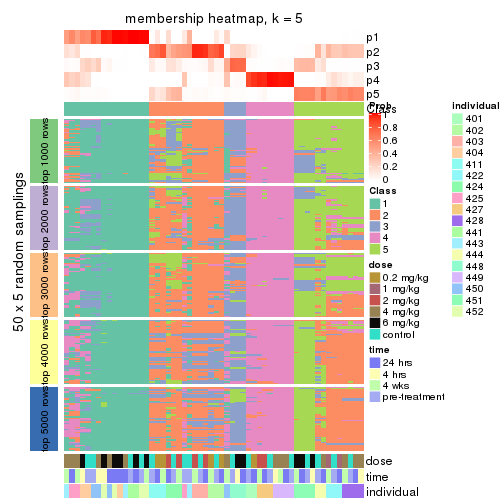</p>

</div>
<div id='tab-SD-NMF-membership-heatmap-5'>
<pre><code class="r">membership_heatmap(res, k = 6)
</code></pre>

<p>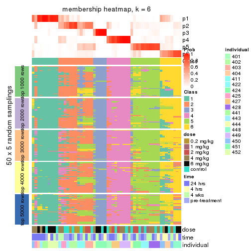</p>

</div>
</div>

As soon as we have had the classes for columns, we can look for signatures
which are significantly different between classes which can be candidate marks
for certain classes. Following are the heatmaps for signatures.


Signature heatmaps where rows are scaled:


<script>
$( function() {
	$( '#tabs-SD-NMF-get-signatures' ).tabs();
} );
</script>
<div id='tabs-SD-NMF-get-signatures'>
<ul>
<li><a href='#tab-SD-NMF-get-signatures-1'>k = 2</a></li>
<li><a href='#tab-SD-NMF-get-signatures-2'>k = 3</a></li>
<li><a href='#tab-SD-NMF-get-signatures-3'>k = 4</a></li>
<li><a href='#tab-SD-NMF-get-signatures-4'>k = 5</a></li>
<li><a href='#tab-SD-NMF-get-signatures-5'>k = 6</a></li>
</ul>
<div id='tab-SD-NMF-get-signatures-1'>
<pre><code class="r">get_signatures(res, k = 2)
</code></pre>

<p>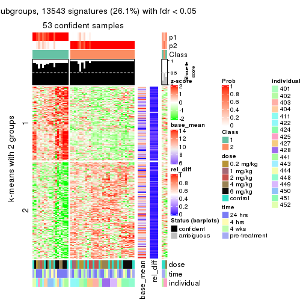</p>

</div>
<div id='tab-SD-NMF-get-signatures-2'>
<pre><code class="r">get_signatures(res, k = 3)
</code></pre>

<p>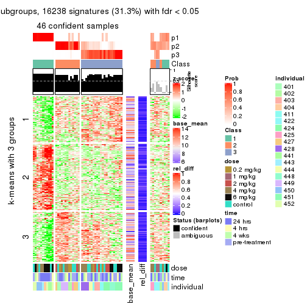</p>

</div>
<div id='tab-SD-NMF-get-signatures-3'>
<pre><code class="r">get_signatures(res, k = 4)
</code></pre>

<p>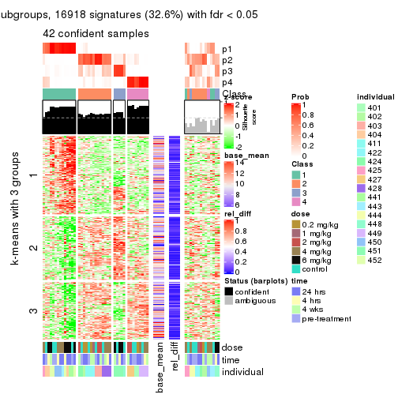</p>

</div>
<div id='tab-SD-NMF-get-signatures-4'>
<pre><code class="r">get_signatures(res, k = 5)
</code></pre>

<p>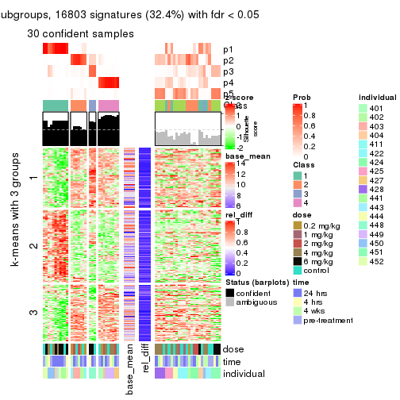</p>

</div>
<div id='tab-SD-NMF-get-signatures-5'>
<pre><code class="r">get_signatures(res, k = 6)
</code></pre>

<p>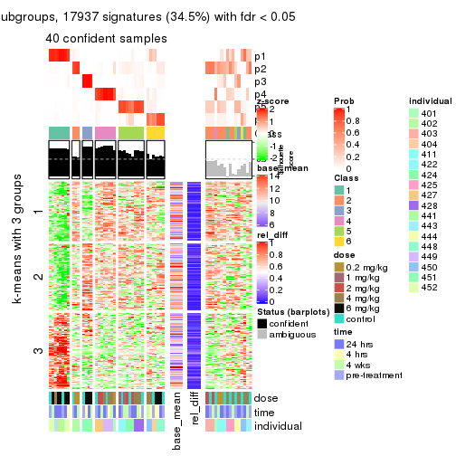</p>

</div>
</div>


Signature heatmaps where rows are not scaled:


<script>
$( function() {
	$( '#tabs-SD-NMF-get-signatures-no-scale' ).tabs();
} );
</script>
<div id='tabs-SD-NMF-get-signatures-no-scale'>
<ul>
<li><a href='#tab-SD-NMF-get-signatures-no-scale-1'>k = 2</a></li>
<li><a href='#tab-SD-NMF-get-signatures-no-scale-2'>k = 3</a></li>
<li><a href='#tab-SD-NMF-get-signatures-no-scale-3'>k = 4</a></li>
<li><a href='#tab-SD-NMF-get-signatures-no-scale-4'>k = 5</a></li>
<li><a href='#tab-SD-NMF-get-signatures-no-scale-5'>k = 6</a></li>
</ul>
<div id='tab-SD-NMF-get-signatures-no-scale-1'>
<pre><code class="r">get_signatures(res, k = 2, scale_rows = FALSE)
</code></pre>

<p>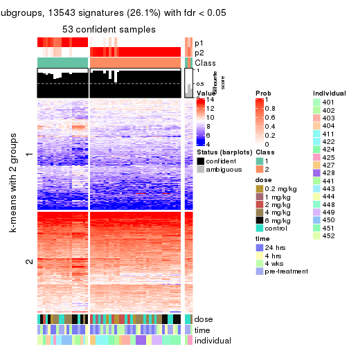</p>

</div>
<div id='tab-SD-NMF-get-signatures-no-scale-2'>
<pre><code class="r">get_signatures(res, k = 3, scale_rows = FALSE)
</code></pre>

<p>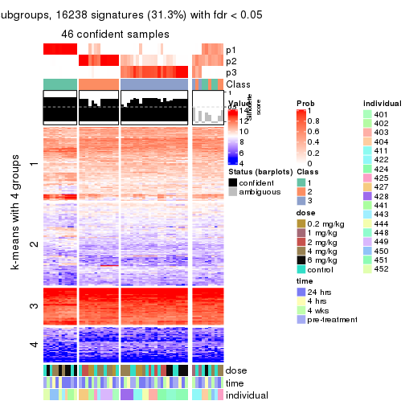</p>

</div>
<div id='tab-SD-NMF-get-signatures-no-scale-3'>
<pre><code class="r">get_signatures(res, k = 4, scale_rows = FALSE)
</code></pre>

<p>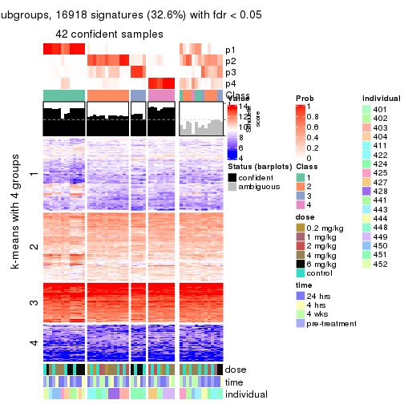</p>

</div>
<div id='tab-SD-NMF-get-signatures-no-scale-4'>
<pre><code class="r">get_signatures(res, k = 5, scale_rows = FALSE)
</code></pre>

<p>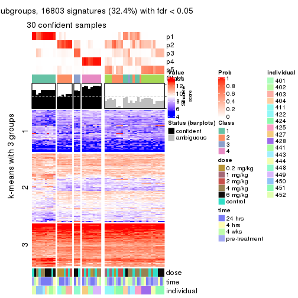</p>

</div>
<div id='tab-SD-NMF-get-signatures-no-scale-5'>
<pre><code class="r">get_signatures(res, k = 6, scale_rows = FALSE)
</code></pre>

<p>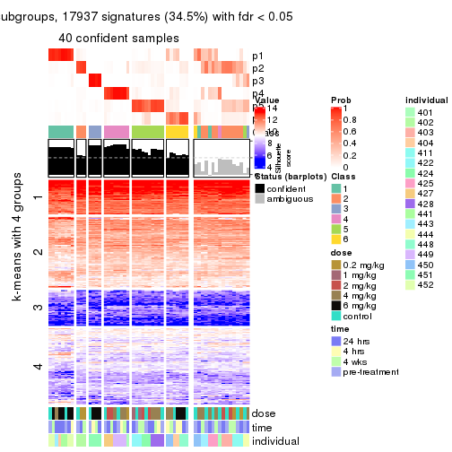</p>

</div>
</div>


Compare the overlap of signatures from different k:

```r
compare_signatures(res)
```

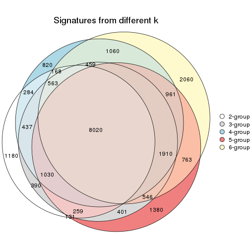

`get_signature()` returns a data frame invisibly. TO get the list of signatures, the function
call should be assigned to a variable explicitly. In following code, if `plot` argument is set
to `FALSE`, no heatmap is plotted while only the differential analysis is performed.

```r
# code only for demonstration
tb = get_signature(res, k = ..., plot = FALSE)
```

An example of the output of `tb` is:

```
#>   which_row         fdr    mean_1    mean_2 scaled_mean_1 scaled_mean_2 km
#> 1        38 0.042760348  8.373488  9.131774    -0.5533452     0.5164555  1
#> 2        40 0.018707592  7.106213  8.469186    -0.6173731     0.5762149  1
#> 3        55 0.019134737 10.221463 11.207825    -0.6159697     0.5749050  1
#> 4        59 0.006059896  5.921854  7.869574    -0.6899429     0.6439467  1
#> 5        60 0.018055526  8.928898 10.211722    -0.6204761     0.5791110  1
#> 6        98 0.009384629 15.714769 14.887706     0.6635654    -0.6193277  2
...
```

The columns in `tb` are:

1. `which_row`: row indices corresponding to the input matrix.
2. `fdr`: FDR for the differential test. 
3. `mean_x`: The mean value in group x.
4. `scaled_mean_x`: The mean value in group x after rows are scaled.
5. `km`: Row groups if k-means clustering is applied to rows.


UMAP plot which shows how samples are separated.


<script>
$( function() {
	$( '#tabs-SD-NMF-dimension-reduction' ).tabs();
} );
</script>
<div id='tabs-SD-NMF-dimension-reduction'>
<ul>
<li><a href='#tab-SD-NMF-dimension-reduction-1'>k = 2</a></li>
<li><a href='#tab-SD-NMF-dimension-reduction-2'>k = 3</a></li>
<li><a href='#tab-SD-NMF-dimension-reduction-3'>k = 4</a></li>
<li><a href='#tab-SD-NMF-dimension-reduction-4'>k = 5</a></li>
<li><a href='#tab-SD-NMF-dimension-reduction-5'>k = 6</a></li>
</ul>
<div id='tab-SD-NMF-dimension-reduction-1'>
<pre><code class="r">dimension_reduction(res, k = 2, method = &quot;UMAP&quot;)
</code></pre>

<p>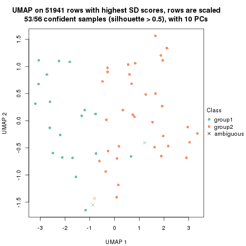</p>

</div>
<div id='tab-SD-NMF-dimension-reduction-2'>
<pre><code class="r">dimension_reduction(res, k = 3, method = &quot;UMAP&quot;)
</code></pre>

<p>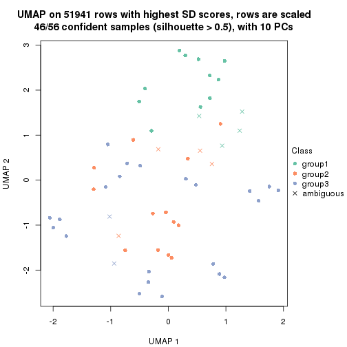</p>

</div>
<div id='tab-SD-NMF-dimension-reduction-3'>
<pre><code class="r">dimension_reduction(res, k = 4, method = &quot;UMAP&quot;)
</code></pre>

<p>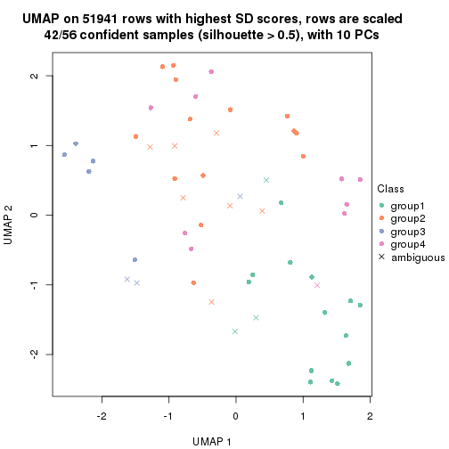</p>

</div>
<div id='tab-SD-NMF-dimension-reduction-4'>
<pre><code class="r">dimension_reduction(res, k = 5, method = &quot;UMAP&quot;)
</code></pre>

<p>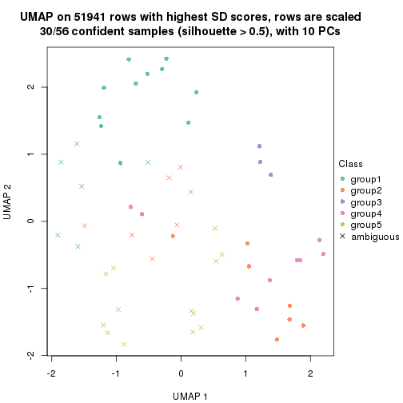</p>

</div>
<div id='tab-SD-NMF-dimension-reduction-5'>
<pre><code class="r">dimension_reduction(res, k = 6, method = &quot;UMAP&quot;)
</code></pre>

<p>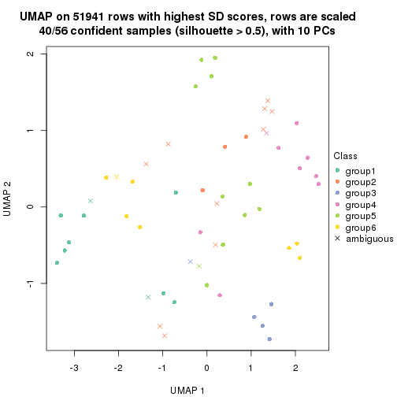</p>

</div>
</div>


Following heatmap shows how subgroups are split when increasing `k`:

```r
collect_classes(res)
```

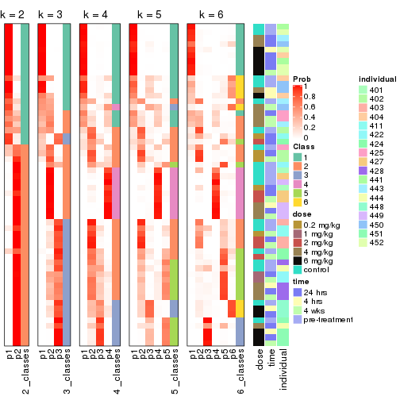


Test correlation between subgroups and known annotations. If the known
annotation is numeric, one-way ANOVA test is applied, and if the known
annotation is discrete, chi-squared contingency table test is applied.

```r
test_to_known_factors(res)
```

```
#>         n dose(p) time(p) individual(p) k
#> SD:NMF 53  0.4106   0.685      1.14e-04 2
#> SD:NMF 46  0.1843   0.885      3.80e-07 3
#> SD:NMF 42  0.0770   0.852      6.36e-09 4
#> SD:NMF 30  0.0408   0.911      3.49e-07 5
#> SD:NMF 40  0.0112   0.970      1.34e-14 6
```


If matrix rows can be associated to genes, consider to use `functional_enrichment(res,
...)` to perform function enrichment for the signature genes. See [this vignette](http://bioconductor.org/packages/devel/bioc/vignettes/cola/inst/doc/functional_enrichment.html) for more detailed explanations.


 

---------------------------------------------------


### CV:hclust


The object with results only for a single top-value method and a single partition method 
can be extracted as:

```r
res = res_list["CV", "hclust"]
# you can also extract it by
# res = res_list["CV:hclust"]
```

A summary of `res` and all the functions that can be applied to it:

```r
res
```

```
#> A 'ConsensusPartition' object with k = 2, 3, 4, 5, 6.
#>   On a matrix with 51941 rows and 56 columns.
#>   Top rows (1000, 2000, 3000, 4000, 5000) are extracted by 'CV' method.
#>   Subgroups are detected by 'hclust' method.
#>   Performed in total 1250 partitions by row resampling.
#>   Best k for subgroups seems to be 5.
#> 
#> Following methods can be applied to this 'ConsensusPartition' object:
#>  [1] "cola_report"             "collect_classes"         "collect_plots"          
#>  [4] "collect_stats"           "colnames"                "compare_signatures"     
#>  [7] "consensus_heatmap"       "dimension_reduction"     "functional_enrichment"  
#> [10] "get_anno_col"            "get_anno"                "get_classes"            
#> [13] "get_consensus"           "get_matrix"              "get_membership"         
#> [16] "get_param"               "get_signatures"          "get_stats"              
#> [19] "is_best_k"               "is_stable_k"             "membership_heatmap"     
#> [22] "ncol"                    "nrow"                    "plot_ecdf"              
#> [25] "rownames"                "select_partition_number" "show"                   
#> [28] "suggest_best_k"          "test_to_known_factors"
```

`collect_plots()` function collects all the plots made from `res` for all `k` (number of partitions)
into one single page to provide an easy and fast comparison between different `k`.

```r
collect_plots(res)
```

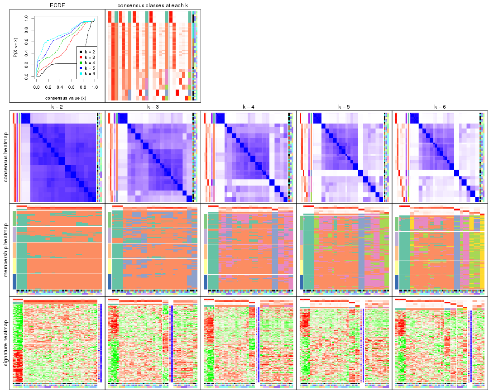

The plots are:

- The first row: a plot of the ECDF (empirical cumulative distribution
  function) curves of the consensus matrix for each `k` and the heatmap of
  predicted classes for each `k`.
- The second row: heatmaps of the consensus matrix for each `k`.
- The third row: heatmaps of the membership matrix for each `k`.
- The fouth row: heatmaps of the signatures for each `k`.

All the plots in panels can be made by individual functions and they are
plotted later in this section.

`select_partition_number()` produces several plots showing different
statistics for choosing "optimized" `k`. There are following statistics:

- ECDF curves of the consensus matrix for each `k`;
- 1-PAC. [The PAC
  score](https://en.wikipedia.org/wiki/Consensus_clustering#Over-interpretation_potential_of_consensus_clustering)
  measures the proportion of the ambiguous subgrouping.
- Mean silhouette score.
- Concordance. The mean probability of fiting the consensus class ids in all
  partitions.
- Area increased. Denote $A_k$ as the area under the ECDF curve for current
  `k`, the area increased is defined as $A_k - A_{k-1}$.
- Rand index. The percent of pairs of samples that are both in a same cluster
  or both are not in a same cluster in the partition of k and k-1.
- Jaccard index. The ratio of pairs of samples are both in a same cluster in
  the partition of k and k-1 and the pairs of samples are both in a same
  cluster in the partition k or k-1.

The detailed explanations of these statistics can be found in [the _cola_
vignette](http://bioconductor.org/packages/devel/bioc/vignettes/cola/inst/doc/cola.html#toc_13).

Generally speaking, lower PAC score, higher mean silhouette score or higher
concordance corresponds to better partition. Rand index and Jaccard index
measure how similar the current partition is compared to partition with `k-1`.
If they are too similar, we won't accept `k` is better than `k-1`.

```r
select_partition_number(res)
```

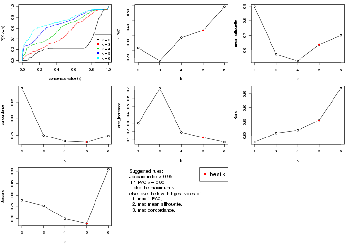

The numeric values for all these statistics can be obtained by `get_stats()`.

```r
get_stats(res)
```

```
#>   k 1-PAC mean_silhouette concordance area_increased  Rand Jaccard
#> 2 2 0.265           0.896       0.892         0.2983 0.777   0.777
#> 3 3 0.181           0.572       0.750         0.7200 0.809   0.754
#> 4 4 0.335           0.528       0.733         0.1913 0.819   0.699
#> 5 5 0.382           0.639       0.730         0.1307 0.856   0.679
#> 6 6 0.540           0.701       0.749         0.0756 0.971   0.911
```

`suggest_best_k()` suggests the best $k$ based on these statistics. The rules are as follows:

- All $k$ with Jaccard index larger than 0.95 are removed because increasing
  $k$ does not provide enough extra information. If all $k$ are removed, it is
  marked as no subgroup is detected.
- For all $k$ with 1-PAC score larger than 0.9, the maximal $k$ is taken as
  the best $k$, and other $k$ are marked as optional $k$.
- If it does not fit the second rule. The $k$ with the maximal vote of the
  highest 1-PAC score, highest mean silhouette, and highest concordance is
  taken as the best $k$.

```r
suggest_best_k(res)
```

```
#> [1] 5
```


Following shows the table of the partitions (You need to click the **show/hide
code output** link to see it). The membership matrix (columns with name `p*`)
is inferred by
[`clue::cl_consensus()`](https://www.rdocumentation.org/link/cl_consensus?package=clue)
function with the `SE` method. Basically the value in the membership matrix
represents the probability to belong to a certain group. The finall class
label for an item is determined with the group with highest probability it
belongs to.

In `get_classes()` function, the entropy is calculated from the membership
matrix and the silhouette score is calculated from the consensus matrix.


<script>
$( function() {
	$( '#tabs-CV-hclust-get-classes' ).tabs();
} );
</script>
<div id='tabs-CV-hclust-get-classes'>
<ul>
<li><a href='#tab-CV-hclust-get-classes-1'>k = 2</a></li>
<li><a href='#tab-CV-hclust-get-classes-2'>k = 3</a></li>
<li><a href='#tab-CV-hclust-get-classes-3'>k = 4</a></li>
<li><a href='#tab-CV-hclust-get-classes-4'>k = 5</a></li>
<li><a href='#tab-CV-hclust-get-classes-5'>k = 6</a></li>
</ul>

<div id='tab-CV-hclust-get-classes-1'>
<p><a id='tab-CV-hclust-get-classes-1-a' style='color:#0366d6' href='#'>show/hide code output</a></p>
<pre><code class="r">cbind(get_classes(res, k = 2), get_membership(res, k = 2))
</code></pre>

<pre><code>#&gt;           class entropy silhouette    p1    p2
#&gt; GSM687644     2   0.482      0.898 0.104 0.896
#&gt; GSM687648     2   0.482      0.898 0.104 0.896
#&gt; GSM687653     2   0.482      0.885 0.104 0.896
#&gt; GSM687658     2   0.753      0.818 0.216 0.784
#&gt; GSM687663     2   0.343      0.906 0.064 0.936
#&gt; GSM687668     2   0.430      0.897 0.088 0.912
#&gt; GSM687673     2   0.416      0.889 0.084 0.916
#&gt; GSM687678     2   0.552      0.887 0.128 0.872
#&gt; GSM687683     2   0.430      0.903 0.088 0.912
#&gt; GSM687688     2   0.443      0.886 0.092 0.908
#&gt; GSM687695     1   0.443      0.987 0.908 0.092
#&gt; GSM687699     2   0.634      0.876 0.160 0.840
#&gt; GSM687704     2   0.327      0.902 0.060 0.940
#&gt; GSM687707     2   0.482      0.886 0.104 0.896
#&gt; GSM687712     2   0.358      0.890 0.068 0.932
#&gt; GSM687719     2   0.634      0.858 0.160 0.840
#&gt; GSM687724     2   0.518      0.871 0.116 0.884
#&gt; GSM687728     1   0.430      0.987 0.912 0.088
#&gt; GSM687646     2   0.482      0.898 0.104 0.896
#&gt; GSM687649     2   0.482      0.898 0.104 0.896
#&gt; GSM687665     2   0.343      0.906 0.064 0.936
#&gt; GSM687651     2   0.482      0.898 0.104 0.896
#&gt; GSM687667     2   0.343      0.906 0.064 0.936
#&gt; GSM687670     2   0.430      0.897 0.088 0.912
#&gt; GSM687671     2   0.430      0.897 0.088 0.912
#&gt; GSM687654     2   0.482      0.885 0.104 0.896
#&gt; GSM687675     2   0.416      0.889 0.084 0.916
#&gt; GSM687685     2   0.430      0.903 0.088 0.912
#&gt; GSM687656     2   0.482      0.885 0.104 0.896
#&gt; GSM687677     2   0.416      0.889 0.084 0.916
#&gt; GSM687687     2   0.430      0.903 0.088 0.912
#&gt; GSM687692     2   0.443      0.886 0.092 0.908
#&gt; GSM687716     2   0.358      0.890 0.068 0.932
#&gt; GSM687722     2   0.634      0.858 0.160 0.840
#&gt; GSM687680     2   0.552      0.887 0.128 0.872
#&gt; GSM687690     2   0.443      0.886 0.092 0.908
#&gt; GSM687700     2   0.644      0.871 0.164 0.836
#&gt; GSM687705     2   0.327      0.902 0.060 0.940
#&gt; GSM687714     2   0.358      0.890 0.068 0.932
#&gt; GSM687721     2   0.634      0.858 0.160 0.840
#&gt; GSM687682     2   0.595      0.878 0.144 0.856
#&gt; GSM687694     2   0.443      0.886 0.092 0.908
#&gt; GSM687702     2   0.644      0.871 0.164 0.836
#&gt; GSM687718     2   0.358      0.890 0.068 0.932
#&gt; GSM687723     2   0.634      0.858 0.160 0.840
#&gt; GSM687661     2   0.753      0.818 0.216 0.784
#&gt; GSM687710     2   0.482      0.886 0.104 0.896
#&gt; GSM687726     2   0.518      0.871 0.116 0.884
#&gt; GSM687730     1   0.443      0.986 0.908 0.092
#&gt; GSM687660     1   0.584      0.937 0.860 0.140
#&gt; GSM687697     1   0.443      0.987 0.908 0.092
#&gt; GSM687709     2   0.482      0.886 0.104 0.896
#&gt; GSM687725     2   0.518      0.871 0.116 0.884
#&gt; GSM687729     1   0.430      0.987 0.912 0.088
#&gt; GSM687727     2   0.518      0.871 0.116 0.884
#&gt; GSM687731     1   0.430      0.987 0.912 0.088
</code></pre>

<script>
$('#tab-CV-hclust-get-classes-1-a').parent().next().next().hide();
$('#tab-CV-hclust-get-classes-1-a').click(function(){
  $('#tab-CV-hclust-get-classes-1-a').parent().next().next().toggle();
  return(false);
});
</script>
</div>

<div id='tab-CV-hclust-get-classes-2'>
<p><a id='tab-CV-hclust-get-classes-2-a' style='color:#0366d6' href='#'>show/hide code output</a></p>
<pre><code class="r">cbind(get_classes(res, k = 3), get_membership(res, k = 3))
</code></pre>

<pre><code>#&gt;           class entropy silhouette    p1    p2    p3
#&gt; GSM687644     2   0.290      0.658 0.028 0.924 0.048
#&gt; GSM687648     2   0.301      0.655 0.028 0.920 0.052
#&gt; GSM687653     2   0.706      0.313 0.024 0.572 0.404
#&gt; GSM687658     2   0.549      0.575 0.196 0.780 0.024
#&gt; GSM687663     2   0.448      0.645 0.020 0.844 0.136
#&gt; GSM687668     2   0.323      0.664 0.020 0.908 0.072
#&gt; GSM687673     2   0.629      0.501 0.020 0.692 0.288
#&gt; GSM687678     2   0.453      0.647 0.088 0.860 0.052
#&gt; GSM687683     2   0.460      0.608 0.016 0.832 0.152
#&gt; GSM687688     2   0.710      0.301 0.028 0.588 0.384
#&gt; GSM687695     1   0.288      0.983 0.904 0.096 0.000
#&gt; GSM687699     2   0.501      0.633 0.084 0.840 0.076
#&gt; GSM687704     2   0.663      0.349 0.012 0.596 0.392
#&gt; GSM687707     3   0.820      0.349 0.072 0.436 0.492
#&gt; GSM687712     2   0.773      0.205 0.056 0.572 0.372
#&gt; GSM687719     2   0.493      0.627 0.120 0.836 0.044
#&gt; GSM687724     3   0.690      0.613 0.044 0.280 0.676
#&gt; GSM687728     1   0.280      0.983 0.908 0.092 0.000
#&gt; GSM687646     2   0.290      0.658 0.028 0.924 0.048
#&gt; GSM687649     2   0.301      0.655 0.028 0.920 0.052
#&gt; GSM687665     2   0.448      0.645 0.020 0.844 0.136
#&gt; GSM687651     2   0.301      0.655 0.028 0.920 0.052
#&gt; GSM687667     2   0.448      0.645 0.020 0.844 0.136
#&gt; GSM687670     2   0.323      0.664 0.020 0.908 0.072
#&gt; GSM687671     2   0.323      0.664 0.020 0.908 0.072
#&gt; GSM687654     2   0.706      0.313 0.024 0.572 0.404
#&gt; GSM687675     2   0.629      0.501 0.020 0.692 0.288
#&gt; GSM687685     2   0.460      0.609 0.016 0.832 0.152
#&gt; GSM687656     2   0.706      0.313 0.024 0.572 0.404
#&gt; GSM687677     2   0.629      0.501 0.020 0.692 0.288
#&gt; GSM687687     2   0.460      0.608 0.016 0.832 0.152
#&gt; GSM687692     2   0.710      0.301 0.028 0.588 0.384
#&gt; GSM687716     2   0.773      0.205 0.056 0.572 0.372
#&gt; GSM687722     2   0.493      0.627 0.120 0.836 0.044
#&gt; GSM687680     2   0.453      0.647 0.088 0.860 0.052
#&gt; GSM687690     2   0.710      0.301 0.028 0.588 0.384
#&gt; GSM687700     2   0.409      0.644 0.088 0.876 0.036
#&gt; GSM687705     2   0.663      0.349 0.012 0.596 0.392
#&gt; GSM687714     2   0.773      0.205 0.056 0.572 0.372
#&gt; GSM687721     2   0.493      0.627 0.120 0.836 0.044
#&gt; GSM687682     2   0.523      0.633 0.104 0.828 0.068
#&gt; GSM687694     2   0.710      0.301 0.028 0.588 0.384
#&gt; GSM687702     2   0.409      0.644 0.088 0.876 0.036
#&gt; GSM687718     2   0.773      0.205 0.056 0.572 0.372
#&gt; GSM687723     2   0.493      0.627 0.120 0.836 0.044
#&gt; GSM687661     2   0.549      0.575 0.196 0.780 0.024
#&gt; GSM687710     3   0.820      0.349 0.072 0.436 0.492
#&gt; GSM687726     3   0.690      0.613 0.044 0.280 0.676
#&gt; GSM687730     1   0.288      0.982 0.904 0.096 0.000
#&gt; GSM687660     1   0.375      0.921 0.856 0.144 0.000
#&gt; GSM687697     1   0.288      0.983 0.904 0.096 0.000
#&gt; GSM687709     3   0.820      0.349 0.072 0.436 0.492
#&gt; GSM687725     3   0.690      0.613 0.044 0.280 0.676
#&gt; GSM687729     1   0.280      0.983 0.908 0.092 0.000
#&gt; GSM687727     3   0.690      0.613 0.044 0.280 0.676
#&gt; GSM687731     1   0.280      0.983 0.908 0.092 0.000
</code></pre>

<script>
$('#tab-CV-hclust-get-classes-2-a').parent().next().next().hide();
$('#tab-CV-hclust-get-classes-2-a').click(function(){
  $('#tab-CV-hclust-get-classes-2-a').parent().next().next().toggle();
  return(false);
});
</script>
</div>

<div id='tab-CV-hclust-get-classes-3'>
<p><a id='tab-CV-hclust-get-classes-3-a' style='color:#0366d6' href='#'>show/hide code output</a></p>
<pre><code class="r">cbind(get_classes(res, k = 4), get_membership(res, k = 4))
</code></pre>

<pre><code>#&gt;           class entropy silhouette    p1    p2    p3    p4
#&gt; GSM687644     2   0.304     0.5999 0.008 0.892 0.020 0.080
#&gt; GSM687648     2   0.324     0.5948 0.008 0.880 0.020 0.092
#&gt; GSM687653     4   0.698     0.2203 0.004 0.408 0.100 0.488
#&gt; GSM687658     2   0.521     0.5245 0.224 0.732 0.008 0.036
#&gt; GSM687663     2   0.452     0.5521 0.016 0.812 0.036 0.136
#&gt; GSM687668     2   0.306     0.6043 0.016 0.900 0.032 0.052
#&gt; GSM687673     2   0.641     0.2409 0.004 0.600 0.076 0.320
#&gt; GSM687678     2   0.500     0.5875 0.096 0.792 0.012 0.100
#&gt; GSM687683     2   0.451     0.4797 0.008 0.788 0.024 0.180
#&gt; GSM687688     2   0.784     0.0302 0.004 0.436 0.332 0.228
#&gt; GSM687695     1   0.112     0.9823 0.964 0.036 0.000 0.000
#&gt; GSM687699     2   0.531     0.5570 0.068 0.776 0.024 0.132
#&gt; GSM687704     2   0.700    -0.1996 0.008 0.468 0.088 0.436
#&gt; GSM687707     4   0.624     0.4483 0.020 0.264 0.056 0.660
#&gt; GSM687712     4   0.704     0.3700 0.028 0.440 0.056 0.476
#&gt; GSM687719     2   0.403     0.5866 0.132 0.832 0.008 0.028
#&gt; GSM687724     3   0.168     1.0000 0.012 0.040 0.948 0.000
#&gt; GSM687728     1   0.102     0.9825 0.968 0.032 0.000 0.000
#&gt; GSM687646     2   0.304     0.5999 0.008 0.892 0.020 0.080
#&gt; GSM687649     2   0.324     0.5948 0.008 0.880 0.020 0.092
#&gt; GSM687665     2   0.452     0.5521 0.016 0.812 0.036 0.136
#&gt; GSM687651     2   0.324     0.5948 0.008 0.880 0.020 0.092
#&gt; GSM687667     2   0.452     0.5521 0.016 0.812 0.036 0.136
#&gt; GSM687670     2   0.306     0.6043 0.016 0.900 0.032 0.052
#&gt; GSM687671     2   0.306     0.6043 0.016 0.900 0.032 0.052
#&gt; GSM687654     4   0.698     0.2203 0.004 0.408 0.100 0.488
#&gt; GSM687675     2   0.641     0.2409 0.004 0.600 0.076 0.320
#&gt; GSM687685     2   0.440     0.4838 0.008 0.792 0.020 0.180
#&gt; GSM687656     4   0.698     0.2203 0.004 0.408 0.100 0.488
#&gt; GSM687677     2   0.641     0.2409 0.004 0.600 0.076 0.320
#&gt; GSM687687     2   0.451     0.4797 0.008 0.788 0.024 0.180
#&gt; GSM687692     2   0.784     0.0302 0.004 0.436 0.332 0.228
#&gt; GSM687716     4   0.704     0.3700 0.028 0.440 0.056 0.476
#&gt; GSM687722     2   0.403     0.5866 0.132 0.832 0.008 0.028
#&gt; GSM687680     2   0.500     0.5875 0.096 0.792 0.012 0.100
#&gt; GSM687690     2   0.784     0.0302 0.004 0.436 0.332 0.228
#&gt; GSM687700     2   0.405     0.6052 0.072 0.852 0.016 0.060
#&gt; GSM687705     2   0.700    -0.1996 0.008 0.468 0.088 0.436
#&gt; GSM687714     4   0.704     0.3700 0.028 0.440 0.056 0.476
#&gt; GSM687721     2   0.403     0.5866 0.132 0.832 0.008 0.028
#&gt; GSM687682     2   0.551     0.5682 0.112 0.756 0.012 0.120
#&gt; GSM687694     2   0.784     0.0302 0.004 0.436 0.332 0.228
#&gt; GSM687702     2   0.405     0.6052 0.072 0.852 0.016 0.060
#&gt; GSM687718     4   0.704     0.3700 0.028 0.440 0.056 0.476
#&gt; GSM687723     2   0.403     0.5866 0.132 0.832 0.008 0.028
#&gt; GSM687661     2   0.521     0.5245 0.224 0.732 0.008 0.036
#&gt; GSM687710     4   0.624     0.4483 0.020 0.264 0.056 0.660
#&gt; GSM687726     3   0.168     1.0000 0.012 0.040 0.948 0.000
#&gt; GSM687730     1   0.112     0.9808 0.964 0.036 0.000 0.000
#&gt; GSM687660     1   0.234     0.9177 0.912 0.080 0.000 0.008
#&gt; GSM687697     1   0.112     0.9823 0.964 0.036 0.000 0.000
#&gt; GSM687709     4   0.624     0.4483 0.020 0.264 0.056 0.660
#&gt; GSM687725     3   0.168     1.0000 0.012 0.040 0.948 0.000
#&gt; GSM687729     1   0.102     0.9825 0.968 0.032 0.000 0.000
#&gt; GSM687727     3   0.168     1.0000 0.012 0.040 0.948 0.000
#&gt; GSM687731     1   0.102     0.9825 0.968 0.032 0.000 0.000
</code></pre>

<script>
$('#tab-CV-hclust-get-classes-3-a').parent().next().next().hide();
$('#tab-CV-hclust-get-classes-3-a').click(function(){
  $('#tab-CV-hclust-get-classes-3-a').parent().next().next().toggle();
  return(false);
});
</script>
</div>

<div id='tab-CV-hclust-get-classes-4'>
<p><a id='tab-CV-hclust-get-classes-4-a' style='color:#0366d6' href='#'>show/hide code output</a></p>
<pre><code class="r">cbind(get_classes(res, k = 5), get_membership(res, k = 5))
</code></pre>

<pre><code>#&gt;           class entropy silhouette    p1    p2    p3    p4    p5
#&gt; GSM687644     2  0.2544      0.710 0.008 0.900 0.000 0.064 0.028
#&gt; GSM687648     2  0.2819      0.702 0.008 0.884 0.000 0.076 0.032
#&gt; GSM687653     5  0.7181      0.379 0.004 0.176 0.028 0.348 0.444
#&gt; GSM687658     2  0.4716      0.654 0.220 0.728 0.004 0.036 0.012
#&gt; GSM687663     2  0.5090      0.615 0.008 0.724 0.004 0.168 0.096
#&gt; GSM687668     2  0.3580      0.702 0.008 0.848 0.012 0.096 0.036
#&gt; GSM687673     2  0.6976      0.246 0.004 0.504 0.028 0.160 0.304
#&gt; GSM687678     2  0.4694      0.693 0.088 0.784 0.000 0.072 0.056
#&gt; GSM687683     2  0.4291      0.569 0.004 0.704 0.000 0.276 0.016
#&gt; GSM687688     4  0.7730      0.398 0.004 0.252 0.232 0.448 0.064
#&gt; GSM687695     1  0.0404      0.979 0.988 0.012 0.000 0.000 0.000
#&gt; GSM687699     2  0.5345      0.596 0.060 0.732 0.000 0.132 0.076
#&gt; GSM687704     4  0.6980      0.319 0.004 0.236 0.024 0.520 0.216
#&gt; GSM687707     5  0.2471      0.544 0.000 0.136 0.000 0.000 0.864
#&gt; GSM687712     4  0.5487      0.483 0.000 0.180 0.004 0.668 0.148
#&gt; GSM687719     2  0.4763      0.688 0.124 0.776 0.008 0.068 0.024
#&gt; GSM687724     3  0.0968      1.000 0.012 0.012 0.972 0.004 0.000
#&gt; GSM687728     1  0.0324      0.980 0.992 0.004 0.004 0.000 0.000
#&gt; GSM687646     2  0.2544      0.710 0.008 0.900 0.000 0.064 0.028
#&gt; GSM687649     2  0.2819      0.702 0.008 0.884 0.000 0.076 0.032
#&gt; GSM687665     2  0.5090      0.615 0.008 0.724 0.004 0.168 0.096
#&gt; GSM687651     2  0.2819      0.702 0.008 0.884 0.000 0.076 0.032
#&gt; GSM687667     2  0.5090      0.615 0.008 0.724 0.004 0.168 0.096
#&gt; GSM687670     2  0.3580      0.702 0.008 0.848 0.012 0.096 0.036
#&gt; GSM687671     2  0.3580      0.702 0.008 0.848 0.012 0.096 0.036
#&gt; GSM687654     5  0.7181      0.379 0.004 0.176 0.028 0.348 0.444
#&gt; GSM687675     2  0.6976      0.246 0.004 0.504 0.028 0.160 0.304
#&gt; GSM687685     2  0.4240      0.571 0.004 0.700 0.000 0.284 0.012
#&gt; GSM687656     5  0.7181      0.379 0.004 0.176 0.028 0.348 0.444
#&gt; GSM687677     2  0.6976      0.246 0.004 0.504 0.028 0.160 0.304
#&gt; GSM687687     2  0.4291      0.569 0.004 0.704 0.000 0.276 0.016
#&gt; GSM687692     4  0.7730      0.398 0.004 0.252 0.232 0.448 0.064
#&gt; GSM687716     4  0.5487      0.483 0.000 0.180 0.004 0.668 0.148
#&gt; GSM687722     2  0.4763      0.688 0.124 0.776 0.008 0.068 0.024
#&gt; GSM687680     2  0.4694      0.693 0.088 0.784 0.000 0.072 0.056
#&gt; GSM687690     4  0.7730      0.398 0.004 0.252 0.232 0.448 0.064
#&gt; GSM687700     2  0.3563      0.709 0.072 0.852 0.000 0.044 0.032
#&gt; GSM687705     4  0.6980      0.319 0.004 0.236 0.024 0.520 0.216
#&gt; GSM687714     4  0.5487      0.483 0.000 0.180 0.004 0.668 0.148
#&gt; GSM687721     2  0.4763      0.688 0.124 0.776 0.008 0.068 0.024
#&gt; GSM687682     2  0.5569      0.646 0.096 0.728 0.004 0.104 0.068
#&gt; GSM687694     4  0.7730      0.398 0.004 0.252 0.232 0.448 0.064
#&gt; GSM687702     2  0.3563      0.709 0.072 0.852 0.000 0.044 0.032
#&gt; GSM687718     4  0.5487      0.483 0.000 0.180 0.004 0.668 0.148
#&gt; GSM687723     2  0.4763      0.688 0.124 0.776 0.008 0.068 0.024
#&gt; GSM687661     2  0.4716      0.654 0.220 0.728 0.004 0.036 0.012
#&gt; GSM687710     5  0.2471      0.544 0.000 0.136 0.000 0.000 0.864
#&gt; GSM687726     3  0.0968      1.000 0.012 0.012 0.972 0.004 0.000
#&gt; GSM687730     1  0.0451      0.979 0.988 0.008 0.004 0.000 0.000
#&gt; GSM687660     1  0.1571      0.921 0.936 0.060 0.000 0.000 0.004
#&gt; GSM687697     1  0.0404      0.979 0.988 0.012 0.000 0.000 0.000
#&gt; GSM687709     5  0.2471      0.544 0.000 0.136 0.000 0.000 0.864
#&gt; GSM687725     3  0.0968      1.000 0.012 0.012 0.972 0.004 0.000
#&gt; GSM687729     1  0.0162      0.979 0.996 0.004 0.000 0.000 0.000
#&gt; GSM687727     3  0.0968      1.000 0.012 0.012 0.972 0.004 0.000
#&gt; GSM687731     1  0.0324      0.980 0.992 0.004 0.004 0.000 0.000
</code></pre>

<script>
$('#tab-CV-hclust-get-classes-4-a').parent().next().next().hide();
$('#tab-CV-hclust-get-classes-4-a').click(function(){
  $('#tab-CV-hclust-get-classes-4-a').parent().next().next().toggle();
  return(false);
});
</script>
</div>

<div id='tab-CV-hclust-get-classes-5'>
<p><a id='tab-CV-hclust-get-classes-5-a' style='color:#0366d6' href='#'>show/hide code output</a></p>
<pre><code class="r">cbind(get_classes(res, k = 6), get_membership(res, k = 6))
</code></pre>

<pre><code>#&gt;           class entropy silhouette    p1    p2    p3    p4    p5    p6
#&gt; GSM687644     2  0.3082      0.702 0.012 0.860 0.000 0.040 0.080 0.008
#&gt; GSM687648     2  0.3040      0.696 0.012 0.864 0.000 0.032 0.080 0.012
#&gt; GSM687653     5  0.4680      0.485 0.000 0.040 0.000 0.012 0.628 0.320
#&gt; GSM687658     2  0.4419      0.662 0.212 0.724 0.000 0.020 0.040 0.004
#&gt; GSM687663     2  0.5797      0.585 0.008 0.664 0.004 0.100 0.152 0.072
#&gt; GSM687668     2  0.3965      0.690 0.008 0.812 0.008 0.076 0.080 0.016
#&gt; GSM687673     2  0.6720      0.168 0.000 0.424 0.004 0.036 0.312 0.224
#&gt; GSM687678     2  0.4798      0.690 0.088 0.764 0.004 0.064 0.064 0.016
#&gt; GSM687683     2  0.4536      0.561 0.004 0.684 0.000 0.252 0.056 0.004
#&gt; GSM687688     5  0.4909      0.679 0.000 0.072 0.112 0.088 0.728 0.000
#&gt; GSM687695     1  0.0260      0.978 0.992 0.008 0.000 0.000 0.000 0.000
#&gt; GSM687699     2  0.5690      0.581 0.048 0.692 0.000 0.080 0.128 0.052
#&gt; GSM687704     4  0.7224      0.348 0.004 0.160 0.008 0.428 0.312 0.088
#&gt; GSM687707     6  0.1225      1.000 0.000 0.036 0.000 0.012 0.000 0.952
#&gt; GSM687712     4  0.2812      0.758 0.000 0.104 0.000 0.860 0.028 0.008
#&gt; GSM687719     2  0.4760      0.680 0.116 0.760 0.004 0.060 0.044 0.016
#&gt; GSM687724     3  0.0146      1.000 0.004 0.000 0.996 0.000 0.000 0.000
#&gt; GSM687728     1  0.0436      0.979 0.988 0.000 0.004 0.004 0.004 0.000
#&gt; GSM687646     2  0.3082      0.702 0.012 0.860 0.000 0.040 0.080 0.008
#&gt; GSM687649     2  0.3040      0.696 0.012 0.864 0.000 0.032 0.080 0.012
#&gt; GSM687665     2  0.5797      0.585 0.008 0.664 0.004 0.100 0.152 0.072
#&gt; GSM687651     2  0.3040      0.696 0.012 0.864 0.000 0.032 0.080 0.012
#&gt; GSM687667     2  0.5797      0.585 0.008 0.664 0.004 0.100 0.152 0.072
#&gt; GSM687670     2  0.3965      0.690 0.008 0.812 0.008 0.076 0.080 0.016
#&gt; GSM687671     2  0.3965      0.690 0.008 0.812 0.008 0.076 0.080 0.016
#&gt; GSM687654     5  0.4680      0.485 0.000 0.040 0.000 0.012 0.628 0.320
#&gt; GSM687675     2  0.6720      0.168 0.000 0.424 0.004 0.036 0.312 0.224
#&gt; GSM687685     2  0.4536      0.558 0.004 0.684 0.000 0.252 0.056 0.004
#&gt; GSM687656     5  0.4680      0.485 0.000 0.040 0.000 0.012 0.628 0.320
#&gt; GSM687677     2  0.6720      0.168 0.000 0.424 0.004 0.036 0.312 0.224
#&gt; GSM687687     2  0.4536      0.561 0.004 0.684 0.000 0.252 0.056 0.004
#&gt; GSM687692     5  0.4909      0.679 0.000 0.072 0.112 0.088 0.728 0.000
#&gt; GSM687716     4  0.2812      0.758 0.000 0.104 0.000 0.860 0.028 0.008
#&gt; GSM687722     2  0.4760      0.680 0.116 0.760 0.004 0.060 0.044 0.016
#&gt; GSM687680     2  0.4798      0.690 0.088 0.764 0.004 0.064 0.064 0.016
#&gt; GSM687690     5  0.4909      0.679 0.000 0.072 0.112 0.088 0.728 0.000
#&gt; GSM687700     2  0.3668      0.699 0.064 0.836 0.000 0.036 0.048 0.016
#&gt; GSM687705     4  0.7224      0.348 0.004 0.160 0.008 0.428 0.312 0.088
#&gt; GSM687714     4  0.2812      0.758 0.000 0.104 0.000 0.860 0.028 0.008
#&gt; GSM687721     2  0.4760      0.680 0.116 0.760 0.004 0.060 0.044 0.016
#&gt; GSM687682     2  0.5672      0.648 0.092 0.696 0.004 0.088 0.100 0.020
#&gt; GSM687694     5  0.4909      0.679 0.000 0.072 0.112 0.088 0.728 0.000
#&gt; GSM687702     2  0.3668      0.699 0.064 0.836 0.000 0.036 0.048 0.016
#&gt; GSM687718     4  0.2812      0.758 0.000 0.104 0.000 0.860 0.028 0.008
#&gt; GSM687723     2  0.4760      0.680 0.116 0.760 0.004 0.060 0.044 0.016
#&gt; GSM687661     2  0.4419      0.662 0.212 0.724 0.000 0.020 0.040 0.004
#&gt; GSM687710     6  0.1225      1.000 0.000 0.036 0.000 0.012 0.000 0.952
#&gt; GSM687726     3  0.0146      1.000 0.004 0.000 0.996 0.000 0.000 0.000
#&gt; GSM687730     1  0.0582      0.977 0.984 0.004 0.004 0.004 0.004 0.000
#&gt; GSM687660     1  0.1542      0.919 0.936 0.052 0.000 0.000 0.008 0.004
#&gt; GSM687697     1  0.0260      0.978 0.992 0.008 0.000 0.000 0.000 0.000
#&gt; GSM687709     6  0.1225      1.000 0.000 0.036 0.000 0.012 0.000 0.952
#&gt; GSM687725     3  0.0146      1.000 0.004 0.000 0.996 0.000 0.000 0.000
#&gt; GSM687729     1  0.0146      0.978 0.996 0.000 0.004 0.000 0.000 0.000
#&gt; GSM687727     3  0.0146      1.000 0.004 0.000 0.996 0.000 0.000 0.000
#&gt; GSM687731     1  0.0436      0.979 0.988 0.000 0.004 0.004 0.004 0.000
</code></pre>

<script>
$('#tab-CV-hclust-get-classes-5-a').parent().next().next().hide();
$('#tab-CV-hclust-get-classes-5-a').click(function(){
  $('#tab-CV-hclust-get-classes-5-a').parent().next().next().toggle();
  return(false);
});
</script>
</div>
</div>

Heatmaps for the consensus matrix. It visualizes the probability of two
samples to be in a same group.


<script>
$( function() {
	$( '#tabs-CV-hclust-consensus-heatmap' ).tabs();
} );
</script>
<div id='tabs-CV-hclust-consensus-heatmap'>
<ul>
<li><a href='#tab-CV-hclust-consensus-heatmap-1'>k = 2</a></li>
<li><a href='#tab-CV-hclust-consensus-heatmap-2'>k = 3</a></li>
<li><a href='#tab-CV-hclust-consensus-heatmap-3'>k = 4</a></li>
<li><a href='#tab-CV-hclust-consensus-heatmap-4'>k = 5</a></li>
<li><a href='#tab-CV-hclust-consensus-heatmap-5'>k = 6</a></li>
</ul>
<div id='tab-CV-hclust-consensus-heatmap-1'>
<pre><code class="r">consensus_heatmap(res, k = 2)
</code></pre>

<p>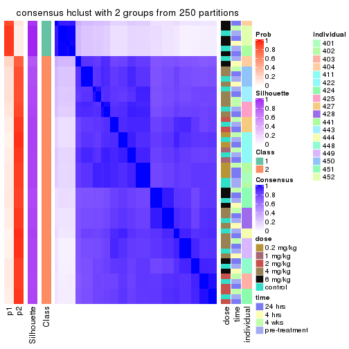</p>

</div>
<div id='tab-CV-hclust-consensus-heatmap-2'>
<pre><code class="r">consensus_heatmap(res, k = 3)
</code></pre>

<p>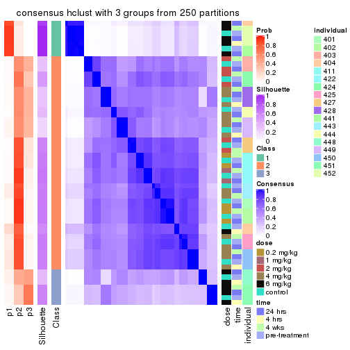</p>

</div>
<div id='tab-CV-hclust-consensus-heatmap-3'>
<pre><code class="r">consensus_heatmap(res, k = 4)
</code></pre>

<p>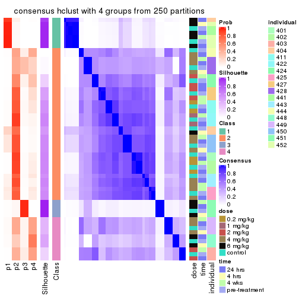</p>

</div>
<div id='tab-CV-hclust-consensus-heatmap-4'>
<pre><code class="r">consensus_heatmap(res, k = 5)
</code></pre>

<p>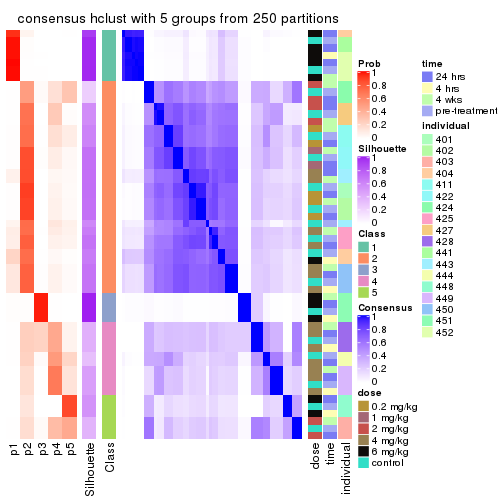</p>

</div>
<div id='tab-CV-hclust-consensus-heatmap-5'>
<pre><code class="r">consensus_heatmap(res, k = 6)
</code></pre>

<p>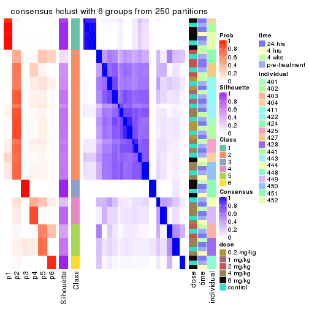</p>

</div>
</div>

Heatmaps for the membership of samples in all partitions to see how consistent they are:


<script>
$( function() {
	$( '#tabs-CV-hclust-membership-heatmap' ).tabs();
} );
</script>
<div id='tabs-CV-hclust-membership-heatmap'>
<ul>
<li><a href='#tab-CV-hclust-membership-heatmap-1'>k = 2</a></li>
<li><a href='#tab-CV-hclust-membership-heatmap-2'>k = 3</a></li>
<li><a href='#tab-CV-hclust-membership-heatmap-3'>k = 4</a></li>
<li><a href='#tab-CV-hclust-membership-heatmap-4'>k = 5</a></li>
<li><a href='#tab-CV-hclust-membership-heatmap-5'>k = 6</a></li>
</ul>
<div id='tab-CV-hclust-membership-heatmap-1'>
<pre><code class="r">membership_heatmap(res, k = 2)
</code></pre>

<p>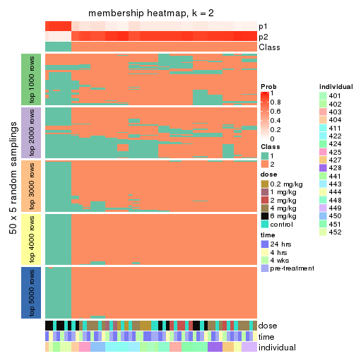</p>

</div>
<div id='tab-CV-hclust-membership-heatmap-2'>
<pre><code class="r">membership_heatmap(res, k = 3)
</code></pre>

<p>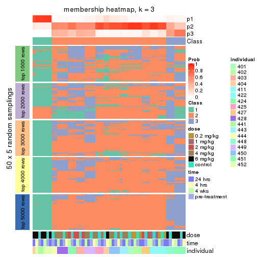</p>

</div>
<div id='tab-CV-hclust-membership-heatmap-3'>
<pre><code class="r">membership_heatmap(res, k = 4)
</code></pre>

<p>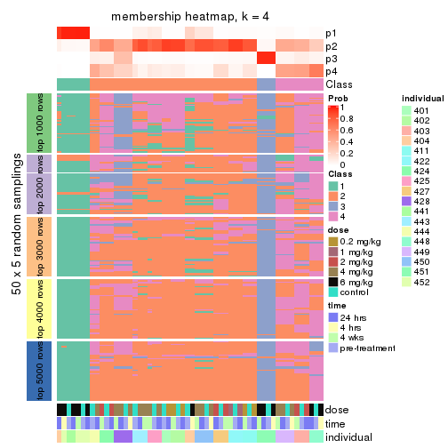</p>

</div>
<div id='tab-CV-hclust-membership-heatmap-4'>
<pre><code class="r">membership_heatmap(res, k = 5)
</code></pre>

<p>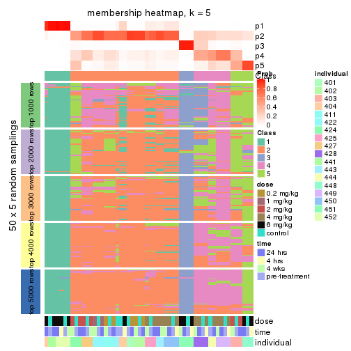</p>

</div>
<div id='tab-CV-hclust-membership-heatmap-5'>
<pre><code class="r">membership_heatmap(res, k = 6)
</code></pre>

<p>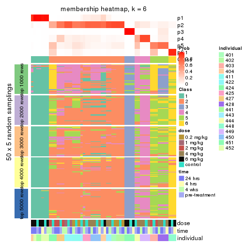</p>

</div>
</div>

As soon as we have had the classes for columns, we can look for signatures
which are significantly different between classes which can be candidate marks
for certain classes. Following are the heatmaps for signatures.


Signature heatmaps where rows are scaled:


<script>
$( function() {
	$( '#tabs-CV-hclust-get-signatures' ).tabs();
} );
</script>
<div id='tabs-CV-hclust-get-signatures'>
<ul>
<li><a href='#tab-CV-hclust-get-signatures-1'>k = 2</a></li>
<li><a href='#tab-CV-hclust-get-signatures-2'>k = 3</a></li>
<li><a href='#tab-CV-hclust-get-signatures-3'>k = 4</a></li>
<li><a href='#tab-CV-hclust-get-signatures-4'>k = 5</a></li>
<li><a href='#tab-CV-hclust-get-signatures-5'>k = 6</a></li>
</ul>
<div id='tab-CV-hclust-get-signatures-1'>
<pre><code class="r">get_signatures(res, k = 2)
</code></pre>

<p>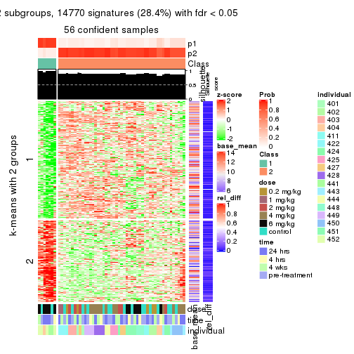</p>

</div>
<div id='tab-CV-hclust-get-signatures-2'>
<pre><code class="r">get_signatures(res, k = 3)
</code></pre>

<p>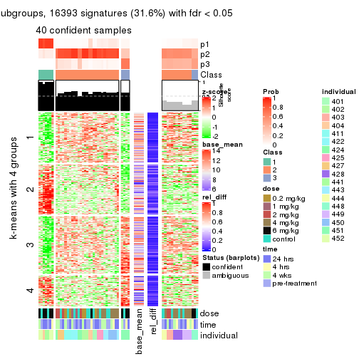</p>

</div>
<div id='tab-CV-hclust-get-signatures-3'>
<pre><code class="r">get_signatures(res, k = 4)
</code></pre>

<p>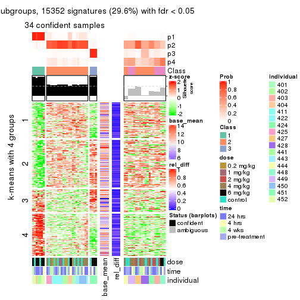</p>

</div>
<div id='tab-CV-hclust-get-signatures-4'>
<pre><code class="r">get_signatures(res, k = 5)
</code></pre>

<p>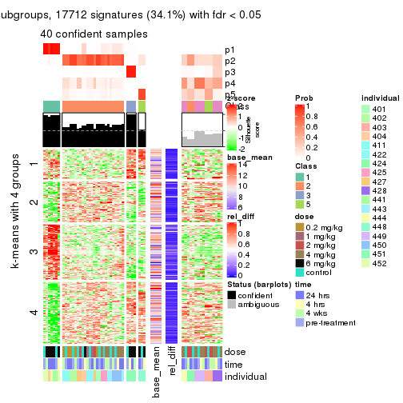</p>

</div>
<div id='tab-CV-hclust-get-signatures-5'>
<pre><code class="r">get_signatures(res, k = 6)
</code></pre>

<p>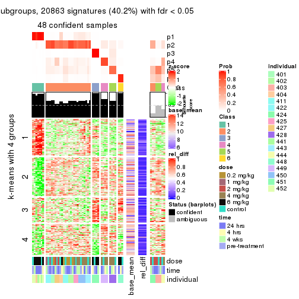</p>

</div>
</div>


Signature heatmaps where rows are not scaled:


<script>
$( function() {
	$( '#tabs-CV-hclust-get-signatures-no-scale' ).tabs();
} );
</script>
<div id='tabs-CV-hclust-get-signatures-no-scale'>
<ul>
<li><a href='#tab-CV-hclust-get-signatures-no-scale-1'>k = 2</a></li>
<li><a href='#tab-CV-hclust-get-signatures-no-scale-2'>k = 3</a></li>
<li><a href='#tab-CV-hclust-get-signatures-no-scale-3'>k = 4</a></li>
<li><a href='#tab-CV-hclust-get-signatures-no-scale-4'>k = 5</a></li>
<li><a href='#tab-CV-hclust-get-signatures-no-scale-5'>k = 6</a></li>
</ul>
<div id='tab-CV-hclust-get-signatures-no-scale-1'>
<pre><code class="r">get_signatures(res, k = 2, scale_rows = FALSE)
</code></pre>

<p>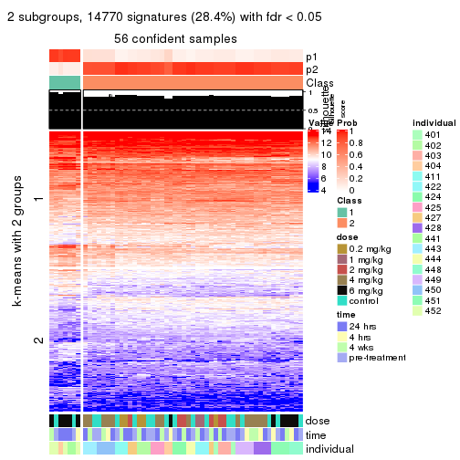</p>

</div>
<div id='tab-CV-hclust-get-signatures-no-scale-2'>
<pre><code class="r">get_signatures(res, k = 3, scale_rows = FALSE)
</code></pre>

<p>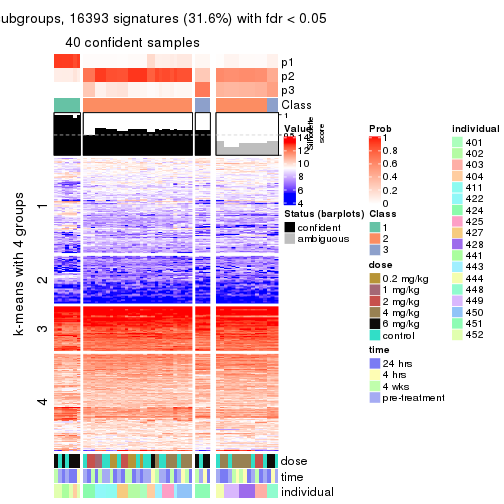</p>

</div>
<div id='tab-CV-hclust-get-signatures-no-scale-3'>
<pre><code class="r">get_signatures(res, k = 4, scale_rows = FALSE)
</code></pre>

<p>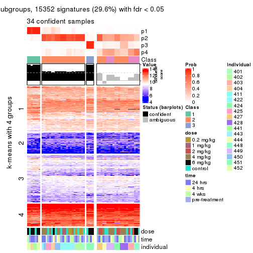</p>

</div>
<div id='tab-CV-hclust-get-signatures-no-scale-4'>
<pre><code class="r">get_signatures(res, k = 5, scale_rows = FALSE)
</code></pre>

<p>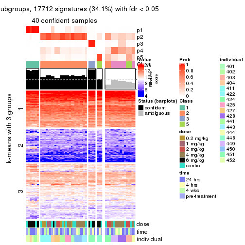</p>

</div>
<div id='tab-CV-hclust-get-signatures-no-scale-5'>
<pre><code class="r">get_signatures(res, k = 6, scale_rows = FALSE)
</code></pre>

<p></p>

</div>
</div>


Compare the overlap of signatures from different k:

```r
compare_signatures(res)
```

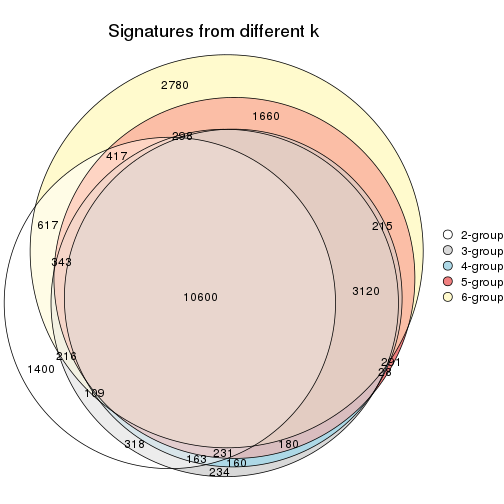

`get_signature()` returns a data frame invisibly. TO get the list of signatures, the function
call should be assigned to a variable explicitly. In following code, if `plot` argument is set
to `FALSE`, no heatmap is plotted while only the differential analysis is performed.

```r
# code only for demonstration
tb = get_signature(res, k = ..., plot = FALSE)
```

An example of the output of `tb` is:

```
#>   which_row         fdr    mean_1    mean_2 scaled_mean_1 scaled_mean_2 km
#> 1        38 0.042760348  8.373488  9.131774    -0.5533452     0.5164555  1
#> 2        40 0.018707592  7.106213  8.469186    -0.6173731     0.5762149  1
#> 3        55 0.019134737 10.221463 11.207825    -0.6159697     0.5749050  1
#> 4        59 0.006059896  5.921854  7.869574    -0.6899429     0.6439467  1
#> 5        60 0.018055526  8.928898 10.211722    -0.6204761     0.5791110  1
#> 6        98 0.009384629 15.714769 14.887706     0.6635654    -0.6193277  2
...
```

The columns in `tb` are:

1. `which_row`: row indices corresponding to the input matrix.
2. `fdr`: FDR for the differential test. 
3. `mean_x`: The mean value in group x.
4. `scaled_mean_x`: The mean value in group x after rows are scaled.
5. `km`: Row groups if k-means clustering is applied to rows.


UMAP plot which shows how samples are separated.


<script>
$( function() {
	$( '#tabs-CV-hclust-dimension-reduction' ).tabs();
} );
</script>
<div id='tabs-CV-hclust-dimension-reduction'>
<ul>
<li><a href='#tab-CV-hclust-dimension-reduction-1'>k = 2</a></li>
<li><a href='#tab-CV-hclust-dimension-reduction-2'>k = 3</a></li>
<li><a href='#tab-CV-hclust-dimension-reduction-3'>k = 4</a></li>
<li><a href='#tab-CV-hclust-dimension-reduction-4'>k = 5</a></li>
<li><a href='#tab-CV-hclust-dimension-reduction-5'>k = 6</a></li>
</ul>
<div id='tab-CV-hclust-dimension-reduction-1'>
<pre><code class="r">dimension_reduction(res, k = 2, method = &quot;UMAP&quot;)
</code></pre>

<p>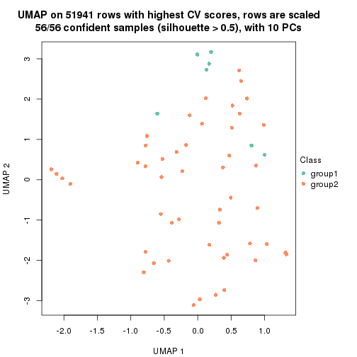</p>

</div>
<div id='tab-CV-hclust-dimension-reduction-2'>
<pre><code class="r">dimension_reduction(res, k = 3, method = &quot;UMAP&quot;)
</code></pre>

<p>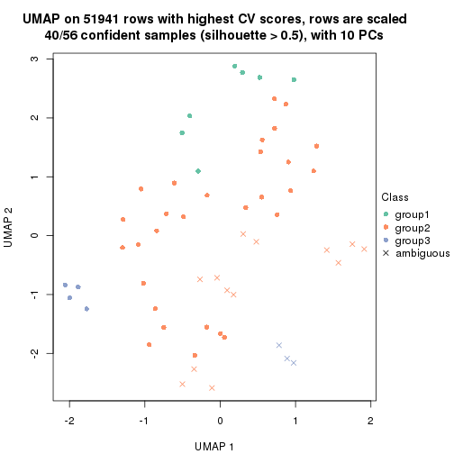</p>

</div>
<div id='tab-CV-hclust-dimension-reduction-3'>
<pre><code class="r">dimension_reduction(res, k = 4, method = &quot;UMAP&quot;)
</code></pre>

<p>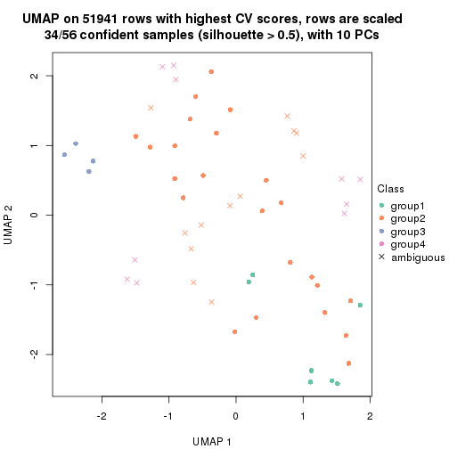</p>

</div>
<div id='tab-CV-hclust-dimension-reduction-4'>
<pre><code class="r">dimension_reduction(res, k = 5, method = &quot;UMAP&quot;)
</code></pre>

<p>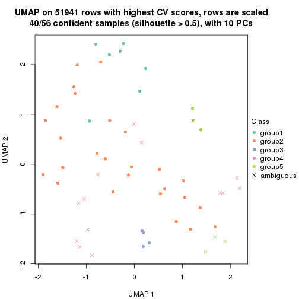</p>

</div>
<div id='tab-CV-hclust-dimension-reduction-5'>
<pre><code class="r">dimension_reduction(res, k = 6, method = &quot;UMAP&quot;)
</code></pre>

<p>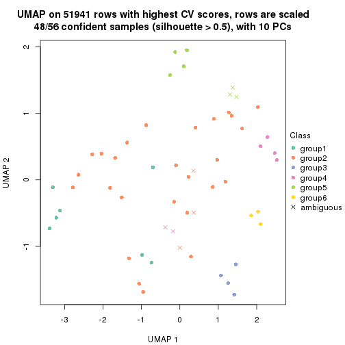</p>

</div>
</div>


Following heatmap shows how subgroups are split when increasing `k`:

```r
collect_classes(res)
```

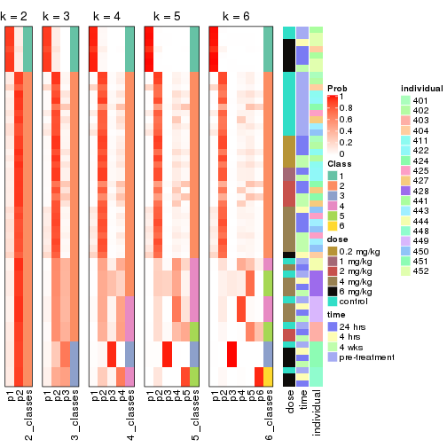


Test correlation between subgroups and known annotations. If the known
annotation is numeric, one-way ANOVA test is applied, and if the known
annotation is discrete, chi-squared contingency table test is applied.

```r
test_to_known_factors(res)
```

```
#>            n dose(p) time(p) individual(p) k
#> CV:hclust 56 0.01120   0.894      4.37e-05 2
#> CV:hclust 40 0.00762   0.904      3.39e-07 3
#> CV:hclust 34 0.01037   0.952      1.83e-06 4
#> CV:hclust 40 0.06661   0.934      3.27e-10 5
#> CV:hclust 48 0.03820   0.997      1.42e-19 6
```


If matrix rows can be associated to genes, consider to use `functional_enrichment(res,
...)` to perform function enrichment for the signature genes. See [this vignette](http://bioconductor.org/packages/devel/bioc/vignettes/cola/inst/doc/functional_enrichment.html) for more detailed explanations.


 

---------------------------------------------------


### CV:kmeans


The object with results only for a single top-value method and a single partition method 
can be extracted as:

```r
res = res_list["CV", "kmeans"]
# you can also extract it by
# res = res_list["CV:kmeans"]
```

A summary of `res` and all the functions that can be applied to it:

```r
res
```

```
#> A 'ConsensusPartition' object with k = 2, 3, 4, 5, 6.
#>   On a matrix with 51941 rows and 56 columns.
#>   Top rows (1000, 2000, 3000, 4000, 5000) are extracted by 'CV' method.
#>   Subgroups are detected by 'kmeans' method.
#>   Performed in total 1250 partitions by row resampling.
#>   Best k for subgroups seems to be 2.
#> 
#> Following methods can be applied to this 'ConsensusPartition' object:
#>  [1] "cola_report"             "collect_classes"         "collect_plots"          
#>  [4] "collect_stats"           "colnames"                "compare_signatures"     
#>  [7] "consensus_heatmap"       "dimension_reduction"     "functional_enrichment"  
#> [10] "get_anno_col"            "get_anno"                "get_classes"            
#> [13] "get_consensus"           "get_matrix"              "get_membership"         
#> [16] "get_param"               "get_signatures"          "get_stats"              
#> [19] "is_best_k"               "is_stable_k"             "membership_heatmap"     
#> [22] "ncol"                    "nrow"                    "plot_ecdf"              
#> [25] "rownames"                "select_partition_number" "show"                   
#> [28] "suggest_best_k"          "test_to_known_factors"
```

`collect_plots()` function collects all the plots made from `res` for all `k` (number of partitions)
into one single page to provide an easy and fast comparison between different `k`.

```r
collect_plots(res)
```

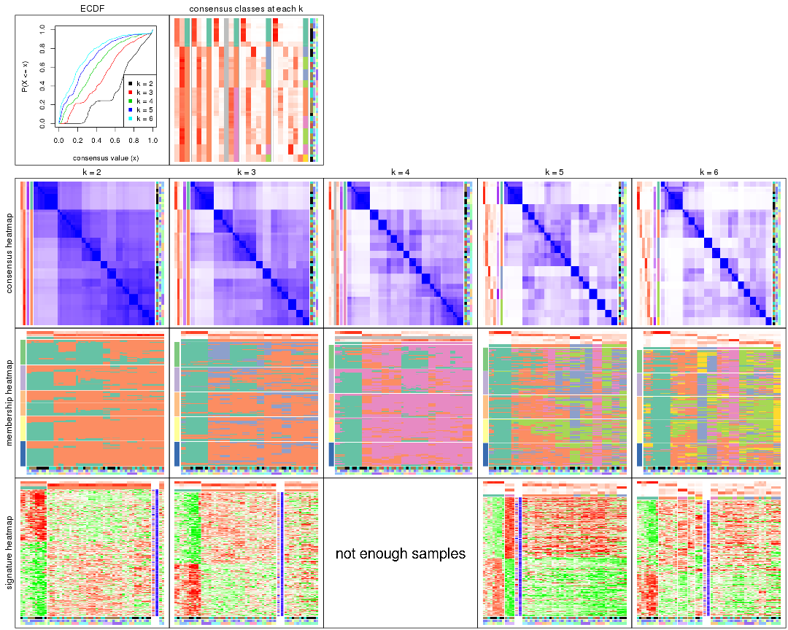

The plots are:

- The first row: a plot of the ECDF (empirical cumulative distribution
  function) curves of the consensus matrix for each `k` and the heatmap of
  predicted classes for each `k`.
- The second row: heatmaps of the consensus matrix for each `k`.
- The third row: heatmaps of the membership matrix for each `k`.
- The fouth row: heatmaps of the signatures for each `k`.

All the plots in panels can be made by individual functions and they are
plotted later in this section.

`select_partition_number()` produces several plots showing different
statistics for choosing "optimized" `k`. There are following statistics:

- ECDF curves of the consensus matrix for each `k`;
- 1-PAC. [The PAC
  score](https://en.wikipedia.org/wiki/Consensus_clustering#Over-interpretation_potential_of_consensus_clustering)
  measures the proportion of the ambiguous subgrouping.
- Mean silhouette score.
- Concordance. The mean probability of fiting the consensus class ids in all
  partitions.
- Area increased. Denote $A_k$ as the area under the ECDF curve for current
  `k`, the area increased is defined as $A_k - A_{k-1}$.
- Rand index. The percent of pairs of samples that are both in a same cluster
  or both are not in a same cluster in the partition of k and k-1.
- Jaccard index. The ratio of pairs of samples are both in a same cluster in
  the partition of k and k-1 and the pairs of samples are both in a same
  cluster in the partition k or k-1.

The detailed explanations of these statistics can be found in [the _cola_
vignette](http://bioconductor.org/packages/devel/bioc/vignettes/cola/inst/doc/cola.html#toc_13).

Generally speaking, lower PAC score, higher mean silhouette score or higher
concordance corresponds to better partition. Rand index and Jaccard index
measure how similar the current partition is compared to partition with `k-1`.
If they are too similar, we won't accept `k` is better than `k-1`.

```r
select_partition_number(res)
```

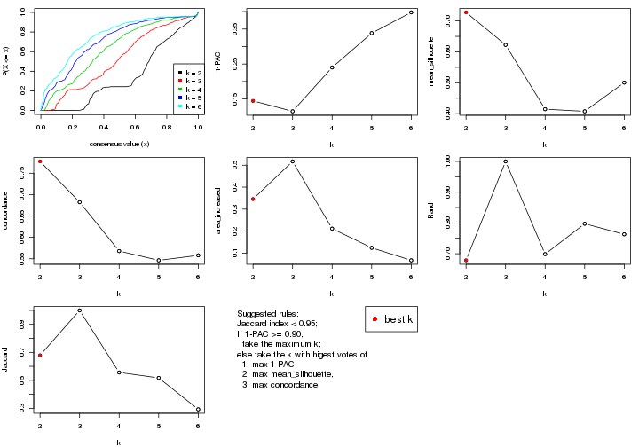

The numeric values for all these statistics can be obtained by `get_stats()`.

```r
get_stats(res)
```

```
#>   k 1-PAC mean_silhouette concordance area_increased  Rand Jaccard
#> 2 2 0.144           0.728       0.778         0.3457 0.679   0.679
#> 3 3 0.115           0.623       0.682         0.5172 1.000   1.000
#> 4 4 0.240           0.415       0.568         0.2112 0.699   0.556
#> 5 5 0.338           0.408       0.546         0.1240 0.797   0.517
#> 6 6 0.398           0.501       0.558         0.0671 0.763   0.293
```

`suggest_best_k()` suggests the best $k$ based on these statistics. The rules are as follows:

- All $k$ with Jaccard index larger than 0.95 are removed because increasing
  $k$ does not provide enough extra information. If all $k$ are removed, it is
  marked as no subgroup is detected.
- For all $k$ with 1-PAC score larger than 0.9, the maximal $k$ is taken as
  the best $k$, and other $k$ are marked as optional $k$.
- If it does not fit the second rule. The $k$ with the maximal vote of the
  highest 1-PAC score, highest mean silhouette, and highest concordance is
  taken as the best $k$.

```r
suggest_best_k(res)
```

```
#> [1] 2
```


Following shows the table of the partitions (You need to click the **show/hide
code output** link to see it). The membership matrix (columns with name `p*`)
is inferred by
[`clue::cl_consensus()`](https://www.rdocumentation.org/link/cl_consensus?package=clue)
function with the `SE` method. Basically the value in the membership matrix
represents the probability to belong to a certain group. The finall class
label for an item is determined with the group with highest probability it
belongs to.

In `get_classes()` function, the entropy is calculated from the membership
matrix and the silhouette score is calculated from the consensus matrix.


<script>
$( function() {
	$( '#tabs-CV-kmeans-get-classes' ).tabs();
} );
</script>
<div id='tabs-CV-kmeans-get-classes'>
<ul>
<li><a href='#tab-CV-kmeans-get-classes-1'>k = 2</a></li>
<li><a href='#tab-CV-kmeans-get-classes-2'>k = 3</a></li>
<li><a href='#tab-CV-kmeans-get-classes-3'>k = 4</a></li>
<li><a href='#tab-CV-kmeans-get-classes-4'>k = 5</a></li>
<li><a href='#tab-CV-kmeans-get-classes-5'>k = 6</a></li>
</ul>

<div id='tab-CV-kmeans-get-classes-1'>
<p><a id='tab-CV-kmeans-get-classes-1-a' style='color:#0366d6' href='#'>show/hide code output</a></p>
<pre><code class="r">cbind(get_classes(res, k = 2), get_membership(res, k = 2))
</code></pre>

<pre><code>#&gt;           class entropy silhouette    p1    p2
#&gt; GSM687644     2  0.8499      0.659 0.276 0.724
#&gt; GSM687648     2  0.9000      0.524 0.316 0.684
#&gt; GSM687653     2  0.3733      0.747 0.072 0.928
#&gt; GSM687658     2  0.8955      0.527 0.312 0.688
#&gt; GSM687663     2  0.2236      0.757 0.036 0.964
#&gt; GSM687668     2  0.4022      0.758 0.080 0.920
#&gt; GSM687673     2  0.4022      0.745 0.080 0.920
#&gt; GSM687678     2  0.8555      0.584 0.280 0.720
#&gt; GSM687683     2  0.7815      0.694 0.232 0.768
#&gt; GSM687688     2  0.4298      0.744 0.088 0.912
#&gt; GSM687695     1  0.8813      0.973 0.700 0.300
#&gt; GSM687699     2  0.9129      0.495 0.328 0.672
#&gt; GSM687704     2  0.0938      0.756 0.012 0.988
#&gt; GSM687707     2  0.7745      0.680 0.228 0.772
#&gt; GSM687712     2  0.7815      0.693 0.232 0.768
#&gt; GSM687719     1  0.9323      0.912 0.652 0.348
#&gt; GSM687724     2  0.5946      0.687 0.144 0.856
#&gt; GSM687728     1  0.8813      0.973 0.700 0.300
#&gt; GSM687646     2  0.8207      0.680 0.256 0.744
#&gt; GSM687649     2  0.9000      0.524 0.316 0.684
#&gt; GSM687665     2  0.3431      0.754 0.064 0.936
#&gt; GSM687651     2  0.9000      0.524 0.316 0.684
#&gt; GSM687667     2  0.1843      0.758 0.028 0.972
#&gt; GSM687670     2  0.3584      0.759 0.068 0.932
#&gt; GSM687671     2  0.3431      0.759 0.064 0.936
#&gt; GSM687654     2  0.3733      0.747 0.072 0.928
#&gt; GSM687675     2  0.4022      0.745 0.080 0.920
#&gt; GSM687685     2  0.7883      0.690 0.236 0.764
#&gt; GSM687656     2  0.3733      0.747 0.072 0.928
#&gt; GSM687677     2  0.4161      0.743 0.084 0.916
#&gt; GSM687687     2  0.7139      0.711 0.196 0.804
#&gt; GSM687692     2  0.4298      0.744 0.088 0.912
#&gt; GSM687716     2  0.7815      0.693 0.232 0.768
#&gt; GSM687722     1  0.9358      0.903 0.648 0.352
#&gt; GSM687680     2  0.8861      0.546 0.304 0.696
#&gt; GSM687690     2  0.4298      0.744 0.088 0.912
#&gt; GSM687700     1  0.8813      0.960 0.700 0.300
#&gt; GSM687705     2  0.1184      0.755 0.016 0.984
#&gt; GSM687714     2  0.7815      0.693 0.232 0.768
#&gt; GSM687721     1  0.8909      0.965 0.692 0.308
#&gt; GSM687682     2  0.8813      0.540 0.300 0.700
#&gt; GSM687694     2  0.4298      0.744 0.088 0.912
#&gt; GSM687702     2  0.9044      0.514 0.320 0.680
#&gt; GSM687718     2  0.7815      0.693 0.232 0.768
#&gt; GSM687723     2  0.9358      0.403 0.352 0.648
#&gt; GSM687661     2  0.8955      0.527 0.312 0.688
#&gt; GSM687710     2  0.7745      0.680 0.228 0.772
#&gt; GSM687726     2  0.5946      0.687 0.144 0.856
#&gt; GSM687730     1  0.8813      0.973 0.700 0.300
#&gt; GSM687660     1  0.8861      0.968 0.696 0.304
#&gt; GSM687697     1  0.8813      0.973 0.700 0.300
#&gt; GSM687709     2  0.7745      0.680 0.228 0.772
#&gt; GSM687725     2  0.5946      0.687 0.144 0.856
#&gt; GSM687729     1  0.8813      0.973 0.700 0.300
#&gt; GSM687727     2  0.5629      0.690 0.132 0.868
#&gt; GSM687731     1  0.8813      0.973 0.700 0.300
</code></pre>

<script>
$('#tab-CV-kmeans-get-classes-1-a').parent().next().next().hide();
$('#tab-CV-kmeans-get-classes-1-a').click(function(){
  $('#tab-CV-kmeans-get-classes-1-a').parent().next().next().toggle();
  return(false);
});
</script>
</div>

<div id='tab-CV-kmeans-get-classes-2'>
<p><a id='tab-CV-kmeans-get-classes-2-a' style='color:#0366d6' href='#'>show/hide code output</a></p>
<pre><code class="r">cbind(get_classes(res, k = 3), get_membership(res, k = 3))
</code></pre>

<pre><code>#&gt;           class entropy silhouette    p1    p2    p3
#&gt; GSM687644     2   0.801      0.585 0.092 0.612 0.296
#&gt; GSM687648     2   0.873      0.498 0.260 0.580 0.160
#&gt; GSM687653     2   0.628      0.617 0.040 0.736 0.224
#&gt; GSM687658     2   0.807      0.476 0.316 0.596 0.088
#&gt; GSM687663     2   0.390      0.656 0.060 0.888 0.052
#&gt; GSM687668     2   0.371      0.665 0.032 0.892 0.076
#&gt; GSM687673     2   0.582      0.630 0.064 0.792 0.144
#&gt; GSM687678     2   0.842      0.521 0.252 0.608 0.140
#&gt; GSM687683     2   0.780      0.583 0.088 0.636 0.276
#&gt; GSM687688     2   0.611      0.606 0.048 0.760 0.192
#&gt; GSM687695     1   0.312      0.920 0.892 0.108 0.000
#&gt; GSM687699     2   0.851      0.473 0.296 0.580 0.124
#&gt; GSM687704     2   0.365      0.662 0.036 0.896 0.068
#&gt; GSM687707     2   0.894      0.493 0.164 0.552 0.284
#&gt; GSM687712     2   0.774      0.556 0.060 0.584 0.356
#&gt; GSM687719     1   0.716      0.675 0.680 0.256 0.064
#&gt; GSM687724     2   0.727      0.485 0.040 0.608 0.352
#&gt; GSM687728     1   0.343      0.920 0.884 0.112 0.004
#&gt; GSM687646     2   0.780      0.590 0.080 0.624 0.296
#&gt; GSM687649     2   0.873      0.498 0.260 0.580 0.160
#&gt; GSM687665     2   0.390      0.657 0.056 0.888 0.056
#&gt; GSM687651     2   0.870      0.503 0.256 0.584 0.160
#&gt; GSM687667     2   0.369      0.658 0.052 0.896 0.052
#&gt; GSM687670     2   0.371      0.665 0.032 0.892 0.076
#&gt; GSM687671     2   0.355      0.666 0.024 0.896 0.080
#&gt; GSM687654     2   0.628      0.617 0.040 0.736 0.224
#&gt; GSM687675     2   0.582      0.630 0.064 0.792 0.144
#&gt; GSM687685     2   0.780      0.583 0.088 0.636 0.276
#&gt; GSM687656     2   0.628      0.617 0.040 0.736 0.224
#&gt; GSM687677     2   0.563      0.632 0.056 0.800 0.144
#&gt; GSM687687     2   0.725      0.599 0.060 0.664 0.276
#&gt; GSM687692     2   0.611      0.606 0.048 0.760 0.192
#&gt; GSM687716     2   0.774      0.556 0.060 0.584 0.356
#&gt; GSM687722     1   0.716      0.675 0.680 0.256 0.064
#&gt; GSM687680     2   0.851      0.507 0.264 0.596 0.140
#&gt; GSM687690     2   0.611      0.606 0.048 0.760 0.192
#&gt; GSM687700     1   0.377      0.894 0.880 0.104 0.016
#&gt; GSM687705     2   0.376      0.661 0.040 0.892 0.068
#&gt; GSM687714     2   0.774      0.556 0.060 0.584 0.356
#&gt; GSM687721     1   0.441      0.895 0.852 0.124 0.024
#&gt; GSM687682     2   0.846      0.500 0.272 0.596 0.132
#&gt; GSM687694     2   0.611      0.606 0.048 0.760 0.192
#&gt; GSM687702     2   0.851      0.478 0.296 0.580 0.124
#&gt; GSM687718     2   0.774      0.556 0.060 0.584 0.356
#&gt; GSM687723     2   0.848      0.312 0.380 0.524 0.096
#&gt; GSM687661     2   0.800      0.486 0.304 0.608 0.088
#&gt; GSM687710     2   0.894      0.493 0.164 0.552 0.284
#&gt; GSM687726     2   0.727      0.485 0.040 0.608 0.352
#&gt; GSM687730     1   0.343      0.920 0.884 0.112 0.004
#&gt; GSM687660     1   0.296      0.915 0.900 0.100 0.000
#&gt; GSM687697     1   0.312      0.920 0.892 0.108 0.000
#&gt; GSM687709     2   0.894      0.493 0.164 0.552 0.284
#&gt; GSM687725     2   0.727      0.485 0.040 0.608 0.352
#&gt; GSM687729     1   0.343      0.920 0.884 0.112 0.004
#&gt; GSM687727     2   0.727      0.485 0.040 0.608 0.352
#&gt; GSM687731     1   0.343      0.920 0.884 0.112 0.004
</code></pre>

<script>
$('#tab-CV-kmeans-get-classes-2-a').parent().next().next().hide();
$('#tab-CV-kmeans-get-classes-2-a').click(function(){
  $('#tab-CV-kmeans-get-classes-2-a').parent().next().next().toggle();
  return(false);
});
</script>
</div>

<div id='tab-CV-kmeans-get-classes-3'>
<p><a id='tab-CV-kmeans-get-classes-3-a' style='color:#0366d6' href='#'>show/hide code output</a></p>
<pre><code class="r">cbind(get_classes(res, k = 4), get_membership(res, k = 4))
</code></pre>

<pre><code>#&gt;           class entropy silhouette    p1    p2 p3    p4
#&gt; GSM687644     4   0.559     0.4523 0.052 0.064 NA 0.772
#&gt; GSM687648     4   0.575     0.4772 0.148 0.052 NA 0.752
#&gt; GSM687653     2   0.751     0.4277 0.028 0.524 NA 0.344
#&gt; GSM687658     4   0.594     0.4646 0.220 0.052 NA 0.704
#&gt; GSM687663     4   0.589    -0.2294 0.020 0.456 NA 0.516
#&gt; GSM687668     4   0.626     0.0162 0.004 0.344 NA 0.592
#&gt; GSM687673     2   0.668     0.4889 0.020 0.572 NA 0.352
#&gt; GSM687678     4   0.464     0.4903 0.152 0.028 NA 0.800
#&gt; GSM687683     4   0.607     0.4279 0.032 0.072 NA 0.720
#&gt; GSM687688     2   0.844     0.4257 0.036 0.444 NA 0.312
#&gt; GSM687695     1   0.194     0.8769 0.924 0.000 NA 0.076
#&gt; GSM687699     4   0.563     0.4776 0.192 0.016 NA 0.732
#&gt; GSM687704     2   0.618     0.3101 0.012 0.500 NA 0.460
#&gt; GSM687707     4   0.891    -0.0718 0.048 0.324 NA 0.348
#&gt; GSM687712     4   0.721     0.2914 0.008 0.128 NA 0.540
#&gt; GSM687719     1   0.750     0.4256 0.516 0.040 NA 0.364
#&gt; GSM687724     2   0.684     0.4794 0.048 0.680 NA 0.152
#&gt; GSM687728     1   0.205     0.8754 0.924 0.000 NA 0.072
#&gt; GSM687646     4   0.526     0.4444 0.036 0.064 NA 0.788
#&gt; GSM687649     4   0.575     0.4772 0.148 0.052 NA 0.752
#&gt; GSM687665     4   0.597    -0.2127 0.024 0.444 NA 0.524
#&gt; GSM687651     4   0.570     0.4780 0.144 0.052 NA 0.756
#&gt; GSM687667     4   0.589    -0.2294 0.020 0.456 NA 0.516
#&gt; GSM687670     4   0.626     0.0162 0.004 0.344 NA 0.592
#&gt; GSM687671     4   0.626     0.0162 0.004 0.344 NA 0.592
#&gt; GSM687654     2   0.751     0.4277 0.028 0.524 NA 0.344
#&gt; GSM687675     2   0.668     0.4889 0.020 0.572 NA 0.352
#&gt; GSM687685     4   0.605     0.4301 0.032 0.068 NA 0.720
#&gt; GSM687656     2   0.751     0.4277 0.028 0.524 NA 0.344
#&gt; GSM687677     2   0.666     0.4920 0.020 0.580 NA 0.344
#&gt; GSM687687     4   0.625     0.3801 0.008 0.120 NA 0.684
#&gt; GSM687692     2   0.844     0.4257 0.036 0.444 NA 0.312
#&gt; GSM687716     4   0.721     0.2914 0.008 0.128 NA 0.540
#&gt; GSM687722     1   0.751     0.4132 0.512 0.040 NA 0.368
#&gt; GSM687680     4   0.473     0.4915 0.168 0.024 NA 0.788
#&gt; GSM687690     2   0.844     0.4257 0.036 0.444 NA 0.312
#&gt; GSM687700     1   0.396     0.8237 0.820 0.000 NA 0.152
#&gt; GSM687705     2   0.618     0.3101 0.012 0.500 NA 0.460
#&gt; GSM687714     4   0.721     0.2914 0.008 0.128 NA 0.540
#&gt; GSM687721     1   0.521     0.8056 0.768 0.008 NA 0.144
#&gt; GSM687682     4   0.486     0.4888 0.180 0.024 NA 0.776
#&gt; GSM687694     2   0.844     0.4257 0.036 0.444 NA 0.312
#&gt; GSM687702     4   0.508     0.4824 0.180 0.012 NA 0.764
#&gt; GSM687718     4   0.721     0.2914 0.008 0.128 NA 0.540
#&gt; GSM687723     4   0.726     0.3604 0.260 0.048 NA 0.608
#&gt; GSM687661     4   0.584     0.4702 0.208 0.052 NA 0.716
#&gt; GSM687710     4   0.891    -0.0718 0.048 0.324 NA 0.348
#&gt; GSM687726     2   0.684     0.4794 0.048 0.680 NA 0.152
#&gt; GSM687730     1   0.205     0.8754 0.924 0.000 NA 0.072
#&gt; GSM687660     1   0.233     0.8729 0.908 0.000 NA 0.088
#&gt; GSM687697     1   0.194     0.8769 0.924 0.000 NA 0.076
#&gt; GSM687709     4   0.891    -0.0718 0.048 0.324 NA 0.348
#&gt; GSM687725     2   0.684     0.4794 0.048 0.680 NA 0.152
#&gt; GSM687729     1   0.205     0.8754 0.924 0.000 NA 0.072
#&gt; GSM687727     2   0.663     0.4823 0.044 0.696 NA 0.140
#&gt; GSM687731     1   0.213     0.8766 0.920 0.000 NA 0.076
</code></pre>

<script>
$('#tab-CV-kmeans-get-classes-3-a').parent().next().next().hide();
$('#tab-CV-kmeans-get-classes-3-a').click(function(){
  $('#tab-CV-kmeans-get-classes-3-a').parent().next().next().toggle();
  return(false);
});
</script>
</div>

<div id='tab-CV-kmeans-get-classes-4'>
<p><a id='tab-CV-kmeans-get-classes-4-a' style='color:#0366d6' href='#'>show/hide code output</a></p>
<pre><code class="r">cbind(get_classes(res, k = 5), get_membership(res, k = 5))
</code></pre>

<pre><code>#&gt;           class entropy silhouette    p1    p2    p3    p4    p5
#&gt; GSM687644     2   0.648     0.0742 0.028 0.604 0.024 0.268 0.076
#&gt; GSM687648     2   0.531     0.4588 0.116 0.756 0.032 0.028 0.068
#&gt; GSM687653     5   0.720     0.2123 0.004 0.216 0.212 0.044 0.524
#&gt; GSM687658     2   0.627     0.4921 0.168 0.680 0.060 0.060 0.032
#&gt; GSM687663     2   0.748    -0.2728 0.008 0.428 0.356 0.044 0.164
#&gt; GSM687668     2   0.789     0.0535 0.012 0.496 0.228 0.116 0.148
#&gt; GSM687673     3   0.756     0.2721 0.008 0.288 0.372 0.024 0.308
#&gt; GSM687678     2   0.570     0.4861 0.120 0.736 0.044 0.052 0.048
#&gt; GSM687683     2   0.666     0.1282 0.008 0.576 0.068 0.284 0.064
#&gt; GSM687688     5   0.876     0.3024 0.028 0.264 0.236 0.116 0.356
#&gt; GSM687695     1   0.128     0.9266 0.952 0.044 0.000 0.000 0.004
#&gt; GSM687699     2   0.528     0.4555 0.156 0.736 0.008 0.036 0.064
#&gt; GSM687704     3   0.821     0.2435 0.012 0.348 0.364 0.096 0.180
#&gt; GSM687707     5   0.905     0.2666 0.040 0.216 0.172 0.208 0.364
#&gt; GSM687712     4   0.488     1.0000 0.004 0.248 0.040 0.700 0.008
#&gt; GSM687719     2   0.801     0.1783 0.340 0.444 0.052 0.096 0.068
#&gt; GSM687724     3   0.177     0.4403 0.016 0.052 0.932 0.000 0.000
#&gt; GSM687728     1   0.137     0.9266 0.952 0.040 0.004 0.000 0.004
#&gt; GSM687646     2   0.623     0.0517 0.016 0.616 0.024 0.268 0.076
#&gt; GSM687649     2   0.526     0.4585 0.112 0.760 0.032 0.028 0.068
#&gt; GSM687665     2   0.748    -0.2728 0.008 0.428 0.356 0.044 0.164
#&gt; GSM687651     2   0.526     0.4585 0.112 0.760 0.032 0.028 0.068
#&gt; GSM687667     2   0.748    -0.2728 0.008 0.428 0.356 0.044 0.164
#&gt; GSM687670     2   0.789     0.0535 0.012 0.496 0.228 0.116 0.148
#&gt; GSM687671     2   0.795     0.0541 0.012 0.492 0.224 0.124 0.148
#&gt; GSM687654     5   0.720     0.2123 0.004 0.216 0.212 0.044 0.524
#&gt; GSM687675     3   0.756     0.2721 0.008 0.288 0.372 0.024 0.308
#&gt; GSM687685     2   0.674     0.1084 0.008 0.568 0.068 0.288 0.068
#&gt; GSM687656     5   0.720     0.2123 0.004 0.216 0.212 0.044 0.524
#&gt; GSM687677     3   0.755     0.2675 0.008 0.276 0.380 0.024 0.312
#&gt; GSM687687     2   0.703    -0.0182 0.004 0.516 0.084 0.320 0.076
#&gt; GSM687692     5   0.876     0.3024 0.028 0.264 0.236 0.116 0.356
#&gt; GSM687716     4   0.488     1.0000 0.004 0.248 0.040 0.700 0.008
#&gt; GSM687722     2   0.801     0.1783 0.340 0.444 0.052 0.096 0.068
#&gt; GSM687680     2   0.574     0.4862 0.124 0.732 0.044 0.052 0.048
#&gt; GSM687690     5   0.876     0.3024 0.028 0.264 0.236 0.116 0.356
#&gt; GSM687700     1   0.483     0.7510 0.732 0.208 0.004 0.028 0.028
#&gt; GSM687705     3   0.829     0.2479 0.016 0.344 0.364 0.096 0.180
#&gt; GSM687714     4   0.488     1.0000 0.004 0.248 0.040 0.700 0.008
#&gt; GSM687721     1   0.591     0.6837 0.684 0.184 0.008 0.076 0.048
#&gt; GSM687682     2   0.583     0.4869 0.132 0.724 0.044 0.052 0.048
#&gt; GSM687694     5   0.876     0.3024 0.028 0.264 0.236 0.116 0.356
#&gt; GSM687702     2   0.484     0.4658 0.152 0.764 0.008 0.032 0.044
#&gt; GSM687718     4   0.488     1.0000 0.004 0.248 0.040 0.700 0.008
#&gt; GSM687723     2   0.772     0.4214 0.220 0.552 0.056 0.100 0.072
#&gt; GSM687661     2   0.630     0.4898 0.156 0.684 0.064 0.060 0.036
#&gt; GSM687710     5   0.905     0.2666 0.040 0.216 0.172 0.208 0.364
#&gt; GSM687726     3   0.177     0.4403 0.016 0.052 0.932 0.000 0.000
#&gt; GSM687730     1   0.120     0.9268 0.956 0.040 0.004 0.000 0.000
#&gt; GSM687660     1   0.199     0.9180 0.928 0.052 0.004 0.012 0.004
#&gt; GSM687697     1   0.128     0.9266 0.952 0.044 0.000 0.000 0.004
#&gt; GSM687709     5   0.905     0.2666 0.040 0.216 0.172 0.208 0.364
#&gt; GSM687725     3   0.177     0.4403 0.016 0.052 0.932 0.000 0.000
#&gt; GSM687729     1   0.120     0.9268 0.956 0.040 0.004 0.000 0.000
#&gt; GSM687727     3   0.184     0.4396 0.016 0.056 0.928 0.000 0.000
#&gt; GSM687731     1   0.137     0.9266 0.952 0.040 0.004 0.000 0.004
</code></pre>

<script>
$('#tab-CV-kmeans-get-classes-4-a').parent().next().next().hide();
$('#tab-CV-kmeans-get-classes-4-a').click(function(){
  $('#tab-CV-kmeans-get-classes-4-a').parent().next().next().toggle();
  return(false);
});
</script>
</div>

<div id='tab-CV-kmeans-get-classes-5'>
<p><a id='tab-CV-kmeans-get-classes-5-a' style='color:#0366d6' href='#'>show/hide code output</a></p>
<pre><code class="r">cbind(get_classes(res, k = 6), get_membership(res, k = 6))
</code></pre>

<pre><code>#&gt;           class entropy silhouette    p1    p2    p3    p4    p5    p6
#&gt; GSM687644     4  0.6407     0.1249 0.004 0.348 0.008 0.468 0.152 0.020
#&gt; GSM687648     2  0.6089     0.6053 0.068 0.632 0.000 0.160 0.124 0.016
#&gt; GSM687653     5  0.7121     0.2646 0.000 0.148 0.108 0.048 0.552 0.144
#&gt; GSM687658     2  0.8861     0.4629 0.164 0.304 0.020 0.220 0.224 0.068
#&gt; GSM687663     5  0.5576     0.5251 0.020 0.132 0.016 0.120 0.692 0.020
#&gt; GSM687668     5  0.6636     0.3664 0.012 0.140 0.032 0.284 0.520 0.012
#&gt; GSM687673     5  0.6069     0.3891 0.016 0.072 0.096 0.052 0.688 0.076
#&gt; GSM687678     2  0.8273     0.5287 0.068 0.392 0.020 0.240 0.212 0.068
#&gt; GSM687683     4  0.7143     0.4014 0.012 0.240 0.016 0.500 0.172 0.060
#&gt; GSM687688     3  0.6467     0.3656 0.004 0.044 0.512 0.120 0.312 0.008
#&gt; GSM687695     1  0.0291     0.7719 0.992 0.004 0.000 0.000 0.000 0.004
#&gt; GSM687699     2  0.6062     0.5561 0.128 0.656 0.016 0.124 0.068 0.008
#&gt; GSM687704     5  0.5907     0.4956 0.020 0.060 0.048 0.160 0.680 0.032
#&gt; GSM687707     6  0.6052     0.9971 0.024 0.072 0.008 0.048 0.216 0.632
#&gt; GSM687712     4  0.1637     0.6182 0.004 0.000 0.004 0.932 0.056 0.004
#&gt; GSM687719     1  0.8772    -0.0828 0.348 0.292 0.040 0.108 0.104 0.108
#&gt; GSM687724     3  0.6937     0.4387 0.020 0.028 0.440 0.012 0.352 0.148
#&gt; GSM687728     1  0.0653     0.7710 0.980 0.004 0.000 0.004 0.000 0.012
#&gt; GSM687646     4  0.6407     0.1249 0.004 0.348 0.008 0.468 0.152 0.020
#&gt; GSM687649     2  0.6089     0.6053 0.068 0.632 0.000 0.160 0.124 0.016
#&gt; GSM687665     5  0.5576     0.5251 0.020 0.132 0.016 0.120 0.692 0.020
#&gt; GSM687651     2  0.6089     0.6053 0.068 0.632 0.000 0.160 0.124 0.016
#&gt; GSM687667     5  0.5495     0.5294 0.016 0.132 0.016 0.120 0.696 0.020
#&gt; GSM687670     5  0.6607     0.3665 0.012 0.136 0.032 0.284 0.524 0.012
#&gt; GSM687671     5  0.6620     0.3641 0.012 0.136 0.032 0.288 0.520 0.012
#&gt; GSM687654     5  0.7121     0.2646 0.000 0.148 0.108 0.048 0.552 0.144
#&gt; GSM687675     5  0.6069     0.3891 0.016 0.072 0.096 0.052 0.688 0.076
#&gt; GSM687685     4  0.7142     0.3974 0.012 0.252 0.016 0.496 0.164 0.060
#&gt; GSM687656     5  0.7121     0.2646 0.000 0.148 0.108 0.048 0.552 0.144
#&gt; GSM687677     5  0.6069     0.3891 0.016 0.072 0.096 0.052 0.688 0.076
#&gt; GSM687687     4  0.6900     0.4551 0.008 0.212 0.016 0.536 0.168 0.060
#&gt; GSM687692     3  0.6421     0.3654 0.004 0.048 0.512 0.120 0.312 0.004
#&gt; GSM687716     4  0.1637     0.6182 0.004 0.000 0.004 0.932 0.056 0.004
#&gt; GSM687722     1  0.8772    -0.0828 0.348 0.292 0.040 0.108 0.104 0.108
#&gt; GSM687680     2  0.8273     0.5287 0.068 0.392 0.020 0.240 0.212 0.068
#&gt; GSM687690     3  0.6572     0.3636 0.004 0.052 0.504 0.120 0.312 0.008
#&gt; GSM687700     1  0.3902     0.6171 0.732 0.240 0.012 0.012 0.000 0.004
#&gt; GSM687705     5  0.5874     0.4944 0.020 0.060 0.048 0.156 0.684 0.032
#&gt; GSM687714     4  0.1637     0.6182 0.004 0.000 0.004 0.932 0.056 0.004
#&gt; GSM687721     1  0.6003     0.5472 0.624 0.216 0.036 0.020 0.004 0.100
#&gt; GSM687682     2  0.8337     0.5285 0.076 0.388 0.020 0.236 0.212 0.068
#&gt; GSM687694     3  0.6467     0.3656 0.004 0.044 0.512 0.120 0.312 0.008
#&gt; GSM687702     2  0.6234     0.6051 0.120 0.612 0.008 0.160 0.100 0.000
#&gt; GSM687718     4  0.1637     0.6182 0.004 0.000 0.004 0.932 0.056 0.004
#&gt; GSM687723     2  0.9150     0.3522 0.204 0.336 0.040 0.152 0.160 0.108
#&gt; GSM687661     2  0.8874     0.4542 0.164 0.296 0.020 0.228 0.224 0.068
#&gt; GSM687710     6  0.6052     0.9971 0.024 0.072 0.008 0.048 0.216 0.632
#&gt; GSM687726     3  0.6997     0.4381 0.020 0.032 0.436 0.012 0.352 0.148
#&gt; GSM687730     1  0.0508     0.7713 0.984 0.004 0.000 0.000 0.000 0.012
#&gt; GSM687660     1  0.1109     0.7664 0.964 0.016 0.004 0.004 0.000 0.012
#&gt; GSM687697     1  0.0291     0.7719 0.992 0.004 0.000 0.000 0.000 0.004
#&gt; GSM687709     6  0.6146     0.9942 0.024 0.080 0.008 0.048 0.216 0.624
#&gt; GSM687725     3  0.6937     0.4387 0.020 0.028 0.440 0.012 0.352 0.148
#&gt; GSM687729     1  0.0508     0.7713 0.984 0.004 0.000 0.000 0.000 0.012
#&gt; GSM687727     3  0.6879     0.4372 0.020 0.024 0.440 0.012 0.356 0.148
#&gt; GSM687731     1  0.0653     0.7710 0.980 0.004 0.000 0.004 0.000 0.012
</code></pre>

<script>
$('#tab-CV-kmeans-get-classes-5-a').parent().next().next().hide();
$('#tab-CV-kmeans-get-classes-5-a').click(function(){
  $('#tab-CV-kmeans-get-classes-5-a').parent().next().next().toggle();
  return(false);
});
</script>
</div>
</div>

Heatmaps for the consensus matrix. It visualizes the probability of two
samples to be in a same group.


<script>
$( function() {
	$( '#tabs-CV-kmeans-consensus-heatmap' ).tabs();
} );
</script>
<div id='tabs-CV-kmeans-consensus-heatmap'>
<ul>
<li><a href='#tab-CV-kmeans-consensus-heatmap-1'>k = 2</a></li>
<li><a href='#tab-CV-kmeans-consensus-heatmap-2'>k = 3</a></li>
<li><a href='#tab-CV-kmeans-consensus-heatmap-3'>k = 4</a></li>
<li><a href='#tab-CV-kmeans-consensus-heatmap-4'>k = 5</a></li>
<li><a href='#tab-CV-kmeans-consensus-heatmap-5'>k = 6</a></li>
</ul>
<div id='tab-CV-kmeans-consensus-heatmap-1'>
<pre><code class="r">consensus_heatmap(res, k = 2)
</code></pre>

<p>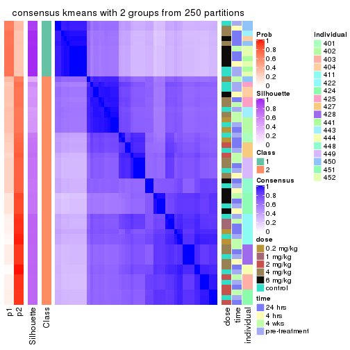</p>

</div>
<div id='tab-CV-kmeans-consensus-heatmap-2'>
<pre><code class="r">consensus_heatmap(res, k = 3)
</code></pre>

<p>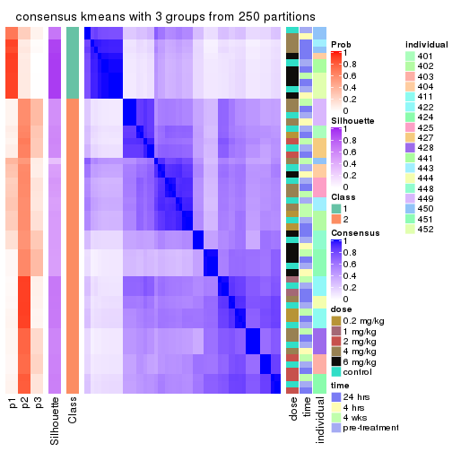</p>

</div>
<div id='tab-CV-kmeans-consensus-heatmap-3'>
<pre><code class="r">consensus_heatmap(res, k = 4)
</code></pre>

<p>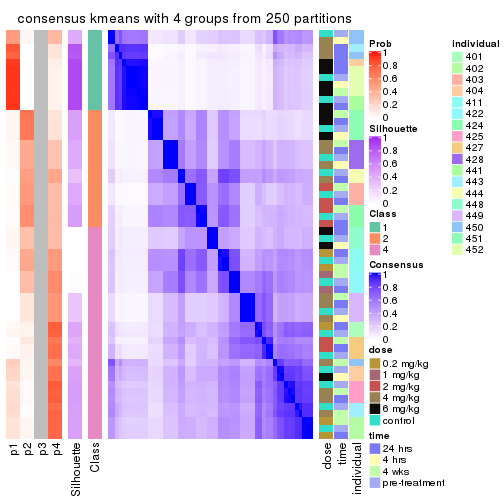</p>

</div>
<div id='tab-CV-kmeans-consensus-heatmap-4'>
<pre><code class="r">consensus_heatmap(res, k = 5)
</code></pre>

<p>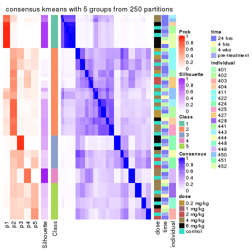</p>

</div>
<div id='tab-CV-kmeans-consensus-heatmap-5'>
<pre><code class="r">consensus_heatmap(res, k = 6)
</code></pre>

<p>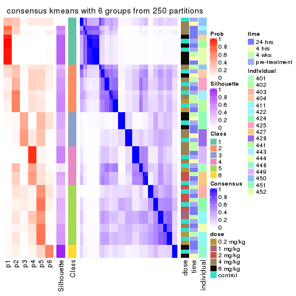</p>

</div>
</div>

Heatmaps for the membership of samples in all partitions to see how consistent they are:


<script>
$( function() {
	$( '#tabs-CV-kmeans-membership-heatmap' ).tabs();
} );
</script>
<div id='tabs-CV-kmeans-membership-heatmap'>
<ul>
<li><a href='#tab-CV-kmeans-membership-heatmap-1'>k = 2</a></li>
<li><a href='#tab-CV-kmeans-membership-heatmap-2'>k = 3</a></li>
<li><a href='#tab-CV-kmeans-membership-heatmap-3'>k = 4</a></li>
<li><a href='#tab-CV-kmeans-membership-heatmap-4'>k = 5</a></li>
<li><a href='#tab-CV-kmeans-membership-heatmap-5'>k = 6</a></li>
</ul>
<div id='tab-CV-kmeans-membership-heatmap-1'>
<pre><code class="r">membership_heatmap(res, k = 2)
</code></pre>

<p>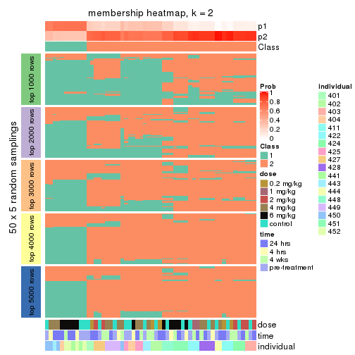</p>

</div>
<div id='tab-CV-kmeans-membership-heatmap-2'>
<pre><code class="r">membership_heatmap(res, k = 3)
</code></pre>

<p>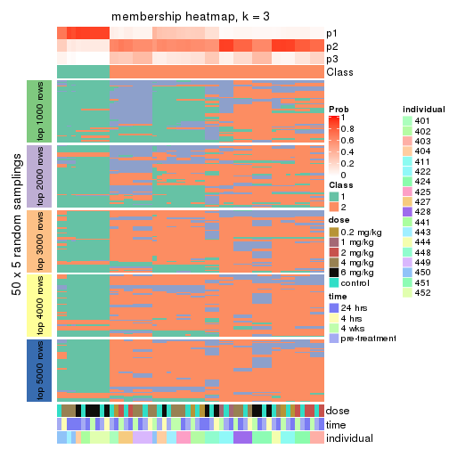</p>

</div>
<div id='tab-CV-kmeans-membership-heatmap-3'>
<pre><code class="r">membership_heatmap(res, k = 4)
</code></pre>

<p>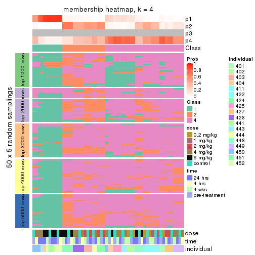</p>

</div>
<div id='tab-CV-kmeans-membership-heatmap-4'>
<pre><code class="r">membership_heatmap(res, k = 5)
</code></pre>

<p>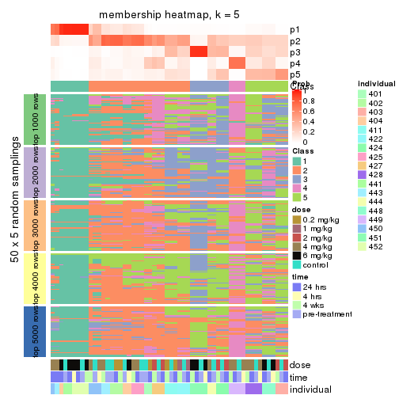</p>

</div>
<div id='tab-CV-kmeans-membership-heatmap-5'>
<pre><code class="r">membership_heatmap(res, k = 6)
</code></pre>

<p>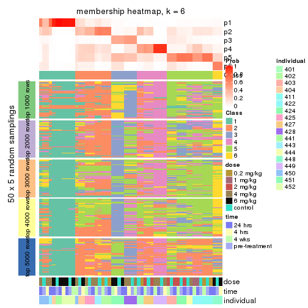</p>

</div>
</div>

As soon as we have had the classes for columns, we can look for signatures
which are significantly different between classes which can be candidate marks
for certain classes. Following are the heatmaps for signatures.


Signature heatmaps where rows are scaled:


<script>
$( function() {
	$( '#tabs-CV-kmeans-get-signatures' ).tabs();
} );
</script>
<div id='tabs-CV-kmeans-get-signatures'>
<ul>
<li><a href='#tab-CV-kmeans-get-signatures-1'>k = 2</a></li>
<li><a href='#tab-CV-kmeans-get-signatures-2'>k = 3</a></li>
<li><a href='#tab-CV-kmeans-get-signatures-3'>k = 4</a></li>
<li><a href='#tab-CV-kmeans-get-signatures-4'>k = 5</a></li>
<li><a href='#tab-CV-kmeans-get-signatures-5'>k = 6</a></li>
</ul>
<div id='tab-CV-kmeans-get-signatures-1'>
<pre><code class="r">get_signatures(res, k = 2)
</code></pre>

<p>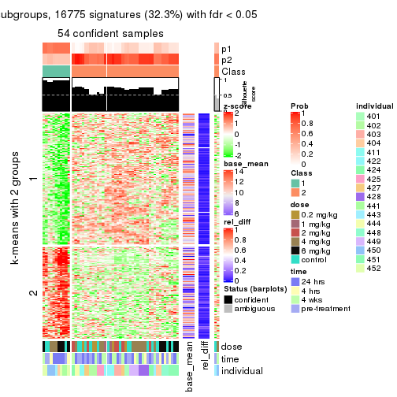</p>

</div>
<div id='tab-CV-kmeans-get-signatures-2'>
<pre><code class="r">get_signatures(res, k = 3)
</code></pre>

<p>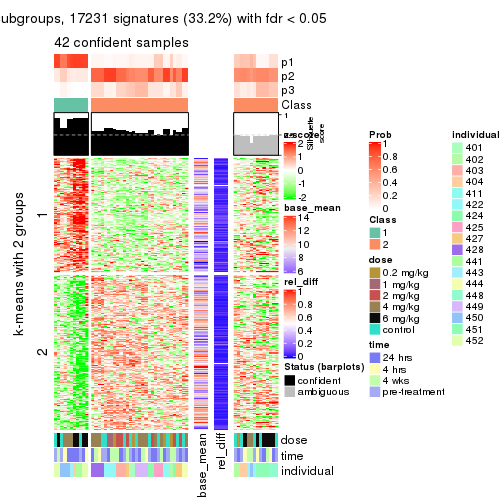</p>

</div>
<div id='tab-CV-kmeans-get-signatures-3'>
<pre><code class="r">get_signatures(res, k = 4)
</code></pre>

<p></p>

</div>
<div id='tab-CV-kmeans-get-signatures-4'>
<pre><code class="r">get_signatures(res, k = 5)
</code></pre>

<p>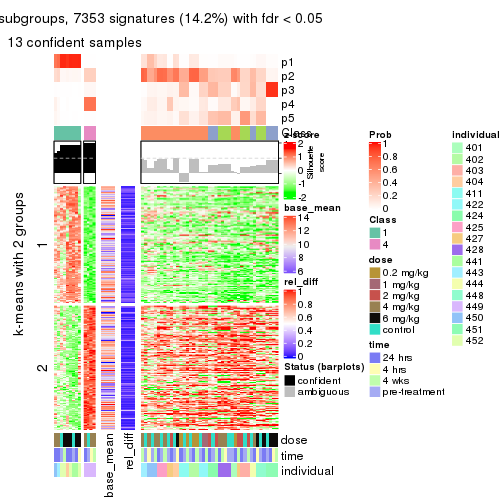</p>

</div>
<div id='tab-CV-kmeans-get-signatures-5'>
<pre><code class="r">get_signatures(res, k = 6)
</code></pre>

<p>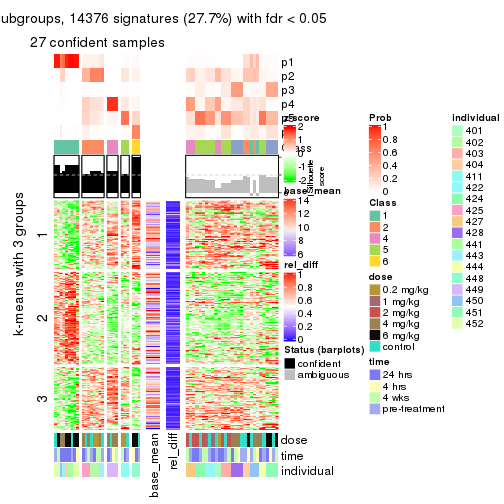</p>

</div>
</div>


Signature heatmaps where rows are not scaled:


<script>
$( function() {
	$( '#tabs-CV-kmeans-get-signatures-no-scale' ).tabs();
} );
</script>
<div id='tabs-CV-kmeans-get-signatures-no-scale'>
<ul>
<li><a href='#tab-CV-kmeans-get-signatures-no-scale-1'>k = 2</a></li>
<li><a href='#tab-CV-kmeans-get-signatures-no-scale-2'>k = 3</a></li>
<li><a href='#tab-CV-kmeans-get-signatures-no-scale-3'>k = 4</a></li>
<li><a href='#tab-CV-kmeans-get-signatures-no-scale-4'>k = 5</a></li>
<li><a href='#tab-CV-kmeans-get-signatures-no-scale-5'>k = 6</a></li>
</ul>
<div id='tab-CV-kmeans-get-signatures-no-scale-1'>
<pre><code class="r">get_signatures(res, k = 2, scale_rows = FALSE)
</code></pre>

<p>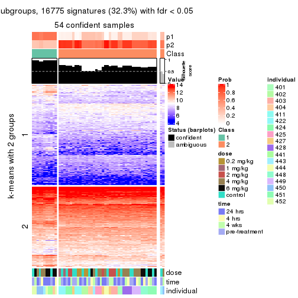</p>

</div>
<div id='tab-CV-kmeans-get-signatures-no-scale-2'>
<pre><code class="r">get_signatures(res, k = 3, scale_rows = FALSE)
</code></pre>

<p>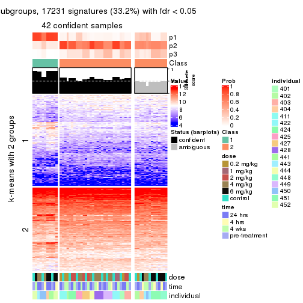</p>

</div>
<div id='tab-CV-kmeans-get-signatures-no-scale-3'>
<pre><code class="r">get_signatures(res, k = 4, scale_rows = FALSE)
</code></pre>

<p></p>

</div>
<div id='tab-CV-kmeans-get-signatures-no-scale-4'>
<pre><code class="r">get_signatures(res, k = 5, scale_rows = FALSE)
</code></pre>

<p>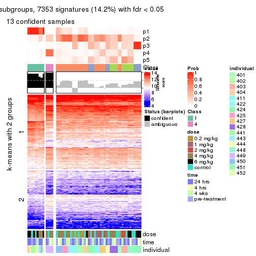</p>

</div>
<div id='tab-CV-kmeans-get-signatures-no-scale-5'>
<pre><code class="r">get_signatures(res, k = 6, scale_rows = FALSE)
</code></pre>

<p>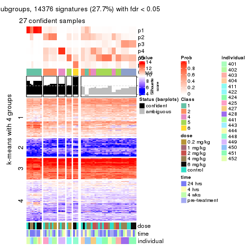</p>

</div>
</div>


Compare the overlap of signatures from different k:

```r
compare_signatures(res)
```

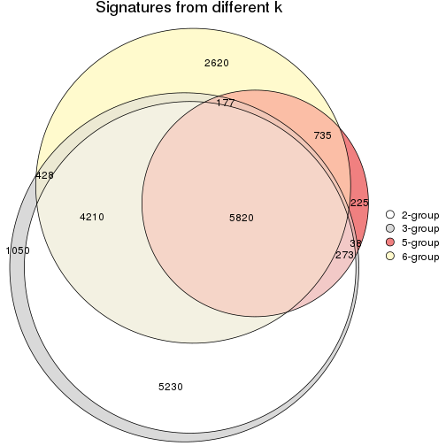

`get_signature()` returns a data frame invisibly. TO get the list of signatures, the function
call should be assigned to a variable explicitly. In following code, if `plot` argument is set
to `FALSE`, no heatmap is plotted while only the differential analysis is performed.

```r
# code only for demonstration
tb = get_signature(res, k = ..., plot = FALSE)
```

An example of the output of `tb` is:

```
#>   which_row         fdr    mean_1    mean_2 scaled_mean_1 scaled_mean_2 km
#> 1        38 0.042760348  8.373488  9.131774    -0.5533452     0.5164555  1
#> 2        40 0.018707592  7.106213  8.469186    -0.6173731     0.5762149  1
#> 3        55 0.019134737 10.221463 11.207825    -0.6159697     0.5749050  1
#> 4        59 0.006059896  5.921854  7.869574    -0.6899429     0.6439467  1
#> 5        60 0.018055526  8.928898 10.211722    -0.6204761     0.5791110  1
#> 6        98 0.009384629 15.714769 14.887706     0.6635654    -0.6193277  2
...
```

The columns in `tb` are:

1. `which_row`: row indices corresponding to the input matrix.
2. `fdr`: FDR for the differential test. 
3. `mean_x`: The mean value in group x.
4. `scaled_mean_x`: The mean value in group x after rows are scaled.
5. `km`: Row groups if k-means clustering is applied to rows.


UMAP plot which shows how samples are separated.


<script>
$( function() {
	$( '#tabs-CV-kmeans-dimension-reduction' ).tabs();
} );
</script>
<div id='tabs-CV-kmeans-dimension-reduction'>
<ul>
<li><a href='#tab-CV-kmeans-dimension-reduction-1'>k = 2</a></li>
<li><a href='#tab-CV-kmeans-dimension-reduction-2'>k = 3</a></li>
<li><a href='#tab-CV-kmeans-dimension-reduction-3'>k = 4</a></li>
<li><a href='#tab-CV-kmeans-dimension-reduction-4'>k = 5</a></li>
<li><a href='#tab-CV-kmeans-dimension-reduction-5'>k = 6</a></li>
</ul>
<div id='tab-CV-kmeans-dimension-reduction-1'>
<pre><code class="r">dimension_reduction(res, k = 2, method = &quot;UMAP&quot;)
</code></pre>

<p>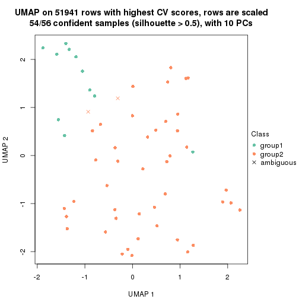</p>

</div>
<div id='tab-CV-kmeans-dimension-reduction-2'>
<pre><code class="r">dimension_reduction(res, k = 3, method = &quot;UMAP&quot;)
</code></pre>

<p>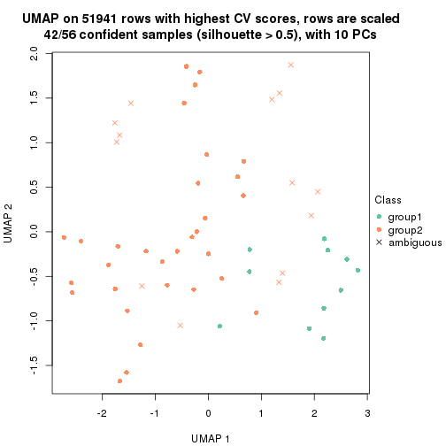</p>

</div>
<div id='tab-CV-kmeans-dimension-reduction-3'>
<pre><code class="r">dimension_reduction(res, k = 4, method = &quot;UMAP&quot;)
</code></pre>

<p>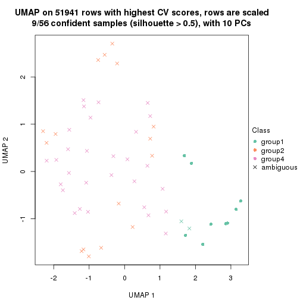</p>

</div>
<div id='tab-CV-kmeans-dimension-reduction-4'>
<pre><code class="r">dimension_reduction(res, k = 5, method = &quot;UMAP&quot;)
</code></pre>

<p>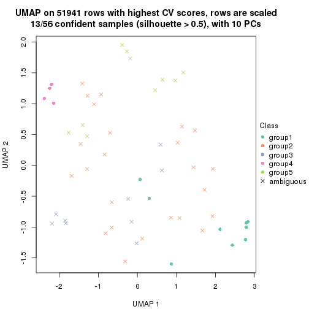</p>

</div>
<div id='tab-CV-kmeans-dimension-reduction-5'>
<pre><code class="r">dimension_reduction(res, k = 6, method = &quot;UMAP&quot;)
</code></pre>

<p>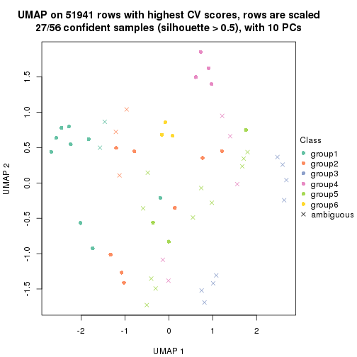</p>

</div>
</div>


Following heatmap shows how subgroups are split when increasing `k`:

```r
collect_classes(res)
```

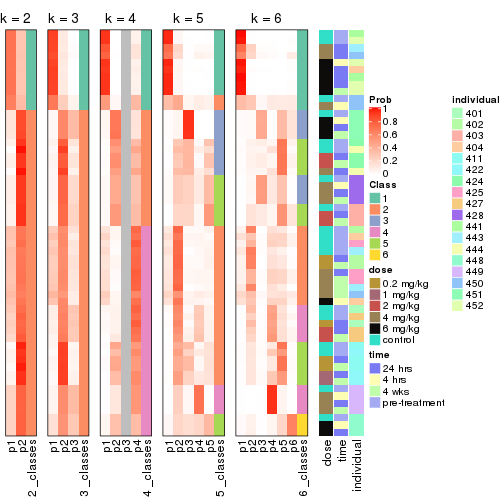


Test correlation between subgroups and known annotations. If the known
annotation is numeric, one-way ANOVA test is applied, and if the known
annotation is discrete, chi-squared contingency table test is applied.

```r
test_to_known_factors(res)
```

```
#>            n dose(p) time(p) individual(p) k
#> CV:kmeans 54 0.17182   0.562      1.30e-04 2
#> CV:kmeans 42 0.00246   0.393      2.25e-04 3
#> CV:kmeans  9      NA      NA            NA 4
#> CV:kmeans 13 0.12021   0.738      2.34e-02 5
#> CV:kmeans 27 0.03215   0.847      1.74e-08 6
```


If matrix rows can be associated to genes, consider to use `functional_enrichment(res,
...)` to perform function enrichment for the signature genes. See [this vignette](http://bioconductor.org/packages/devel/bioc/vignettes/cola/inst/doc/functional_enrichment.html) for more detailed explanations.


 

---------------------------------------------------


### CV:skmeans


The object with results only for a single top-value method and a single partition method 
can be extracted as:

```r
res = res_list["CV", "skmeans"]
# you can also extract it by
# res = res_list["CV:skmeans"]
```

A summary of `res` and all the functions that can be applied to it:

```r
res
```

```
#> A 'ConsensusPartition' object with k = 2, 3, 4, 5, 6.
#>   On a matrix with 51941 rows and 56 columns.
#>   Top rows (1000, 2000, 3000, 4000, 5000) are extracted by 'CV' method.
#>   Subgroups are detected by 'skmeans' method.
#>   Performed in total 1250 partitions by row resampling.
#>   Best k for subgroups seems to be 2.
#> 
#> Following methods can be applied to this 'ConsensusPartition' object:
#>  [1] "cola_report"             "collect_classes"         "collect_plots"          
#>  [4] "collect_stats"           "colnames"                "compare_signatures"     
#>  [7] "consensus_heatmap"       "dimension_reduction"     "functional_enrichment"  
#> [10] "get_anno_col"            "get_anno"                "get_classes"            
#> [13] "get_consensus"           "get_matrix"              "get_membership"         
#> [16] "get_param"               "get_signatures"          "get_stats"              
#> [19] "is_best_k"               "is_stable_k"             "membership_heatmap"     
#> [22] "ncol"                    "nrow"                    "plot_ecdf"              
#> [25] "rownames"                "select_partition_number" "show"                   
#> [28] "suggest_best_k"          "test_to_known_factors"
```

`collect_plots()` function collects all the plots made from `res` for all `k` (number of partitions)
into one single page to provide an easy and fast comparison between different `k`.

```r
collect_plots(res)
```

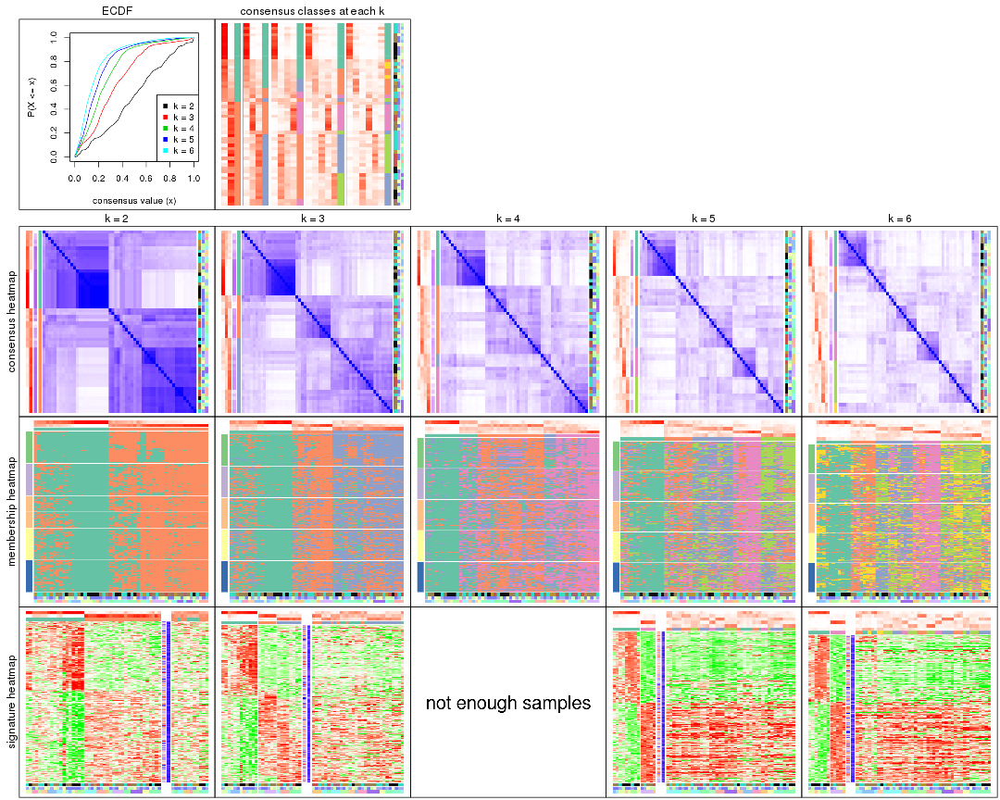

The plots are:

- The first row: a plot of the ECDF (empirical cumulative distribution
  function) curves of the consensus matrix for each `k` and the heatmap of
  predicted classes for each `k`.
- The second row: heatmaps of the consensus matrix for each `k`.
- The third row: heatmaps of the membership matrix for each `k`.
- The fouth row: heatmaps of the signatures for each `k`.

All the plots in panels can be made by individual functions and they are
plotted later in this section.

`select_partition_number()` produces several plots showing different
statistics for choosing "optimized" `k`. There are following statistics:

- ECDF curves of the consensus matrix for each `k`;
- 1-PAC. [The PAC
  score](https://en.wikipedia.org/wiki/Consensus_clustering#Over-interpretation_potential_of_consensus_clustering)
  measures the proportion of the ambiguous subgrouping.
- Mean silhouette score.
- Concordance. The mean probability of fiting the consensus class ids in all
  partitions.
- Area increased. Denote $A_k$ as the area under the ECDF curve for current
  `k`, the area increased is defined as $A_k - A_{k-1}$.
- Rand index. The percent of pairs of samples that are both in a same cluster
  or both are not in a same cluster in the partition of k and k-1.
- Jaccard index. The ratio of pairs of samples are both in a same cluster in
  the partition of k and k-1 and the pairs of samples are both in a same
  cluster in the partition k or k-1.

The detailed explanations of these statistics can be found in [the _cola_
vignette](http://bioconductor.org/packages/devel/bioc/vignettes/cola/inst/doc/cola.html#toc_13).

Generally speaking, lower PAC score, higher mean silhouette score or higher
concordance corresponds to better partition. Rand index and Jaccard index
measure how similar the current partition is compared to partition with `k-1`.
If they are too similar, we won't accept `k` is better than `k-1`.

```r
select_partition_number(res)
```

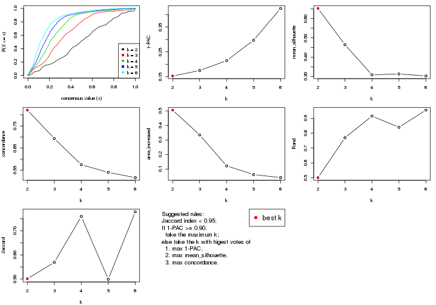

The numeric values for all these statistics can be obtained by `get_stats()`.

```r
get_stats(res)
```

```
#>   k 1-PAC mean_silhouette concordance area_increased  Rand Jaccard
#> 2 2 0.153           0.652       0.822         0.5051 0.501   0.501
#> 3 3 0.175           0.464       0.693         0.3346 0.769   0.569
#> 4 4 0.215           0.308       0.575         0.1222 0.914   0.759
#> 5 5 0.297           0.313       0.540         0.0628 0.840   0.499
#> 6 6 0.425           0.303       0.516         0.0417 0.955   0.778
```

`suggest_best_k()` suggests the best $k$ based on these statistics. The rules are as follows:

- All $k$ with Jaccard index larger than 0.95 are removed because increasing
  $k$ does not provide enough extra information. If all $k$ are removed, it is
  marked as no subgroup is detected.
- For all $k$ with 1-PAC score larger than 0.9, the maximal $k$ is taken as
  the best $k$, and other $k$ are marked as optional $k$.
- If it does not fit the second rule. The $k$ with the maximal vote of the
  highest 1-PAC score, highest mean silhouette, and highest concordance is
  taken as the best $k$.

```r
suggest_best_k(res)
```

```
#> [1] 2
```


Following shows the table of the partitions (You need to click the **show/hide
code output** link to see it). The membership matrix (columns with name `p*`)
is inferred by
[`clue::cl_consensus()`](https://www.rdocumentation.org/link/cl_consensus?package=clue)
function with the `SE` method. Basically the value in the membership matrix
represents the probability to belong to a certain group. The finall class
label for an item is determined with the group with highest probability it
belongs to.

In `get_classes()` function, the entropy is calculated from the membership
matrix and the silhouette score is calculated from the consensus matrix.


<script>
$( function() {
	$( '#tabs-CV-skmeans-get-classes' ).tabs();
} );
</script>
<div id='tabs-CV-skmeans-get-classes'>
<ul>
<li><a href='#tab-CV-skmeans-get-classes-1'>k = 2</a></li>
<li><a href='#tab-CV-skmeans-get-classes-2'>k = 3</a></li>
<li><a href='#tab-CV-skmeans-get-classes-3'>k = 4</a></li>
<li><a href='#tab-CV-skmeans-get-classes-4'>k = 5</a></li>
<li><a href='#tab-CV-skmeans-get-classes-5'>k = 6</a></li>
</ul>

<div id='tab-CV-skmeans-get-classes-1'>
<p><a id='tab-CV-skmeans-get-classes-1-a' style='color:#0366d6' href='#'>show/hide code output</a></p>
<pre><code class="r">cbind(get_classes(res, k = 2), get_membership(res, k = 2))
</code></pre>

<pre><code>#&gt;           class entropy silhouette    p1    p2
#&gt; GSM687644     2  0.9323     0.4094 0.348 0.652
#&gt; GSM687648     1  0.8016     0.6787 0.756 0.244
#&gt; GSM687653     2  0.1184     0.7616 0.016 0.984
#&gt; GSM687658     1  0.7376     0.7165 0.792 0.208
#&gt; GSM687663     2  0.9552     0.4813 0.376 0.624
#&gt; GSM687668     2  0.6247     0.7642 0.156 0.844
#&gt; GSM687673     2  0.9491     0.5194 0.368 0.632
#&gt; GSM687678     1  0.9795     0.3371 0.584 0.416
#&gt; GSM687683     1  0.9775     0.3063 0.588 0.412
#&gt; GSM687688     2  0.2603     0.7704 0.044 0.956
#&gt; GSM687695     1  0.0000     0.8021 1.000 0.000
#&gt; GSM687699     1  0.7674     0.7021 0.776 0.224
#&gt; GSM687704     2  0.2603     0.7726 0.044 0.956
#&gt; GSM687707     2  0.9608     0.4592 0.384 0.616
#&gt; GSM687712     2  0.5519     0.7422 0.128 0.872
#&gt; GSM687719     1  0.0672     0.8013 0.992 0.008
#&gt; GSM687724     2  0.9522     0.5189 0.372 0.628
#&gt; GSM687728     1  0.0376     0.8007 0.996 0.004
#&gt; GSM687646     2  0.7674     0.6295 0.224 0.776
#&gt; GSM687649     1  0.9358     0.4887 0.648 0.352
#&gt; GSM687665     1  0.9970    -0.0406 0.532 0.468
#&gt; GSM687651     1  0.9732     0.3713 0.596 0.404
#&gt; GSM687667     2  0.5519     0.7694 0.128 0.872
#&gt; GSM687670     2  0.6148     0.7661 0.152 0.848
#&gt; GSM687671     2  0.2778     0.7734 0.048 0.952
#&gt; GSM687654     2  0.1633     0.7652 0.024 0.976
#&gt; GSM687675     2  0.9993     0.2082 0.484 0.516
#&gt; GSM687685     2  0.9996     0.0860 0.488 0.512
#&gt; GSM687656     2  0.1633     0.7652 0.024 0.976
#&gt; GSM687677     2  0.5842     0.7654 0.140 0.860
#&gt; GSM687687     2  0.5178     0.7655 0.116 0.884
#&gt; GSM687692     2  0.3274     0.7749 0.060 0.940
#&gt; GSM687716     2  0.4431     0.7550 0.092 0.908
#&gt; GSM687722     1  0.0672     0.8013 0.992 0.008
#&gt; GSM687680     1  0.8386     0.6494 0.732 0.268
#&gt; GSM687690     2  0.5059     0.7768 0.112 0.888
#&gt; GSM687700     1  0.0000     0.8021 1.000 0.000
#&gt; GSM687705     2  0.5519     0.7702 0.128 0.872
#&gt; GSM687714     2  0.5629     0.7381 0.132 0.868
#&gt; GSM687721     1  0.0000     0.8021 1.000 0.000
#&gt; GSM687682     1  0.8207     0.6615 0.744 0.256
#&gt; GSM687694     2  0.5178     0.7761 0.116 0.884
#&gt; GSM687702     1  0.6048     0.7613 0.852 0.148
#&gt; GSM687718     2  0.4562     0.7535 0.096 0.904
#&gt; GSM687723     1  0.3733     0.7881 0.928 0.072
#&gt; GSM687661     1  0.7376     0.7197 0.792 0.208
#&gt; GSM687710     2  0.9754     0.3978 0.408 0.592
#&gt; GSM687726     2  0.8207     0.6841 0.256 0.744
#&gt; GSM687730     1  0.0672     0.7988 0.992 0.008
#&gt; GSM687660     1  0.0000     0.8021 1.000 0.000
#&gt; GSM687697     1  0.0000     0.8021 1.000 0.000
#&gt; GSM687709     2  0.9944     0.2617 0.456 0.544
#&gt; GSM687725     2  0.8909     0.6201 0.308 0.692
#&gt; GSM687729     1  0.0000     0.8021 1.000 0.000
#&gt; GSM687727     2  0.3114     0.7704 0.056 0.944
#&gt; GSM687731     1  0.0000     0.8021 1.000 0.000
</code></pre>

<script>
$('#tab-CV-skmeans-get-classes-1-a').parent().next().next().hide();
$('#tab-CV-skmeans-get-classes-1-a').click(function(){
  $('#tab-CV-skmeans-get-classes-1-a').parent().next().next().toggle();
  return(false);
});
</script>
</div>

<div id='tab-CV-skmeans-get-classes-2'>
<p><a id='tab-CV-skmeans-get-classes-2-a' style='color:#0366d6' href='#'>show/hide code output</a></p>
<pre><code class="r">cbind(get_classes(res, k = 3), get_membership(res, k = 3))
</code></pre>

<pre><code>#&gt;           class entropy silhouette    p1    p2    p3
#&gt; GSM687644     2  0.7365     0.5132 0.112 0.700 0.188
#&gt; GSM687648     1  0.8894     0.4354 0.572 0.236 0.192
#&gt; GSM687653     3  0.4912     0.5433 0.008 0.196 0.796
#&gt; GSM687658     1  0.9173     0.3152 0.520 0.304 0.176
#&gt; GSM687663     3  0.8907     0.3749 0.184 0.248 0.568
#&gt; GSM687668     2  0.8501     0.0608 0.092 0.488 0.420
#&gt; GSM687673     3  0.7880     0.5260 0.164 0.168 0.668
#&gt; GSM687678     2  0.9760     0.2127 0.280 0.444 0.276
#&gt; GSM687683     2  0.8241     0.4534 0.204 0.636 0.160
#&gt; GSM687688     3  0.6630     0.4890 0.028 0.300 0.672
#&gt; GSM687695     1  0.0475     0.7365 0.992 0.004 0.004
#&gt; GSM687699     1  0.8853     0.4186 0.572 0.252 0.176
#&gt; GSM687704     3  0.7366     0.3601 0.036 0.400 0.564
#&gt; GSM687707     3  0.8939     0.2987 0.140 0.340 0.520
#&gt; GSM687712     2  0.3690     0.5855 0.016 0.884 0.100
#&gt; GSM687719     1  0.4094     0.7131 0.872 0.100 0.028
#&gt; GSM687724     3  0.9026     0.3880 0.248 0.196 0.556
#&gt; GSM687728     1  0.0592     0.7369 0.988 0.000 0.012
#&gt; GSM687646     2  0.5285     0.5550 0.040 0.812 0.148
#&gt; GSM687649     1  0.9805    -0.0469 0.396 0.364 0.240
#&gt; GSM687665     3  0.8890     0.3304 0.328 0.140 0.532
#&gt; GSM687651     2  0.9624     0.2300 0.292 0.468 0.240
#&gt; GSM687667     3  0.6337     0.5239 0.044 0.220 0.736
#&gt; GSM687670     2  0.8419    -0.0159 0.088 0.504 0.408
#&gt; GSM687671     3  0.7386     0.2129 0.032 0.460 0.508
#&gt; GSM687654     3  0.5292     0.5564 0.028 0.172 0.800
#&gt; GSM687675     3  0.7884     0.4787 0.224 0.120 0.656
#&gt; GSM687685     2  0.8137     0.4749 0.220 0.640 0.140
#&gt; GSM687656     3  0.4575     0.5470 0.004 0.184 0.812
#&gt; GSM687677     3  0.5734     0.5685 0.048 0.164 0.788
#&gt; GSM687687     2  0.5639     0.4877 0.016 0.752 0.232
#&gt; GSM687692     3  0.7442     0.4147 0.044 0.368 0.588
#&gt; GSM687716     2  0.3573     0.5741 0.004 0.876 0.120
#&gt; GSM687722     1  0.5267     0.6874 0.816 0.140 0.044
#&gt; GSM687680     1  0.8961     0.2553 0.504 0.360 0.136
#&gt; GSM687690     3  0.7529     0.4426 0.060 0.316 0.624
#&gt; GSM687700     1  0.0747     0.7375 0.984 0.016 0.000
#&gt; GSM687705     3  0.8059     0.1604 0.064 0.444 0.492
#&gt; GSM687714     2  0.2356     0.5846 0.000 0.928 0.072
#&gt; GSM687721     1  0.1267     0.7354 0.972 0.024 0.004
#&gt; GSM687682     1  0.8984     0.3118 0.524 0.328 0.148
#&gt; GSM687694     3  0.7529     0.4513 0.060 0.316 0.624
#&gt; GSM687702     1  0.7959     0.5140 0.620 0.288 0.092
#&gt; GSM687718     2  0.3193     0.5825 0.004 0.896 0.100
#&gt; GSM687723     1  0.8474     0.4856 0.604 0.252 0.144
#&gt; GSM687661     1  0.8759     0.3026 0.520 0.360 0.120
#&gt; GSM687710     3  0.9152     0.1980 0.152 0.364 0.484
#&gt; GSM687726     3  0.7633     0.5397 0.120 0.200 0.680
#&gt; GSM687730     1  0.2063     0.7303 0.948 0.008 0.044
#&gt; GSM687660     1  0.1453     0.7373 0.968 0.024 0.008
#&gt; GSM687697     1  0.0237     0.7366 0.996 0.000 0.004
#&gt; GSM687709     3  0.9231     0.2683 0.180 0.308 0.512
#&gt; GSM687725     3  0.8556     0.4720 0.164 0.232 0.604
#&gt; GSM687729     1  0.0237     0.7362 0.996 0.000 0.004
#&gt; GSM687727     3  0.5292     0.5370 0.008 0.228 0.764
#&gt; GSM687731     1  0.1015     0.7381 0.980 0.012 0.008
</code></pre>

<script>
$('#tab-CV-skmeans-get-classes-2-a').parent().next().next().hide();
$('#tab-CV-skmeans-get-classes-2-a').click(function(){
  $('#tab-CV-skmeans-get-classes-2-a').parent().next().next().toggle();
  return(false);
});
</script>
</div>

<div id='tab-CV-skmeans-get-classes-3'>
<p><a id='tab-CV-skmeans-get-classes-3-a' style='color:#0366d6' href='#'>show/hide code output</a></p>
<pre><code class="r">cbind(get_classes(res, k = 4), get_membership(res, k = 4))
</code></pre>

<pre><code>#&gt;           class entropy silhouette    p1    p2    p3    p4
#&gt; GSM687644     4  0.8133    0.10253 0.064 0.128 0.272 0.536
#&gt; GSM687648     3  0.9381    0.48834 0.312 0.108 0.368 0.212
#&gt; GSM687653     2  0.6154    0.43711 0.004 0.684 0.192 0.120
#&gt; GSM687658     1  0.9161   -0.05676 0.420 0.096 0.280 0.204
#&gt; GSM687663     2  0.9553    0.24009 0.168 0.372 0.296 0.164
#&gt; GSM687668     4  0.8976    0.16881 0.068 0.212 0.328 0.392
#&gt; GSM687673     2  0.7175    0.43940 0.052 0.628 0.236 0.084
#&gt; GSM687678     4  0.9366   -0.23221 0.148 0.148 0.324 0.380
#&gt; GSM687683     4  0.8300    0.21649 0.144 0.096 0.200 0.560
#&gt; GSM687688     2  0.7687    0.36949 0.016 0.540 0.240 0.204
#&gt; GSM687695     1  0.0967    0.62398 0.976 0.004 0.016 0.004
#&gt; GSM687699     1  0.9516   -0.20641 0.396 0.148 0.260 0.196
#&gt; GSM687704     2  0.8371    0.13163 0.024 0.400 0.228 0.348
#&gt; GSM687707     2  0.8799    0.32890 0.104 0.500 0.224 0.172
#&gt; GSM687712     4  0.3586    0.44416 0.012 0.040 0.076 0.872
#&gt; GSM687719     1  0.5687    0.54119 0.736 0.020 0.180 0.064
#&gt; GSM687724     2  0.9202    0.37083 0.152 0.440 0.268 0.140
#&gt; GSM687728     1  0.3143    0.60736 0.888 0.024 0.080 0.008
#&gt; GSM687646     4  0.6305    0.29348 0.016 0.076 0.240 0.668
#&gt; GSM687649     3  0.9269    0.47425 0.180 0.112 0.392 0.316
#&gt; GSM687665     2  0.9410    0.16797 0.264 0.340 0.300 0.096
#&gt; GSM687651     3  0.9092    0.37992 0.108 0.168 0.436 0.288
#&gt; GSM687667     2  0.8110    0.31583 0.028 0.468 0.332 0.172
#&gt; GSM687670     4  0.8487   -0.00826 0.024 0.300 0.288 0.388
#&gt; GSM687671     4  0.8732    0.06528 0.036 0.288 0.320 0.356
#&gt; GSM687654     2  0.6224    0.45208 0.008 0.680 0.208 0.104
#&gt; GSM687675     2  0.7909    0.35320 0.212 0.580 0.148 0.060
#&gt; GSM687685     4  0.8170    0.13840 0.196 0.080 0.156 0.568
#&gt; GSM687656     2  0.6532    0.43143 0.004 0.640 0.232 0.124
#&gt; GSM687677     2  0.5317    0.48949 0.024 0.772 0.144 0.060
#&gt; GSM687687     4  0.6222    0.42126 0.012 0.120 0.172 0.696
#&gt; GSM687692     2  0.7916    0.32934 0.016 0.500 0.264 0.220
#&gt; GSM687716     4  0.3948    0.44684 0.000 0.096 0.064 0.840
#&gt; GSM687722     1  0.6889    0.44552 0.644 0.040 0.236 0.080
#&gt; GSM687680     3  0.9215    0.37145 0.260 0.076 0.348 0.316
#&gt; GSM687690     2  0.8729    0.29222 0.048 0.380 0.360 0.212
#&gt; GSM687700     1  0.3659    0.57121 0.840 0.000 0.136 0.024
#&gt; GSM687705     4  0.8897   -0.13517 0.056 0.344 0.228 0.372
#&gt; GSM687714     4  0.3105    0.43828 0.012 0.032 0.060 0.896
#&gt; GSM687721     1  0.2795    0.61634 0.896 0.004 0.088 0.012
#&gt; GSM687682     1  0.9092   -0.31999 0.368 0.072 0.332 0.228
#&gt; GSM687694     2  0.8482    0.33131 0.044 0.468 0.280 0.208
#&gt; GSM687702     1  0.8997   -0.38090 0.364 0.068 0.356 0.212
#&gt; GSM687718     4  0.3595    0.44655 0.008 0.040 0.084 0.868
#&gt; GSM687723     1  0.9059    0.05616 0.436 0.096 0.284 0.184
#&gt; GSM687661     1  0.9251   -0.14771 0.376 0.084 0.280 0.260
#&gt; GSM687710     2  0.8827    0.22934 0.068 0.456 0.228 0.248
#&gt; GSM687726     2  0.8074    0.45323 0.080 0.568 0.228 0.124
#&gt; GSM687730     1  0.3793    0.59466 0.864 0.044 0.076 0.016
#&gt; GSM687660     1  0.2170    0.62498 0.936 0.012 0.036 0.016
#&gt; GSM687697     1  0.0844    0.62446 0.980 0.004 0.012 0.004
#&gt; GSM687709     2  0.8854    0.29426 0.092 0.480 0.244 0.184
#&gt; GSM687725     2  0.8569    0.41603 0.108 0.528 0.224 0.140
#&gt; GSM687729     1  0.1042    0.62382 0.972 0.008 0.020 0.000
#&gt; GSM687727     2  0.6933    0.44768 0.012 0.628 0.196 0.164
#&gt; GSM687731     1  0.2658    0.61497 0.904 0.012 0.080 0.004
</code></pre>

<script>
$('#tab-CV-skmeans-get-classes-3-a').parent().next().next().hide();
$('#tab-CV-skmeans-get-classes-3-a').click(function(){
  $('#tab-CV-skmeans-get-classes-3-a').parent().next().next().toggle();
  return(false);
});
</script>
</div>

<div id='tab-CV-skmeans-get-classes-4'>
<p><a id='tab-CV-skmeans-get-classes-4-a' style='color:#0366d6' href='#'>show/hide code output</a></p>
<pre><code class="r">cbind(get_classes(res, k = 5), get_membership(res, k = 5))
</code></pre>

<pre><code>#&gt;           class entropy silhouette    p1    p2    p3    p4    p5
#&gt; GSM687644     4   0.793     0.2645 0.044 0.272 0.088 0.500 0.096
#&gt; GSM687648     2   0.819     0.4148 0.244 0.496 0.096 0.108 0.056
#&gt; GSM687653     3   0.601     0.2998 0.000 0.072 0.676 0.092 0.160
#&gt; GSM687658     1   0.929    -0.1002 0.352 0.264 0.160 0.140 0.084
#&gt; GSM687663     3   0.940     0.1059 0.108 0.212 0.328 0.100 0.252
#&gt; GSM687668     5   0.928     0.0850 0.052 0.168 0.200 0.280 0.300
#&gt; GSM687673     3   0.790     0.1967 0.080 0.116 0.500 0.036 0.268
#&gt; GSM687678     2   0.931     0.1302 0.112 0.348 0.172 0.268 0.100
#&gt; GSM687683     4   0.759     0.3720 0.104 0.204 0.092 0.564 0.036
#&gt; GSM687688     5   0.656     0.3518 0.008 0.068 0.140 0.140 0.644
#&gt; GSM687695     1   0.146     0.6567 0.952 0.032 0.008 0.000 0.008
#&gt; GSM687699     2   0.908     0.2418 0.320 0.344 0.112 0.088 0.136
#&gt; GSM687704     3   0.867    -0.0434 0.016 0.124 0.324 0.264 0.272
#&gt; GSM687707     3   0.793     0.2715 0.068 0.116 0.564 0.116 0.136
#&gt; GSM687712     4   0.406     0.6181 0.000 0.068 0.068 0.824 0.040
#&gt; GSM687719     1   0.734     0.4401 0.588 0.204 0.100 0.060 0.048
#&gt; GSM687724     5   0.828     0.2122 0.124 0.076 0.216 0.080 0.504
#&gt; GSM687728     1   0.341     0.6374 0.872 0.052 0.020 0.020 0.036
#&gt; GSM687646     4   0.633     0.4094 0.008 0.244 0.076 0.624 0.048
#&gt; GSM687649     2   0.875     0.2995 0.080 0.444 0.180 0.212 0.084
#&gt; GSM687665     3   0.969     0.0776 0.208 0.216 0.276 0.092 0.208
#&gt; GSM687651     2   0.860     0.3151 0.080 0.484 0.160 0.172 0.104
#&gt; GSM687667     3   0.810     0.1135 0.008 0.188 0.432 0.104 0.268
#&gt; GSM687670     2   0.936    -0.1176 0.048 0.264 0.216 0.264 0.208
#&gt; GSM687671     5   0.891     0.1098 0.024 0.176 0.188 0.300 0.312
#&gt; GSM687654     3   0.610     0.2954 0.000 0.060 0.656 0.092 0.192
#&gt; GSM687675     3   0.849     0.2013 0.196 0.120 0.440 0.028 0.216
#&gt; GSM687685     4   0.809     0.3415 0.088 0.248 0.080 0.508 0.076
#&gt; GSM687656     3   0.642     0.2887 0.000 0.076 0.632 0.100 0.192
#&gt; GSM687677     3   0.680     0.1160 0.016 0.080 0.496 0.032 0.376
#&gt; GSM687687     4   0.619     0.5539 0.008 0.124 0.088 0.684 0.096
#&gt; GSM687692     5   0.647     0.3522 0.000 0.068 0.136 0.164 0.632
#&gt; GSM687716     4   0.425     0.6012 0.000 0.024 0.048 0.796 0.132
#&gt; GSM687722     1   0.791     0.3478 0.524 0.240 0.108 0.060 0.068
#&gt; GSM687680     2   0.860     0.3624 0.196 0.460 0.104 0.184 0.056
#&gt; GSM687690     5   0.687     0.3605 0.024 0.112 0.064 0.172 0.628
#&gt; GSM687700     1   0.395     0.5814 0.792 0.176 0.008 0.012 0.012
#&gt; GSM687705     5   0.897     0.0896 0.040 0.120 0.244 0.256 0.340
#&gt; GSM687714     4   0.258     0.6248 0.000 0.024 0.024 0.904 0.048
#&gt; GSM687721     1   0.499     0.5921 0.764 0.140 0.052 0.020 0.024
#&gt; GSM687682     1   0.928    -0.3247 0.304 0.268 0.096 0.248 0.084
#&gt; GSM687694     5   0.782     0.3123 0.044 0.104 0.132 0.160 0.560
#&gt; GSM687702     2   0.822     0.3013 0.304 0.432 0.064 0.160 0.040
#&gt; GSM687718     4   0.435     0.6121 0.000 0.060 0.060 0.808 0.072
#&gt; GSM687723     1   0.921    -0.0544 0.336 0.308 0.132 0.136 0.088
#&gt; GSM687661     2   0.927     0.1905 0.276 0.276 0.112 0.268 0.068
#&gt; GSM687710     3   0.834     0.2347 0.052 0.172 0.488 0.200 0.088
#&gt; GSM687726     5   0.758     0.2307 0.076 0.084 0.228 0.052 0.560
#&gt; GSM687730     1   0.368     0.6240 0.852 0.056 0.016 0.012 0.064
#&gt; GSM687660     1   0.223     0.6566 0.924 0.036 0.020 0.016 0.004
#&gt; GSM687697     1   0.146     0.6562 0.952 0.028 0.016 0.004 0.000
#&gt; GSM687709     3   0.861     0.2406 0.096 0.132 0.480 0.200 0.092
#&gt; GSM687725     5   0.770     0.2238 0.072 0.076 0.236 0.068 0.548
#&gt; GSM687729     1   0.124     0.6541 0.960 0.028 0.000 0.004 0.008
#&gt; GSM687727     5   0.650     0.2693 0.020 0.044 0.220 0.084 0.632
#&gt; GSM687731     1   0.364     0.6262 0.852 0.084 0.020 0.012 0.032
</code></pre>

<script>
$('#tab-CV-skmeans-get-classes-4-a').parent().next().next().hide();
$('#tab-CV-skmeans-get-classes-4-a').click(function(){
  $('#tab-CV-skmeans-get-classes-4-a').parent().next().next().toggle();
  return(false);
});
</script>
</div>

<div id='tab-CV-skmeans-get-classes-5'>
<p><a id='tab-CV-skmeans-get-classes-5-a' style='color:#0366d6' href='#'>show/hide code output</a></p>
<pre><code class="r">cbind(get_classes(res, k = 6), get_membership(res, k = 6))
</code></pre>

<pre><code>#&gt;           class entropy silhouette    p1    p2    p3    p4    p5    p6
#&gt; GSM687644     4   0.741     0.2457 0.012 0.284 0.072 0.484 0.100 0.048
#&gt; GSM687648     2   0.690     0.3427 0.152 0.616 0.036 0.072 0.052 0.072
#&gt; GSM687653     5   0.519     0.3357 0.004 0.040 0.092 0.084 0.740 0.040
#&gt; GSM687658     6   0.911     0.3150 0.284 0.144 0.056 0.136 0.080 0.300
#&gt; GSM687663     5   0.937     0.0889 0.128 0.140 0.136 0.100 0.360 0.136
#&gt; GSM687668     3   0.929     0.1329 0.052 0.104 0.320 0.204 0.156 0.164
#&gt; GSM687673     5   0.751     0.2348 0.036 0.048 0.184 0.024 0.492 0.216
#&gt; GSM687678     2   0.878     0.1850 0.072 0.352 0.040 0.268 0.156 0.112
#&gt; GSM687683     4   0.815     0.2225 0.088 0.144 0.016 0.452 0.088 0.212
#&gt; GSM687688     3   0.503     0.3393 0.004 0.028 0.736 0.112 0.100 0.020
#&gt; GSM687695     1   0.288     0.6195 0.880 0.036 0.020 0.004 0.004 0.056
#&gt; GSM687699     2   0.888     0.1029 0.292 0.340 0.116 0.072 0.064 0.116
#&gt; GSM687704     5   0.850    -0.0245 0.020 0.052 0.228 0.268 0.328 0.104
#&gt; GSM687707     5   0.835     0.2682 0.064 0.108 0.068 0.060 0.400 0.300
#&gt; GSM687712     4   0.286     0.6216 0.008 0.052 0.008 0.884 0.012 0.036
#&gt; GSM687719     1   0.616     0.0715 0.496 0.060 0.012 0.028 0.016 0.388
#&gt; GSM687724     3   0.866     0.2162 0.076 0.076 0.416 0.060 0.188 0.184
#&gt; GSM687728     1   0.469     0.5616 0.772 0.096 0.052 0.004 0.020 0.056
#&gt; GSM687646     4   0.631     0.3861 0.000 0.280 0.060 0.560 0.080 0.020
#&gt; GSM687649     2   0.643     0.3761 0.072 0.660 0.036 0.124 0.072 0.036
#&gt; GSM687665     5   0.949     0.0542 0.204 0.140 0.136 0.084 0.312 0.124
#&gt; GSM687651     2   0.634     0.3610 0.032 0.676 0.060 0.080 0.084 0.068
#&gt; GSM687667     5   0.841     0.1331 0.040 0.096 0.160 0.096 0.464 0.144
#&gt; GSM687670     3   0.935     0.0138 0.028 0.128 0.220 0.216 0.204 0.204
#&gt; GSM687671     3   0.849     0.1361 0.008 0.084 0.368 0.224 0.200 0.116
#&gt; GSM687654     5   0.557     0.3205 0.000 0.072 0.128 0.036 0.700 0.064
#&gt; GSM687675     5   0.834     0.1966 0.128 0.044 0.184 0.032 0.432 0.180
#&gt; GSM687685     4   0.792     0.3431 0.056 0.192 0.072 0.500 0.040 0.140
#&gt; GSM687656     5   0.574     0.3214 0.012 0.068 0.100 0.072 0.708 0.040
#&gt; GSM687677     5   0.673     0.1439 0.012 0.048 0.296 0.016 0.520 0.108
#&gt; GSM687687     4   0.579     0.5725 0.012 0.088 0.076 0.704 0.036 0.084
#&gt; GSM687692     3   0.611     0.3137 0.004 0.068 0.668 0.076 0.128 0.056
#&gt; GSM687716     4   0.433     0.5876 0.004 0.040 0.064 0.804 0.036 0.052
#&gt; GSM687722     1   0.758    -0.1305 0.408 0.088 0.036 0.040 0.056 0.372
#&gt; GSM687680     2   0.831     0.2763 0.156 0.476 0.044 0.132 0.068 0.124
#&gt; GSM687690     3   0.601     0.3365 0.020 0.072 0.692 0.100 0.076 0.040
#&gt; GSM687700     1   0.477     0.4561 0.708 0.192 0.000 0.012 0.008 0.080
#&gt; GSM687705     3   0.873     0.0855 0.044 0.080 0.340 0.232 0.240 0.064
#&gt; GSM687714     4   0.370     0.6190 0.004 0.036 0.064 0.840 0.020 0.036
#&gt; GSM687721     1   0.494     0.3582 0.628 0.032 0.016 0.000 0.012 0.312
#&gt; GSM687682     2   0.939     0.0842 0.244 0.288 0.080 0.156 0.080 0.152
#&gt; GSM687694     3   0.624     0.3065 0.016 0.072 0.668 0.088 0.116 0.040
#&gt; GSM687702     2   0.783     0.1648 0.192 0.468 0.012 0.120 0.036 0.172
#&gt; GSM687718     4   0.365     0.6164 0.004 0.064 0.044 0.840 0.012 0.036
#&gt; GSM687723     6   0.809     0.2838 0.252 0.132 0.052 0.064 0.048 0.452
#&gt; GSM687661     6   0.922     0.2985 0.256 0.156 0.052 0.188 0.072 0.276
#&gt; GSM687710     5   0.809     0.2794 0.024 0.144 0.044 0.096 0.420 0.272
#&gt; GSM687726     3   0.894     0.1696 0.064 0.120 0.332 0.048 0.248 0.188
#&gt; GSM687730     1   0.481     0.5508 0.772 0.076 0.044 0.008 0.028 0.072
#&gt; GSM687660     1   0.317     0.5723 0.840 0.016 0.000 0.020 0.004 0.120
#&gt; GSM687697     1   0.194     0.6214 0.920 0.036 0.000 0.004 0.000 0.040
#&gt; GSM687709     5   0.903     0.2508 0.048 0.136 0.096 0.136 0.356 0.228
#&gt; GSM687725     3   0.833     0.2095 0.044 0.048 0.412 0.072 0.236 0.188
#&gt; GSM687729     1   0.258     0.6200 0.896 0.048 0.008 0.004 0.008 0.036
#&gt; GSM687727     3   0.789     0.2313 0.016 0.044 0.444 0.080 0.244 0.172
#&gt; GSM687731     1   0.443     0.5477 0.744 0.148 0.004 0.004 0.004 0.096
</code></pre>

<script>
$('#tab-CV-skmeans-get-classes-5-a').parent().next().next().hide();
$('#tab-CV-skmeans-get-classes-5-a').click(function(){
  $('#tab-CV-skmeans-get-classes-5-a').parent().next().next().toggle();
  return(false);
});
</script>
</div>
</div>

Heatmaps for the consensus matrix. It visualizes the probability of two
samples to be in a same group.


<script>
$( function() {
	$( '#tabs-CV-skmeans-consensus-heatmap' ).tabs();
} );
</script>
<div id='tabs-CV-skmeans-consensus-heatmap'>
<ul>
<li><a href='#tab-CV-skmeans-consensus-heatmap-1'>k = 2</a></li>
<li><a href='#tab-CV-skmeans-consensus-heatmap-2'>k = 3</a></li>
<li><a href='#tab-CV-skmeans-consensus-heatmap-3'>k = 4</a></li>
<li><a href='#tab-CV-skmeans-consensus-heatmap-4'>k = 5</a></li>
<li><a href='#tab-CV-skmeans-consensus-heatmap-5'>k = 6</a></li>
</ul>
<div id='tab-CV-skmeans-consensus-heatmap-1'>
<pre><code class="r">consensus_heatmap(res, k = 2)
</code></pre>

<p>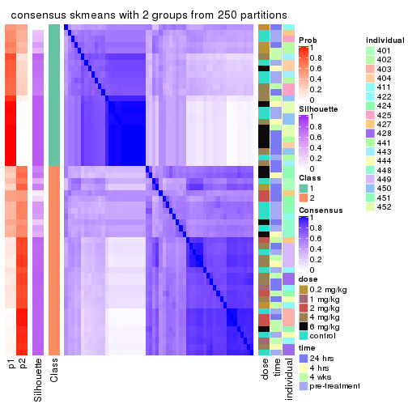</p>

</div>
<div id='tab-CV-skmeans-consensus-heatmap-2'>
<pre><code class="r">consensus_heatmap(res, k = 3)
</code></pre>

<p>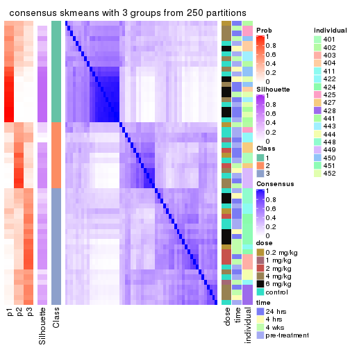</p>

</div>
<div id='tab-CV-skmeans-consensus-heatmap-3'>
<pre><code class="r">consensus_heatmap(res, k = 4)
</code></pre>

<p>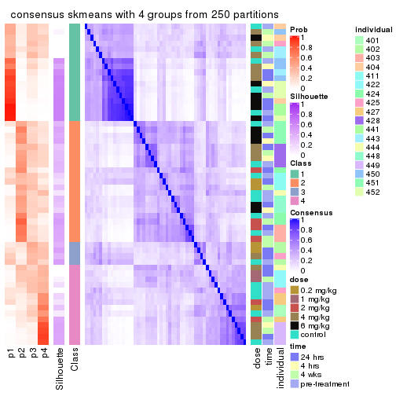</p>

</div>
<div id='tab-CV-skmeans-consensus-heatmap-4'>
<pre><code class="r">consensus_heatmap(res, k = 5)
</code></pre>

<p>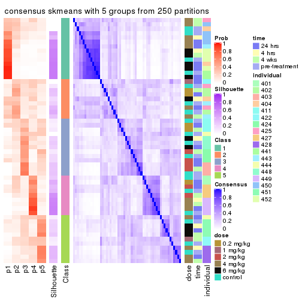</p>

</div>
<div id='tab-CV-skmeans-consensus-heatmap-5'>
<pre><code class="r">consensus_heatmap(res, k = 6)
</code></pre>

<p>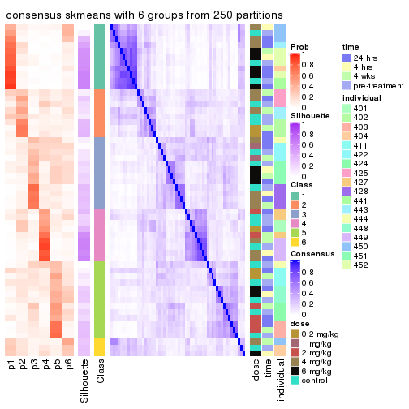</p>

</div>
</div>

Heatmaps for the membership of samples in all partitions to see how consistent they are:


<script>
$( function() {
	$( '#tabs-CV-skmeans-membership-heatmap' ).tabs();
} );
</script>
<div id='tabs-CV-skmeans-membership-heatmap'>
<ul>
<li><a href='#tab-CV-skmeans-membership-heatmap-1'>k = 2</a></li>
<li><a href='#tab-CV-skmeans-membership-heatmap-2'>k = 3</a></li>
<li><a href='#tab-CV-skmeans-membership-heatmap-3'>k = 4</a></li>
<li><a href='#tab-CV-skmeans-membership-heatmap-4'>k = 5</a></li>
<li><a href='#tab-CV-skmeans-membership-heatmap-5'>k = 6</a></li>
</ul>
<div id='tab-CV-skmeans-membership-heatmap-1'>
<pre><code class="r">membership_heatmap(res, k = 2)
</code></pre>

<p>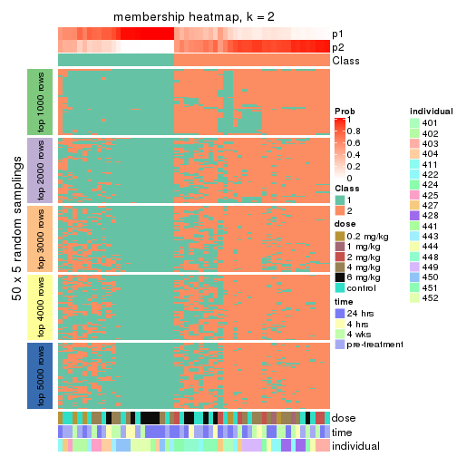</p>

</div>
<div id='tab-CV-skmeans-membership-heatmap-2'>
<pre><code class="r">membership_heatmap(res, k = 3)
</code></pre>

<p>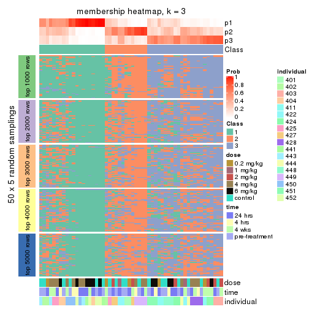</p>

</div>
<div id='tab-CV-skmeans-membership-heatmap-3'>
<pre><code class="r">membership_heatmap(res, k = 4)
</code></pre>

<p>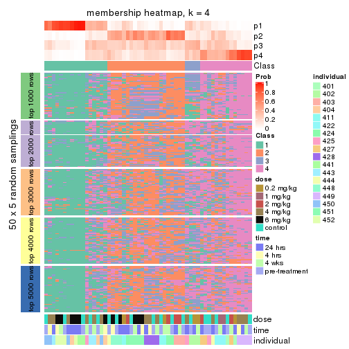</p>

</div>
<div id='tab-CV-skmeans-membership-heatmap-4'>
<pre><code class="r">membership_heatmap(res, k = 5)
</code></pre>

<p>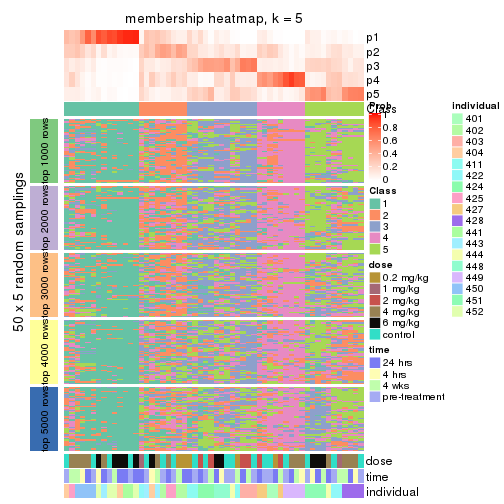</p>

</div>
<div id='tab-CV-skmeans-membership-heatmap-5'>
<pre><code class="r">membership_heatmap(res, k = 6)
</code></pre>

<p>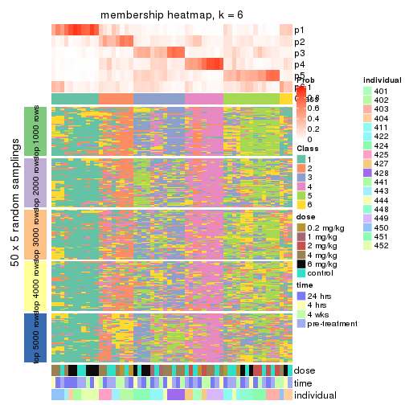</p>

</div>
</div>

As soon as we have had the classes for columns, we can look for signatures
which are significantly different between classes which can be candidate marks
for certain classes. Following are the heatmaps for signatures.


Signature heatmaps where rows are scaled:


<script>
$( function() {
	$( '#tabs-CV-skmeans-get-signatures' ).tabs();
} );
</script>
<div id='tabs-CV-skmeans-get-signatures'>
<ul>
<li><a href='#tab-CV-skmeans-get-signatures-1'>k = 2</a></li>
<li><a href='#tab-CV-skmeans-get-signatures-2'>k = 3</a></li>
<li><a href='#tab-CV-skmeans-get-signatures-3'>k = 4</a></li>
<li><a href='#tab-CV-skmeans-get-signatures-4'>k = 5</a></li>
<li><a href='#tab-CV-skmeans-get-signatures-5'>k = 6</a></li>
</ul>
<div id='tab-CV-skmeans-get-signatures-1'>
<pre><code class="r">get_signatures(res, k = 2)
</code></pre>

<p>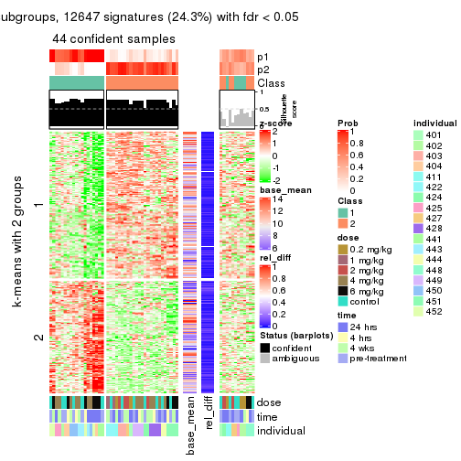</p>

</div>
<div id='tab-CV-skmeans-get-signatures-2'>
<pre><code class="r">get_signatures(res, k = 3)
</code></pre>

<p>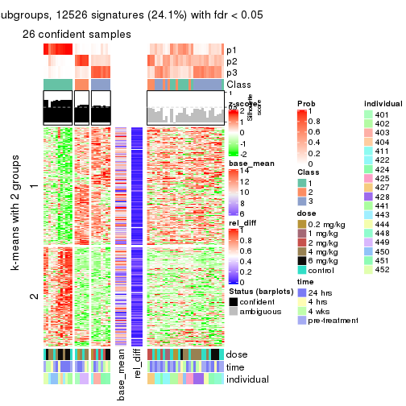</p>

</div>
<div id='tab-CV-skmeans-get-signatures-3'>
<pre><code class="r">get_signatures(res, k = 4)
</code></pre>

<p></p>

</div>
<div id='tab-CV-skmeans-get-signatures-4'>
<pre><code class="r">get_signatures(res, k = 5)
</code></pre>

<p>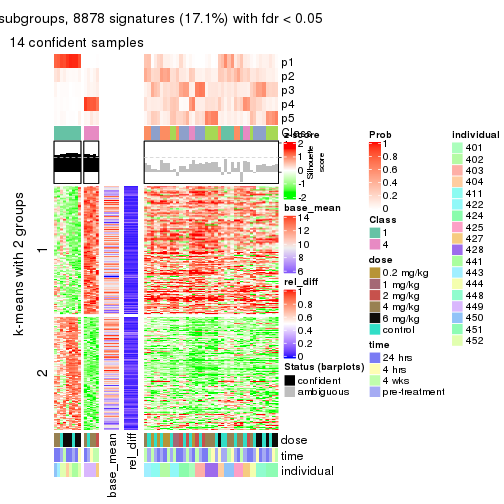</p>

</div>
<div id='tab-CV-skmeans-get-signatures-5'>
<pre><code class="r">get_signatures(res, k = 6)
</code></pre>

<p>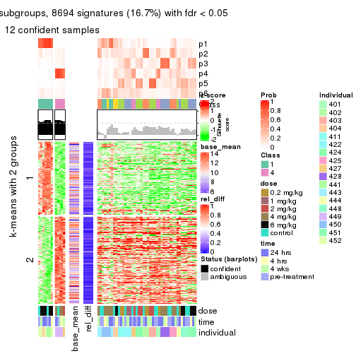</p>

</div>
</div>


Signature heatmaps where rows are not scaled:


<script>
$( function() {
	$( '#tabs-CV-skmeans-get-signatures-no-scale' ).tabs();
} );
</script>
<div id='tabs-CV-skmeans-get-signatures-no-scale'>
<ul>
<li><a href='#tab-CV-skmeans-get-signatures-no-scale-1'>k = 2</a></li>
<li><a href='#tab-CV-skmeans-get-signatures-no-scale-2'>k = 3</a></li>
<li><a href='#tab-CV-skmeans-get-signatures-no-scale-3'>k = 4</a></li>
<li><a href='#tab-CV-skmeans-get-signatures-no-scale-4'>k = 5</a></li>
<li><a href='#tab-CV-skmeans-get-signatures-no-scale-5'>k = 6</a></li>
</ul>
<div id='tab-CV-skmeans-get-signatures-no-scale-1'>
<pre><code class="r">get_signatures(res, k = 2, scale_rows = FALSE)
</code></pre>

<p>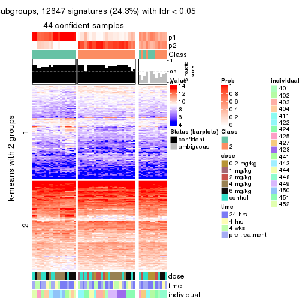</p>

</div>
<div id='tab-CV-skmeans-get-signatures-no-scale-2'>
<pre><code class="r">get_signatures(res, k = 3, scale_rows = FALSE)
</code></pre>

<p>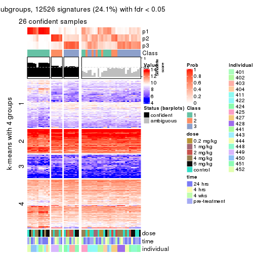</p>

</div>
<div id='tab-CV-skmeans-get-signatures-no-scale-3'>
<pre><code class="r">get_signatures(res, k = 4, scale_rows = FALSE)
</code></pre>

<p></p>

</div>
<div id='tab-CV-skmeans-get-signatures-no-scale-4'>
<pre><code class="r">get_signatures(res, k = 5, scale_rows = FALSE)
</code></pre>

<p>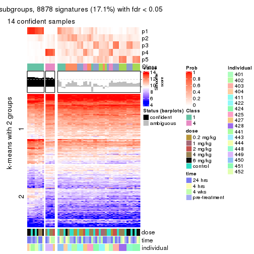</p>

</div>
<div id='tab-CV-skmeans-get-signatures-no-scale-5'>
<pre><code class="r">get_signatures(res, k = 6, scale_rows = FALSE)
</code></pre>

<p>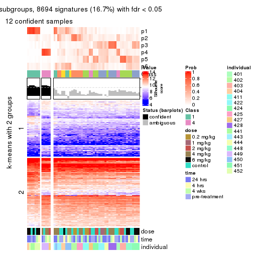</p>

</div>
</div>


Compare the overlap of signatures from different k:

```r
compare_signatures(res)
```

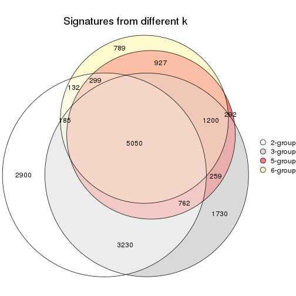

`get_signature()` returns a data frame invisibly. TO get the list of signatures, the function
call should be assigned to a variable explicitly. In following code, if `plot` argument is set
to `FALSE`, no heatmap is plotted while only the differential analysis is performed.

```r
# code only for demonstration
tb = get_signature(res, k = ..., plot = FALSE)
```

An example of the output of `tb` is:

```
#>   which_row         fdr    mean_1    mean_2 scaled_mean_1 scaled_mean_2 km
#> 1        38 0.042760348  8.373488  9.131774    -0.5533452     0.5164555  1
#> 2        40 0.018707592  7.106213  8.469186    -0.6173731     0.5762149  1
#> 3        55 0.019134737 10.221463 11.207825    -0.6159697     0.5749050  1
#> 4        59 0.006059896  5.921854  7.869574    -0.6899429     0.6439467  1
#> 5        60 0.018055526  8.928898 10.211722    -0.6204761     0.5791110  1
#> 6        98 0.009384629 15.714769 14.887706     0.6635654    -0.6193277  2
...
```

The columns in `tb` are:

1. `which_row`: row indices corresponding to the input matrix.
2. `fdr`: FDR for the differential test. 
3. `mean_x`: The mean value in group x.
4. `scaled_mean_x`: The mean value in group x after rows are scaled.
5. `km`: Row groups if k-means clustering is applied to rows.


UMAP plot which shows how samples are separated.


<script>
$( function() {
	$( '#tabs-CV-skmeans-dimension-reduction' ).tabs();
} );
</script>
<div id='tabs-CV-skmeans-dimension-reduction'>
<ul>
<li><a href='#tab-CV-skmeans-dimension-reduction-1'>k = 2</a></li>
<li><a href='#tab-CV-skmeans-dimension-reduction-2'>k = 3</a></li>
<li><a href='#tab-CV-skmeans-dimension-reduction-3'>k = 4</a></li>
<li><a href='#tab-CV-skmeans-dimension-reduction-4'>k = 5</a></li>
<li><a href='#tab-CV-skmeans-dimension-reduction-5'>k = 6</a></li>
</ul>
<div id='tab-CV-skmeans-dimension-reduction-1'>
<pre><code class="r">dimension_reduction(res, k = 2, method = &quot;UMAP&quot;)
</code></pre>

<p>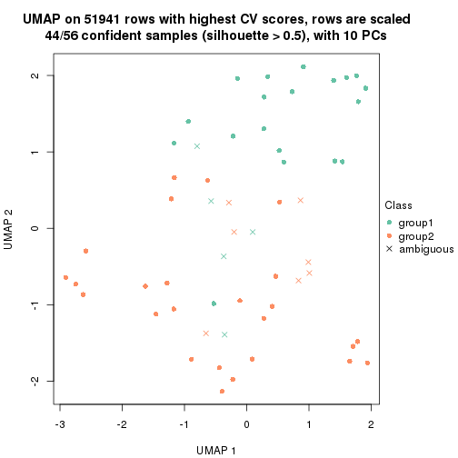</p>

</div>
<div id='tab-CV-skmeans-dimension-reduction-2'>
<pre><code class="r">dimension_reduction(res, k = 3, method = &quot;UMAP&quot;)
</code></pre>

<p>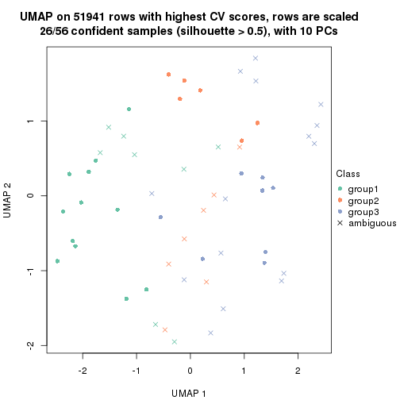</p>

</div>
<div id='tab-CV-skmeans-dimension-reduction-3'>
<pre><code class="r">dimension_reduction(res, k = 4, method = &quot;UMAP&quot;)
</code></pre>

<p>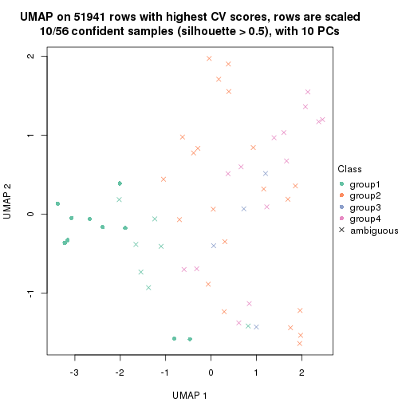</p>

</div>
<div id='tab-CV-skmeans-dimension-reduction-4'>
<pre><code class="r">dimension_reduction(res, k = 5, method = &quot;UMAP&quot;)
</code></pre>

<p>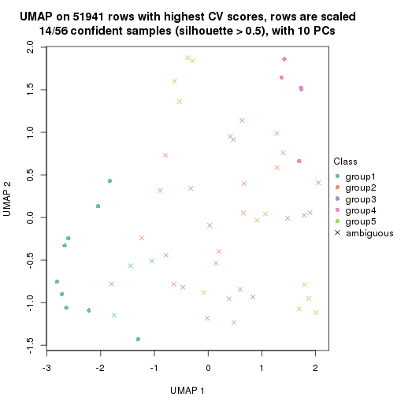</p>

</div>
<div id='tab-CV-skmeans-dimension-reduction-5'>
<pre><code class="r">dimension_reduction(res, k = 6, method = &quot;UMAP&quot;)
</code></pre>

<p>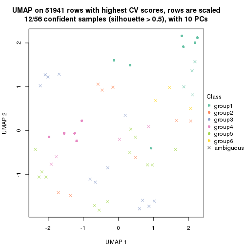</p>

</div>
</div>


Following heatmap shows how subgroups are split when increasing `k`:

```r
collect_classes(res)
```

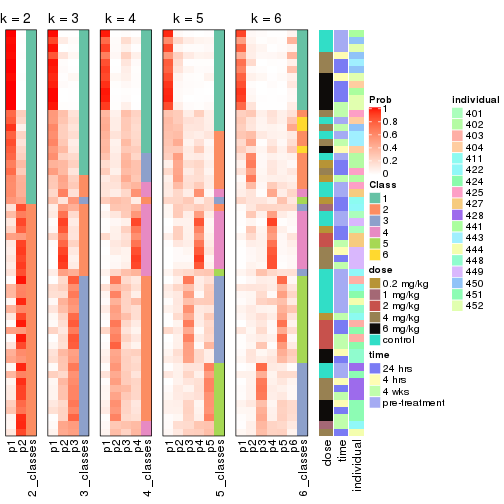


Test correlation between subgroups and known annotations. If the known
annotation is numeric, one-way ANOVA test is applied, and if the known
annotation is discrete, chi-squared contingency table test is applied.

```r
test_to_known_factors(res)
```

```
#>             n dose(p) time(p) individual(p) k
#> CV:skmeans 44  0.1348   0.878      0.000197 2
#> CV:skmeans 26  0.0636   0.702      0.000114 3
#> CV:skmeans 10      NA      NA            NA 4
#> CV:skmeans 14  0.1181   0.496      0.029636 5
#> CV:skmeans 12  0.0261   0.712      0.017351 6
```


If matrix rows can be associated to genes, consider to use `functional_enrichment(res,
...)` to perform function enrichment for the signature genes. See [this vignette](http://bioconductor.org/packages/devel/bioc/vignettes/cola/inst/doc/functional_enrichment.html) for more detailed explanations.


 

---------------------------------------------------


### CV:pam


The object with results only for a single top-value method and a single partition method 
can be extracted as:

```r
res = res_list["CV", "pam"]
# you can also extract it by
# res = res_list["CV:pam"]
```

A summary of `res` and all the functions that can be applied to it:

```r
res
```

```
#> A 'ConsensusPartition' object with k = 2, 3, 4, 5, 6.
#>   On a matrix with 51941 rows and 56 columns.
#>   Top rows (1000, 2000, 3000, 4000, 5000) are extracted by 'CV' method.
#>   Subgroups are detected by 'pam' method.
#>   Performed in total 1250 partitions by row resampling.
#>   Best k for subgroups seems to be 2.
#> 
#> Following methods can be applied to this 'ConsensusPartition' object:
#>  [1] "cola_report"             "collect_classes"         "collect_plots"          
#>  [4] "collect_stats"           "colnames"                "compare_signatures"     
#>  [7] "consensus_heatmap"       "dimension_reduction"     "functional_enrichment"  
#> [10] "get_anno_col"            "get_anno"                "get_classes"            
#> [13] "get_consensus"           "get_matrix"              "get_membership"         
#> [16] "get_param"               "get_signatures"          "get_stats"              
#> [19] "is_best_k"               "is_stable_k"             "membership_heatmap"     
#> [22] "ncol"                    "nrow"                    "plot_ecdf"              
#> [25] "rownames"                "select_partition_number" "show"                   
#> [28] "suggest_best_k"          "test_to_known_factors"
```

`collect_plots()` function collects all the plots made from `res` for all `k` (number of partitions)
into one single page to provide an easy and fast comparison between different `k`.

```r
collect_plots(res)
```

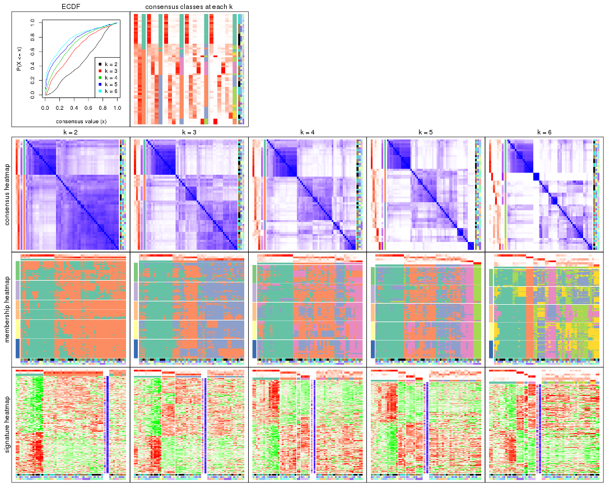

The plots are:

- The first row: a plot of the ECDF (empirical cumulative distribution
  function) curves of the consensus matrix for each `k` and the heatmap of
  predicted classes for each `k`.
- The second row: heatmaps of the consensus matrix for each `k`.
- The third row: heatmaps of the membership matrix for each `k`.
- The fouth row: heatmaps of the signatures for each `k`.

All the plots in panels can be made by individual functions and they are
plotted later in this section.

`select_partition_number()` produces several plots showing different
statistics for choosing "optimized" `k`. There are following statistics:

- ECDF curves of the consensus matrix for each `k`;
- 1-PAC. [The PAC
  score](https://en.wikipedia.org/wiki/Consensus_clustering#Over-interpretation_potential_of_consensus_clustering)
  measures the proportion of the ambiguous subgrouping.
- Mean silhouette score.
- Concordance. The mean probability of fiting the consensus class ids in all
  partitions.
- Area increased. Denote $A_k$ as the area under the ECDF curve for current
  `k`, the area increased is defined as $A_k - A_{k-1}$.
- Rand index. The percent of pairs of samples that are both in a same cluster
  or both are not in a same cluster in the partition of k and k-1.
- Jaccard index. The ratio of pairs of samples are both in a same cluster in
  the partition of k and k-1 and the pairs of samples are both in a same
  cluster in the partition k or k-1.

The detailed explanations of these statistics can be found in [the _cola_
vignette](http://bioconductor.org/packages/devel/bioc/vignettes/cola/inst/doc/cola.html#toc_13).

Generally speaking, lower PAC score, higher mean silhouette score or higher
concordance corresponds to better partition. Rand index and Jaccard index
measure how similar the current partition is compared to partition with `k-1`.
If they are too similar, we won't accept `k` is better than `k-1`.

```r
select_partition_number(res)
```

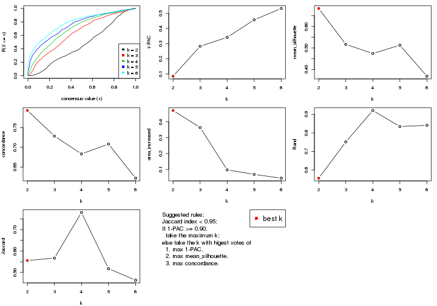

The numeric values for all these statistics can be obtained by `get_stats()`.

```r
get_stats(res)
```

```
#>   k  1-PAC mean_silhouette concordance area_increased  Rand Jaccard
#> 2 2 0.0856           0.683       0.793         0.4717 0.556   0.556
#> 3 3 0.2830           0.517       0.728         0.3644 0.751   0.567
#> 4 4 0.3418           0.474       0.683         0.0974 0.921   0.780
#> 5 5 0.4572           0.513       0.708         0.0691 0.834   0.518
#> 6 6 0.5319           0.369       0.622         0.0449 0.841   0.464
```

`suggest_best_k()` suggests the best $k$ based on these statistics. The rules are as follows:

- All $k$ with Jaccard index larger than 0.95 are removed because increasing
  $k$ does not provide enough extra information. If all $k$ are removed, it is
  marked as no subgroup is detected.
- For all $k$ with 1-PAC score larger than 0.9, the maximal $k$ is taken as
  the best $k$, and other $k$ are marked as optional $k$.
- If it does not fit the second rule. The $k$ with the maximal vote of the
  highest 1-PAC score, highest mean silhouette, and highest concordance is
  taken as the best $k$.

```r
suggest_best_k(res)
```

```
#> [1] 2
```


Following shows the table of the partitions (You need to click the **show/hide
code output** link to see it). The membership matrix (columns with name `p*`)
is inferred by
[`clue::cl_consensus()`](https://www.rdocumentation.org/link/cl_consensus?package=clue)
function with the `SE` method. Basically the value in the membership matrix
represents the probability to belong to a certain group. The finall class
label for an item is determined with the group with highest probability it
belongs to.

In `get_classes()` function, the entropy is calculated from the membership
matrix and the silhouette score is calculated from the consensus matrix.


<script>
$( function() {
	$( '#tabs-CV-pam-get-classes' ).tabs();
} );
</script>
<div id='tabs-CV-pam-get-classes'>
<ul>
<li><a href='#tab-CV-pam-get-classes-1'>k = 2</a></li>
<li><a href='#tab-CV-pam-get-classes-2'>k = 3</a></li>
<li><a href='#tab-CV-pam-get-classes-3'>k = 4</a></li>
<li><a href='#tab-CV-pam-get-classes-4'>k = 5</a></li>
<li><a href='#tab-CV-pam-get-classes-5'>k = 6</a></li>
</ul>

<div id='tab-CV-pam-get-classes-1'>
<p><a id='tab-CV-pam-get-classes-1-a' style='color:#0366d6' href='#'>show/hide code output</a></p>
<pre><code class="r">cbind(get_classes(res, k = 2), get_membership(res, k = 2))
</code></pre>

<pre><code>#&gt;           class entropy silhouette    p1    p2
#&gt; GSM687644     2   0.909      0.699 0.324 0.676
#&gt; GSM687648     1   0.295      0.804 0.948 0.052
#&gt; GSM687653     2   0.714      0.734 0.196 0.804
#&gt; GSM687658     2   0.958      0.621 0.380 0.620
#&gt; GSM687663     2   0.343      0.780 0.064 0.936
#&gt; GSM687668     2   0.895      0.651 0.312 0.688
#&gt; GSM687673     2   0.861      0.675 0.284 0.716
#&gt; GSM687678     2   0.971      0.409 0.400 0.600
#&gt; GSM687683     2   0.584      0.786 0.140 0.860
#&gt; GSM687688     2   0.552      0.786 0.128 0.872
#&gt; GSM687695     1   0.529      0.769 0.880 0.120
#&gt; GSM687699     1   0.311      0.809 0.944 0.056
#&gt; GSM687704     2   0.118      0.769 0.016 0.984
#&gt; GSM687707     2   0.730      0.787 0.204 0.796
#&gt; GSM687712     2   0.574      0.781 0.136 0.864
#&gt; GSM687719     1   0.821      0.658 0.744 0.256
#&gt; GSM687724     2   0.662      0.791 0.172 0.828
#&gt; GSM687728     1   0.163      0.816 0.976 0.024
#&gt; GSM687646     2   0.814      0.757 0.252 0.748
#&gt; GSM687649     1   0.999     -0.151 0.520 0.480
#&gt; GSM687665     2   0.886      0.495 0.304 0.696
#&gt; GSM687651     2   0.998      0.432 0.476 0.524
#&gt; GSM687667     2   0.204      0.773 0.032 0.968
#&gt; GSM687670     2   0.680      0.792 0.180 0.820
#&gt; GSM687671     2   0.506      0.791 0.112 0.888
#&gt; GSM687654     2   0.680      0.744 0.180 0.820
#&gt; GSM687675     1   0.978      0.293 0.588 0.412
#&gt; GSM687685     2   0.949      0.495 0.368 0.632
#&gt; GSM687656     2   0.506      0.769 0.112 0.888
#&gt; GSM687677     2   0.625      0.787 0.156 0.844
#&gt; GSM687687     2   0.456      0.782 0.096 0.904
#&gt; GSM687692     2   0.671      0.797 0.176 0.824
#&gt; GSM687716     2   0.625      0.777 0.156 0.844
#&gt; GSM687722     1   0.469      0.792 0.900 0.100
#&gt; GSM687680     1   0.738      0.577 0.792 0.208
#&gt; GSM687690     2   0.714      0.774 0.196 0.804
#&gt; GSM687700     1   0.118      0.812 0.984 0.016
#&gt; GSM687705     2   0.714      0.760 0.196 0.804
#&gt; GSM687714     2   0.671      0.780 0.176 0.824
#&gt; GSM687721     1   0.541      0.770 0.876 0.124
#&gt; GSM687682     2   0.999      0.221 0.484 0.516
#&gt; GSM687694     2   0.917      0.592 0.332 0.668
#&gt; GSM687702     1   0.163      0.814 0.976 0.024
#&gt; GSM687718     2   0.689      0.793 0.184 0.816
#&gt; GSM687723     2   1.000      0.152 0.492 0.508
#&gt; GSM687661     1   0.952      0.127 0.628 0.372
#&gt; GSM687710     2   0.634      0.758 0.160 0.840
#&gt; GSM687726     2   0.745      0.775 0.212 0.788
#&gt; GSM687730     1   0.343      0.790 0.936 0.064
#&gt; GSM687660     1   0.416      0.801 0.916 0.084
#&gt; GSM687697     1   0.224      0.817 0.964 0.036
#&gt; GSM687709     2   0.605      0.794 0.148 0.852
#&gt; GSM687725     2   0.714      0.744 0.196 0.804
#&gt; GSM687729     1   0.141      0.811 0.980 0.020
#&gt; GSM687727     2   0.204      0.771 0.032 0.968
#&gt; GSM687731     1   0.327      0.794 0.940 0.060
</code></pre>

<script>
$('#tab-CV-pam-get-classes-1-a').parent().next().next().hide();
$('#tab-CV-pam-get-classes-1-a').click(function(){
  $('#tab-CV-pam-get-classes-1-a').parent().next().next().toggle();
  return(false);
});
</script>
</div>

<div id='tab-CV-pam-get-classes-2'>
<p><a id='tab-CV-pam-get-classes-2-a' style='color:#0366d6' href='#'>show/hide code output</a></p>
<pre><code class="r">cbind(get_classes(res, k = 3), get_membership(res, k = 3))
</code></pre>

<pre><code>#&gt;           class entropy silhouette    p1    p2    p3
#&gt; GSM687644     2  0.5961     0.5525 0.136 0.788 0.076
#&gt; GSM687648     1  0.2313     0.7925 0.944 0.032 0.024
#&gt; GSM687653     3  0.7015     0.4958 0.064 0.240 0.696
#&gt; GSM687658     3  0.9211     0.2154 0.176 0.312 0.512
#&gt; GSM687663     3  0.3889     0.6421 0.032 0.084 0.884
#&gt; GSM687668     3  0.9411     0.1864 0.252 0.240 0.508
#&gt; GSM687673     3  0.6794     0.5654 0.076 0.196 0.728
#&gt; GSM687678     1  0.9930    -0.2867 0.368 0.356 0.276
#&gt; GSM687683     2  0.7091     0.1216 0.024 0.560 0.416
#&gt; GSM687688     3  0.7285     0.4998 0.048 0.320 0.632
#&gt; GSM687695     1  0.1636     0.7994 0.964 0.016 0.020
#&gt; GSM687699     1  0.2339     0.7976 0.940 0.048 0.012
#&gt; GSM687704     3  0.5247     0.5491 0.008 0.224 0.768
#&gt; GSM687707     3  0.5915     0.6239 0.080 0.128 0.792
#&gt; GSM687712     2  0.4483     0.5523 0.024 0.848 0.128
#&gt; GSM687719     1  0.7180     0.5903 0.716 0.168 0.116
#&gt; GSM687724     3  0.4357     0.6478 0.052 0.080 0.868
#&gt; GSM687728     1  0.0475     0.8054 0.992 0.004 0.004
#&gt; GSM687646     2  0.4921     0.5868 0.072 0.844 0.084
#&gt; GSM687649     2  0.9971     0.0860 0.352 0.352 0.296
#&gt; GSM687665     3  0.6128     0.5835 0.136 0.084 0.780
#&gt; GSM687651     3  0.8941     0.3436 0.300 0.156 0.544
#&gt; GSM687667     3  0.2682     0.6359 0.004 0.076 0.920
#&gt; GSM687670     3  0.8487     0.4268 0.124 0.292 0.584
#&gt; GSM687671     3  0.4519     0.6467 0.032 0.116 0.852
#&gt; GSM687654     3  0.7213     0.4462 0.060 0.272 0.668
#&gt; GSM687675     1  0.9536     0.0686 0.488 0.260 0.252
#&gt; GSM687685     2  0.9544     0.1734 0.196 0.440 0.364
#&gt; GSM687656     3  0.6187     0.4950 0.028 0.248 0.724
#&gt; GSM687677     3  0.4891     0.6361 0.040 0.124 0.836
#&gt; GSM687687     2  0.5062     0.5120 0.016 0.800 0.184
#&gt; GSM687692     3  0.7773     0.4645 0.072 0.316 0.612
#&gt; GSM687716     2  0.2414     0.5823 0.020 0.940 0.040
#&gt; GSM687722     1  0.4709     0.7434 0.852 0.092 0.056
#&gt; GSM687680     1  0.6394     0.5930 0.768 0.116 0.116
#&gt; GSM687690     3  0.7919     0.3221 0.064 0.380 0.556
#&gt; GSM687700     1  0.0661     0.8032 0.988 0.004 0.008
#&gt; GSM687705     3  0.4887     0.6485 0.060 0.096 0.844
#&gt; GSM687714     2  0.3337     0.5876 0.032 0.908 0.060
#&gt; GSM687721     1  0.3499     0.7735 0.900 0.072 0.028
#&gt; GSM687682     2  0.9833     0.2759 0.332 0.412 0.256
#&gt; GSM687694     2  0.8969     0.0619 0.140 0.512 0.348
#&gt; GSM687702     1  0.1337     0.8054 0.972 0.016 0.012
#&gt; GSM687718     2  0.3589     0.5867 0.052 0.900 0.048
#&gt; GSM687723     2  0.9959     0.2051 0.340 0.368 0.292
#&gt; GSM687661     1  0.9599    -0.0366 0.472 0.292 0.236
#&gt; GSM687710     3  0.7218     0.4078 0.052 0.296 0.652
#&gt; GSM687726     3  0.5377     0.6477 0.068 0.112 0.820
#&gt; GSM687730     1  0.1031     0.7969 0.976 0.000 0.024
#&gt; GSM687660     1  0.2918     0.7902 0.924 0.044 0.032
#&gt; GSM687697     1  0.0592     0.8062 0.988 0.000 0.012
#&gt; GSM687709     3  0.6109     0.5948 0.048 0.192 0.760
#&gt; GSM687725     3  0.6253     0.5500 0.036 0.232 0.732
#&gt; GSM687729     1  0.0237     0.8042 0.996 0.000 0.004
#&gt; GSM687727     3  0.6066     0.5239 0.024 0.248 0.728
#&gt; GSM687731     1  0.0892     0.7980 0.980 0.000 0.020
</code></pre>

<script>
$('#tab-CV-pam-get-classes-2-a').parent().next().next().hide();
$('#tab-CV-pam-get-classes-2-a').click(function(){
  $('#tab-CV-pam-get-classes-2-a').parent().next().next().toggle();
  return(false);
});
</script>
</div>

<div id='tab-CV-pam-get-classes-3'>
<p><a id='tab-CV-pam-get-classes-3-a' style='color:#0366d6' href='#'>show/hide code output</a></p>
<pre><code class="r">cbind(get_classes(res, k = 4), get_membership(res, k = 4))
</code></pre>

<pre><code>#&gt;           class entropy silhouette    p1    p2    p3    p4
#&gt; GSM687644     4  0.6396    0.45617 0.112 0.024 0.168 0.696
#&gt; GSM687648     1  0.3504    0.73856 0.880 0.016 0.048 0.056
#&gt; GSM687653     2  0.5463    0.49512 0.032 0.724 0.020 0.224
#&gt; GSM687658     2  0.9481    0.23485 0.140 0.396 0.268 0.196
#&gt; GSM687663     2  0.3172    0.60962 0.020 0.884 0.008 0.088
#&gt; GSM687668     2  0.9296    0.24945 0.228 0.436 0.128 0.208
#&gt; GSM687673     2  0.7208    0.50640 0.056 0.648 0.184 0.112
#&gt; GSM687678     1  0.9759   -0.05346 0.364 0.208 0.196 0.232
#&gt; GSM687683     4  0.8076   -0.00428 0.012 0.344 0.224 0.420
#&gt; GSM687688     3  0.6736    0.42114 0.008 0.264 0.616 0.112
#&gt; GSM687695     1  0.1247    0.74734 0.968 0.012 0.004 0.016
#&gt; GSM687699     1  0.3256    0.74269 0.884 0.004 0.044 0.068
#&gt; GSM687704     2  0.4267    0.54445 0.004 0.772 0.008 0.216
#&gt; GSM687707     2  0.6428    0.49697 0.052 0.664 0.248 0.036
#&gt; GSM687712     4  0.3587    0.51642 0.000 0.104 0.040 0.856
#&gt; GSM687719     1  0.6640    0.58772 0.696 0.064 0.076 0.164
#&gt; GSM687724     2  0.6258    0.57879 0.040 0.720 0.148 0.092
#&gt; GSM687728     1  0.0376    0.74950 0.992 0.000 0.004 0.004
#&gt; GSM687646     4  0.4406    0.55491 0.044 0.044 0.072 0.840
#&gt; GSM687649     4  0.8949    0.04437 0.324 0.272 0.052 0.352
#&gt; GSM687665     2  0.4541    0.59240 0.100 0.812 0.004 0.084
#&gt; GSM687651     2  0.8587    0.33116 0.264 0.508 0.108 0.120
#&gt; GSM687667     2  0.1716    0.60571 0.000 0.936 0.000 0.064
#&gt; GSM687670     2  0.8594    0.42777 0.100 0.528 0.168 0.204
#&gt; GSM687671     2  0.4908    0.60449 0.012 0.796 0.076 0.116
#&gt; GSM687654     2  0.6193    0.40669 0.020 0.644 0.044 0.292
#&gt; GSM687675     1  0.9034    0.19879 0.456 0.260 0.104 0.180
#&gt; GSM687685     4  0.9792   -0.03213 0.152 0.284 0.272 0.292
#&gt; GSM687656     2  0.5306    0.47844 0.020 0.720 0.020 0.240
#&gt; GSM687677     2  0.5691    0.48550 0.020 0.676 0.280 0.024
#&gt; GSM687687     4  0.5727    0.45639 0.000 0.200 0.096 0.704
#&gt; GSM687692     3  0.4132    0.52456 0.008 0.176 0.804 0.012
#&gt; GSM687716     4  0.0817    0.56284 0.000 0.024 0.000 0.976
#&gt; GSM687722     1  0.5599    0.67808 0.768 0.048 0.060 0.124
#&gt; GSM687680     1  0.6414    0.53966 0.716 0.096 0.136 0.052
#&gt; GSM687690     3  0.3508    0.52756 0.004 0.136 0.848 0.012
#&gt; GSM687700     1  0.2297    0.74638 0.928 0.004 0.044 0.024
#&gt; GSM687705     2  0.4983    0.60297 0.040 0.808 0.088 0.064
#&gt; GSM687714     4  0.1305    0.56351 0.004 0.036 0.000 0.960
#&gt; GSM687721     1  0.4465    0.72034 0.836 0.036 0.052 0.076
#&gt; GSM687682     1  0.9711   -0.25811 0.332 0.248 0.144 0.276
#&gt; GSM687694     3  0.6876    0.38801 0.032 0.104 0.652 0.212
#&gt; GSM687702     1  0.2825    0.74738 0.908 0.008 0.048 0.036
#&gt; GSM687718     4  0.1452    0.55784 0.008 0.036 0.000 0.956
#&gt; GSM687723     3  0.9951   -0.17659 0.232 0.224 0.300 0.244
#&gt; GSM687661     1  0.9604    0.00981 0.376 0.180 0.276 0.168
#&gt; GSM687710     2  0.7753    0.39552 0.040 0.576 0.224 0.160
#&gt; GSM687726     2  0.6569    0.44609 0.068 0.628 0.284 0.020
#&gt; GSM687730     1  0.0524    0.74781 0.988 0.008 0.004 0.000
#&gt; GSM687660     1  0.2838    0.74039 0.908 0.016 0.056 0.020
#&gt; GSM687697     1  0.0336    0.75067 0.992 0.008 0.000 0.000
#&gt; GSM687709     2  0.6660    0.49707 0.032 0.664 0.220 0.084
#&gt; GSM687725     2  0.7783    0.45665 0.016 0.500 0.312 0.172
#&gt; GSM687729     1  0.0188    0.74992 0.996 0.004 0.000 0.000
#&gt; GSM687727     2  0.7081    0.52945 0.048 0.660 0.152 0.140
#&gt; GSM687731     1  0.0336    0.74813 0.992 0.008 0.000 0.000
</code></pre>

<script>
$('#tab-CV-pam-get-classes-3-a').parent().next().next().hide();
$('#tab-CV-pam-get-classes-3-a').click(function(){
  $('#tab-CV-pam-get-classes-3-a').parent().next().next().toggle();
  return(false);
});
</script>
</div>

<div id='tab-CV-pam-get-classes-4'>
<p><a id='tab-CV-pam-get-classes-4-a' style='color:#0366d6' href='#'>show/hide code output</a></p>
<pre><code class="r">cbind(get_classes(res, k = 5), get_membership(res, k = 5))
</code></pre>

<pre><code>#&gt;           class entropy silhouette    p1    p2    p3    p4    p5
#&gt; GSM687644     4  0.6981     0.3745 0.072 0.048 0.320 0.536 0.024
#&gt; GSM687648     1  0.4321     0.8038 0.824 0.044 0.068 0.044 0.020
#&gt; GSM687653     2  0.4460     0.5081 0.012 0.756 0.020 0.200 0.012
#&gt; GSM687658     3  0.7186     0.3335 0.092 0.248 0.564 0.080 0.016
#&gt; GSM687663     2  0.4455     0.4900 0.016 0.692 0.284 0.008 0.000
#&gt; GSM687668     2  0.8613    -0.0954 0.200 0.336 0.324 0.120 0.020
#&gt; GSM687673     3  0.5768    -0.0925 0.032 0.432 0.508 0.024 0.004
#&gt; GSM687678     3  0.7545     0.3834 0.304 0.084 0.484 0.120 0.008
#&gt; GSM687683     3  0.5270     0.3828 0.008 0.104 0.692 0.196 0.000
#&gt; GSM687688     5  0.1121     0.9550 0.000 0.044 0.000 0.000 0.956
#&gt; GSM687695     1  0.0510     0.8462 0.984 0.000 0.016 0.000 0.000
#&gt; GSM687699     1  0.3983     0.8160 0.840 0.044 0.072 0.024 0.020
#&gt; GSM687704     2  0.5041     0.5349 0.000 0.716 0.132 0.148 0.004
#&gt; GSM687707     3  0.6100     0.1124 0.044 0.348 0.568 0.024 0.016
#&gt; GSM687712     4  0.2648     0.6124 0.000 0.000 0.152 0.848 0.000
#&gt; GSM687719     1  0.5413     0.5173 0.628 0.016 0.316 0.032 0.008
#&gt; GSM687724     2  0.4270     0.5129 0.032 0.820 0.092 0.016 0.040
#&gt; GSM687728     1  0.0609     0.8452 0.980 0.000 0.020 0.000 0.000
#&gt; GSM687646     4  0.5452     0.5397 0.008 0.040 0.276 0.656 0.020
#&gt; GSM687649     2  0.8246     0.0224 0.292 0.320 0.056 0.312 0.020
#&gt; GSM687665     2  0.5454     0.4922 0.104 0.684 0.200 0.008 0.004
#&gt; GSM687651     2  0.8084     0.1559 0.196 0.460 0.244 0.080 0.020
#&gt; GSM687667     2  0.3534     0.4881 0.000 0.744 0.256 0.000 0.000
#&gt; GSM687670     3  0.7691    -0.0998 0.068 0.376 0.424 0.112 0.020
#&gt; GSM687671     2  0.5755     0.4487 0.000 0.624 0.288 0.052 0.036
#&gt; GSM687654     2  0.5734     0.4307 0.008 0.640 0.052 0.276 0.024
#&gt; GSM687675     3  0.7680     0.1793 0.384 0.156 0.396 0.048 0.016
#&gt; GSM687685     3  0.5454     0.4726 0.104 0.056 0.740 0.092 0.008
#&gt; GSM687656     2  0.4359     0.5026 0.004 0.748 0.020 0.216 0.012
#&gt; GSM687677     2  0.6147     0.0644 0.004 0.492 0.408 0.008 0.088
#&gt; GSM687687     4  0.6207     0.1783 0.000 0.120 0.420 0.456 0.004
#&gt; GSM687692     5  0.1106     0.9733 0.000 0.024 0.012 0.000 0.964
#&gt; GSM687716     4  0.0609     0.7070 0.000 0.000 0.020 0.980 0.000
#&gt; GSM687722     1  0.5169     0.7175 0.720 0.052 0.196 0.028 0.004
#&gt; GSM687680     1  0.5156     0.5315 0.704 0.020 0.228 0.040 0.008
#&gt; GSM687690     5  0.0898     0.9661 0.000 0.008 0.020 0.000 0.972
#&gt; GSM687700     1  0.3172     0.8294 0.884 0.044 0.036 0.016 0.020
#&gt; GSM687705     2  0.5950     0.4623 0.024 0.648 0.252 0.056 0.020
#&gt; GSM687714     4  0.0510     0.7072 0.000 0.000 0.016 0.984 0.000
#&gt; GSM687721     1  0.3896     0.7532 0.780 0.004 0.196 0.012 0.008
#&gt; GSM687682     3  0.7844     0.3027 0.304 0.120 0.428 0.148 0.000
#&gt; GSM687694     5  0.1186     0.9702 0.000 0.020 0.008 0.008 0.964
#&gt; GSM687702     1  0.3470     0.8288 0.868 0.044 0.052 0.016 0.020
#&gt; GSM687718     4  0.0566     0.7050 0.000 0.004 0.012 0.984 0.000
#&gt; GSM687723     3  0.4643     0.4806 0.164 0.016 0.768 0.040 0.012
#&gt; GSM687661     3  0.6795     0.4165 0.296 0.060 0.568 0.052 0.024
#&gt; GSM687710     3  0.3719     0.3425 0.012 0.208 0.776 0.000 0.004
#&gt; GSM687726     2  0.5784     0.4215 0.052 0.712 0.068 0.016 0.152
#&gt; GSM687730     1  0.0404     0.8463 0.988 0.000 0.012 0.000 0.000
#&gt; GSM687660     1  0.2963     0.8144 0.876 0.016 0.092 0.012 0.004
#&gt; GSM687697     1  0.0451     0.8471 0.988 0.008 0.004 0.000 0.000
#&gt; GSM687709     3  0.5061     0.1429 0.012 0.340 0.624 0.020 0.004
#&gt; GSM687725     2  0.6267     0.0597 0.016 0.520 0.392 0.048 0.024
#&gt; GSM687729     1  0.0451     0.8462 0.988 0.004 0.008 0.000 0.000
#&gt; GSM687727     2  0.5684     0.4840 0.072 0.744 0.088 0.048 0.048
#&gt; GSM687731     1  0.0290     0.8458 0.992 0.000 0.008 0.000 0.000
</code></pre>

<script>
$('#tab-CV-pam-get-classes-4-a').parent().next().next().hide();
$('#tab-CV-pam-get-classes-4-a').click(function(){
  $('#tab-CV-pam-get-classes-4-a').parent().next().next().toggle();
  return(false);
});
</script>
</div>

<div id='tab-CV-pam-get-classes-5'>
<p><a id='tab-CV-pam-get-classes-5-a' style='color:#0366d6' href='#'>show/hide code output</a></p>
<pre><code class="r">cbind(get_classes(res, k = 6), get_membership(res, k = 6))
</code></pre>

<pre><code>#&gt;           class entropy silhouette    p1    p2    p3    p4    p5    p6
#&gt; GSM687644     4  0.6813   0.312748 0.056 0.000 0.012 0.472 0.304 0.156
#&gt; GSM687648     1  0.3733   0.749774 0.820 0.000 0.016 0.032 0.108 0.024
#&gt; GSM687653     5  0.6564  -0.124502 0.004 0.000 0.400 0.108 0.420 0.068
#&gt; GSM687658     6  0.8379   0.035414 0.104 0.000 0.196 0.096 0.280 0.324
#&gt; GSM687663     5  0.5614   0.000535 0.008 0.000 0.440 0.004 0.452 0.096
#&gt; GSM687668     5  0.8475   0.094241 0.216 0.000 0.196 0.076 0.336 0.176
#&gt; GSM687673     5  0.6633   0.028245 0.020 0.000 0.292 0.004 0.384 0.300
#&gt; GSM687678     1  0.8009  -0.281011 0.292 0.000 0.048 0.088 0.292 0.280
#&gt; GSM687683     5  0.7015  -0.197229 0.012 0.000 0.060 0.168 0.384 0.376
#&gt; GSM687688     2  0.0146   0.997337 0.000 0.996 0.004 0.000 0.000 0.000
#&gt; GSM687695     1  0.0777   0.778496 0.972 0.000 0.004 0.000 0.024 0.000
#&gt; GSM687699     1  0.2794   0.761509 0.840 0.000 0.012 0.004 0.144 0.000
#&gt; GSM687704     5  0.5775  -0.049292 0.000 0.000 0.444 0.060 0.448 0.048
#&gt; GSM687707     6  0.3125   0.456206 0.016 0.000 0.076 0.000 0.056 0.852
#&gt; GSM687712     4  0.2122   0.688603 0.000 0.000 0.000 0.900 0.024 0.076
#&gt; GSM687719     1  0.5775   0.561167 0.628 0.004 0.028 0.012 0.228 0.100
#&gt; GSM687724     3  0.1863   0.522580 0.016 0.004 0.920 0.000 0.060 0.000
#&gt; GSM687728     1  0.1219   0.774396 0.948 0.000 0.004 0.000 0.048 0.000
#&gt; GSM687646     4  0.5709   0.440440 0.008 0.000 0.028 0.552 0.340 0.072
#&gt; GSM687649     5  0.7799   0.094402 0.268 0.000 0.148 0.240 0.332 0.012
#&gt; GSM687665     5  0.5673   0.000122 0.044 0.000 0.428 0.000 0.472 0.056
#&gt; GSM687651     5  0.7960   0.101837 0.200 0.000 0.248 0.056 0.396 0.100
#&gt; GSM687667     5  0.5452  -0.006548 0.000 0.000 0.436 0.000 0.444 0.120
#&gt; GSM687670     5  0.8073   0.119126 0.052 0.008 0.252 0.080 0.380 0.228
#&gt; GSM687671     5  0.6831   0.003621 0.000 0.020 0.388 0.048 0.412 0.132
#&gt; GSM687654     5  0.7216  -0.090529 0.008 0.000 0.344 0.176 0.384 0.088
#&gt; GSM687675     5  0.7511  -0.108992 0.320 0.004 0.068 0.016 0.352 0.240
#&gt; GSM687685     5  0.6830  -0.241976 0.088 0.000 0.032 0.060 0.420 0.400
#&gt; GSM687656     3  0.6690  -0.078985 0.004 0.000 0.404 0.120 0.400 0.072
#&gt; GSM687677     6  0.7380  -0.130478 0.000 0.080 0.304 0.008 0.268 0.340
#&gt; GSM687687     5  0.6670  -0.209651 0.000 0.000 0.040 0.360 0.384 0.216
#&gt; GSM687692     2  0.0146   0.997337 0.000 0.996 0.004 0.000 0.000 0.000
#&gt; GSM687716     4  0.0260   0.752946 0.000 0.000 0.000 0.992 0.008 0.000
#&gt; GSM687722     1  0.5184   0.686596 0.716 0.004 0.036 0.012 0.140 0.092
#&gt; GSM687680     1  0.5143   0.594364 0.704 0.000 0.012 0.036 0.080 0.168
#&gt; GSM687690     2  0.0146   0.992000 0.000 0.996 0.000 0.000 0.004 0.000
#&gt; GSM687700     1  0.2520   0.767534 0.872 0.000 0.012 0.008 0.108 0.000
#&gt; GSM687705     3  0.6781  -0.163706 0.012 0.008 0.416 0.044 0.400 0.120
#&gt; GSM687714     4  0.0146   0.753422 0.000 0.000 0.000 0.996 0.004 0.000
#&gt; GSM687721     1  0.4247   0.713796 0.768 0.004 0.008 0.004 0.132 0.084
#&gt; GSM687682     5  0.8209  -0.112540 0.280 0.000 0.064 0.116 0.340 0.200
#&gt; GSM687694     2  0.0146   0.997337 0.000 0.996 0.004 0.000 0.000 0.000
#&gt; GSM687702     1  0.2611   0.767322 0.864 0.000 0.012 0.008 0.116 0.000
#&gt; GSM687718     4  0.0146   0.752920 0.000 0.000 0.000 0.996 0.000 0.004
#&gt; GSM687723     6  0.6487   0.109036 0.144 0.004 0.012 0.020 0.388 0.432
#&gt; GSM687661     1  0.7094  -0.185050 0.320 0.000 0.020 0.028 0.316 0.316
#&gt; GSM687710     6  0.2375   0.442522 0.008 0.000 0.060 0.000 0.036 0.896
#&gt; GSM687726     3  0.3636   0.494327 0.032 0.108 0.828 0.008 0.012 0.012
#&gt; GSM687730     1  0.1010   0.775830 0.960 0.000 0.004 0.000 0.036 0.000
#&gt; GSM687660     1  0.2572   0.770749 0.892 0.004 0.008 0.004 0.028 0.064
#&gt; GSM687697     1  0.0551   0.778850 0.984 0.000 0.004 0.000 0.008 0.004
#&gt; GSM687709     6  0.2703   0.463992 0.008 0.000 0.052 0.000 0.064 0.876
#&gt; GSM687725     3  0.4057   0.413626 0.008 0.004 0.776 0.000 0.132 0.080
#&gt; GSM687729     1  0.1003   0.775632 0.964 0.000 0.004 0.000 0.028 0.004
#&gt; GSM687727     3  0.2470   0.531595 0.028 0.012 0.904 0.004 0.044 0.008
#&gt; GSM687731     1  0.0858   0.775481 0.968 0.000 0.004 0.000 0.028 0.000
</code></pre>

<script>
$('#tab-CV-pam-get-classes-5-a').parent().next().next().hide();
$('#tab-CV-pam-get-classes-5-a').click(function(){
  $('#tab-CV-pam-get-classes-5-a').parent().next().next().toggle();
  return(false);
});
</script>
</div>
</div>

Heatmaps for the consensus matrix. It visualizes the probability of two
samples to be in a same group.


<script>
$( function() {
	$( '#tabs-CV-pam-consensus-heatmap' ).tabs();
} );
</script>
<div id='tabs-CV-pam-consensus-heatmap'>
<ul>
<li><a href='#tab-CV-pam-consensus-heatmap-1'>k = 2</a></li>
<li><a href='#tab-CV-pam-consensus-heatmap-2'>k = 3</a></li>
<li><a href='#tab-CV-pam-consensus-heatmap-3'>k = 4</a></li>
<li><a href='#tab-CV-pam-consensus-heatmap-4'>k = 5</a></li>
<li><a href='#tab-CV-pam-consensus-heatmap-5'>k = 6</a></li>
</ul>
<div id='tab-CV-pam-consensus-heatmap-1'>
<pre><code class="r">consensus_heatmap(res, k = 2)
</code></pre>

<p>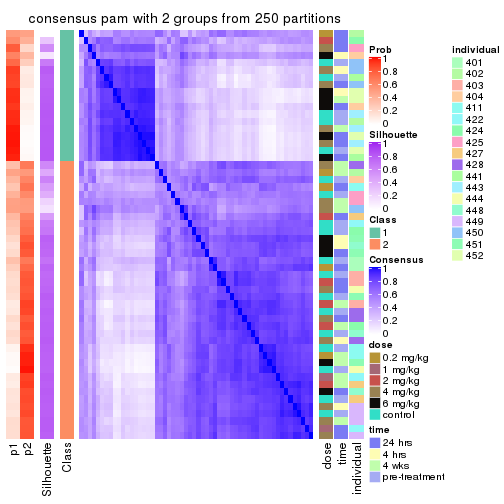</p>

</div>
<div id='tab-CV-pam-consensus-heatmap-2'>
<pre><code class="r">consensus_heatmap(res, k = 3)
</code></pre>

<p>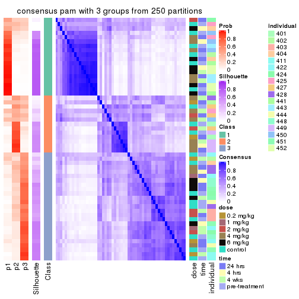</p>

</div>
<div id='tab-CV-pam-consensus-heatmap-3'>
<pre><code class="r">consensus_heatmap(res, k = 4)
</code></pre>

<p>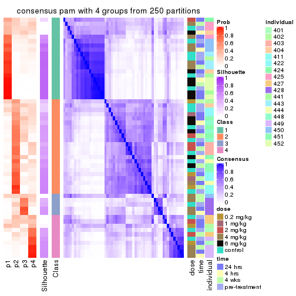</p>

</div>
<div id='tab-CV-pam-consensus-heatmap-4'>
<pre><code class="r">consensus_heatmap(res, k = 5)
</code></pre>

<p>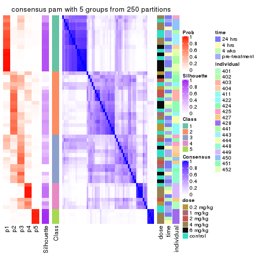</p>

</div>
<div id='tab-CV-pam-consensus-heatmap-5'>
<pre><code class="r">consensus_heatmap(res, k = 6)
</code></pre>

<p>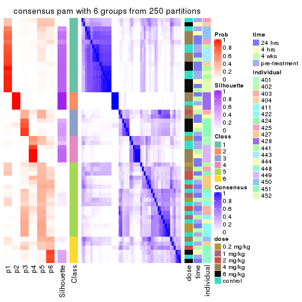</p>

</div>
</div>

Heatmaps for the membership of samples in all partitions to see how consistent they are:


<script>
$( function() {
	$( '#tabs-CV-pam-membership-heatmap' ).tabs();
} );
</script>
<div id='tabs-CV-pam-membership-heatmap'>
<ul>
<li><a href='#tab-CV-pam-membership-heatmap-1'>k = 2</a></li>
<li><a href='#tab-CV-pam-membership-heatmap-2'>k = 3</a></li>
<li><a href='#tab-CV-pam-membership-heatmap-3'>k = 4</a></li>
<li><a href='#tab-CV-pam-membership-heatmap-4'>k = 5</a></li>
<li><a href='#tab-CV-pam-membership-heatmap-5'>k = 6</a></li>
</ul>
<div id='tab-CV-pam-membership-heatmap-1'>
<pre><code class="r">membership_heatmap(res, k = 2)
</code></pre>

<p>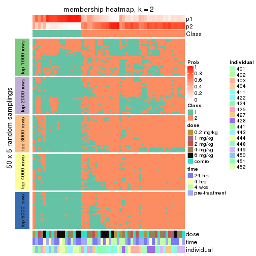</p>

</div>
<div id='tab-CV-pam-membership-heatmap-2'>
<pre><code class="r">membership_heatmap(res, k = 3)
</code></pre>

<p>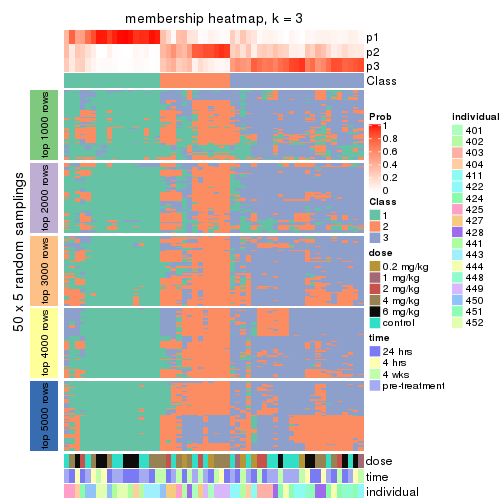</p>

</div>
<div id='tab-CV-pam-membership-heatmap-3'>
<pre><code class="r">membership_heatmap(res, k = 4)
</code></pre>

<p>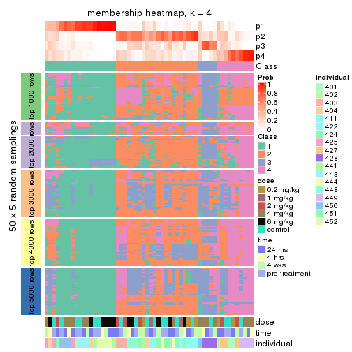</p>

</div>
<div id='tab-CV-pam-membership-heatmap-4'>
<pre><code class="r">membership_heatmap(res, k = 5)
</code></pre>

<p>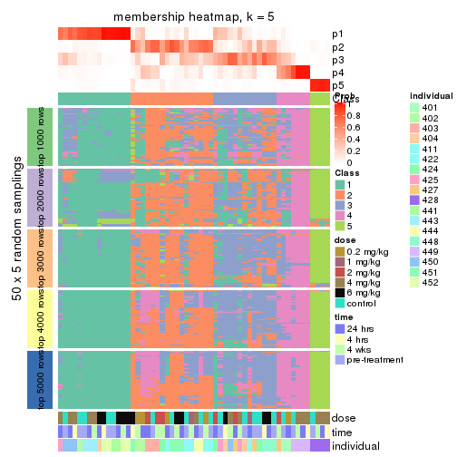</p>

</div>
<div id='tab-CV-pam-membership-heatmap-5'>
<pre><code class="r">membership_heatmap(res, k = 6)
</code></pre>

<p>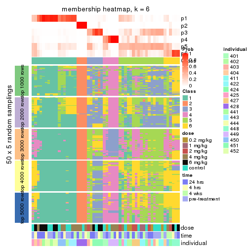</p>

</div>
</div>

As soon as we have had the classes for columns, we can look for signatures
which are significantly different between classes which can be candidate marks
for certain classes. Following are the heatmaps for signatures.


Signature heatmaps where rows are scaled:


<script>
$( function() {
	$( '#tabs-CV-pam-get-signatures' ).tabs();
} );
</script>
<div id='tabs-CV-pam-get-signatures'>
<ul>
<li><a href='#tab-CV-pam-get-signatures-1'>k = 2</a></li>
<li><a href='#tab-CV-pam-get-signatures-2'>k = 3</a></li>
<li><a href='#tab-CV-pam-get-signatures-3'>k = 4</a></li>
<li><a href='#tab-CV-pam-get-signatures-4'>k = 5</a></li>
<li><a href='#tab-CV-pam-get-signatures-5'>k = 6</a></li>
</ul>
<div id='tab-CV-pam-get-signatures-1'>
<pre><code class="r">get_signatures(res, k = 2)
</code></pre>

<p>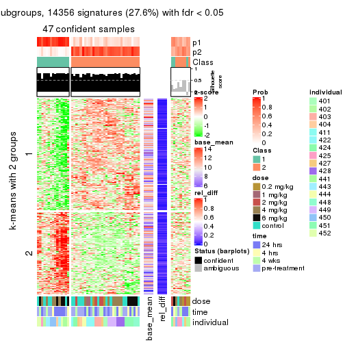</p>

</div>
<div id='tab-CV-pam-get-signatures-2'>
<pre><code class="r">get_signatures(res, k = 3)
</code></pre>

<p>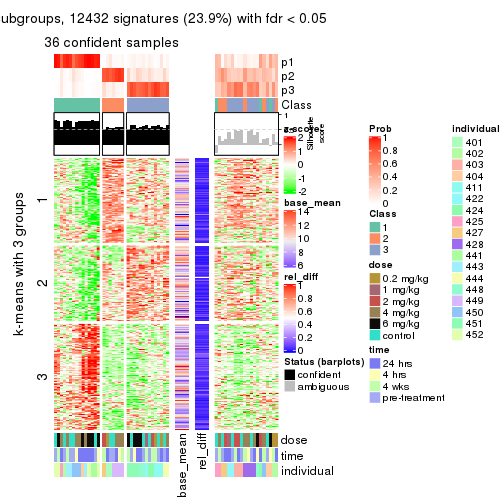</p>

</div>
<div id='tab-CV-pam-get-signatures-3'>
<pre><code class="r">get_signatures(res, k = 4)
</code></pre>

<p>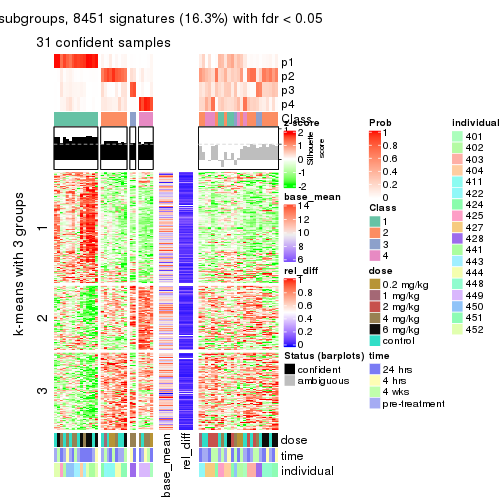</p>

</div>
<div id='tab-CV-pam-get-signatures-4'>
<pre><code class="r">get_signatures(res, k = 5)
</code></pre>

<p>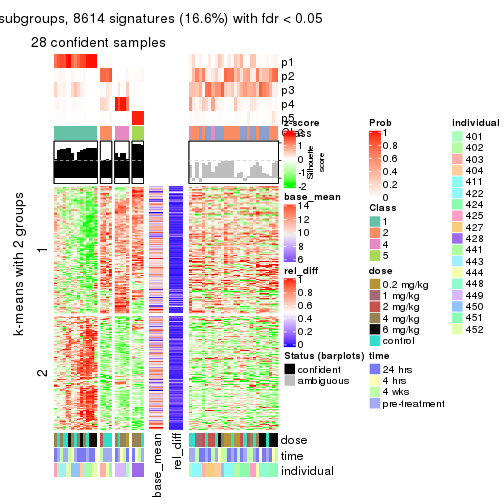</p>

</div>
<div id='tab-CV-pam-get-signatures-5'>
<pre><code class="r">get_signatures(res, k = 6)
</code></pre>

<p>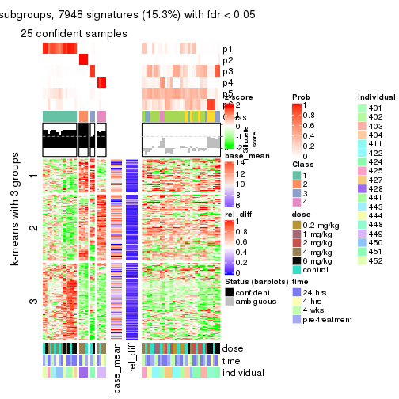</p>

</div>
</div>


Signature heatmaps where rows are not scaled:


<script>
$( function() {
	$( '#tabs-CV-pam-get-signatures-no-scale' ).tabs();
} );
</script>
<div id='tabs-CV-pam-get-signatures-no-scale'>
<ul>
<li><a href='#tab-CV-pam-get-signatures-no-scale-1'>k = 2</a></li>
<li><a href='#tab-CV-pam-get-signatures-no-scale-2'>k = 3</a></li>
<li><a href='#tab-CV-pam-get-signatures-no-scale-3'>k = 4</a></li>
<li><a href='#tab-CV-pam-get-signatures-no-scale-4'>k = 5</a></li>
<li><a href='#tab-CV-pam-get-signatures-no-scale-5'>k = 6</a></li>
</ul>
<div id='tab-CV-pam-get-signatures-no-scale-1'>
<pre><code class="r">get_signatures(res, k = 2, scale_rows = FALSE)
</code></pre>

<p>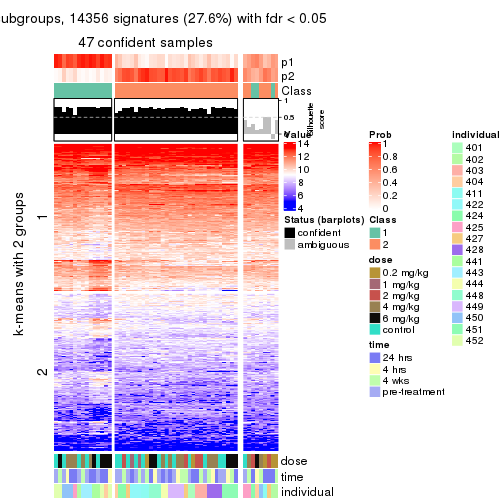</p>

</div>
<div id='tab-CV-pam-get-signatures-no-scale-2'>
<pre><code class="r">get_signatures(res, k = 3, scale_rows = FALSE)
</code></pre>

<p>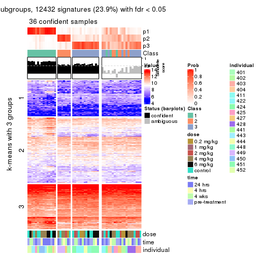</p>

</div>
<div id='tab-CV-pam-get-signatures-no-scale-3'>
<pre><code class="r">get_signatures(res, k = 4, scale_rows = FALSE)
</code></pre>

<p>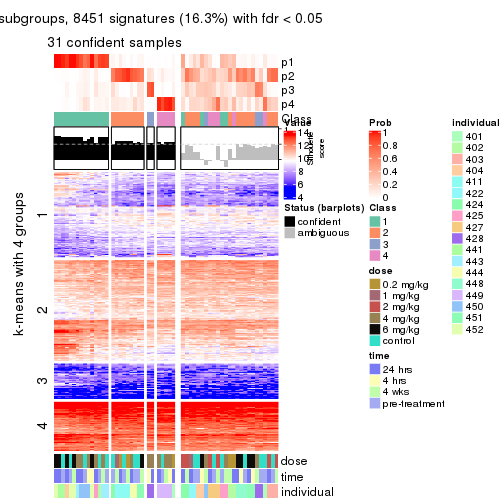</p>

</div>
<div id='tab-CV-pam-get-signatures-no-scale-4'>
<pre><code class="r">get_signatures(res, k = 5, scale_rows = FALSE)
</code></pre>

<p>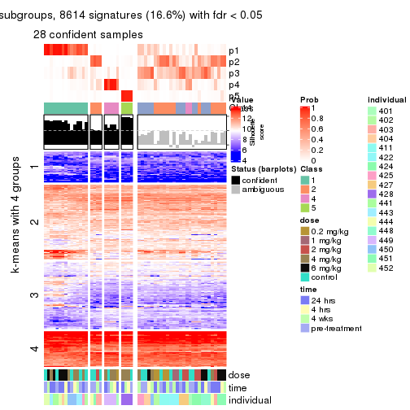</p>

</div>
<div id='tab-CV-pam-get-signatures-no-scale-5'>
<pre><code class="r">get_signatures(res, k = 6, scale_rows = FALSE)
</code></pre>

<p>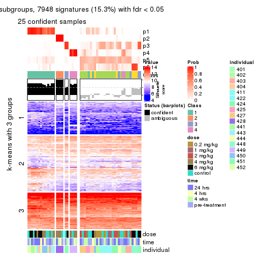</p>

</div>
</div>


Compare the overlap of signatures from different k:

```r
compare_signatures(res)
```

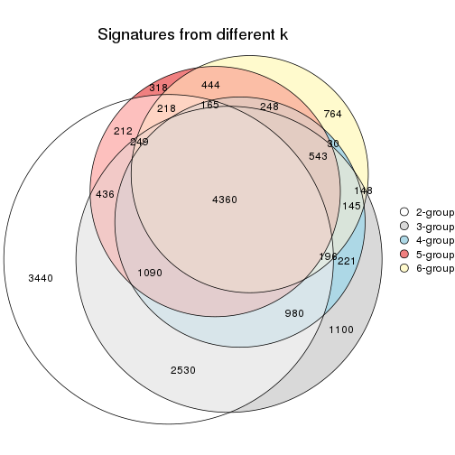

`get_signature()` returns a data frame invisibly. TO get the list of signatures, the function
call should be assigned to a variable explicitly. In following code, if `plot` argument is set
to `FALSE`, no heatmap is plotted while only the differential analysis is performed.

```r
# code only for demonstration
tb = get_signature(res, k = ..., plot = FALSE)
```

An example of the output of `tb` is:

```
#>   which_row         fdr    mean_1    mean_2 scaled_mean_1 scaled_mean_2 km
#> 1        38 0.042760348  8.373488  9.131774    -0.5533452     0.5164555  1
#> 2        40 0.018707592  7.106213  8.469186    -0.6173731     0.5762149  1
#> 3        55 0.019134737 10.221463 11.207825    -0.6159697     0.5749050  1
#> 4        59 0.006059896  5.921854  7.869574    -0.6899429     0.6439467  1
#> 5        60 0.018055526  8.928898 10.211722    -0.6204761     0.5791110  1
#> 6        98 0.009384629 15.714769 14.887706     0.6635654    -0.6193277  2
...
```

The columns in `tb` are:

1. `which_row`: row indices corresponding to the input matrix.
2. `fdr`: FDR for the differential test. 
3. `mean_x`: The mean value in group x.
4. `scaled_mean_x`: The mean value in group x after rows are scaled.
5. `km`: Row groups if k-means clustering is applied to rows.


UMAP plot which shows how samples are separated.


<script>
$( function() {
	$( '#tabs-CV-pam-dimension-reduction' ).tabs();
} );
</script>
<div id='tabs-CV-pam-dimension-reduction'>
<ul>
<li><a href='#tab-CV-pam-dimension-reduction-1'>k = 2</a></li>
<li><a href='#tab-CV-pam-dimension-reduction-2'>k = 3</a></li>
<li><a href='#tab-CV-pam-dimension-reduction-3'>k = 4</a></li>
<li><a href='#tab-CV-pam-dimension-reduction-4'>k = 5</a></li>
<li><a href='#tab-CV-pam-dimension-reduction-5'>k = 6</a></li>
</ul>
<div id='tab-CV-pam-dimension-reduction-1'>
<pre><code class="r">dimension_reduction(res, k = 2, method = &quot;UMAP&quot;)
</code></pre>

<p>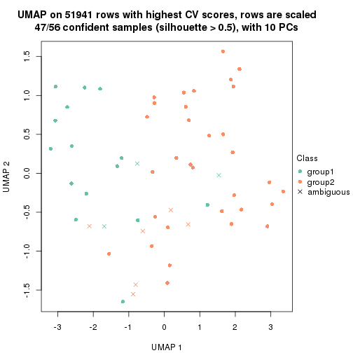</p>

</div>
<div id='tab-CV-pam-dimension-reduction-2'>
<pre><code class="r">dimension_reduction(res, k = 3, method = &quot;UMAP&quot;)
</code></pre>

<p>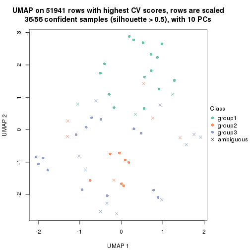</p>

</div>
<div id='tab-CV-pam-dimension-reduction-3'>
<pre><code class="r">dimension_reduction(res, k = 4, method = &quot;UMAP&quot;)
</code></pre>

<p>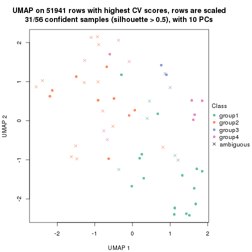</p>

</div>
<div id='tab-CV-pam-dimension-reduction-4'>
<pre><code class="r">dimension_reduction(res, k = 5, method = &quot;UMAP&quot;)
</code></pre>

<p>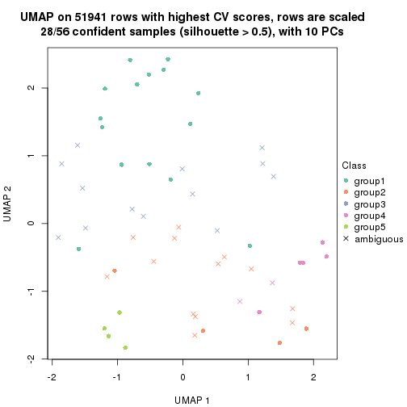</p>

</div>
<div id='tab-CV-pam-dimension-reduction-5'>
<pre><code class="r">dimension_reduction(res, k = 6, method = &quot;UMAP&quot;)
</code></pre>

<p>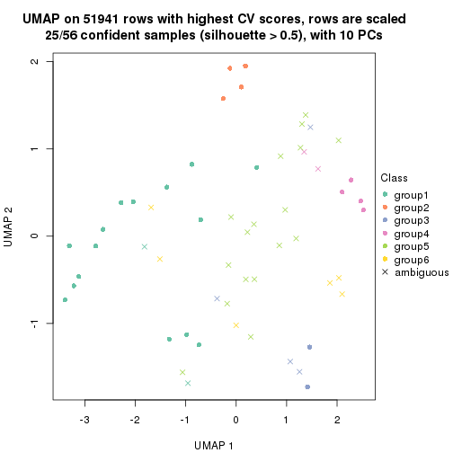</p>

</div>
</div>


Following heatmap shows how subgroups are split when increasing `k`:

```r
collect_classes(res)
```

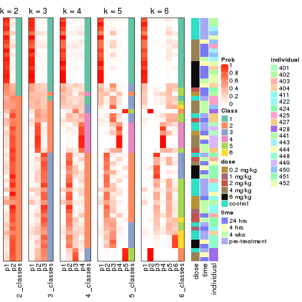


Test correlation between subgroups and known annotations. If the known
annotation is numeric, one-way ANOVA test is applied, and if the known
annotation is discrete, chi-squared contingency table test is applied.

```r
test_to_known_factors(res)
```

```
#>         n dose(p) time(p) individual(p) k
#> CV:pam 47  0.3232   0.687      2.70e-04 2
#> CV:pam 36  0.3594   0.948      2.61e-05 3
#> CV:pam 31  0.2251   0.632      1.00e-05 4
#> CV:pam 28  0.0548   0.799      1.04e-05 5
#> CV:pam 25  0.3824   0.940      2.11e-06 6
```


If matrix rows can be associated to genes, consider to use `functional_enrichment(res,
...)` to perform function enrichment for the signature genes. See [this vignette](http://bioconductor.org/packages/devel/bioc/vignettes/cola/inst/doc/functional_enrichment.html) for more detailed explanations.


 

---------------------------------------------------


### CV:mclust


The object with results only for a single top-value method and a single partition method 
can be extracted as:

```r
res = res_list["CV", "mclust"]
# you can also extract it by
# res = res_list["CV:mclust"]
```

A summary of `res` and all the functions that can be applied to it:

```r
res
```

```
#> A 'ConsensusPartition' object with k = 2, 3, 4, 5, 6.
#>   On a matrix with 51941 rows and 56 columns.
#>   Top rows (1000, 2000, 3000, 4000, 5000) are extracted by 'CV' method.
#>   Subgroups are detected by 'mclust' method.
#>   Performed in total 1250 partitions by row resampling.
#>   Best k for subgroups seems to be 6.
#> 
#> Following methods can be applied to this 'ConsensusPartition' object:
#>  [1] "cola_report"             "collect_classes"         "collect_plots"          
#>  [4] "collect_stats"           "colnames"                "compare_signatures"     
#>  [7] "consensus_heatmap"       "dimension_reduction"     "functional_enrichment"  
#> [10] "get_anno_col"            "get_anno"                "get_classes"            
#> [13] "get_consensus"           "get_matrix"              "get_membership"         
#> [16] "get_param"               "get_signatures"          "get_stats"              
#> [19] "is_best_k"               "is_stable_k"             "membership_heatmap"     
#> [22] "ncol"                    "nrow"                    "plot_ecdf"              
#> [25] "rownames"                "select_partition_number" "show"                   
#> [28] "suggest_best_k"          "test_to_known_factors"
```

`collect_plots()` function collects all the plots made from `res` for all `k` (number of partitions)
into one single page to provide an easy and fast comparison between different `k`.

```r
collect_plots(res)
```

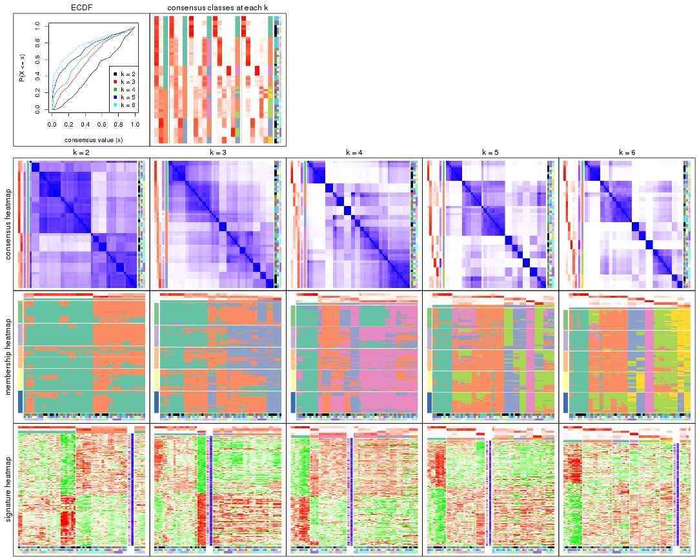

The plots are:

- The first row: a plot of the ECDF (empirical cumulative distribution
  function) curves of the consensus matrix for each `k` and the heatmap of
  predicted classes for each `k`.
- The second row: heatmaps of the consensus matrix for each `k`.
- The third row: heatmaps of the membership matrix for each `k`.
- The fouth row: heatmaps of the signatures for each `k`.

All the plots in panels can be made by individual functions and they are
plotted later in this section.

`select_partition_number()` produces several plots showing different
statistics for choosing "optimized" `k`. There are following statistics:

- ECDF curves of the consensus matrix for each `k`;
- 1-PAC. [The PAC
  score](https://en.wikipedia.org/wiki/Consensus_clustering#Over-interpretation_potential_of_consensus_clustering)
  measures the proportion of the ambiguous subgrouping.
- Mean silhouette score.
- Concordance. The mean probability of fiting the consensus class ids in all
  partitions.
- Area increased. Denote $A_k$ as the area under the ECDF curve for current
  `k`, the area increased is defined as $A_k - A_{k-1}$.
- Rand index. The percent of pairs of samples that are both in a same cluster
  or both are not in a same cluster in the partition of k and k-1.
- Jaccard index. The ratio of pairs of samples are both in a same cluster in
  the partition of k and k-1 and the pairs of samples are both in a same
  cluster in the partition k or k-1.

The detailed explanations of these statistics can be found in [the _cola_
vignette](http://bioconductor.org/packages/devel/bioc/vignettes/cola/inst/doc/cola.html#toc_13).

Generally speaking, lower PAC score, higher mean silhouette score or higher
concordance corresponds to better partition. Rand index and Jaccard index
measure how similar the current partition is compared to partition with `k-1`.
If they are too similar, we won't accept `k` is better than `k-1`.

```r
select_partition_number(res)
```

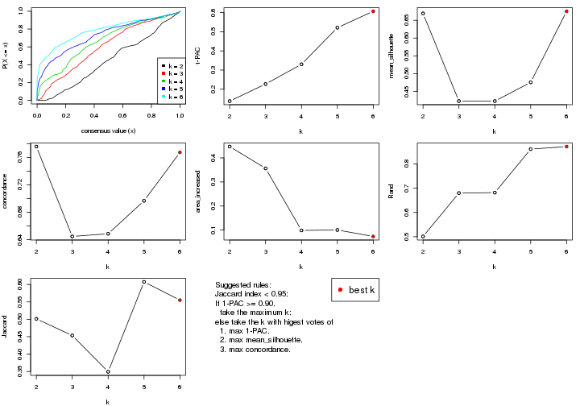

The numeric values for all these statistics can be obtained by `get_stats()`.

```r
get_stats(res)
```

```
#>   k 1-PAC mean_silhouette concordance area_increased  Rand Jaccard
#> 2 2 0.138           0.669       0.776         0.4470 0.501   0.501
#> 3 3 0.227           0.423       0.645         0.3564 0.680   0.453
#> 4 4 0.330           0.423       0.649         0.0987 0.682   0.349
#> 5 5 0.521           0.476       0.697         0.1004 0.861   0.607
#> 6 6 0.607           0.675       0.767         0.0736 0.871   0.555
```

`suggest_best_k()` suggests the best $k$ based on these statistics. The rules are as follows:

- All $k$ with Jaccard index larger than 0.95 are removed because increasing
  $k$ does not provide enough extra information. If all $k$ are removed, it is
  marked as no subgroup is detected.
- For all $k$ with 1-PAC score larger than 0.9, the maximal $k$ is taken as
  the best $k$, and other $k$ are marked as optional $k$.
- If it does not fit the second rule. The $k$ with the maximal vote of the
  highest 1-PAC score, highest mean silhouette, and highest concordance is
  taken as the best $k$.

```r
suggest_best_k(res)
```

```
#> [1] 6
```


Following shows the table of the partitions (You need to click the **show/hide
code output** link to see it). The membership matrix (columns with name `p*`)
is inferred by
[`clue::cl_consensus()`](https://www.rdocumentation.org/link/cl_consensus?package=clue)
function with the `SE` method. Basically the value in the membership matrix
represents the probability to belong to a certain group. The finall class
label for an item is determined with the group with highest probability it
belongs to.

In `get_classes()` function, the entropy is calculated from the membership
matrix and the silhouette score is calculated from the consensus matrix.


<script>
$( function() {
	$( '#tabs-CV-mclust-get-classes' ).tabs();
} );
</script>
<div id='tabs-CV-mclust-get-classes'>
<ul>
<li><a href='#tab-CV-mclust-get-classes-1'>k = 2</a></li>
<li><a href='#tab-CV-mclust-get-classes-2'>k = 3</a></li>
<li><a href='#tab-CV-mclust-get-classes-3'>k = 4</a></li>
<li><a href='#tab-CV-mclust-get-classes-4'>k = 5</a></li>
<li><a href='#tab-CV-mclust-get-classes-5'>k = 6</a></li>
</ul>

<div id='tab-CV-mclust-get-classes-1'>
<p><a id='tab-CV-mclust-get-classes-1-a' style='color:#0366d6' href='#'>show/hide code output</a></p>
<pre><code class="r">cbind(get_classes(res, k = 2), get_membership(res, k = 2))
</code></pre>

<pre><code>#&gt;           class entropy silhouette    p1    p2
#&gt; GSM687644     1   0.518      0.744 0.884 0.116
#&gt; GSM687648     1   0.416      0.745 0.916 0.084
#&gt; GSM687653     2   0.978      0.707 0.412 0.588
#&gt; GSM687658     1   0.242      0.787 0.960 0.040
#&gt; GSM687663     2   0.987      0.644 0.432 0.568
#&gt; GSM687668     2   0.999      0.541 0.480 0.520
#&gt; GSM687673     2   0.980      0.705 0.416 0.584
#&gt; GSM687678     1   0.358      0.758 0.932 0.068
#&gt; GSM687683     1   0.563      0.722 0.868 0.132
#&gt; GSM687688     2   0.850      0.733 0.276 0.724
#&gt; GSM687695     1   0.541      0.763 0.876 0.124
#&gt; GSM687699     1   0.295      0.787 0.948 0.052
#&gt; GSM687704     2   0.946      0.696 0.364 0.636
#&gt; GSM687707     2   0.563      0.657 0.132 0.868
#&gt; GSM687712     1   0.978      0.396 0.588 0.412
#&gt; GSM687719     1   0.358      0.785 0.932 0.068
#&gt; GSM687724     2   0.242      0.632 0.040 0.960
#&gt; GSM687728     1   0.506      0.769 0.888 0.112
#&gt; GSM687646     1   0.563      0.729 0.868 0.132
#&gt; GSM687649     1   0.584      0.660 0.860 0.140
#&gt; GSM687665     1   0.998     -0.528 0.528 0.472
#&gt; GSM687651     1   0.662      0.604 0.828 0.172
#&gt; GSM687667     2   0.975      0.710 0.408 0.592
#&gt; GSM687670     2   0.998      0.586 0.472 0.528
#&gt; GSM687671     2   0.993      0.622 0.452 0.548
#&gt; GSM687654     2   0.975      0.710 0.408 0.592
#&gt; GSM687675     2   0.998      0.626 0.476 0.524
#&gt; GSM687685     1   0.574      0.719 0.864 0.136
#&gt; GSM687656     2   0.983      0.696 0.424 0.576
#&gt; GSM687677     2   0.958      0.726 0.380 0.620
#&gt; GSM687687     1   0.680      0.683 0.820 0.180
#&gt; GSM687692     2   0.844      0.734 0.272 0.728
#&gt; GSM687716     1   0.978      0.396 0.588 0.412
#&gt; GSM687722     1   0.278      0.788 0.952 0.048
#&gt; GSM687680     1   0.260      0.777 0.956 0.044
#&gt; GSM687690     2   0.850      0.733 0.276 0.724
#&gt; GSM687700     1   0.402      0.780 0.920 0.080
#&gt; GSM687705     2   0.753      0.697 0.216 0.784
#&gt; GSM687714     1   0.978      0.396 0.588 0.412
#&gt; GSM687721     1   0.402      0.780 0.920 0.080
#&gt; GSM687682     1   0.224      0.780 0.964 0.036
#&gt; GSM687694     2   0.855      0.735 0.280 0.720
#&gt; GSM687702     1   0.278      0.786 0.952 0.048
#&gt; GSM687718     1   0.978      0.396 0.588 0.412
#&gt; GSM687723     1   0.204      0.789 0.968 0.032
#&gt; GSM687661     1   0.184      0.784 0.972 0.028
#&gt; GSM687710     2   0.605      0.657 0.148 0.852
#&gt; GSM687726     2   0.224      0.632 0.036 0.964
#&gt; GSM687730     1   0.615      0.739 0.848 0.152
#&gt; GSM687660     1   0.541      0.763 0.876 0.124
#&gt; GSM687697     1   0.529      0.765 0.880 0.120
#&gt; GSM687709     2   0.615      0.656 0.152 0.848
#&gt; GSM687725     2   0.204      0.631 0.032 0.968
#&gt; GSM687729     1   0.541      0.763 0.876 0.124
#&gt; GSM687727     2   0.224      0.633 0.036 0.964
#&gt; GSM687731     1   0.494      0.771 0.892 0.108
</code></pre>

<script>
$('#tab-CV-mclust-get-classes-1-a').parent().next().next().hide();
$('#tab-CV-mclust-get-classes-1-a').click(function(){
  $('#tab-CV-mclust-get-classes-1-a').parent().next().next().toggle();
  return(false);
});
</script>
</div>

<div id='tab-CV-mclust-get-classes-2'>
<p><a id='tab-CV-mclust-get-classes-2-a' style='color:#0366d6' href='#'>show/hide code output</a></p>
<pre><code class="r">cbind(get_classes(res, k = 3), get_membership(res, k = 3))
</code></pre>

<pre><code>#&gt;           class entropy silhouette    p1    p2    p3
#&gt; GSM687644     2   0.694    -0.3102 0.464 0.520 0.016
#&gt; GSM687648     1   0.703     0.5516 0.540 0.440 0.020
#&gt; GSM687653     2   0.693     0.2066 0.032 0.640 0.328
#&gt; GSM687658     1   0.631     0.6058 0.604 0.392 0.004
#&gt; GSM687663     2   0.821     0.4104 0.132 0.628 0.240
#&gt; GSM687668     2   0.814     0.4491 0.152 0.644 0.204
#&gt; GSM687673     2   0.811     0.2686 0.084 0.580 0.336
#&gt; GSM687678     1   0.652     0.5081 0.512 0.484 0.004
#&gt; GSM687683     2   0.615     0.1277 0.328 0.664 0.008
#&gt; GSM687688     3   0.667     0.4075 0.016 0.368 0.616
#&gt; GSM687695     1   0.301     0.6061 0.920 0.028 0.052
#&gt; GSM687699     1   0.625     0.6106 0.620 0.376 0.004
#&gt; GSM687704     2   0.764     0.4102 0.092 0.660 0.248
#&gt; GSM687707     3   0.703     0.4428 0.044 0.296 0.660
#&gt; GSM687712     2   0.846     0.1287 0.120 0.584 0.296
#&gt; GSM687719     1   0.424     0.6610 0.824 0.176 0.000
#&gt; GSM687724     3   0.346     0.6070 0.012 0.096 0.892
#&gt; GSM687728     1   0.367     0.6144 0.896 0.064 0.040
#&gt; GSM687646     2   0.733     0.0741 0.364 0.596 0.040
#&gt; GSM687649     1   0.759     0.4499 0.480 0.480 0.040
#&gt; GSM687665     2   0.828     0.4327 0.160 0.632 0.208
#&gt; GSM687651     1   0.792     0.4237 0.472 0.472 0.056
#&gt; GSM687667     2   0.715     0.3305 0.048 0.652 0.300
#&gt; GSM687670     2   0.802     0.4561 0.156 0.656 0.188
#&gt; GSM687671     2   0.797     0.4367 0.128 0.652 0.220
#&gt; GSM687654     2   0.684     0.1942 0.028 0.640 0.332
#&gt; GSM687675     2   0.835     0.3725 0.120 0.600 0.280
#&gt; GSM687685     2   0.586     0.2180 0.288 0.704 0.008
#&gt; GSM687656     2   0.701     0.2178 0.036 0.640 0.324
#&gt; GSM687677     2   0.721     0.0962 0.028 0.552 0.420
#&gt; GSM687687     2   0.672     0.3534 0.248 0.704 0.048
#&gt; GSM687692     3   0.655     0.4041 0.012 0.372 0.616
#&gt; GSM687716     2   0.851     0.1311 0.124 0.580 0.296
#&gt; GSM687722     1   0.510     0.6542 0.752 0.248 0.000
#&gt; GSM687680     1   0.627     0.5600 0.548 0.452 0.000
#&gt; GSM687690     3   0.655     0.4117 0.012 0.372 0.616
#&gt; GSM687700     1   0.296     0.6536 0.900 0.100 0.000
#&gt; GSM687705     2   0.787     0.0591 0.056 0.524 0.420
#&gt; GSM687714     2   0.846     0.1287 0.120 0.584 0.296
#&gt; GSM687721     1   0.226     0.6514 0.932 0.068 0.000
#&gt; GSM687682     1   0.624     0.5720 0.560 0.440 0.000
#&gt; GSM687694     3   0.663     0.3796 0.012 0.392 0.596
#&gt; GSM687702     1   0.613     0.6087 0.600 0.400 0.000
#&gt; GSM687718     2   0.846     0.1287 0.120 0.584 0.296
#&gt; GSM687723     1   0.595     0.6267 0.640 0.360 0.000
#&gt; GSM687661     1   0.634     0.6029 0.596 0.400 0.004
#&gt; GSM687710     3   0.701     0.4320 0.040 0.308 0.652
#&gt; GSM687726     3   0.361     0.6066 0.016 0.096 0.888
#&gt; GSM687730     1   0.347     0.5993 0.904 0.040 0.056
#&gt; GSM687660     1   0.175     0.6243 0.960 0.012 0.028
#&gt; GSM687697     1   0.279     0.6115 0.928 0.028 0.044
#&gt; GSM687709     3   0.696     0.4417 0.040 0.300 0.660
#&gt; GSM687725     3   0.346     0.6070 0.012 0.096 0.892
#&gt; GSM687729     1   0.301     0.6061 0.920 0.028 0.052
#&gt; GSM687727     3   0.377     0.6054 0.016 0.104 0.880
#&gt; GSM687731     1   0.346     0.6189 0.904 0.060 0.036
</code></pre>

<script>
$('#tab-CV-mclust-get-classes-2-a').parent().next().next().hide();
$('#tab-CV-mclust-get-classes-2-a').click(function(){
  $('#tab-CV-mclust-get-classes-2-a').parent().next().next().toggle();
  return(false);
});
</script>
</div>

<div id='tab-CV-mclust-get-classes-3'>
<p><a id='tab-CV-mclust-get-classes-3-a' style='color:#0366d6' href='#'>show/hide code output</a></p>
<pre><code class="r">cbind(get_classes(res, k = 4), get_membership(res, k = 4))
</code></pre>

<pre><code>#&gt;           class entropy silhouette    p1    p2    p3    p4
#&gt; GSM687644     4  0.6630     0.5475 0.172 0.040 0.100 0.688
#&gt; GSM687648     4  0.5230     0.5657 0.220 0.016 0.028 0.736
#&gt; GSM687653     3  0.8194    -0.1675 0.008 0.336 0.340 0.316
#&gt; GSM687658     4  0.5102     0.5387 0.256 0.012 0.016 0.716
#&gt; GSM687663     4  0.7757     0.1729 0.036 0.316 0.120 0.528
#&gt; GSM687668     4  0.5967     0.3465 0.004 0.236 0.080 0.680
#&gt; GSM687673     4  0.8361    -0.1159 0.028 0.372 0.204 0.396
#&gt; GSM687678     4  0.4579     0.5769 0.212 0.004 0.020 0.764
#&gt; GSM687683     4  0.4963     0.4959 0.076 0.020 0.104 0.800
#&gt; GSM687688     2  0.4230     0.5288 0.004 0.776 0.008 0.212
#&gt; GSM687695     1  0.0000     0.8516 1.000 0.000 0.000 0.000
#&gt; GSM687699     4  0.5601     0.5444 0.268 0.016 0.028 0.688
#&gt; GSM687704     4  0.6700     0.3202 0.020 0.256 0.088 0.636
#&gt; GSM687707     3  0.7544     0.1315 0.012 0.344 0.500 0.144
#&gt; GSM687712     3  0.5090     0.4223 0.000 0.016 0.660 0.324
#&gt; GSM687719     1  0.5683     0.1209 0.528 0.012 0.008 0.452
#&gt; GSM687724     2  0.4781     0.4141 0.012 0.780 0.176 0.032
#&gt; GSM687728     1  0.0592     0.8513 0.984 0.000 0.000 0.016
#&gt; GSM687646     4  0.7089     0.5116 0.152 0.056 0.128 0.664
#&gt; GSM687649     4  0.5598     0.5737 0.208 0.024 0.040 0.728
#&gt; GSM687665     4  0.7875     0.1664 0.040 0.316 0.124 0.520
#&gt; GSM687651     4  0.5723     0.5753 0.204 0.024 0.048 0.724
#&gt; GSM687667     4  0.7354     0.1418 0.012 0.332 0.128 0.528
#&gt; GSM687670     4  0.6005     0.3663 0.008 0.216 0.084 0.692
#&gt; GSM687671     4  0.6050     0.3341 0.004 0.256 0.076 0.664
#&gt; GSM687654     2  0.8192    -0.0317 0.008 0.340 0.340 0.312
#&gt; GSM687675     4  0.8349    -0.0644 0.028 0.356 0.204 0.412
#&gt; GSM687685     4  0.4558     0.4781 0.048 0.020 0.112 0.820
#&gt; GSM687656     3  0.8194    -0.1675 0.008 0.336 0.340 0.316
#&gt; GSM687677     2  0.7869     0.0887 0.008 0.412 0.196 0.384
#&gt; GSM687687     4  0.5655     0.4289 0.052 0.056 0.128 0.764
#&gt; GSM687692     2  0.4303     0.5263 0.004 0.768 0.008 0.220
#&gt; GSM687716     3  0.5090     0.4223 0.000 0.016 0.660 0.324
#&gt; GSM687722     4  0.5584     0.2397 0.400 0.008 0.012 0.580
#&gt; GSM687680     4  0.4720     0.5690 0.212 0.008 0.020 0.760
#&gt; GSM687690     2  0.4267     0.5291 0.004 0.772 0.008 0.216
#&gt; GSM687700     1  0.4188     0.6765 0.752 0.000 0.004 0.244
#&gt; GSM687705     4  0.7179     0.1698 0.016 0.328 0.104 0.552
#&gt; GSM687714     3  0.5090     0.4223 0.000 0.016 0.660 0.324
#&gt; GSM687721     1  0.4155     0.6723 0.756 0.000 0.004 0.240
#&gt; GSM687682     4  0.4857     0.5556 0.232 0.004 0.024 0.740
#&gt; GSM687694     2  0.4267     0.5291 0.004 0.772 0.008 0.216
#&gt; GSM687702     4  0.4682     0.5529 0.236 0.004 0.016 0.744
#&gt; GSM687718     3  0.5090     0.4223 0.000 0.016 0.660 0.324
#&gt; GSM687723     4  0.5009     0.5061 0.280 0.004 0.016 0.700
#&gt; GSM687661     4  0.4978     0.5331 0.256 0.008 0.016 0.720
#&gt; GSM687710     3  0.7662     0.1503 0.012 0.316 0.504 0.168
#&gt; GSM687726     2  0.4784     0.4175 0.012 0.784 0.168 0.036
#&gt; GSM687730     1  0.0188     0.8529 0.996 0.000 0.000 0.004
#&gt; GSM687660     1  0.1489     0.8443 0.952 0.000 0.004 0.044
#&gt; GSM687697     1  0.0657     0.8526 0.984 0.000 0.004 0.012
#&gt; GSM687709     3  0.7643     0.1552 0.012 0.320 0.504 0.164
#&gt; GSM687725     2  0.4738     0.4179 0.012 0.784 0.172 0.032
#&gt; GSM687729     1  0.0000     0.8516 1.000 0.000 0.000 0.000
#&gt; GSM687727     2  0.4715     0.4162 0.016 0.788 0.168 0.028
#&gt; GSM687731     1  0.0592     0.8513 0.984 0.000 0.000 0.016
</code></pre>

<script>
$('#tab-CV-mclust-get-classes-3-a').parent().next().next().hide();
$('#tab-CV-mclust-get-classes-3-a').click(function(){
  $('#tab-CV-mclust-get-classes-3-a').parent().next().next().toggle();
  return(false);
});
</script>
</div>

<div id='tab-CV-mclust-get-classes-4'>
<p><a id='tab-CV-mclust-get-classes-4-a' style='color:#0366d6' href='#'>show/hide code output</a></p>
<pre><code class="r">cbind(get_classes(res, k = 5), get_membership(res, k = 5))
</code></pre>

<pre><code>#&gt;           class entropy silhouette    p1    p2    p3    p4    p5
#&gt; GSM687644     2  0.7696     0.4243 0.040 0.548 0.060 0.180 0.172
#&gt; GSM687648     2  0.3311     0.6176 0.044 0.872 0.028 0.004 0.052
#&gt; GSM687653     3  0.4928     0.0372 0.000 0.016 0.564 0.008 0.412
#&gt; GSM687658     2  0.1644     0.6186 0.048 0.940 0.000 0.008 0.004
#&gt; GSM687663     2  0.8103    -0.2598 0.004 0.360 0.192 0.100 0.344
#&gt; GSM687668     2  0.8175    -0.0815 0.004 0.372 0.128 0.164 0.332
#&gt; GSM687673     5  0.7489     0.4520 0.004 0.228 0.308 0.036 0.424
#&gt; GSM687678     2  0.3029     0.6257 0.036 0.892 0.024 0.016 0.032
#&gt; GSM687683     2  0.4993     0.5431 0.016 0.728 0.048 0.200 0.008
#&gt; GSM687688     5  0.1041     0.3241 0.004 0.032 0.000 0.000 0.964
#&gt; GSM687695     1  0.0703     0.8796 0.976 0.024 0.000 0.000 0.000
#&gt; GSM687699     2  0.3752     0.6208 0.064 0.848 0.012 0.016 0.060
#&gt; GSM687704     2  0.8063    -0.0767 0.000 0.384 0.148 0.148 0.320
#&gt; GSM687707     3  0.4264     0.4144 0.004 0.084 0.816 0.040 0.056
#&gt; GSM687712     4  0.0880     1.0000 0.000 0.032 0.000 0.968 0.000
#&gt; GSM687719     2  0.4270     0.2455 0.336 0.656 0.004 0.004 0.000
#&gt; GSM687724     3  0.4656     0.4000 0.000 0.012 0.508 0.000 0.480
#&gt; GSM687728     1  0.0609     0.8789 0.980 0.020 0.000 0.000 0.000
#&gt; GSM687646     2  0.8001     0.3667 0.032 0.492 0.068 0.228 0.180
#&gt; GSM687649     2  0.4785     0.5823 0.048 0.780 0.044 0.008 0.120
#&gt; GSM687665     5  0.8142     0.2509 0.004 0.328 0.196 0.104 0.368
#&gt; GSM687651     2  0.5185     0.5871 0.048 0.768 0.068 0.020 0.096
#&gt; GSM687667     5  0.8193     0.2665 0.004 0.316 0.196 0.112 0.372
#&gt; GSM687670     2  0.8096    -0.0224 0.004 0.396 0.128 0.152 0.320
#&gt; GSM687671     2  0.8146    -0.1469 0.004 0.360 0.132 0.152 0.352
#&gt; GSM687654     3  0.4928     0.0372 0.000 0.016 0.564 0.008 0.412
#&gt; GSM687675     5  0.7525     0.4506 0.004 0.224 0.304 0.040 0.428
#&gt; GSM687685     2  0.5075     0.5315 0.008 0.712 0.060 0.212 0.008
#&gt; GSM687656     3  0.4928     0.0372 0.000 0.016 0.564 0.008 0.412
#&gt; GSM687677     5  0.7403     0.4367 0.004 0.212 0.300 0.036 0.448
#&gt; GSM687687     2  0.7600     0.3263 0.004 0.472 0.068 0.276 0.180
#&gt; GSM687692     5  0.1124     0.3318 0.004 0.036 0.000 0.000 0.960
#&gt; GSM687716     4  0.0880     1.0000 0.000 0.032 0.000 0.968 0.000
#&gt; GSM687722     2  0.2930     0.5529 0.164 0.832 0.000 0.004 0.000
#&gt; GSM687680     2  0.2395     0.6222 0.048 0.912 0.000 0.016 0.024
#&gt; GSM687690     5  0.1205     0.3333 0.004 0.040 0.000 0.000 0.956
#&gt; GSM687700     1  0.3837     0.6722 0.692 0.308 0.000 0.000 0.000
#&gt; GSM687705     2  0.8103    -0.0824 0.000 0.376 0.164 0.140 0.320
#&gt; GSM687714     4  0.0880     1.0000 0.000 0.032 0.000 0.968 0.000
#&gt; GSM687721     1  0.3752     0.6862 0.708 0.292 0.000 0.000 0.000
#&gt; GSM687682     2  0.2026     0.6231 0.044 0.928 0.000 0.012 0.016
#&gt; GSM687694     5  0.1282     0.3363 0.004 0.044 0.000 0.000 0.952
#&gt; GSM687702     2  0.1484     0.6227 0.048 0.944 0.000 0.000 0.008
#&gt; GSM687718     4  0.0880     1.0000 0.000 0.032 0.000 0.968 0.000
#&gt; GSM687723     2  0.1704     0.6158 0.068 0.928 0.000 0.004 0.000
#&gt; GSM687661     2  0.2037     0.6192 0.064 0.920 0.000 0.012 0.004
#&gt; GSM687710     3  0.4721     0.3940 0.004 0.104 0.784 0.040 0.068
#&gt; GSM687726     3  0.4746     0.3959 0.000 0.016 0.504 0.000 0.480
#&gt; GSM687730     1  0.0865     0.8804 0.972 0.024 0.000 0.004 0.000
#&gt; GSM687660     1  0.2648     0.8199 0.848 0.152 0.000 0.000 0.000
#&gt; GSM687697     1  0.0880     0.8784 0.968 0.032 0.000 0.000 0.000
#&gt; GSM687709     3  0.4449     0.4115 0.004 0.088 0.804 0.040 0.064
#&gt; GSM687725     3  0.4656     0.4000 0.000 0.012 0.508 0.000 0.480
#&gt; GSM687729     1  0.0703     0.8775 0.976 0.024 0.000 0.000 0.000
#&gt; GSM687727     3  0.4656     0.4000 0.000 0.012 0.508 0.000 0.480
#&gt; GSM687731     1  0.1121     0.8797 0.956 0.044 0.000 0.000 0.000
</code></pre>

<script>
$('#tab-CV-mclust-get-classes-4-a').parent().next().next().hide();
$('#tab-CV-mclust-get-classes-4-a').click(function(){
  $('#tab-CV-mclust-get-classes-4-a').parent().next().next().toggle();
  return(false);
});
</script>
</div>

<div id='tab-CV-mclust-get-classes-5'>
<p><a id='tab-CV-mclust-get-classes-5-a' style='color:#0366d6' href='#'>show/hide code output</a></p>
<pre><code class="r">cbind(get_classes(res, k = 6), get_membership(res, k = 6))
</code></pre>

<pre><code>#&gt;           class entropy silhouette    p1    p2    p3    p4    p5    p6
#&gt; GSM687644     2  0.5715      0.468 0.004 0.588 0.004 0.092 0.288 0.024
#&gt; GSM687648     2  0.2622      0.740 0.000 0.868 0.000 0.004 0.104 0.024
#&gt; GSM687653     6  0.3641      0.641 0.000 0.000 0.020 0.000 0.248 0.732
#&gt; GSM687658     2  0.1148      0.748 0.016 0.960 0.000 0.000 0.020 0.004
#&gt; GSM687663     5  0.3943      0.769 0.000 0.184 0.004 0.000 0.756 0.056
#&gt; GSM687668     5  0.3673      0.697 0.004 0.244 0.000 0.016 0.736 0.000
#&gt; GSM687673     5  0.4416      0.530 0.000 0.076 0.004 0.000 0.708 0.212
#&gt; GSM687678     2  0.2320      0.743 0.000 0.864 0.000 0.000 0.132 0.004
#&gt; GSM687683     2  0.4497      0.581 0.004 0.712 0.000 0.100 0.184 0.000
#&gt; GSM687688     3  0.5894      0.575 0.000 0.012 0.556 0.008 0.276 0.148
#&gt; GSM687695     1  0.0260      0.853 0.992 0.008 0.000 0.000 0.000 0.000
#&gt; GSM687699     2  0.2581      0.739 0.016 0.856 0.000 0.000 0.128 0.000
#&gt; GSM687704     5  0.3388      0.736 0.000 0.224 0.004 0.004 0.764 0.004
#&gt; GSM687707     6  0.5550      0.597 0.000 0.028 0.308 0.000 0.088 0.576
#&gt; GSM687712     4  0.0260      1.000 0.000 0.008 0.000 0.992 0.000 0.000
#&gt; GSM687719     2  0.5173      0.292 0.268 0.636 0.000 0.000 0.032 0.064
#&gt; GSM687724     3  0.2389      0.560 0.000 0.000 0.864 0.000 0.128 0.008
#&gt; GSM687728     1  0.0551      0.852 0.984 0.004 0.000 0.000 0.008 0.004
#&gt; GSM687646     2  0.6373      0.354 0.004 0.508 0.004 0.160 0.296 0.028
#&gt; GSM687649     2  0.2981      0.705 0.000 0.820 0.000 0.000 0.160 0.020
#&gt; GSM687665     5  0.4024      0.760 0.000 0.180 0.004 0.000 0.752 0.064
#&gt; GSM687651     2  0.3345      0.688 0.000 0.788 0.000 0.000 0.184 0.028
#&gt; GSM687667     5  0.3579      0.726 0.000 0.120 0.004 0.000 0.804 0.072
#&gt; GSM687670     5  0.3702      0.660 0.004 0.264 0.000 0.012 0.720 0.000
#&gt; GSM687671     5  0.3250      0.747 0.004 0.196 0.000 0.012 0.788 0.000
#&gt; GSM687654     6  0.3641      0.641 0.000 0.000 0.020 0.000 0.248 0.732
#&gt; GSM687675     5  0.4376      0.540 0.000 0.084 0.000 0.000 0.704 0.212
#&gt; GSM687685     2  0.4653      0.564 0.004 0.696 0.000 0.112 0.188 0.000
#&gt; GSM687656     6  0.3641      0.641 0.000 0.000 0.020 0.000 0.248 0.732
#&gt; GSM687677     5  0.4592      0.483 0.000 0.064 0.012 0.000 0.692 0.232
#&gt; GSM687687     2  0.6190      0.251 0.000 0.472 0.004 0.168 0.340 0.016
#&gt; GSM687692     3  0.5977      0.567 0.000 0.020 0.556 0.008 0.280 0.136
#&gt; GSM687716     4  0.0260      1.000 0.000 0.008 0.000 0.992 0.000 0.000
#&gt; GSM687722     2  0.4355      0.548 0.148 0.756 0.000 0.000 0.032 0.064
#&gt; GSM687680     2  0.2062      0.754 0.000 0.900 0.000 0.008 0.088 0.004
#&gt; GSM687690     3  0.5961      0.576 0.000 0.016 0.556 0.008 0.272 0.148
#&gt; GSM687700     1  0.5273      0.580 0.608 0.300 0.000 0.000 0.036 0.056
#&gt; GSM687705     5  0.4533      0.706 0.000 0.240 0.036 0.004 0.700 0.020
#&gt; GSM687714     4  0.0260      1.000 0.000 0.008 0.000 0.992 0.000 0.000
#&gt; GSM687721     1  0.5306      0.556 0.596 0.312 0.000 0.000 0.032 0.060
#&gt; GSM687682     2  0.1707      0.757 0.000 0.928 0.000 0.012 0.056 0.004
#&gt; GSM687694     3  0.5992      0.571 0.000 0.016 0.548 0.008 0.280 0.148
#&gt; GSM687702     2  0.1429      0.757 0.004 0.940 0.000 0.004 0.052 0.000
#&gt; GSM687718     4  0.0260      1.000 0.000 0.008 0.000 0.992 0.000 0.000
#&gt; GSM687723     2  0.0603      0.742 0.016 0.980 0.000 0.000 0.000 0.004
#&gt; GSM687661     2  0.1007      0.745 0.008 0.968 0.000 0.004 0.016 0.004
#&gt; GSM687710     6  0.5754      0.607 0.000 0.048 0.292 0.000 0.084 0.576
#&gt; GSM687726     3  0.2389      0.560 0.000 0.000 0.864 0.000 0.128 0.008
#&gt; GSM687730     1  0.0458      0.853 0.984 0.016 0.000 0.000 0.000 0.000
#&gt; GSM687660     1  0.2595      0.775 0.836 0.160 0.000 0.000 0.000 0.004
#&gt; GSM687697     1  0.0363      0.854 0.988 0.012 0.000 0.000 0.000 0.000
#&gt; GSM687709     6  0.5726      0.605 0.000 0.048 0.296 0.000 0.080 0.576
#&gt; GSM687725     3  0.2389      0.560 0.000 0.000 0.864 0.000 0.128 0.008
#&gt; GSM687729     1  0.0146      0.851 0.996 0.004 0.000 0.000 0.000 0.000
#&gt; GSM687727     3  0.2389      0.560 0.000 0.000 0.864 0.000 0.128 0.008
#&gt; GSM687731     1  0.1180      0.850 0.960 0.012 0.000 0.000 0.016 0.012
</code></pre>

<script>
$('#tab-CV-mclust-get-classes-5-a').parent().next().next().hide();
$('#tab-CV-mclust-get-classes-5-a').click(function(){
  $('#tab-CV-mclust-get-classes-5-a').parent().next().next().toggle();
  return(false);
});
</script>
</div>
</div>

Heatmaps for the consensus matrix. It visualizes the probability of two
samples to be in a same group.


<script>
$( function() {
	$( '#tabs-CV-mclust-consensus-heatmap' ).tabs();
} );
</script>
<div id='tabs-CV-mclust-consensus-heatmap'>
<ul>
<li><a href='#tab-CV-mclust-consensus-heatmap-1'>k = 2</a></li>
<li><a href='#tab-CV-mclust-consensus-heatmap-2'>k = 3</a></li>
<li><a href='#tab-CV-mclust-consensus-heatmap-3'>k = 4</a></li>
<li><a href='#tab-CV-mclust-consensus-heatmap-4'>k = 5</a></li>
<li><a href='#tab-CV-mclust-consensus-heatmap-5'>k = 6</a></li>
</ul>
<div id='tab-CV-mclust-consensus-heatmap-1'>
<pre><code class="r">consensus_heatmap(res, k = 2)
</code></pre>

<p>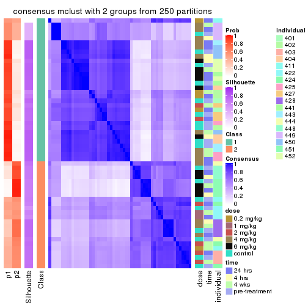</p>

</div>
<div id='tab-CV-mclust-consensus-heatmap-2'>
<pre><code class="r">consensus_heatmap(res, k = 3)
</code></pre>

<p>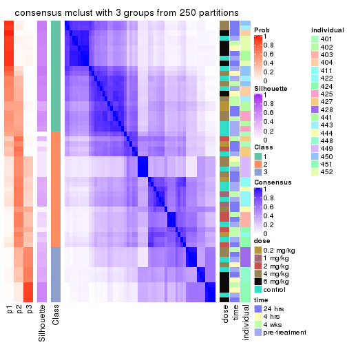</p>

</div>
<div id='tab-CV-mclust-consensus-heatmap-3'>
<pre><code class="r">consensus_heatmap(res, k = 4)
</code></pre>

<p>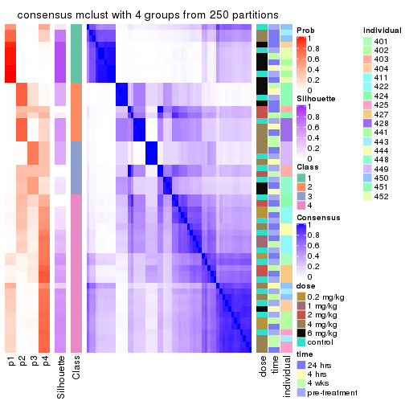</p>

</div>
<div id='tab-CV-mclust-consensus-heatmap-4'>
<pre><code class="r">consensus_heatmap(res, k = 5)
</code></pre>

<p>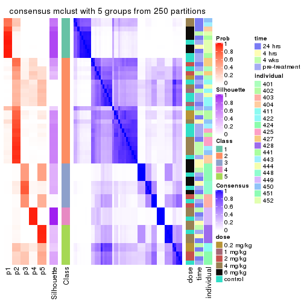</p>

</div>
<div id='tab-CV-mclust-consensus-heatmap-5'>
<pre><code class="r">consensus_heatmap(res, k = 6)
</code></pre>

<p>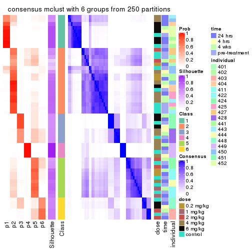</p>

</div>
</div>

Heatmaps for the membership of samples in all partitions to see how consistent they are:


<script>
$( function() {
	$( '#tabs-CV-mclust-membership-heatmap' ).tabs();
} );
</script>
<div id='tabs-CV-mclust-membership-heatmap'>
<ul>
<li><a href='#tab-CV-mclust-membership-heatmap-1'>k = 2</a></li>
<li><a href='#tab-CV-mclust-membership-heatmap-2'>k = 3</a></li>
<li><a href='#tab-CV-mclust-membership-heatmap-3'>k = 4</a></li>
<li><a href='#tab-CV-mclust-membership-heatmap-4'>k = 5</a></li>
<li><a href='#tab-CV-mclust-membership-heatmap-5'>k = 6</a></li>
</ul>
<div id='tab-CV-mclust-membership-heatmap-1'>
<pre><code class="r">membership_heatmap(res, k = 2)
</code></pre>

<p>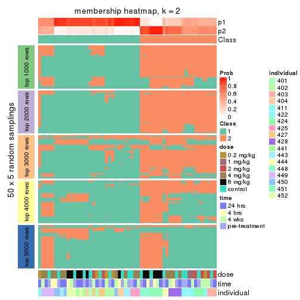</p>

</div>
<div id='tab-CV-mclust-membership-heatmap-2'>
<pre><code class="r">membership_heatmap(res, k = 3)
</code></pre>

<p>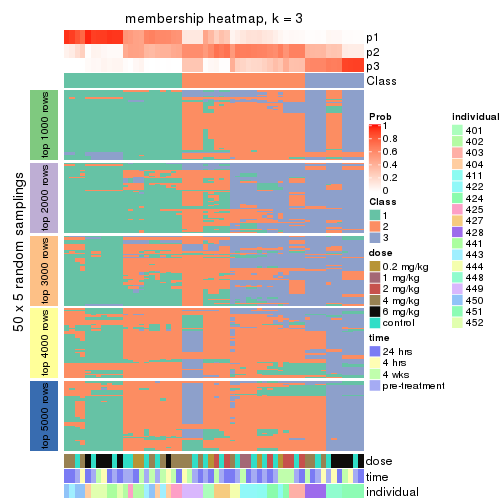</p>

</div>
<div id='tab-CV-mclust-membership-heatmap-3'>
<pre><code class="r">membership_heatmap(res, k = 4)
</code></pre>

<p>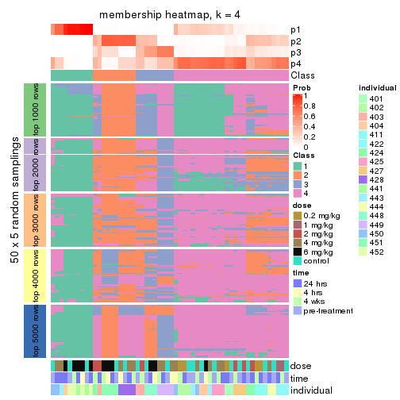</p>

</div>
<div id='tab-CV-mclust-membership-heatmap-4'>
<pre><code class="r">membership_heatmap(res, k = 5)
</code></pre>

<p>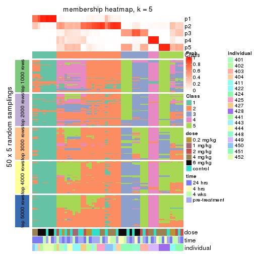</p>

</div>
<div id='tab-CV-mclust-membership-heatmap-5'>
<pre><code class="r">membership_heatmap(res, k = 6)
</code></pre>

<p>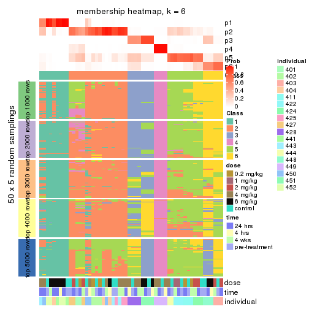</p>

</div>
</div>

As soon as we have had the classes for columns, we can look for signatures
which are significantly different between classes which can be candidate marks
for certain classes. Following are the heatmaps for signatures.


Signature heatmaps where rows are scaled:


<script>
$( function() {
	$( '#tabs-CV-mclust-get-signatures' ).tabs();
} );
</script>
<div id='tabs-CV-mclust-get-signatures'>
<ul>
<li><a href='#tab-CV-mclust-get-signatures-1'>k = 2</a></li>
<li><a href='#tab-CV-mclust-get-signatures-2'>k = 3</a></li>
<li><a href='#tab-CV-mclust-get-signatures-3'>k = 4</a></li>
<li><a href='#tab-CV-mclust-get-signatures-4'>k = 5</a></li>
<li><a href='#tab-CV-mclust-get-signatures-5'>k = 6</a></li>
</ul>
<div id='tab-CV-mclust-get-signatures-1'>
<pre><code class="r">get_signatures(res, k = 2)
</code></pre>

<p>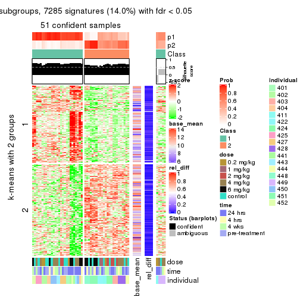</p>

</div>
<div id='tab-CV-mclust-get-signatures-2'>
<pre><code class="r">get_signatures(res, k = 3)
</code></pre>

<p>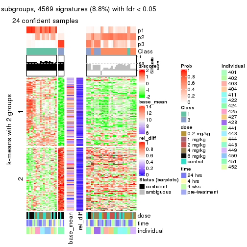</p>

</div>
<div id='tab-CV-mclust-get-signatures-3'>
<pre><code class="r">get_signatures(res, k = 4)
</code></pre>

<p>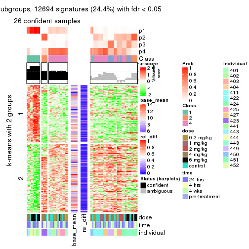</p>

</div>
<div id='tab-CV-mclust-get-signatures-4'>
<pre><code class="r">get_signatures(res, k = 5)
</code></pre>

<p>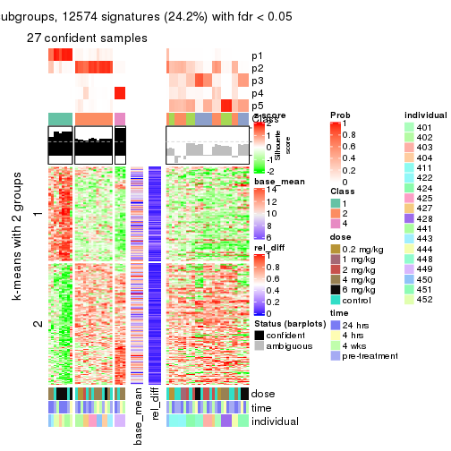</p>

</div>
<div id='tab-CV-mclust-get-signatures-5'>
<pre><code class="r">get_signatures(res, k = 6)
</code></pre>

<p>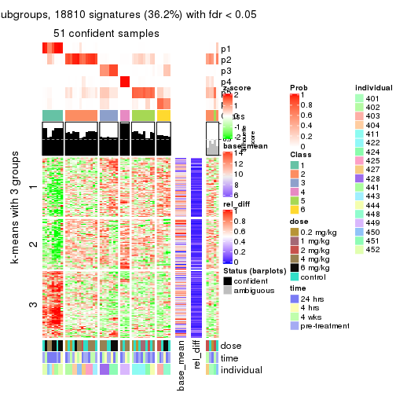</p>

</div>
</div>


Signature heatmaps where rows are not scaled:


<script>
$( function() {
	$( '#tabs-CV-mclust-get-signatures-no-scale' ).tabs();
} );
</script>
<div id='tabs-CV-mclust-get-signatures-no-scale'>
<ul>
<li><a href='#tab-CV-mclust-get-signatures-no-scale-1'>k = 2</a></li>
<li><a href='#tab-CV-mclust-get-signatures-no-scale-2'>k = 3</a></li>
<li><a href='#tab-CV-mclust-get-signatures-no-scale-3'>k = 4</a></li>
<li><a href='#tab-CV-mclust-get-signatures-no-scale-4'>k = 5</a></li>
<li><a href='#tab-CV-mclust-get-signatures-no-scale-5'>k = 6</a></li>
</ul>
<div id='tab-CV-mclust-get-signatures-no-scale-1'>
<pre><code class="r">get_signatures(res, k = 2, scale_rows = FALSE)
</code></pre>

<p>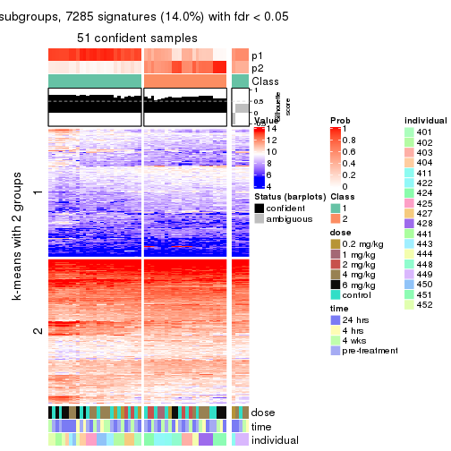</p>

</div>
<div id='tab-CV-mclust-get-signatures-no-scale-2'>
<pre><code class="r">get_signatures(res, k = 3, scale_rows = FALSE)
</code></pre>

<p>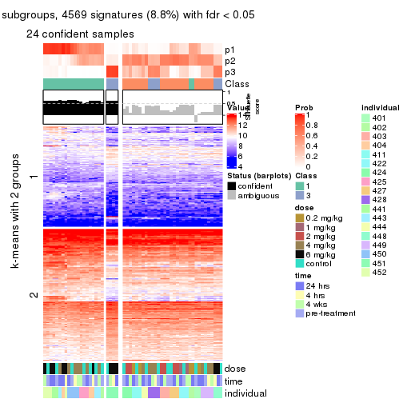</p>

</div>
<div id='tab-CV-mclust-get-signatures-no-scale-3'>
<pre><code class="r">get_signatures(res, k = 4, scale_rows = FALSE)
</code></pre>

<p>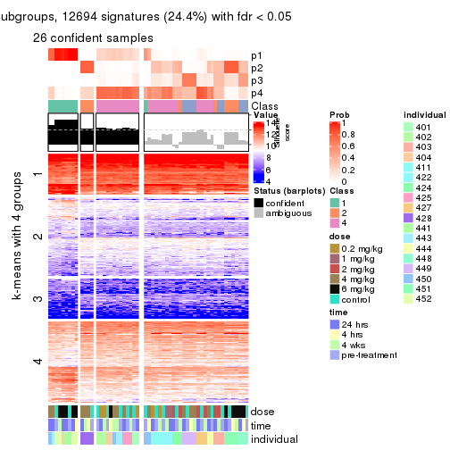</p>

</div>
<div id='tab-CV-mclust-get-signatures-no-scale-4'>
<pre><code class="r">get_signatures(res, k = 5, scale_rows = FALSE)
</code></pre>

<p>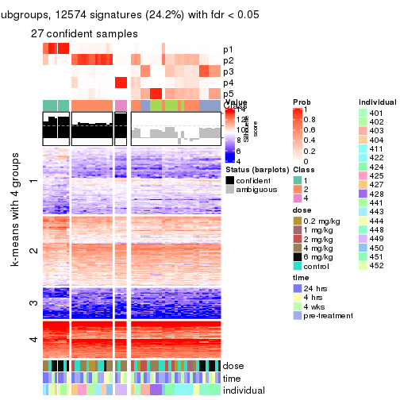</p>

</div>
<div id='tab-CV-mclust-get-signatures-no-scale-5'>
<pre><code class="r">get_signatures(res, k = 6, scale_rows = FALSE)
</code></pre>

<p>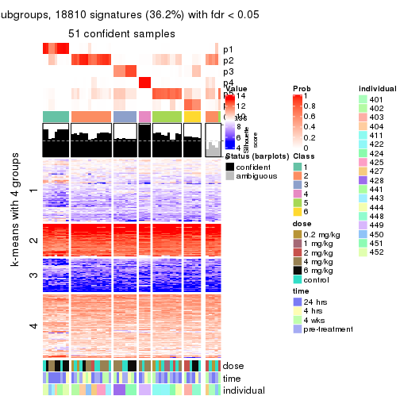</p>

</div>
</div>


Compare the overlap of signatures from different k:

```r
compare_signatures(res)
```

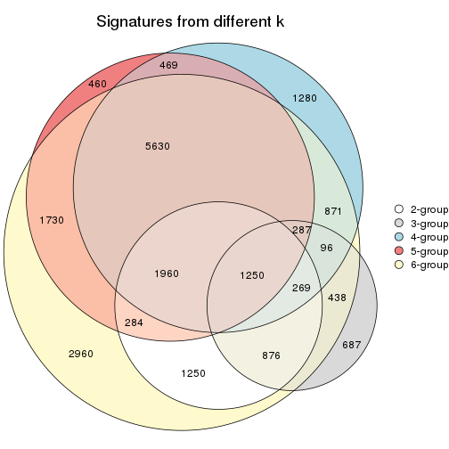

`get_signature()` returns a data frame invisibly. TO get the list of signatures, the function
call should be assigned to a variable explicitly. In following code, if `plot` argument is set
to `FALSE`, no heatmap is plotted while only the differential analysis is performed.

```r
# code only for demonstration
tb = get_signature(res, k = ..., plot = FALSE)
```

An example of the output of `tb` is:

```
#>   which_row         fdr    mean_1    mean_2 scaled_mean_1 scaled_mean_2 km
#> 1        38 0.042760348  8.373488  9.131774    -0.5533452     0.5164555  1
#> 2        40 0.018707592  7.106213  8.469186    -0.6173731     0.5762149  1
#> 3        55 0.019134737 10.221463 11.207825    -0.6159697     0.5749050  1
#> 4        59 0.006059896  5.921854  7.869574    -0.6899429     0.6439467  1
#> 5        60 0.018055526  8.928898 10.211722    -0.6204761     0.5791110  1
#> 6        98 0.009384629 15.714769 14.887706     0.6635654    -0.6193277  2
...
```

The columns in `tb` are:

1. `which_row`: row indices corresponding to the input matrix.
2. `fdr`: FDR for the differential test. 
3. `mean_x`: The mean value in group x.
4. `scaled_mean_x`: The mean value in group x after rows are scaled.
5. `km`: Row groups if k-means clustering is applied to rows.


UMAP plot which shows how samples are separated.


<script>
$( function() {
	$( '#tabs-CV-mclust-dimension-reduction' ).tabs();
} );
</script>
<div id='tabs-CV-mclust-dimension-reduction'>
<ul>
<li><a href='#tab-CV-mclust-dimension-reduction-1'>k = 2</a></li>
<li><a href='#tab-CV-mclust-dimension-reduction-2'>k = 3</a></li>
<li><a href='#tab-CV-mclust-dimension-reduction-3'>k = 4</a></li>
<li><a href='#tab-CV-mclust-dimension-reduction-4'>k = 5</a></li>
<li><a href='#tab-CV-mclust-dimension-reduction-5'>k = 6</a></li>
</ul>
<div id='tab-CV-mclust-dimension-reduction-1'>
<pre><code class="r">dimension_reduction(res, k = 2, method = &quot;UMAP&quot;)
</code></pre>

<p>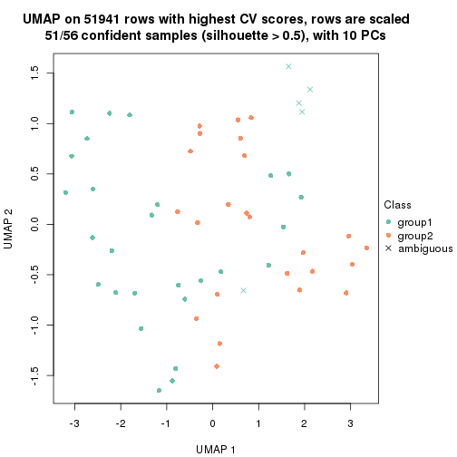</p>

</div>
<div id='tab-CV-mclust-dimension-reduction-2'>
<pre><code class="r">dimension_reduction(res, k = 3, method = &quot;UMAP&quot;)
</code></pre>

<p>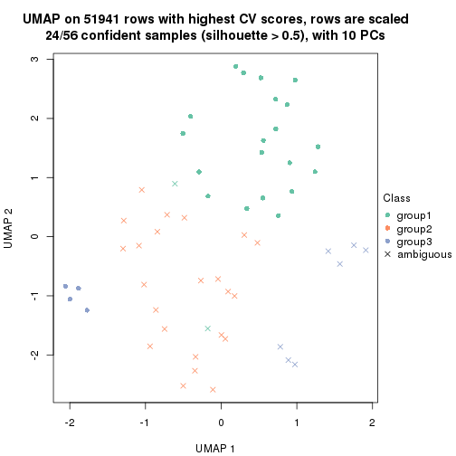</p>

</div>
<div id='tab-CV-mclust-dimension-reduction-3'>
<pre><code class="r">dimension_reduction(res, k = 4, method = &quot;UMAP&quot;)
</code></pre>

<p>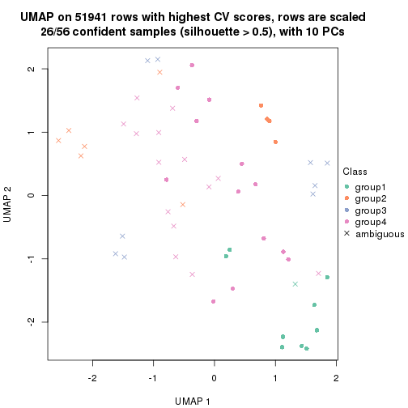</p>

</div>
<div id='tab-CV-mclust-dimension-reduction-4'>
<pre><code class="r">dimension_reduction(res, k = 5, method = &quot;UMAP&quot;)
</code></pre>

<p>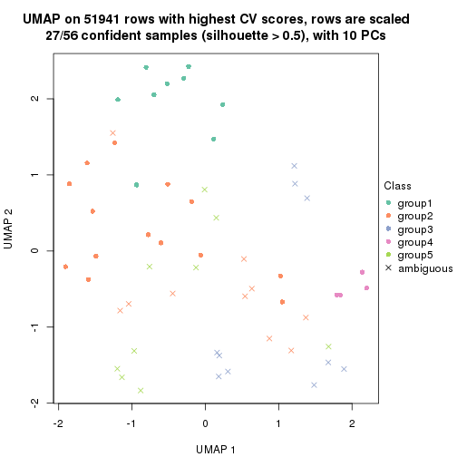</p>

</div>
<div id='tab-CV-mclust-dimension-reduction-5'>
<pre><code class="r">dimension_reduction(res, k = 6, method = &quot;UMAP&quot;)
</code></pre>

<p>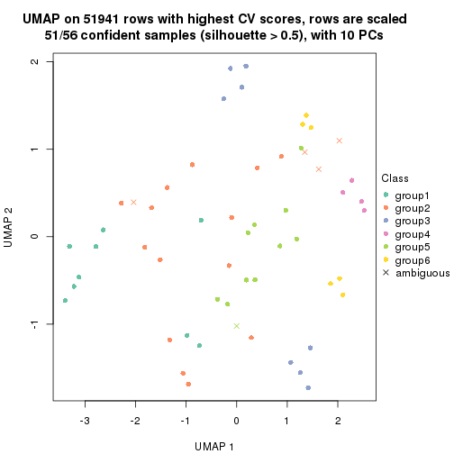</p>

</div>
</div>


Following heatmap shows how subgroups are split when increasing `k`:

```r
collect_classes(res)
```

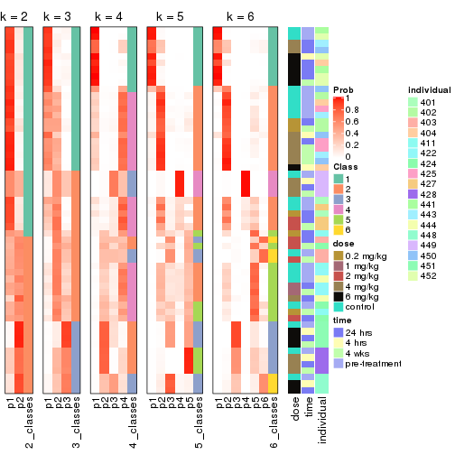


Test correlation between subgroups and known annotations. If the known
annotation is numeric, one-way ANOVA test is applied, and if the known
annotation is discrete, chi-squared contingency table test is applied.

```r
test_to_known_factors(res)
```

```
#>            n dose(p) time(p) individual(p) k
#> CV:mclust 51  0.4834   0.988      1.59e-05 2
#> CV:mclust 24  0.1920   0.947      1.14e-03 3
#> CV:mclust 26  0.0573   0.684      2.76e-04 4
#> CV:mclust 27  0.1479   0.742      1.88e-04 5
#> CV:mclust 51  0.0500   0.970      2.31e-17 6
```


If matrix rows can be associated to genes, consider to use `functional_enrichment(res,
...)` to perform function enrichment for the signature genes. See [this vignette](http://bioconductor.org/packages/devel/bioc/vignettes/cola/inst/doc/functional_enrichment.html) for more detailed explanations.


 

---------------------------------------------------


### CV:NMF


The object with results only for a single top-value method and a single partition method 
can be extracted as:

```r
res = res_list["CV", "NMF"]
# you can also extract it by
# res = res_list["CV:NMF"]
```

A summary of `res` and all the functions that can be applied to it:

```r
res
```

```
#> A 'ConsensusPartition' object with k = 2, 3, 4, 5, 6.
#>   On a matrix with 51941 rows and 56 columns.
#>   Top rows (1000, 2000, 3000, 4000, 5000) are extracted by 'CV' method.
#>   Subgroups are detected by 'NMF' method.
#>   Performed in total 1250 partitions by row resampling.
#>   Best k for subgroups seems to be 2.
#> 
#> Following methods can be applied to this 'ConsensusPartition' object:
#>  [1] "cola_report"             "collect_classes"         "collect_plots"          
#>  [4] "collect_stats"           "colnames"                "compare_signatures"     
#>  [7] "consensus_heatmap"       "dimension_reduction"     "functional_enrichment"  
#> [10] "get_anno_col"            "get_anno"                "get_classes"            
#> [13] "get_consensus"           "get_matrix"              "get_membership"         
#> [16] "get_param"               "get_signatures"          "get_stats"              
#> [19] "is_best_k"               "is_stable_k"             "membership_heatmap"     
#> [22] "ncol"                    "nrow"                    "plot_ecdf"              
#> [25] "rownames"                "select_partition_number" "show"                   
#> [28] "suggest_best_k"          "test_to_known_factors"
```

`collect_plots()` function collects all the plots made from `res` for all `k` (number of partitions)
into one single page to provide an easy and fast comparison between different `k`.

```r
collect_plots(res)
```

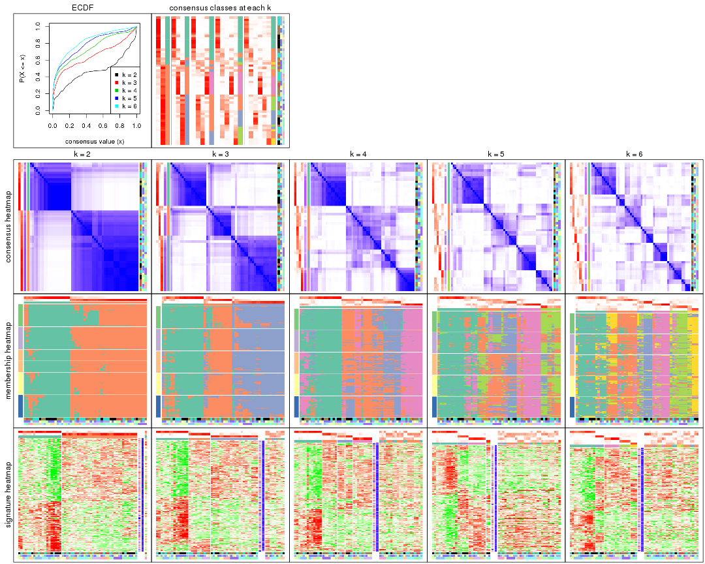

The plots are:

- The first row: a plot of the ECDF (empirical cumulative distribution
  function) curves of the consensus matrix for each `k` and the heatmap of
  predicted classes for each `k`.
- The second row: heatmaps of the consensus matrix for each `k`.
- The third row: heatmaps of the membership matrix for each `k`.
- The fouth row: heatmaps of the signatures for each `k`.

All the plots in panels can be made by individual functions and they are
plotted later in this section.

`select_partition_number()` produces several plots showing different
statistics for choosing "optimized" `k`. There are following statistics:

- ECDF curves of the consensus matrix for each `k`;
- 1-PAC. [The PAC
  score](https://en.wikipedia.org/wiki/Consensus_clustering#Over-interpretation_potential_of_consensus_clustering)
  measures the proportion of the ambiguous subgrouping.
- Mean silhouette score.
- Concordance. The mean probability of fiting the consensus class ids in all
  partitions.
- Area increased. Denote $A_k$ as the area under the ECDF curve for current
  `k`, the area increased is defined as $A_k - A_{k-1}$.
- Rand index. The percent of pairs of samples that are both in a same cluster
  or both are not in a same cluster in the partition of k and k-1.
- Jaccard index. The ratio of pairs of samples are both in a same cluster in
  the partition of k and k-1 and the pairs of samples are both in a same
  cluster in the partition k or k-1.

The detailed explanations of these statistics can be found in [the _cola_
vignette](http://bioconductor.org/packages/devel/bioc/vignettes/cola/inst/doc/cola.html#toc_13).

Generally speaking, lower PAC score, higher mean silhouette score or higher
concordance corresponds to better partition. Rand index and Jaccard index
measure how similar the current partition is compared to partition with `k-1`.
If they are too similar, we won't accept `k` is better than `k-1`.

```r
select_partition_number(res)
```

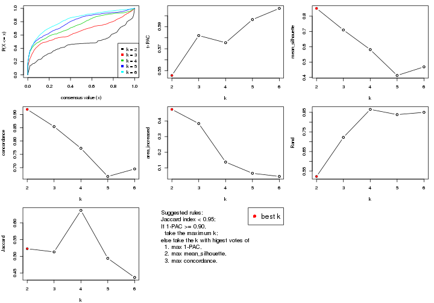

The numeric values for all these statistics can be obtained by `get_stats()`.

```r
get_stats(res)
```

```
#>   k 1-PAC mean_silhouette concordance area_increased  Rand Jaccard
#> 2 2 0.546           0.851       0.919         0.4738 0.523   0.523
#> 3 3 0.582           0.710       0.854         0.3833 0.722   0.513
#> 4 4 0.575           0.581       0.773         0.1368 0.865   0.638
#> 5 5 0.597           0.413       0.667         0.0651 0.838   0.494
#> 6 6 0.607           0.469       0.695         0.0448 0.850   0.437
```

`suggest_best_k()` suggests the best $k$ based on these statistics. The rules are as follows:

- All $k$ with Jaccard index larger than 0.95 are removed because increasing
  $k$ does not provide enough extra information. If all $k$ are removed, it is
  marked as no subgroup is detected.
- For all $k$ with 1-PAC score larger than 0.9, the maximal $k$ is taken as
  the best $k$, and other $k$ are marked as optional $k$.
- If it does not fit the second rule. The $k$ with the maximal vote of the
  highest 1-PAC score, highest mean silhouette, and highest concordance is
  taken as the best $k$.

```r
suggest_best_k(res)
```

```
#> [1] 2
```


Following shows the table of the partitions (You need to click the **show/hide
code output** link to see it). The membership matrix (columns with name `p*`)
is inferred by
[`clue::cl_consensus()`](https://www.rdocumentation.org/link/cl_consensus?package=clue)
function with the `SE` method. Basically the value in the membership matrix
represents the probability to belong to a certain group. The finall class
label for an item is determined with the group with highest probability it
belongs to.

In `get_classes()` function, the entropy is calculated from the membership
matrix and the silhouette score is calculated from the consensus matrix.


<script>
$( function() {
	$( '#tabs-CV-NMF-get-classes' ).tabs();
} );
</script>
<div id='tabs-CV-NMF-get-classes'>
<ul>
<li><a href='#tab-CV-NMF-get-classes-1'>k = 2</a></li>
<li><a href='#tab-CV-NMF-get-classes-2'>k = 3</a></li>
<li><a href='#tab-CV-NMF-get-classes-3'>k = 4</a></li>
<li><a href='#tab-CV-NMF-get-classes-4'>k = 5</a></li>
<li><a href='#tab-CV-NMF-get-classes-5'>k = 6</a></li>
</ul>

<div id='tab-CV-NMF-get-classes-1'>
<p><a id='tab-CV-NMF-get-classes-1-a' style='color:#0366d6' href='#'>show/hide code output</a></p>
<pre><code class="r">cbind(get_classes(res, k = 2), get_membership(res, k = 2))
</code></pre>

<pre><code>#&gt;           class entropy silhouette    p1    p2
#&gt; GSM687644     2  0.6887      0.808 0.184 0.816
#&gt; GSM687648     1  0.5294      0.833 0.880 0.120
#&gt; GSM687653     2  0.0938      0.908 0.012 0.988
#&gt; GSM687658     1  0.6531      0.784 0.832 0.168
#&gt; GSM687663     2  0.2778      0.897 0.048 0.952
#&gt; GSM687668     2  0.3879      0.887 0.076 0.924
#&gt; GSM687673     2  0.4298      0.872 0.088 0.912
#&gt; GSM687678     2  0.7883      0.755 0.236 0.764
#&gt; GSM687683     2  0.8813      0.650 0.300 0.700
#&gt; GSM687688     2  0.0376      0.907 0.004 0.996
#&gt; GSM687695     1  0.0000      0.910 1.000 0.000
#&gt; GSM687699     1  0.4161      0.866 0.916 0.084
#&gt; GSM687704     2  0.0376      0.907 0.004 0.996
#&gt; GSM687707     2  0.1414      0.908 0.020 0.980
#&gt; GSM687712     2  0.5842      0.847 0.140 0.860
#&gt; GSM687719     1  0.0000      0.910 1.000 0.000
#&gt; GSM687724     2  0.3584      0.884 0.068 0.932
#&gt; GSM687728     1  0.0000      0.910 1.000 0.000
#&gt; GSM687646     2  0.6148      0.839 0.152 0.848
#&gt; GSM687649     2  0.9460      0.523 0.364 0.636
#&gt; GSM687665     1  0.7602      0.724 0.780 0.220
#&gt; GSM687651     2  0.8499      0.700 0.276 0.724
#&gt; GSM687667     2  0.0938      0.908 0.012 0.988
#&gt; GSM687670     2  0.0672      0.907 0.008 0.992
#&gt; GSM687671     2  0.0376      0.907 0.004 0.996
#&gt; GSM687654     2  0.0938      0.908 0.012 0.988
#&gt; GSM687675     1  0.9323      0.534 0.652 0.348
#&gt; GSM687685     2  0.7674      0.769 0.224 0.776
#&gt; GSM687656     2  0.0938      0.908 0.012 0.988
#&gt; GSM687677     2  0.0938      0.908 0.012 0.988
#&gt; GSM687687     2  0.3431      0.892 0.064 0.936
#&gt; GSM687692     2  0.0376      0.907 0.004 0.996
#&gt; GSM687716     2  0.5519      0.856 0.128 0.872
#&gt; GSM687722     1  0.0000      0.910 1.000 0.000
#&gt; GSM687680     1  0.8144      0.655 0.748 0.252
#&gt; GSM687690     2  0.0376      0.907 0.004 0.996
#&gt; GSM687700     1  0.0000      0.910 1.000 0.000
#&gt; GSM687705     2  0.0376      0.907 0.004 0.996
#&gt; GSM687714     2  0.5946      0.844 0.144 0.856
#&gt; GSM687721     1  0.0000      0.910 1.000 0.000
#&gt; GSM687682     1  0.9323      0.438 0.652 0.348
#&gt; GSM687694     2  0.0672      0.908 0.008 0.992
#&gt; GSM687702     1  0.1633      0.902 0.976 0.024
#&gt; GSM687718     2  0.5737      0.850 0.136 0.864
#&gt; GSM687723     1  0.0376      0.909 0.996 0.004
#&gt; GSM687661     1  0.2423      0.897 0.960 0.040
#&gt; GSM687710     2  0.1184      0.908 0.016 0.984
#&gt; GSM687726     2  0.0938      0.908 0.012 0.988
#&gt; GSM687730     1  0.0000      0.910 1.000 0.000
#&gt; GSM687660     1  0.0000      0.910 1.000 0.000
#&gt; GSM687697     1  0.0000      0.910 1.000 0.000
#&gt; GSM687709     2  0.1184      0.908 0.016 0.984
#&gt; GSM687725     2  0.4161      0.872 0.084 0.916
#&gt; GSM687729     1  0.0000      0.910 1.000 0.000
#&gt; GSM687727     2  0.0672      0.908 0.008 0.992
#&gt; GSM687731     1  0.0000      0.910 1.000 0.000
</code></pre>

<script>
$('#tab-CV-NMF-get-classes-1-a').parent().next().next().hide();
$('#tab-CV-NMF-get-classes-1-a').click(function(){
  $('#tab-CV-NMF-get-classes-1-a').parent().next().next().toggle();
  return(false);
});
</script>
</div>

<div id='tab-CV-NMF-get-classes-2'>
<p><a id='tab-CV-NMF-get-classes-2-a' style='color:#0366d6' href='#'>show/hide code output</a></p>
<pre><code class="r">cbind(get_classes(res, k = 3), get_membership(res, k = 3))
</code></pre>

<pre><code>#&gt;           class entropy silhouette    p1    p2    p3
#&gt; GSM687644     2  0.3112     0.7868 0.056 0.916 0.028
#&gt; GSM687648     1  0.5304     0.7418 0.824 0.108 0.068
#&gt; GSM687653     3  0.1989     0.8662 0.004 0.048 0.948
#&gt; GSM687658     1  0.6314     0.4192 0.604 0.392 0.004
#&gt; GSM687663     3  0.1878     0.8685 0.004 0.044 0.952
#&gt; GSM687668     3  0.6299     0.2901 0.000 0.476 0.524
#&gt; GSM687673     3  0.0983     0.8617 0.004 0.016 0.980
#&gt; GSM687678     2  0.6254     0.6154 0.188 0.756 0.056
#&gt; GSM687683     2  0.1950     0.7940 0.040 0.952 0.008
#&gt; GSM687688     3  0.3412     0.8481 0.000 0.124 0.876
#&gt; GSM687695     1  0.0475     0.8302 0.992 0.004 0.004
#&gt; GSM687699     1  0.4479     0.7750 0.860 0.096 0.044
#&gt; GSM687704     3  0.5016     0.7632 0.000 0.240 0.760
#&gt; GSM687707     3  0.2400     0.8541 0.004 0.064 0.932
#&gt; GSM687712     2  0.0661     0.8060 0.004 0.988 0.008
#&gt; GSM687719     1  0.0892     0.8311 0.980 0.020 0.000
#&gt; GSM687724     3  0.2446     0.8591 0.012 0.052 0.936
#&gt; GSM687728     1  0.1267     0.8246 0.972 0.004 0.024
#&gt; GSM687646     2  0.2564     0.8018 0.028 0.936 0.036
#&gt; GSM687649     1  0.9794    -0.0469 0.384 0.236 0.380
#&gt; GSM687665     3  0.5178     0.6207 0.256 0.000 0.744
#&gt; GSM687651     2  0.9833     0.2429 0.256 0.412 0.332
#&gt; GSM687667     3  0.2066     0.8674 0.000 0.060 0.940
#&gt; GSM687670     2  0.6291    -0.1895 0.000 0.532 0.468
#&gt; GSM687671     3  0.6204     0.4407 0.000 0.424 0.576
#&gt; GSM687654     3  0.1525     0.8643 0.004 0.032 0.964
#&gt; GSM687675     3  0.2486     0.8310 0.060 0.008 0.932
#&gt; GSM687685     2  0.1877     0.7988 0.032 0.956 0.012
#&gt; GSM687656     3  0.2096     0.8663 0.004 0.052 0.944
#&gt; GSM687677     3  0.1399     0.8659 0.004 0.028 0.968
#&gt; GSM687687     2  0.1753     0.7917 0.000 0.952 0.048
#&gt; GSM687692     3  0.3879     0.8346 0.000 0.152 0.848
#&gt; GSM687716     2  0.0983     0.8047 0.004 0.980 0.016
#&gt; GSM687722     1  0.1163     0.8293 0.972 0.028 0.000
#&gt; GSM687680     1  0.6518     0.1352 0.512 0.484 0.004
#&gt; GSM687690     3  0.4504     0.8037 0.000 0.196 0.804
#&gt; GSM687700     1  0.0424     0.8314 0.992 0.008 0.000
#&gt; GSM687705     3  0.5363     0.7109 0.000 0.276 0.724
#&gt; GSM687714     2  0.0661     0.8060 0.004 0.988 0.008
#&gt; GSM687721     1  0.0892     0.8310 0.980 0.020 0.000
#&gt; GSM687682     2  0.6813    -0.0931 0.468 0.520 0.012
#&gt; GSM687694     3  0.4504     0.8037 0.000 0.196 0.804
#&gt; GSM687702     1  0.4842     0.6849 0.776 0.224 0.000
#&gt; GSM687718     2  0.0661     0.8060 0.004 0.988 0.008
#&gt; GSM687723     1  0.2959     0.7957 0.900 0.100 0.000
#&gt; GSM687661     1  0.6168     0.3748 0.588 0.412 0.000
#&gt; GSM687710     3  0.3682     0.8387 0.008 0.116 0.876
#&gt; GSM687726     3  0.1878     0.8614 0.004 0.044 0.952
#&gt; GSM687730     1  0.1399     0.8235 0.968 0.004 0.028
#&gt; GSM687660     1  0.0592     0.8315 0.988 0.012 0.000
#&gt; GSM687697     1  0.0424     0.8308 0.992 0.008 0.000
#&gt; GSM687709     3  0.3921     0.8242 0.016 0.112 0.872
#&gt; GSM687725     3  0.2280     0.8595 0.008 0.052 0.940
#&gt; GSM687729     1  0.0829     0.8286 0.984 0.004 0.012
#&gt; GSM687727     3  0.1643     0.8630 0.000 0.044 0.956
#&gt; GSM687731     1  0.0424     0.8306 0.992 0.000 0.008
</code></pre>

<script>
$('#tab-CV-NMF-get-classes-2-a').parent().next().next().hide();
$('#tab-CV-NMF-get-classes-2-a').click(function(){
  $('#tab-CV-NMF-get-classes-2-a').parent().next().next().toggle();
  return(false);
});
</script>
</div>

<div id='tab-CV-NMF-get-classes-3'>
<p><a id='tab-CV-NMF-get-classes-3-a' style='color:#0366d6' href='#'>show/hide code output</a></p>
<pre><code class="r">cbind(get_classes(res, k = 4), get_membership(res, k = 4))
</code></pre>

<pre><code>#&gt;           class entropy silhouette    p1    p2    p3    p4
#&gt; GSM687644     4  0.5518     0.7054 0.024 0.168 0.056 0.752
#&gt; GSM687648     1  0.7768     0.3785 0.576 0.148 0.232 0.044
#&gt; GSM687653     3  0.4594     0.6251 0.000 0.280 0.712 0.008
#&gt; GSM687658     1  0.5769     0.4540 0.588 0.000 0.036 0.376
#&gt; GSM687663     2  0.5482     0.1419 0.012 0.572 0.412 0.004
#&gt; GSM687668     2  0.5971     0.3574 0.000 0.584 0.048 0.368
#&gt; GSM687673     2  0.5080     0.2218 0.004 0.576 0.420 0.000
#&gt; GSM687678     4  0.8451     0.3795 0.124 0.124 0.204 0.548
#&gt; GSM687683     4  0.0804     0.8938 0.012 0.008 0.000 0.980
#&gt; GSM687688     2  0.0927     0.5571 0.000 0.976 0.016 0.008
#&gt; GSM687695     1  0.0469     0.8166 0.988 0.000 0.012 0.000
#&gt; GSM687699     1  0.7216     0.4972 0.636 0.160 0.168 0.036
#&gt; GSM687704     2  0.6310     0.5315 0.000 0.660 0.188 0.152
#&gt; GSM687707     3  0.1854     0.5749 0.000 0.048 0.940 0.012
#&gt; GSM687712     4  0.0188     0.8972 0.000 0.004 0.000 0.996
#&gt; GSM687719     1  0.0927     0.8183 0.976 0.000 0.008 0.016
#&gt; GSM687724     2  0.5110     0.4622 0.004 0.620 0.372 0.004
#&gt; GSM687728     1  0.1151     0.8151 0.968 0.008 0.024 0.000
#&gt; GSM687646     4  0.2413     0.8617 0.000 0.064 0.020 0.916
#&gt; GSM687649     3  0.8628     0.4243 0.184 0.276 0.476 0.064
#&gt; GSM687665     2  0.7789    -0.0854 0.248 0.400 0.352 0.000
#&gt; GSM687651     3  0.7928     0.5377 0.084 0.212 0.588 0.116
#&gt; GSM687667     2  0.5137    -0.0140 0.000 0.544 0.452 0.004
#&gt; GSM687670     2  0.5800     0.2489 0.000 0.548 0.032 0.420
#&gt; GSM687671     2  0.6214     0.3999 0.000 0.636 0.092 0.272
#&gt; GSM687654     3  0.4431     0.6090 0.000 0.304 0.696 0.000
#&gt; GSM687675     2  0.5833     0.2484 0.032 0.528 0.440 0.000
#&gt; GSM687685     4  0.1362     0.8896 0.020 0.012 0.004 0.964
#&gt; GSM687656     3  0.4677     0.5925 0.000 0.316 0.680 0.004
#&gt; GSM687677     2  0.4697     0.3865 0.000 0.644 0.356 0.000
#&gt; GSM687687     4  0.1545     0.8843 0.000 0.040 0.008 0.952
#&gt; GSM687692     2  0.1833     0.5598 0.000 0.944 0.024 0.032
#&gt; GSM687716     4  0.0469     0.8964 0.000 0.012 0.000 0.988
#&gt; GSM687722     1  0.0921     0.8177 0.972 0.000 0.000 0.028
#&gt; GSM687680     1  0.7068     0.2972 0.516 0.056 0.032 0.396
#&gt; GSM687690     2  0.2830     0.5424 0.000 0.900 0.060 0.040
#&gt; GSM687700     1  0.0524     0.8189 0.988 0.000 0.008 0.004
#&gt; GSM687705     2  0.5926     0.5163 0.000 0.692 0.116 0.192
#&gt; GSM687714     4  0.0188     0.8972 0.000 0.004 0.000 0.996
#&gt; GSM687721     1  0.0336     0.8189 0.992 0.000 0.000 0.008
#&gt; GSM687682     1  0.6860     0.3334 0.524 0.048 0.028 0.400
#&gt; GSM687694     2  0.2699     0.5356 0.000 0.904 0.068 0.028
#&gt; GSM687702     1  0.4739     0.7434 0.804 0.028 0.032 0.136
#&gt; GSM687718     4  0.0336     0.8968 0.000 0.008 0.000 0.992
#&gt; GSM687723     1  0.3109     0.7852 0.880 0.004 0.016 0.100
#&gt; GSM687661     1  0.5678     0.2341 0.500 0.004 0.016 0.480
#&gt; GSM687710     3  0.2317     0.6143 0.004 0.032 0.928 0.036
#&gt; GSM687726     2  0.4920     0.4694 0.000 0.628 0.368 0.004
#&gt; GSM687730     1  0.2111     0.7949 0.932 0.024 0.044 0.000
#&gt; GSM687660     1  0.0188     0.8179 0.996 0.000 0.004 0.000
#&gt; GSM687697     1  0.0188     0.8179 0.996 0.000 0.004 0.000
#&gt; GSM687709     3  0.2123     0.6109 0.004 0.032 0.936 0.028
#&gt; GSM687725     2  0.4990     0.4832 0.000 0.640 0.352 0.008
#&gt; GSM687729     1  0.1004     0.8148 0.972 0.004 0.024 0.000
#&gt; GSM687727     2  0.4746     0.5108 0.000 0.688 0.304 0.008
#&gt; GSM687731     1  0.0469     0.8185 0.988 0.000 0.012 0.000
</code></pre>

<script>
$('#tab-CV-NMF-get-classes-3-a').parent().next().next().hide();
$('#tab-CV-NMF-get-classes-3-a').click(function(){
  $('#tab-CV-NMF-get-classes-3-a').parent().next().next().toggle();
  return(false);
});
</script>
</div>

<div id='tab-CV-NMF-get-classes-4'>
<p><a id='tab-CV-NMF-get-classes-4-a' style='color:#0366d6' href='#'>show/hide code output</a></p>
<pre><code class="r">cbind(get_classes(res, k = 5), get_membership(res, k = 5))
</code></pre>

<pre><code>#&gt;           class entropy silhouette    p1    p2    p3    p4    p5
#&gt; GSM687644     4  0.5218    0.32543 0.004 0.456 0.008 0.512 0.020
#&gt; GSM687648     2  0.6783    0.00674 0.236 0.544 0.004 0.020 0.196
#&gt; GSM687653     5  0.5014    0.46537 0.000 0.432 0.032 0.000 0.536
#&gt; GSM687658     1  0.6924    0.35282 0.468 0.008 0.004 0.284 0.236
#&gt; GSM687663     5  0.7555    0.23740 0.028 0.304 0.320 0.004 0.344
#&gt; GSM687668     2  0.7135    0.05571 0.000 0.384 0.252 0.348 0.016
#&gt; GSM687673     5  0.6797    0.29818 0.008 0.360 0.204 0.000 0.428
#&gt; GSM687678     4  0.6983    0.25883 0.052 0.392 0.008 0.464 0.084
#&gt; GSM687683     4  0.1708    0.77298 0.004 0.016 0.004 0.944 0.032
#&gt; GSM687688     2  0.4909    0.03740 0.000 0.508 0.472 0.012 0.008
#&gt; GSM687695     1  0.0324    0.74316 0.992 0.000 0.004 0.000 0.004
#&gt; GSM687699     2  0.6405   -0.13005 0.392 0.480 0.000 0.016 0.112
#&gt; GSM687704     3  0.7012    0.38513 0.000 0.172 0.584 0.136 0.108
#&gt; GSM687707     5  0.2017    0.49046 0.000 0.000 0.080 0.008 0.912
#&gt; GSM687712     4  0.0566    0.77633 0.000 0.000 0.004 0.984 0.012
#&gt; GSM687719     1  0.2590    0.73670 0.900 0.028 0.000 0.012 0.060
#&gt; GSM687724     3  0.3031    0.69738 0.016 0.004 0.852 0.000 0.128
#&gt; GSM687728     1  0.1646    0.73927 0.944 0.020 0.032 0.000 0.004
#&gt; GSM687646     4  0.3511    0.67349 0.000 0.184 0.004 0.800 0.012
#&gt; GSM687649     2  0.5769   -0.11775 0.044 0.632 0.012 0.024 0.288
#&gt; GSM687665     1  0.8539   -0.35530 0.300 0.272 0.200 0.000 0.228
#&gt; GSM687651     2  0.6386   -0.18083 0.028 0.544 0.012 0.064 0.352
#&gt; GSM687667     2  0.6593   -0.36113 0.000 0.432 0.216 0.000 0.352
#&gt; GSM687670     4  0.7631   -0.17320 0.004 0.328 0.244 0.384 0.040
#&gt; GSM687671     2  0.6775    0.15727 0.000 0.512 0.236 0.236 0.016
#&gt; GSM687654     5  0.4917    0.47439 0.000 0.416 0.028 0.000 0.556
#&gt; GSM687675     5  0.7738    0.15011 0.056 0.272 0.304 0.000 0.368
#&gt; GSM687685     4  0.1616    0.77213 0.004 0.032 0.008 0.948 0.008
#&gt; GSM687656     5  0.5114    0.43743 0.000 0.472 0.036 0.000 0.492
#&gt; GSM687677     3  0.6721   -0.00359 0.000 0.340 0.404 0.000 0.256
#&gt; GSM687687     4  0.2165    0.76215 0.000 0.036 0.016 0.924 0.024
#&gt; GSM687692     2  0.5008    0.01898 0.000 0.500 0.476 0.012 0.012
#&gt; GSM687716     4  0.0912    0.77454 0.000 0.000 0.016 0.972 0.012
#&gt; GSM687722     1  0.2795    0.73163 0.884 0.028 0.000 0.008 0.080
#&gt; GSM687680     1  0.7153    0.05627 0.364 0.276 0.004 0.348 0.008
#&gt; GSM687690     2  0.5140    0.07202 0.000 0.524 0.444 0.024 0.008
#&gt; GSM687700     1  0.2233    0.72908 0.904 0.080 0.000 0.000 0.016
#&gt; GSM687705     3  0.5332    0.50892 0.004 0.132 0.732 0.100 0.032
#&gt; GSM687714     4  0.0510    0.77638 0.000 0.000 0.000 0.984 0.016
#&gt; GSM687721     1  0.2054    0.73873 0.920 0.028 0.000 0.000 0.052
#&gt; GSM687682     1  0.6937    0.12570 0.396 0.212 0.000 0.380 0.012
#&gt; GSM687694     2  0.5152    0.12796 0.000 0.572 0.392 0.024 0.012
#&gt; GSM687702     1  0.6232    0.48853 0.596 0.276 0.000 0.092 0.036
#&gt; GSM687718     4  0.0771    0.77483 0.000 0.000 0.004 0.976 0.020
#&gt; GSM687723     1  0.5341    0.65944 0.724 0.044 0.000 0.080 0.152
#&gt; GSM687661     1  0.6100    0.22161 0.472 0.008 0.000 0.424 0.096
#&gt; GSM687710     5  0.1659    0.51857 0.004 0.008 0.024 0.016 0.948
#&gt; GSM687726     3  0.2597    0.70570 0.004 0.004 0.872 0.000 0.120
#&gt; GSM687730     1  0.2786    0.71329 0.884 0.012 0.084 0.000 0.020
#&gt; GSM687660     1  0.0865    0.74369 0.972 0.000 0.004 0.000 0.024
#&gt; GSM687697     1  0.0324    0.74262 0.992 0.004 0.004 0.000 0.000
#&gt; GSM687709     5  0.1766    0.51335 0.004 0.004 0.040 0.012 0.940
#&gt; GSM687725     3  0.2894    0.70314 0.008 0.008 0.860 0.000 0.124
#&gt; GSM687729     1  0.1569    0.73676 0.944 0.008 0.044 0.000 0.004
#&gt; GSM687727     3  0.2293    0.69786 0.000 0.016 0.900 0.000 0.084
#&gt; GSM687731     1  0.1356    0.74030 0.956 0.028 0.012 0.000 0.004
</code></pre>

<script>
$('#tab-CV-NMF-get-classes-4-a').parent().next().next().hide();
$('#tab-CV-NMF-get-classes-4-a').click(function(){
  $('#tab-CV-NMF-get-classes-4-a').parent().next().next().toggle();
  return(false);
});
</script>
</div>

<div id='tab-CV-NMF-get-classes-5'>
<p><a id='tab-CV-NMF-get-classes-5-a' style='color:#0366d6' href='#'>show/hide code output</a></p>
<pre><code class="r">cbind(get_classes(res, k = 6), get_membership(res, k = 6))
</code></pre>

<pre><code>#&gt;           class entropy silhouette    p1    p2    p3    p4    p5    p6
#&gt; GSM687644     2  0.5318    0.11120 0.004 0.540 0.000 0.368 0.084 0.004
#&gt; GSM687648     2  0.3969    0.49340 0.192 0.764 0.004 0.004 0.020 0.016
#&gt; GSM687653     2  0.5472    0.07678 0.000 0.552 0.016 0.000 0.092 0.340
#&gt; GSM687658     1  0.7513    0.25603 0.408 0.024 0.016 0.176 0.052 0.324
#&gt; GSM687663     3  0.8196   -0.08367 0.036 0.272 0.300 0.000 0.164 0.228
#&gt; GSM687668     5  0.7317    0.38003 0.004 0.080 0.112 0.272 0.488 0.044
#&gt; GSM687673     6  0.6749    0.22907 0.020 0.060 0.104 0.000 0.364 0.452
#&gt; GSM687678     2  0.5862    0.25995 0.056 0.568 0.000 0.316 0.044 0.016
#&gt; GSM687683     4  0.5665    0.69719 0.044 0.036 0.012 0.708 0.104 0.096
#&gt; GSM687688     5  0.3481    0.58946 0.000 0.048 0.160 0.000 0.792 0.000
#&gt; GSM687695     1  0.1257    0.71905 0.952 0.020 0.028 0.000 0.000 0.000
#&gt; GSM687699     2  0.4113    0.48199 0.212 0.740 0.000 0.004 0.032 0.012
#&gt; GSM687704     3  0.7936    0.05700 0.004 0.044 0.364 0.168 0.320 0.100
#&gt; GSM687707     6  0.3125    0.63374 0.004 0.060 0.068 0.012 0.000 0.856
#&gt; GSM687712     4  0.0146    0.83167 0.000 0.000 0.004 0.996 0.000 0.000
#&gt; GSM687719     1  0.5586    0.65450 0.700 0.036 0.024 0.016 0.072 0.152
#&gt; GSM687724     3  0.1533    0.63405 0.012 0.008 0.948 0.000 0.016 0.016
#&gt; GSM687728     1  0.4301    0.64923 0.780 0.096 0.092 0.000 0.016 0.016
#&gt; GSM687646     4  0.4361    0.43457 0.000 0.308 0.000 0.648 0.044 0.000
#&gt; GSM687649     2  0.3271    0.48056 0.048 0.864 0.004 0.012 0.040 0.032
#&gt; GSM687665     2  0.8671   -0.00946 0.156 0.336 0.196 0.000 0.140 0.172
#&gt; GSM687651     2  0.3324    0.46641 0.028 0.852 0.000 0.032 0.012 0.076
#&gt; GSM687667     2  0.7367   -0.13614 0.000 0.368 0.120 0.000 0.256 0.256
#&gt; GSM687670     5  0.7084    0.40528 0.004 0.064 0.072 0.256 0.528 0.076
#&gt; GSM687671     5  0.5105    0.56080 0.000 0.124 0.024 0.108 0.720 0.024
#&gt; GSM687654     2  0.5661    0.02867 0.000 0.520 0.016 0.000 0.108 0.356
#&gt; GSM687675     6  0.7667    0.22147 0.064 0.076 0.132 0.000 0.344 0.384
#&gt; GSM687685     4  0.5014    0.73176 0.016 0.052 0.000 0.732 0.132 0.068
#&gt; GSM687656     2  0.5554    0.07839 0.000 0.552 0.016 0.000 0.104 0.328
#&gt; GSM687677     5  0.6968   -0.14305 0.004 0.044 0.316 0.000 0.352 0.284
#&gt; GSM687687     4  0.4238    0.74686 0.004 0.036 0.004 0.776 0.144 0.036
#&gt; GSM687692     5  0.3569    0.61373 0.000 0.044 0.124 0.008 0.816 0.008
#&gt; GSM687716     4  0.0291    0.83045 0.000 0.000 0.000 0.992 0.004 0.004
#&gt; GSM687722     1  0.5783    0.62185 0.664 0.036 0.016 0.012 0.088 0.184
#&gt; GSM687680     2  0.6407    0.30920 0.284 0.480 0.000 0.208 0.024 0.004
#&gt; GSM687690     5  0.3505    0.62421 0.000 0.068 0.096 0.008 0.824 0.004
#&gt; GSM687700     1  0.3539    0.67899 0.820 0.120 0.004 0.000 0.016 0.040
#&gt; GSM687705     3  0.6203    0.18230 0.000 0.012 0.496 0.088 0.364 0.040
#&gt; GSM687714     4  0.0000    0.83199 0.000 0.000 0.000 1.000 0.000 0.000
#&gt; GSM687721     1  0.4373    0.69226 0.788 0.036 0.012 0.004 0.064 0.096
#&gt; GSM687682     2  0.6709    0.28781 0.308 0.436 0.004 0.220 0.028 0.004
#&gt; GSM687694     5  0.3272    0.62605 0.000 0.076 0.080 0.008 0.836 0.000
#&gt; GSM687702     2  0.5910    0.15767 0.380 0.516 0.004 0.056 0.016 0.028
#&gt; GSM687718     4  0.0291    0.83017 0.000 0.000 0.004 0.992 0.004 0.000
#&gt; GSM687723     1  0.6492    0.55289 0.588 0.044 0.016 0.020 0.100 0.232
#&gt; GSM687661     1  0.6891    0.25648 0.448 0.024 0.004 0.360 0.048 0.116
#&gt; GSM687710     6  0.3023    0.63388 0.004 0.084 0.040 0.012 0.000 0.860
#&gt; GSM687726     3  0.1520    0.63645 0.008 0.008 0.948 0.000 0.020 0.016
#&gt; GSM687730     1  0.3935    0.65129 0.776 0.060 0.152 0.000 0.000 0.012
#&gt; GSM687660     1  0.1659    0.72507 0.940 0.004 0.020 0.000 0.008 0.028
#&gt; GSM687697     1  0.1176    0.71892 0.956 0.020 0.024 0.000 0.000 0.000
#&gt; GSM687709     6  0.3077    0.63570 0.004 0.076 0.044 0.016 0.000 0.860
#&gt; GSM687725     3  0.1194    0.63653 0.004 0.000 0.956 0.000 0.032 0.008
#&gt; GSM687729     1  0.3232    0.68894 0.844 0.056 0.088 0.000 0.004 0.008
#&gt; GSM687727     3  0.1872    0.62424 0.000 0.004 0.920 0.004 0.064 0.008
#&gt; GSM687731     1  0.3667    0.66170 0.812 0.124 0.044 0.000 0.008 0.012
</code></pre>

<script>
$('#tab-CV-NMF-get-classes-5-a').parent().next().next().hide();
$('#tab-CV-NMF-get-classes-5-a').click(function(){
  $('#tab-CV-NMF-get-classes-5-a').parent().next().next().toggle();
  return(false);
});
</script>
</div>
</div>

Heatmaps for the consensus matrix. It visualizes the probability of two
samples to be in a same group.


<script>
$( function() {
	$( '#tabs-CV-NMF-consensus-heatmap' ).tabs();
} );
</script>
<div id='tabs-CV-NMF-consensus-heatmap'>
<ul>
<li><a href='#tab-CV-NMF-consensus-heatmap-1'>k = 2</a></li>
<li><a href='#tab-CV-NMF-consensus-heatmap-2'>k = 3</a></li>
<li><a href='#tab-CV-NMF-consensus-heatmap-3'>k = 4</a></li>
<li><a href='#tab-CV-NMF-consensus-heatmap-4'>k = 5</a></li>
<li><a href='#tab-CV-NMF-consensus-heatmap-5'>k = 6</a></li>
</ul>
<div id='tab-CV-NMF-consensus-heatmap-1'>
<pre><code class="r">consensus_heatmap(res, k = 2)
</code></pre>

<p>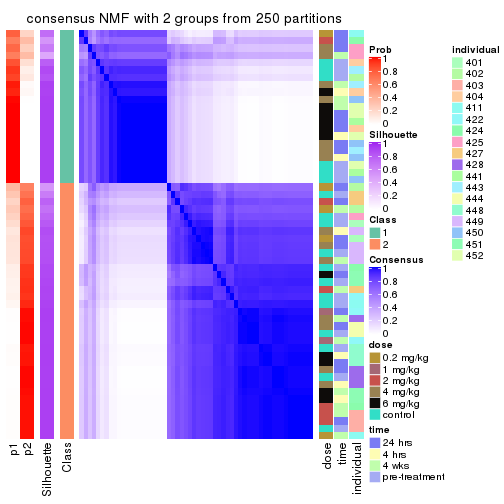</p>

</div>
<div id='tab-CV-NMF-consensus-heatmap-2'>
<pre><code class="r">consensus_heatmap(res, k = 3)
</code></pre>

<p>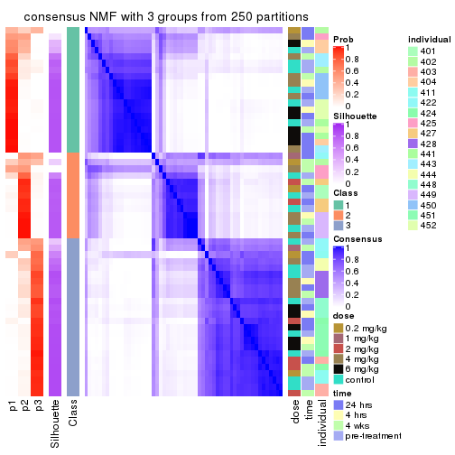</p>

</div>
<div id='tab-CV-NMF-consensus-heatmap-3'>
<pre><code class="r">consensus_heatmap(res, k = 4)
</code></pre>

<p>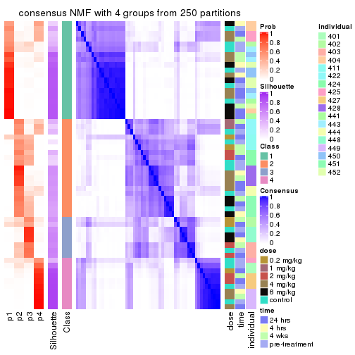</p>

</div>
<div id='tab-CV-NMF-consensus-heatmap-4'>
<pre><code class="r">consensus_heatmap(res, k = 5)
</code></pre>

<p>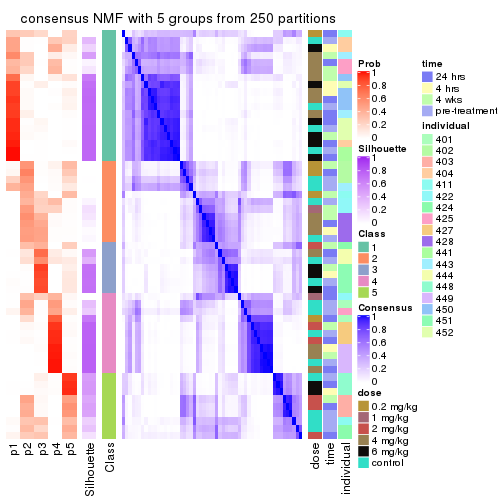</p>

</div>
<div id='tab-CV-NMF-consensus-heatmap-5'>
<pre><code class="r">consensus_heatmap(res, k = 6)
</code></pre>

<p>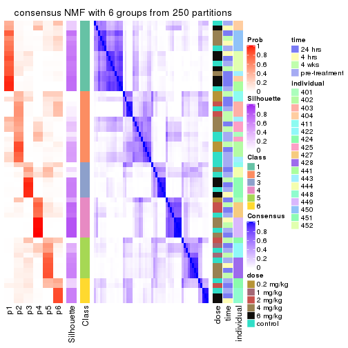</p>

</div>
</div>

Heatmaps for the membership of samples in all partitions to see how consistent they are:


<script>
$( function() {
	$( '#tabs-CV-NMF-membership-heatmap' ).tabs();
} );
</script>
<div id='tabs-CV-NMF-membership-heatmap'>
<ul>
<li><a href='#tab-CV-NMF-membership-heatmap-1'>k = 2</a></li>
<li><a href='#tab-CV-NMF-membership-heatmap-2'>k = 3</a></li>
<li><a href='#tab-CV-NMF-membership-heatmap-3'>k = 4</a></li>
<li><a href='#tab-CV-NMF-membership-heatmap-4'>k = 5</a></li>
<li><a href='#tab-CV-NMF-membership-heatmap-5'>k = 6</a></li>
</ul>
<div id='tab-CV-NMF-membership-heatmap-1'>
<pre><code class="r">membership_heatmap(res, k = 2)
</code></pre>

<p>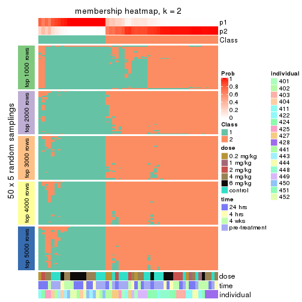</p>

</div>
<div id='tab-CV-NMF-membership-heatmap-2'>
<pre><code class="r">membership_heatmap(res, k = 3)
</code></pre>

<p>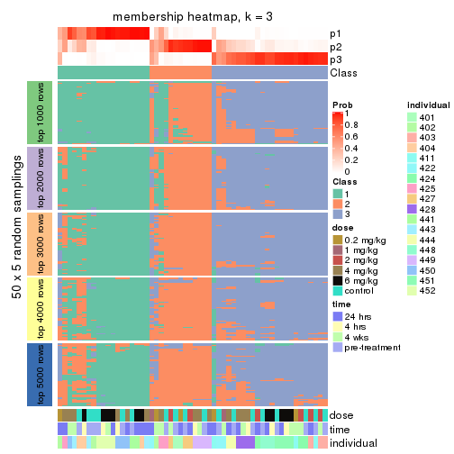</p>

</div>
<div id='tab-CV-NMF-membership-heatmap-3'>
<pre><code class="r">membership_heatmap(res, k = 4)
</code></pre>

<p>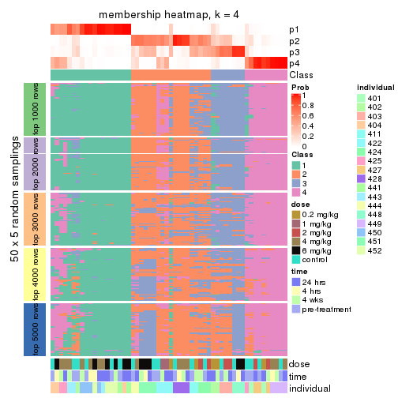</p>

</div>
<div id='tab-CV-NMF-membership-heatmap-4'>
<pre><code class="r">membership_heatmap(res, k = 5)
</code></pre>

<p>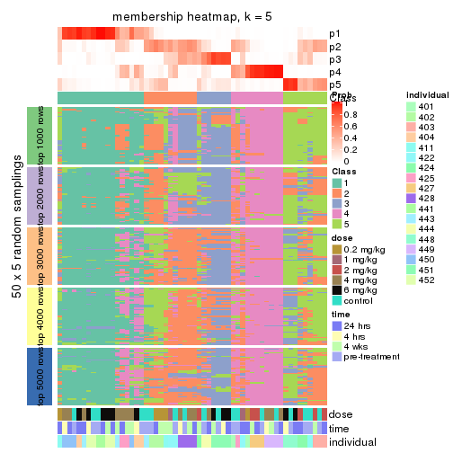</p>

</div>
<div id='tab-CV-NMF-membership-heatmap-5'>
<pre><code class="r">membership_heatmap(res, k = 6)
</code></pre>

<p>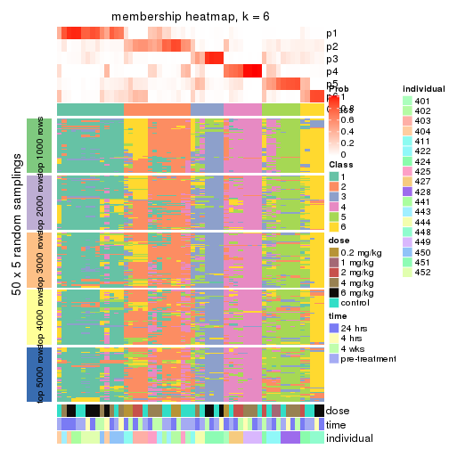</p>

</div>
</div>

As soon as we have had the classes for columns, we can look for signatures
which are significantly different between classes which can be candidate marks
for certain classes. Following are the heatmaps for signatures.


Signature heatmaps where rows are scaled:


<script>
$( function() {
	$( '#tabs-CV-NMF-get-signatures' ).tabs();
} );
</script>
<div id='tabs-CV-NMF-get-signatures'>
<ul>
<li><a href='#tab-CV-NMF-get-signatures-1'>k = 2</a></li>
<li><a href='#tab-CV-NMF-get-signatures-2'>k = 3</a></li>
<li><a href='#tab-CV-NMF-get-signatures-3'>k = 4</a></li>
<li><a href='#tab-CV-NMF-get-signatures-4'>k = 5</a></li>
<li><a href='#tab-CV-NMF-get-signatures-5'>k = 6</a></li>
</ul>
<div id='tab-CV-NMF-get-signatures-1'>
<pre><code class="r">get_signatures(res, k = 2)
</code></pre>

<p>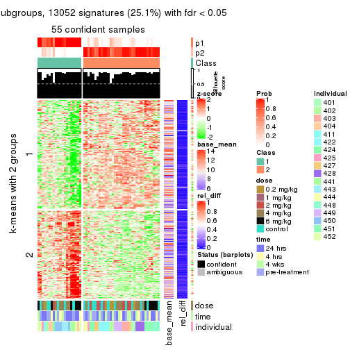</p>

</div>
<div id='tab-CV-NMF-get-signatures-2'>
<pre><code class="r">get_signatures(res, k = 3)
</code></pre>

<p>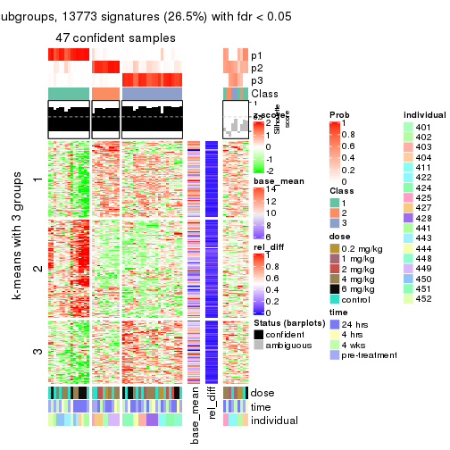</p>

</div>
<div id='tab-CV-NMF-get-signatures-3'>
<pre><code class="r">get_signatures(res, k = 4)
</code></pre>

<p>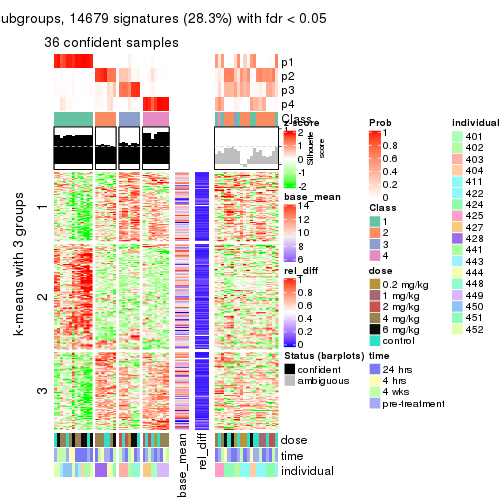</p>

</div>
<div id='tab-CV-NMF-get-signatures-4'>
<pre><code class="r">get_signatures(res, k = 5)
</code></pre>

<p>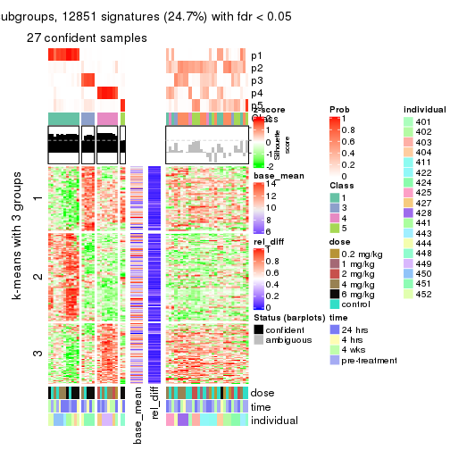</p>

</div>
<div id='tab-CV-NMF-get-signatures-5'>
<pre><code class="r">get_signatures(res, k = 6)
</code></pre>

<p>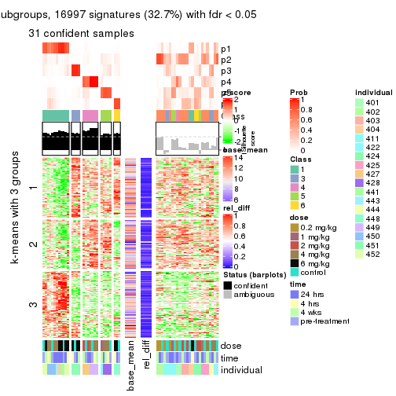</p>

</div>
</div>


Signature heatmaps where rows are not scaled:


<script>
$( function() {
	$( '#tabs-CV-NMF-get-signatures-no-scale' ).tabs();
} );
</script>
<div id='tabs-CV-NMF-get-signatures-no-scale'>
<ul>
<li><a href='#tab-CV-NMF-get-signatures-no-scale-1'>k = 2</a></li>
<li><a href='#tab-CV-NMF-get-signatures-no-scale-2'>k = 3</a></li>
<li><a href='#tab-CV-NMF-get-signatures-no-scale-3'>k = 4</a></li>
<li><a href='#tab-CV-NMF-get-signatures-no-scale-4'>k = 5</a></li>
<li><a href='#tab-CV-NMF-get-signatures-no-scale-5'>k = 6</a></li>
</ul>
<div id='tab-CV-NMF-get-signatures-no-scale-1'>
<pre><code class="r">get_signatures(res, k = 2, scale_rows = FALSE)
</code></pre>

<p>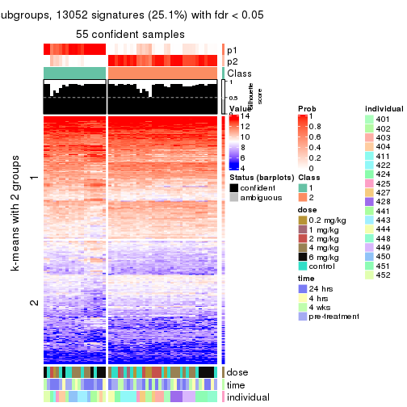</p>

</div>
<div id='tab-CV-NMF-get-signatures-no-scale-2'>
<pre><code class="r">get_signatures(res, k = 3, scale_rows = FALSE)
</code></pre>

<p>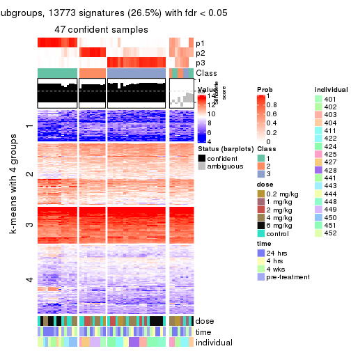</p>

</div>
<div id='tab-CV-NMF-get-signatures-no-scale-3'>
<pre><code class="r">get_signatures(res, k = 4, scale_rows = FALSE)
</code></pre>

<p>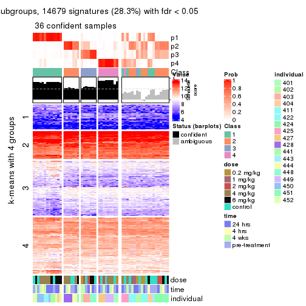</p>

</div>
<div id='tab-CV-NMF-get-signatures-no-scale-4'>
<pre><code class="r">get_signatures(res, k = 5, scale_rows = FALSE)
</code></pre>

<p>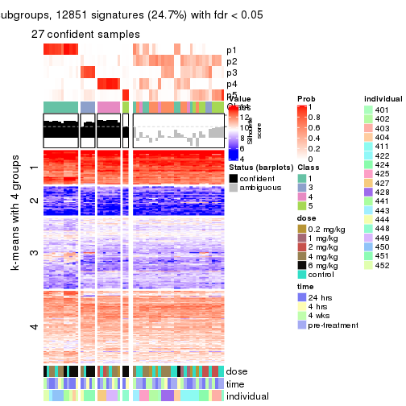</p>

</div>
<div id='tab-CV-NMF-get-signatures-no-scale-5'>
<pre><code class="r">get_signatures(res, k = 6, scale_rows = FALSE)
</code></pre>

<p>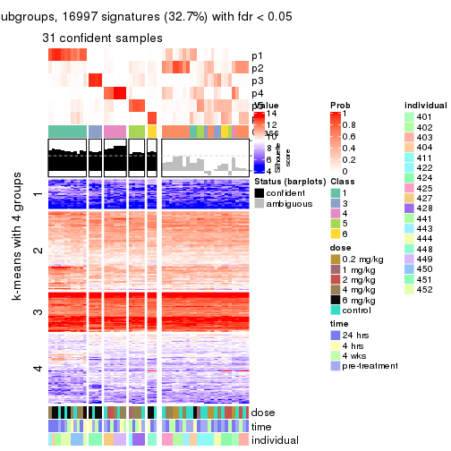</p>

</div>
</div>


Compare the overlap of signatures from different k:

```r
compare_signatures(res)
```

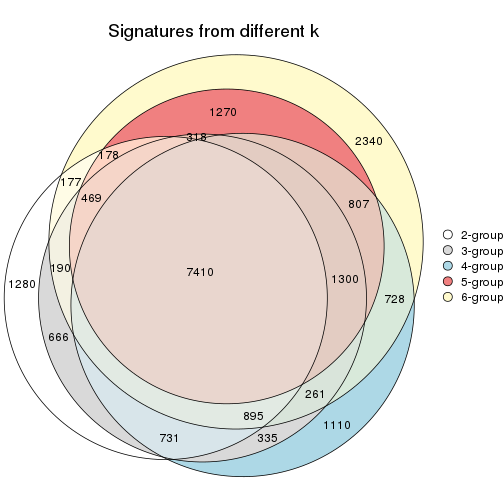

`get_signature()` returns a data frame invisibly. TO get the list of signatures, the function
call should be assigned to a variable explicitly. In following code, if `plot` argument is set
to `FALSE`, no heatmap is plotted while only the differential analysis is performed.

```r
# code only for demonstration
tb = get_signature(res, k = ..., plot = FALSE)
```

An example of the output of `tb` is:

```
#>   which_row         fdr    mean_1    mean_2 scaled_mean_1 scaled_mean_2 km
#> 1        38 0.042760348  8.373488  9.131774    -0.5533452     0.5164555  1
#> 2        40 0.018707592  7.106213  8.469186    -0.6173731     0.5762149  1
#> 3        55 0.019134737 10.221463 11.207825    -0.6159697     0.5749050  1
#> 4        59 0.006059896  5.921854  7.869574    -0.6899429     0.6439467  1
#> 5        60 0.018055526  8.928898 10.211722    -0.6204761     0.5791110  1
#> 6        98 0.009384629 15.714769 14.887706     0.6635654    -0.6193277  2
...
```

The columns in `tb` are:

1. `which_row`: row indices corresponding to the input matrix.
2. `fdr`: FDR for the differential test. 
3. `mean_x`: The mean value in group x.
4. `scaled_mean_x`: The mean value in group x after rows are scaled.
5. `km`: Row groups if k-means clustering is applied to rows.


UMAP plot which shows how samples are separated.


<script>
$( function() {
	$( '#tabs-CV-NMF-dimension-reduction' ).tabs();
} );
</script>
<div id='tabs-CV-NMF-dimension-reduction'>
<ul>
<li><a href='#tab-CV-NMF-dimension-reduction-1'>k = 2</a></li>
<li><a href='#tab-CV-NMF-dimension-reduction-2'>k = 3</a></li>
<li><a href='#tab-CV-NMF-dimension-reduction-3'>k = 4</a></li>
<li><a href='#tab-CV-NMF-dimension-reduction-4'>k = 5</a></li>
<li><a href='#tab-CV-NMF-dimension-reduction-5'>k = 6</a></li>
</ul>
<div id='tab-CV-NMF-dimension-reduction-1'>
<pre><code class="r">dimension_reduction(res, k = 2, method = &quot;UMAP&quot;)
</code></pre>

<p>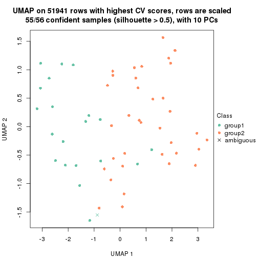</p>

</div>
<div id='tab-CV-NMF-dimension-reduction-2'>
<pre><code class="r">dimension_reduction(res, k = 3, method = &quot;UMAP&quot;)
</code></pre>

<p>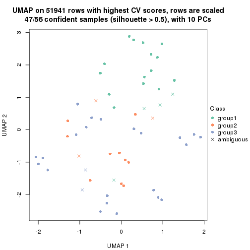</p>

</div>
<div id='tab-CV-NMF-dimension-reduction-3'>
<pre><code class="r">dimension_reduction(res, k = 4, method = &quot;UMAP&quot;)
</code></pre>

<p>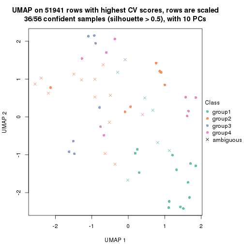</p>

</div>
<div id='tab-CV-NMF-dimension-reduction-4'>
<pre><code class="r">dimension_reduction(res, k = 5, method = &quot;UMAP&quot;)
</code></pre>

<p>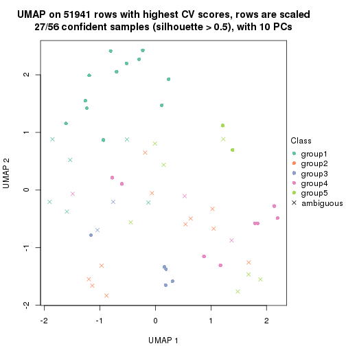</p>

</div>
<div id='tab-CV-NMF-dimension-reduction-5'>
<pre><code class="r">dimension_reduction(res, k = 6, method = &quot;UMAP&quot;)
</code></pre>

<p>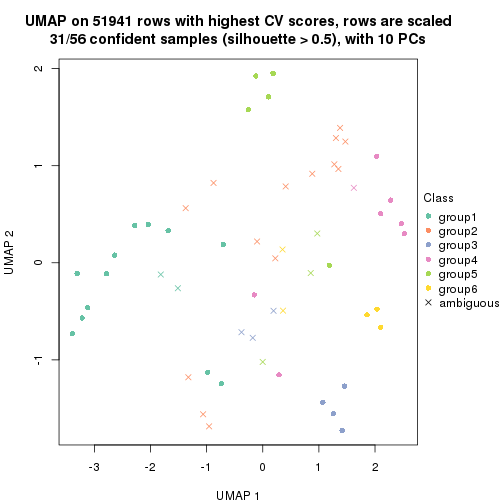</p>

</div>
</div>


Following heatmap shows how subgroups are split when increasing `k`:

```r
collect_classes(res)
```

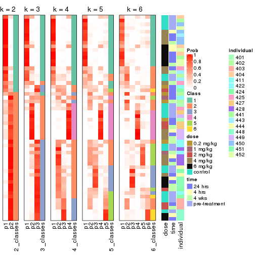


Test correlation between subgroups and known annotations. If the known
annotation is numeric, one-way ANOVA test is applied, and if the known
annotation is discrete, chi-squared contingency table test is applied.

```r
test_to_known_factors(res)
```

```
#>         n dose(p) time(p) individual(p) k
#> CV:NMF 55   0.427   0.711      3.20e-04 2
#> CV:NMF 47   0.390   1.000      5.18e-08 3
#> CV:NMF 36   0.220   1.000      2.14e-08 4
#> CV:NMF 27   0.270   0.983      1.42e-06 5
#> CV:NMF 31   0.102   0.996      1.58e-10 6
```


If matrix rows can be associated to genes, consider to use `functional_enrichment(res,
...)` to perform function enrichment for the signature genes. See [this vignette](http://bioconductor.org/packages/devel/bioc/vignettes/cola/inst/doc/functional_enrichment.html) for more detailed explanations.


 

---------------------------------------------------


### MAD:hclust


The object with results only for a single top-value method and a single partition method 
can be extracted as:

```r
res = res_list["MAD", "hclust"]
# you can also extract it by
# res = res_list["MAD:hclust"]
```

A summary of `res` and all the functions that can be applied to it:

```r
res
```

```
#> A 'ConsensusPartition' object with k = 2, 3, 4, 5, 6.
#>   On a matrix with 51941 rows and 56 columns.
#>   Top rows (1000, 2000, 3000, 4000, 5000) are extracted by 'MAD' method.
#>   Subgroups are detected by 'hclust' method.
#>   Performed in total 1250 partitions by row resampling.
#>   Best k for subgroups seems to be 3.
#> 
#> Following methods can be applied to this 'ConsensusPartition' object:
#>  [1] "cola_report"             "collect_classes"         "collect_plots"          
#>  [4] "collect_stats"           "colnames"                "compare_signatures"     
#>  [7] "consensus_heatmap"       "dimension_reduction"     "functional_enrichment"  
#> [10] "get_anno_col"            "get_anno"                "get_classes"            
#> [13] "get_consensus"           "get_matrix"              "get_membership"         
#> [16] "get_param"               "get_signatures"          "get_stats"              
#> [19] "is_best_k"               "is_stable_k"             "membership_heatmap"     
#> [22] "ncol"                    "nrow"                    "plot_ecdf"              
#> [25] "rownames"                "select_partition_number" "show"                   
#> [28] "suggest_best_k"          "test_to_known_factors"
```

`collect_plots()` function collects all the plots made from `res` for all `k` (number of partitions)
into one single page to provide an easy and fast comparison between different `k`.

```r
collect_plots(res)
```

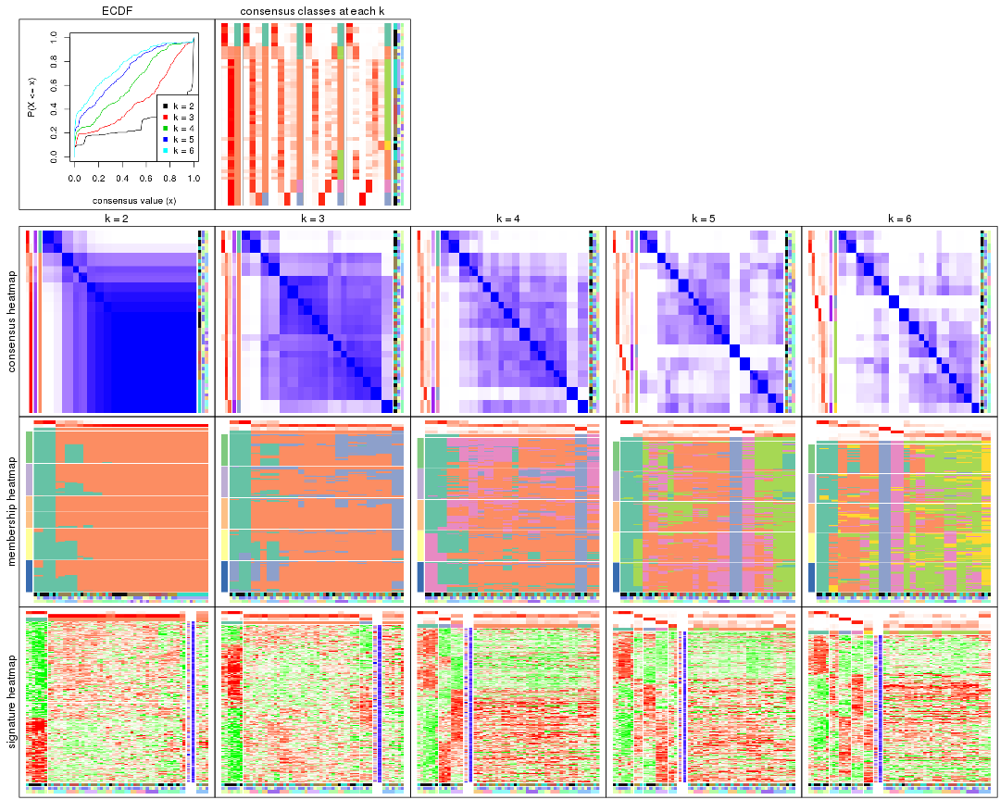

The plots are:

- The first row: a plot of the ECDF (empirical cumulative distribution
  function) curves of the consensus matrix for each `k` and the heatmap of
  predicted classes for each `k`.
- The second row: heatmaps of the consensus matrix for each `k`.
- The third row: heatmaps of the membership matrix for each `k`.
- The fouth row: heatmaps of the signatures for each `k`.

All the plots in panels can be made by individual functions and they are
plotted later in this section.

`select_partition_number()` produces several plots showing different
statistics for choosing "optimized" `k`. There are following statistics:

- ECDF curves of the consensus matrix for each `k`;
- 1-PAC. [The PAC
  score](https://en.wikipedia.org/wiki/Consensus_clustering#Over-interpretation_potential_of_consensus_clustering)
  measures the proportion of the ambiguous subgrouping.
- Mean silhouette score.
- Concordance. The mean probability of fiting the consensus class ids in all
  partitions.
- Area increased. Denote $A_k$ as the area under the ECDF curve for current
  `k`, the area increased is defined as $A_k - A_{k-1}$.
- Rand index. The percent of pairs of samples that are both in a same cluster
  or both are not in a same cluster in the partition of k and k-1.
- Jaccard index. The ratio of pairs of samples are both in a same cluster in
  the partition of k and k-1 and the pairs of samples are both in a same
  cluster in the partition k or k-1.

The detailed explanations of these statistics can be found in [the _cola_
vignette](http://bioconductor.org/packages/devel/bioc/vignettes/cola/inst/doc/cola.html#toc_13).

Generally speaking, lower PAC score, higher mean silhouette score or higher
concordance corresponds to better partition. Rand index and Jaccard index
measure how similar the current partition is compared to partition with `k-1`.
If they are too similar, we won't accept `k` is better than `k-1`.

```r
select_partition_number(res)
```

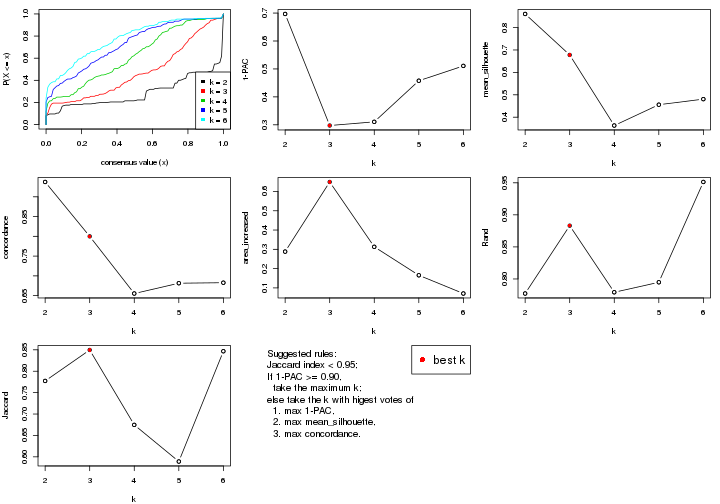

The numeric values for all these statistics can be obtained by `get_stats()`.

```r
get_stats(res)
```

```
#>   k 1-PAC mean_silhouette concordance area_increased  Rand Jaccard
#> 2 2 0.697           0.861       0.938         0.2882 0.777   0.777
#> 3 3 0.297           0.678       0.800         0.6493 0.883   0.850
#> 4 4 0.311           0.363       0.655         0.3130 0.779   0.675
#> 5 5 0.458           0.456       0.681         0.1654 0.795   0.589
#> 6 6 0.511           0.481       0.683         0.0708 0.951   0.847
```

`suggest_best_k()` suggests the best $k$ based on these statistics. The rules are as follows:

- All $k$ with Jaccard index larger than 0.95 are removed because increasing
  $k$ does not provide enough extra information. If all $k$ are removed, it is
  marked as no subgroup is detected.
- For all $k$ with 1-PAC score larger than 0.9, the maximal $k$ is taken as
  the best $k$, and other $k$ are marked as optional $k$.
- If it does not fit the second rule. The $k$ with the maximal vote of the
  highest 1-PAC score, highest mean silhouette, and highest concordance is
  taken as the best $k$.

```r
suggest_best_k(res)
```

```
#> [1] 3
```


Following shows the table of the partitions (You need to click the **show/hide
code output** link to see it). The membership matrix (columns with name `p*`)
is inferred by
[`clue::cl_consensus()`](https://www.rdocumentation.org/link/cl_consensus?package=clue)
function with the `SE` method. Basically the value in the membership matrix
represents the probability to belong to a certain group. The finall class
label for an item is determined with the group with highest probability it
belongs to.

In `get_classes()` function, the entropy is calculated from the membership
matrix and the silhouette score is calculated from the consensus matrix.


<script>
$( function() {
	$( '#tabs-MAD-hclust-get-classes' ).tabs();
} );
</script>
<div id='tabs-MAD-hclust-get-classes'>
<ul>
<li><a href='#tab-MAD-hclust-get-classes-1'>k = 2</a></li>
<li><a href='#tab-MAD-hclust-get-classes-2'>k = 3</a></li>
<li><a href='#tab-MAD-hclust-get-classes-3'>k = 4</a></li>
<li><a href='#tab-MAD-hclust-get-classes-4'>k = 5</a></li>
<li><a href='#tab-MAD-hclust-get-classes-5'>k = 6</a></li>
</ul>

<div id='tab-MAD-hclust-get-classes-1'>
<p><a id='tab-MAD-hclust-get-classes-1-a' style='color:#0366d6' href='#'>show/hide code output</a></p>
<pre><code class="r">cbind(get_classes(res, k = 2), get_membership(res, k = 2))
</code></pre>

<pre><code>#&gt;           class entropy silhouette    p1    p2
#&gt; GSM687644     2  0.0000      0.927 0.000 1.000
#&gt; GSM687648     2  0.1414      0.917 0.020 0.980
#&gt; GSM687653     2  0.0000      0.927 0.000 1.000
#&gt; GSM687658     2  0.7453      0.729 0.212 0.788
#&gt; GSM687663     2  0.0000      0.927 0.000 1.000
#&gt; GSM687668     2  0.0000      0.927 0.000 1.000
#&gt; GSM687673     2  0.0672      0.924 0.008 0.992
#&gt; GSM687678     2  0.3114      0.894 0.056 0.944
#&gt; GSM687683     2  0.0000      0.927 0.000 1.000
#&gt; GSM687688     2  0.0000      0.927 0.000 1.000
#&gt; GSM687695     1  0.0000      0.953 1.000 0.000
#&gt; GSM687699     2  0.8207      0.671 0.256 0.744
#&gt; GSM687704     2  0.0000      0.927 0.000 1.000
#&gt; GSM687707     2  0.0000      0.927 0.000 1.000
#&gt; GSM687712     2  0.0000      0.927 0.000 1.000
#&gt; GSM687719     2  0.9896      0.311 0.440 0.560
#&gt; GSM687724     2  0.0000      0.927 0.000 1.000
#&gt; GSM687728     1  0.4161      0.929 0.916 0.084
#&gt; GSM687646     2  0.0000      0.927 0.000 1.000
#&gt; GSM687649     2  0.1414      0.917 0.020 0.980
#&gt; GSM687665     2  0.0000      0.927 0.000 1.000
#&gt; GSM687651     2  0.1414      0.917 0.020 0.980
#&gt; GSM687667     2  0.0000      0.927 0.000 1.000
#&gt; GSM687670     2  0.0000      0.927 0.000 1.000
#&gt; GSM687671     2  0.0000      0.927 0.000 1.000
#&gt; GSM687654     2  0.0000      0.927 0.000 1.000
#&gt; GSM687675     2  0.0672      0.924 0.008 0.992
#&gt; GSM687685     2  0.0000      0.927 0.000 1.000
#&gt; GSM687656     2  0.0000      0.927 0.000 1.000
#&gt; GSM687677     2  0.0672      0.924 0.008 0.992
#&gt; GSM687687     2  0.0000      0.927 0.000 1.000
#&gt; GSM687692     2  0.0000      0.927 0.000 1.000
#&gt; GSM687716     2  0.0000      0.927 0.000 1.000
#&gt; GSM687722     2  0.9896      0.311 0.440 0.560
#&gt; GSM687680     2  0.3114      0.894 0.056 0.944
#&gt; GSM687690     2  0.0000      0.927 0.000 1.000
#&gt; GSM687700     2  0.8555      0.636 0.280 0.720
#&gt; GSM687705     2  0.0000      0.927 0.000 1.000
#&gt; GSM687714     2  0.0000      0.927 0.000 1.000
#&gt; GSM687721     2  0.9896      0.311 0.440 0.560
#&gt; GSM687682     2  0.3114      0.894 0.056 0.944
#&gt; GSM687694     2  0.0000      0.927 0.000 1.000
#&gt; GSM687702     2  0.8555      0.636 0.280 0.720
#&gt; GSM687718     2  0.0000      0.927 0.000 1.000
#&gt; GSM687723     2  0.9896      0.311 0.440 0.560
#&gt; GSM687661     2  0.7453      0.729 0.212 0.788
#&gt; GSM687710     2  0.0000      0.927 0.000 1.000
#&gt; GSM687726     2  0.0000      0.927 0.000 1.000
#&gt; GSM687730     1  0.4022      0.932 0.920 0.080
#&gt; GSM687660     1  0.0000      0.953 1.000 0.000
#&gt; GSM687697     1  0.0000      0.953 1.000 0.000
#&gt; GSM687709     2  0.0000      0.927 0.000 1.000
#&gt; GSM687725     2  0.0000      0.927 0.000 1.000
#&gt; GSM687729     1  0.0000      0.953 1.000 0.000
#&gt; GSM687727     2  0.0000      0.927 0.000 1.000
#&gt; GSM687731     1  0.4161      0.929 0.916 0.084
</code></pre>

<script>
$('#tab-MAD-hclust-get-classes-1-a').parent().next().next().hide();
$('#tab-MAD-hclust-get-classes-1-a').click(function(){
  $('#tab-MAD-hclust-get-classes-1-a').parent().next().next().toggle();
  return(false);
});
</script>
</div>

<div id='tab-MAD-hclust-get-classes-2'>
<p><a id='tab-MAD-hclust-get-classes-2-a' style='color:#0366d6' href='#'>show/hide code output</a></p>
<pre><code class="r">cbind(get_classes(res, k = 3), get_membership(res, k = 3))
</code></pre>

<pre><code>#&gt;           class entropy silhouette    p1    p2    p3
#&gt; GSM687644     2  0.3619      0.708 0.000 0.864 0.136
#&gt; GSM687648     2  0.1832      0.718 0.008 0.956 0.036
#&gt; GSM687653     2  0.5431      0.597 0.000 0.716 0.284
#&gt; GSM687658     2  0.6007      0.600 0.192 0.764 0.044
#&gt; GSM687663     2  0.4796      0.661 0.000 0.780 0.220
#&gt; GSM687668     2  0.3879      0.702 0.000 0.848 0.152
#&gt; GSM687673     2  0.4465      0.690 0.004 0.820 0.176
#&gt; GSM687678     2  0.3987      0.687 0.020 0.872 0.108
#&gt; GSM687683     2  0.0892      0.720 0.000 0.980 0.020
#&gt; GSM687688     2  0.5650      0.568 0.000 0.688 0.312
#&gt; GSM687695     1  0.0000      0.896 1.000 0.000 0.000
#&gt; GSM687699     2  0.7613      0.475 0.116 0.680 0.204
#&gt; GSM687704     2  0.4974      0.654 0.000 0.764 0.236
#&gt; GSM687707     2  0.2261      0.709 0.000 0.932 0.068
#&gt; GSM687712     2  0.2625      0.710 0.000 0.916 0.084
#&gt; GSM687719     2  0.9437      0.242 0.300 0.492 0.208
#&gt; GSM687724     3  0.4796      1.000 0.000 0.220 0.780
#&gt; GSM687728     1  0.5435      0.857 0.784 0.024 0.192
#&gt; GSM687646     2  0.3619      0.708 0.000 0.864 0.136
#&gt; GSM687649     2  0.1832      0.718 0.008 0.956 0.036
#&gt; GSM687665     2  0.4796      0.661 0.000 0.780 0.220
#&gt; GSM687651     2  0.1832      0.718 0.008 0.956 0.036
#&gt; GSM687667     2  0.4796      0.661 0.000 0.780 0.220
#&gt; GSM687670     2  0.3879      0.702 0.000 0.848 0.152
#&gt; GSM687671     2  0.3879      0.702 0.000 0.848 0.152
#&gt; GSM687654     2  0.5431      0.597 0.000 0.716 0.284
#&gt; GSM687675     2  0.4465      0.690 0.004 0.820 0.176
#&gt; GSM687685     2  0.0892      0.720 0.000 0.980 0.020
#&gt; GSM687656     2  0.5431      0.597 0.000 0.716 0.284
#&gt; GSM687677     2  0.4465      0.690 0.004 0.820 0.176
#&gt; GSM687687     2  0.0892      0.720 0.000 0.980 0.020
#&gt; GSM687692     2  0.5650      0.568 0.000 0.688 0.312
#&gt; GSM687716     2  0.2625      0.710 0.000 0.916 0.084
#&gt; GSM687722     2  0.9437      0.242 0.300 0.492 0.208
#&gt; GSM687680     2  0.3987      0.687 0.020 0.872 0.108
#&gt; GSM687690     2  0.5650      0.568 0.000 0.688 0.312
#&gt; GSM687700     2  0.8098      0.434 0.140 0.644 0.216
#&gt; GSM687705     2  0.4974      0.654 0.000 0.764 0.236
#&gt; GSM687714     2  0.2625      0.710 0.000 0.916 0.084
#&gt; GSM687721     2  0.9437      0.242 0.300 0.492 0.208
#&gt; GSM687682     2  0.3987      0.687 0.020 0.872 0.108
#&gt; GSM687694     2  0.5650      0.568 0.000 0.688 0.312
#&gt; GSM687702     2  0.8098      0.434 0.140 0.644 0.216
#&gt; GSM687718     2  0.2625      0.710 0.000 0.916 0.084
#&gt; GSM687723     2  0.9437      0.242 0.300 0.492 0.208
#&gt; GSM687661     2  0.6007      0.600 0.192 0.764 0.044
#&gt; GSM687710     2  0.2261      0.709 0.000 0.932 0.068
#&gt; GSM687726     3  0.4796      1.000 0.000 0.220 0.780
#&gt; GSM687730     1  0.5331      0.861 0.792 0.024 0.184
#&gt; GSM687660     1  0.0000      0.896 1.000 0.000 0.000
#&gt; GSM687697     1  0.0000      0.896 1.000 0.000 0.000
#&gt; GSM687709     2  0.2261      0.709 0.000 0.932 0.068
#&gt; GSM687725     3  0.4796      1.000 0.000 0.220 0.780
#&gt; GSM687729     1  0.0000      0.896 1.000 0.000 0.000
#&gt; GSM687727     3  0.4796      1.000 0.000 0.220 0.780
#&gt; GSM687731     1  0.5435      0.857 0.784 0.024 0.192
</code></pre>

<script>
$('#tab-MAD-hclust-get-classes-2-a').parent().next().next().hide();
$('#tab-MAD-hclust-get-classes-2-a').click(function(){
  $('#tab-MAD-hclust-get-classes-2-a').parent().next().next().toggle();
  return(false);
});
</script>
</div>

<div id='tab-MAD-hclust-get-classes-3'>
<p><a id='tab-MAD-hclust-get-classes-3-a' style='color:#0366d6' href='#'>show/hide code output</a></p>
<pre><code class="r">cbind(get_classes(res, k = 4), get_membership(res, k = 4))
</code></pre>

<pre><code>#&gt;           class entropy silhouette    p1    p2    p3    p4
#&gt; GSM687644     2   0.519     0.2661 0.000 0.752 0.084 0.164
#&gt; GSM687648     2   0.227     0.2761 0.008 0.916 0.000 0.076
#&gt; GSM687653     2   0.665     0.3551 0.000 0.624 0.176 0.200
#&gt; GSM687658     2   0.573     0.2418 0.200 0.720 0.012 0.068
#&gt; GSM687663     2   0.610     0.3736 0.000 0.680 0.140 0.180
#&gt; GSM687668     2   0.519     0.4063 0.000 0.756 0.096 0.148
#&gt; GSM687673     2   0.592     0.4206 0.012 0.724 0.120 0.144
#&gt; GSM687678     2   0.561     0.0403 0.088 0.712 0.000 0.200
#&gt; GSM687683     2   0.385     0.0657 0.000 0.800 0.008 0.192
#&gt; GSM687688     2   0.742     0.1325 0.000 0.504 0.204 0.292
#&gt; GSM687695     1   0.528     0.5130 0.716 0.000 0.052 0.232
#&gt; GSM687699     2   0.730     0.0660 0.260 0.564 0.008 0.168
#&gt; GSM687704     2   0.677     0.2736 0.000 0.588 0.136 0.276
#&gt; GSM687707     2   0.550    -0.2224 0.000 0.604 0.024 0.372
#&gt; GSM687712     4   0.550     1.0000 0.000 0.468 0.016 0.516
#&gt; GSM687719     1   0.727     0.3422 0.488 0.376 0.004 0.132
#&gt; GSM687724     3   0.164     1.0000 0.000 0.060 0.940 0.000
#&gt; GSM687728     1   0.134     0.5700 0.964 0.008 0.004 0.024
#&gt; GSM687646     2   0.519     0.2661 0.000 0.752 0.084 0.164
#&gt; GSM687649     2   0.227     0.2761 0.008 0.916 0.000 0.076
#&gt; GSM687665     2   0.610     0.3736 0.000 0.680 0.140 0.180
#&gt; GSM687651     2   0.227     0.2761 0.008 0.916 0.000 0.076
#&gt; GSM687667     2   0.610     0.3736 0.000 0.680 0.140 0.180
#&gt; GSM687670     2   0.519     0.4063 0.000 0.756 0.096 0.148
#&gt; GSM687671     2   0.519     0.4063 0.000 0.756 0.096 0.148
#&gt; GSM687654     2   0.665     0.3551 0.000 0.624 0.176 0.200
#&gt; GSM687675     2   0.592     0.4206 0.012 0.724 0.120 0.144
#&gt; GSM687685     2   0.385     0.0657 0.000 0.800 0.008 0.192
#&gt; GSM687656     2   0.665     0.3551 0.000 0.624 0.176 0.200
#&gt; GSM687677     2   0.592     0.4206 0.012 0.724 0.120 0.144
#&gt; GSM687687     2   0.385     0.0657 0.000 0.800 0.008 0.192
#&gt; GSM687692     2   0.742     0.1325 0.000 0.504 0.204 0.292
#&gt; GSM687716     4   0.550     1.0000 0.000 0.468 0.016 0.516
#&gt; GSM687722     1   0.727     0.3422 0.488 0.376 0.004 0.132
#&gt; GSM687680     2   0.561     0.0403 0.088 0.712 0.000 0.200
#&gt; GSM687690     2   0.742     0.1325 0.000 0.504 0.204 0.292
#&gt; GSM687700     2   0.743    -0.0575 0.312 0.524 0.008 0.156
#&gt; GSM687705     2   0.677     0.2736 0.000 0.588 0.136 0.276
#&gt; GSM687714     4   0.550     1.0000 0.000 0.468 0.016 0.516
#&gt; GSM687721     1   0.727     0.3422 0.488 0.376 0.004 0.132
#&gt; GSM687682     2   0.561     0.0403 0.088 0.712 0.000 0.200
#&gt; GSM687694     2   0.742     0.1325 0.000 0.504 0.204 0.292
#&gt; GSM687702     2   0.743    -0.0575 0.312 0.524 0.008 0.156
#&gt; GSM687718     4   0.550     1.0000 0.000 0.468 0.016 0.516
#&gt; GSM687723     1   0.727     0.3422 0.488 0.376 0.004 0.132
#&gt; GSM687661     2   0.573     0.2418 0.200 0.720 0.012 0.068
#&gt; GSM687710     2   0.550    -0.2224 0.000 0.604 0.024 0.372
#&gt; GSM687726     3   0.164     1.0000 0.000 0.060 0.940 0.000
#&gt; GSM687730     1   0.119     0.5690 0.968 0.004 0.004 0.024
#&gt; GSM687660     1   0.528     0.5130 0.716 0.000 0.052 0.232
#&gt; GSM687697     1   0.528     0.5130 0.716 0.000 0.052 0.232
#&gt; GSM687709     2   0.550    -0.2224 0.000 0.604 0.024 0.372
#&gt; GSM687725     3   0.164     1.0000 0.000 0.060 0.940 0.000
#&gt; GSM687729     1   0.521     0.5139 0.724 0.000 0.052 0.224
#&gt; GSM687727     3   0.164     1.0000 0.000 0.060 0.940 0.000
#&gt; GSM687731     1   0.134     0.5700 0.964 0.008 0.004 0.024
</code></pre>

<script>
$('#tab-MAD-hclust-get-classes-3-a').parent().next().next().hide();
$('#tab-MAD-hclust-get-classes-3-a').click(function(){
  $('#tab-MAD-hclust-get-classes-3-a').parent().next().next().toggle();
  return(false);
});
</script>
</div>

<div id='tab-MAD-hclust-get-classes-4'>
<p><a id='tab-MAD-hclust-get-classes-4-a' style='color:#0366d6' href='#'>show/hide code output</a></p>
<pre><code class="r">cbind(get_classes(res, k = 5), get_membership(res, k = 5))
</code></pre>

<pre><code>#&gt;           class entropy silhouette    p1    p2    p3    p4    p5
#&gt; GSM687644     2  0.6079     0.3639 0.000 0.592 0.004 0.208 0.196
#&gt; GSM687648     5  0.6526     0.0629 0.000 0.388 0.004 0.168 0.440
#&gt; GSM687653     2  0.3732     0.4449 0.000 0.812 0.008 0.148 0.032
#&gt; GSM687658     2  0.7645    -0.1125 0.176 0.388 0.000 0.072 0.364
#&gt; GSM687663     2  0.3956     0.5196 0.000 0.820 0.016 0.096 0.068
#&gt; GSM687668     2  0.4891     0.4825 0.000 0.716 0.000 0.112 0.172
#&gt; GSM687673     2  0.4359     0.4920 0.004 0.756 0.000 0.052 0.188
#&gt; GSM687678     5  0.6472     0.2378 0.004 0.184 0.000 0.308 0.504
#&gt; GSM687683     2  0.6893     0.1243 0.000 0.396 0.004 0.324 0.276
#&gt; GSM687688     2  0.5897     0.0411 0.000 0.500 0.036 0.428 0.036
#&gt; GSM687695     1  0.0451     0.8100 0.988 0.000 0.004 0.000 0.008
#&gt; GSM687699     5  0.2917     0.5311 0.012 0.076 0.004 0.024 0.884
#&gt; GSM687704     2  0.3972     0.4147 0.000 0.764 0.016 0.212 0.008
#&gt; GSM687707     2  0.6657     0.1311 0.000 0.476 0.032 0.384 0.108
#&gt; GSM687712     4  0.2712     1.0000 0.000 0.088 0.000 0.880 0.032
#&gt; GSM687719     5  0.4691     0.3799 0.204 0.036 0.004 0.016 0.740
#&gt; GSM687724     3  0.1121     1.0000 0.000 0.044 0.956 0.000 0.000
#&gt; GSM687728     1  0.4101     0.7336 0.664 0.000 0.004 0.000 0.332
#&gt; GSM687646     2  0.6079     0.3639 0.000 0.592 0.004 0.208 0.196
#&gt; GSM687649     5  0.6526     0.0629 0.000 0.388 0.004 0.168 0.440
#&gt; GSM687665     2  0.3956     0.5196 0.000 0.820 0.016 0.096 0.068
#&gt; GSM687651     5  0.6526     0.0629 0.000 0.388 0.004 0.168 0.440
#&gt; GSM687667     2  0.3956     0.5196 0.000 0.820 0.016 0.096 0.068
#&gt; GSM687670     2  0.4891     0.4825 0.000 0.716 0.000 0.112 0.172
#&gt; GSM687671     2  0.4891     0.4825 0.000 0.716 0.000 0.112 0.172
#&gt; GSM687654     2  0.3732     0.4449 0.000 0.812 0.008 0.148 0.032
#&gt; GSM687675     2  0.4359     0.4920 0.004 0.756 0.000 0.052 0.188
#&gt; GSM687685     2  0.6893     0.1243 0.000 0.396 0.004 0.324 0.276
#&gt; GSM687656     2  0.3732     0.4449 0.000 0.812 0.008 0.148 0.032
#&gt; GSM687677     2  0.4359     0.4920 0.004 0.756 0.000 0.052 0.188
#&gt; GSM687687     2  0.6893     0.1243 0.000 0.396 0.004 0.324 0.276
#&gt; GSM687692     2  0.5897     0.0411 0.000 0.500 0.036 0.428 0.036
#&gt; GSM687716     4  0.2712     1.0000 0.000 0.088 0.000 0.880 0.032
#&gt; GSM687722     5  0.4691     0.3799 0.204 0.036 0.004 0.016 0.740
#&gt; GSM687680     5  0.6472     0.2378 0.004 0.184 0.000 0.308 0.504
#&gt; GSM687690     2  0.5897     0.0411 0.000 0.500 0.036 0.428 0.036
#&gt; GSM687700     5  0.2086     0.5224 0.020 0.048 0.000 0.008 0.924
#&gt; GSM687705     2  0.3972     0.4147 0.000 0.764 0.016 0.212 0.008
#&gt; GSM687714     4  0.2712     1.0000 0.000 0.088 0.000 0.880 0.032
#&gt; GSM687721     5  0.4691     0.3799 0.204 0.036 0.004 0.016 0.740
#&gt; GSM687682     5  0.6472     0.2378 0.004 0.184 0.000 0.308 0.504
#&gt; GSM687694     2  0.5897     0.0411 0.000 0.500 0.036 0.428 0.036
#&gt; GSM687702     5  0.2086     0.5224 0.020 0.048 0.000 0.008 0.924
#&gt; GSM687718     4  0.2712     1.0000 0.000 0.088 0.000 0.880 0.032
#&gt; GSM687723     5  0.4691     0.3799 0.204 0.036 0.004 0.016 0.740
#&gt; GSM687661     2  0.7645    -0.1125 0.176 0.388 0.000 0.072 0.364
#&gt; GSM687710     2  0.6657     0.1311 0.000 0.476 0.032 0.384 0.108
#&gt; GSM687726     3  0.1121     1.0000 0.000 0.044 0.956 0.000 0.000
#&gt; GSM687730     1  0.3913     0.7395 0.676 0.000 0.000 0.000 0.324
#&gt; GSM687660     1  0.0451     0.8100 0.988 0.000 0.004 0.000 0.008
#&gt; GSM687697     1  0.0451     0.8100 0.988 0.000 0.004 0.000 0.008
#&gt; GSM687709     2  0.6657     0.1311 0.000 0.476 0.032 0.384 0.108
#&gt; GSM687725     3  0.1121     1.0000 0.000 0.044 0.956 0.000 0.000
#&gt; GSM687729     1  0.0609     0.8093 0.980 0.000 0.000 0.000 0.020
#&gt; GSM687727     3  0.1121     1.0000 0.000 0.044 0.956 0.000 0.000
#&gt; GSM687731     1  0.4101     0.7336 0.664 0.000 0.004 0.000 0.332
</code></pre>

<script>
$('#tab-MAD-hclust-get-classes-4-a').parent().next().next().hide();
$('#tab-MAD-hclust-get-classes-4-a').click(function(){
  $('#tab-MAD-hclust-get-classes-4-a').parent().next().next().toggle();
  return(false);
});
</script>
</div>

<div id='tab-MAD-hclust-get-classes-5'>
<p><a id='tab-MAD-hclust-get-classes-5-a' style='color:#0366d6' href='#'>show/hide code output</a></p>
<pre><code class="r">cbind(get_classes(res, k = 6), get_membership(res, k = 6))
</code></pre>

<pre><code>#&gt;           class entropy silhouette    p1    p2    p3    p4    p5    p6
#&gt; GSM687644     5  0.7204     0.2551 0.000 0.200 0.000 0.156 0.448 0.196
#&gt; GSM687648     2  0.6737     0.2386 0.000 0.424 0.000 0.112 0.364 0.100
#&gt; GSM687653     5  0.5306     0.3291 0.000 0.016 0.000 0.116 0.628 0.240
#&gt; GSM687658     5  0.6908    -0.1541 0.168 0.304 0.000 0.036 0.464 0.028
#&gt; GSM687663     5  0.4548     0.3812 0.000 0.028 0.004 0.068 0.744 0.156
#&gt; GSM687668     5  0.3779     0.4231 0.000 0.092 0.000 0.076 0.808 0.024
#&gt; GSM687673     5  0.3701     0.4131 0.004 0.104 0.000 0.020 0.816 0.056
#&gt; GSM687678     2  0.6253     0.3567 0.000 0.512 0.000 0.300 0.144 0.044
#&gt; GSM687683     5  0.6918    -0.0042 0.000 0.216 0.000 0.280 0.432 0.072
#&gt; GSM687688     5  0.6111     0.1037 0.000 0.004 0.020 0.372 0.468 0.136
#&gt; GSM687695     1  0.0363     0.7819 0.988 0.012 0.000 0.000 0.000 0.000
#&gt; GSM687699     2  0.3422     0.5101 0.004 0.832 0.004 0.004 0.096 0.060
#&gt; GSM687704     5  0.5436     0.2927 0.000 0.000 0.004 0.208 0.596 0.192
#&gt; GSM687707     6  0.5024     1.0000 0.000 0.020 0.000 0.104 0.200 0.676
#&gt; GSM687712     4  0.0713     1.0000 0.000 0.000 0.000 0.972 0.028 0.000
#&gt; GSM687719     2  0.4648     0.3863 0.188 0.728 0.004 0.004 0.052 0.024
#&gt; GSM687724     3  0.0146     1.0000 0.000 0.000 0.996 0.000 0.004 0.000
#&gt; GSM687728     1  0.5464     0.6899 0.572 0.312 0.004 0.008 0.000 0.104
#&gt; GSM687646     5  0.7204     0.2551 0.000 0.200 0.000 0.156 0.448 0.196
#&gt; GSM687649     2  0.6737     0.2386 0.000 0.424 0.000 0.112 0.364 0.100
#&gt; GSM687665     5  0.4548     0.3812 0.000 0.028 0.004 0.068 0.744 0.156
#&gt; GSM687651     2  0.6737     0.2386 0.000 0.424 0.000 0.112 0.364 0.100
#&gt; GSM687667     5  0.4548     0.3812 0.000 0.028 0.004 0.068 0.744 0.156
#&gt; GSM687670     5  0.3779     0.4231 0.000 0.092 0.000 0.076 0.808 0.024
#&gt; GSM687671     5  0.3779     0.4231 0.000 0.092 0.000 0.076 0.808 0.024
#&gt; GSM687654     5  0.5306     0.3291 0.000 0.016 0.000 0.116 0.628 0.240
#&gt; GSM687675     5  0.3701     0.4131 0.004 0.104 0.000 0.020 0.816 0.056
#&gt; GSM687685     5  0.6918    -0.0042 0.000 0.216 0.000 0.280 0.432 0.072
#&gt; GSM687656     5  0.5306     0.3291 0.000 0.016 0.000 0.116 0.628 0.240
#&gt; GSM687677     5  0.3701     0.4131 0.004 0.104 0.000 0.020 0.816 0.056
#&gt; GSM687687     5  0.6918    -0.0042 0.000 0.216 0.000 0.280 0.432 0.072
#&gt; GSM687692     5  0.6111     0.1037 0.000 0.004 0.020 0.372 0.468 0.136
#&gt; GSM687716     4  0.0713     1.0000 0.000 0.000 0.000 0.972 0.028 0.000
#&gt; GSM687722     2  0.4648     0.3863 0.188 0.728 0.004 0.004 0.052 0.024
#&gt; GSM687680     2  0.6253     0.3567 0.000 0.512 0.000 0.300 0.144 0.044
#&gt; GSM687690     5  0.6111     0.1037 0.000 0.004 0.020 0.372 0.468 0.136
#&gt; GSM687700     2  0.2053     0.5205 0.004 0.916 0.004 0.000 0.052 0.024
#&gt; GSM687705     5  0.5436     0.2927 0.000 0.000 0.004 0.208 0.596 0.192
#&gt; GSM687714     4  0.0713     1.0000 0.000 0.000 0.000 0.972 0.028 0.000
#&gt; GSM687721     2  0.4648     0.3863 0.188 0.728 0.004 0.004 0.052 0.024
#&gt; GSM687682     2  0.6253     0.3567 0.000 0.512 0.000 0.300 0.144 0.044
#&gt; GSM687694     5  0.6111     0.1037 0.000 0.004 0.020 0.372 0.468 0.136
#&gt; GSM687702     2  0.2053     0.5205 0.004 0.916 0.004 0.000 0.052 0.024
#&gt; GSM687718     4  0.0713     1.0000 0.000 0.000 0.000 0.972 0.028 0.000
#&gt; GSM687723     2  0.4648     0.3863 0.188 0.728 0.004 0.004 0.052 0.024
#&gt; GSM687661     5  0.6908    -0.1541 0.168 0.304 0.000 0.036 0.464 0.028
#&gt; GSM687710     6  0.5024     1.0000 0.000 0.020 0.000 0.104 0.200 0.676
#&gt; GSM687726     3  0.0146     1.0000 0.000 0.000 0.996 0.000 0.004 0.000
#&gt; GSM687730     1  0.5357     0.6981 0.588 0.304 0.004 0.008 0.000 0.096
#&gt; GSM687660     1  0.0363     0.7819 0.988 0.012 0.000 0.000 0.000 0.000
#&gt; GSM687697     1  0.0363     0.7819 0.988 0.012 0.000 0.000 0.000 0.000
#&gt; GSM687709     6  0.5024     1.0000 0.000 0.020 0.000 0.104 0.200 0.676
#&gt; GSM687725     3  0.0146     1.0000 0.000 0.000 0.996 0.000 0.004 0.000
#&gt; GSM687729     1  0.1498     0.7803 0.940 0.028 0.000 0.000 0.000 0.032
#&gt; GSM687727     3  0.0146     1.0000 0.000 0.000 0.996 0.000 0.004 0.000
#&gt; GSM687731     1  0.5464     0.6899 0.572 0.312 0.004 0.008 0.000 0.104
</code></pre>

<script>
$('#tab-MAD-hclust-get-classes-5-a').parent().next().next().hide();
$('#tab-MAD-hclust-get-classes-5-a').click(function(){
  $('#tab-MAD-hclust-get-classes-5-a').parent().next().next().toggle();
  return(false);
});
</script>
</div>
</div>

Heatmaps for the consensus matrix. It visualizes the probability of two
samples to be in a same group.


<script>
$( function() {
	$( '#tabs-MAD-hclust-consensus-heatmap' ).tabs();
} );
</script>
<div id='tabs-MAD-hclust-consensus-heatmap'>
<ul>
<li><a href='#tab-MAD-hclust-consensus-heatmap-1'>k = 2</a></li>
<li><a href='#tab-MAD-hclust-consensus-heatmap-2'>k = 3</a></li>
<li><a href='#tab-MAD-hclust-consensus-heatmap-3'>k = 4</a></li>
<li><a href='#tab-MAD-hclust-consensus-heatmap-4'>k = 5</a></li>
<li><a href='#tab-MAD-hclust-consensus-heatmap-5'>k = 6</a></li>
</ul>
<div id='tab-MAD-hclust-consensus-heatmap-1'>
<pre><code class="r">consensus_heatmap(res, k = 2)
</code></pre>

<p>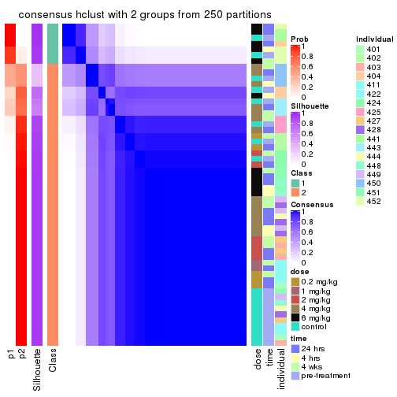</p>

</div>
<div id='tab-MAD-hclust-consensus-heatmap-2'>
<pre><code class="r">consensus_heatmap(res, k = 3)
</code></pre>

<p>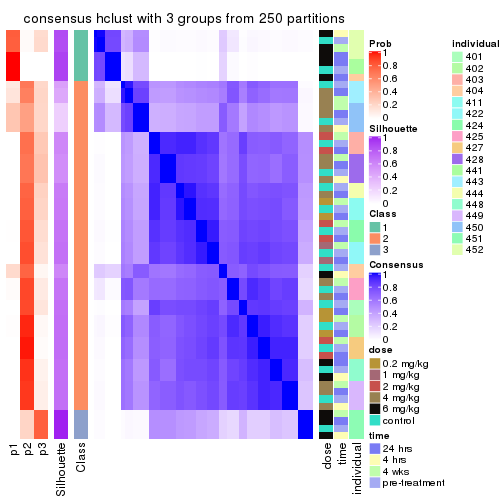</p>

</div>
<div id='tab-MAD-hclust-consensus-heatmap-3'>
<pre><code class="r">consensus_heatmap(res, k = 4)
</code></pre>

<p>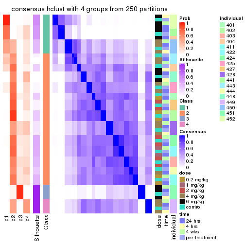</p>

</div>
<div id='tab-MAD-hclust-consensus-heatmap-4'>
<pre><code class="r">consensus_heatmap(res, k = 5)
</code></pre>

<p>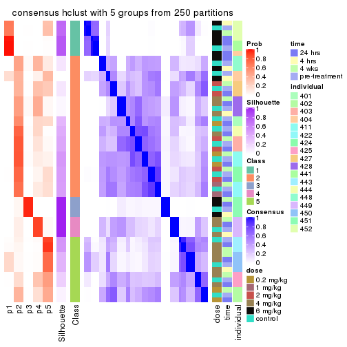</p>

</div>
<div id='tab-MAD-hclust-consensus-heatmap-5'>
<pre><code class="r">consensus_heatmap(res, k = 6)
</code></pre>

<p>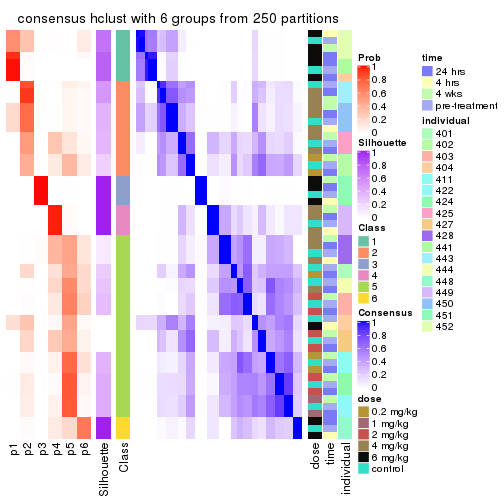</p>

</div>
</div>

Heatmaps for the membership of samples in all partitions to see how consistent they are:


<script>
$( function() {
	$( '#tabs-MAD-hclust-membership-heatmap' ).tabs();
} );
</script>
<div id='tabs-MAD-hclust-membership-heatmap'>
<ul>
<li><a href='#tab-MAD-hclust-membership-heatmap-1'>k = 2</a></li>
<li><a href='#tab-MAD-hclust-membership-heatmap-2'>k = 3</a></li>
<li><a href='#tab-MAD-hclust-membership-heatmap-3'>k = 4</a></li>
<li><a href='#tab-MAD-hclust-membership-heatmap-4'>k = 5</a></li>
<li><a href='#tab-MAD-hclust-membership-heatmap-5'>k = 6</a></li>
</ul>
<div id='tab-MAD-hclust-membership-heatmap-1'>
<pre><code class="r">membership_heatmap(res, k = 2)
</code></pre>

<p>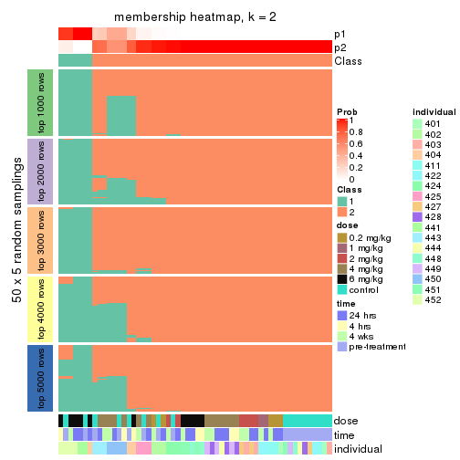</p>

</div>
<div id='tab-MAD-hclust-membership-heatmap-2'>
<pre><code class="r">membership_heatmap(res, k = 3)
</code></pre>

<p>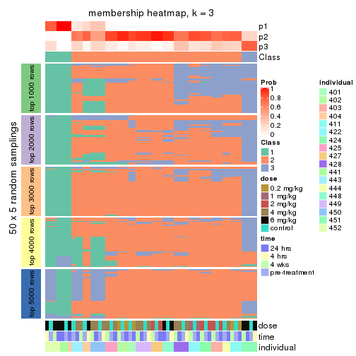</p>

</div>
<div id='tab-MAD-hclust-membership-heatmap-3'>
<pre><code class="r">membership_heatmap(res, k = 4)
</code></pre>

<p>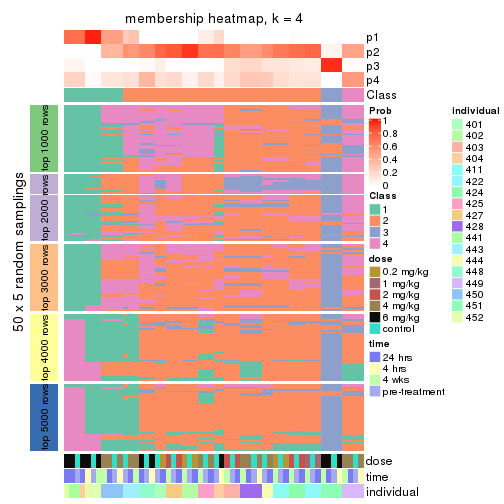</p>

</div>
<div id='tab-MAD-hclust-membership-heatmap-4'>
<pre><code class="r">membership_heatmap(res, k = 5)
</code></pre>

<p>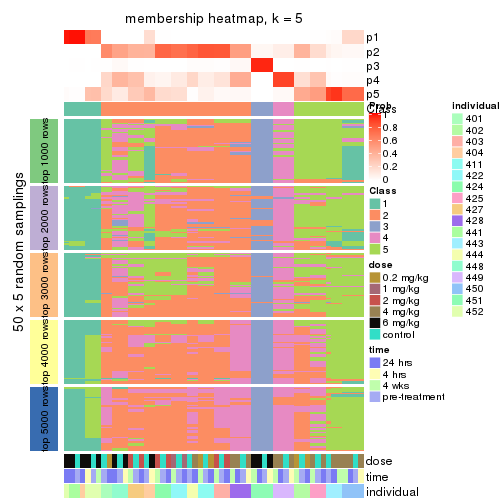</p>

</div>
<div id='tab-MAD-hclust-membership-heatmap-5'>
<pre><code class="r">membership_heatmap(res, k = 6)
</code></pre>

<p>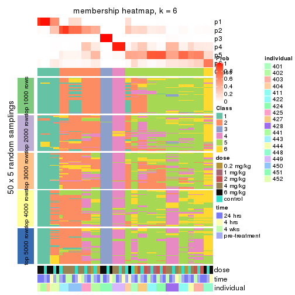</p>

</div>
</div>

As soon as we have had the classes for columns, we can look for signatures
which are significantly different between classes which can be candidate marks
for certain classes. Following are the heatmaps for signatures.


Signature heatmaps where rows are scaled:


<script>
$( function() {
	$( '#tabs-MAD-hclust-get-signatures' ).tabs();
} );
</script>
<div id='tabs-MAD-hclust-get-signatures'>
<ul>
<li><a href='#tab-MAD-hclust-get-signatures-1'>k = 2</a></li>
<li><a href='#tab-MAD-hclust-get-signatures-2'>k = 3</a></li>
<li><a href='#tab-MAD-hclust-get-signatures-3'>k = 4</a></li>
<li><a href='#tab-MAD-hclust-get-signatures-4'>k = 5</a></li>
<li><a href='#tab-MAD-hclust-get-signatures-5'>k = 6</a></li>
</ul>
<div id='tab-MAD-hclust-get-signatures-1'>
<pre><code class="r">get_signatures(res, k = 2)
</code></pre>

<p>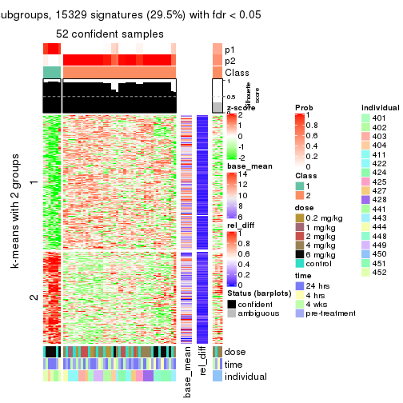</p>

</div>
<div id='tab-MAD-hclust-get-signatures-2'>
<pre><code class="r">get_signatures(res, k = 3)
</code></pre>

<p>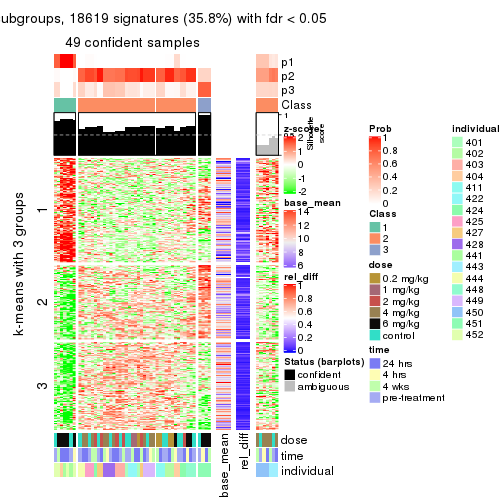</p>

</div>
<div id='tab-MAD-hclust-get-signatures-3'>
<pre><code class="r">get_signatures(res, k = 4)
</code></pre>

<p>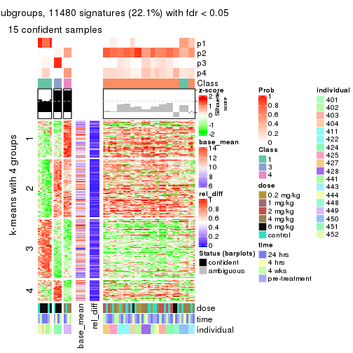</p>

</div>
<div id='tab-MAD-hclust-get-signatures-4'>
<pre><code class="r">get_signatures(res, k = 5)
</code></pre>

<p>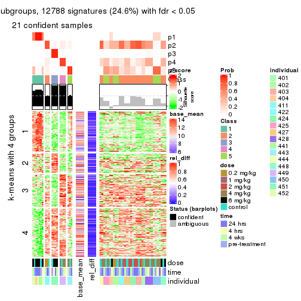</p>

</div>
<div id='tab-MAD-hclust-get-signatures-5'>
<pre><code class="r">get_signatures(res, k = 6)
</code></pre>

<p>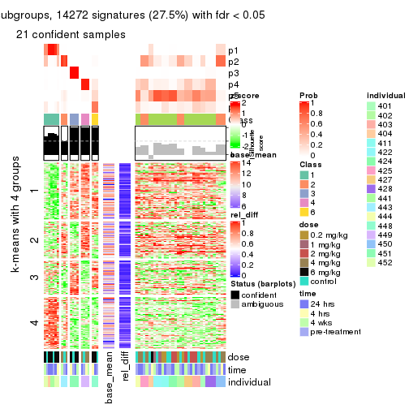</p>

</div>
</div>


Signature heatmaps where rows are not scaled:


<script>
$( function() {
	$( '#tabs-MAD-hclust-get-signatures-no-scale' ).tabs();
} );
</script>
<div id='tabs-MAD-hclust-get-signatures-no-scale'>
<ul>
<li><a href='#tab-MAD-hclust-get-signatures-no-scale-1'>k = 2</a></li>
<li><a href='#tab-MAD-hclust-get-signatures-no-scale-2'>k = 3</a></li>
<li><a href='#tab-MAD-hclust-get-signatures-no-scale-3'>k = 4</a></li>
<li><a href='#tab-MAD-hclust-get-signatures-no-scale-4'>k = 5</a></li>
<li><a href='#tab-MAD-hclust-get-signatures-no-scale-5'>k = 6</a></li>
</ul>
<div id='tab-MAD-hclust-get-signatures-no-scale-1'>
<pre><code class="r">get_signatures(res, k = 2, scale_rows = FALSE)
</code></pre>

<p>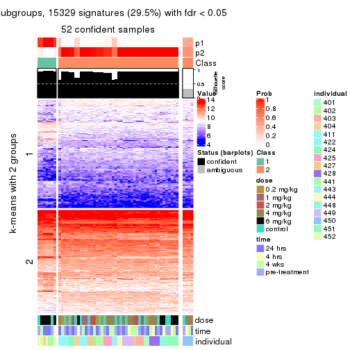</p>

</div>
<div id='tab-MAD-hclust-get-signatures-no-scale-2'>
<pre><code class="r">get_signatures(res, k = 3, scale_rows = FALSE)
</code></pre>

<p>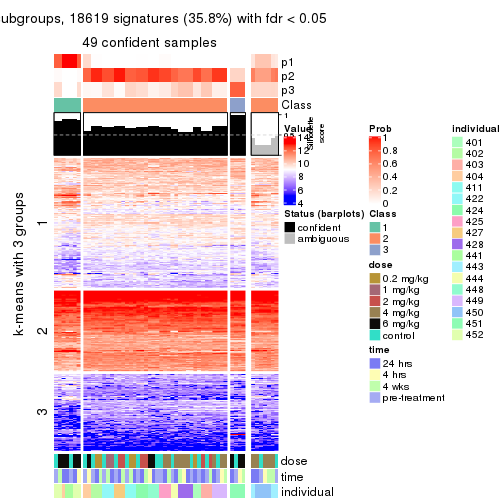</p>

</div>
<div id='tab-MAD-hclust-get-signatures-no-scale-3'>
<pre><code class="r">get_signatures(res, k = 4, scale_rows = FALSE)
</code></pre>

<p>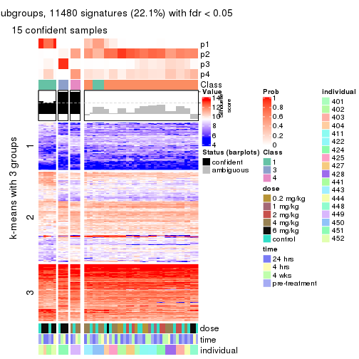</p>

</div>
<div id='tab-MAD-hclust-get-signatures-no-scale-4'>
<pre><code class="r">get_signatures(res, k = 5, scale_rows = FALSE)
</code></pre>

<p>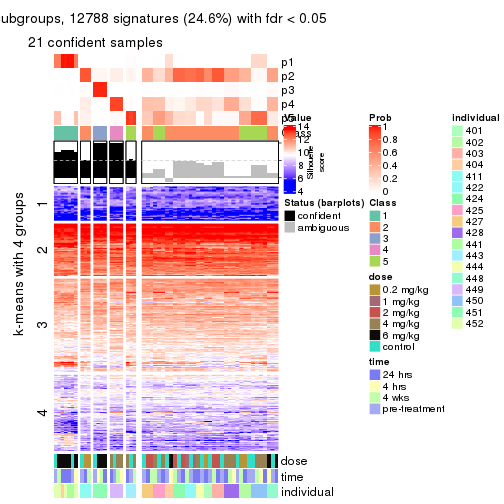</p>

</div>
<div id='tab-MAD-hclust-get-signatures-no-scale-5'>
<pre><code class="r">get_signatures(res, k = 6, scale_rows = FALSE)
</code></pre>

<p>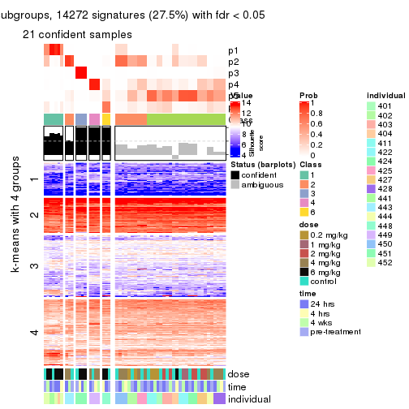</p>

</div>
</div>


Compare the overlap of signatures from different k:

```r
compare_signatures(res)
```

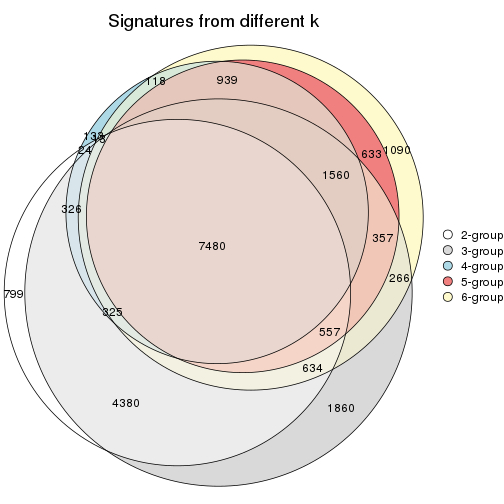

`get_signature()` returns a data frame invisibly. TO get the list of signatures, the function
call should be assigned to a variable explicitly. In following code, if `plot` argument is set
to `FALSE`, no heatmap is plotted while only the differential analysis is performed.

```r
# code only for demonstration
tb = get_signature(res, k = ..., plot = FALSE)
```

An example of the output of `tb` is:

```
#>   which_row         fdr    mean_1    mean_2 scaled_mean_1 scaled_mean_2 km
#> 1        38 0.042760348  8.373488  9.131774    -0.5533452     0.5164555  1
#> 2        40 0.018707592  7.106213  8.469186    -0.6173731     0.5762149  1
#> 3        55 0.019134737 10.221463 11.207825    -0.6159697     0.5749050  1
#> 4        59 0.006059896  5.921854  7.869574    -0.6899429     0.6439467  1
#> 5        60 0.018055526  8.928898 10.211722    -0.6204761     0.5791110  1
#> 6        98 0.009384629 15.714769 14.887706     0.6635654    -0.6193277  2
...
```

The columns in `tb` are:

1. `which_row`: row indices corresponding to the input matrix.
2. `fdr`: FDR for the differential test. 
3. `mean_x`: The mean value in group x.
4. `scaled_mean_x`: The mean value in group x after rows are scaled.
5. `km`: Row groups if k-means clustering is applied to rows.


UMAP plot which shows how samples are separated.


<script>
$( function() {
	$( '#tabs-MAD-hclust-dimension-reduction' ).tabs();
} );
</script>
<div id='tabs-MAD-hclust-dimension-reduction'>
<ul>
<li><a href='#tab-MAD-hclust-dimension-reduction-1'>k = 2</a></li>
<li><a href='#tab-MAD-hclust-dimension-reduction-2'>k = 3</a></li>
<li><a href='#tab-MAD-hclust-dimension-reduction-3'>k = 4</a></li>
<li><a href='#tab-MAD-hclust-dimension-reduction-4'>k = 5</a></li>
<li><a href='#tab-MAD-hclust-dimension-reduction-5'>k = 6</a></li>
</ul>
<div id='tab-MAD-hclust-dimension-reduction-1'>
<pre><code class="r">dimension_reduction(res, k = 2, method = &quot;UMAP&quot;)
</code></pre>

<p>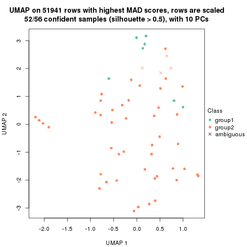</p>

</div>
<div id='tab-MAD-hclust-dimension-reduction-2'>
<pre><code class="r">dimension_reduction(res, k = 3, method = &quot;UMAP&quot;)
</code></pre>

<p>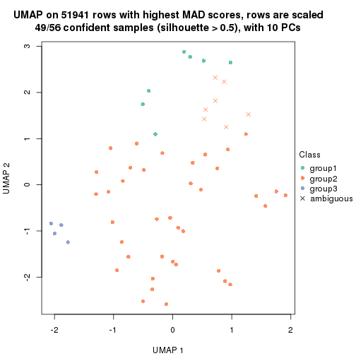</p>

</div>
<div id='tab-MAD-hclust-dimension-reduction-3'>
<pre><code class="r">dimension_reduction(res, k = 4, method = &quot;UMAP&quot;)
</code></pre>

<p>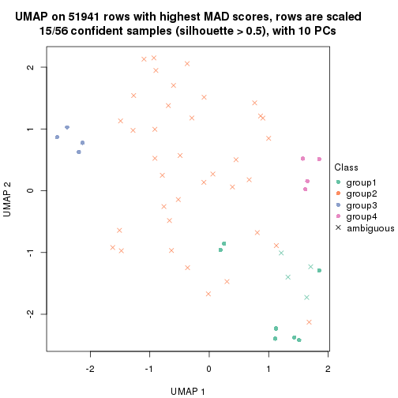</p>

</div>
<div id='tab-MAD-hclust-dimension-reduction-4'>
<pre><code class="r">dimension_reduction(res, k = 5, method = &quot;UMAP&quot;)
</code></pre>

<p>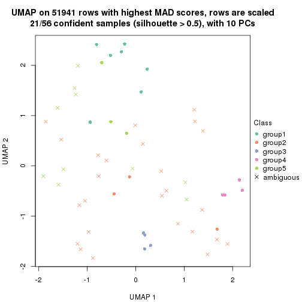</p>

</div>
<div id='tab-MAD-hclust-dimension-reduction-5'>
<pre><code class="r">dimension_reduction(res, k = 6, method = &quot;UMAP&quot;)
</code></pre>

<p>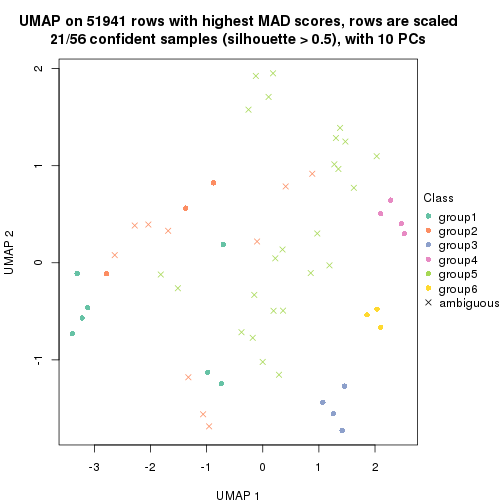</p>

</div>
</div>


Following heatmap shows how subgroups are split when increasing `k`:

```r
collect_classes(res)
```

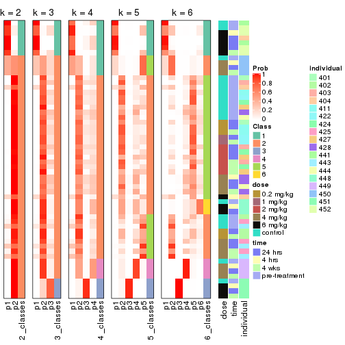


Test correlation between subgroups and known annotations. If the known
annotation is numeric, one-way ANOVA test is applied, and if the known
annotation is discrete, chi-squared contingency table test is applied.

```r
test_to_known_factors(res)
```

```
#>             n dose(p) time(p) individual(p) k
#> MAD:hclust 52 0.01958   0.891      8.82e-05 2
#> MAD:hclust 49 0.01279   0.970      2.76e-08 3
#> MAD:hclust 15 0.02458   0.992      2.11e-04 4
#> MAD:hclust 21 0.00342   0.998      1.39e-08 5
#> MAD:hclust 21 0.05614   0.997      1.39e-08 6
```


If matrix rows can be associated to genes, consider to use `functional_enrichment(res,
...)` to perform function enrichment for the signature genes. See [this vignette](http://bioconductor.org/packages/devel/bioc/vignettes/cola/inst/doc/functional_enrichment.html) for more detailed explanations.


 

---------------------------------------------------


### MAD:kmeans


The object with results only for a single top-value method and a single partition method 
can be extracted as:

```r
res = res_list["MAD", "kmeans"]
# you can also extract it by
# res = res_list["MAD:kmeans"]
```

A summary of `res` and all the functions that can be applied to it:

```r
res
```

```
#> A 'ConsensusPartition' object with k = 2, 3, 4, 5, 6.
#>   On a matrix with 51941 rows and 56 columns.
#>   Top rows (1000, 2000, 3000, 4000, 5000) are extracted by 'MAD' method.
#>   Subgroups are detected by 'kmeans' method.
#>   Performed in total 1250 partitions by row resampling.
#>   Best k for subgroups seems to be 2.
#> 
#> Following methods can be applied to this 'ConsensusPartition' object:
#>  [1] "cola_report"             "collect_classes"         "collect_plots"          
#>  [4] "collect_stats"           "colnames"                "compare_signatures"     
#>  [7] "consensus_heatmap"       "dimension_reduction"     "functional_enrichment"  
#> [10] "get_anno_col"            "get_anno"                "get_classes"            
#> [13] "get_consensus"           "get_matrix"              "get_membership"         
#> [16] "get_param"               "get_signatures"          "get_stats"              
#> [19] "is_best_k"               "is_stable_k"             "membership_heatmap"     
#> [22] "ncol"                    "nrow"                    "plot_ecdf"              
#> [25] "rownames"                "select_partition_number" "show"                   
#> [28] "suggest_best_k"          "test_to_known_factors"
```

`collect_plots()` function collects all the plots made from `res` for all `k` (number of partitions)
into one single page to provide an easy and fast comparison between different `k`.

```r
collect_plots(res)
```

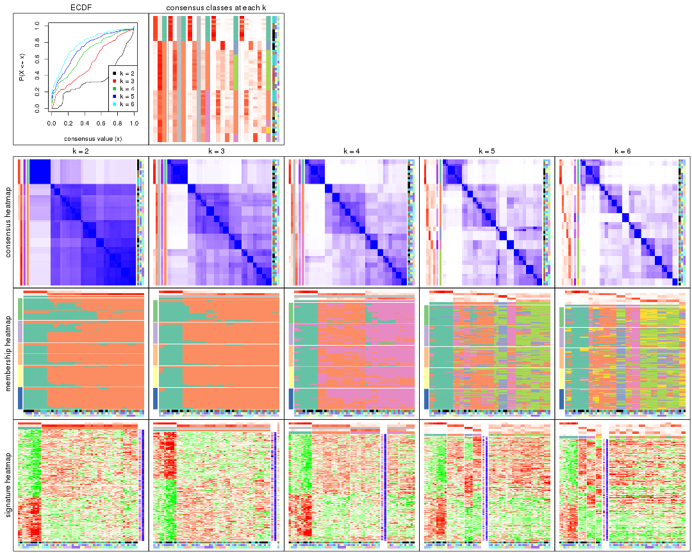

The plots are:

- The first row: a plot of the ECDF (empirical cumulative distribution
  function) curves of the consensus matrix for each `k` and the heatmap of
  predicted classes for each `k`.
- The second row: heatmaps of the consensus matrix for each `k`.
- The third row: heatmaps of the membership matrix for each `k`.
- The fouth row: heatmaps of the signatures for each `k`.

All the plots in panels can be made by individual functions and they are
plotted later in this section.

`select_partition_number()` produces several plots showing different
statistics for choosing "optimized" `k`. There are following statistics:

- ECDF curves of the consensus matrix for each `k`;
- 1-PAC. [The PAC
  score](https://en.wikipedia.org/wiki/Consensus_clustering#Over-interpretation_potential_of_consensus_clustering)
  measures the proportion of the ambiguous subgrouping.
- Mean silhouette score.
- Concordance. The mean probability of fiting the consensus class ids in all
  partitions.
- Area increased. Denote $A_k$ as the area under the ECDF curve for current
  `k`, the area increased is defined as $A_k - A_{k-1}$.
- Rand index. The percent of pairs of samples that are both in a same cluster
  or both are not in a same cluster in the partition of k and k-1.
- Jaccard index. The ratio of pairs of samples are both in a same cluster in
  the partition of k and k-1 and the pairs of samples are both in a same
  cluster in the partition k or k-1.

The detailed explanations of these statistics can be found in [the _cola_
vignette](http://bioconductor.org/packages/devel/bioc/vignettes/cola/inst/doc/cola.html#toc_13).

Generally speaking, lower PAC score, higher mean silhouette score or higher
concordance corresponds to better partition. Rand index and Jaccard index
measure how similar the current partition is compared to partition with `k-1`.
If they are too similar, we won't accept `k` is better than `k-1`.

```r
select_partition_number(res)
```

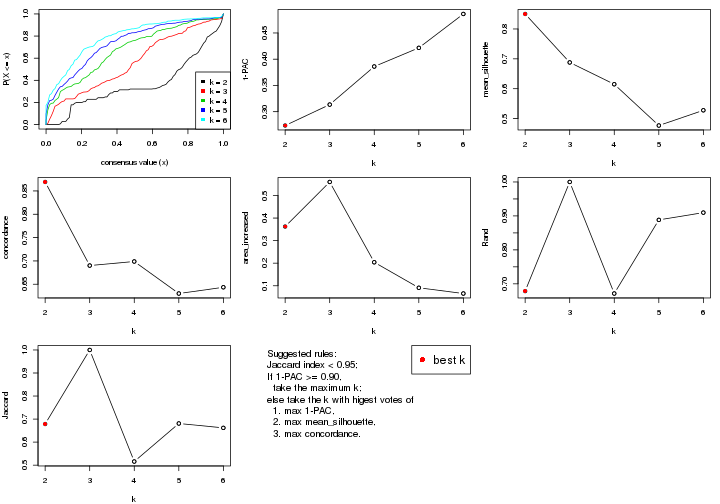

The numeric values for all these statistics can be obtained by `get_stats()`.

```r
get_stats(res)
```

```
#>   k 1-PAC mean_silhouette concordance area_increased  Rand Jaccard
#> 2 2 0.274           0.850       0.869         0.3624 0.679   0.679
#> 3 3 0.313           0.688       0.690         0.5600 1.000   1.000
#> 4 4 0.386           0.615       0.699         0.2040 0.671   0.516
#> 5 5 0.422           0.477       0.630         0.0910 0.888   0.681
#> 6 6 0.486           0.528       0.643         0.0655 0.910   0.662
```

`suggest_best_k()` suggests the best $k$ based on these statistics. The rules are as follows:

- All $k$ with Jaccard index larger than 0.95 are removed because increasing
  $k$ does not provide enough extra information. If all $k$ are removed, it is
  marked as no subgroup is detected.
- For all $k$ with 1-PAC score larger than 0.9, the maximal $k$ is taken as
  the best $k$, and other $k$ are marked as optional $k$.
- If it does not fit the second rule. The $k$ with the maximal vote of the
  highest 1-PAC score, highest mean silhouette, and highest concordance is
  taken as the best $k$.

```r
suggest_best_k(res)
```

```
#> [1] 2
```


Following shows the table of the partitions (You need to click the **show/hide
code output** link to see it). The membership matrix (columns with name `p*`)
is inferred by
[`clue::cl_consensus()`](https://www.rdocumentation.org/link/cl_consensus?package=clue)
function with the `SE` method. Basically the value in the membership matrix
represents the probability to belong to a certain group. The finall class
label for an item is determined with the group with highest probability it
belongs to.

In `get_classes()` function, the entropy is calculated from the membership
matrix and the silhouette score is calculated from the consensus matrix.


<script>
$( function() {
	$( '#tabs-MAD-kmeans-get-classes' ).tabs();
} );
</script>
<div id='tabs-MAD-kmeans-get-classes'>
<ul>
<li><a href='#tab-MAD-kmeans-get-classes-1'>k = 2</a></li>
<li><a href='#tab-MAD-kmeans-get-classes-2'>k = 3</a></li>
<li><a href='#tab-MAD-kmeans-get-classes-3'>k = 4</a></li>
<li><a href='#tab-MAD-kmeans-get-classes-4'>k = 5</a></li>
<li><a href='#tab-MAD-kmeans-get-classes-5'>k = 6</a></li>
</ul>

<div id='tab-MAD-kmeans-get-classes-1'>
<p><a id='tab-MAD-kmeans-get-classes-1-a' style='color:#0366d6' href='#'>show/hide code output</a></p>
<pre><code class="r">cbind(get_classes(res, k = 2), get_membership(res, k = 2))
</code></pre>

<pre><code>#&gt;           class entropy silhouette    p1    p2
#&gt; GSM687644     2   0.416      0.854 0.084 0.916
#&gt; GSM687648     2   0.827      0.733 0.260 0.740
#&gt; GSM687653     2   0.118      0.862 0.016 0.984
#&gt; GSM687658     2   0.881      0.682 0.300 0.700
#&gt; GSM687663     2   0.242      0.864 0.040 0.960
#&gt; GSM687668     2   0.204      0.860 0.032 0.968
#&gt; GSM687673     2   0.295      0.861 0.052 0.948
#&gt; GSM687678     2   0.775      0.764 0.228 0.772
#&gt; GSM687683     2   0.730      0.802 0.204 0.796
#&gt; GSM687688     2   0.260      0.856 0.044 0.956
#&gt; GSM687695     1   0.506      1.000 0.888 0.112
#&gt; GSM687699     2   0.850      0.709 0.276 0.724
#&gt; GSM687704     2   0.118      0.862 0.016 0.984
#&gt; GSM687707     2   0.689      0.816 0.184 0.816
#&gt; GSM687712     2   0.443      0.854 0.092 0.908
#&gt; GSM687719     1   0.506      1.000 0.888 0.112
#&gt; GSM687724     2   0.494      0.822 0.108 0.892
#&gt; GSM687728     1   0.506      1.000 0.888 0.112
#&gt; GSM687646     2   0.402      0.855 0.080 0.920
#&gt; GSM687649     2   0.827      0.733 0.260 0.740
#&gt; GSM687665     2   0.469      0.848 0.100 0.900
#&gt; GSM687651     2   0.821      0.738 0.256 0.744
#&gt; GSM687667     2   0.141      0.861 0.020 0.980
#&gt; GSM687670     2   0.204      0.860 0.032 0.968
#&gt; GSM687671     2   0.204      0.860 0.032 0.968
#&gt; GSM687654     2   0.118      0.862 0.016 0.984
#&gt; GSM687675     2   0.343      0.859 0.064 0.936
#&gt; GSM687685     2   0.730      0.802 0.204 0.796
#&gt; GSM687656     2   0.118      0.862 0.016 0.984
#&gt; GSM687677     2   0.224      0.859 0.036 0.964
#&gt; GSM687687     2   0.416      0.854 0.084 0.916
#&gt; GSM687692     2   0.260      0.856 0.044 0.956
#&gt; GSM687716     2   0.443      0.854 0.092 0.908
#&gt; GSM687722     1   0.506      1.000 0.888 0.112
#&gt; GSM687680     2   0.808      0.743 0.248 0.752
#&gt; GSM687690     2   0.260      0.856 0.044 0.956
#&gt; GSM687700     1   0.506      1.000 0.888 0.112
#&gt; GSM687705     2   0.118      0.862 0.016 0.984
#&gt; GSM687714     2   0.443      0.854 0.092 0.908
#&gt; GSM687721     1   0.506      1.000 0.888 0.112
#&gt; GSM687682     2   0.808      0.743 0.248 0.752
#&gt; GSM687694     2   0.260      0.856 0.044 0.956
#&gt; GSM687702     2   0.850      0.709 0.276 0.724
#&gt; GSM687718     2   0.443      0.854 0.092 0.908
#&gt; GSM687723     2   0.943      0.599 0.360 0.640
#&gt; GSM687661     2   0.881      0.682 0.300 0.700
#&gt; GSM687710     2   0.689      0.816 0.184 0.816
#&gt; GSM687726     2   0.494      0.822 0.108 0.892
#&gt; GSM687730     1   0.506      1.000 0.888 0.112
#&gt; GSM687660     1   0.506      1.000 0.888 0.112
#&gt; GSM687697     1   0.506      1.000 0.888 0.112
#&gt; GSM687709     2   0.689      0.816 0.184 0.816
#&gt; GSM687725     2   0.494      0.822 0.108 0.892
#&gt; GSM687729     1   0.506      1.000 0.888 0.112
#&gt; GSM687727     2   0.469      0.821 0.100 0.900
#&gt; GSM687731     1   0.506      1.000 0.888 0.112
</code></pre>

<script>
$('#tab-MAD-kmeans-get-classes-1-a').parent().next().next().hide();
$('#tab-MAD-kmeans-get-classes-1-a').click(function(){
  $('#tab-MAD-kmeans-get-classes-1-a').parent().next().next().toggle();
  return(false);
});
</script>
</div>

<div id='tab-MAD-kmeans-get-classes-2'>
<p><a id='tab-MAD-kmeans-get-classes-2-a' style='color:#0366d6' href='#'>show/hide code output</a></p>
<pre><code class="r">cbind(get_classes(res, k = 3), get_membership(res, k = 3))
</code></pre>

<pre><code>#&gt;           class entropy silhouette    p1    p2 p3
#&gt; GSM687644     2  0.6314      0.663 0.004 0.604 NA
#&gt; GSM687648     2  0.9062      0.583 0.152 0.512 NA
#&gt; GSM687653     2  0.3573      0.692 0.004 0.876 NA
#&gt; GSM687658     2  0.9698      0.504 0.256 0.456 NA
#&gt; GSM687663     2  0.3889      0.696 0.032 0.884 NA
#&gt; GSM687668     2  0.3181      0.700 0.024 0.912 NA
#&gt; GSM687673     2  0.5105      0.675 0.048 0.828 NA
#&gt; GSM687678     2  0.8799      0.607 0.144 0.556 NA
#&gt; GSM687683     2  0.7953      0.647 0.068 0.564 NA
#&gt; GSM687688     2  0.5678      0.653 0.032 0.776 NA
#&gt; GSM687695     1  0.0892      0.971 0.980 0.020 NA
#&gt; GSM687699     2  0.9215      0.559 0.168 0.500 NA
#&gt; GSM687704     2  0.3845      0.684 0.012 0.872 NA
#&gt; GSM687707     2  0.8708      0.598 0.108 0.488 NA
#&gt; GSM687712     2  0.6641      0.631 0.008 0.544 NA
#&gt; GSM687719     1  0.4505      0.885 0.860 0.048 NA
#&gt; GSM687724     2  0.7141      0.508 0.032 0.600 NA
#&gt; GSM687728     1  0.1315      0.971 0.972 0.020 NA
#&gt; GSM687646     2  0.6314      0.663 0.004 0.604 NA
#&gt; GSM687649     2  0.9062      0.583 0.152 0.512 NA
#&gt; GSM687665     2  0.5138      0.684 0.052 0.828 NA
#&gt; GSM687651     2  0.9062      0.583 0.152 0.512 NA
#&gt; GSM687667     2  0.2749      0.698 0.012 0.924 NA
#&gt; GSM687670     2  0.3181      0.700 0.024 0.912 NA
#&gt; GSM687671     2  0.3181      0.700 0.024 0.912 NA
#&gt; GSM687654     2  0.3573      0.692 0.004 0.876 NA
#&gt; GSM687675     2  0.5403      0.669 0.060 0.816 NA
#&gt; GSM687685     2  0.7937      0.648 0.068 0.568 NA
#&gt; GSM687656     2  0.3573      0.692 0.004 0.876 NA
#&gt; GSM687677     2  0.3966      0.681 0.024 0.876 NA
#&gt; GSM687687     2  0.6209      0.670 0.004 0.628 NA
#&gt; GSM687692     2  0.5678      0.653 0.032 0.776 NA
#&gt; GSM687716     2  0.6641      0.631 0.008 0.544 NA
#&gt; GSM687722     1  0.4505      0.885 0.860 0.048 NA
#&gt; GSM687680     2  0.8799      0.607 0.144 0.556 NA
#&gt; GSM687690     2  0.5678      0.653 0.032 0.776 NA
#&gt; GSM687700     1  0.1031      0.969 0.976 0.024 NA
#&gt; GSM687705     2  0.3845      0.684 0.012 0.872 NA
#&gt; GSM687714     2  0.6641      0.631 0.008 0.544 NA
#&gt; GSM687721     1  0.1919      0.961 0.956 0.024 NA
#&gt; GSM687682     2  0.8799      0.607 0.144 0.556 NA
#&gt; GSM687694     2  0.5678      0.653 0.032 0.776 NA
#&gt; GSM687702     2  0.9277      0.552 0.176 0.496 NA
#&gt; GSM687718     2  0.6641      0.631 0.008 0.544 NA
#&gt; GSM687723     2  0.9746      0.433 0.320 0.436 NA
#&gt; GSM687661     2  0.9698      0.504 0.256 0.456 NA
#&gt; GSM687710     2  0.8708      0.598 0.108 0.488 NA
#&gt; GSM687726     2  0.7141      0.508 0.032 0.600 NA
#&gt; GSM687730     1  0.1315      0.971 0.972 0.020 NA
#&gt; GSM687660     1  0.0892      0.971 0.980 0.020 NA
#&gt; GSM687697     1  0.0892      0.971 0.980 0.020 NA
#&gt; GSM687709     2  0.8708      0.598 0.108 0.488 NA
#&gt; GSM687725     2  0.7141      0.508 0.032 0.600 NA
#&gt; GSM687729     1  0.1315      0.971 0.972 0.020 NA
#&gt; GSM687727     2  0.7050      0.510 0.028 0.600 NA
#&gt; GSM687731     1  0.1315      0.971 0.972 0.020 NA
</code></pre>

<script>
$('#tab-MAD-kmeans-get-classes-2-a').parent().next().next().hide();
$('#tab-MAD-kmeans-get-classes-2-a').click(function(){
  $('#tab-MAD-kmeans-get-classes-2-a').parent().next().next().toggle();
  return(false);
});
</script>
</div>

<div id='tab-MAD-kmeans-get-classes-3'>
<p><a id='tab-MAD-kmeans-get-classes-3-a' style='color:#0366d6' href='#'>show/hide code output</a></p>
<pre><code class="r">cbind(get_classes(res, k = 4), get_membership(res, k = 4))
</code></pre>

<pre><code>#&gt;           class entropy silhouette    p1    p2 p3    p4
#&gt; GSM687644     4  0.6068      0.513 0.000 0.208 NA 0.676
#&gt; GSM687648     4  0.5707      0.602 0.056 0.096 NA 0.768
#&gt; GSM687653     2  0.6211      0.590 0.016 0.676 NA 0.236
#&gt; GSM687658     4  0.8284      0.527 0.184 0.140 NA 0.568
#&gt; GSM687663     2  0.5692      0.585 0.012 0.680 NA 0.272
#&gt; GSM687668     2  0.5033      0.609 0.004 0.740 NA 0.220
#&gt; GSM687673     2  0.5207      0.618 0.008 0.732 NA 0.224
#&gt; GSM687678     4  0.5064      0.607 0.060 0.132 NA 0.788
#&gt; GSM687683     4  0.6719      0.578 0.036 0.168 NA 0.680
#&gt; GSM687688     2  0.6140      0.577 0.004 0.688 NA 0.128
#&gt; GSM687695     1  0.0469      0.925 0.988 0.000 NA 0.012
#&gt; GSM687699     4  0.5732      0.611 0.064 0.088 NA 0.768
#&gt; GSM687704     2  0.4512      0.656 0.008 0.804 NA 0.148
#&gt; GSM687707     4  0.8525      0.387 0.044 0.200 NA 0.448
#&gt; GSM687712     4  0.7524      0.452 0.004 0.204 NA 0.516
#&gt; GSM687719     1  0.5910      0.722 0.728 0.024 NA 0.172
#&gt; GSM687724     2  0.5805      0.471 0.000 0.576 NA 0.036
#&gt; GSM687728     1  0.1510      0.923 0.956 0.000 NA 0.016
#&gt; GSM687646     4  0.6068      0.513 0.000 0.208 NA 0.676
#&gt; GSM687649     4  0.5707      0.602 0.056 0.096 NA 0.768
#&gt; GSM687665     2  0.5987      0.566 0.016 0.656 NA 0.288
#&gt; GSM687651     4  0.5707      0.602 0.056 0.096 NA 0.768
#&gt; GSM687667     2  0.5582      0.602 0.012 0.696 NA 0.256
#&gt; GSM687670     2  0.4944      0.612 0.004 0.744 NA 0.220
#&gt; GSM687671     2  0.5033      0.609 0.004 0.740 NA 0.220
#&gt; GSM687654     2  0.6211      0.590 0.016 0.676 NA 0.236
#&gt; GSM687675     2  0.5207      0.618 0.008 0.732 NA 0.224
#&gt; GSM687685     4  0.6770      0.579 0.036 0.168 NA 0.676
#&gt; GSM687656     2  0.6211      0.590 0.016 0.676 NA 0.236
#&gt; GSM687677     2  0.4282      0.661 0.008 0.808 NA 0.160
#&gt; GSM687687     4  0.6649      0.494 0.004 0.256 NA 0.620
#&gt; GSM687692     2  0.6140      0.577 0.004 0.688 NA 0.128
#&gt; GSM687716     4  0.7524      0.452 0.004 0.204 NA 0.516
#&gt; GSM687722     1  0.5910      0.722 0.728 0.024 NA 0.172
#&gt; GSM687680     4  0.5064      0.607 0.060 0.132 NA 0.788
#&gt; GSM687690     2  0.6140      0.577 0.004 0.688 NA 0.128
#&gt; GSM687700     1  0.1411      0.919 0.960 0.000 NA 0.020
#&gt; GSM687705     2  0.4512      0.656 0.008 0.804 NA 0.148
#&gt; GSM687714     4  0.7524      0.452 0.004 0.204 NA 0.516
#&gt; GSM687721     1  0.3189      0.882 0.888 0.004 NA 0.048
#&gt; GSM687682     4  0.5168      0.608 0.060 0.132 NA 0.784
#&gt; GSM687694     2  0.6140      0.577 0.004 0.688 NA 0.128
#&gt; GSM687702     4  0.5802      0.607 0.068 0.088 NA 0.764
#&gt; GSM687718     4  0.7524      0.452 0.004 0.204 NA 0.516
#&gt; GSM687723     4  0.8846      0.414 0.288 0.132 NA 0.468
#&gt; GSM687661     4  0.8284      0.527 0.184 0.140 NA 0.568
#&gt; GSM687710     4  0.8525      0.387 0.044 0.200 NA 0.448
#&gt; GSM687726     2  0.5805      0.471 0.000 0.576 NA 0.036
#&gt; GSM687730     1  0.1388      0.923 0.960 0.000 NA 0.012
#&gt; GSM687660     1  0.0469      0.925 0.988 0.000 NA 0.012
#&gt; GSM687697     1  0.0469      0.925 0.988 0.000 NA 0.012
#&gt; GSM687709     4  0.8525      0.387 0.044 0.200 NA 0.448
#&gt; GSM687725     2  0.5805      0.471 0.000 0.576 NA 0.036
#&gt; GSM687729     1  0.1388      0.923 0.960 0.000 NA 0.012
#&gt; GSM687727     2  0.5638      0.473 0.000 0.584 NA 0.028
#&gt; GSM687731     1  0.1510      0.923 0.956 0.000 NA 0.016
</code></pre>

<script>
$('#tab-MAD-kmeans-get-classes-3-a').parent().next().next().hide();
$('#tab-MAD-kmeans-get-classes-3-a').click(function(){
  $('#tab-MAD-kmeans-get-classes-3-a').parent().next().next().toggle();
  return(false);
});
</script>
</div>

<div id='tab-MAD-kmeans-get-classes-4'>
<p><a id='tab-MAD-kmeans-get-classes-4-a' style='color:#0366d6' href='#'>show/hide code output</a></p>
<pre><code class="r">cbind(get_classes(res, k = 5), get_membership(res, k = 5))
</code></pre>

<pre><code>#&gt;           class entropy silhouette    p1    p2    p3    p4    p5
#&gt; GSM687644     2  0.6647    -0.0533 0.000 0.496 0.016 0.332 0.156
#&gt; GSM687648     2  0.4584     0.5368 0.044 0.812 0.036 0.068 0.040
#&gt; GSM687653     5  0.7988     0.3606 0.000 0.256 0.236 0.100 0.408
#&gt; GSM687658     2  0.7682     0.4372 0.156 0.568 0.036 0.100 0.140
#&gt; GSM687663     5  0.7712     0.2821 0.004 0.284 0.332 0.040 0.340
#&gt; GSM687668     5  0.7885     0.4055 0.004 0.216 0.328 0.068 0.384
#&gt; GSM687673     3  0.7435    -0.3913 0.004 0.212 0.376 0.032 0.376
#&gt; GSM687678     2  0.5032     0.5235 0.044 0.780 0.036 0.100 0.040
#&gt; GSM687683     2  0.7173     0.1800 0.012 0.504 0.028 0.292 0.164
#&gt; GSM687688     5  0.6818     0.3425 0.000 0.088 0.300 0.072 0.540
#&gt; GSM687695     1  0.0000     0.8894 1.000 0.000 0.000 0.000 0.000
#&gt; GSM687699     2  0.3267     0.5450 0.064 0.876 0.016 0.020 0.024
#&gt; GSM687704     5  0.7673     0.3779 0.000 0.176 0.344 0.076 0.404
#&gt; GSM687707     2  0.8571     0.2686 0.020 0.392 0.120 0.232 0.236
#&gt; GSM687712     4  0.5470     1.0000 0.000 0.180 0.040 0.704 0.076
#&gt; GSM687719     1  0.6762     0.6305 0.640 0.160 0.020 0.076 0.104
#&gt; GSM687724     3  0.1243     0.6109 0.004 0.028 0.960 0.008 0.000
#&gt; GSM687728     1  0.1875     0.8851 0.940 0.008 0.008 0.028 0.016
#&gt; GSM687646     2  0.6647    -0.0533 0.000 0.496 0.016 0.332 0.156
#&gt; GSM687649     2  0.4584     0.5368 0.044 0.812 0.036 0.068 0.040
#&gt; GSM687665     3  0.7666    -0.4106 0.004 0.292 0.336 0.036 0.332
#&gt; GSM687651     2  0.4584     0.5368 0.044 0.812 0.036 0.068 0.040
#&gt; GSM687667     5  0.7690     0.3022 0.004 0.268 0.336 0.040 0.352
#&gt; GSM687670     5  0.7885     0.4055 0.004 0.216 0.328 0.068 0.384
#&gt; GSM687671     5  0.7885     0.4055 0.004 0.216 0.328 0.068 0.384
#&gt; GSM687654     5  0.7988     0.3606 0.000 0.256 0.236 0.100 0.408
#&gt; GSM687675     5  0.7435     0.2208 0.004 0.212 0.376 0.032 0.376
#&gt; GSM687685     2  0.7171     0.1755 0.012 0.500 0.028 0.300 0.160
#&gt; GSM687656     5  0.7988     0.3606 0.000 0.256 0.236 0.100 0.408
#&gt; GSM687677     5  0.7235     0.3019 0.004 0.168 0.380 0.032 0.416
#&gt; GSM687687     2  0.7213    -0.1451 0.000 0.396 0.024 0.352 0.228
#&gt; GSM687692     5  0.6862     0.3432 0.000 0.092 0.300 0.072 0.536
#&gt; GSM687716     4  0.5470     1.0000 0.000 0.180 0.040 0.704 0.076
#&gt; GSM687722     1  0.6762     0.6305 0.640 0.160 0.020 0.076 0.104
#&gt; GSM687680     2  0.5028     0.5252 0.048 0.780 0.036 0.100 0.036
#&gt; GSM687690     5  0.6862     0.3432 0.000 0.092 0.300 0.072 0.536
#&gt; GSM687700     1  0.1967     0.8767 0.932 0.036 0.000 0.020 0.012
#&gt; GSM687705     5  0.7673     0.3779 0.000 0.176 0.344 0.076 0.404
#&gt; GSM687714     4  0.5470     1.0000 0.000 0.180 0.040 0.704 0.076
#&gt; GSM687721     1  0.4238     0.8132 0.824 0.052 0.008 0.056 0.060
#&gt; GSM687682     2  0.5028     0.5252 0.048 0.780 0.036 0.100 0.036
#&gt; GSM687694     5  0.6862     0.3432 0.000 0.092 0.300 0.072 0.536
#&gt; GSM687702     2  0.3256     0.5434 0.064 0.876 0.012 0.024 0.024
#&gt; GSM687718     4  0.5470     1.0000 0.000 0.180 0.040 0.704 0.076
#&gt; GSM687723     2  0.8328     0.2989 0.272 0.452 0.040 0.092 0.144
#&gt; GSM687661     2  0.7682     0.4372 0.156 0.568 0.036 0.100 0.140
#&gt; GSM687710     2  0.8571     0.2686 0.020 0.392 0.120 0.232 0.236
#&gt; GSM687726     3  0.1116     0.6117 0.004 0.028 0.964 0.004 0.000
#&gt; GSM687730     1  0.1748     0.8861 0.944 0.004 0.008 0.028 0.016
#&gt; GSM687660     1  0.0579     0.8875 0.984 0.000 0.000 0.008 0.008
#&gt; GSM687697     1  0.0000     0.8894 1.000 0.000 0.000 0.000 0.000
#&gt; GSM687709     2  0.8571     0.2686 0.020 0.392 0.120 0.232 0.236
#&gt; GSM687725     3  0.1116     0.6117 0.004 0.028 0.964 0.004 0.000
#&gt; GSM687729     1  0.1659     0.8868 0.948 0.004 0.008 0.024 0.016
#&gt; GSM687727     3  0.1202     0.6071 0.004 0.032 0.960 0.004 0.000
#&gt; GSM687731     1  0.1875     0.8851 0.940 0.008 0.008 0.028 0.016
</code></pre>

<script>
$('#tab-MAD-kmeans-get-classes-4-a').parent().next().next().hide();
$('#tab-MAD-kmeans-get-classes-4-a').click(function(){
  $('#tab-MAD-kmeans-get-classes-4-a').parent().next().next().toggle();
  return(false);
});
</script>
</div>

<div id='tab-MAD-kmeans-get-classes-5'>
<p><a id='tab-MAD-kmeans-get-classes-5-a' style='color:#0366d6' href='#'>show/hide code output</a></p>
<pre><code class="r">cbind(get_classes(res, k = 6), get_membership(res, k = 6))
</code></pre>

<pre><code>#&gt;           class entropy silhouette    p1    p2    p3    p4    p5    p6
#&gt; GSM687644     4  0.7249     0.4255 0.000 0.328 0.024 0.420 0.156 0.072
#&gt; GSM687648     2  0.4820     0.4532 0.008 0.764 0.024 0.032 0.100 0.072
#&gt; GSM687653     5  0.5654     0.4129 0.000 0.148 0.040 0.056 0.688 0.068
#&gt; GSM687658     2  0.8010     0.1646 0.080 0.476 0.020 0.088 0.124 0.212
#&gt; GSM687663     5  0.3382     0.4311 0.000 0.108 0.044 0.012 0.832 0.004
#&gt; GSM687668     5  0.6460     0.4254 0.000 0.056 0.120 0.136 0.624 0.064
#&gt; GSM687673     5  0.7084     0.3390 0.004 0.116 0.164 0.044 0.564 0.108
#&gt; GSM687678     2  0.5906     0.4977 0.016 0.684 0.024 0.100 0.124 0.052
#&gt; GSM687683     2  0.7384    -0.0716 0.000 0.404 0.040 0.356 0.096 0.104
#&gt; GSM687688     5  0.7999     0.2595 0.000 0.044 0.256 0.152 0.388 0.160
#&gt; GSM687695     1  0.0000     0.7930 1.000 0.000 0.000 0.000 0.000 0.000
#&gt; GSM687699     2  0.4300     0.4955 0.020 0.812 0.028 0.028 0.056 0.056
#&gt; GSM687704     5  0.3720     0.4415 0.000 0.028 0.048 0.072 0.832 0.020
#&gt; GSM687707     6  0.7946     1.0000 0.020 0.216 0.064 0.088 0.136 0.476
#&gt; GSM687712     4  0.2998     0.7310 0.000 0.076 0.004 0.852 0.068 0.000
#&gt; GSM687719     1  0.7137     0.3326 0.468 0.260 0.028 0.008 0.032 0.204
#&gt; GSM687724     3  0.4648     0.9870 0.000 0.016 0.684 0.044 0.252 0.004
#&gt; GSM687728     1  0.3414     0.7779 0.852 0.020 0.052 0.024 0.000 0.052
#&gt; GSM687646     4  0.7249     0.4255 0.000 0.328 0.024 0.420 0.156 0.072
#&gt; GSM687649     2  0.4820     0.4532 0.008 0.764 0.024 0.032 0.100 0.072
#&gt; GSM687665     5  0.3472     0.4170 0.000 0.136 0.044 0.004 0.812 0.004
#&gt; GSM687651     2  0.4820     0.4532 0.008 0.764 0.024 0.032 0.100 0.072
#&gt; GSM687667     5  0.3142     0.4408 0.000 0.088 0.044 0.012 0.852 0.004
#&gt; GSM687670     5  0.6460     0.4254 0.000 0.056 0.120 0.136 0.624 0.064
#&gt; GSM687671     5  0.6460     0.4254 0.000 0.056 0.120 0.136 0.624 0.064
#&gt; GSM687654     5  0.5654     0.4129 0.000 0.148 0.040 0.056 0.688 0.068
#&gt; GSM687675     5  0.7084     0.3390 0.004 0.116 0.164 0.044 0.564 0.108
#&gt; GSM687685     2  0.7445    -0.0814 0.000 0.396 0.040 0.356 0.108 0.100
#&gt; GSM687656     5  0.5654     0.4129 0.000 0.148 0.040 0.056 0.688 0.068
#&gt; GSM687677     5  0.6568     0.3651 0.000 0.076 0.168 0.052 0.608 0.096
#&gt; GSM687687     4  0.7556     0.4049 0.000 0.240 0.052 0.468 0.148 0.092
#&gt; GSM687692     5  0.7999     0.2595 0.000 0.044 0.256 0.152 0.388 0.160
#&gt; GSM687716     4  0.2998     0.7310 0.000 0.076 0.004 0.852 0.068 0.000
#&gt; GSM687722     1  0.7137     0.3326 0.468 0.260 0.028 0.008 0.032 0.204
#&gt; GSM687680     2  0.5906     0.4977 0.016 0.684 0.024 0.100 0.124 0.052
#&gt; GSM687690     5  0.7999     0.2595 0.000 0.044 0.256 0.152 0.388 0.160
#&gt; GSM687700     1  0.2545     0.7625 0.888 0.068 0.024 0.000 0.000 0.020
#&gt; GSM687705     5  0.3720     0.4415 0.000 0.028 0.048 0.072 0.832 0.020
#&gt; GSM687714     4  0.2998     0.7310 0.000 0.076 0.004 0.852 0.068 0.000
#&gt; GSM687721     1  0.5003     0.6343 0.700 0.132 0.020 0.004 0.000 0.144
#&gt; GSM687682     2  0.5906     0.4977 0.016 0.684 0.024 0.100 0.124 0.052
#&gt; GSM687694     5  0.7999     0.2595 0.000 0.044 0.256 0.152 0.388 0.160
#&gt; GSM687702     2  0.4142     0.4971 0.020 0.820 0.020 0.028 0.056 0.056
#&gt; GSM687718     4  0.2998     0.7310 0.000 0.076 0.004 0.852 0.068 0.000
#&gt; GSM687723     2  0.8295     0.0514 0.228 0.384 0.028 0.040 0.088 0.232
#&gt; GSM687661     2  0.8010     0.1646 0.080 0.476 0.020 0.088 0.124 0.212
#&gt; GSM687710     6  0.7946     1.0000 0.020 0.216 0.064 0.088 0.136 0.476
#&gt; GSM687726     3  0.4159     0.9910 0.000 0.004 0.704 0.040 0.252 0.000
#&gt; GSM687730     1  0.2882     0.7837 0.872 0.000 0.052 0.024 0.000 0.052
#&gt; GSM687660     1  0.0622     0.7908 0.980 0.000 0.012 0.000 0.000 0.008
#&gt; GSM687697     1  0.0000     0.7930 1.000 0.000 0.000 0.000 0.000 0.000
#&gt; GSM687709     6  0.7946     1.0000 0.020 0.216 0.064 0.088 0.136 0.476
#&gt; GSM687725     3  0.4339     0.9909 0.000 0.008 0.700 0.036 0.252 0.004
#&gt; GSM687729     1  0.2800     0.7843 0.876 0.000 0.052 0.020 0.000 0.052
#&gt; GSM687727     3  0.4201     0.9910 0.000 0.008 0.704 0.036 0.252 0.000
#&gt; GSM687731     1  0.3414     0.7779 0.852 0.020 0.052 0.024 0.000 0.052
</code></pre>

<script>
$('#tab-MAD-kmeans-get-classes-5-a').parent().next().next().hide();
$('#tab-MAD-kmeans-get-classes-5-a').click(function(){
  $('#tab-MAD-kmeans-get-classes-5-a').parent().next().next().toggle();
  return(false);
});
</script>
</div>
</div>

Heatmaps for the consensus matrix. It visualizes the probability of two
samples to be in a same group.


<script>
$( function() {
	$( '#tabs-MAD-kmeans-consensus-heatmap' ).tabs();
} );
</script>
<div id='tabs-MAD-kmeans-consensus-heatmap'>
<ul>
<li><a href='#tab-MAD-kmeans-consensus-heatmap-1'>k = 2</a></li>
<li><a href='#tab-MAD-kmeans-consensus-heatmap-2'>k = 3</a></li>
<li><a href='#tab-MAD-kmeans-consensus-heatmap-3'>k = 4</a></li>
<li><a href='#tab-MAD-kmeans-consensus-heatmap-4'>k = 5</a></li>
<li><a href='#tab-MAD-kmeans-consensus-heatmap-5'>k = 6</a></li>
</ul>
<div id='tab-MAD-kmeans-consensus-heatmap-1'>
<pre><code class="r">consensus_heatmap(res, k = 2)
</code></pre>

<p>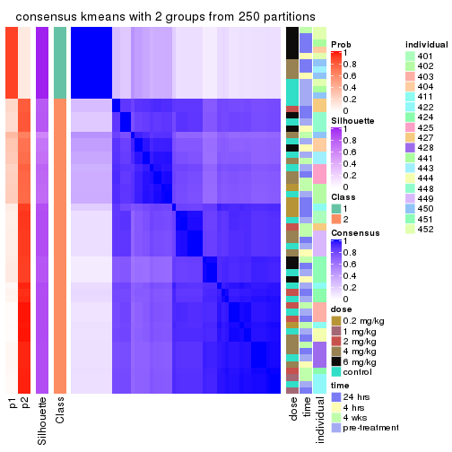</p>

</div>
<div id='tab-MAD-kmeans-consensus-heatmap-2'>
<pre><code class="r">consensus_heatmap(res, k = 3)
</code></pre>

<p>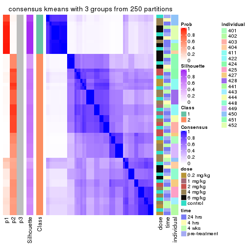</p>

</div>
<div id='tab-MAD-kmeans-consensus-heatmap-3'>
<pre><code class="r">consensus_heatmap(res, k = 4)
</code></pre>

<p>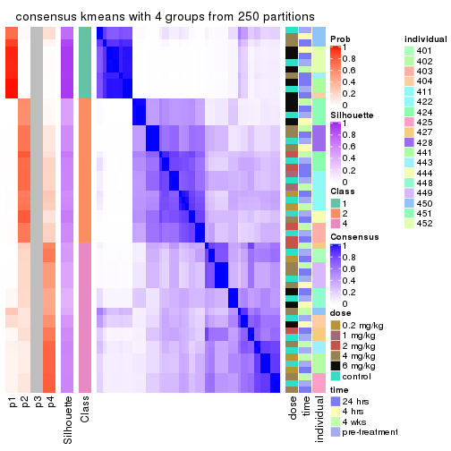</p>

</div>
<div id='tab-MAD-kmeans-consensus-heatmap-4'>
<pre><code class="r">consensus_heatmap(res, k = 5)
</code></pre>

<p>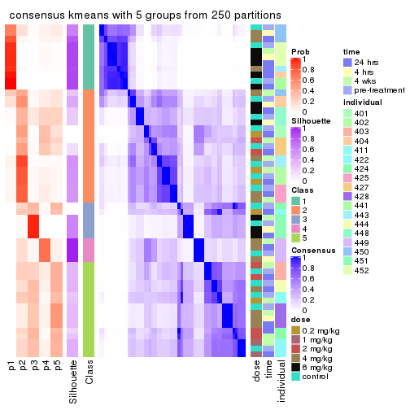</p>

</div>
<div id='tab-MAD-kmeans-consensus-heatmap-5'>
<pre><code class="r">consensus_heatmap(res, k = 6)
</code></pre>

<p>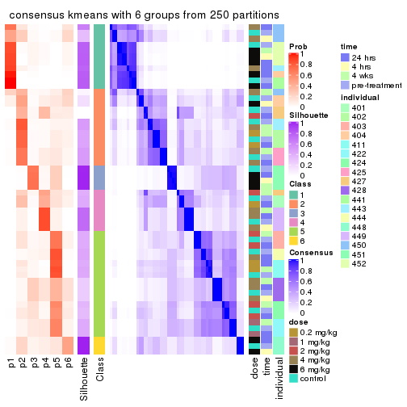</p>

</div>
</div>

Heatmaps for the membership of samples in all partitions to see how consistent they are:


<script>
$( function() {
	$( '#tabs-MAD-kmeans-membership-heatmap' ).tabs();
} );
</script>
<div id='tabs-MAD-kmeans-membership-heatmap'>
<ul>
<li><a href='#tab-MAD-kmeans-membership-heatmap-1'>k = 2</a></li>
<li><a href='#tab-MAD-kmeans-membership-heatmap-2'>k = 3</a></li>
<li><a href='#tab-MAD-kmeans-membership-heatmap-3'>k = 4</a></li>
<li><a href='#tab-MAD-kmeans-membership-heatmap-4'>k = 5</a></li>
<li><a href='#tab-MAD-kmeans-membership-heatmap-5'>k = 6</a></li>
</ul>
<div id='tab-MAD-kmeans-membership-heatmap-1'>
<pre><code class="r">membership_heatmap(res, k = 2)
</code></pre>

<p>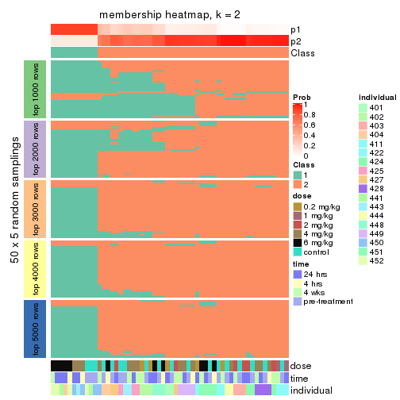</p>

</div>
<div id='tab-MAD-kmeans-membership-heatmap-2'>
<pre><code class="r">membership_heatmap(res, k = 3)
</code></pre>

<p>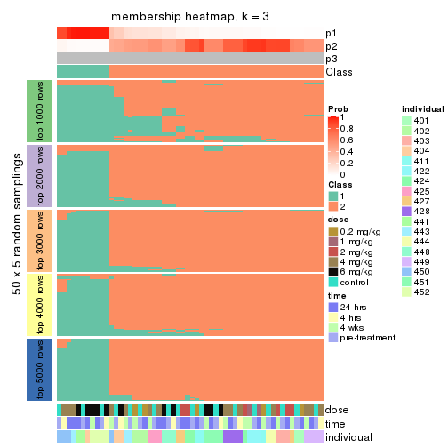</p>

</div>
<div id='tab-MAD-kmeans-membership-heatmap-3'>
<pre><code class="r">membership_heatmap(res, k = 4)
</code></pre>

<p>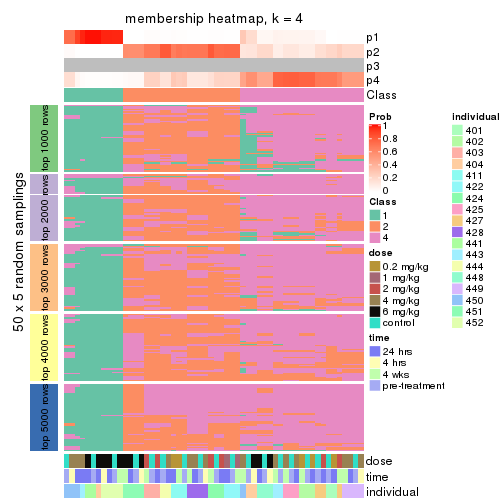</p>

</div>
<div id='tab-MAD-kmeans-membership-heatmap-4'>
<pre><code class="r">membership_heatmap(res, k = 5)
</code></pre>

<p>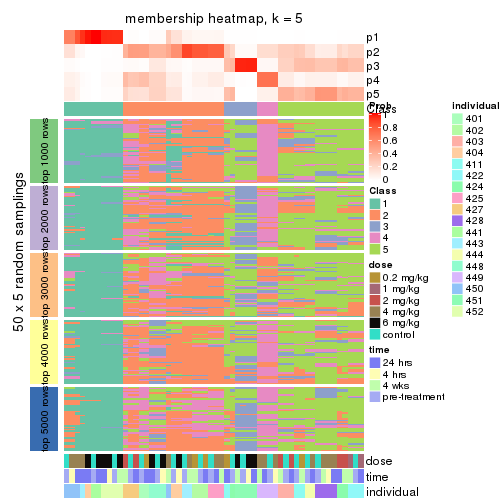</p>

</div>
<div id='tab-MAD-kmeans-membership-heatmap-5'>
<pre><code class="r">membership_heatmap(res, k = 6)
</code></pre>

<p>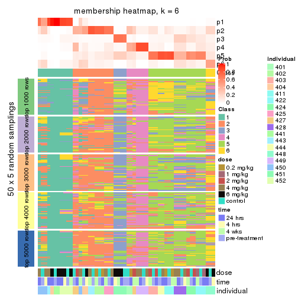</p>

</div>
</div>

As soon as we have had the classes for columns, we can look for signatures
which are significantly different between classes which can be candidate marks
for certain classes. Following are the heatmaps for signatures.


Signature heatmaps where rows are scaled:


<script>
$( function() {
	$( '#tabs-MAD-kmeans-get-signatures' ).tabs();
} );
</script>
<div id='tabs-MAD-kmeans-get-signatures'>
<ul>
<li><a href='#tab-MAD-kmeans-get-signatures-1'>k = 2</a></li>
<li><a href='#tab-MAD-kmeans-get-signatures-2'>k = 3</a></li>
<li><a href='#tab-MAD-kmeans-get-signatures-3'>k = 4</a></li>
<li><a href='#tab-MAD-kmeans-get-signatures-4'>k = 5</a></li>
<li><a href='#tab-MAD-kmeans-get-signatures-5'>k = 6</a></li>
</ul>
<div id='tab-MAD-kmeans-get-signatures-1'>
<pre><code class="r">get_signatures(res, k = 2)
</code></pre>

<p>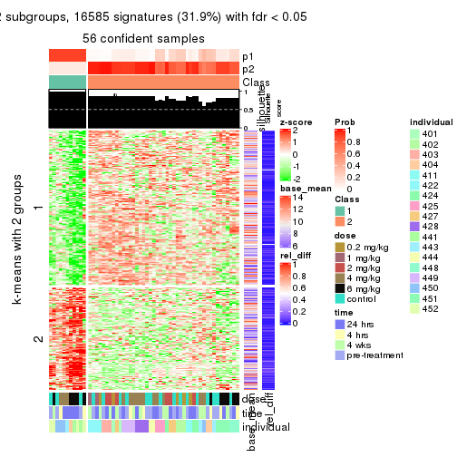</p>

</div>
<div id='tab-MAD-kmeans-get-signatures-2'>
<pre><code class="r">get_signatures(res, k = 3)
</code></pre>

<p>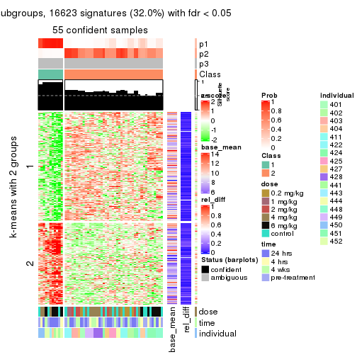</p>

</div>
<div id='tab-MAD-kmeans-get-signatures-3'>
<pre><code class="r">get_signatures(res, k = 4)
</code></pre>

<p>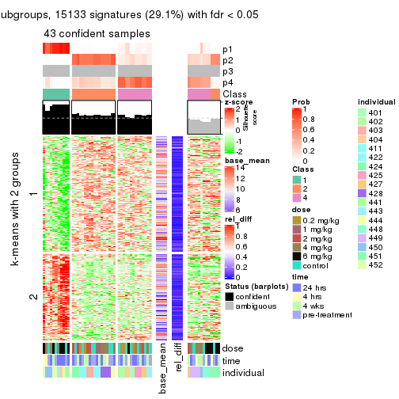</p>

</div>
<div id='tab-MAD-kmeans-get-signatures-4'>
<pre><code class="r">get_signatures(res, k = 5)
</code></pre>

<p>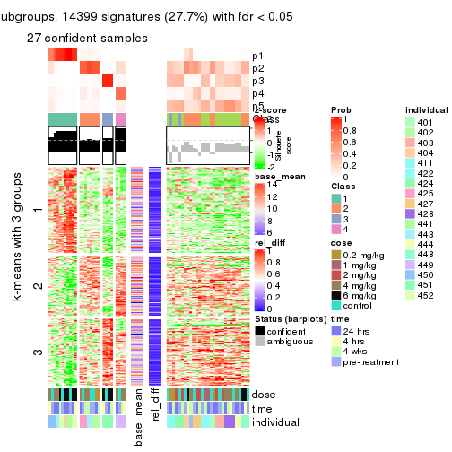</p>

</div>
<div id='tab-MAD-kmeans-get-signatures-5'>
<pre><code class="r">get_signatures(res, k = 6)
</code></pre>

<p>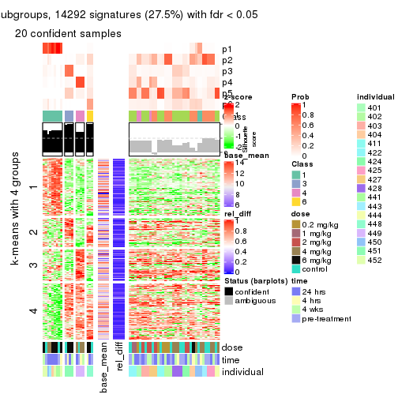</p>

</div>
</div>


Signature heatmaps where rows are not scaled:


<script>
$( function() {
	$( '#tabs-MAD-kmeans-get-signatures-no-scale' ).tabs();
} );
</script>
<div id='tabs-MAD-kmeans-get-signatures-no-scale'>
<ul>
<li><a href='#tab-MAD-kmeans-get-signatures-no-scale-1'>k = 2</a></li>
<li><a href='#tab-MAD-kmeans-get-signatures-no-scale-2'>k = 3</a></li>
<li><a href='#tab-MAD-kmeans-get-signatures-no-scale-3'>k = 4</a></li>
<li><a href='#tab-MAD-kmeans-get-signatures-no-scale-4'>k = 5</a></li>
<li><a href='#tab-MAD-kmeans-get-signatures-no-scale-5'>k = 6</a></li>
</ul>
<div id='tab-MAD-kmeans-get-signatures-no-scale-1'>
<pre><code class="r">get_signatures(res, k = 2, scale_rows = FALSE)
</code></pre>

<p>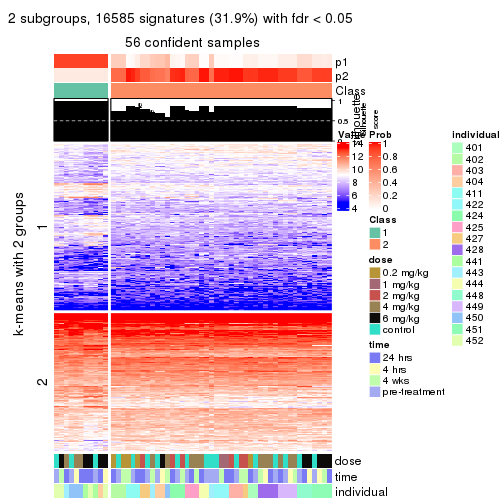</p>

</div>
<div id='tab-MAD-kmeans-get-signatures-no-scale-2'>
<pre><code class="r">get_signatures(res, k = 3, scale_rows = FALSE)
</code></pre>

<p>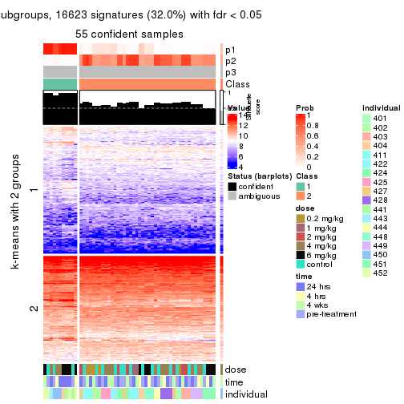</p>

</div>
<div id='tab-MAD-kmeans-get-signatures-no-scale-3'>
<pre><code class="r">get_signatures(res, k = 4, scale_rows = FALSE)
</code></pre>

<p>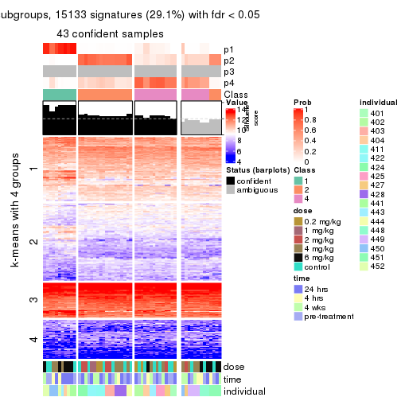</p>

</div>
<div id='tab-MAD-kmeans-get-signatures-no-scale-4'>
<pre><code class="r">get_signatures(res, k = 5, scale_rows = FALSE)
</code></pre>

<p>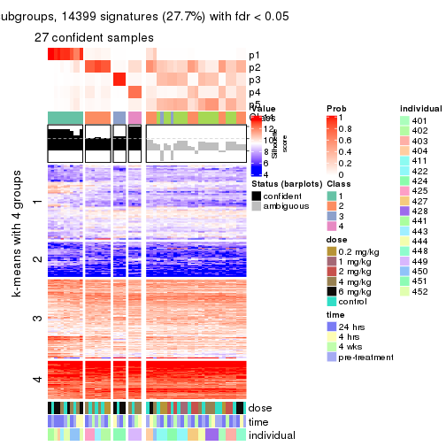</p>

</div>
<div id='tab-MAD-kmeans-get-signatures-no-scale-5'>
<pre><code class="r">get_signatures(res, k = 6, scale_rows = FALSE)
</code></pre>

<p>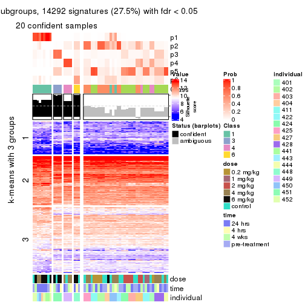</p>

</div>
</div>


Compare the overlap of signatures from different k:

```r
compare_signatures(res)
```

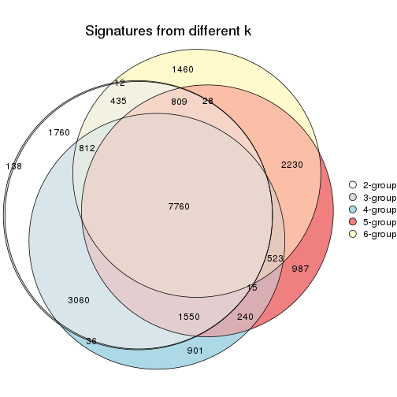

`get_signature()` returns a data frame invisibly. TO get the list of signatures, the function
call should be assigned to a variable explicitly. In following code, if `plot` argument is set
to `FALSE`, no heatmap is plotted while only the differential analysis is performed.

```r
# code only for demonstration
tb = get_signature(res, k = ..., plot = FALSE)
```

An example of the output of `tb` is:

```
#>   which_row         fdr    mean_1    mean_2 scaled_mean_1 scaled_mean_2 km
#> 1        38 0.042760348  8.373488  9.131774    -0.5533452     0.5164555  1
#> 2        40 0.018707592  7.106213  8.469186    -0.6173731     0.5762149  1
#> 3        55 0.019134737 10.221463 11.207825    -0.6159697     0.5749050  1
#> 4        59 0.006059896  5.921854  7.869574    -0.6899429     0.6439467  1
#> 5        60 0.018055526  8.928898 10.211722    -0.6204761     0.5791110  1
#> 6        98 0.009384629 15.714769 14.887706     0.6635654    -0.6193277  2
...
```

The columns in `tb` are:

1. `which_row`: row indices corresponding to the input matrix.
2. `fdr`: FDR for the differential test. 
3. `mean_x`: The mean value in group x.
4. `scaled_mean_x`: The mean value in group x after rows are scaled.
5. `km`: Row groups if k-means clustering is applied to rows.


UMAP plot which shows how samples are separated.


<script>
$( function() {
	$( '#tabs-MAD-kmeans-dimension-reduction' ).tabs();
} );
</script>
<div id='tabs-MAD-kmeans-dimension-reduction'>
<ul>
<li><a href='#tab-MAD-kmeans-dimension-reduction-1'>k = 2</a></li>
<li><a href='#tab-MAD-kmeans-dimension-reduction-2'>k = 3</a></li>
<li><a href='#tab-MAD-kmeans-dimension-reduction-3'>k = 4</a></li>
<li><a href='#tab-MAD-kmeans-dimension-reduction-4'>k = 5</a></li>
<li><a href='#tab-MAD-kmeans-dimension-reduction-5'>k = 6</a></li>
</ul>
<div id='tab-MAD-kmeans-dimension-reduction-1'>
<pre><code class="r">dimension_reduction(res, k = 2, method = &quot;UMAP&quot;)
</code></pre>

<p>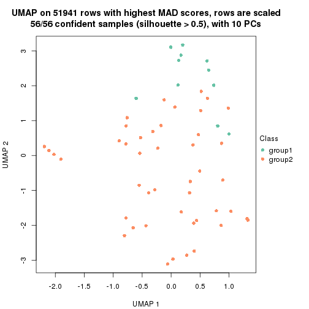</p>

</div>
<div id='tab-MAD-kmeans-dimension-reduction-2'>
<pre><code class="r">dimension_reduction(res, k = 3, method = &quot;UMAP&quot;)
</code></pre>

<p>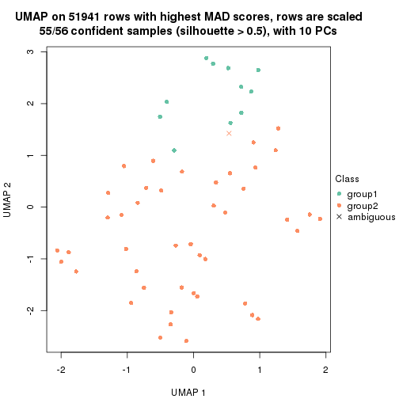</p>

</div>
<div id='tab-MAD-kmeans-dimension-reduction-3'>
<pre><code class="r">dimension_reduction(res, k = 4, method = &quot;UMAP&quot;)
</code></pre>

<p>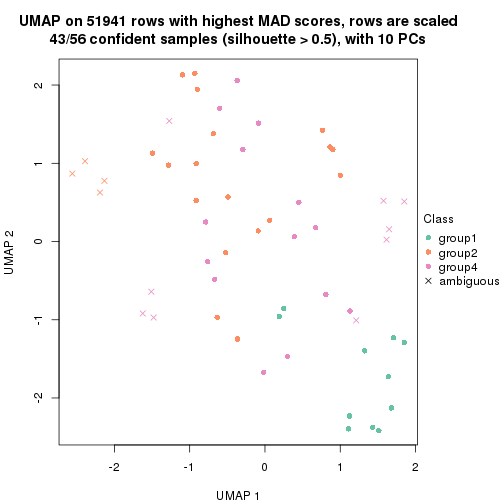</p>

</div>
<div id='tab-MAD-kmeans-dimension-reduction-4'>
<pre><code class="r">dimension_reduction(res, k = 5, method = &quot;UMAP&quot;)
</code></pre>

<p>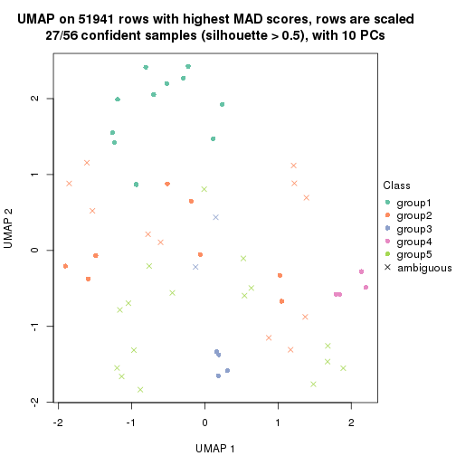</p>

</div>
<div id='tab-MAD-kmeans-dimension-reduction-5'>
<pre><code class="r">dimension_reduction(res, k = 6, method = &quot;UMAP&quot;)
</code></pre>

<p>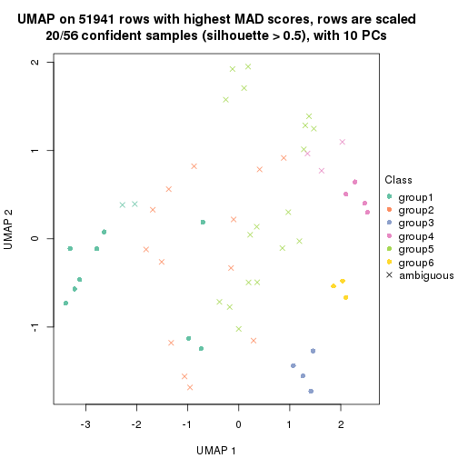</p>

</div>
</div>


Following heatmap shows how subgroups are split when increasing `k`:

```r
collect_classes(res)
```

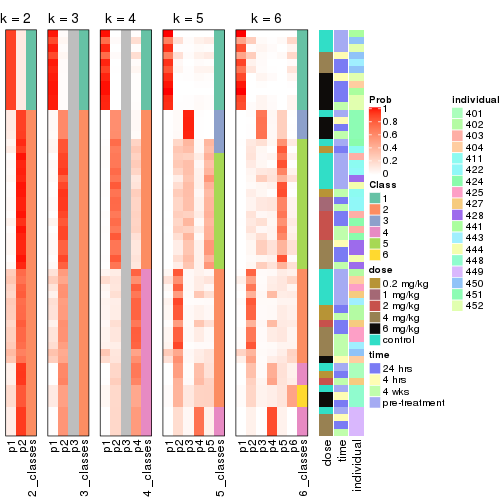


Test correlation between subgroups and known annotations. If the known
annotation is numeric, one-way ANOVA test is applied, and if the known
annotation is discrete, chi-squared contingency table test is applied.

```r
test_to_known_factors(res)
```

```
#>             n dose(p) time(p) individual(p) k
#> MAD:kmeans 56  0.1590   0.496      5.13e-04 2
#> MAD:kmeans 55  0.1615   0.542      1.37e-04 3
#> MAD:kmeans 43  0.0309   0.758      2.05e-06 4
#> MAD:kmeans 27  0.0703   0.866      1.74e-07 5
#> MAD:kmeans 20  0.1967   0.967      1.28e-05 6
```


If matrix rows can be associated to genes, consider to use `functional_enrichment(res,
...)` to perform function enrichment for the signature genes. See [this vignette](http://bioconductor.org/packages/devel/bioc/vignettes/cola/inst/doc/functional_enrichment.html) for more detailed explanations.


 

---------------------------------------------------


### MAD:skmeans


The object with results only for a single top-value method and a single partition method 
can be extracted as:

```r
res = res_list["MAD", "skmeans"]
# you can also extract it by
# res = res_list["MAD:skmeans"]
```

A summary of `res` and all the functions that can be applied to it:

```r
res
```

```
#> A 'ConsensusPartition' object with k = 2, 3, 4, 5, 6.
#>   On a matrix with 51941 rows and 56 columns.
#>   Top rows (1000, 2000, 3000, 4000, 5000) are extracted by 'MAD' method.
#>   Subgroups are detected by 'skmeans' method.
#>   Performed in total 1250 partitions by row resampling.
#>   Best k for subgroups seems to be 2.
#> 
#> Following methods can be applied to this 'ConsensusPartition' object:
#>  [1] "cola_report"             "collect_classes"         "collect_plots"          
#>  [4] "collect_stats"           "colnames"                "compare_signatures"     
#>  [7] "consensus_heatmap"       "dimension_reduction"     "functional_enrichment"  
#> [10] "get_anno_col"            "get_anno"                "get_classes"            
#> [13] "get_consensus"           "get_matrix"              "get_membership"         
#> [16] "get_param"               "get_signatures"          "get_stats"              
#> [19] "is_best_k"               "is_stable_k"             "membership_heatmap"     
#> [22] "ncol"                    "nrow"                    "plot_ecdf"              
#> [25] "rownames"                "select_partition_number" "show"                   
#> [28] "suggest_best_k"          "test_to_known_factors"
```

`collect_plots()` function collects all the plots made from `res` for all `k` (number of partitions)
into one single page to provide an easy and fast comparison between different `k`.

```r
collect_plots(res)
```

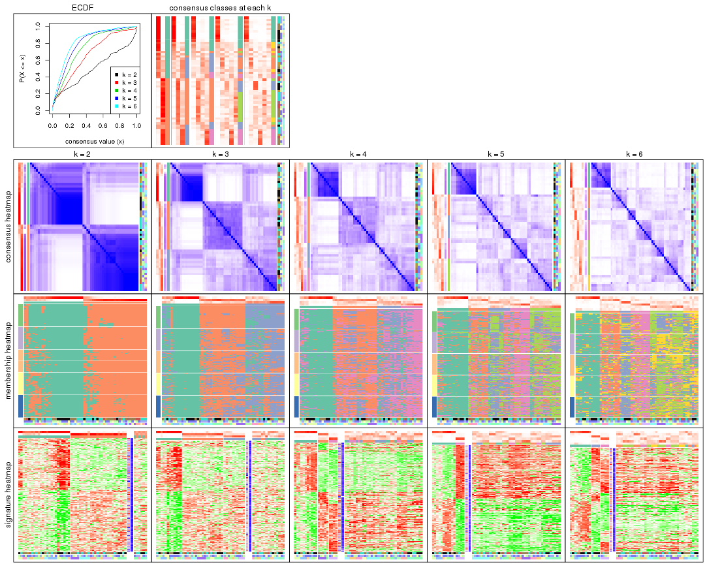

The plots are:

- The first row: a plot of the ECDF (empirical cumulative distribution
  function) curves of the consensus matrix for each `k` and the heatmap of
  predicted classes for each `k`.
- The second row: heatmaps of the consensus matrix for each `k`.
- The third row: heatmaps of the membership matrix for each `k`.
- The fouth row: heatmaps of the signatures for each `k`.

All the plots in panels can be made by individual functions and they are
plotted later in this section.

`select_partition_number()` produces several plots showing different
statistics for choosing "optimized" `k`. There are following statistics:

- ECDF curves of the consensus matrix for each `k`;
- 1-PAC. [The PAC
  score](https://en.wikipedia.org/wiki/Consensus_clustering#Over-interpretation_potential_of_consensus_clustering)
  measures the proportion of the ambiguous subgrouping.
- Mean silhouette score.
- Concordance. The mean probability of fiting the consensus class ids in all
  partitions.
- Area increased. Denote $A_k$ as the area under the ECDF curve for current
  `k`, the area increased is defined as $A_k - A_{k-1}$.
- Rand index. The percent of pairs of samples that are both in a same cluster
  or both are not in a same cluster in the partition of k and k-1.
- Jaccard index. The ratio of pairs of samples are both in a same cluster in
  the partition of k and k-1 and the pairs of samples are both in a same
  cluster in the partition k or k-1.

The detailed explanations of these statistics can be found in [the _cola_
vignette](http://bioconductor.org/packages/devel/bioc/vignettes/cola/inst/doc/cola.html#toc_13).

Generally speaking, lower PAC score, higher mean silhouette score or higher
concordance corresponds to better partition. Rand index and Jaccard index
measure how similar the current partition is compared to partition with `k-1`.
If they are too similar, we won't accept `k` is better than `k-1`.

```r
select_partition_number(res)
```

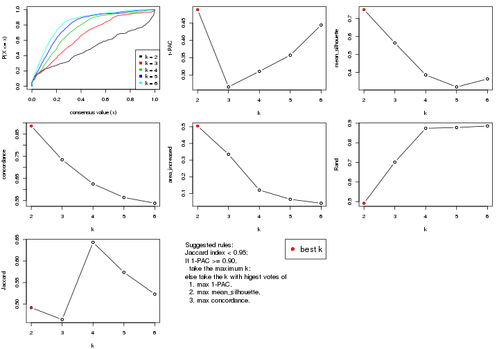

The numeric values for all these statistics can be obtained by `get_stats()`.

```r
get_stats(res)
```

```
#>   k 1-PAC mean_silhouette concordance area_increased  Rand Jaccard
#> 2 2 0.488           0.749       0.886         0.5042 0.492   0.492
#> 3 3 0.266           0.564       0.734         0.3345 0.701   0.464
#> 4 4 0.311           0.386       0.625         0.1200 0.874   0.643
#> 5 5 0.357           0.320       0.564         0.0649 0.878   0.574
#> 6 6 0.444           0.364       0.538         0.0411 0.886   0.523
```

`suggest_best_k()` suggests the best $k$ based on these statistics. The rules are as follows:

- All $k$ with Jaccard index larger than 0.95 are removed because increasing
  $k$ does not provide enough extra information. If all $k$ are removed, it is
  marked as no subgroup is detected.
- For all $k$ with 1-PAC score larger than 0.9, the maximal $k$ is taken as
  the best $k$, and other $k$ are marked as optional $k$.
- If it does not fit the second rule. The $k$ with the maximal vote of the
  highest 1-PAC score, highest mean silhouette, and highest concordance is
  taken as the best $k$.

```r
suggest_best_k(res)
```

```
#> [1] 2
```


Following shows the table of the partitions (You need to click the **show/hide
code output** link to see it). The membership matrix (columns with name `p*`)
is inferred by
[`clue::cl_consensus()`](https://www.rdocumentation.org/link/cl_consensus?package=clue)
function with the `SE` method. Basically the value in the membership matrix
represents the probability to belong to a certain group. The finall class
label for an item is determined with the group with highest probability it
belongs to.

In `get_classes()` function, the entropy is calculated from the membership
matrix and the silhouette score is calculated from the consensus matrix.


<script>
$( function() {
	$( '#tabs-MAD-skmeans-get-classes' ).tabs();
} );
</script>
<div id='tabs-MAD-skmeans-get-classes'>
<ul>
<li><a href='#tab-MAD-skmeans-get-classes-1'>k = 2</a></li>
<li><a href='#tab-MAD-skmeans-get-classes-2'>k = 3</a></li>
<li><a href='#tab-MAD-skmeans-get-classes-3'>k = 4</a></li>
<li><a href='#tab-MAD-skmeans-get-classes-4'>k = 5</a></li>
<li><a href='#tab-MAD-skmeans-get-classes-5'>k = 6</a></li>
</ul>

<div id='tab-MAD-skmeans-get-classes-1'>
<p><a id='tab-MAD-skmeans-get-classes-1-a' style='color:#0366d6' href='#'>show/hide code output</a></p>
<pre><code class="r">cbind(get_classes(res, k = 2), get_membership(res, k = 2))
</code></pre>

<pre><code>#&gt;           class entropy silhouette    p1    p2
#&gt; GSM687644     2  0.3733     0.8555 0.072 0.928
#&gt; GSM687648     1  0.6048     0.7854 0.852 0.148
#&gt; GSM687653     2  0.0000     0.8870 0.000 1.000
#&gt; GSM687658     1  0.3274     0.8286 0.940 0.060
#&gt; GSM687663     2  0.9044     0.5052 0.320 0.680
#&gt; GSM687668     2  0.1633     0.8864 0.024 0.976
#&gt; GSM687673     2  0.9850     0.2488 0.428 0.572
#&gt; GSM687678     1  0.9608     0.4937 0.616 0.384
#&gt; GSM687683     1  0.7745     0.7017 0.772 0.228
#&gt; GSM687688     2  0.0000     0.8870 0.000 1.000
#&gt; GSM687695     1  0.0000     0.8432 1.000 0.000
#&gt; GSM687699     1  0.4690     0.8136 0.900 0.100
#&gt; GSM687704     2  0.0000     0.8870 0.000 1.000
#&gt; GSM687707     2  0.9988    -0.0277 0.480 0.520
#&gt; GSM687712     2  0.4022     0.8581 0.080 0.920
#&gt; GSM687719     1  0.0000     0.8432 1.000 0.000
#&gt; GSM687724     2  0.6148     0.7914 0.152 0.848
#&gt; GSM687728     1  0.0000     0.8432 1.000 0.000
#&gt; GSM687646     2  0.1633     0.8848 0.024 0.976
#&gt; GSM687649     1  0.9209     0.5895 0.664 0.336
#&gt; GSM687665     1  0.9044     0.5383 0.680 0.320
#&gt; GSM687651     1  0.9209     0.5826 0.664 0.336
#&gt; GSM687667     2  0.1843     0.8860 0.028 0.972
#&gt; GSM687670     2  0.2778     0.8767 0.048 0.952
#&gt; GSM687671     2  0.0672     0.8874 0.008 0.992
#&gt; GSM687654     2  0.0000     0.8870 0.000 1.000
#&gt; GSM687675     1  0.9944     0.1232 0.544 0.456
#&gt; GSM687685     1  0.8909     0.6171 0.692 0.308
#&gt; GSM687656     2  0.0000     0.8870 0.000 1.000
#&gt; GSM687677     2  0.3431     0.8671 0.064 0.936
#&gt; GSM687687     2  0.1843     0.8844 0.028 0.972
#&gt; GSM687692     2  0.0000     0.8870 0.000 1.000
#&gt; GSM687716     2  0.2043     0.8818 0.032 0.968
#&gt; GSM687722     1  0.0000     0.8432 1.000 0.000
#&gt; GSM687680     1  0.7602     0.7321 0.780 0.220
#&gt; GSM687690     2  0.0938     0.8884 0.012 0.988
#&gt; GSM687700     1  0.0000     0.8432 1.000 0.000
#&gt; GSM687705     2  0.0000     0.8870 0.000 1.000
#&gt; GSM687714     2  0.2423     0.8792 0.040 0.960
#&gt; GSM687721     1  0.0000     0.8432 1.000 0.000
#&gt; GSM687682     1  0.8861     0.6357 0.696 0.304
#&gt; GSM687694     2  0.0000     0.8870 0.000 1.000
#&gt; GSM687702     1  0.1414     0.8398 0.980 0.020
#&gt; GSM687718     2  0.2236     0.8803 0.036 0.964
#&gt; GSM687723     1  0.0672     0.8419 0.992 0.008
#&gt; GSM687661     1  0.0376     0.8427 0.996 0.004
#&gt; GSM687710     2  0.9996    -0.0983 0.488 0.512
#&gt; GSM687726     2  0.4562     0.8446 0.096 0.904
#&gt; GSM687730     1  0.0000     0.8432 1.000 0.000
#&gt; GSM687660     1  0.0000     0.8432 1.000 0.000
#&gt; GSM687697     1  0.0000     0.8432 1.000 0.000
#&gt; GSM687709     1  0.9850     0.3138 0.572 0.428
#&gt; GSM687725     2  0.7219     0.7319 0.200 0.800
#&gt; GSM687729     1  0.0000     0.8432 1.000 0.000
#&gt; GSM687727     2  0.2236     0.8808 0.036 0.964
#&gt; GSM687731     1  0.0000     0.8432 1.000 0.000
</code></pre>

<script>
$('#tab-MAD-skmeans-get-classes-1-a').parent().next().next().hide();
$('#tab-MAD-skmeans-get-classes-1-a').click(function(){
  $('#tab-MAD-skmeans-get-classes-1-a').parent().next().next().toggle();
  return(false);
});
</script>
</div>

<div id='tab-MAD-skmeans-get-classes-2'>
<p><a id='tab-MAD-skmeans-get-classes-2-a' style='color:#0366d6' href='#'>show/hide code output</a></p>
<pre><code class="r">cbind(get_classes(res, k = 3), get_membership(res, k = 3))
</code></pre>

<pre><code>#&gt;           class entropy silhouette    p1    p2    p3
#&gt; GSM687644     3  0.4353     0.5359 0.008 0.156 0.836
#&gt; GSM687648     3  0.8884     0.2494 0.420 0.120 0.460
#&gt; GSM687653     2  0.5560     0.6208 0.000 0.700 0.300
#&gt; GSM687658     1  0.8301     0.3286 0.592 0.108 0.300
#&gt; GSM687663     2  0.8386     0.4741 0.156 0.620 0.224
#&gt; GSM687668     2  0.6950     0.6550 0.056 0.692 0.252
#&gt; GSM687673     2  0.7677     0.5002 0.244 0.660 0.096
#&gt; GSM687678     3  0.8609     0.5299 0.196 0.200 0.604
#&gt; GSM687683     3  0.8604     0.3840 0.348 0.112 0.540
#&gt; GSM687688     2  0.5291     0.6542 0.000 0.732 0.268
#&gt; GSM687695     1  0.0237     0.8108 0.996 0.000 0.004
#&gt; GSM687699     1  0.8929    -0.1646 0.460 0.124 0.416
#&gt; GSM687704     2  0.5397     0.6674 0.000 0.720 0.280
#&gt; GSM687707     3  0.8895     0.3184 0.124 0.392 0.484
#&gt; GSM687712     3  0.4663     0.5366 0.016 0.156 0.828
#&gt; GSM687719     1  0.0424     0.8099 0.992 0.000 0.008
#&gt; GSM687724     2  0.5467     0.6879 0.072 0.816 0.112
#&gt; GSM687728     1  0.1267     0.7995 0.972 0.024 0.004
#&gt; GSM687646     3  0.4293     0.5335 0.004 0.164 0.832
#&gt; GSM687649     3  0.8546     0.5215 0.276 0.136 0.588
#&gt; GSM687665     2  0.8730     0.1735 0.388 0.500 0.112
#&gt; GSM687651     3  0.8600     0.5190 0.212 0.184 0.604
#&gt; GSM687667     2  0.5945     0.6378 0.024 0.740 0.236
#&gt; GSM687670     2  0.6211     0.6797 0.036 0.736 0.228
#&gt; GSM687671     2  0.5591     0.6550 0.000 0.696 0.304
#&gt; GSM687654     2  0.5397     0.6467 0.000 0.720 0.280
#&gt; GSM687675     1  0.8124    -0.0396 0.496 0.436 0.068
#&gt; GSM687685     3  0.8731     0.3974 0.352 0.120 0.528
#&gt; GSM687656     2  0.5760     0.5934 0.000 0.672 0.328
#&gt; GSM687677     2  0.6255     0.6982 0.048 0.748 0.204
#&gt; GSM687687     3  0.4555     0.5054 0.000 0.200 0.800
#&gt; GSM687692     2  0.5529     0.6473 0.000 0.704 0.296
#&gt; GSM687716     3  0.4504     0.4839 0.000 0.196 0.804
#&gt; GSM687722     1  0.1031     0.8031 0.976 0.000 0.024
#&gt; GSM687680     3  0.8523     0.1967 0.444 0.092 0.464
#&gt; GSM687690     2  0.6570     0.6480 0.028 0.680 0.292
#&gt; GSM687700     1  0.0000     0.8115 1.000 0.000 0.000
#&gt; GSM687705     2  0.5158     0.6894 0.004 0.764 0.232
#&gt; GSM687714     3  0.3983     0.5303 0.004 0.144 0.852
#&gt; GSM687721     1  0.0237     0.8108 0.996 0.000 0.004
#&gt; GSM687682     3  0.8404     0.5331 0.288 0.120 0.592
#&gt; GSM687694     2  0.5722     0.6443 0.004 0.704 0.292
#&gt; GSM687702     1  0.7490     0.2133 0.576 0.044 0.380
#&gt; GSM687718     3  0.4465     0.5165 0.004 0.176 0.820
#&gt; GSM687723     1  0.5848     0.6710 0.796 0.080 0.124
#&gt; GSM687661     1  0.7814     0.4582 0.652 0.104 0.244
#&gt; GSM687710     3  0.8173     0.4581 0.100 0.300 0.600
#&gt; GSM687726     2  0.3886     0.6990 0.024 0.880 0.096
#&gt; GSM687730     1  0.0000     0.8115 1.000 0.000 0.000
#&gt; GSM687660     1  0.0000     0.8115 1.000 0.000 0.000
#&gt; GSM687697     1  0.0000     0.8115 1.000 0.000 0.000
#&gt; GSM687709     3  0.9006     0.4307 0.160 0.304 0.536
#&gt; GSM687725     2  0.5339     0.6735 0.080 0.824 0.096
#&gt; GSM687729     1  0.0000     0.8115 1.000 0.000 0.000
#&gt; GSM687727     2  0.3771     0.6984 0.012 0.876 0.112
#&gt; GSM687731     1  0.0661     0.8077 0.988 0.008 0.004
</code></pre>

<script>
$('#tab-MAD-skmeans-get-classes-2-a').parent().next().next().hide();
$('#tab-MAD-skmeans-get-classes-2-a').click(function(){
  $('#tab-MAD-skmeans-get-classes-2-a').parent().next().next().toggle();
  return(false);
});
</script>
</div>

<div id='tab-MAD-skmeans-get-classes-3'>
<p><a id='tab-MAD-skmeans-get-classes-3-a' style='color:#0366d6' href='#'>show/hide code output</a></p>
<pre><code class="r">cbind(get_classes(res, k = 4), get_membership(res, k = 4))
</code></pre>

<pre><code>#&gt;           class entropy silhouette    p1    p2    p3    p4
#&gt; GSM687644     4  0.6443   0.368410 0.008 0.088 0.268 0.636
#&gt; GSM687648     3  0.7909   0.247103 0.216 0.020 0.516 0.248
#&gt; GSM687653     2  0.6995   0.330725 0.000 0.496 0.384 0.120
#&gt; GSM687658     1  0.8991  -0.038887 0.416 0.068 0.248 0.268
#&gt; GSM687663     3  0.8828  -0.241356 0.104 0.372 0.404 0.120
#&gt; GSM687668     2  0.7412   0.458709 0.028 0.604 0.180 0.188
#&gt; GSM687673     2  0.7719   0.375700 0.212 0.600 0.124 0.064
#&gt; GSM687678     3  0.8565   0.055365 0.100 0.096 0.416 0.388
#&gt; GSM687683     4  0.8369   0.113471 0.288 0.060 0.152 0.500
#&gt; GSM687688     2  0.4996   0.535485 0.000 0.752 0.056 0.192
#&gt; GSM687695     1  0.0844   0.787558 0.980 0.004 0.012 0.004
#&gt; GSM687699     3  0.8888   0.182100 0.316 0.060 0.404 0.220
#&gt; GSM687704     2  0.7443   0.410573 0.000 0.492 0.312 0.196
#&gt; GSM687707     3  0.8947   0.173776 0.084 0.172 0.420 0.324
#&gt; GSM687712     4  0.3641   0.508877 0.008 0.072 0.052 0.868
#&gt; GSM687719     1  0.1970   0.778292 0.932 0.000 0.060 0.008
#&gt; GSM687724     2  0.7514   0.431515 0.080 0.612 0.228 0.080
#&gt; GSM687728     1  0.3649   0.745782 0.872 0.044 0.068 0.016
#&gt; GSM687646     4  0.6219   0.355549 0.000 0.096 0.264 0.640
#&gt; GSM687649     3  0.8083   0.216705 0.088 0.088 0.536 0.288
#&gt; GSM687665     3  0.9294  -0.000565 0.296 0.296 0.328 0.080
#&gt; GSM687651     3  0.7253   0.209366 0.060 0.056 0.584 0.300
#&gt; GSM687667     2  0.7365   0.294227 0.012 0.452 0.424 0.112
#&gt; GSM687670     2  0.7580   0.431261 0.036 0.592 0.156 0.216
#&gt; GSM687671     2  0.7813   0.377169 0.008 0.488 0.244 0.260
#&gt; GSM687654     2  0.7345   0.340478 0.000 0.484 0.348 0.168
#&gt; GSM687675     2  0.7595   0.119313 0.408 0.460 0.108 0.024
#&gt; GSM687685     4  0.8757   0.140715 0.204 0.096 0.196 0.504
#&gt; GSM687656     2  0.7500   0.255619 0.000 0.412 0.408 0.180
#&gt; GSM687677     2  0.6567   0.532075 0.048 0.704 0.128 0.120
#&gt; GSM687687     4  0.5759   0.450750 0.000 0.112 0.180 0.708
#&gt; GSM687692     2  0.5607   0.516634 0.004 0.716 0.072 0.208
#&gt; GSM687716     4  0.3958   0.506125 0.000 0.112 0.052 0.836
#&gt; GSM687722     1  0.2156   0.777911 0.928 0.004 0.060 0.008
#&gt; GSM687680     4  0.9442  -0.193840 0.240 0.104 0.320 0.336
#&gt; GSM687690     2  0.5890   0.529181 0.020 0.724 0.076 0.180
#&gt; GSM687700     1  0.1489   0.782138 0.952 0.000 0.044 0.004
#&gt; GSM687705     2  0.7837   0.424675 0.012 0.500 0.264 0.224
#&gt; GSM687714     4  0.2586   0.519335 0.000 0.040 0.048 0.912
#&gt; GSM687721     1  0.1022   0.785937 0.968 0.000 0.032 0.000
#&gt; GSM687682     3  0.9318   0.064402 0.160 0.128 0.356 0.356
#&gt; GSM687694     2  0.4959   0.527186 0.000 0.752 0.052 0.196
#&gt; GSM687702     1  0.8887  -0.279733 0.368 0.056 0.352 0.224
#&gt; GSM687718     4  0.3392   0.526057 0.000 0.072 0.056 0.872
#&gt; GSM687723     1  0.7506   0.432561 0.608 0.040 0.196 0.156
#&gt; GSM687661     1  0.8554   0.244271 0.516 0.076 0.204 0.204
#&gt; GSM687710     3  0.8001   0.108571 0.044 0.112 0.448 0.396
#&gt; GSM687726     2  0.6837   0.452728 0.020 0.632 0.244 0.104
#&gt; GSM687730     1  0.2465   0.772839 0.924 0.020 0.044 0.012
#&gt; GSM687660     1  0.0524   0.787932 0.988 0.000 0.004 0.008
#&gt; GSM687697     1  0.0376   0.787922 0.992 0.000 0.004 0.004
#&gt; GSM687709     3  0.9174   0.171814 0.144 0.124 0.392 0.340
#&gt; GSM687725     2  0.7761   0.393506 0.120 0.592 0.224 0.064
#&gt; GSM687729     1  0.1509   0.784498 0.960 0.008 0.020 0.012
#&gt; GSM687727     2  0.5824   0.498821 0.004 0.704 0.204 0.088
#&gt; GSM687731     1  0.3057   0.759531 0.896 0.024 0.068 0.012
</code></pre>

<script>
$('#tab-MAD-skmeans-get-classes-3-a').parent().next().next().hide();
$('#tab-MAD-skmeans-get-classes-3-a').click(function(){
  $('#tab-MAD-skmeans-get-classes-3-a').parent().next().next().toggle();
  return(false);
});
</script>
</div>

<div id='tab-MAD-skmeans-get-classes-4'>
<p><a id='tab-MAD-skmeans-get-classes-4-a' style='color:#0366d6' href='#'>show/hide code output</a></p>
<pre><code class="r">cbind(get_classes(res, k = 5), get_membership(res, k = 5))
</code></pre>

<pre><code>#&gt;           class entropy silhouette    p1    p2    p3    p4    p5
#&gt; GSM687644     4  0.6833    0.35220 0.004 0.268 0.056 0.564 0.108
#&gt; GSM687648     2  0.6642    0.43190 0.120 0.668 0.064 0.108 0.040
#&gt; GSM687653     5  0.8081    0.16382 0.000 0.296 0.188 0.124 0.392
#&gt; GSM687658     1  0.9282    0.02247 0.356 0.224 0.200 0.152 0.068
#&gt; GSM687663     3  0.8532   -0.01536 0.060 0.276 0.400 0.052 0.212
#&gt; GSM687668     5  0.8480    0.22114 0.016 0.144 0.216 0.204 0.420
#&gt; GSM687673     5  0.8408    0.15109 0.128 0.088 0.324 0.048 0.412
#&gt; GSM687678     2  0.8624    0.28775 0.100 0.452 0.096 0.256 0.096
#&gt; GSM687683     4  0.8918    0.15906 0.196 0.160 0.136 0.436 0.072
#&gt; GSM687688     5  0.4977    0.33033 0.000 0.040 0.060 0.152 0.748
#&gt; GSM687695     1  0.0162    0.75331 0.996 0.004 0.000 0.000 0.000
#&gt; GSM687699     2  0.8835    0.28420 0.276 0.392 0.084 0.180 0.068
#&gt; GSM687704     5  0.8453    0.16538 0.000 0.176 0.264 0.228 0.332
#&gt; GSM687707     3  0.8555    0.13239 0.036 0.228 0.428 0.208 0.100
#&gt; GSM687712     4  0.3678    0.55706 0.004 0.064 0.040 0.852 0.040
#&gt; GSM687719     1  0.4816    0.69775 0.768 0.060 0.136 0.032 0.004
#&gt; GSM687724     3  0.7525    0.12869 0.056 0.036 0.472 0.084 0.352
#&gt; GSM687728     1  0.3581    0.69922 0.852 0.080 0.044 0.004 0.020
#&gt; GSM687646     4  0.6497    0.37596 0.000 0.268 0.052 0.584 0.096
#&gt; GSM687649     2  0.6377    0.41090 0.080 0.680 0.028 0.144 0.068
#&gt; GSM687665     3  0.9102    0.00165 0.268 0.204 0.340 0.048 0.140
#&gt; GSM687651     2  0.6251    0.35680 0.032 0.684 0.112 0.136 0.036
#&gt; GSM687667     3  0.8442   -0.12685 0.012 0.276 0.312 0.096 0.304
#&gt; GSM687670     5  0.7898    0.22443 0.012 0.108 0.232 0.156 0.492
#&gt; GSM687671     5  0.7923    0.24533 0.000 0.164 0.224 0.152 0.460
#&gt; GSM687654     5  0.7957    0.15791 0.000 0.280 0.220 0.096 0.404
#&gt; GSM687675     5  0.8336    0.03504 0.300 0.060 0.276 0.024 0.340
#&gt; GSM687685     4  0.9026    0.17519 0.132 0.212 0.100 0.428 0.128
#&gt; GSM687656     2  0.8073   -0.26857 0.000 0.356 0.176 0.124 0.344
#&gt; GSM687677     5  0.7417    0.25073 0.032 0.100 0.244 0.068 0.556
#&gt; GSM687687     4  0.7042    0.45432 0.000 0.164 0.092 0.576 0.168
#&gt; GSM687692     5  0.5228    0.32864 0.004 0.040 0.052 0.176 0.728
#&gt; GSM687716     4  0.4077    0.56734 0.000 0.048 0.056 0.824 0.072
#&gt; GSM687722     1  0.5950    0.65174 0.704 0.076 0.148 0.052 0.020
#&gt; GSM687680     2  0.8321    0.37711 0.188 0.472 0.060 0.220 0.060
#&gt; GSM687690     5  0.6023    0.32522 0.008 0.064 0.064 0.188 0.676
#&gt; GSM687700     1  0.2419    0.74349 0.904 0.064 0.028 0.004 0.000
#&gt; GSM687705     5  0.8538    0.14302 0.008 0.152 0.260 0.216 0.364
#&gt; GSM687714     4  0.3175    0.57750 0.000 0.040 0.040 0.876 0.044
#&gt; GSM687721     1  0.3265    0.73109 0.856 0.040 0.096 0.008 0.000
#&gt; GSM687682     2  0.8678    0.25312 0.140 0.416 0.060 0.284 0.100
#&gt; GSM687694     5  0.4627    0.34857 0.004 0.040 0.040 0.136 0.780
#&gt; GSM687702     2  0.8725    0.30489 0.256 0.412 0.116 0.172 0.044
#&gt; GSM687718     4  0.3720    0.56801 0.000 0.044 0.040 0.844 0.072
#&gt; GSM687723     1  0.9088    0.16971 0.372 0.156 0.240 0.180 0.052
#&gt; GSM687661     1  0.9136    0.13304 0.392 0.164 0.196 0.184 0.064
#&gt; GSM687710     3  0.8137   -0.12511 0.028 0.300 0.324 0.312 0.036
#&gt; GSM687726     3  0.7074    0.11714 0.024 0.044 0.512 0.080 0.340
#&gt; GSM687730     1  0.2486    0.74002 0.916 0.020 0.032 0.012 0.020
#&gt; GSM687660     1  0.1485    0.75566 0.948 0.020 0.032 0.000 0.000
#&gt; GSM687697     1  0.0000    0.75247 1.000 0.000 0.000 0.000 0.000
#&gt; GSM687709     3  0.9183    0.01813 0.072 0.232 0.324 0.272 0.100
#&gt; GSM687725     3  0.7265    0.11706 0.044 0.036 0.508 0.080 0.332
#&gt; GSM687729     1  0.0898    0.74757 0.972 0.020 0.008 0.000 0.000
#&gt; GSM687727     3  0.6631    0.05358 0.000 0.056 0.448 0.068 0.428
#&gt; GSM687731     1  0.3218    0.69066 0.856 0.108 0.020 0.000 0.016
</code></pre>

<script>
$('#tab-MAD-skmeans-get-classes-4-a').parent().next().next().hide();
$('#tab-MAD-skmeans-get-classes-4-a').click(function(){
  $('#tab-MAD-skmeans-get-classes-4-a').parent().next().next().toggle();
  return(false);
});
</script>
</div>

<div id='tab-MAD-skmeans-get-classes-5'>
<p><a id='tab-MAD-skmeans-get-classes-5-a' style='color:#0366d6' href='#'>show/hide code output</a></p>
<pre><code class="r">cbind(get_classes(res, k = 6), get_membership(res, k = 6))
</code></pre>

<pre><code>#&gt;           class entropy silhouette    p1    p2    p3    p4    p5    p6
#&gt; GSM687644     4  0.7353     0.3378 0.008 0.264 0.024 0.468 0.168 0.068
#&gt; GSM687648     2  0.5601     0.4693 0.120 0.712 0.024 0.068 0.060 0.016
#&gt; GSM687653     5  0.6162     0.3674 0.000 0.100 0.092 0.108 0.656 0.044
#&gt; GSM687658     6  0.8799     0.1571 0.236 0.212 0.052 0.108 0.048 0.344
#&gt; GSM687663     5  0.7488     0.1502 0.020 0.068 0.256 0.036 0.492 0.128
#&gt; GSM687668     5  0.8580     0.1481 0.012 0.040 0.212 0.200 0.284 0.252
#&gt; GSM687673     6  0.8430    -0.0372 0.056 0.064 0.316 0.036 0.204 0.324
#&gt; GSM687678     2  0.8501     0.2633 0.080 0.408 0.036 0.204 0.200 0.072
#&gt; GSM687683     4  0.8554     0.2563 0.128 0.120 0.044 0.424 0.068 0.216
#&gt; GSM687688     5  0.8215     0.2511 0.004 0.048 0.296 0.188 0.336 0.128
#&gt; GSM687695     1  0.0951     0.7773 0.968 0.008 0.004 0.000 0.000 0.020
#&gt; GSM687699     2  0.8440     0.2586 0.236 0.416 0.036 0.148 0.060 0.104
#&gt; GSM687704     5  0.6594     0.3392 0.008 0.060 0.116 0.128 0.628 0.060
#&gt; GSM687707     3  0.9264    -0.0822 0.032 0.192 0.260 0.160 0.112 0.244
#&gt; GSM687712     4  0.4734     0.5421 0.004 0.068 0.044 0.776 0.036 0.072
#&gt; GSM687719     1  0.5126     0.5757 0.652 0.028 0.032 0.004 0.012 0.272
#&gt; GSM687724     3  0.4712     0.5632 0.056 0.028 0.776 0.016 0.100 0.024
#&gt; GSM687728     1  0.4809     0.6536 0.768 0.092 0.044 0.012 0.016 0.068
#&gt; GSM687646     4  0.6806     0.3676 0.000 0.228 0.024 0.536 0.148 0.064
#&gt; GSM687649     2  0.5354     0.4472 0.044 0.732 0.024 0.064 0.116 0.020
#&gt; GSM687665     5  0.8626     0.0713 0.200 0.088 0.156 0.036 0.416 0.104
#&gt; GSM687651     2  0.6397     0.4012 0.024 0.648 0.048 0.068 0.160 0.052
#&gt; GSM687667     5  0.6473     0.2839 0.004 0.096 0.128 0.052 0.636 0.084
#&gt; GSM687670     6  0.8413    -0.1875 0.020 0.044 0.252 0.096 0.284 0.304
#&gt; GSM687671     5  0.8300     0.1806 0.004 0.036 0.204 0.172 0.304 0.280
#&gt; GSM687654     5  0.4887     0.4032 0.000 0.052 0.052 0.088 0.760 0.048
#&gt; GSM687675     6  0.8694     0.1190 0.244 0.040 0.272 0.028 0.140 0.276
#&gt; GSM687685     4  0.9132     0.1272 0.136 0.200 0.056 0.328 0.072 0.208
#&gt; GSM687656     5  0.5130     0.3721 0.000 0.112 0.044 0.084 0.732 0.028
#&gt; GSM687677     5  0.7806     0.1064 0.004 0.052 0.324 0.052 0.340 0.228
#&gt; GSM687687     4  0.6892     0.4574 0.000 0.100 0.044 0.576 0.152 0.128
#&gt; GSM687692     5  0.8450     0.2512 0.004 0.052 0.264 0.204 0.308 0.168
#&gt; GSM687716     4  0.4695     0.5541 0.000 0.040 0.088 0.772 0.056 0.044
#&gt; GSM687722     1  0.5941     0.4696 0.580 0.064 0.016 0.020 0.016 0.304
#&gt; GSM687680     2  0.7722     0.4016 0.148 0.516 0.012 0.132 0.064 0.128
#&gt; GSM687690     5  0.8692     0.2486 0.016 0.080 0.272 0.156 0.332 0.144
#&gt; GSM687700     1  0.3307     0.7350 0.840 0.076 0.000 0.004 0.008 0.072
#&gt; GSM687705     5  0.7149     0.2727 0.000 0.056 0.168 0.172 0.536 0.068
#&gt; GSM687714     4  0.4316     0.5619 0.004 0.080 0.056 0.800 0.024 0.036
#&gt; GSM687721     1  0.3930     0.6431 0.728 0.032 0.004 0.000 0.000 0.236
#&gt; GSM687682     2  0.8826     0.3440 0.120 0.432 0.064 0.140 0.120 0.124
#&gt; GSM687694     5  0.8496     0.2527 0.004 0.056 0.268 0.200 0.300 0.172
#&gt; GSM687702     2  0.7514     0.3306 0.168 0.524 0.020 0.120 0.028 0.140
#&gt; GSM687718     4  0.4197     0.5597 0.000 0.076 0.044 0.804 0.052 0.024
#&gt; GSM687723     6  0.7874     0.0941 0.312 0.092 0.048 0.068 0.044 0.436
#&gt; GSM687661     6  0.8664     0.1689 0.260 0.148 0.048 0.152 0.036 0.356
#&gt; GSM687710     2  0.8976    -0.0281 0.012 0.296 0.168 0.192 0.112 0.220
#&gt; GSM687726     3  0.4309     0.5842 0.008 0.028 0.800 0.036 0.096 0.032
#&gt; GSM687730     1  0.3403     0.7320 0.848 0.036 0.068 0.000 0.008 0.040
#&gt; GSM687660     1  0.1956     0.7651 0.908 0.008 0.004 0.000 0.000 0.080
#&gt; GSM687697     1  0.0837     0.7764 0.972 0.004 0.004 0.000 0.000 0.020
#&gt; GSM687709     6  0.9368    -0.0377 0.040 0.192 0.196 0.188 0.112 0.272
#&gt; GSM687725     3  0.4316     0.5825 0.024 0.012 0.808 0.040 0.064 0.052
#&gt; GSM687729     1  0.0976     0.7717 0.968 0.008 0.016 0.000 0.000 0.008
#&gt; GSM687727     3  0.4268     0.5589 0.000 0.016 0.780 0.044 0.132 0.028
#&gt; GSM687731     1  0.4299     0.6488 0.776 0.124 0.028 0.000 0.008 0.064
</code></pre>

<script>
$('#tab-MAD-skmeans-get-classes-5-a').parent().next().next().hide();
$('#tab-MAD-skmeans-get-classes-5-a').click(function(){
  $('#tab-MAD-skmeans-get-classes-5-a').parent().next().next().toggle();
  return(false);
});
</script>
</div>
</div>

Heatmaps for the consensus matrix. It visualizes the probability of two
samples to be in a same group.


<script>
$( function() {
	$( '#tabs-MAD-skmeans-consensus-heatmap' ).tabs();
} );
</script>
<div id='tabs-MAD-skmeans-consensus-heatmap'>
<ul>
<li><a href='#tab-MAD-skmeans-consensus-heatmap-1'>k = 2</a></li>
<li><a href='#tab-MAD-skmeans-consensus-heatmap-2'>k = 3</a></li>
<li><a href='#tab-MAD-skmeans-consensus-heatmap-3'>k = 4</a></li>
<li><a href='#tab-MAD-skmeans-consensus-heatmap-4'>k = 5</a></li>
<li><a href='#tab-MAD-skmeans-consensus-heatmap-5'>k = 6</a></li>
</ul>
<div id='tab-MAD-skmeans-consensus-heatmap-1'>
<pre><code class="r">consensus_heatmap(res, k = 2)
</code></pre>

<p>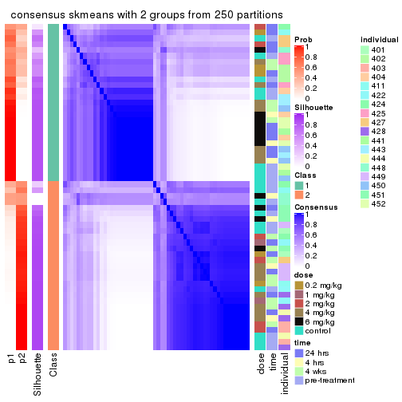</p>

</div>
<div id='tab-MAD-skmeans-consensus-heatmap-2'>
<pre><code class="r">consensus_heatmap(res, k = 3)
</code></pre>

<p>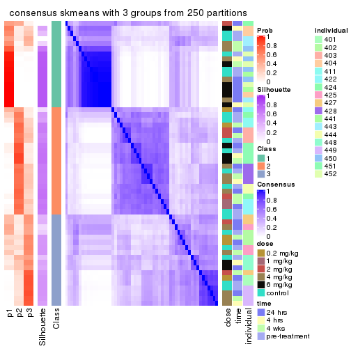</p>

</div>
<div id='tab-MAD-skmeans-consensus-heatmap-3'>
<pre><code class="r">consensus_heatmap(res, k = 4)
</code></pre>

<p>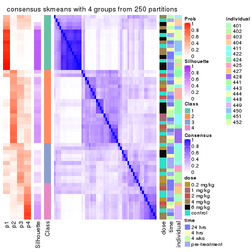</p>

</div>
<div id='tab-MAD-skmeans-consensus-heatmap-4'>
<pre><code class="r">consensus_heatmap(res, k = 5)
</code></pre>

<p>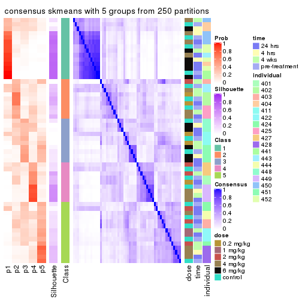</p>

</div>
<div id='tab-MAD-skmeans-consensus-heatmap-5'>
<pre><code class="r">consensus_heatmap(res, k = 6)
</code></pre>

<p>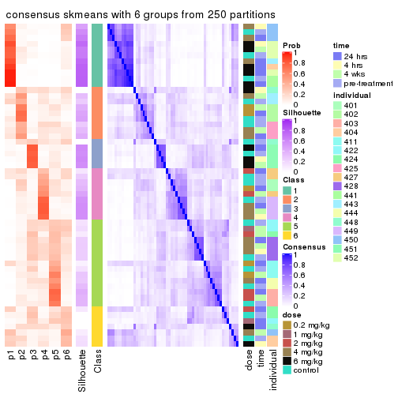</p>

</div>
</div>

Heatmaps for the membership of samples in all partitions to see how consistent they are:


<script>
$( function() {
	$( '#tabs-MAD-skmeans-membership-heatmap' ).tabs();
} );
</script>
<div id='tabs-MAD-skmeans-membership-heatmap'>
<ul>
<li><a href='#tab-MAD-skmeans-membership-heatmap-1'>k = 2</a></li>
<li><a href='#tab-MAD-skmeans-membership-heatmap-2'>k = 3</a></li>
<li><a href='#tab-MAD-skmeans-membership-heatmap-3'>k = 4</a></li>
<li><a href='#tab-MAD-skmeans-membership-heatmap-4'>k = 5</a></li>
<li><a href='#tab-MAD-skmeans-membership-heatmap-5'>k = 6</a></li>
</ul>
<div id='tab-MAD-skmeans-membership-heatmap-1'>
<pre><code class="r">membership_heatmap(res, k = 2)
</code></pre>

<p>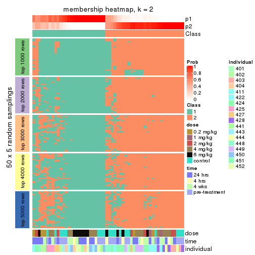</p>

</div>
<div id='tab-MAD-skmeans-membership-heatmap-2'>
<pre><code class="r">membership_heatmap(res, k = 3)
</code></pre>

<p>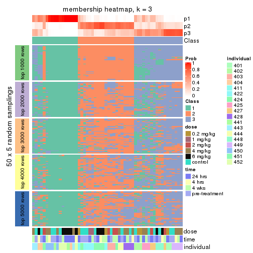</p>

</div>
<div id='tab-MAD-skmeans-membership-heatmap-3'>
<pre><code class="r">membership_heatmap(res, k = 4)
</code></pre>

<p>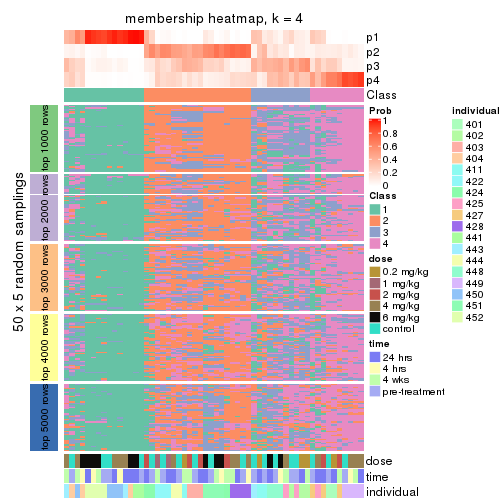</p>

</div>
<div id='tab-MAD-skmeans-membership-heatmap-4'>
<pre><code class="r">membership_heatmap(res, k = 5)
</code></pre>

<p>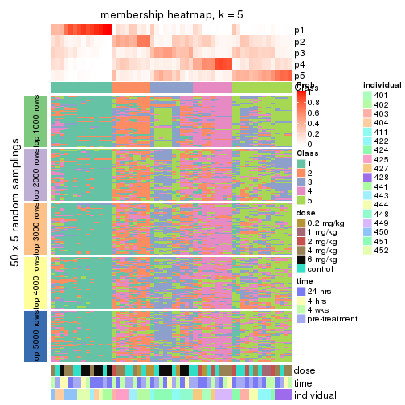</p>

</div>
<div id='tab-MAD-skmeans-membership-heatmap-5'>
<pre><code class="r">membership_heatmap(res, k = 6)
</code></pre>

<p>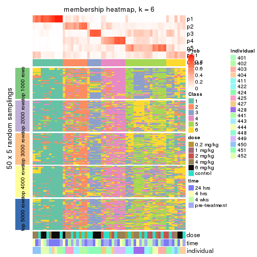</p>

</div>
</div>

As soon as we have had the classes for columns, we can look for signatures
which are significantly different between classes which can be candidate marks
for certain classes. Following are the heatmaps for signatures.


Signature heatmaps where rows are scaled:


<script>
$( function() {
	$( '#tabs-MAD-skmeans-get-signatures' ).tabs();
} );
</script>
<div id='tabs-MAD-skmeans-get-signatures'>
<ul>
<li><a href='#tab-MAD-skmeans-get-signatures-1'>k = 2</a></li>
<li><a href='#tab-MAD-skmeans-get-signatures-2'>k = 3</a></li>
<li><a href='#tab-MAD-skmeans-get-signatures-3'>k = 4</a></li>
<li><a href='#tab-MAD-skmeans-get-signatures-4'>k = 5</a></li>
<li><a href='#tab-MAD-skmeans-get-signatures-5'>k = 6</a></li>
</ul>
<div id='tab-MAD-skmeans-get-signatures-1'>
<pre><code class="r">get_signatures(res, k = 2)
</code></pre>

<p>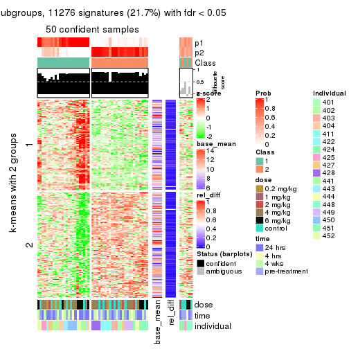</p>

</div>
<div id='tab-MAD-skmeans-get-signatures-2'>
<pre><code class="r">get_signatures(res, k = 3)
</code></pre>

<p>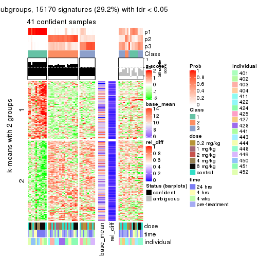</p>

</div>
<div id='tab-MAD-skmeans-get-signatures-3'>
<pre><code class="r">get_signatures(res, k = 4)
</code></pre>

<p>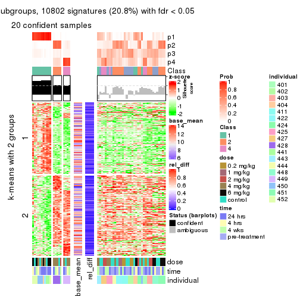</p>

</div>
<div id='tab-MAD-skmeans-get-signatures-4'>
<pre><code class="r">get_signatures(res, k = 5)
</code></pre>

<p>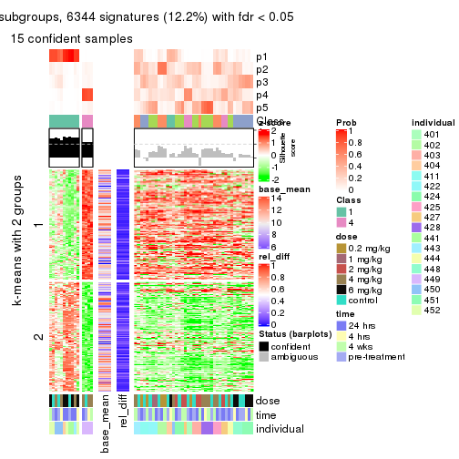</p>

</div>
<div id='tab-MAD-skmeans-get-signatures-5'>
<pre><code class="r">get_signatures(res, k = 6)
</code></pre>

<p>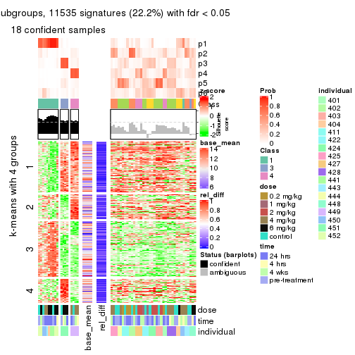</p>

</div>
</div>


Signature heatmaps where rows are not scaled:


<script>
$( function() {
	$( '#tabs-MAD-skmeans-get-signatures-no-scale' ).tabs();
} );
</script>
<div id='tabs-MAD-skmeans-get-signatures-no-scale'>
<ul>
<li><a href='#tab-MAD-skmeans-get-signatures-no-scale-1'>k = 2</a></li>
<li><a href='#tab-MAD-skmeans-get-signatures-no-scale-2'>k = 3</a></li>
<li><a href='#tab-MAD-skmeans-get-signatures-no-scale-3'>k = 4</a></li>
<li><a href='#tab-MAD-skmeans-get-signatures-no-scale-4'>k = 5</a></li>
<li><a href='#tab-MAD-skmeans-get-signatures-no-scale-5'>k = 6</a></li>
</ul>
<div id='tab-MAD-skmeans-get-signatures-no-scale-1'>
<pre><code class="r">get_signatures(res, k = 2, scale_rows = FALSE)
</code></pre>

<p>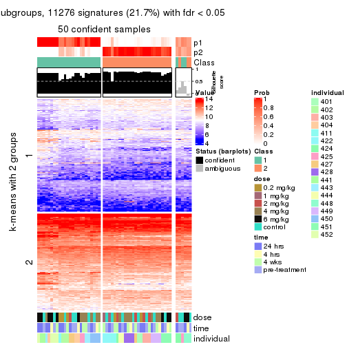</p>

</div>
<div id='tab-MAD-skmeans-get-signatures-no-scale-2'>
<pre><code class="r">get_signatures(res, k = 3, scale_rows = FALSE)
</code></pre>

<p>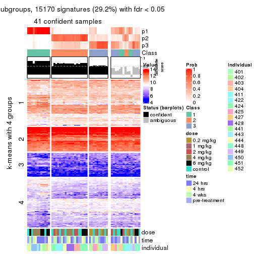</p>

</div>
<div id='tab-MAD-skmeans-get-signatures-no-scale-3'>
<pre><code class="r">get_signatures(res, k = 4, scale_rows = FALSE)
</code></pre>

<p>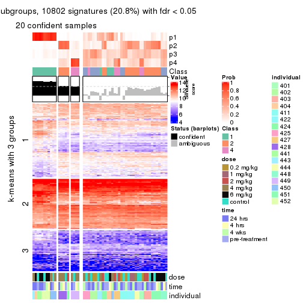</p>

</div>
<div id='tab-MAD-skmeans-get-signatures-no-scale-4'>
<pre><code class="r">get_signatures(res, k = 5, scale_rows = FALSE)
</code></pre>

<p>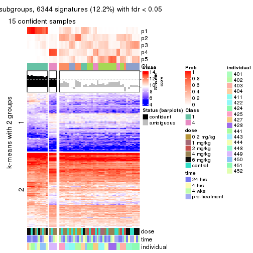</p>

</div>
<div id='tab-MAD-skmeans-get-signatures-no-scale-5'>
<pre><code class="r">get_signatures(res, k = 6, scale_rows = FALSE)
</code></pre>

<p>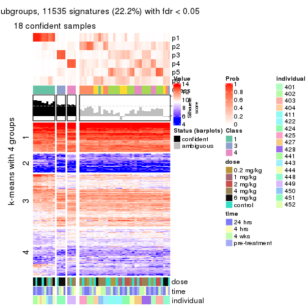</p>

</div>
</div>


Compare the overlap of signatures from different k:

```r
compare_signatures(res)
```

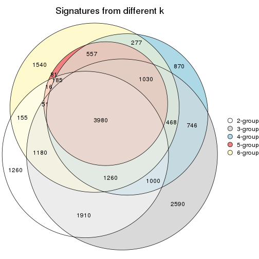

`get_signature()` returns a data frame invisibly. TO get the list of signatures, the function
call should be assigned to a variable explicitly. In following code, if `plot` argument is set
to `FALSE`, no heatmap is plotted while only the differential analysis is performed.

```r
# code only for demonstration
tb = get_signature(res, k = ..., plot = FALSE)
```

An example of the output of `tb` is:

```
#>   which_row         fdr    mean_1    mean_2 scaled_mean_1 scaled_mean_2 km
#> 1        38 0.042760348  8.373488  9.131774    -0.5533452     0.5164555  1
#> 2        40 0.018707592  7.106213  8.469186    -0.6173731     0.5762149  1
#> 3        55 0.019134737 10.221463 11.207825    -0.6159697     0.5749050  1
#> 4        59 0.006059896  5.921854  7.869574    -0.6899429     0.6439467  1
#> 5        60 0.018055526  8.928898 10.211722    -0.6204761     0.5791110  1
#> 6        98 0.009384629 15.714769 14.887706     0.6635654    -0.6193277  2
...
```

The columns in `tb` are:

1. `which_row`: row indices corresponding to the input matrix.
2. `fdr`: FDR for the differential test. 
3. `mean_x`: The mean value in group x.
4. `scaled_mean_x`: The mean value in group x after rows are scaled.
5. `km`: Row groups if k-means clustering is applied to rows.


UMAP plot which shows how samples are separated.


<script>
$( function() {
	$( '#tabs-MAD-skmeans-dimension-reduction' ).tabs();
} );
</script>
<div id='tabs-MAD-skmeans-dimension-reduction'>
<ul>
<li><a href='#tab-MAD-skmeans-dimension-reduction-1'>k = 2</a></li>
<li><a href='#tab-MAD-skmeans-dimension-reduction-2'>k = 3</a></li>
<li><a href='#tab-MAD-skmeans-dimension-reduction-3'>k = 4</a></li>
<li><a href='#tab-MAD-skmeans-dimension-reduction-4'>k = 5</a></li>
<li><a href='#tab-MAD-skmeans-dimension-reduction-5'>k = 6</a></li>
</ul>
<div id='tab-MAD-skmeans-dimension-reduction-1'>
<pre><code class="r">dimension_reduction(res, k = 2, method = &quot;UMAP&quot;)
</code></pre>

<p>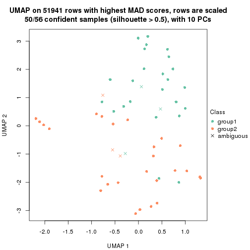</p>

</div>
<div id='tab-MAD-skmeans-dimension-reduction-2'>
<pre><code class="r">dimension_reduction(res, k = 3, method = &quot;UMAP&quot;)
</code></pre>

<p>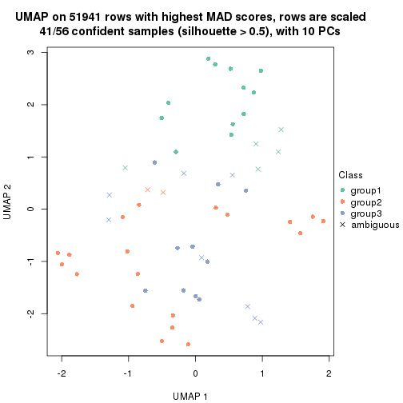</p>

</div>
<div id='tab-MAD-skmeans-dimension-reduction-3'>
<pre><code class="r">dimension_reduction(res, k = 4, method = &quot;UMAP&quot;)
</code></pre>

<p>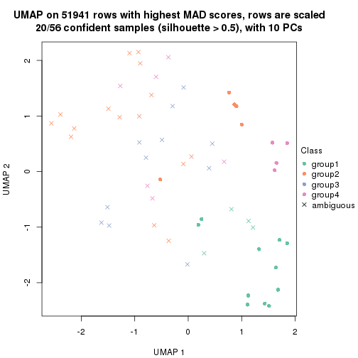</p>

</div>
<div id='tab-MAD-skmeans-dimension-reduction-4'>
<pre><code class="r">dimension_reduction(res, k = 5, method = &quot;UMAP&quot;)
</code></pre>

<p>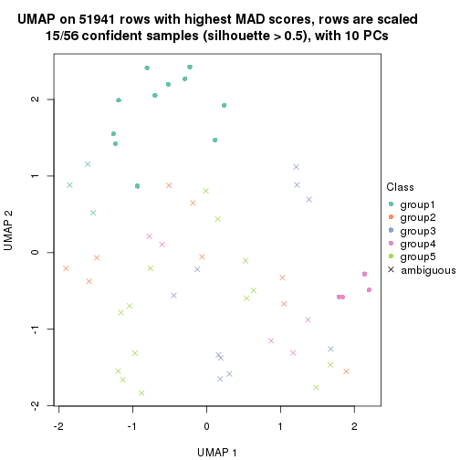</p>

</div>
<div id='tab-MAD-skmeans-dimension-reduction-5'>
<pre><code class="r">dimension_reduction(res, k = 6, method = &quot;UMAP&quot;)
</code></pre>

<p>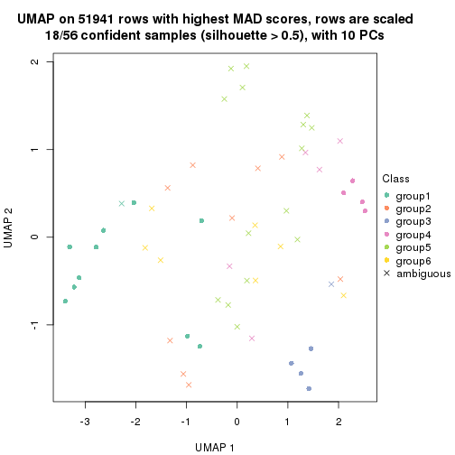</p>

</div>
</div>


Following heatmap shows how subgroups are split when increasing `k`:

```r
collect_classes(res)
```

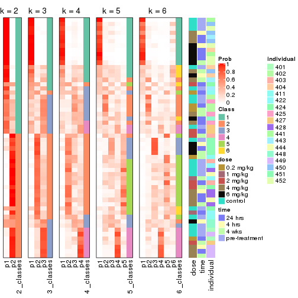


Test correlation between subgroups and known annotations. If the known
annotation is numeric, one-way ANOVA test is applied, and if the known
annotation is discrete, chi-squared contingency table test is applied.

```r
test_to_known_factors(res)
```

```
#>              n dose(p) time(p) individual(p) k
#> MAD:skmeans 50   0.417   0.818      1.57e-04 2
#> MAD:skmeans 41   0.110   0.767      2.87e-06 3
#> MAD:skmeans 20   0.175   0.854      2.55e-04 4
#> MAD:skmeans 15   0.174   0.816      1.04e-02 5
#> MAD:skmeans 18   0.122   0.924      3.24e-04 6
```


If matrix rows can be associated to genes, consider to use `functional_enrichment(res,
...)` to perform function enrichment for the signature genes. See [this vignette](http://bioconductor.org/packages/devel/bioc/vignettes/cola/inst/doc/functional_enrichment.html) for more detailed explanations.


 

---------------------------------------------------


### MAD:pam


The object with results only for a single top-value method and a single partition method 
can be extracted as:

```r
res = res_list["MAD", "pam"]
# you can also extract it by
# res = res_list["MAD:pam"]
```

A summary of `res` and all the functions that can be applied to it:

```r
res
```

```
#> A 'ConsensusPartition' object with k = 2, 3, 4, 5, 6.
#>   On a matrix with 51941 rows and 56 columns.
#>   Top rows (1000, 2000, 3000, 4000, 5000) are extracted by 'MAD' method.
#>   Subgroups are detected by 'pam' method.
#>   Performed in total 1250 partitions by row resampling.
#>   Best k for subgroups seems to be 2.
#> 
#> Following methods can be applied to this 'ConsensusPartition' object:
#>  [1] "cola_report"             "collect_classes"         "collect_plots"          
#>  [4] "collect_stats"           "colnames"                "compare_signatures"     
#>  [7] "consensus_heatmap"       "dimension_reduction"     "functional_enrichment"  
#> [10] "get_anno_col"            "get_anno"                "get_classes"            
#> [13] "get_consensus"           "get_matrix"              "get_membership"         
#> [16] "get_param"               "get_signatures"          "get_stats"              
#> [19] "is_best_k"               "is_stable_k"             "membership_heatmap"     
#> [22] "ncol"                    "nrow"                    "plot_ecdf"              
#> [25] "rownames"                "select_partition_number" "show"                   
#> [28] "suggest_best_k"          "test_to_known_factors"
```

`collect_plots()` function collects all the plots made from `res` for all `k` (number of partitions)
into one single page to provide an easy and fast comparison between different `k`.

```r
collect_plots(res)
```

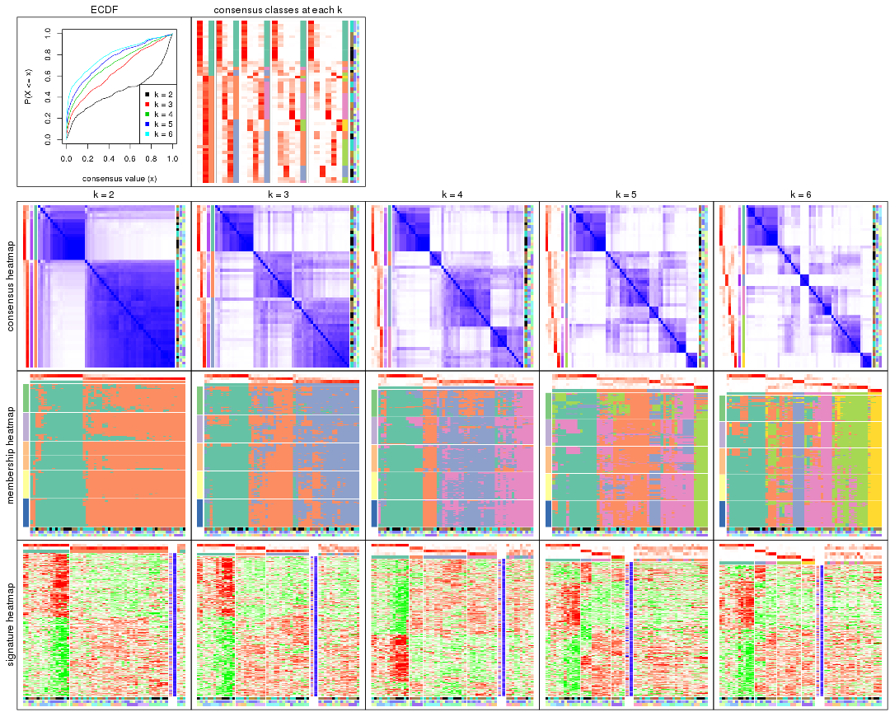

The plots are:

- The first row: a plot of the ECDF (empirical cumulative distribution
  function) curves of the consensus matrix for each `k` and the heatmap of
  predicted classes for each `k`.
- The second row: heatmaps of the consensus matrix for each `k`.
- The third row: heatmaps of the membership matrix for each `k`.
- The fouth row: heatmaps of the signatures for each `k`.

All the plots in panels can be made by individual functions and they are
plotted later in this section.

`select_partition_number()` produces several plots showing different
statistics for choosing "optimized" `k`. There are following statistics:

- ECDF curves of the consensus matrix for each `k`;
- 1-PAC. [The PAC
  score](https://en.wikipedia.org/wiki/Consensus_clustering#Over-interpretation_potential_of_consensus_clustering)
  measures the proportion of the ambiguous subgrouping.
- Mean silhouette score.
- Concordance. The mean probability of fiting the consensus class ids in all
  partitions.
- Area increased. Denote $A_k$ as the area under the ECDF curve for current
  `k`, the area increased is defined as $A_k - A_{k-1}$.
- Rand index. The percent of pairs of samples that are both in a same cluster
  or both are not in a same cluster in the partition of k and k-1.
- Jaccard index. The ratio of pairs of samples are both in a same cluster in
  the partition of k and k-1 and the pairs of samples are both in a same
  cluster in the partition k or k-1.

The detailed explanations of these statistics can be found in [the _cola_
vignette](http://bioconductor.org/packages/devel/bioc/vignettes/cola/inst/doc/cola.html#toc_13).

Generally speaking, lower PAC score, higher mean silhouette score or higher
concordance corresponds to better partition. Rand index and Jaccard index
measure how similar the current partition is compared to partition with `k-1`.
If they are too similar, we won't accept `k` is better than `k-1`.

```r
select_partition_number(res)
```

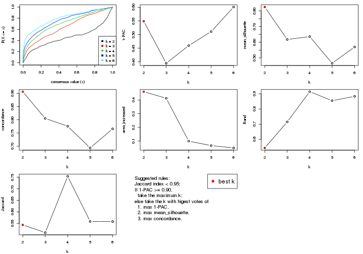

The numeric values for all these statistics can be obtained by `get_stats()`.

```r
get_stats(res)
```

```
#>   k 1-PAC mean_silhouette concordance area_increased  Rand Jaccard
#> 2 2 0.549           0.824       0.906         0.4603 0.544   0.544
#> 3 3 0.395           0.618       0.805         0.4124 0.715   0.510
#> 4 4 0.459           0.636       0.776         0.0998 0.914   0.754
#> 5 5 0.511           0.466       0.694         0.0671 0.855   0.558
#> 6 6 0.601           0.570       0.766         0.0502 0.883   0.558
```

`suggest_best_k()` suggests the best $k$ based on these statistics. The rules are as follows:

- All $k$ with Jaccard index larger than 0.95 are removed because increasing
  $k$ does not provide enough extra information. If all $k$ are removed, it is
  marked as no subgroup is detected.
- For all $k$ with 1-PAC score larger than 0.9, the maximal $k$ is taken as
  the best $k$, and other $k$ are marked as optional $k$.
- If it does not fit the second rule. The $k$ with the maximal vote of the
  highest 1-PAC score, highest mean silhouette, and highest concordance is
  taken as the best $k$.

```r
suggest_best_k(res)
```

```
#> [1] 2
```


Following shows the table of the partitions (You need to click the **show/hide
code output** link to see it). The membership matrix (columns with name `p*`)
is inferred by
[`clue::cl_consensus()`](https://www.rdocumentation.org/link/cl_consensus?package=clue)
function with the `SE` method. Basically the value in the membership matrix
represents the probability to belong to a certain group. The finall class
label for an item is determined with the group with highest probability it
belongs to.

In `get_classes()` function, the entropy is calculated from the membership
matrix and the silhouette score is calculated from the consensus matrix.


<script>
$( function() {
	$( '#tabs-MAD-pam-get-classes' ).tabs();
} );
</script>
<div id='tabs-MAD-pam-get-classes'>
<ul>
<li><a href='#tab-MAD-pam-get-classes-1'>k = 2</a></li>
<li><a href='#tab-MAD-pam-get-classes-2'>k = 3</a></li>
<li><a href='#tab-MAD-pam-get-classes-3'>k = 4</a></li>
<li><a href='#tab-MAD-pam-get-classes-4'>k = 5</a></li>
<li><a href='#tab-MAD-pam-get-classes-5'>k = 6</a></li>
</ul>

<div id='tab-MAD-pam-get-classes-1'>
<p><a id='tab-MAD-pam-get-classes-1-a' style='color:#0366d6' href='#'>show/hide code output</a></p>
<pre><code class="r">cbind(get_classes(res, k = 2), get_membership(res, k = 2))
</code></pre>

<pre><code>#&gt;           class entropy silhouette    p1    p2
#&gt; GSM687644     2  0.6712      0.835 0.176 0.824
#&gt; GSM687648     1  0.9850      0.135 0.572 0.428
#&gt; GSM687653     2  0.2603      0.908 0.044 0.956
#&gt; GSM687658     2  0.7139      0.825 0.196 0.804
#&gt; GSM687663     2  0.2778      0.912 0.048 0.952
#&gt; GSM687668     2  0.2423      0.912 0.040 0.960
#&gt; GSM687673     2  0.9896      0.057 0.440 0.560
#&gt; GSM687678     2  0.8016      0.722 0.244 0.756
#&gt; GSM687683     2  0.9087      0.583 0.324 0.676
#&gt; GSM687688     2  0.0000      0.906 0.000 1.000
#&gt; GSM687695     1  0.0000      0.882 1.000 0.000
#&gt; GSM687699     1  0.2236      0.870 0.964 0.036
#&gt; GSM687704     2  0.0672      0.908 0.008 0.992
#&gt; GSM687707     2  0.3114      0.907 0.056 0.944
#&gt; GSM687712     2  0.4690      0.898 0.100 0.900
#&gt; GSM687719     1  0.0938      0.879 0.988 0.012
#&gt; GSM687724     2  0.1633      0.911 0.024 0.976
#&gt; GSM687728     1  0.2423      0.869 0.960 0.040
#&gt; GSM687646     2  0.4022      0.901 0.080 0.920
#&gt; GSM687649     2  0.6801      0.824 0.180 0.820
#&gt; GSM687665     1  0.9944      0.259 0.544 0.456
#&gt; GSM687651     2  0.6438      0.844 0.164 0.836
#&gt; GSM687667     2  0.0938      0.908 0.012 0.988
#&gt; GSM687670     2  0.1184      0.910 0.016 0.984
#&gt; GSM687671     2  0.0672      0.908 0.008 0.992
#&gt; GSM687654     2  0.1184      0.911 0.016 0.984
#&gt; GSM687675     1  0.8327      0.675 0.736 0.264
#&gt; GSM687685     2  0.8386      0.714 0.268 0.732
#&gt; GSM687656     2  0.2778      0.907 0.048 0.952
#&gt; GSM687677     2  0.2236      0.908 0.036 0.964
#&gt; GSM687687     2  0.1414      0.912 0.020 0.980
#&gt; GSM687692     2  0.0376      0.907 0.004 0.996
#&gt; GSM687716     2  0.3114      0.909 0.056 0.944
#&gt; GSM687722     1  0.0000      0.882 1.000 0.000
#&gt; GSM687680     1  0.7528      0.679 0.784 0.216
#&gt; GSM687690     2  0.1633      0.912 0.024 0.976
#&gt; GSM687700     1  0.0000      0.882 1.000 0.000
#&gt; GSM687705     2  0.2236      0.911 0.036 0.964
#&gt; GSM687714     2  0.4562      0.899 0.096 0.904
#&gt; GSM687721     1  0.0000      0.882 1.000 0.000
#&gt; GSM687682     2  0.6531      0.847 0.168 0.832
#&gt; GSM687694     2  0.0376      0.908 0.004 0.996
#&gt; GSM687702     1  0.0376      0.880 0.996 0.004
#&gt; GSM687718     2  0.3879      0.903 0.076 0.924
#&gt; GSM687723     1  0.4562      0.836 0.904 0.096
#&gt; GSM687661     1  0.8661      0.562 0.712 0.288
#&gt; GSM687710     2  0.5842      0.878 0.140 0.860
#&gt; GSM687726     2  0.1414      0.909 0.020 0.980
#&gt; GSM687730     1  0.0000      0.882 1.000 0.000
#&gt; GSM687660     1  0.0000      0.882 1.000 0.000
#&gt; GSM687697     1  0.0000      0.882 1.000 0.000
#&gt; GSM687709     2  0.4022      0.901 0.080 0.920
#&gt; GSM687725     2  0.4022      0.894 0.080 0.920
#&gt; GSM687729     1  0.2603      0.864 0.956 0.044
#&gt; GSM687727     2  0.0000      0.906 0.000 1.000
#&gt; GSM687731     1  0.1843      0.875 0.972 0.028
</code></pre>

<script>
$('#tab-MAD-pam-get-classes-1-a').parent().next().next().hide();
$('#tab-MAD-pam-get-classes-1-a').click(function(){
  $('#tab-MAD-pam-get-classes-1-a').parent().next().next().toggle();
  return(false);
});
</script>
</div>

<div id='tab-MAD-pam-get-classes-2'>
<p><a id='tab-MAD-pam-get-classes-2-a' style='color:#0366d6' href='#'>show/hide code output</a></p>
<pre><code class="r">cbind(get_classes(res, k = 3), get_membership(res, k = 3))
</code></pre>

<pre><code>#&gt;           class entropy silhouette    p1    p2    p3
#&gt; GSM687644     2  0.1905     0.7097 0.028 0.956 0.016
#&gt; GSM687648     2  0.6543     0.3831 0.344 0.640 0.016
#&gt; GSM687653     3  0.6314     0.3608 0.004 0.392 0.604
#&gt; GSM687658     2  0.6630     0.6073 0.056 0.724 0.220
#&gt; GSM687663     3  0.1878     0.7282 0.004 0.044 0.952
#&gt; GSM687668     3  0.4002     0.6908 0.000 0.160 0.840
#&gt; GSM687673     3  0.2689     0.7162 0.036 0.032 0.932
#&gt; GSM687678     2  0.7097     0.6549 0.128 0.724 0.148
#&gt; GSM687683     2  0.8322     0.5522 0.160 0.628 0.212
#&gt; GSM687688     3  0.4399     0.6757 0.000 0.188 0.812
#&gt; GSM687695     1  0.0000     0.8603 1.000 0.000 0.000
#&gt; GSM687699     1  0.4805     0.8020 0.812 0.176 0.012
#&gt; GSM687704     3  0.2165     0.7278 0.000 0.064 0.936
#&gt; GSM687707     3  0.5536     0.6592 0.024 0.200 0.776
#&gt; GSM687712     2  0.0661     0.7051 0.004 0.988 0.008
#&gt; GSM687719     1  0.3091     0.8567 0.912 0.072 0.016
#&gt; GSM687724     3  0.1620     0.7275 0.012 0.024 0.964
#&gt; GSM687728     1  0.0829     0.8599 0.984 0.012 0.004
#&gt; GSM687646     2  0.1585     0.7121 0.008 0.964 0.028
#&gt; GSM687649     2  0.6447     0.6315 0.060 0.744 0.196
#&gt; GSM687665     3  0.4068     0.6742 0.120 0.016 0.864
#&gt; GSM687651     3  0.7372     0.1447 0.032 0.448 0.520
#&gt; GSM687667     3  0.1031     0.7251 0.000 0.024 0.976
#&gt; GSM687670     3  0.6095     0.2787 0.000 0.392 0.608
#&gt; GSM687671     3  0.1964     0.7299 0.000 0.056 0.944
#&gt; GSM687654     2  0.6267     0.1283 0.000 0.548 0.452
#&gt; GSM687675     1  0.8310     0.3325 0.544 0.088 0.368
#&gt; GSM687685     2  0.8683     0.3461 0.120 0.540 0.340
#&gt; GSM687656     3  0.6008     0.4803 0.004 0.332 0.664
#&gt; GSM687677     3  0.3995     0.7075 0.016 0.116 0.868
#&gt; GSM687687     2  0.5024     0.6064 0.004 0.776 0.220
#&gt; GSM687692     3  0.6045     0.3089 0.000 0.380 0.620
#&gt; GSM687716     2  0.1964     0.7048 0.000 0.944 0.056
#&gt; GSM687722     1  0.2796     0.8521 0.908 0.092 0.000
#&gt; GSM687680     1  0.7044     0.4848 0.620 0.348 0.032
#&gt; GSM687690     2  0.6168     0.3132 0.000 0.588 0.412
#&gt; GSM687700     1  0.3816     0.8257 0.852 0.148 0.000
#&gt; GSM687705     3  0.2590     0.7262 0.004 0.072 0.924
#&gt; GSM687714     2  0.2939     0.6969 0.012 0.916 0.072
#&gt; GSM687721     1  0.2066     0.8610 0.940 0.060 0.000
#&gt; GSM687682     2  0.7245     0.3740 0.036 0.596 0.368
#&gt; GSM687694     3  0.6495     0.0364 0.004 0.460 0.536
#&gt; GSM687702     1  0.4178     0.8109 0.828 0.172 0.000
#&gt; GSM687718     2  0.1399     0.7101 0.004 0.968 0.028
#&gt; GSM687723     1  0.7462     0.6504 0.696 0.124 0.180
#&gt; GSM687661     3  0.9717    -0.0284 0.384 0.220 0.396
#&gt; GSM687710     3  0.6556     0.5558 0.032 0.276 0.692
#&gt; GSM687726     3  0.1015     0.7219 0.008 0.012 0.980
#&gt; GSM687730     1  0.0000     0.8603 1.000 0.000 0.000
#&gt; GSM687660     1  0.0000     0.8603 1.000 0.000 0.000
#&gt; GSM687697     1  0.0237     0.8606 0.996 0.004 0.000
#&gt; GSM687709     3  0.7353     0.4818 0.052 0.316 0.632
#&gt; GSM687725     3  0.3148     0.7182 0.036 0.048 0.916
#&gt; GSM687729     1  0.0237     0.8588 0.996 0.000 0.004
#&gt; GSM687727     3  0.3619     0.7103 0.000 0.136 0.864
#&gt; GSM687731     1  0.2384     0.8546 0.936 0.056 0.008
</code></pre>

<script>
$('#tab-MAD-pam-get-classes-2-a').parent().next().next().hide();
$('#tab-MAD-pam-get-classes-2-a').click(function(){
  $('#tab-MAD-pam-get-classes-2-a').parent().next().next().toggle();
  return(false);
});
</script>
</div>

<div id='tab-MAD-pam-get-classes-3'>
<p><a id='tab-MAD-pam-get-classes-3-a' style='color:#0366d6' href='#'>show/hide code output</a></p>
<pre><code class="r">cbind(get_classes(res, k = 4), get_membership(res, k = 4))
</code></pre>

<pre><code>#&gt;           class entropy silhouette    p1    p2    p3    p4
#&gt; GSM687644     4  0.1182     0.7048 0.016 0.016 0.000 0.968
#&gt; GSM687648     4  0.5814     0.3339 0.344 0.024 0.012 0.620
#&gt; GSM687653     3  0.4605     0.4877 0.000 0.000 0.664 0.336
#&gt; GSM687658     4  0.6958     0.5611 0.044 0.136 0.152 0.668
#&gt; GSM687663     3  0.1302     0.7083 0.000 0.000 0.956 0.044
#&gt; GSM687668     3  0.5632     0.6579 0.000 0.092 0.712 0.196
#&gt; GSM687673     3  0.4596     0.6404 0.028 0.140 0.808 0.024
#&gt; GSM687678     4  0.6651     0.5871 0.136 0.024 0.164 0.676
#&gt; GSM687683     4  0.7235     0.5308 0.116 0.036 0.228 0.620
#&gt; GSM687688     2  0.4248     0.8449 0.000 0.768 0.220 0.012
#&gt; GSM687695     1  0.0000     0.8377 1.000 0.000 0.000 0.000
#&gt; GSM687699     1  0.4547     0.7783 0.784 0.024 0.008 0.184
#&gt; GSM687704     3  0.2048     0.7086 0.000 0.008 0.928 0.064
#&gt; GSM687707     3  0.5743     0.6579 0.016 0.076 0.732 0.176
#&gt; GSM687712     4  0.2654     0.6870 0.000 0.108 0.004 0.888
#&gt; GSM687719     1  0.3001     0.8324 0.896 0.008 0.024 0.072
#&gt; GSM687724     3  0.2613     0.6935 0.008 0.052 0.916 0.024
#&gt; GSM687728     1  0.0804     0.8371 0.980 0.012 0.000 0.008
#&gt; GSM687646     4  0.0804     0.7029 0.000 0.008 0.012 0.980
#&gt; GSM687649     4  0.6220     0.5439 0.064 0.024 0.228 0.684
#&gt; GSM687665     3  0.2520     0.6745 0.088 0.004 0.904 0.004
#&gt; GSM687651     3  0.6188     0.3222 0.024 0.020 0.564 0.392
#&gt; GSM687667     3  0.0817     0.7027 0.000 0.000 0.976 0.024
#&gt; GSM687670     3  0.7098     0.1829 0.000 0.128 0.472 0.400
#&gt; GSM687671     3  0.3972     0.6993 0.000 0.080 0.840 0.080
#&gt; GSM687654     3  0.5396     0.1169 0.000 0.012 0.524 0.464
#&gt; GSM687675     1  0.9122     0.0668 0.420 0.276 0.216 0.088
#&gt; GSM687685     4  0.8497     0.3662 0.076 0.164 0.244 0.516
#&gt; GSM687656     3  0.4250     0.5830 0.000 0.000 0.724 0.276
#&gt; GSM687677     2  0.4988     0.7482 0.012 0.720 0.256 0.012
#&gt; GSM687687     4  0.5944     0.5714 0.000 0.140 0.164 0.696
#&gt; GSM687692     2  0.3351     0.8695 0.000 0.844 0.148 0.008
#&gt; GSM687716     4  0.2976     0.6797 0.000 0.120 0.008 0.872
#&gt; GSM687722     1  0.2731     0.8306 0.896 0.008 0.004 0.092
#&gt; GSM687680     1  0.6319     0.4766 0.596 0.028 0.028 0.348
#&gt; GSM687690     2  0.4405     0.8545 0.000 0.800 0.152 0.048
#&gt; GSM687700     1  0.4139     0.7858 0.800 0.024 0.000 0.176
#&gt; GSM687705     3  0.2450     0.7064 0.000 0.016 0.912 0.072
#&gt; GSM687714     4  0.3367     0.6810 0.000 0.108 0.028 0.864
#&gt; GSM687721     1  0.2124     0.8388 0.924 0.008 0.000 0.068
#&gt; GSM687682     4  0.6388     0.2709 0.016 0.040 0.380 0.564
#&gt; GSM687694     2  0.3697     0.8609 0.000 0.852 0.100 0.048
#&gt; GSM687702     1  0.4225     0.7813 0.792 0.024 0.000 0.184
#&gt; GSM687718     4  0.2928     0.6864 0.000 0.108 0.012 0.880
#&gt; GSM687723     1  0.7119     0.6142 0.672 0.084 0.136 0.108
#&gt; GSM687661     3  0.8725    -0.0275 0.344 0.040 0.368 0.248
#&gt; GSM687710     3  0.4795     0.6458 0.024 0.012 0.768 0.196
#&gt; GSM687726     3  0.3161     0.6629 0.000 0.124 0.864 0.012
#&gt; GSM687730     1  0.0000     0.8377 1.000 0.000 0.000 0.000
#&gt; GSM687660     1  0.0000     0.8377 1.000 0.000 0.000 0.000
#&gt; GSM687697     1  0.0188     0.8381 0.996 0.000 0.000 0.004
#&gt; GSM687709     3  0.6924     0.5793 0.032 0.088 0.632 0.248
#&gt; GSM687725     3  0.4382     0.6423 0.016 0.148 0.812 0.024
#&gt; GSM687729     1  0.0000     0.8377 1.000 0.000 0.000 0.000
#&gt; GSM687727     3  0.5185     0.6247 0.000 0.176 0.748 0.076
#&gt; GSM687731     1  0.2635     0.8248 0.908 0.016 0.004 0.072
</code></pre>

<script>
$('#tab-MAD-pam-get-classes-3-a').parent().next().next().hide();
$('#tab-MAD-pam-get-classes-3-a').click(function(){
  $('#tab-MAD-pam-get-classes-3-a').parent().next().next().toggle();
  return(false);
});
</script>
</div>

<div id='tab-MAD-pam-get-classes-4'>
<p><a id='tab-MAD-pam-get-classes-4-a' style='color:#0366d6' href='#'>show/hide code output</a></p>
<pre><code class="r">cbind(get_classes(res, k = 5), get_membership(res, k = 5))
</code></pre>

<pre><code>#&gt;           class entropy silhouette    p1    p2    p3    p4    p5
#&gt; GSM687644     4  0.4124     0.5759 0.016 0.232 0.000 0.744 0.008
#&gt; GSM687648     4  0.6851     0.2600 0.304 0.272 0.004 0.420 0.000
#&gt; GSM687653     3  0.7721    -0.4128 0.000 0.304 0.352 0.292 0.052
#&gt; GSM687658     2  0.6723    -0.2594 0.032 0.524 0.036 0.360 0.048
#&gt; GSM687663     2  0.6093     0.3628 0.000 0.520 0.392 0.036 0.052
#&gt; GSM687668     2  0.8111     0.3024 0.000 0.352 0.332 0.200 0.116
#&gt; GSM687673     2  0.6794     0.3077 0.008 0.524 0.308 0.020 0.140
#&gt; GSM687678     4  0.7949     0.4178 0.132 0.248 0.092 0.500 0.028
#&gt; GSM687683     2  0.6549    -0.2207 0.068 0.532 0.024 0.356 0.020
#&gt; GSM687688     5  0.1364     0.8918 0.000 0.012 0.036 0.000 0.952
#&gt; GSM687695     1  0.0000     0.7975 1.000 0.000 0.000 0.000 0.000
#&gt; GSM687699     1  0.4073     0.7360 0.748 0.232 0.004 0.008 0.008
#&gt; GSM687704     2  0.6929     0.3294 0.000 0.452 0.392 0.104 0.052
#&gt; GSM687707     2  0.6943     0.3685 0.008 0.592 0.216 0.104 0.080
#&gt; GSM687712     4  0.1544     0.5662 0.000 0.068 0.000 0.932 0.000
#&gt; GSM687719     1  0.3351     0.7834 0.828 0.148 0.000 0.004 0.020
#&gt; GSM687724     3  0.0671     0.6567 0.004 0.016 0.980 0.000 0.000
#&gt; GSM687728     1  0.1569     0.7841 0.944 0.004 0.008 0.000 0.044
#&gt; GSM687646     4  0.4054     0.5741 0.000 0.236 0.008 0.744 0.012
#&gt; GSM687649     4  0.6975     0.3370 0.052 0.400 0.060 0.468 0.020
#&gt; GSM687665     2  0.6421     0.3510 0.056 0.512 0.376 0.000 0.056
#&gt; GSM687651     2  0.6770     0.2270 0.020 0.588 0.156 0.216 0.020
#&gt; GSM687667     2  0.5524     0.3634 0.000 0.548 0.392 0.008 0.052
#&gt; GSM687670     4  0.8260    -0.0890 0.000 0.208 0.240 0.392 0.160
#&gt; GSM687671     2  0.7082     0.3674 0.000 0.488 0.336 0.068 0.108
#&gt; GSM687654     4  0.7698    -0.1867 0.000 0.260 0.272 0.408 0.060
#&gt; GSM687675     1  0.8611     0.0575 0.320 0.300 0.076 0.032 0.272
#&gt; GSM687685     2  0.7101    -0.1861 0.036 0.532 0.032 0.312 0.088
#&gt; GSM687656     2  0.7582     0.2945 0.000 0.376 0.356 0.216 0.052
#&gt; GSM687677     5  0.4435     0.7068 0.004 0.108 0.104 0.004 0.780
#&gt; GSM687687     4  0.5900     0.5006 0.000 0.092 0.084 0.692 0.132
#&gt; GSM687692     5  0.0290     0.9119 0.000 0.000 0.008 0.000 0.992
#&gt; GSM687716     4  0.0000     0.5973 0.000 0.000 0.000 1.000 0.000
#&gt; GSM687722     1  0.3171     0.7798 0.816 0.176 0.000 0.000 0.008
#&gt; GSM687680     1  0.6235     0.4236 0.512 0.348 0.004 0.136 0.000
#&gt; GSM687690     5  0.1012     0.9105 0.000 0.012 0.020 0.000 0.968
#&gt; GSM687700     1  0.3480     0.7416 0.752 0.248 0.000 0.000 0.000
#&gt; GSM687705     2  0.6412     0.3611 0.000 0.508 0.380 0.044 0.068
#&gt; GSM687714     4  0.0000     0.5973 0.000 0.000 0.000 1.000 0.000
#&gt; GSM687721     1  0.2629     0.7924 0.860 0.136 0.000 0.000 0.004
#&gt; GSM687682     2  0.6737    -0.1134 0.008 0.540 0.092 0.320 0.040
#&gt; GSM687694     5  0.0324     0.9087 0.000 0.004 0.004 0.000 0.992
#&gt; GSM687702     1  0.3728     0.7379 0.748 0.244 0.000 0.008 0.000
#&gt; GSM687718     4  0.0000     0.5973 0.000 0.000 0.000 1.000 0.000
#&gt; GSM687723     1  0.6489     0.4604 0.524 0.376 0.024 0.036 0.040
#&gt; GSM687661     2  0.6030     0.0954 0.228 0.636 0.020 0.112 0.004
#&gt; GSM687710     2  0.5133     0.3939 0.012 0.692 0.240 0.052 0.004
#&gt; GSM687726     3  0.1569     0.6795 0.000 0.012 0.948 0.008 0.032
#&gt; GSM687730     1  0.0324     0.7968 0.992 0.004 0.004 0.000 0.000
#&gt; GSM687660     1  0.0000     0.7975 1.000 0.000 0.000 0.000 0.000
#&gt; GSM687697     1  0.0000     0.7975 1.000 0.000 0.000 0.000 0.000
#&gt; GSM687709     2  0.7179     0.3566 0.024 0.568 0.220 0.148 0.040
#&gt; GSM687725     3  0.2834     0.6576 0.004 0.032 0.892 0.012 0.060
#&gt; GSM687729     1  0.0000     0.7975 1.000 0.000 0.000 0.000 0.000
#&gt; GSM687727     3  0.2573     0.6625 0.000 0.016 0.880 0.000 0.104
#&gt; GSM687731     1  0.2074     0.7845 0.896 0.104 0.000 0.000 0.000
</code></pre>

<script>
$('#tab-MAD-pam-get-classes-4-a').parent().next().next().hide();
$('#tab-MAD-pam-get-classes-4-a').click(function(){
  $('#tab-MAD-pam-get-classes-4-a').parent().next().next().toggle();
  return(false);
});
</script>
</div>

<div id='tab-MAD-pam-get-classes-5'>
<p><a id='tab-MAD-pam-get-classes-5-a' style='color:#0366d6' href='#'>show/hide code output</a></p>
<pre><code class="r">cbind(get_classes(res, k = 6), get_membership(res, k = 6))
</code></pre>

<pre><code>#&gt;           class entropy silhouette    p1    p2    p3    p4    p5    p6
#&gt; GSM687644     4  0.4034     0.4957 0.012 0.336 0.004 0.648 0.000 0.000
#&gt; GSM687648     4  0.6746     0.1776 0.280 0.324 0.012 0.368 0.016 0.000
#&gt; GSM687653     5  0.3518     0.5971 0.000 0.012 0.000 0.256 0.732 0.000
#&gt; GSM687658     2  0.5215     0.2795 0.012 0.688 0.008 0.204 0.068 0.020
#&gt; GSM687663     5  0.0363     0.6975 0.000 0.000 0.000 0.012 0.988 0.000
#&gt; GSM687668     5  0.4302     0.6380 0.000 0.032 0.012 0.144 0.772 0.040
#&gt; GSM687673     5  0.4835     0.4063 0.004 0.196 0.012 0.000 0.696 0.092
#&gt; GSM687678     4  0.7380     0.3401 0.144 0.232 0.008 0.460 0.152 0.004
#&gt; GSM687683     2  0.5896     0.2031 0.028 0.592 0.008 0.244 0.128 0.000
#&gt; GSM687688     6  0.0547     0.9052 0.000 0.000 0.000 0.000 0.020 0.980
#&gt; GSM687695     1  0.0000     0.8058 1.000 0.000 0.000 0.000 0.000 0.000
#&gt; GSM687699     1  0.3792     0.7084 0.740 0.236 0.008 0.008 0.008 0.000
#&gt; GSM687704     5  0.0713     0.7034 0.000 0.000 0.000 0.028 0.972 0.000
#&gt; GSM687707     2  0.5282     0.0489 0.000 0.524 0.016 0.032 0.412 0.016
#&gt; GSM687712     4  0.2048     0.4959 0.000 0.120 0.000 0.880 0.000 0.000
#&gt; GSM687719     1  0.3640     0.7100 0.764 0.204 0.028 0.000 0.000 0.004
#&gt; GSM687724     3  0.1152     0.9643 0.000 0.004 0.952 0.000 0.044 0.000
#&gt; GSM687728     1  0.1542     0.7851 0.936 0.004 0.000 0.000 0.008 0.052
#&gt; GSM687646     4  0.4027     0.5193 0.000 0.308 0.012 0.672 0.008 0.000
#&gt; GSM687649     4  0.7071     0.2394 0.048 0.300 0.012 0.404 0.236 0.000
#&gt; GSM687665     5  0.1713     0.6718 0.044 0.028 0.000 0.000 0.928 0.000
#&gt; GSM687651     5  0.6157     0.2204 0.020 0.280 0.012 0.148 0.540 0.000
#&gt; GSM687667     5  0.0820     0.6972 0.000 0.016 0.000 0.012 0.972 0.000
#&gt; GSM687670     5  0.7164     0.1721 0.000 0.068 0.016 0.320 0.420 0.176
#&gt; GSM687671     5  0.3210     0.6552 0.000 0.052 0.016 0.040 0.864 0.028
#&gt; GSM687654     5  0.5001     0.3689 0.000 0.052 0.000 0.368 0.568 0.012
#&gt; GSM687675     2  0.7556     0.2870 0.256 0.408 0.028 0.000 0.080 0.228
#&gt; GSM687685     2  0.5541     0.2667 0.016 0.676 0.028 0.208 0.048 0.024
#&gt; GSM687656     5  0.3078     0.6518 0.000 0.012 0.000 0.192 0.796 0.000
#&gt; GSM687677     6  0.4937     0.6488 0.000 0.076 0.052 0.000 0.160 0.712
#&gt; GSM687687     4  0.6317     0.4133 0.000 0.200 0.012 0.596 0.084 0.108
#&gt; GSM687692     6  0.0146     0.9110 0.000 0.000 0.000 0.000 0.004 0.996
#&gt; GSM687716     4  0.0000     0.5890 0.000 0.000 0.000 1.000 0.000 0.000
#&gt; GSM687722     1  0.3669     0.7071 0.760 0.208 0.028 0.000 0.000 0.004
#&gt; GSM687680     1  0.5922     0.2879 0.504 0.344 0.008 0.136 0.008 0.000
#&gt; GSM687690     6  0.0363     0.9104 0.000 0.000 0.000 0.000 0.012 0.988
#&gt; GSM687700     1  0.3373     0.7141 0.744 0.248 0.008 0.000 0.000 0.000
#&gt; GSM687705     5  0.0951     0.7025 0.000 0.008 0.000 0.020 0.968 0.004
#&gt; GSM687714     4  0.0000     0.5890 0.000 0.000 0.000 1.000 0.000 0.000
#&gt; GSM687721     1  0.3245     0.7288 0.800 0.172 0.028 0.000 0.000 0.000
#&gt; GSM687682     2  0.6526     0.0154 0.008 0.456 0.012 0.232 0.288 0.004
#&gt; GSM687694     6  0.0000     0.9086 0.000 0.000 0.000 0.000 0.000 1.000
#&gt; GSM687702     1  0.3596     0.7107 0.740 0.244 0.008 0.008 0.000 0.000
#&gt; GSM687718     4  0.0000     0.5890 0.000 0.000 0.000 1.000 0.000 0.000
#&gt; GSM687723     2  0.5566     0.2379 0.340 0.564 0.028 0.000 0.060 0.008
#&gt; GSM687661     2  0.6460     0.4057 0.164 0.588 0.016 0.072 0.160 0.000
#&gt; GSM687710     2  0.4546     0.0269 0.000 0.540 0.016 0.012 0.432 0.000
#&gt; GSM687726     3  0.1297     0.9740 0.000 0.000 0.948 0.000 0.040 0.012
#&gt; GSM687730     1  0.0291     0.8040 0.992 0.004 0.000 0.000 0.004 0.000
#&gt; GSM687660     1  0.0000     0.8058 1.000 0.000 0.000 0.000 0.000 0.000
#&gt; GSM687697     1  0.0000     0.8058 1.000 0.000 0.000 0.000 0.000 0.000
#&gt; GSM687709     2  0.5595     0.1855 0.008 0.572 0.032 0.040 0.340 0.008
#&gt; GSM687725     3  0.1092     0.9701 0.000 0.000 0.960 0.000 0.020 0.020
#&gt; GSM687729     1  0.0000     0.8058 1.000 0.000 0.000 0.000 0.000 0.000
#&gt; GSM687727     3  0.1498     0.9745 0.000 0.000 0.940 0.000 0.032 0.028
#&gt; GSM687731     1  0.1863     0.7792 0.896 0.104 0.000 0.000 0.000 0.000
</code></pre>

<script>
$('#tab-MAD-pam-get-classes-5-a').parent().next().next().hide();
$('#tab-MAD-pam-get-classes-5-a').click(function(){
  $('#tab-MAD-pam-get-classes-5-a').parent().next().next().toggle();
  return(false);
});
</script>
</div>
</div>

Heatmaps for the consensus matrix. It visualizes the probability of two
samples to be in a same group.


<script>
$( function() {
	$( '#tabs-MAD-pam-consensus-heatmap' ).tabs();
} );
</script>
<div id='tabs-MAD-pam-consensus-heatmap'>
<ul>
<li><a href='#tab-MAD-pam-consensus-heatmap-1'>k = 2</a></li>
<li><a href='#tab-MAD-pam-consensus-heatmap-2'>k = 3</a></li>
<li><a href='#tab-MAD-pam-consensus-heatmap-3'>k = 4</a></li>
<li><a href='#tab-MAD-pam-consensus-heatmap-4'>k = 5</a></li>
<li><a href='#tab-MAD-pam-consensus-heatmap-5'>k = 6</a></li>
</ul>
<div id='tab-MAD-pam-consensus-heatmap-1'>
<pre><code class="r">consensus_heatmap(res, k = 2)
</code></pre>

<p>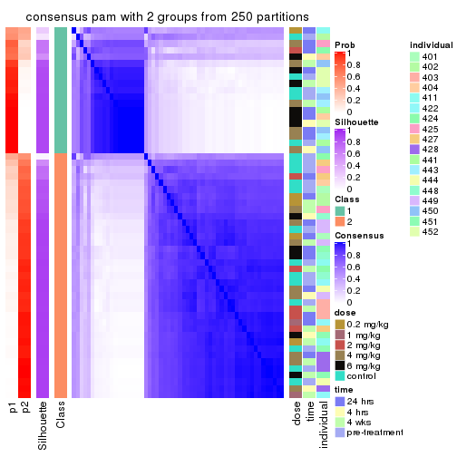</p>

</div>
<div id='tab-MAD-pam-consensus-heatmap-2'>
<pre><code class="r">consensus_heatmap(res, k = 3)
</code></pre>

<p>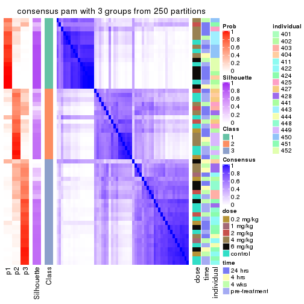</p>

</div>
<div id='tab-MAD-pam-consensus-heatmap-3'>
<pre><code class="r">consensus_heatmap(res, k = 4)
</code></pre>

<p>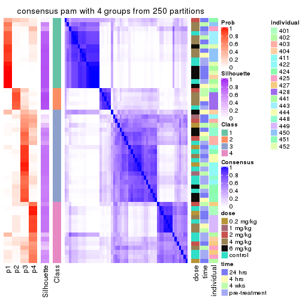</p>

</div>
<div id='tab-MAD-pam-consensus-heatmap-4'>
<pre><code class="r">consensus_heatmap(res, k = 5)
</code></pre>

<p>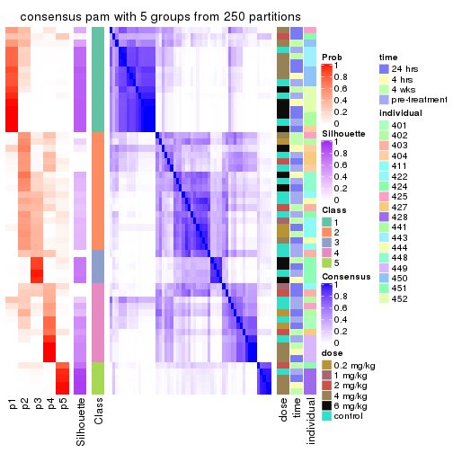</p>

</div>
<div id='tab-MAD-pam-consensus-heatmap-5'>
<pre><code class="r">consensus_heatmap(res, k = 6)
</code></pre>

<p>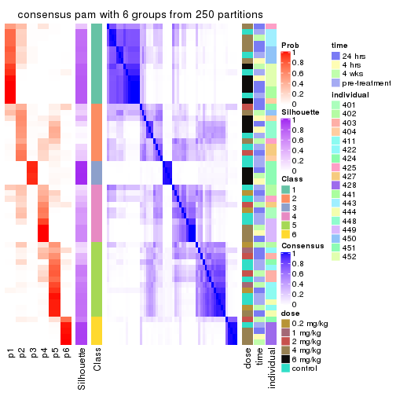</p>

</div>
</div>

Heatmaps for the membership of samples in all partitions to see how consistent they are:


<script>
$( function() {
	$( '#tabs-MAD-pam-membership-heatmap' ).tabs();
} );
</script>
<div id='tabs-MAD-pam-membership-heatmap'>
<ul>
<li><a href='#tab-MAD-pam-membership-heatmap-1'>k = 2</a></li>
<li><a href='#tab-MAD-pam-membership-heatmap-2'>k = 3</a></li>
<li><a href='#tab-MAD-pam-membership-heatmap-3'>k = 4</a></li>
<li><a href='#tab-MAD-pam-membership-heatmap-4'>k = 5</a></li>
<li><a href='#tab-MAD-pam-membership-heatmap-5'>k = 6</a></li>
</ul>
<div id='tab-MAD-pam-membership-heatmap-1'>
<pre><code class="r">membership_heatmap(res, k = 2)
</code></pre>

<p>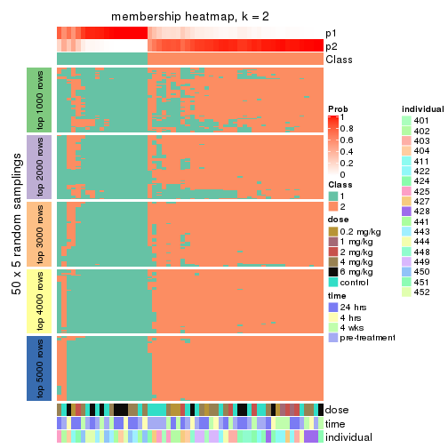</p>

</div>
<div id='tab-MAD-pam-membership-heatmap-2'>
<pre><code class="r">membership_heatmap(res, k = 3)
</code></pre>

<p>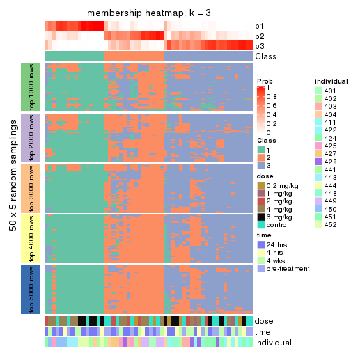</p>

</div>
<div id='tab-MAD-pam-membership-heatmap-3'>
<pre><code class="r">membership_heatmap(res, k = 4)
</code></pre>

<p>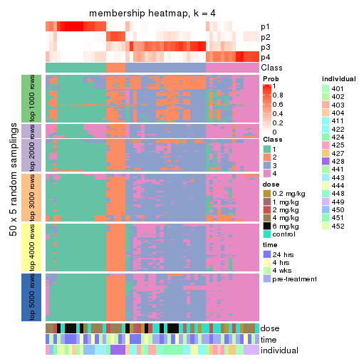</p>

</div>
<div id='tab-MAD-pam-membership-heatmap-4'>
<pre><code class="r">membership_heatmap(res, k = 5)
</code></pre>

<p>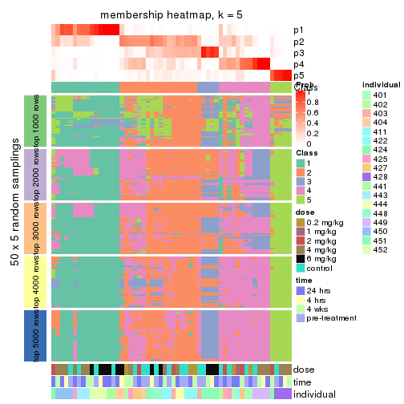</p>

</div>
<div id='tab-MAD-pam-membership-heatmap-5'>
<pre><code class="r">membership_heatmap(res, k = 6)
</code></pre>

<p>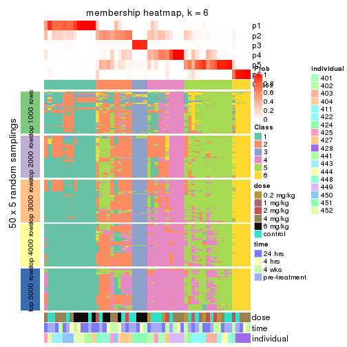</p>

</div>
</div>

As soon as we have had the classes for columns, we can look for signatures
which are significantly different between classes which can be candidate marks
for certain classes. Following are the heatmaps for signatures.


Signature heatmaps where rows are scaled:


<script>
$( function() {
	$( '#tabs-MAD-pam-get-signatures' ).tabs();
} );
</script>
<div id='tabs-MAD-pam-get-signatures'>
<ul>
<li><a href='#tab-MAD-pam-get-signatures-1'>k = 2</a></li>
<li><a href='#tab-MAD-pam-get-signatures-2'>k = 3</a></li>
<li><a href='#tab-MAD-pam-get-signatures-3'>k = 4</a></li>
<li><a href='#tab-MAD-pam-get-signatures-4'>k = 5</a></li>
<li><a href='#tab-MAD-pam-get-signatures-5'>k = 6</a></li>
</ul>
<div id='tab-MAD-pam-get-signatures-1'>
<pre><code class="r">get_signatures(res, k = 2)
</code></pre>

<p>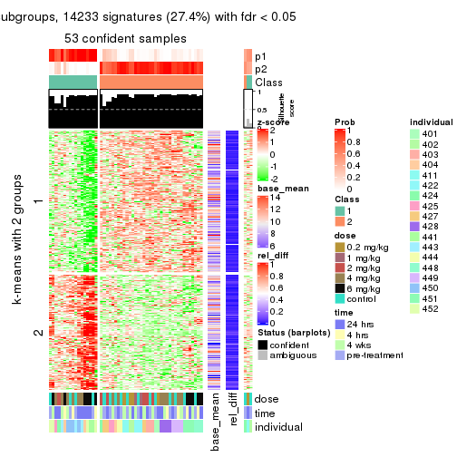</p>

</div>
<div id='tab-MAD-pam-get-signatures-2'>
<pre><code class="r">get_signatures(res, k = 3)
</code></pre>

<p>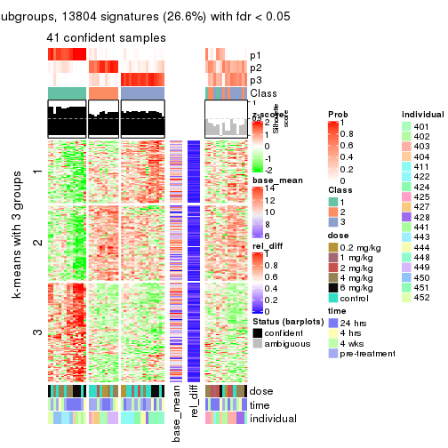</p>

</div>
<div id='tab-MAD-pam-get-signatures-3'>
<pre><code class="r">get_signatures(res, k = 4)
</code></pre>

<p>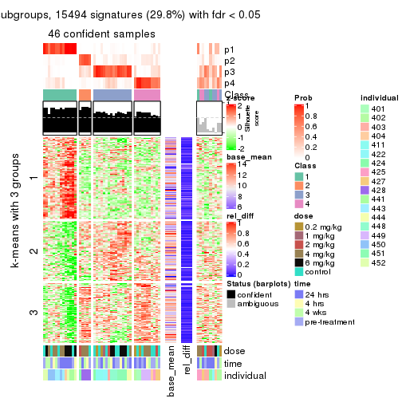</p>

</div>
<div id='tab-MAD-pam-get-signatures-4'>
<pre><code class="r">get_signatures(res, k = 5)
</code></pre>

<p>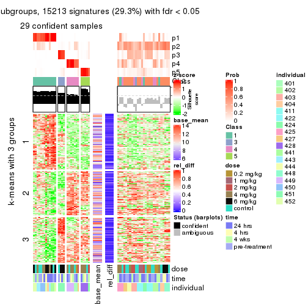</p>

</div>
<div id='tab-MAD-pam-get-signatures-5'>
<pre><code class="r">get_signatures(res, k = 6)
</code></pre>

<p>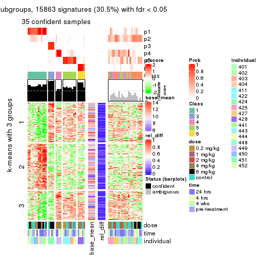</p>

</div>
</div>


Signature heatmaps where rows are not scaled:


<script>
$( function() {
	$( '#tabs-MAD-pam-get-signatures-no-scale' ).tabs();
} );
</script>
<div id='tabs-MAD-pam-get-signatures-no-scale'>
<ul>
<li><a href='#tab-MAD-pam-get-signatures-no-scale-1'>k = 2</a></li>
<li><a href='#tab-MAD-pam-get-signatures-no-scale-2'>k = 3</a></li>
<li><a href='#tab-MAD-pam-get-signatures-no-scale-3'>k = 4</a></li>
<li><a href='#tab-MAD-pam-get-signatures-no-scale-4'>k = 5</a></li>
<li><a href='#tab-MAD-pam-get-signatures-no-scale-5'>k = 6</a></li>
</ul>
<div id='tab-MAD-pam-get-signatures-no-scale-1'>
<pre><code class="r">get_signatures(res, k = 2, scale_rows = FALSE)
</code></pre>

<p>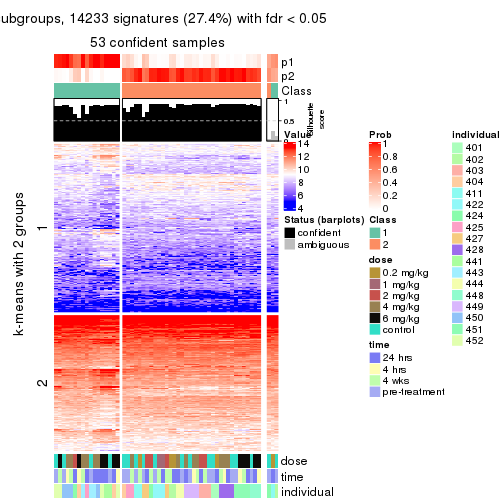</p>

</div>
<div id='tab-MAD-pam-get-signatures-no-scale-2'>
<pre><code class="r">get_signatures(res, k = 3, scale_rows = FALSE)
</code></pre>

<p>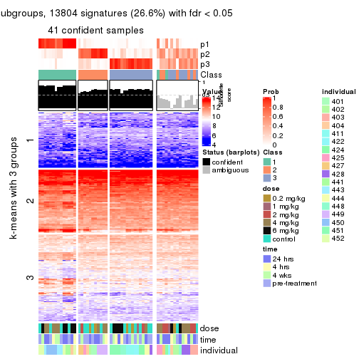</p>

</div>
<div id='tab-MAD-pam-get-signatures-no-scale-3'>
<pre><code class="r">get_signatures(res, k = 4, scale_rows = FALSE)
</code></pre>

<p>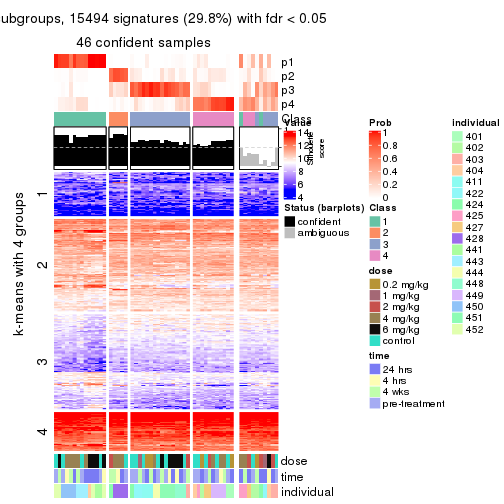</p>

</div>
<div id='tab-MAD-pam-get-signatures-no-scale-4'>
<pre><code class="r">get_signatures(res, k = 5, scale_rows = FALSE)
</code></pre>

<p>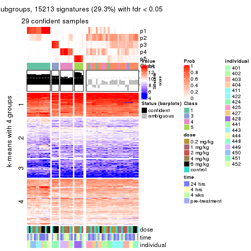</p>

</div>
<div id='tab-MAD-pam-get-signatures-no-scale-5'>
<pre><code class="r">get_signatures(res, k = 6, scale_rows = FALSE)
</code></pre>

<p>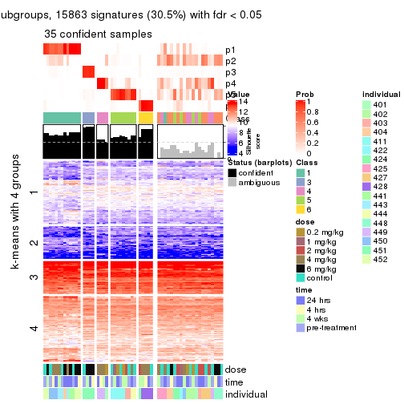</p>

</div>
</div>


Compare the overlap of signatures from different k:

```r
compare_signatures(res)
```

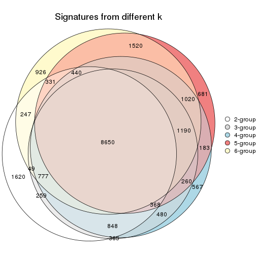

`get_signature()` returns a data frame invisibly. TO get the list of signatures, the function
call should be assigned to a variable explicitly. In following code, if `plot` argument is set
to `FALSE`, no heatmap is plotted while only the differential analysis is performed.

```r
# code only for demonstration
tb = get_signature(res, k = ..., plot = FALSE)
```

An example of the output of `tb` is:

```
#>   which_row         fdr    mean_1    mean_2 scaled_mean_1 scaled_mean_2 km
#> 1        38 0.042760348  8.373488  9.131774    -0.5533452     0.5164555  1
#> 2        40 0.018707592  7.106213  8.469186    -0.6173731     0.5762149  1
#> 3        55 0.019134737 10.221463 11.207825    -0.6159697     0.5749050  1
#> 4        59 0.006059896  5.921854  7.869574    -0.6899429     0.6439467  1
#> 5        60 0.018055526  8.928898 10.211722    -0.6204761     0.5791110  1
#> 6        98 0.009384629 15.714769 14.887706     0.6635654    -0.6193277  2
...
```

The columns in `tb` are:

1. `which_row`: row indices corresponding to the input matrix.
2. `fdr`: FDR for the differential test. 
3. `mean_x`: The mean value in group x.
4. `scaled_mean_x`: The mean value in group x after rows are scaled.
5. `km`: Row groups if k-means clustering is applied to rows.


UMAP plot which shows how samples are separated.


<script>
$( function() {
	$( '#tabs-MAD-pam-dimension-reduction' ).tabs();
} );
</script>
<div id='tabs-MAD-pam-dimension-reduction'>
<ul>
<li><a href='#tab-MAD-pam-dimension-reduction-1'>k = 2</a></li>
<li><a href='#tab-MAD-pam-dimension-reduction-2'>k = 3</a></li>
<li><a href='#tab-MAD-pam-dimension-reduction-3'>k = 4</a></li>
<li><a href='#tab-MAD-pam-dimension-reduction-4'>k = 5</a></li>
<li><a href='#tab-MAD-pam-dimension-reduction-5'>k = 6</a></li>
</ul>
<div id='tab-MAD-pam-dimension-reduction-1'>
<pre><code class="r">dimension_reduction(res, k = 2, method = &quot;UMAP&quot;)
</code></pre>

<p>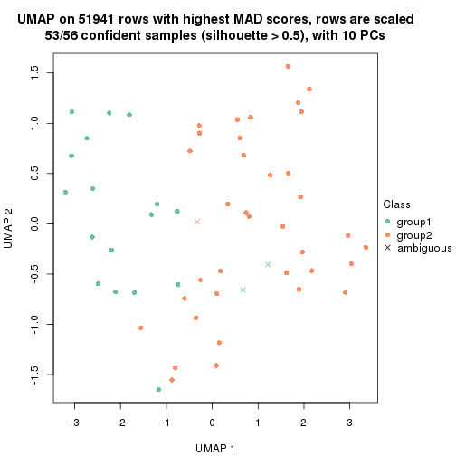</p>

</div>
<div id='tab-MAD-pam-dimension-reduction-2'>
<pre><code class="r">dimension_reduction(res, k = 3, method = &quot;UMAP&quot;)
</code></pre>

<p>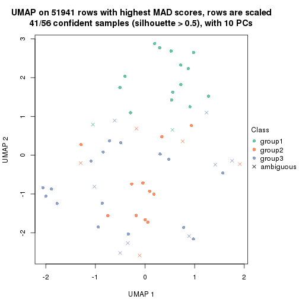</p>

</div>
<div id='tab-MAD-pam-dimension-reduction-3'>
<pre><code class="r">dimension_reduction(res, k = 4, method = &quot;UMAP&quot;)
</code></pre>

<p>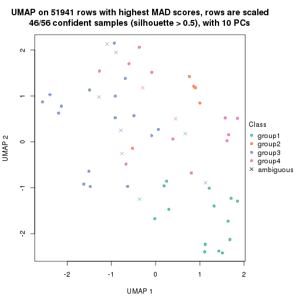</p>

</div>
<div id='tab-MAD-pam-dimension-reduction-4'>
<pre><code class="r">dimension_reduction(res, k = 5, method = &quot;UMAP&quot;)
</code></pre>

<p>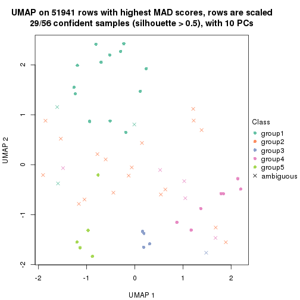</p>

</div>
<div id='tab-MAD-pam-dimension-reduction-5'>
<pre><code class="r">dimension_reduction(res, k = 6, method = &quot;UMAP&quot;)
</code></pre>

<p>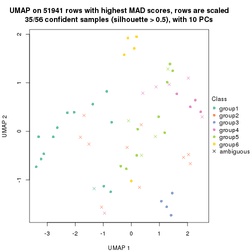</p>

</div>
</div>


Following heatmap shows how subgroups are split when increasing `k`:

```r
collect_classes(res)
```

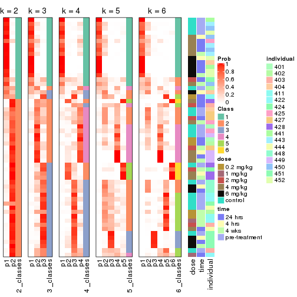


Test correlation between subgroups and known annotations. If the known
annotation is numeric, one-way ANOVA test is applied, and if the known
annotation is discrete, chi-squared contingency table test is applied.

```r
test_to_known_factors(res)
```

```
#>          n dose(p) time(p) individual(p) k
#> MAD:pam 53  0.2097   0.600      2.81e-04 2
#> MAD:pam 41  0.2570   0.947      8.33e-06 3
#> MAD:pam 46  0.2259   0.984      1.38e-08 4
#> MAD:pam 29  0.1948   0.993      1.86e-07 5
#> MAD:pam 35  0.0706   0.892      5.29e-10 6
```


If matrix rows can be associated to genes, consider to use `functional_enrichment(res,
...)` to perform function enrichment for the signature genes. See [this vignette](http://bioconductor.org/packages/devel/bioc/vignettes/cola/inst/doc/functional_enrichment.html) for more detailed explanations.


 

---------------------------------------------------


### MAD:mclust


The object with results only for a single top-value method and a single partition method 
can be extracted as:

```r
res = res_list["MAD", "mclust"]
# you can also extract it by
# res = res_list["MAD:mclust"]
```

A summary of `res` and all the functions that can be applied to it:

```r
res
```

```
#> A 'ConsensusPartition' object with k = 2, 3, 4, 5, 6.
#>   On a matrix with 51941 rows and 56 columns.
#>   Top rows (1000, 2000, 3000, 4000, 5000) are extracted by 'MAD' method.
#>   Subgroups are detected by 'mclust' method.
#>   Performed in total 1250 partitions by row resampling.
#>   Best k for subgroups seems to be 5.
#> 
#> Following methods can be applied to this 'ConsensusPartition' object:
#>  [1] "cola_report"             "collect_classes"         "collect_plots"          
#>  [4] "collect_stats"           "colnames"                "compare_signatures"     
#>  [7] "consensus_heatmap"       "dimension_reduction"     "functional_enrichment"  
#> [10] "get_anno_col"            "get_anno"                "get_classes"            
#> [13] "get_consensus"           "get_matrix"              "get_membership"         
#> [16] "get_param"               "get_signatures"          "get_stats"              
#> [19] "is_best_k"               "is_stable_k"             "membership_heatmap"     
#> [22] "ncol"                    "nrow"                    "plot_ecdf"              
#> [25] "rownames"                "select_partition_number" "show"                   
#> [28] "suggest_best_k"          "test_to_known_factors"
```

`collect_plots()` function collects all the plots made from `res` for all `k` (number of partitions)
into one single page to provide an easy and fast comparison between different `k`.

```r
collect_plots(res)
```

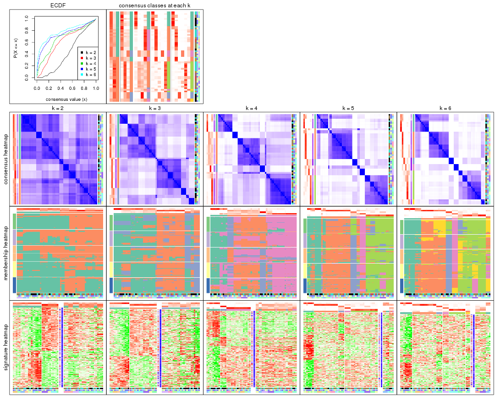

The plots are:

- The first row: a plot of the ECDF (empirical cumulative distribution
  function) curves of the consensus matrix for each `k` and the heatmap of
  predicted classes for each `k`.
- The second row: heatmaps of the consensus matrix for each `k`.
- The third row: heatmaps of the membership matrix for each `k`.
- The fouth row: heatmaps of the signatures for each `k`.

All the plots in panels can be made by individual functions and they are
plotted later in this section.

`select_partition_number()` produces several plots showing different
statistics for choosing "optimized" `k`. There are following statistics:

- ECDF curves of the consensus matrix for each `k`;
- 1-PAC. [The PAC
  score](https://en.wikipedia.org/wiki/Consensus_clustering#Over-interpretation_potential_of_consensus_clustering)
  measures the proportion of the ambiguous subgrouping.
- Mean silhouette score.
- Concordance. The mean probability of fiting the consensus class ids in all
  partitions.
- Area increased. Denote $A_k$ as the area under the ECDF curve for current
  `k`, the area increased is defined as $A_k - A_{k-1}$.
- Rand index. The percent of pairs of samples that are both in a same cluster
  or both are not in a same cluster in the partition of k and k-1.
- Jaccard index. The ratio of pairs of samples are both in a same cluster in
  the partition of k and k-1 and the pairs of samples are both in a same
  cluster in the partition k or k-1.

The detailed explanations of these statistics can be found in [the _cola_
vignette](http://bioconductor.org/packages/devel/bioc/vignettes/cola/inst/doc/cola.html#toc_13).

Generally speaking, lower PAC score, higher mean silhouette score or higher
concordance corresponds to better partition. Rand index and Jaccard index
measure how similar the current partition is compared to partition with `k-1`.
If they are too similar, we won't accept `k` is better than `k-1`.

```r
select_partition_number(res)
```

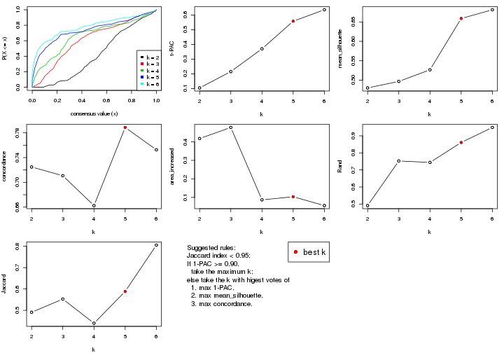

The numeric values for all these statistics can be obtained by `get_stats()`.

```r
get_stats(res)
```

```
#>   k 1-PAC mean_silhouette concordance area_increased  Rand Jaccard
#> 2 2 0.104           0.480       0.725         0.4177 0.491   0.491
#> 3 3 0.216           0.497       0.711         0.4777 0.753   0.553
#> 4 4 0.370           0.527       0.662         0.0868 0.744   0.440
#> 5 5 0.558           0.659       0.789         0.1036 0.861   0.588
#> 6 6 0.636           0.681       0.753         0.0559 0.949   0.805
```

`suggest_best_k()` suggests the best $k$ based on these statistics. The rules are as follows:

- All $k$ with Jaccard index larger than 0.95 are removed because increasing
  $k$ does not provide enough extra information. If all $k$ are removed, it is
  marked as no subgroup is detected.
- For all $k$ with 1-PAC score larger than 0.9, the maximal $k$ is taken as
  the best $k$, and other $k$ are marked as optional $k$.
- If it does not fit the second rule. The $k$ with the maximal vote of the
  highest 1-PAC score, highest mean silhouette, and highest concordance is
  taken as the best $k$.

```r
suggest_best_k(res)
```

```
#> [1] 5
```


Following shows the table of the partitions (You need to click the **show/hide
code output** link to see it). The membership matrix (columns with name `p*`)
is inferred by
[`clue::cl_consensus()`](https://www.rdocumentation.org/link/cl_consensus?package=clue)
function with the `SE` method. Basically the value in the membership matrix
represents the probability to belong to a certain group. The finall class
label for an item is determined with the group with highest probability it
belongs to.

In `get_classes()` function, the entropy is calculated from the membership
matrix and the silhouette score is calculated from the consensus matrix.


<script>
$( function() {
	$( '#tabs-MAD-mclust-get-classes' ).tabs();
} );
</script>
<div id='tabs-MAD-mclust-get-classes'>
<ul>
<li><a href='#tab-MAD-mclust-get-classes-1'>k = 2</a></li>
<li><a href='#tab-MAD-mclust-get-classes-2'>k = 3</a></li>
<li><a href='#tab-MAD-mclust-get-classes-3'>k = 4</a></li>
<li><a href='#tab-MAD-mclust-get-classes-4'>k = 5</a></li>
<li><a href='#tab-MAD-mclust-get-classes-5'>k = 6</a></li>
</ul>

<div id='tab-MAD-mclust-get-classes-1'>
<p><a id='tab-MAD-mclust-get-classes-1-a' style='color:#0366d6' href='#'>show/hide code output</a></p>
<pre><code class="r">cbind(get_classes(res, k = 2), get_membership(res, k = 2))
</code></pre>

<pre><code>#&gt;           class entropy silhouette    p1    p2
#&gt; GSM687644     1   0.969     0.5787 0.604 0.396
#&gt; GSM687648     2   0.999    -0.3417 0.484 0.516
#&gt; GSM687653     2   0.925     0.3865 0.340 0.660
#&gt; GSM687658     1   0.891     0.6624 0.692 0.308
#&gt; GSM687663     2   0.833     0.4856 0.264 0.736
#&gt; GSM687668     2   0.730     0.5488 0.204 0.796
#&gt; GSM687673     2   0.881     0.4253 0.300 0.700
#&gt; GSM687678     1   0.998     0.4138 0.524 0.476
#&gt; GSM687683     1   0.932     0.6337 0.652 0.348
#&gt; GSM687688     2   0.163     0.5812 0.024 0.976
#&gt; GSM687695     1   0.653     0.6669 0.832 0.168
#&gt; GSM687699     1   0.990     0.4851 0.560 0.440
#&gt; GSM687704     2   0.767     0.5249 0.224 0.776
#&gt; GSM687707     2   0.983     0.2556 0.424 0.576
#&gt; GSM687712     1   0.855     0.3216 0.720 0.280
#&gt; GSM687719     1   0.706     0.6858 0.808 0.192
#&gt; GSM687724     2   0.775     0.4875 0.228 0.772
#&gt; GSM687728     1   0.706     0.6785 0.808 0.192
#&gt; GSM687646     1   0.952     0.6112 0.628 0.372
#&gt; GSM687649     2   0.998    -0.3182 0.476 0.524
#&gt; GSM687665     2   0.955     0.2725 0.376 0.624
#&gt; GSM687651     2   0.936     0.0718 0.352 0.648
#&gt; GSM687667     2   0.662     0.5637 0.172 0.828
#&gt; GSM687670     2   0.781     0.5197 0.232 0.768
#&gt; GSM687671     2   0.689     0.5558 0.184 0.816
#&gt; GSM687654     2   0.921     0.3946 0.336 0.664
#&gt; GSM687675     2   0.925     0.3638 0.340 0.660
#&gt; GSM687685     1   0.952     0.6055 0.628 0.372
#&gt; GSM687656     2   0.929     0.3777 0.344 0.656
#&gt; GSM687677     2   0.224     0.5830 0.036 0.964
#&gt; GSM687687     1   0.969     0.5860 0.604 0.396
#&gt; GSM687692     2   0.118     0.5811 0.016 0.984
#&gt; GSM687716     1   0.855     0.3216 0.720 0.280
#&gt; GSM687722     1   0.760     0.6883 0.780 0.220
#&gt; GSM687680     1   0.991     0.4860 0.556 0.444
#&gt; GSM687690     2   0.141     0.5810 0.020 0.980
#&gt; GSM687700     1   0.680     0.6819 0.820 0.180
#&gt; GSM687705     2   0.760     0.5324 0.220 0.780
#&gt; GSM687714     1   0.855     0.3216 0.720 0.280
#&gt; GSM687721     1   0.662     0.6795 0.828 0.172
#&gt; GSM687682     1   1.000     0.3659 0.504 0.496
#&gt; GSM687694     2   0.141     0.5810 0.020 0.980
#&gt; GSM687702     1   0.995     0.4423 0.540 0.460
#&gt; GSM687718     1   0.855     0.3216 0.720 0.280
#&gt; GSM687723     1   0.876     0.6731 0.704 0.296
#&gt; GSM687661     1   0.881     0.6678 0.700 0.300
#&gt; GSM687710     2   0.990     0.2188 0.440 0.560
#&gt; GSM687726     2   0.775     0.4875 0.228 0.772
#&gt; GSM687730     1   0.653     0.6669 0.832 0.168
#&gt; GSM687660     1   0.625     0.6715 0.844 0.156
#&gt; GSM687697     1   0.634     0.6693 0.840 0.160
#&gt; GSM687709     2   0.987     0.2481 0.432 0.568
#&gt; GSM687725     2   0.775     0.4875 0.228 0.772
#&gt; GSM687729     1   0.653     0.6669 0.832 0.168
#&gt; GSM687727     2   0.767     0.4899 0.224 0.776
#&gt; GSM687731     1   0.714     0.6780 0.804 0.196
</code></pre>

<script>
$('#tab-MAD-mclust-get-classes-1-a').parent().next().next().hide();
$('#tab-MAD-mclust-get-classes-1-a').click(function(){
  $('#tab-MAD-mclust-get-classes-1-a').parent().next().next().toggle();
  return(false);
});
</script>
</div>

<div id='tab-MAD-mclust-get-classes-2'>
<p><a id='tab-MAD-mclust-get-classes-2-a' style='color:#0366d6' href='#'>show/hide code output</a></p>
<pre><code class="r">cbind(get_classes(res, k = 3), get_membership(res, k = 3))
</code></pre>

<pre><code>#&gt;           class entropy silhouette    p1    p2    p3
#&gt; GSM687644     1  0.7739      0.538 0.676 0.136 0.188
#&gt; GSM687648     1  0.9582      0.368 0.472 0.300 0.228
#&gt; GSM687653     2  0.5787      0.697 0.068 0.796 0.136
#&gt; GSM687658     1  0.6254      0.577 0.776 0.108 0.116
#&gt; GSM687663     2  0.4931      0.745 0.140 0.828 0.032
#&gt; GSM687668     2  0.2998      0.786 0.068 0.916 0.016
#&gt; GSM687673     2  0.4047      0.754 0.148 0.848 0.004
#&gt; GSM687678     1  0.9208      0.442 0.532 0.264 0.204
#&gt; GSM687683     1  0.6775      0.570 0.744 0.112 0.144
#&gt; GSM687688     2  0.4195      0.685 0.012 0.852 0.136
#&gt; GSM687695     1  0.8187      0.251 0.628 0.244 0.128
#&gt; GSM687699     1  0.9233      0.435 0.528 0.268 0.204
#&gt; GSM687704     2  0.3832      0.788 0.076 0.888 0.036
#&gt; GSM687707     2  0.9773     -0.281 0.232 0.396 0.372
#&gt; GSM687712     3  0.7497      0.333 0.276 0.072 0.652
#&gt; GSM687719     1  0.1315      0.543 0.972 0.020 0.008
#&gt; GSM687724     3  0.6769      0.273 0.016 0.392 0.592
#&gt; GSM687728     1  0.8421      0.233 0.608 0.252 0.140
#&gt; GSM687646     1  0.7327      0.555 0.708 0.132 0.160
#&gt; GSM687649     1  0.9555      0.373 0.476 0.300 0.224
#&gt; GSM687665     2  0.5355      0.714 0.168 0.800 0.032
#&gt; GSM687651     1  0.9852      0.265 0.416 0.312 0.272
#&gt; GSM687667     2  0.4565      0.763 0.076 0.860 0.064
#&gt; GSM687670     2  0.3091      0.787 0.072 0.912 0.016
#&gt; GSM687671     2  0.3120      0.788 0.080 0.908 0.012
#&gt; GSM687654     2  0.5787      0.697 0.068 0.796 0.136
#&gt; GSM687675     2  0.5526      0.712 0.172 0.792 0.036
#&gt; GSM687685     1  0.6721      0.572 0.748 0.116 0.136
#&gt; GSM687656     2  0.5875      0.693 0.072 0.792 0.136
#&gt; GSM687677     2  0.3998      0.759 0.056 0.884 0.060
#&gt; GSM687687     1  0.7875      0.528 0.664 0.136 0.200
#&gt; GSM687692     2  0.4195      0.685 0.012 0.852 0.136
#&gt; GSM687716     3  0.7416      0.337 0.276 0.068 0.656
#&gt; GSM687722     1  0.0829      0.545 0.984 0.012 0.004
#&gt; GSM687680     1  0.8950      0.473 0.568 0.220 0.212
#&gt; GSM687690     2  0.4195      0.685 0.012 0.852 0.136
#&gt; GSM687700     1  0.1129      0.540 0.976 0.004 0.020
#&gt; GSM687705     2  0.3502      0.788 0.084 0.896 0.020
#&gt; GSM687714     3  0.7465      0.339 0.272 0.072 0.656
#&gt; GSM687721     1  0.0237      0.539 0.996 0.004 0.000
#&gt; GSM687682     1  0.8948      0.471 0.568 0.224 0.208
#&gt; GSM687694     2  0.4128      0.686 0.012 0.856 0.132
#&gt; GSM687702     1  0.9225      0.441 0.532 0.256 0.212
#&gt; GSM687718     3  0.7416      0.337 0.276 0.068 0.656
#&gt; GSM687723     1  0.5585      0.576 0.812 0.096 0.092
#&gt; GSM687661     1  0.6031      0.577 0.788 0.096 0.116
#&gt; GSM687710     3  0.9833      0.193 0.248 0.356 0.396
#&gt; GSM687726     3  0.6769      0.273 0.016 0.392 0.592
#&gt; GSM687730     1  0.8255      0.240 0.620 0.252 0.128
#&gt; GSM687660     1  0.0424      0.534 0.992 0.008 0.000
#&gt; GSM687697     1  0.6834      0.346 0.740 0.148 0.112
#&gt; GSM687709     3  0.9885      0.199 0.260 0.368 0.372
#&gt; GSM687725     3  0.6769      0.273 0.016 0.392 0.592
#&gt; GSM687729     1  0.8187      0.251 0.628 0.244 0.128
#&gt; GSM687727     3  0.6783      0.268 0.016 0.396 0.588
#&gt; GSM687731     1  0.7983      0.276 0.648 0.228 0.124
</code></pre>

<script>
$('#tab-MAD-mclust-get-classes-2-a').parent().next().next().hide();
$('#tab-MAD-mclust-get-classes-2-a').click(function(){
  $('#tab-MAD-mclust-get-classes-2-a').parent().next().next().toggle();
  return(false);
});
</script>
</div>

<div id='tab-MAD-mclust-get-classes-3'>
<p><a id='tab-MAD-mclust-get-classes-3-a' style='color:#0366d6' href='#'>show/hide code output</a></p>
<pre><code class="r">cbind(get_classes(res, k = 4), get_membership(res, k = 4))
</code></pre>

<pre><code>#&gt;           class entropy silhouette    p1    p2    p3    p4
#&gt; GSM687644     4  0.2706      0.799 0.064 0.004 0.024 0.908
#&gt; GSM687648     4  0.1362      0.800 0.012 0.004 0.020 0.964
#&gt; GSM687653     2  0.9310      0.472 0.116 0.364 0.176 0.344
#&gt; GSM687658     4  0.2675      0.782 0.100 0.008 0.000 0.892
#&gt; GSM687663     2  0.9476      0.475 0.140 0.376 0.180 0.304
#&gt; GSM687668     2  0.9153      0.477 0.080 0.380 0.316 0.224
#&gt; GSM687673     2  0.9911      0.396 0.196 0.296 0.276 0.232
#&gt; GSM687678     4  0.1377      0.807 0.020 0.008 0.008 0.964
#&gt; GSM687683     4  0.2796      0.787 0.092 0.016 0.000 0.892
#&gt; GSM687688     2  0.7614      0.336 0.016 0.472 0.380 0.132
#&gt; GSM687695     1  0.0817      0.740 0.976 0.000 0.000 0.024
#&gt; GSM687699     4  0.0927      0.808 0.016 0.000 0.008 0.976
#&gt; GSM687704     2  0.9013      0.494 0.064 0.396 0.260 0.280
#&gt; GSM687707     4  0.8323      0.329 0.072 0.128 0.288 0.512
#&gt; GSM687712     2  0.7844     -0.102 0.016 0.508 0.200 0.276
#&gt; GSM687719     1  0.4955      0.474 0.556 0.000 0.000 0.444
#&gt; GSM687724     3  0.0524      0.752 0.004 0.000 0.988 0.008
#&gt; GSM687728     1  0.2089      0.708 0.932 0.048 0.000 0.020
#&gt; GSM687646     4  0.2674      0.797 0.068 0.004 0.020 0.908
#&gt; GSM687649     4  0.1509      0.800 0.012 0.008 0.020 0.960
#&gt; GSM687665     4  0.9840     -0.566 0.220 0.296 0.180 0.304
#&gt; GSM687651     4  0.3296      0.749 0.024 0.036 0.048 0.892
#&gt; GSM687667     2  0.9270      0.478 0.108 0.392 0.188 0.312
#&gt; GSM687670     2  0.9320      0.473 0.096 0.364 0.316 0.224
#&gt; GSM687671     2  0.9182      0.478 0.084 0.380 0.316 0.220
#&gt; GSM687654     2  0.9310      0.472 0.116 0.364 0.176 0.344
#&gt; GSM687675     3  0.9954     -0.515 0.220 0.276 0.280 0.224
#&gt; GSM687685     4  0.2480      0.790 0.088 0.008 0.000 0.904
#&gt; GSM687656     2  0.9311      0.469 0.116 0.360 0.176 0.348
#&gt; GSM687677     2  0.9004      0.472 0.068 0.396 0.312 0.224
#&gt; GSM687687     4  0.2744      0.799 0.064 0.008 0.020 0.908
#&gt; GSM687692     2  0.7393      0.341 0.008 0.484 0.376 0.132
#&gt; GSM687716     2  0.7844     -0.102 0.016 0.508 0.200 0.276
#&gt; GSM687722     1  0.4992      0.398 0.524 0.000 0.000 0.476
#&gt; GSM687680     4  0.1191      0.807 0.024 0.004 0.004 0.968
#&gt; GSM687690     2  0.7535      0.348 0.012 0.480 0.372 0.136
#&gt; GSM687700     1  0.4817      0.589 0.612 0.000 0.000 0.388
#&gt; GSM687705     2  0.9049      0.492 0.068 0.396 0.284 0.252
#&gt; GSM687714     2  0.7844     -0.102 0.016 0.508 0.200 0.276
#&gt; GSM687721     1  0.4624      0.632 0.660 0.000 0.000 0.340
#&gt; GSM687682     4  0.1443      0.807 0.028 0.004 0.008 0.960
#&gt; GSM687694     2  0.7498      0.343 0.012 0.484 0.372 0.132
#&gt; GSM687702     4  0.1443      0.804 0.028 0.004 0.008 0.960
#&gt; GSM687718     2  0.7844     -0.102 0.016 0.508 0.200 0.276
#&gt; GSM687723     4  0.2831      0.764 0.120 0.004 0.000 0.876
#&gt; GSM687661     4  0.2546      0.787 0.092 0.008 0.000 0.900
#&gt; GSM687710     4  0.8028      0.392 0.064 0.120 0.268 0.548
#&gt; GSM687726     3  0.0524      0.752 0.004 0.000 0.988 0.008
#&gt; GSM687730     1  0.2363      0.716 0.920 0.056 0.000 0.024
#&gt; GSM687660     1  0.3837      0.714 0.776 0.000 0.000 0.224
#&gt; GSM687697     1  0.1557      0.749 0.944 0.000 0.000 0.056
#&gt; GSM687709     4  0.8292      0.350 0.072 0.136 0.264 0.528
#&gt; GSM687725     3  0.0524      0.752 0.004 0.000 0.988 0.008
#&gt; GSM687729     1  0.0817      0.740 0.976 0.000 0.000 0.024
#&gt; GSM687727     3  0.0524      0.752 0.004 0.000 0.988 0.008
#&gt; GSM687731     1  0.1833      0.737 0.944 0.024 0.000 0.032
</code></pre>

<script>
$('#tab-MAD-mclust-get-classes-3-a').parent().next().next().hide();
$('#tab-MAD-mclust-get-classes-3-a').click(function(){
  $('#tab-MAD-mclust-get-classes-3-a').parent().next().next().toggle();
  return(false);
});
</script>
</div>

<div id='tab-MAD-mclust-get-classes-4'>
<p><a id='tab-MAD-mclust-get-classes-4-a' style='color:#0366d6' href='#'>show/hide code output</a></p>
<pre><code class="r">cbind(get_classes(res, k = 5), get_membership(res, k = 5))
</code></pre>

<pre><code>#&gt;           class entropy silhouette    p1    p2    p3    p4    p5
#&gt; GSM687644     2  0.2404     0.7820 0.040 0.916 0.004 0.016 0.024
#&gt; GSM687648     2  0.2476     0.7676 0.004 0.912 0.036 0.012 0.036
#&gt; GSM687653     5  0.5431     0.6776 0.036 0.092 0.144 0.004 0.724
#&gt; GSM687658     2  0.2879     0.7665 0.080 0.880 0.032 0.008 0.000
#&gt; GSM687663     5  0.4366     0.7287 0.044 0.120 0.032 0.004 0.800
#&gt; GSM687668     5  0.3157     0.7601 0.052 0.036 0.028 0.004 0.880
#&gt; GSM687673     5  0.4148     0.7332 0.144 0.040 0.020 0.000 0.796
#&gt; GSM687678     2  0.2291     0.7817 0.024 0.916 0.048 0.000 0.012
#&gt; GSM687683     2  0.3207     0.7688 0.084 0.864 0.040 0.012 0.000
#&gt; GSM687688     5  0.5095     0.5273 0.016 0.008 0.268 0.028 0.680
#&gt; GSM687695     1  0.0290     0.7452 0.992 0.000 0.000 0.000 0.008
#&gt; GSM687699     2  0.2052     0.7836 0.016 0.932 0.032 0.004 0.016
#&gt; GSM687704     5  0.2228     0.7611 0.016 0.044 0.020 0.000 0.920
#&gt; GSM687707     4  0.7853     0.2068 0.036 0.380 0.036 0.392 0.156
#&gt; GSM687712     4  0.3177     0.7034 0.000 0.208 0.000 0.792 0.000
#&gt; GSM687719     2  0.4304    -0.0636 0.484 0.516 0.000 0.000 0.000
#&gt; GSM687724     3  0.5664     0.9965 0.000 0.000 0.632 0.168 0.200
#&gt; GSM687728     1  0.2621     0.6887 0.876 0.008 0.004 0.000 0.112
#&gt; GSM687646     2  0.2457     0.7802 0.032 0.916 0.008 0.016 0.028
#&gt; GSM687649     2  0.2476     0.7676 0.004 0.912 0.036 0.012 0.036
#&gt; GSM687665     5  0.5140     0.7060 0.104 0.124 0.032 0.000 0.740
#&gt; GSM687651     2  0.3634     0.7233 0.012 0.860 0.036 0.052 0.040
#&gt; GSM687667     5  0.4339     0.7307 0.040 0.124 0.032 0.004 0.800
#&gt; GSM687670     5  0.3151     0.7611 0.056 0.036 0.032 0.000 0.876
#&gt; GSM687671     5  0.2978     0.7616 0.052 0.036 0.020 0.004 0.888
#&gt; GSM687654     5  0.5431     0.6799 0.036 0.092 0.144 0.004 0.724
#&gt; GSM687675     5  0.4178     0.7281 0.156 0.040 0.016 0.000 0.788
#&gt; GSM687685     2  0.2838     0.7742 0.072 0.884 0.036 0.008 0.000
#&gt; GSM687656     5  0.5555     0.6762 0.040 0.096 0.144 0.004 0.716
#&gt; GSM687677     5  0.2959     0.7490 0.072 0.016 0.024 0.004 0.884
#&gt; GSM687687     2  0.2632     0.7779 0.036 0.908 0.012 0.012 0.032
#&gt; GSM687692     5  0.4893     0.5320 0.008 0.008 0.268 0.028 0.688
#&gt; GSM687716     4  0.3177     0.7034 0.000 0.208 0.000 0.792 0.000
#&gt; GSM687722     2  0.4430     0.0618 0.456 0.540 0.000 0.004 0.000
#&gt; GSM687680     2  0.2053     0.7809 0.024 0.924 0.048 0.004 0.000
#&gt; GSM687690     5  0.4845     0.5380 0.008 0.008 0.260 0.028 0.696
#&gt; GSM687700     1  0.4448     0.1012 0.516 0.480 0.000 0.000 0.004
#&gt; GSM687705     5  0.2087     0.7580 0.020 0.032 0.020 0.000 0.928
#&gt; GSM687714     4  0.3177     0.7034 0.000 0.208 0.000 0.792 0.000
#&gt; GSM687721     1  0.4390     0.2234 0.568 0.428 0.000 0.000 0.004
#&gt; GSM687682     2  0.2142     0.7828 0.028 0.920 0.048 0.004 0.000
#&gt; GSM687694     5  0.4727     0.5392 0.008 0.004 0.260 0.028 0.700
#&gt; GSM687702     2  0.2519     0.7755 0.036 0.908 0.044 0.004 0.008
#&gt; GSM687718     4  0.3177     0.7034 0.000 0.208 0.000 0.792 0.000
#&gt; GSM687723     2  0.3131     0.7528 0.104 0.860 0.028 0.008 0.000
#&gt; GSM687661     2  0.2819     0.7660 0.076 0.884 0.032 0.008 0.000
#&gt; GSM687710     2  0.7317    -0.2448 0.036 0.444 0.028 0.392 0.100
#&gt; GSM687726     3  0.5664     0.9965 0.000 0.000 0.632 0.168 0.200
#&gt; GSM687730     1  0.2011     0.7156 0.908 0.004 0.000 0.000 0.088
#&gt; GSM687660     1  0.3715     0.5694 0.736 0.260 0.000 0.000 0.004
#&gt; GSM687697     1  0.0771     0.7435 0.976 0.020 0.000 0.000 0.004
#&gt; GSM687709     4  0.7810     0.1894 0.044 0.388 0.032 0.396 0.140
#&gt; GSM687725     3  0.5664     0.9965 0.000 0.000 0.632 0.168 0.200
#&gt; GSM687729     1  0.0451     0.7450 0.988 0.000 0.004 0.000 0.008
#&gt; GSM687727     3  0.5720     0.9895 0.000 0.000 0.624 0.168 0.208
#&gt; GSM687731     1  0.1082     0.7444 0.964 0.008 0.000 0.000 0.028
</code></pre>

<script>
$('#tab-MAD-mclust-get-classes-4-a').parent().next().next().hide();
$('#tab-MAD-mclust-get-classes-4-a').click(function(){
  $('#tab-MAD-mclust-get-classes-4-a').parent().next().next().toggle();
  return(false);
});
</script>
</div>

<div id='tab-MAD-mclust-get-classes-5'>
<p><a id='tab-MAD-mclust-get-classes-5-a' style='color:#0366d6' href='#'>show/hide code output</a></p>
<pre><code class="r">cbind(get_classes(res, k = 6), get_membership(res, k = 6))
</code></pre>

<pre><code>#&gt;           class entropy silhouette    p1    p2    p3    p4    p5    p6
#&gt; GSM687644     2  0.4364      0.686 0.000 0.724 0.008 0.016 0.032 0.220
#&gt; GSM687648     2  0.1124      0.720 0.000 0.956 0.000 0.000 0.008 0.036
#&gt; GSM687653     5  0.7866      0.347 0.000 0.036 0.168 0.124 0.360 0.312
#&gt; GSM687658     2  0.4555      0.648 0.048 0.660 0.000 0.000 0.008 0.284
#&gt; GSM687663     5  0.3921      0.654 0.008 0.052 0.068 0.000 0.816 0.056
#&gt; GSM687668     5  0.1088      0.684 0.024 0.016 0.000 0.000 0.960 0.000
#&gt; GSM687673     5  0.2463      0.683 0.032 0.028 0.008 0.008 0.908 0.016
#&gt; GSM687678     2  0.1180      0.739 0.012 0.960 0.000 0.000 0.012 0.016
#&gt; GSM687683     2  0.4516      0.653 0.048 0.668 0.000 0.000 0.008 0.276
#&gt; GSM687688     5  0.6216      0.389 0.016 0.008 0.064 0.344 0.528 0.040
#&gt; GSM687695     1  0.0146      0.701 0.996 0.000 0.000 0.000 0.004 0.000
#&gt; GSM687699     2  0.1116      0.739 0.004 0.960 0.000 0.000 0.008 0.028
#&gt; GSM687704     5  0.1015      0.687 0.000 0.012 0.004 0.004 0.968 0.012
#&gt; GSM687707     6  0.6391      0.918 0.036 0.188 0.024 0.032 0.092 0.628
#&gt; GSM687712     4  0.5067      1.000 0.000 0.180 0.000 0.636 0.000 0.184
#&gt; GSM687719     1  0.4597      0.372 0.548 0.412 0.000 0.000 0.000 0.040
#&gt; GSM687724     3  0.2491      1.000 0.000 0.000 0.836 0.000 0.164 0.000
#&gt; GSM687728     1  0.1958      0.657 0.896 0.000 0.000 0.004 0.100 0.000
#&gt; GSM687646     2  0.4508      0.683 0.004 0.716 0.008 0.012 0.036 0.224
#&gt; GSM687649     2  0.1124      0.720 0.000 0.956 0.000 0.000 0.008 0.036
#&gt; GSM687665     5  0.4531      0.647 0.024 0.064 0.068 0.004 0.788 0.052
#&gt; GSM687651     2  0.2611      0.652 0.000 0.876 0.004 0.008 0.016 0.096
#&gt; GSM687667     5  0.5025      0.644 0.020 0.056 0.068 0.024 0.764 0.068
#&gt; GSM687670     5  0.1148      0.684 0.020 0.016 0.004 0.000 0.960 0.000
#&gt; GSM687671     5  0.1096      0.685 0.020 0.008 0.000 0.004 0.964 0.004
#&gt; GSM687654     5  0.7863      0.350 0.000 0.036 0.168 0.124 0.364 0.308
#&gt; GSM687675     5  0.2789      0.678 0.052 0.032 0.008 0.008 0.888 0.012
#&gt; GSM687685     2  0.4310      0.663 0.036 0.684 0.000 0.000 0.008 0.272
#&gt; GSM687656     5  0.7838      0.352 0.000 0.036 0.168 0.120 0.368 0.308
#&gt; GSM687677     5  0.3036      0.665 0.048 0.004 0.008 0.064 0.868 0.008
#&gt; GSM687687     2  0.4848      0.668 0.012 0.696 0.008 0.016 0.036 0.232
#&gt; GSM687692     5  0.5833      0.394 0.000 0.008 0.064 0.352 0.536 0.040
#&gt; GSM687716     4  0.5067      1.000 0.000 0.180 0.000 0.636 0.000 0.184
#&gt; GSM687722     1  0.4695      0.248 0.508 0.448 0.000 0.000 0.000 0.044
#&gt; GSM687680     2  0.0665      0.738 0.004 0.980 0.000 0.000 0.008 0.008
#&gt; GSM687690     5  0.5792      0.390 0.000 0.008 0.064 0.360 0.532 0.036
#&gt; GSM687700     1  0.4099      0.492 0.612 0.372 0.000 0.000 0.000 0.016
#&gt; GSM687705     5  0.0551      0.683 0.004 0.004 0.000 0.000 0.984 0.008
#&gt; GSM687714     4  0.5067      1.000 0.000 0.180 0.000 0.636 0.000 0.184
#&gt; GSM687721     1  0.4206      0.502 0.620 0.356 0.000 0.000 0.000 0.024
#&gt; GSM687682     2  0.0665      0.738 0.004 0.980 0.000 0.000 0.008 0.008
#&gt; GSM687694     5  0.5792      0.390 0.000 0.008 0.064 0.360 0.532 0.036
#&gt; GSM687702     2  0.1649      0.726 0.036 0.932 0.000 0.000 0.000 0.032
#&gt; GSM687718     4  0.5067      1.000 0.000 0.180 0.000 0.636 0.000 0.184
#&gt; GSM687723     2  0.5012      0.618 0.096 0.640 0.000 0.000 0.008 0.256
#&gt; GSM687661     2  0.4476      0.657 0.044 0.668 0.000 0.000 0.008 0.280
#&gt; GSM687710     6  0.5781      0.855 0.028 0.240 0.024 0.032 0.032 0.644
#&gt; GSM687726     3  0.2491      1.000 0.000 0.000 0.836 0.000 0.164 0.000
#&gt; GSM687730     1  0.1204      0.689 0.944 0.000 0.000 0.000 0.056 0.000
#&gt; GSM687660     1  0.2964      0.649 0.792 0.204 0.000 0.000 0.000 0.004
#&gt; GSM687697     1  0.0146      0.702 0.996 0.004 0.000 0.000 0.000 0.000
#&gt; GSM687709     6  0.6251      0.921 0.032 0.188 0.020 0.032 0.092 0.636
#&gt; GSM687725     3  0.2491      1.000 0.000 0.000 0.836 0.000 0.164 0.000
#&gt; GSM687729     1  0.0146      0.701 0.996 0.000 0.000 0.000 0.004 0.000
#&gt; GSM687727     3  0.2491      1.000 0.000 0.000 0.836 0.000 0.164 0.000
#&gt; GSM687731     1  0.0937      0.694 0.960 0.000 0.000 0.000 0.040 0.000
</code></pre>

<script>
$('#tab-MAD-mclust-get-classes-5-a').parent().next().next().hide();
$('#tab-MAD-mclust-get-classes-5-a').click(function(){
  $('#tab-MAD-mclust-get-classes-5-a').parent().next().next().toggle();
  return(false);
});
</script>
</div>
</div>

Heatmaps for the consensus matrix. It visualizes the probability of two
samples to be in a same group.


<script>
$( function() {
	$( '#tabs-MAD-mclust-consensus-heatmap' ).tabs();
} );
</script>
<div id='tabs-MAD-mclust-consensus-heatmap'>
<ul>
<li><a href='#tab-MAD-mclust-consensus-heatmap-1'>k = 2</a></li>
<li><a href='#tab-MAD-mclust-consensus-heatmap-2'>k = 3</a></li>
<li><a href='#tab-MAD-mclust-consensus-heatmap-3'>k = 4</a></li>
<li><a href='#tab-MAD-mclust-consensus-heatmap-4'>k = 5</a></li>
<li><a href='#tab-MAD-mclust-consensus-heatmap-5'>k = 6</a></li>
</ul>
<div id='tab-MAD-mclust-consensus-heatmap-1'>
<pre><code class="r">consensus_heatmap(res, k = 2)
</code></pre>

<p>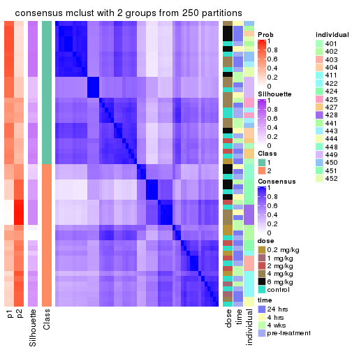</p>

</div>
<div id='tab-MAD-mclust-consensus-heatmap-2'>
<pre><code class="r">consensus_heatmap(res, k = 3)
</code></pre>

<p>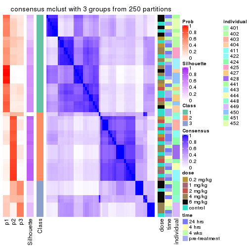</p>

</div>
<div id='tab-MAD-mclust-consensus-heatmap-3'>
<pre><code class="r">consensus_heatmap(res, k = 4)
</code></pre>

<p>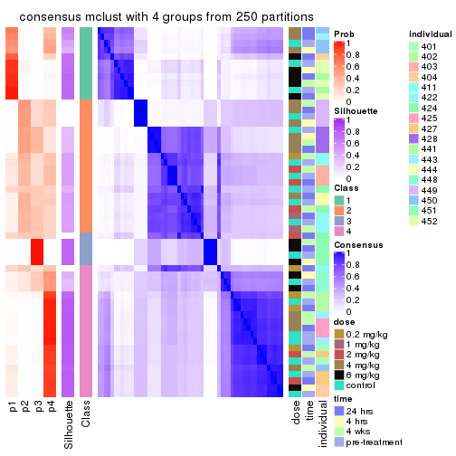</p>

</div>
<div id='tab-MAD-mclust-consensus-heatmap-4'>
<pre><code class="r">consensus_heatmap(res, k = 5)
</code></pre>

<p>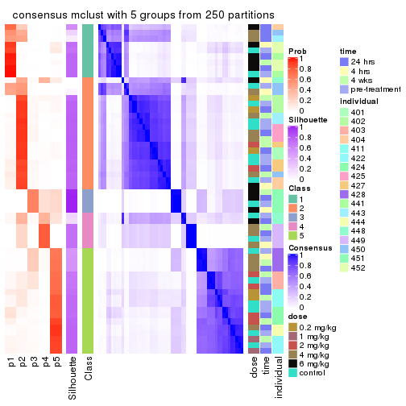</p>

</div>
<div id='tab-MAD-mclust-consensus-heatmap-5'>
<pre><code class="r">consensus_heatmap(res, k = 6)
</code></pre>

<p>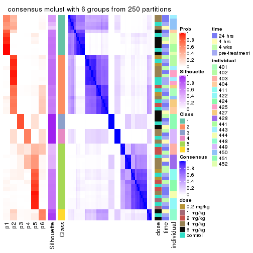</p>

</div>
</div>

Heatmaps for the membership of samples in all partitions to see how consistent they are:


<script>
$( function() {
	$( '#tabs-MAD-mclust-membership-heatmap' ).tabs();
} );
</script>
<div id='tabs-MAD-mclust-membership-heatmap'>
<ul>
<li><a href='#tab-MAD-mclust-membership-heatmap-1'>k = 2</a></li>
<li><a href='#tab-MAD-mclust-membership-heatmap-2'>k = 3</a></li>
<li><a href='#tab-MAD-mclust-membership-heatmap-3'>k = 4</a></li>
<li><a href='#tab-MAD-mclust-membership-heatmap-4'>k = 5</a></li>
<li><a href='#tab-MAD-mclust-membership-heatmap-5'>k = 6</a></li>
</ul>
<div id='tab-MAD-mclust-membership-heatmap-1'>
<pre><code class="r">membership_heatmap(res, k = 2)
</code></pre>

<p>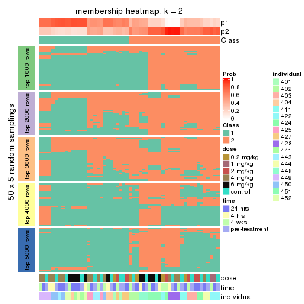</p>

</div>
<div id='tab-MAD-mclust-membership-heatmap-2'>
<pre><code class="r">membership_heatmap(res, k = 3)
</code></pre>

<p>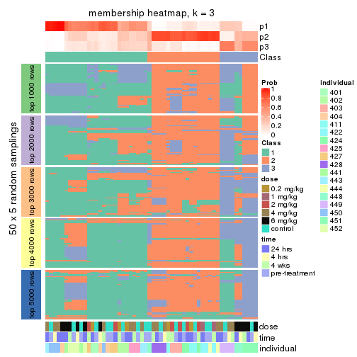</p>

</div>
<div id='tab-MAD-mclust-membership-heatmap-3'>
<pre><code class="r">membership_heatmap(res, k = 4)
</code></pre>

<p>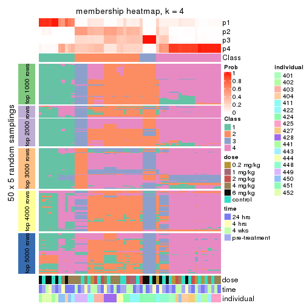</p>

</div>
<div id='tab-MAD-mclust-membership-heatmap-4'>
<pre><code class="r">membership_heatmap(res, k = 5)
</code></pre>

<p>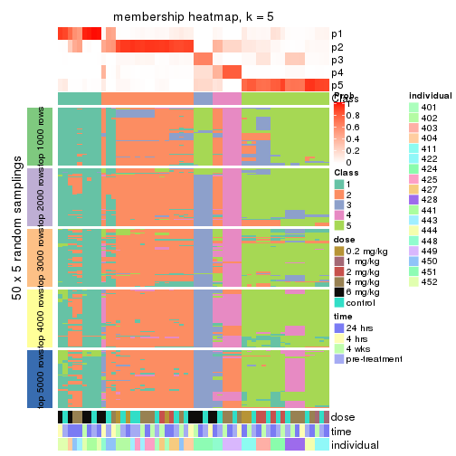</p>

</div>
<div id='tab-MAD-mclust-membership-heatmap-5'>
<pre><code class="r">membership_heatmap(res, k = 6)
</code></pre>

<p>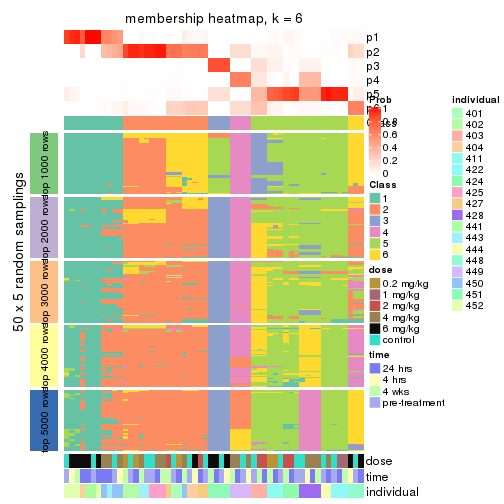</p>

</div>
</div>

As soon as we have had the classes for columns, we can look for signatures
which are significantly different between classes which can be candidate marks
for certain classes. Following are the heatmaps for signatures.


Signature heatmaps where rows are scaled:


<script>
$( function() {
	$( '#tabs-MAD-mclust-get-signatures' ).tabs();
} );
</script>
<div id='tabs-MAD-mclust-get-signatures'>
<ul>
<li><a href='#tab-MAD-mclust-get-signatures-1'>k = 2</a></li>
<li><a href='#tab-MAD-mclust-get-signatures-2'>k = 3</a></li>
<li><a href='#tab-MAD-mclust-get-signatures-3'>k = 4</a></li>
<li><a href='#tab-MAD-mclust-get-signatures-4'>k = 5</a></li>
<li><a href='#tab-MAD-mclust-get-signatures-5'>k = 6</a></li>
</ul>
<div id='tab-MAD-mclust-get-signatures-1'>
<pre><code class="r">get_signatures(res, k = 2)
</code></pre>

<p>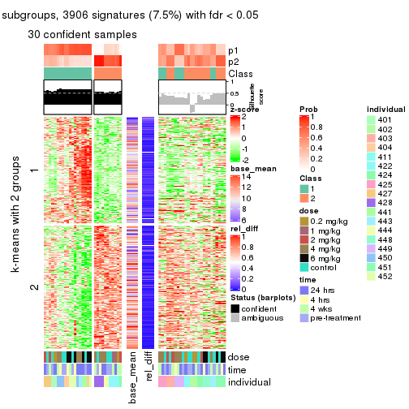</p>

</div>
<div id='tab-MAD-mclust-get-signatures-2'>
<pre><code class="r">get_signatures(res, k = 3)
</code></pre>

<p>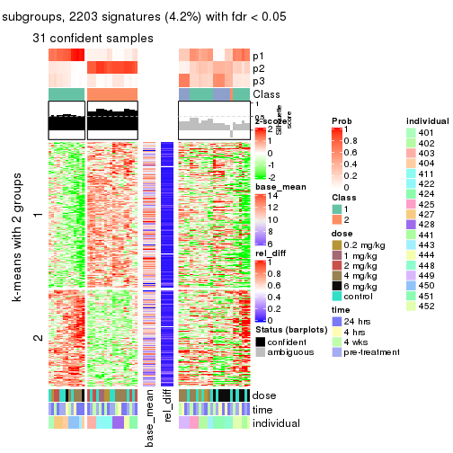</p>

</div>
<div id='tab-MAD-mclust-get-signatures-3'>
<pre><code class="r">get_signatures(res, k = 4)
</code></pre>

<p>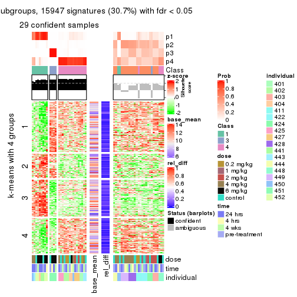</p>

</div>
<div id='tab-MAD-mclust-get-signatures-4'>
<pre><code class="r">get_signatures(res, k = 5)
</code></pre>

<p>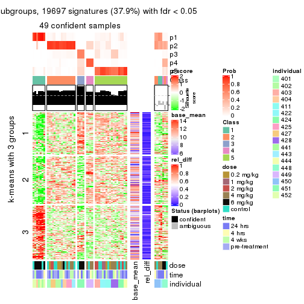</p>

</div>
<div id='tab-MAD-mclust-get-signatures-5'>
<pre><code class="r">get_signatures(res, k = 6)
</code></pre>

<p>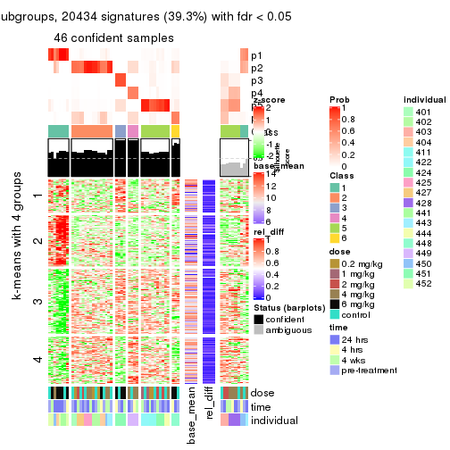</p>

</div>
</div>


Signature heatmaps where rows are not scaled:


<script>
$( function() {
	$( '#tabs-MAD-mclust-get-signatures-no-scale' ).tabs();
} );
</script>
<div id='tabs-MAD-mclust-get-signatures-no-scale'>
<ul>
<li><a href='#tab-MAD-mclust-get-signatures-no-scale-1'>k = 2</a></li>
<li><a href='#tab-MAD-mclust-get-signatures-no-scale-2'>k = 3</a></li>
<li><a href='#tab-MAD-mclust-get-signatures-no-scale-3'>k = 4</a></li>
<li><a href='#tab-MAD-mclust-get-signatures-no-scale-4'>k = 5</a></li>
<li><a href='#tab-MAD-mclust-get-signatures-no-scale-5'>k = 6</a></li>
</ul>
<div id='tab-MAD-mclust-get-signatures-no-scale-1'>
<pre><code class="r">get_signatures(res, k = 2, scale_rows = FALSE)
</code></pre>

<p>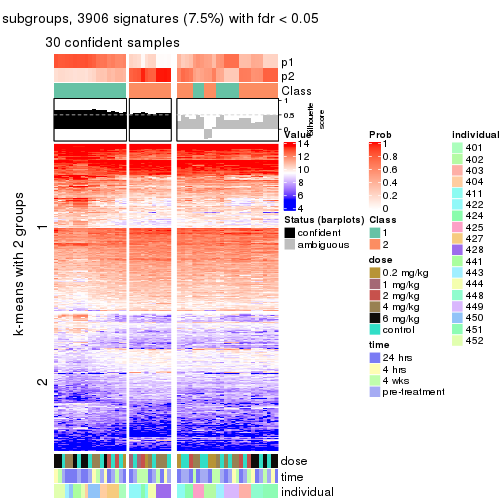</p>

</div>
<div id='tab-MAD-mclust-get-signatures-no-scale-2'>
<pre><code class="r">get_signatures(res, k = 3, scale_rows = FALSE)
</code></pre>

<p>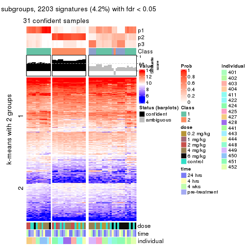</p>

</div>
<div id='tab-MAD-mclust-get-signatures-no-scale-3'>
<pre><code class="r">get_signatures(res, k = 4, scale_rows = FALSE)
</code></pre>

<p>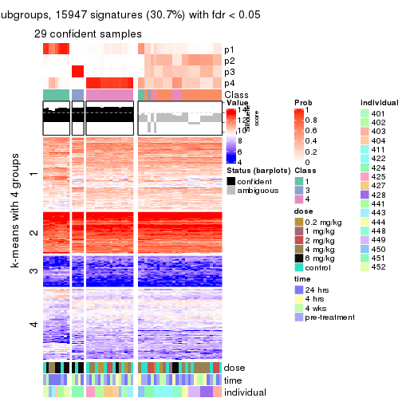</p>

</div>
<div id='tab-MAD-mclust-get-signatures-no-scale-4'>
<pre><code class="r">get_signatures(res, k = 5, scale_rows = FALSE)
</code></pre>

<p>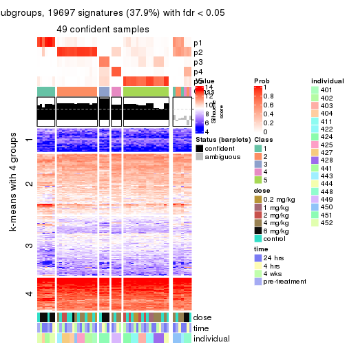</p>

</div>
<div id='tab-MAD-mclust-get-signatures-no-scale-5'>
<pre><code class="r">get_signatures(res, k = 6, scale_rows = FALSE)
</code></pre>

<p>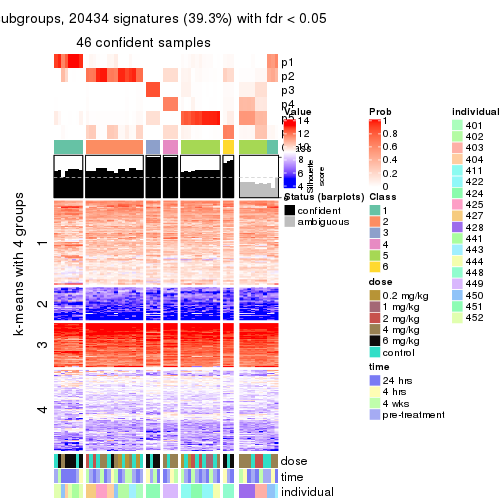</p>

</div>
</div>


Compare the overlap of signatures from different k:

```r
compare_signatures(res)
```

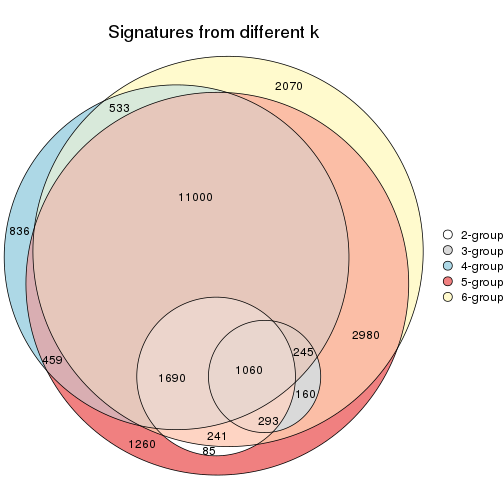

`get_signature()` returns a data frame invisibly. TO get the list of signatures, the function
call should be assigned to a variable explicitly. In following code, if `plot` argument is set
to `FALSE`, no heatmap is plotted while only the differential analysis is performed.

```r
# code only for demonstration
tb = get_signature(res, k = ..., plot = FALSE)
```

An example of the output of `tb` is:

```
#>   which_row         fdr    mean_1    mean_2 scaled_mean_1 scaled_mean_2 km
#> 1        38 0.042760348  8.373488  9.131774    -0.5533452     0.5164555  1
#> 2        40 0.018707592  7.106213  8.469186    -0.6173731     0.5762149  1
#> 3        55 0.019134737 10.221463 11.207825    -0.6159697     0.5749050  1
#> 4        59 0.006059896  5.921854  7.869574    -0.6899429     0.6439467  1
#> 5        60 0.018055526  8.928898 10.211722    -0.6204761     0.5791110  1
#> 6        98 0.009384629 15.714769 14.887706     0.6635654    -0.6193277  2
...
```

The columns in `tb` are:

1. `which_row`: row indices corresponding to the input matrix.
2. `fdr`: FDR for the differential test. 
3. `mean_x`: The mean value in group x.
4. `scaled_mean_x`: The mean value in group x after rows are scaled.
5. `km`: Row groups if k-means clustering is applied to rows.


UMAP plot which shows how samples are separated.


<script>
$( function() {
	$( '#tabs-MAD-mclust-dimension-reduction' ).tabs();
} );
</script>
<div id='tabs-MAD-mclust-dimension-reduction'>
<ul>
<li><a href='#tab-MAD-mclust-dimension-reduction-1'>k = 2</a></li>
<li><a href='#tab-MAD-mclust-dimension-reduction-2'>k = 3</a></li>
<li><a href='#tab-MAD-mclust-dimension-reduction-3'>k = 4</a></li>
<li><a href='#tab-MAD-mclust-dimension-reduction-4'>k = 5</a></li>
<li><a href='#tab-MAD-mclust-dimension-reduction-5'>k = 6</a></li>
</ul>
<div id='tab-MAD-mclust-dimension-reduction-1'>
<pre><code class="r">dimension_reduction(res, k = 2, method = &quot;UMAP&quot;)
</code></pre>

<p>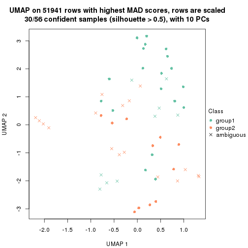</p>

</div>
<div id='tab-MAD-mclust-dimension-reduction-2'>
<pre><code class="r">dimension_reduction(res, k = 3, method = &quot;UMAP&quot;)
</code></pre>

<p>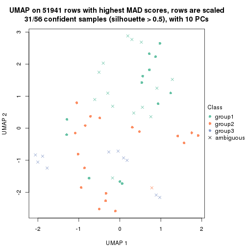</p>

</div>
<div id='tab-MAD-mclust-dimension-reduction-3'>
<pre><code class="r">dimension_reduction(res, k = 4, method = &quot;UMAP&quot;)
</code></pre>

<p>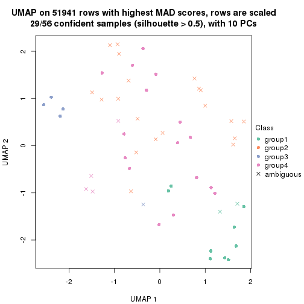</p>

</div>
<div id='tab-MAD-mclust-dimension-reduction-4'>
<pre><code class="r">dimension_reduction(res, k = 5, method = &quot;UMAP&quot;)
</code></pre>

<p>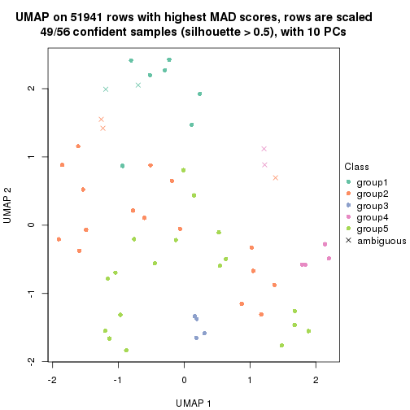</p>

</div>
<div id='tab-MAD-mclust-dimension-reduction-5'>
<pre><code class="r">dimension_reduction(res, k = 6, method = &quot;UMAP&quot;)
</code></pre>

<p>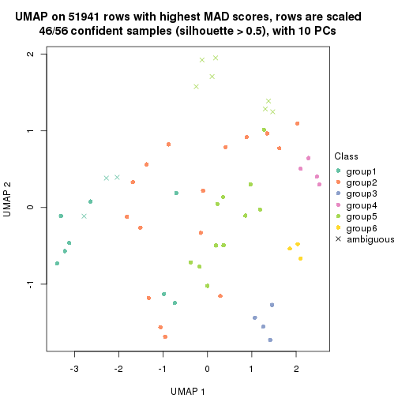</p>

</div>
</div>


Following heatmap shows how subgroups are split when increasing `k`:

```r
collect_classes(res)
```

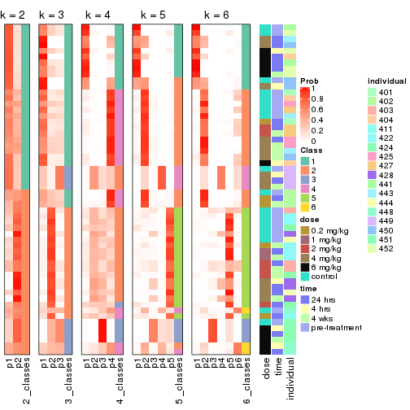


Test correlation between subgroups and known annotations. If the known
annotation is numeric, one-way ANOVA test is applied, and if the known
annotation is discrete, chi-squared contingency table test is applied.

```r
test_to_known_factors(res)
```

```
#>             n dose(p) time(p) individual(p) k
#> MAD:mclust 30 0.17049   0.630      1.58e-03 2
#> MAD:mclust 31 0.45148   0.720      5.87e-04 3
#> MAD:mclust 29 0.11415   0.645      1.16e-04 4
#> MAD:mclust 49 0.00471   0.985      2.57e-14 5
#> MAD:mclust 46 0.03342   0.938      3.69e-16 6
```


If matrix rows can be associated to genes, consider to use `functional_enrichment(res,
...)` to perform function enrichment for the signature genes. See [this vignette](http://bioconductor.org/packages/devel/bioc/vignettes/cola/inst/doc/functional_enrichment.html) for more detailed explanations.


 

---------------------------------------------------


### MAD:NMF


The object with results only for a single top-value method and a single partition method 
can be extracted as:

```r
res = res_list["MAD", "NMF"]
# you can also extract it by
# res = res_list["MAD:NMF"]
```

A summary of `res` and all the functions that can be applied to it:

```r
res
```

```
#> A 'ConsensusPartition' object with k = 2, 3, 4, 5, 6.
#>   On a matrix with 51941 rows and 56 columns.
#>   Top rows (1000, 2000, 3000, 4000, 5000) are extracted by 'MAD' method.
#>   Subgroups are detected by 'NMF' method.
#>   Performed in total 1250 partitions by row resampling.
#>   Best k for subgroups seems to be 2.
#> 
#> Following methods can be applied to this 'ConsensusPartition' object:
#>  [1] "cola_report"             "collect_classes"         "collect_plots"          
#>  [4] "collect_stats"           "colnames"                "compare_signatures"     
#>  [7] "consensus_heatmap"       "dimension_reduction"     "functional_enrichment"  
#> [10] "get_anno_col"            "get_anno"                "get_classes"            
#> [13] "get_consensus"           "get_matrix"              "get_membership"         
#> [16] "get_param"               "get_signatures"          "get_stats"              
#> [19] "is_best_k"               "is_stable_k"             "membership_heatmap"     
#> [22] "ncol"                    "nrow"                    "plot_ecdf"              
#> [25] "rownames"                "select_partition_number" "show"                   
#> [28] "suggest_best_k"          "test_to_known_factors"
```

`collect_plots()` function collects all the plots made from `res` for all `k` (number of partitions)
into one single page to provide an easy and fast comparison between different `k`.

```r
collect_plots(res)
```

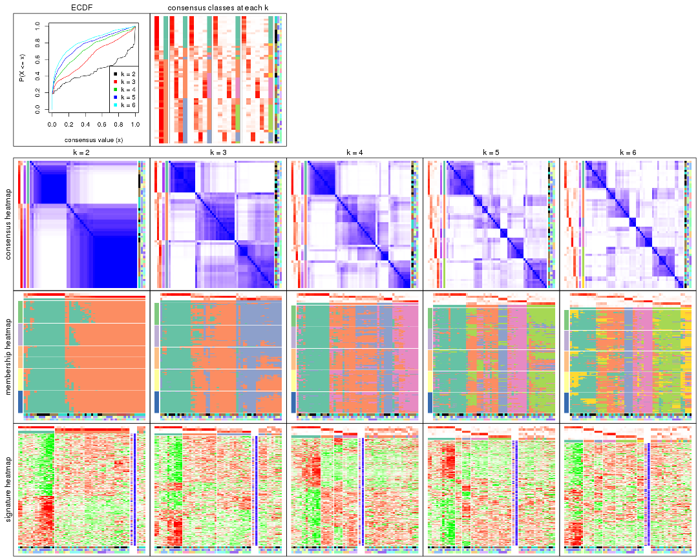

The plots are:

- The first row: a plot of the ECDF (empirical cumulative distribution
  function) curves of the consensus matrix for each `k` and the heatmap of
  predicted classes for each `k`.
- The second row: heatmaps of the consensus matrix for each `k`.
- The third row: heatmaps of the membership matrix for each `k`.
- The fouth row: heatmaps of the signatures for each `k`.

All the plots in panels can be made by individual functions and they are
plotted later in this section.

`select_partition_number()` produces several plots showing different
statistics for choosing "optimized" `k`. There are following statistics:

- ECDF curves of the consensus matrix for each `k`;
- 1-PAC. [The PAC
  score](https://en.wikipedia.org/wiki/Consensus_clustering#Over-interpretation_potential_of_consensus_clustering)
  measures the proportion of the ambiguous subgrouping.
- Mean silhouette score.
- Concordance. The mean probability of fiting the consensus class ids in all
  partitions.
- Area increased. Denote $A_k$ as the area under the ECDF curve for current
  `k`, the area increased is defined as $A_k - A_{k-1}$.
- Rand index. The percent of pairs of samples that are both in a same cluster
  or both are not in a same cluster in the partition of k and k-1.
- Jaccard index. The ratio of pairs of samples are both in a same cluster in
  the partition of k and k-1 and the pairs of samples are both in a same
  cluster in the partition k or k-1.

The detailed explanations of these statistics can be found in [the _cola_
vignette](http://bioconductor.org/packages/devel/bioc/vignettes/cola/inst/doc/cola.html#toc_13).

Generally speaking, lower PAC score, higher mean silhouette score or higher
concordance corresponds to better partition. Rand index and Jaccard index
measure how similar the current partition is compared to partition with `k-1`.
If they are too similar, we won't accept `k` is better than `k-1`.

```r
select_partition_number(res)
```

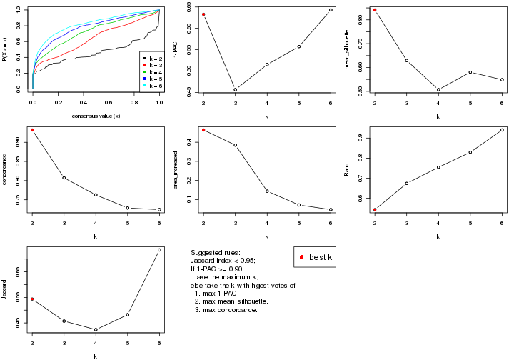

The numeric values for all these statistics can be obtained by `get_stats()`.

```r
get_stats(res)
```

```
#>   k 1-PAC mean_silhouette concordance area_increased  Rand Jaccard
#> 2 2 0.633           0.841       0.932         0.4641 0.544   0.544
#> 3 3 0.456           0.629       0.807         0.3848 0.674   0.457
#> 4 4 0.515           0.507       0.763         0.1439 0.755   0.424
#> 5 5 0.557           0.580       0.729         0.0716 0.829   0.482
#> 6 6 0.643           0.549       0.724         0.0471 0.940   0.736
```

`suggest_best_k()` suggests the best $k$ based on these statistics. The rules are as follows:

- All $k$ with Jaccard index larger than 0.95 are removed because increasing
  $k$ does not provide enough extra information. If all $k$ are removed, it is
  marked as no subgroup is detected.
- For all $k$ with 1-PAC score larger than 0.9, the maximal $k$ is taken as
  the best $k$, and other $k$ are marked as optional $k$.
- If it does not fit the second rule. The $k$ with the maximal vote of the
  highest 1-PAC score, highest mean silhouette, and highest concordance is
  taken as the best $k$.

```r
suggest_best_k(res)
```

```
#> [1] 2
```


Following shows the table of the partitions (You need to click the **show/hide
code output** link to see it). The membership matrix (columns with name `p*`)
is inferred by
[`clue::cl_consensus()`](https://www.rdocumentation.org/link/cl_consensus?package=clue)
function with the `SE` method. Basically the value in the membership matrix
represents the probability to belong to a certain group. The finall class
label for an item is determined with the group with highest probability it
belongs to.

In `get_classes()` function, the entropy is calculated from the membership
matrix and the silhouette score is calculated from the consensus matrix.


<script>
$( function() {
	$( '#tabs-MAD-NMF-get-classes' ).tabs();
} );
</script>
<div id='tabs-MAD-NMF-get-classes'>
<ul>
<li><a href='#tab-MAD-NMF-get-classes-1'>k = 2</a></li>
<li><a href='#tab-MAD-NMF-get-classes-2'>k = 3</a></li>
<li><a href='#tab-MAD-NMF-get-classes-3'>k = 4</a></li>
<li><a href='#tab-MAD-NMF-get-classes-4'>k = 5</a></li>
<li><a href='#tab-MAD-NMF-get-classes-5'>k = 6</a></li>
</ul>

<div id='tab-MAD-NMF-get-classes-1'>
<p><a id='tab-MAD-NMF-get-classes-1-a' style='color:#0366d6' href='#'>show/hide code output</a></p>
<pre><code class="r">cbind(get_classes(res, k = 2), get_membership(res, k = 2))
</code></pre>

<pre><code>#&gt;           class entropy silhouette    p1    p2
#&gt; GSM687644     2  0.0000      0.922 0.000 1.000
#&gt; GSM687648     2  0.9954      0.205 0.460 0.540
#&gt; GSM687653     2  0.0000      0.922 0.000 1.000
#&gt; GSM687658     1  0.5294      0.822 0.880 0.120
#&gt; GSM687663     2  0.3114      0.895 0.056 0.944
#&gt; GSM687668     2  0.0000      0.922 0.000 1.000
#&gt; GSM687673     2  0.7883      0.684 0.236 0.764
#&gt; GSM687678     2  0.4690      0.866 0.100 0.900
#&gt; GSM687683     2  0.9944      0.212 0.456 0.544
#&gt; GSM687688     2  0.0000      0.922 0.000 1.000
#&gt; GSM687695     1  0.0000      0.925 1.000 0.000
#&gt; GSM687699     1  0.9248      0.455 0.660 0.340
#&gt; GSM687704     2  0.0000      0.922 0.000 1.000
#&gt; GSM687707     2  0.4431      0.872 0.092 0.908
#&gt; GSM687712     2  0.1633      0.912 0.024 0.976
#&gt; GSM687719     1  0.0000      0.925 1.000 0.000
#&gt; GSM687724     2  0.0376      0.920 0.004 0.996
#&gt; GSM687728     1  0.0000      0.925 1.000 0.000
#&gt; GSM687646     2  0.0000      0.922 0.000 1.000
#&gt; GSM687649     2  0.7745      0.729 0.228 0.772
#&gt; GSM687665     1  0.3584      0.880 0.932 0.068
#&gt; GSM687651     2  0.5059      0.855 0.112 0.888
#&gt; GSM687667     2  0.0000      0.922 0.000 1.000
#&gt; GSM687670     2  0.0000      0.922 0.000 1.000
#&gt; GSM687671     2  0.0000      0.922 0.000 1.000
#&gt; GSM687654     2  0.0000      0.922 0.000 1.000
#&gt; GSM687675     1  0.6247      0.796 0.844 0.156
#&gt; GSM687685     2  0.7602      0.742 0.220 0.780
#&gt; GSM687656     2  0.0000      0.922 0.000 1.000
#&gt; GSM687677     2  0.0000      0.922 0.000 1.000
#&gt; GSM687687     2  0.0000      0.922 0.000 1.000
#&gt; GSM687692     2  0.0000      0.922 0.000 1.000
#&gt; GSM687716     2  0.0000      0.922 0.000 1.000
#&gt; GSM687722     1  0.0000      0.925 1.000 0.000
#&gt; GSM687680     1  1.0000     -0.109 0.504 0.496
#&gt; GSM687690     2  0.0000      0.922 0.000 1.000
#&gt; GSM687700     1  0.0000      0.925 1.000 0.000
#&gt; GSM687705     2  0.0000      0.922 0.000 1.000
#&gt; GSM687714     2  0.0000      0.922 0.000 1.000
#&gt; GSM687721     1  0.0000      0.925 1.000 0.000
#&gt; GSM687682     2  0.8207      0.685 0.256 0.744
#&gt; GSM687694     2  0.0000      0.922 0.000 1.000
#&gt; GSM687702     1  0.1843      0.908 0.972 0.028
#&gt; GSM687718     2  0.0000      0.922 0.000 1.000
#&gt; GSM687723     1  0.0000      0.925 1.000 0.000
#&gt; GSM687661     1  0.0000      0.925 1.000 0.000
#&gt; GSM687710     2  0.1843      0.910 0.028 0.972
#&gt; GSM687726     2  0.0000      0.922 0.000 1.000
#&gt; GSM687730     1  0.0000      0.925 1.000 0.000
#&gt; GSM687660     1  0.0000      0.925 1.000 0.000
#&gt; GSM687697     1  0.0000      0.925 1.000 0.000
#&gt; GSM687709     2  0.4690      0.866 0.100 0.900
#&gt; GSM687725     2  0.7602      0.702 0.220 0.780
#&gt; GSM687729     1  0.0000      0.925 1.000 0.000
#&gt; GSM687727     2  0.0000      0.922 0.000 1.000
#&gt; GSM687731     1  0.0000      0.925 1.000 0.000
</code></pre>

<script>
$('#tab-MAD-NMF-get-classes-1-a').parent().next().next().hide();
$('#tab-MAD-NMF-get-classes-1-a').click(function(){
  $('#tab-MAD-NMF-get-classes-1-a').parent().next().next().toggle();
  return(false);
});
</script>
</div>

<div id='tab-MAD-NMF-get-classes-2'>
<p><a id='tab-MAD-NMF-get-classes-2-a' style='color:#0366d6' href='#'>show/hide code output</a></p>
<pre><code class="r">cbind(get_classes(res, k = 3), get_membership(res, k = 3))
</code></pre>

<pre><code>#&gt;           class entropy silhouette    p1    p2    p3
#&gt; GSM687644     2  0.0592     0.7314 0.000 0.988 0.012
#&gt; GSM687648     2  0.6126     0.6072 0.268 0.712 0.020
#&gt; GSM687653     3  0.6305     0.4588 0.000 0.484 0.516
#&gt; GSM687658     2  0.6225     0.2472 0.432 0.568 0.000
#&gt; GSM687663     3  0.5062     0.6435 0.016 0.184 0.800
#&gt; GSM687668     3  0.6192     0.5914 0.000 0.420 0.580
#&gt; GSM687673     3  0.3802     0.6073 0.080 0.032 0.888
#&gt; GSM687678     2  0.2663     0.7237 0.024 0.932 0.044
#&gt; GSM687683     2  0.2384     0.7279 0.056 0.936 0.008
#&gt; GSM687688     3  0.5678     0.6540 0.000 0.316 0.684
#&gt; GSM687695     1  0.0592     0.9262 0.988 0.000 0.012
#&gt; GSM687699     2  0.6253     0.6329 0.232 0.732 0.036
#&gt; GSM687704     3  0.6026     0.6250 0.000 0.376 0.624
#&gt; GSM687707     3  0.7001     0.0993 0.024 0.388 0.588
#&gt; GSM687712     2  0.0892     0.7329 0.000 0.980 0.020
#&gt; GSM687719     1  0.0592     0.9259 0.988 0.012 0.000
#&gt; GSM687724     3  0.1015     0.6102 0.008 0.012 0.980
#&gt; GSM687728     1  0.0892     0.9232 0.980 0.000 0.020
#&gt; GSM687646     2  0.1163     0.7265 0.000 0.972 0.028
#&gt; GSM687649     2  0.5334     0.6846 0.120 0.820 0.060
#&gt; GSM687665     1  0.6672     0.1238 0.520 0.008 0.472
#&gt; GSM687651     2  0.5241     0.6402 0.048 0.820 0.132
#&gt; GSM687667     3  0.4887     0.6497 0.000 0.228 0.772
#&gt; GSM687670     3  0.5591     0.6646 0.000 0.304 0.696
#&gt; GSM687671     3  0.6307     0.4776 0.000 0.488 0.512
#&gt; GSM687654     3  0.6307     0.4628 0.000 0.488 0.512
#&gt; GSM687675     3  0.6062     0.1820 0.384 0.000 0.616
#&gt; GSM687685     2  0.1620     0.7352 0.024 0.964 0.012
#&gt; GSM687656     2  0.6267    -0.3744 0.000 0.548 0.452
#&gt; GSM687677     3  0.4931     0.6719 0.000 0.232 0.768
#&gt; GSM687687     2  0.1411     0.7233 0.000 0.964 0.036
#&gt; GSM687692     3  0.5968     0.6317 0.000 0.364 0.636
#&gt; GSM687716     2  0.1964     0.7083 0.000 0.944 0.056
#&gt; GSM687722     1  0.1031     0.9193 0.976 0.024 0.000
#&gt; GSM687680     2  0.4842     0.6550 0.224 0.776 0.000
#&gt; GSM687690     3  0.6180     0.5782 0.000 0.416 0.584
#&gt; GSM687700     1  0.0592     0.9259 0.988 0.012 0.000
#&gt; GSM687705     3  0.6079     0.6210 0.000 0.388 0.612
#&gt; GSM687714     2  0.0747     0.7326 0.000 0.984 0.016
#&gt; GSM687721     1  0.0592     0.9259 0.988 0.012 0.000
#&gt; GSM687682     2  0.3989     0.7105 0.124 0.864 0.012
#&gt; GSM687694     3  0.6180     0.5763 0.000 0.416 0.584
#&gt; GSM687702     2  0.6302     0.1818 0.480 0.520 0.000
#&gt; GSM687718     2  0.1031     0.7322 0.000 0.976 0.024
#&gt; GSM687723     1  0.2625     0.8653 0.916 0.084 0.000
#&gt; GSM687661     1  0.3941     0.7863 0.844 0.156 0.000
#&gt; GSM687710     2  0.6104     0.3445 0.004 0.648 0.348
#&gt; GSM687726     3  0.0661     0.6104 0.008 0.004 0.988
#&gt; GSM687730     1  0.1163     0.9188 0.972 0.000 0.028
#&gt; GSM687660     1  0.0237     0.9268 0.996 0.004 0.000
#&gt; GSM687697     1  0.0237     0.9272 0.996 0.000 0.004
#&gt; GSM687709     2  0.6944     0.0561 0.016 0.516 0.468
#&gt; GSM687725     3  0.1015     0.6102 0.008 0.012 0.980
#&gt; GSM687729     1  0.0592     0.9262 0.988 0.000 0.012
#&gt; GSM687727     3  0.0829     0.6114 0.004 0.012 0.984
#&gt; GSM687731     1  0.0424     0.9268 0.992 0.000 0.008
</code></pre>

<script>
$('#tab-MAD-NMF-get-classes-2-a').parent().next().next().hide();
$('#tab-MAD-NMF-get-classes-2-a').click(function(){
  $('#tab-MAD-NMF-get-classes-2-a').parent().next().next().toggle();
  return(false);
});
</script>
</div>

<div id='tab-MAD-NMF-get-classes-3'>
<p><a id='tab-MAD-NMF-get-classes-3-a' style='color:#0366d6' href='#'>show/hide code output</a></p>
<pre><code class="r">cbind(get_classes(res, k = 4), get_membership(res, k = 4))
</code></pre>

<pre><code>#&gt;           class entropy silhouette    p1    p2    p3    p4
#&gt; GSM687644     4  0.4830     0.4340 0.000 0.392 0.000 0.608
#&gt; GSM687648     2  0.6979     0.2514 0.180 0.624 0.012 0.184
#&gt; GSM687653     2  0.2214     0.5480 0.000 0.928 0.044 0.028
#&gt; GSM687658     4  0.5285    -0.0434 0.468 0.008 0.000 0.524
#&gt; GSM687663     2  0.4401     0.4513 0.004 0.724 0.272 0.000
#&gt; GSM687668     2  0.6989     0.2179 0.004 0.484 0.412 0.100
#&gt; GSM687673     2  0.5807     0.1563 0.016 0.492 0.484 0.008
#&gt; GSM687678     2  0.4372     0.2856 0.000 0.728 0.004 0.268
#&gt; GSM687683     4  0.2844     0.7081 0.048 0.052 0.000 0.900
#&gt; GSM687688     2  0.6324     0.3024 0.000 0.536 0.400 0.064
#&gt; GSM687695     1  0.0817     0.8836 0.976 0.000 0.024 0.000
#&gt; GSM687699     2  0.7031     0.1088 0.348 0.520 0.000 0.132
#&gt; GSM687704     2  0.5168     0.5018 0.000 0.712 0.248 0.040
#&gt; GSM687707     3  0.7704    -0.1955 0.004 0.188 0.420 0.388
#&gt; GSM687712     4  0.0817     0.7331 0.000 0.024 0.000 0.976
#&gt; GSM687719     1  0.1042     0.8846 0.972 0.000 0.008 0.020
#&gt; GSM687724     3  0.0188     0.6600 0.000 0.004 0.996 0.000
#&gt; GSM687728     1  0.0707     0.8830 0.980 0.000 0.020 0.000
#&gt; GSM687646     4  0.4790     0.4433 0.000 0.380 0.000 0.620
#&gt; GSM687649     2  0.4914     0.4045 0.036 0.772 0.012 0.180
#&gt; GSM687665     2  0.7573     0.1182 0.332 0.460 0.208 0.000
#&gt; GSM687651     2  0.4741     0.3670 0.000 0.744 0.028 0.228
#&gt; GSM687667     2  0.3900     0.5294 0.000 0.816 0.164 0.020
#&gt; GSM687670     3  0.6503    -0.2406 0.000 0.448 0.480 0.072
#&gt; GSM687671     2  0.5655     0.5020 0.000 0.704 0.212 0.084
#&gt; GSM687654     2  0.1724     0.5487 0.000 0.948 0.032 0.020
#&gt; GSM687675     3  0.7067     0.2992 0.288 0.160 0.552 0.000
#&gt; GSM687685     4  0.2635     0.7292 0.020 0.076 0.000 0.904
#&gt; GSM687656     2  0.1584     0.5496 0.000 0.952 0.012 0.036
#&gt; GSM687677     2  0.5498     0.3295 0.000 0.576 0.404 0.020
#&gt; GSM687687     4  0.3528     0.6723 0.000 0.192 0.000 0.808
#&gt; GSM687692     2  0.6249     0.3946 0.000 0.592 0.336 0.072
#&gt; GSM687716     4  0.1452     0.7339 0.000 0.036 0.008 0.956
#&gt; GSM687722     1  0.1004     0.8817 0.972 0.004 0.000 0.024
#&gt; GSM687680     1  0.8056    -0.2120 0.368 0.300 0.004 0.328
#&gt; GSM687690     2  0.5851     0.4810 0.000 0.680 0.236 0.084
#&gt; GSM687700     1  0.0000     0.8858 1.000 0.000 0.000 0.000
#&gt; GSM687705     2  0.5649     0.4727 0.000 0.664 0.284 0.052
#&gt; GSM687714     4  0.0921     0.7340 0.000 0.028 0.000 0.972
#&gt; GSM687721     1  0.0188     0.8859 0.996 0.000 0.000 0.004
#&gt; GSM687682     2  0.7008    -0.2536 0.100 0.460 0.004 0.436
#&gt; GSM687694     2  0.6136     0.4374 0.000 0.632 0.288 0.080
#&gt; GSM687702     1  0.5833     0.5749 0.692 0.212 0.000 0.096
#&gt; GSM687718     4  0.1022     0.7349 0.000 0.032 0.000 0.968
#&gt; GSM687723     1  0.3072     0.8132 0.868 0.004 0.004 0.124
#&gt; GSM687661     1  0.3764     0.7039 0.784 0.000 0.000 0.216
#&gt; GSM687710     4  0.7245     0.3930 0.000 0.324 0.164 0.512
#&gt; GSM687726     3  0.0336     0.6597 0.000 0.008 0.992 0.000
#&gt; GSM687730     1  0.1557     0.8686 0.944 0.000 0.056 0.000
#&gt; GSM687660     1  0.0000     0.8858 1.000 0.000 0.000 0.000
#&gt; GSM687697     1  0.0707     0.8846 0.980 0.000 0.020 0.000
#&gt; GSM687709     4  0.7627     0.3454 0.004 0.252 0.240 0.504
#&gt; GSM687725     3  0.0000     0.6584 0.000 0.000 1.000 0.000
#&gt; GSM687729     1  0.1398     0.8781 0.956 0.004 0.040 0.000
#&gt; GSM687727     3  0.1211     0.6425 0.000 0.040 0.960 0.000
#&gt; GSM687731     1  0.0524     0.8862 0.988 0.004 0.008 0.000
</code></pre>

<script>
$('#tab-MAD-NMF-get-classes-3-a').parent().next().next().hide();
$('#tab-MAD-NMF-get-classes-3-a').click(function(){
  $('#tab-MAD-NMF-get-classes-3-a').parent().next().next().toggle();
  return(false);
});
</script>
</div>

<div id='tab-MAD-NMF-get-classes-4'>
<p><a id='tab-MAD-NMF-get-classes-4-a' style='color:#0366d6' href='#'>show/hide code output</a></p>
<pre><code class="r">cbind(get_classes(res, k = 5), get_membership(res, k = 5))
</code></pre>

<pre><code>#&gt;           class entropy silhouette    p1    p2    p3    p4    p5
#&gt; GSM687644     4  0.5987     0.3567 0.000 0.324 0.000 0.544 0.132
#&gt; GSM687648     2  0.4211     0.5298 0.052 0.824 0.020 0.020 0.084
#&gt; GSM687653     2  0.4934     0.2400 0.000 0.544 0.020 0.004 0.432
#&gt; GSM687658     1  0.7777     0.0769 0.408 0.148 0.048 0.372 0.024
#&gt; GSM687663     2  0.5944     0.0767 0.008 0.464 0.080 0.000 0.448
#&gt; GSM687668     5  0.4824     0.6956 0.016 0.040 0.124 0.040 0.780
#&gt; GSM687673     5  0.5691     0.6020 0.092 0.044 0.156 0.004 0.704
#&gt; GSM687678     2  0.5582     0.4810 0.008 0.688 0.008 0.132 0.164
#&gt; GSM687683     4  0.4059     0.7587 0.092 0.032 0.008 0.828 0.040
#&gt; GSM687688     5  0.3595     0.6763 0.000 0.004 0.120 0.048 0.828
#&gt; GSM687695     1  0.1758     0.8278 0.944 0.020 0.024 0.004 0.008
#&gt; GSM687699     2  0.6315     0.3654 0.280 0.592 0.012 0.016 0.100
#&gt; GSM687704     5  0.4973     0.5001 0.000 0.236 0.060 0.008 0.696
#&gt; GSM687707     2  0.7005     0.1759 0.004 0.488 0.332 0.144 0.032
#&gt; GSM687712     4  0.0798     0.8250 0.000 0.008 0.000 0.976 0.016
#&gt; GSM687719     1  0.2008     0.8148 0.936 0.020 0.016 0.020 0.008
#&gt; GSM687724     3  0.2660     0.9654 0.000 0.008 0.864 0.000 0.128
#&gt; GSM687728     1  0.3923     0.7969 0.832 0.064 0.080 0.004 0.020
#&gt; GSM687646     4  0.5312     0.5647 0.000 0.256 0.000 0.648 0.096
#&gt; GSM687649     2  0.3884     0.5118 0.020 0.808 0.004 0.016 0.152
#&gt; GSM687665     2  0.8156     0.1343 0.284 0.320 0.100 0.000 0.296
#&gt; GSM687651     2  0.3729     0.5240 0.000 0.844 0.056 0.036 0.064
#&gt; GSM687667     5  0.5319    -0.1249 0.000 0.464 0.040 0.004 0.492
#&gt; GSM687670     5  0.5261     0.6648 0.024 0.056 0.152 0.024 0.744
#&gt; GSM687671     5  0.3321     0.6753 0.000 0.092 0.012 0.040 0.856
#&gt; GSM687654     2  0.4892     0.1277 0.000 0.496 0.016 0.004 0.484
#&gt; GSM687675     5  0.7156     0.1960 0.260 0.020 0.248 0.004 0.468
#&gt; GSM687685     4  0.3536     0.8035 0.040 0.048 0.000 0.856 0.056
#&gt; GSM687656     2  0.4874     0.2053 0.000 0.528 0.016 0.004 0.452
#&gt; GSM687677     5  0.3354     0.6972 0.004 0.024 0.140 0.000 0.832
#&gt; GSM687687     4  0.4389     0.7517 0.000 0.120 0.008 0.780 0.092
#&gt; GSM687692     5  0.3441     0.6865 0.000 0.008 0.088 0.056 0.848
#&gt; GSM687716     4  0.0912     0.8259 0.000 0.012 0.000 0.972 0.016
#&gt; GSM687722     1  0.1882     0.8169 0.940 0.016 0.020 0.020 0.004
#&gt; GSM687680     2  0.7781     0.0884 0.276 0.408 0.020 0.268 0.028
#&gt; GSM687690     5  0.2989     0.7026 0.000 0.024 0.040 0.052 0.884
#&gt; GSM687700     1  0.1725     0.8270 0.936 0.044 0.020 0.000 0.000
#&gt; GSM687705     5  0.4986     0.6099 0.000 0.164 0.080 0.020 0.736
#&gt; GSM687714     4  0.1117     0.8277 0.000 0.016 0.000 0.964 0.020
#&gt; GSM687721     1  0.1602     0.8198 0.952 0.016 0.012 0.012 0.008
#&gt; GSM687682     2  0.6969     0.0649 0.076 0.508 0.008 0.344 0.064
#&gt; GSM687694     5  0.3046     0.7062 0.000 0.020 0.052 0.048 0.880
#&gt; GSM687702     1  0.5782     0.3239 0.548 0.392 0.016 0.020 0.024
#&gt; GSM687718     4  0.1211     0.8263 0.000 0.024 0.000 0.960 0.016
#&gt; GSM687723     1  0.5125     0.7277 0.776 0.080 0.052 0.068 0.024
#&gt; GSM687661     1  0.5323     0.6556 0.712 0.044 0.028 0.204 0.012
#&gt; GSM687710     2  0.6245     0.3278 0.004 0.616 0.200 0.164 0.016
#&gt; GSM687726     3  0.2674     0.9659 0.000 0.004 0.856 0.000 0.140
#&gt; GSM687730     1  0.4181     0.7711 0.792 0.060 0.140 0.004 0.004
#&gt; GSM687660     1  0.1095     0.8272 0.968 0.008 0.012 0.000 0.012
#&gt; GSM687697     1  0.1982     0.8264 0.932 0.036 0.024 0.004 0.004
#&gt; GSM687709     2  0.7058     0.2637 0.008 0.528 0.248 0.188 0.028
#&gt; GSM687725     3  0.2597     0.9568 0.004 0.004 0.872 0.000 0.120
#&gt; GSM687729     1  0.2977     0.8157 0.880 0.052 0.060 0.004 0.004
#&gt; GSM687727     3  0.3242     0.9311 0.000 0.012 0.816 0.000 0.172
#&gt; GSM687731     1  0.3418     0.8043 0.852 0.084 0.056 0.004 0.004
</code></pre>

<script>
$('#tab-MAD-NMF-get-classes-4-a').parent().next().next().hide();
$('#tab-MAD-NMF-get-classes-4-a').click(function(){
  $('#tab-MAD-NMF-get-classes-4-a').parent().next().next().toggle();
  return(false);
});
</script>
</div>

<div id='tab-MAD-NMF-get-classes-5'>
<p><a id='tab-MAD-NMF-get-classes-5-a' style='color:#0366d6' href='#'>show/hide code output</a></p>
<pre><code class="r">cbind(get_classes(res, k = 6), get_membership(res, k = 6))
</code></pre>

<pre><code>#&gt;           class entropy silhouette    p1    p2    p3    p4    p5    p6
#&gt; GSM687644     4  0.5089   0.250757 0.000 0.424 0.004 0.520 0.036 0.016
#&gt; GSM687648     2  0.2993   0.561705 0.064 0.868 0.008 0.012 0.000 0.048
#&gt; GSM687653     2  0.5677   0.312246 0.000 0.540 0.012 0.000 0.316 0.132
#&gt; GSM687658     6  0.6295   0.329269 0.252 0.016 0.000 0.152 0.028 0.552
#&gt; GSM687663     2  0.7083   0.256602 0.008 0.456 0.092 0.000 0.280 0.164
#&gt; GSM687668     5  0.3622   0.700493 0.004 0.016 0.052 0.032 0.844 0.052
#&gt; GSM687673     5  0.4647   0.621057 0.068 0.004 0.040 0.000 0.744 0.144
#&gt; GSM687678     2  0.4160   0.547265 0.044 0.808 0.004 0.088 0.024 0.032
#&gt; GSM687683     4  0.5578   0.482593 0.076 0.016 0.000 0.668 0.052 0.188
#&gt; GSM687688     5  0.4242   0.659060 0.000 0.032 0.096 0.024 0.796 0.052
#&gt; GSM687695     1  0.1088   0.724389 0.960 0.016 0.000 0.000 0.000 0.024
#&gt; GSM687699     2  0.4218   0.532679 0.164 0.772 0.012 0.020 0.008 0.024
#&gt; GSM687704     5  0.6159   0.445185 0.000 0.188 0.072 0.004 0.600 0.136
#&gt; GSM687707     6  0.5913   0.576513 0.016 0.128 0.116 0.044 0.020 0.676
#&gt; GSM687712     4  0.0622   0.744188 0.000 0.000 0.008 0.980 0.000 0.012
#&gt; GSM687719     1  0.4924   0.495389 0.648 0.008 0.012 0.004 0.040 0.288
#&gt; GSM687724     3  0.1408   0.966783 0.000 0.000 0.944 0.000 0.036 0.020
#&gt; GSM687728     1  0.3948   0.647886 0.796 0.136 0.032 0.004 0.004 0.028
#&gt; GSM687646     4  0.4439   0.470573 0.000 0.336 0.004 0.632 0.020 0.008
#&gt; GSM687649     2  0.2918   0.564471 0.032 0.884 0.008 0.012 0.016 0.048
#&gt; GSM687665     2  0.8666   0.092572 0.240 0.280 0.116 0.000 0.236 0.128
#&gt; GSM687651     2  0.2936   0.526558 0.004 0.860 0.020 0.008 0.004 0.104
#&gt; GSM687667     5  0.6370  -0.071509 0.000 0.376 0.032 0.000 0.424 0.168
#&gt; GSM687670     5  0.3936   0.690779 0.000 0.020 0.076 0.016 0.812 0.076
#&gt; GSM687671     5  0.3474   0.674997 0.000 0.068 0.024 0.028 0.848 0.032
#&gt; GSM687654     2  0.5609   0.221642 0.000 0.508 0.008 0.000 0.364 0.120
#&gt; GSM687675     5  0.6628   0.247824 0.248 0.008 0.040 0.000 0.496 0.208
#&gt; GSM687685     4  0.5295   0.654770 0.028 0.088 0.000 0.724 0.096 0.064
#&gt; GSM687656     2  0.5557   0.279906 0.000 0.532 0.008 0.000 0.340 0.120
#&gt; GSM687677     5  0.2916   0.705221 0.000 0.012 0.052 0.000 0.864 0.072
#&gt; GSM687687     4  0.5268   0.608891 0.000 0.072 0.004 0.704 0.116 0.104
#&gt; GSM687692     5  0.4215   0.662012 0.000 0.036 0.088 0.024 0.800 0.052
#&gt; GSM687716     4  0.0520   0.748140 0.000 0.000 0.008 0.984 0.008 0.000
#&gt; GSM687722     1  0.5118   0.475588 0.632 0.008 0.012 0.004 0.052 0.292
#&gt; GSM687680     2  0.5882   0.377887 0.180 0.612 0.008 0.176 0.004 0.020
#&gt; GSM687690     5  0.4243   0.660106 0.000 0.044 0.064 0.032 0.804 0.056
#&gt; GSM687700     1  0.2617   0.713008 0.876 0.040 0.000 0.004 0.000 0.080
#&gt; GSM687705     5  0.6301   0.504007 0.000 0.124 0.100 0.012 0.612 0.152
#&gt; GSM687714     4  0.0551   0.747970 0.000 0.000 0.008 0.984 0.004 0.004
#&gt; GSM687721     1  0.3791   0.608002 0.756 0.008 0.004 0.000 0.020 0.212
#&gt; GSM687682     2  0.6104   0.389582 0.128 0.628 0.008 0.184 0.020 0.032
#&gt; GSM687694     5  0.3783   0.674898 0.000 0.032 0.060 0.028 0.832 0.048
#&gt; GSM687702     2  0.5842   0.351149 0.268 0.604 0.008 0.024 0.012 0.084
#&gt; GSM687718     4  0.0551   0.748281 0.000 0.000 0.004 0.984 0.004 0.008
#&gt; GSM687723     6  0.6130   0.096849 0.332 0.020 0.016 0.024 0.060 0.548
#&gt; GSM687661     1  0.6207  -0.000344 0.456 0.004 0.000 0.120 0.032 0.388
#&gt; GSM687710     6  0.5391   0.589405 0.000 0.184 0.048 0.068 0.016 0.684
#&gt; GSM687726     3  0.1564   0.967049 0.000 0.000 0.936 0.000 0.040 0.024
#&gt; GSM687730     1  0.4426   0.621261 0.756 0.088 0.132 0.004 0.000 0.020
#&gt; GSM687660     1  0.1267   0.714537 0.940 0.000 0.000 0.000 0.000 0.060
#&gt; GSM687697     1  0.0972   0.722444 0.964 0.028 0.000 0.000 0.000 0.008
#&gt; GSM687709     6  0.5606   0.610719 0.004 0.140 0.064 0.072 0.024 0.696
#&gt; GSM687725     3  0.1933   0.950138 0.004 0.000 0.920 0.000 0.032 0.044
#&gt; GSM687729     1  0.2195   0.705711 0.904 0.068 0.016 0.000 0.000 0.012
#&gt; GSM687727     3  0.1327   0.935875 0.000 0.000 0.936 0.000 0.064 0.000
#&gt; GSM687731     1  0.3996   0.634282 0.780 0.156 0.032 0.004 0.000 0.028
</code></pre>

<script>
$('#tab-MAD-NMF-get-classes-5-a').parent().next().next().hide();
$('#tab-MAD-NMF-get-classes-5-a').click(function(){
  $('#tab-MAD-NMF-get-classes-5-a').parent().next().next().toggle();
  return(false);
});
</script>
</div>
</div>

Heatmaps for the consensus matrix. It visualizes the probability of two
samples to be in a same group.


<script>
$( function() {
	$( '#tabs-MAD-NMF-consensus-heatmap' ).tabs();
} );
</script>
<div id='tabs-MAD-NMF-consensus-heatmap'>
<ul>
<li><a href='#tab-MAD-NMF-consensus-heatmap-1'>k = 2</a></li>
<li><a href='#tab-MAD-NMF-consensus-heatmap-2'>k = 3</a></li>
<li><a href='#tab-MAD-NMF-consensus-heatmap-3'>k = 4</a></li>
<li><a href='#tab-MAD-NMF-consensus-heatmap-4'>k = 5</a></li>
<li><a href='#tab-MAD-NMF-consensus-heatmap-5'>k = 6</a></li>
</ul>
<div id='tab-MAD-NMF-consensus-heatmap-1'>
<pre><code class="r">consensus_heatmap(res, k = 2)
</code></pre>

<p>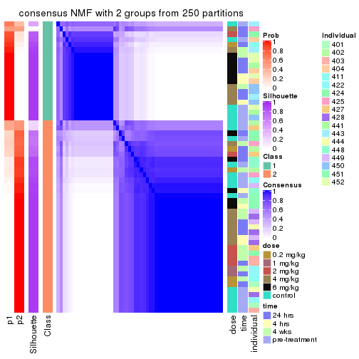</p>

</div>
<div id='tab-MAD-NMF-consensus-heatmap-2'>
<pre><code class="r">consensus_heatmap(res, k = 3)
</code></pre>

<p>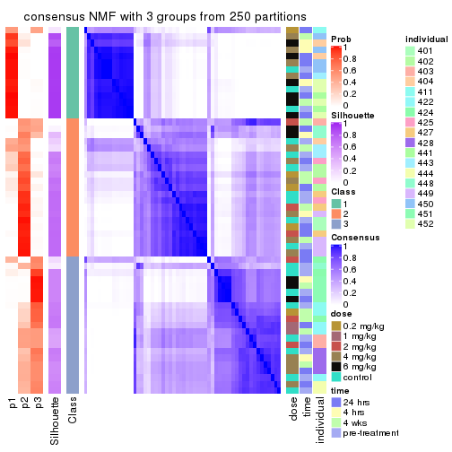</p>

</div>
<div id='tab-MAD-NMF-consensus-heatmap-3'>
<pre><code class="r">consensus_heatmap(res, k = 4)
</code></pre>

<p>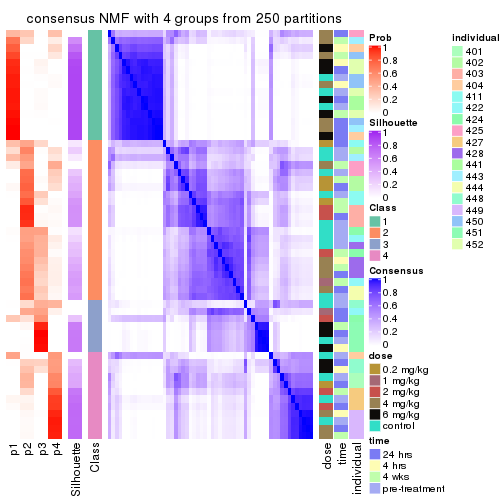</p>

</div>
<div id='tab-MAD-NMF-consensus-heatmap-4'>
<pre><code class="r">consensus_heatmap(res, k = 5)
</code></pre>

<p>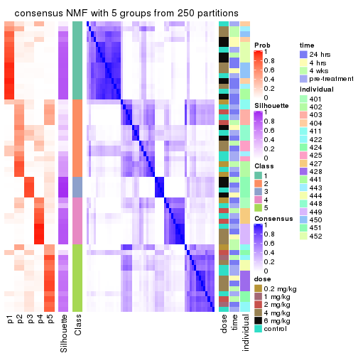</p>

</div>
<div id='tab-MAD-NMF-consensus-heatmap-5'>
<pre><code class="r">consensus_heatmap(res, k = 6)
</code></pre>

<p>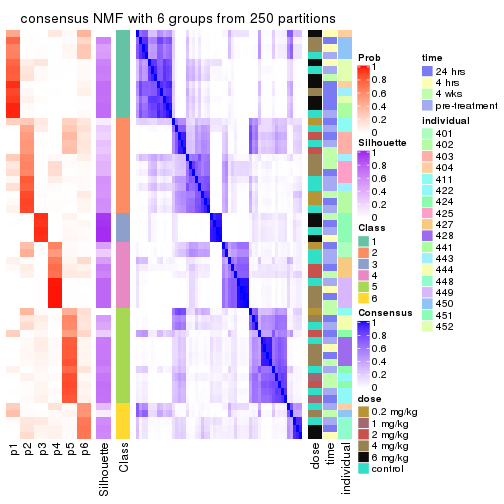</p>

</div>
</div>

Heatmaps for the membership of samples in all partitions to see how consistent they are:


<script>
$( function() {
	$( '#tabs-MAD-NMF-membership-heatmap' ).tabs();
} );
</script>
<div id='tabs-MAD-NMF-membership-heatmap'>
<ul>
<li><a href='#tab-MAD-NMF-membership-heatmap-1'>k = 2</a></li>
<li><a href='#tab-MAD-NMF-membership-heatmap-2'>k = 3</a></li>
<li><a href='#tab-MAD-NMF-membership-heatmap-3'>k = 4</a></li>
<li><a href='#tab-MAD-NMF-membership-heatmap-4'>k = 5</a></li>
<li><a href='#tab-MAD-NMF-membership-heatmap-5'>k = 6</a></li>
</ul>
<div id='tab-MAD-NMF-membership-heatmap-1'>
<pre><code class="r">membership_heatmap(res, k = 2)
</code></pre>

<p>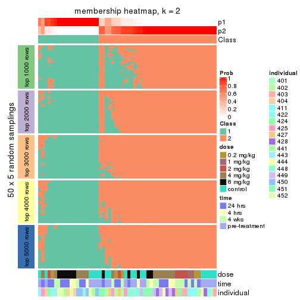</p>

</div>
<div id='tab-MAD-NMF-membership-heatmap-2'>
<pre><code class="r">membership_heatmap(res, k = 3)
</code></pre>

<p>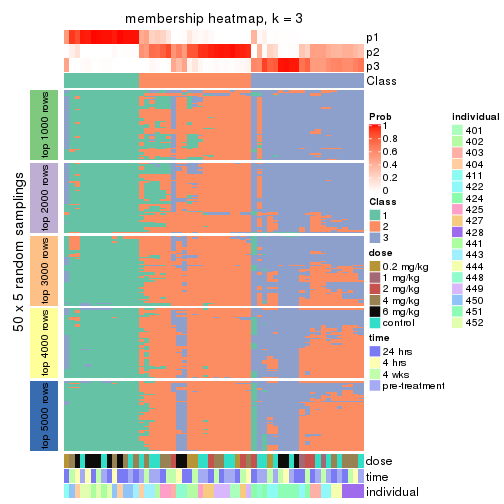</p>

</div>
<div id='tab-MAD-NMF-membership-heatmap-3'>
<pre><code class="r">membership_heatmap(res, k = 4)
</code></pre>

<p>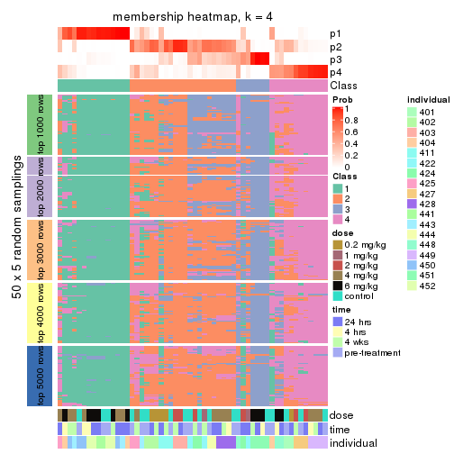</p>

</div>
<div id='tab-MAD-NMF-membership-heatmap-4'>
<pre><code class="r">membership_heatmap(res, k = 5)
</code></pre>

<p>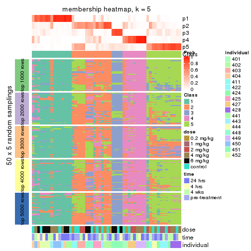</p>

</div>
<div id='tab-MAD-NMF-membership-heatmap-5'>
<pre><code class="r">membership_heatmap(res, k = 6)
</code></pre>

<p>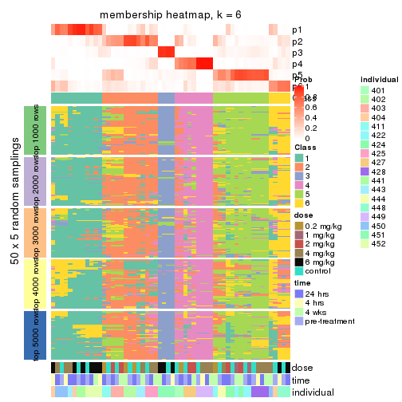</p>

</div>
</div>

As soon as we have had the classes for columns, we can look for signatures
which are significantly different between classes which can be candidate marks
for certain classes. Following are the heatmaps for signatures.


Signature heatmaps where rows are scaled:


<script>
$( function() {
	$( '#tabs-MAD-NMF-get-signatures' ).tabs();
} );
</script>
<div id='tabs-MAD-NMF-get-signatures'>
<ul>
<li><a href='#tab-MAD-NMF-get-signatures-1'>k = 2</a></li>
<li><a href='#tab-MAD-NMF-get-signatures-2'>k = 3</a></li>
<li><a href='#tab-MAD-NMF-get-signatures-3'>k = 4</a></li>
<li><a href='#tab-MAD-NMF-get-signatures-4'>k = 5</a></li>
<li><a href='#tab-MAD-NMF-get-signatures-5'>k = 6</a></li>
</ul>
<div id='tab-MAD-NMF-get-signatures-1'>
<pre><code class="r">get_signatures(res, k = 2)
</code></pre>

<p>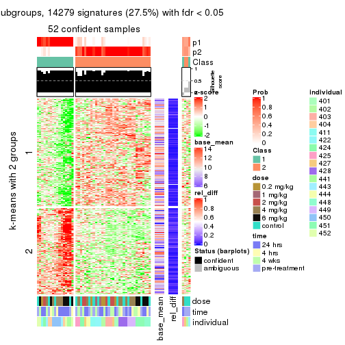</p>

</div>
<div id='tab-MAD-NMF-get-signatures-2'>
<pre><code class="r">get_signatures(res, k = 3)
</code></pre>

<p>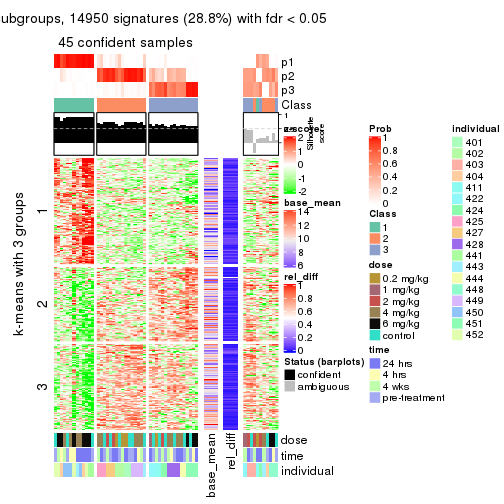</p>

</div>
<div id='tab-MAD-NMF-get-signatures-3'>
<pre><code class="r">get_signatures(res, k = 4)
</code></pre>

<p>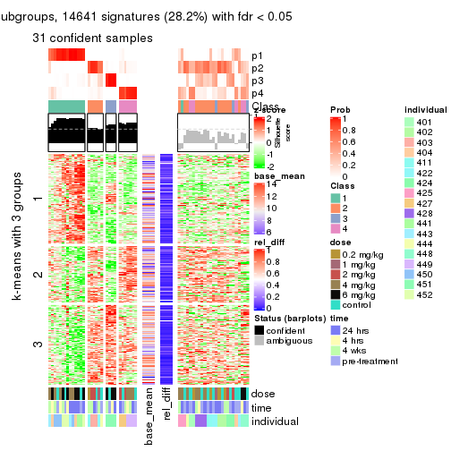</p>

</div>
<div id='tab-MAD-NMF-get-signatures-4'>
<pre><code class="r">get_signatures(res, k = 5)
</code></pre>

<p>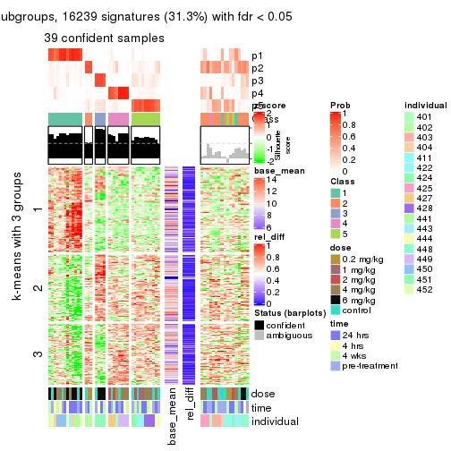</p>

</div>
<div id='tab-MAD-NMF-get-signatures-5'>
<pre><code class="r">get_signatures(res, k = 6)
</code></pre>

<p>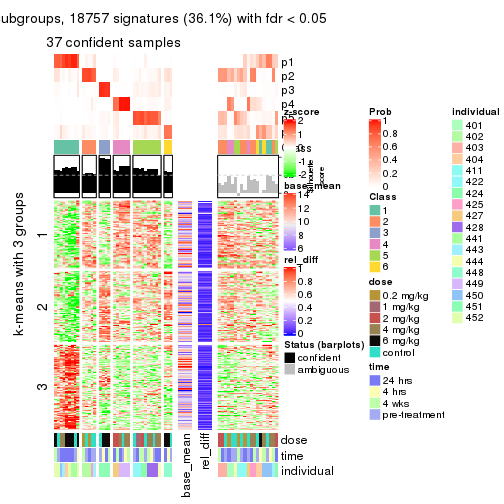</p>

</div>
</div>


Signature heatmaps where rows are not scaled:


<script>
$( function() {
	$( '#tabs-MAD-NMF-get-signatures-no-scale' ).tabs();
} );
</script>
<div id='tabs-MAD-NMF-get-signatures-no-scale'>
<ul>
<li><a href='#tab-MAD-NMF-get-signatures-no-scale-1'>k = 2</a></li>
<li><a href='#tab-MAD-NMF-get-signatures-no-scale-2'>k = 3</a></li>
<li><a href='#tab-MAD-NMF-get-signatures-no-scale-3'>k = 4</a></li>
<li><a href='#tab-MAD-NMF-get-signatures-no-scale-4'>k = 5</a></li>
<li><a href='#tab-MAD-NMF-get-signatures-no-scale-5'>k = 6</a></li>
</ul>
<div id='tab-MAD-NMF-get-signatures-no-scale-1'>
<pre><code class="r">get_signatures(res, k = 2, scale_rows = FALSE)
</code></pre>

<p>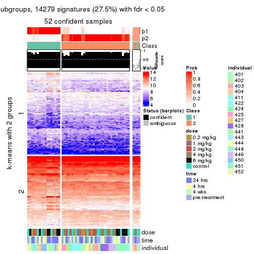</p>

</div>
<div id='tab-MAD-NMF-get-signatures-no-scale-2'>
<pre><code class="r">get_signatures(res, k = 3, scale_rows = FALSE)
</code></pre>

<p>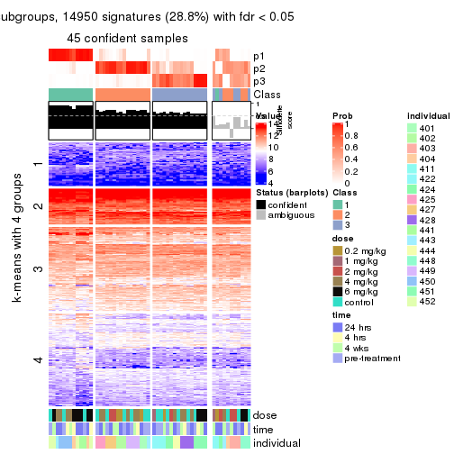</p>

</div>
<div id='tab-MAD-NMF-get-signatures-no-scale-3'>
<pre><code class="r">get_signatures(res, k = 4, scale_rows = FALSE)
</code></pre>

<p>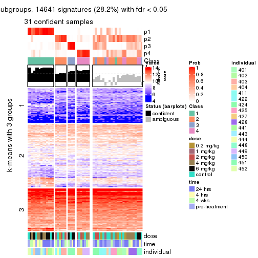</p>

</div>
<div id='tab-MAD-NMF-get-signatures-no-scale-4'>
<pre><code class="r">get_signatures(res, k = 5, scale_rows = FALSE)
</code></pre>

<p>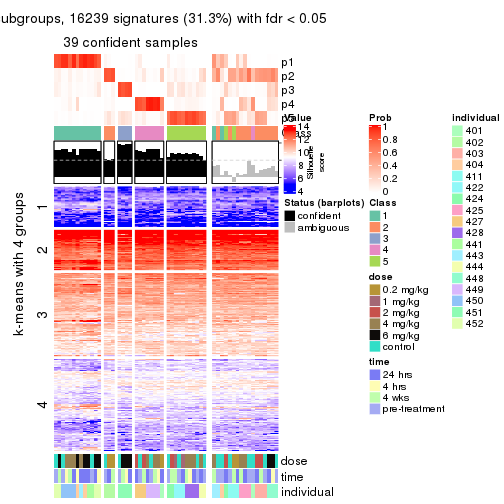</p>

</div>
<div id='tab-MAD-NMF-get-signatures-no-scale-5'>
<pre><code class="r">get_signatures(res, k = 6, scale_rows = FALSE)
</code></pre>

<p>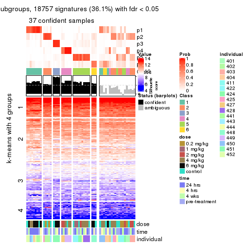</p>

</div>
</div>


Compare the overlap of signatures from different k:

```r
compare_signatures(res)
```

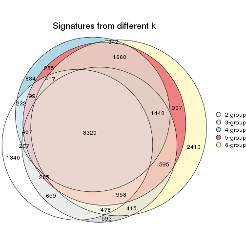

`get_signature()` returns a data frame invisibly. TO get the list of signatures, the function
call should be assigned to a variable explicitly. In following code, if `plot` argument is set
to `FALSE`, no heatmap is plotted while only the differential analysis is performed.

```r
# code only for demonstration
tb = get_signature(res, k = ..., plot = FALSE)
```

An example of the output of `tb` is:

```
#>   which_row         fdr    mean_1    mean_2 scaled_mean_1 scaled_mean_2 km
#> 1        38 0.042760348  8.373488  9.131774    -0.5533452     0.5164555  1
#> 2        40 0.018707592  7.106213  8.469186    -0.6173731     0.5762149  1
#> 3        55 0.019134737 10.221463 11.207825    -0.6159697     0.5749050  1
#> 4        59 0.006059896  5.921854  7.869574    -0.6899429     0.6439467  1
#> 5        60 0.018055526  8.928898 10.211722    -0.6204761     0.5791110  1
#> 6        98 0.009384629 15.714769 14.887706     0.6635654    -0.6193277  2
...
```

The columns in `tb` are:

1. `which_row`: row indices corresponding to the input matrix.
2. `fdr`: FDR for the differential test. 
3. `mean_x`: The mean value in group x.
4. `scaled_mean_x`: The mean value in group x after rows are scaled.
5. `km`: Row groups if k-means clustering is applied to rows.


UMAP plot which shows how samples are separated.


<script>
$( function() {
	$( '#tabs-MAD-NMF-dimension-reduction' ).tabs();
} );
</script>
<div id='tabs-MAD-NMF-dimension-reduction'>
<ul>
<li><a href='#tab-MAD-NMF-dimension-reduction-1'>k = 2</a></li>
<li><a href='#tab-MAD-NMF-dimension-reduction-2'>k = 3</a></li>
<li><a href='#tab-MAD-NMF-dimension-reduction-3'>k = 4</a></li>
<li><a href='#tab-MAD-NMF-dimension-reduction-4'>k = 5</a></li>
<li><a href='#tab-MAD-NMF-dimension-reduction-5'>k = 6</a></li>
</ul>
<div id='tab-MAD-NMF-dimension-reduction-1'>
<pre><code class="r">dimension_reduction(res, k = 2, method = &quot;UMAP&quot;)
</code></pre>

<p>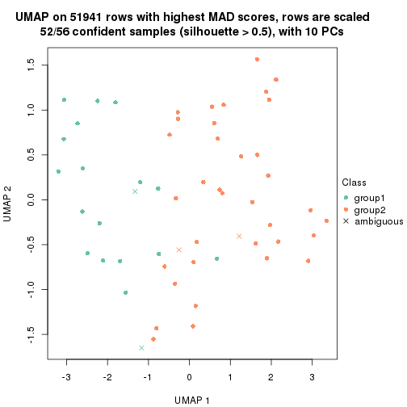</p>

</div>
<div id='tab-MAD-NMF-dimension-reduction-2'>
<pre><code class="r">dimension_reduction(res, k = 3, method = &quot;UMAP&quot;)
</code></pre>

<p>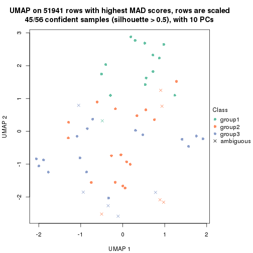</p>

</div>
<div id='tab-MAD-NMF-dimension-reduction-3'>
<pre><code class="r">dimension_reduction(res, k = 4, method = &quot;UMAP&quot;)
</code></pre>

<p>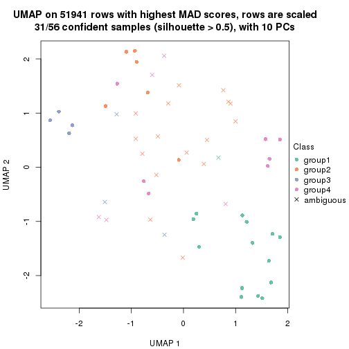</p>

</div>
<div id='tab-MAD-NMF-dimension-reduction-4'>
<pre><code class="r">dimension_reduction(res, k = 5, method = &quot;UMAP&quot;)
</code></pre>

<p>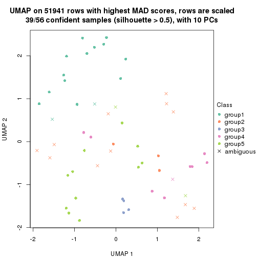</p>

</div>
<div id='tab-MAD-NMF-dimension-reduction-5'>
<pre><code class="r">dimension_reduction(res, k = 6, method = &quot;UMAP&quot;)
</code></pre>

<p>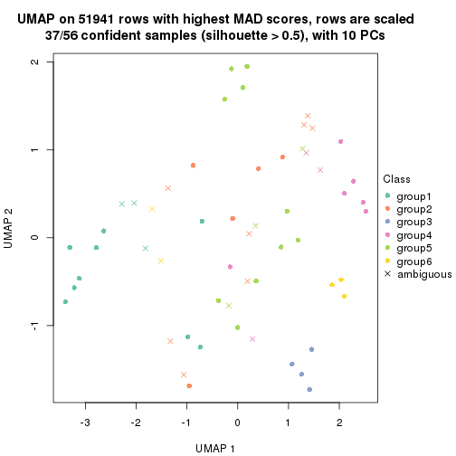</p>

</div>
</div>


Following heatmap shows how subgroups are split when increasing `k`:

```r
collect_classes(res)
```

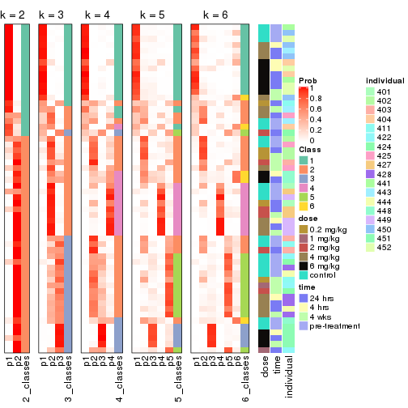


Test correlation between subgroups and known annotations. If the known
annotation is numeric, one-way ANOVA test is applied, and if the known
annotation is discrete, chi-squared contingency table test is applied.

```r
test_to_known_factors(res)
```

```
#>          n dose(p) time(p) individual(p) k
#> MAD:NMF 52 0.43205   0.642      1.76e-04 2
#> MAD:NMF 45 0.13585   0.819      1.95e-07 3
#> MAD:NMF 31 0.04135   0.944      1.27e-07 4
#> MAD:NMF 39 0.00327   0.996      2.52e-12 5
#> MAD:NMF 37 0.00666   0.937      1.56e-11 6
```


If matrix rows can be associated to genes, consider to use `functional_enrichment(res,
...)` to perform function enrichment for the signature genes. See [this vignette](http://bioconductor.org/packages/devel/bioc/vignettes/cola/inst/doc/functional_enrichment.html) for more detailed explanations.


 

---------------------------------------------------


### ATC:hclust**


The object with results only for a single top-value method and a single partition method 
can be extracted as:

```r
res = res_list["ATC", "hclust"]
# you can also extract it by
# res = res_list["ATC:hclust"]
```

A summary of `res` and all the functions that can be applied to it:

```r
res
```

```
#> A 'ConsensusPartition' object with k = 2, 3, 4, 5, 6.
#>   On a matrix with 51941 rows and 56 columns.
#>   Top rows (1000, 2000, 3000, 4000, 5000) are extracted by 'ATC' method.
#>   Subgroups are detected by 'hclust' method.
#>   Performed in total 1250 partitions by row resampling.
#>   Best k for subgroups seems to be 2.
#> 
#> Following methods can be applied to this 'ConsensusPartition' object:
#>  [1] "cola_report"             "collect_classes"         "collect_plots"          
#>  [4] "collect_stats"           "colnames"                "compare_signatures"     
#>  [7] "consensus_heatmap"       "dimension_reduction"     "functional_enrichment"  
#> [10] "get_anno_col"            "get_anno"                "get_classes"            
#> [13] "get_consensus"           "get_matrix"              "get_membership"         
#> [16] "get_param"               "get_signatures"          "get_stats"              
#> [19] "is_best_k"               "is_stable_k"             "membership_heatmap"     
#> [22] "ncol"                    "nrow"                    "plot_ecdf"              
#> [25] "rownames"                "select_partition_number" "show"                   
#> [28] "suggest_best_k"          "test_to_known_factors"
```

`collect_plots()` function collects all the plots made from `res` for all `k` (number of partitions)
into one single page to provide an easy and fast comparison between different `k`.

```r
collect_plots(res)
```

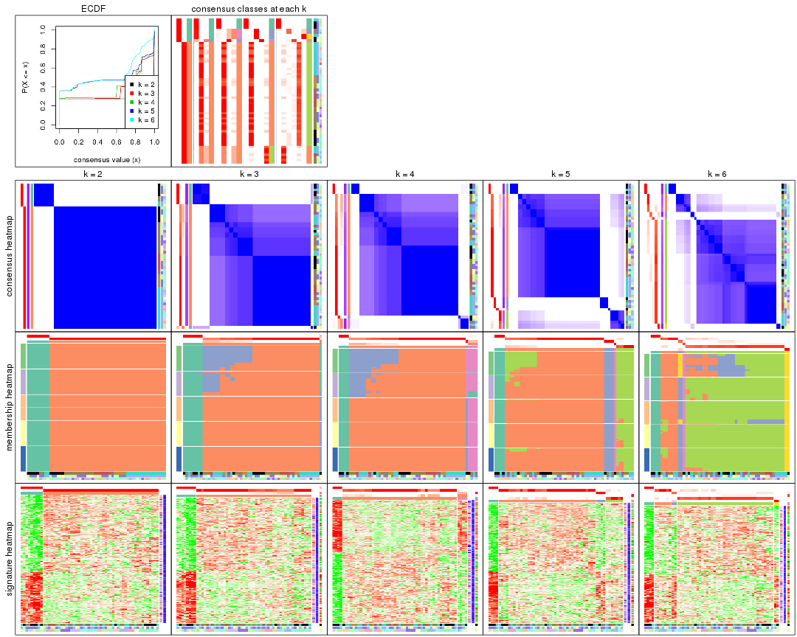

The plots are:

- The first row: a plot of the ECDF (empirical cumulative distribution
  function) curves of the consensus matrix for each `k` and the heatmap of
  predicted classes for each `k`.
- The second row: heatmaps of the consensus matrix for each `k`.
- The third row: heatmaps of the membership matrix for each `k`.
- The fouth row: heatmaps of the signatures for each `k`.

All the plots in panels can be made by individual functions and they are
plotted later in this section.

`select_partition_number()` produces several plots showing different
statistics for choosing "optimized" `k`. There are following statistics:

- ECDF curves of the consensus matrix for each `k`;
- 1-PAC. [The PAC
  score](https://en.wikipedia.org/wiki/Consensus_clustering#Over-interpretation_potential_of_consensus_clustering)
  measures the proportion of the ambiguous subgrouping.
- Mean silhouette score.
- Concordance. The mean probability of fiting the consensus class ids in all
  partitions.
- Area increased. Denote $A_k$ as the area under the ECDF curve for current
  `k`, the area increased is defined as $A_k - A_{k-1}$.
- Rand index. The percent of pairs of samples that are both in a same cluster
  or both are not in a same cluster in the partition of k and k-1.
- Jaccard index. The ratio of pairs of samples are both in a same cluster in
  the partition of k and k-1 and the pairs of samples are both in a same
  cluster in the partition k or k-1.

The detailed explanations of these statistics can be found in [the _cola_
vignette](http://bioconductor.org/packages/devel/bioc/vignettes/cola/inst/doc/cola.html#toc_13).

Generally speaking, lower PAC score, higher mean silhouette score or higher
concordance corresponds to better partition. Rand index and Jaccard index
measure how similar the current partition is compared to partition with `k-1`.
If they are too similar, we won't accept `k` is better than `k-1`.

```r
select_partition_number(res)
```

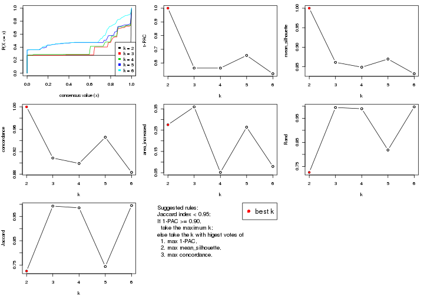

The numeric values for all these statistics can be obtained by `get_stats()`.

```r
get_stats(res)
```

```
#>   k 1-PAC mean_silhouette concordance area_increased  Rand Jaccard
#> 2 2 1.000           1.000       1.000         0.2754 0.725   0.725
#> 3 3 0.563           0.861       0.909         0.3594 0.995   0.993
#> 4 4 0.563           0.849       0.899         0.0516 0.990   0.986
#> 5 5 0.655           0.870       0.946         0.2640 0.818   0.744
#> 6 6 0.522           0.832       0.883         0.0796 0.997   0.995
```

`suggest_best_k()` suggests the best $k$ based on these statistics. The rules are as follows:

- All $k$ with Jaccard index larger than 0.95 are removed because increasing
  $k$ does not provide enough extra information. If all $k$ are removed, it is
  marked as no subgroup is detected.
- For all $k$ with 1-PAC score larger than 0.9, the maximal $k$ is taken as
  the best $k$, and other $k$ are marked as optional $k$.
- If it does not fit the second rule. The $k$ with the maximal vote of the
  highest 1-PAC score, highest mean silhouette, and highest concordance is
  taken as the best $k$.

```r
suggest_best_k(res)
```

```
#> [1] 2
```


Following shows the table of the partitions (You need to click the **show/hide
code output** link to see it). The membership matrix (columns with name `p*`)
is inferred by
[`clue::cl_consensus()`](https://www.rdocumentation.org/link/cl_consensus?package=clue)
function with the `SE` method. Basically the value in the membership matrix
represents the probability to belong to a certain group. The finall class
label for an item is determined with the group with highest probability it
belongs to.

In `get_classes()` function, the entropy is calculated from the membership
matrix and the silhouette score is calculated from the consensus matrix.


<script>
$( function() {
	$( '#tabs-ATC-hclust-get-classes' ).tabs();
} );
</script>
<div id='tabs-ATC-hclust-get-classes'>
<ul>
<li><a href='#tab-ATC-hclust-get-classes-1'>k = 2</a></li>
<li><a href='#tab-ATC-hclust-get-classes-2'>k = 3</a></li>
<li><a href='#tab-ATC-hclust-get-classes-3'>k = 4</a></li>
<li><a href='#tab-ATC-hclust-get-classes-4'>k = 5</a></li>
<li><a href='#tab-ATC-hclust-get-classes-5'>k = 6</a></li>
</ul>

<div id='tab-ATC-hclust-get-classes-1'>
<p><a id='tab-ATC-hclust-get-classes-1-a' style='color:#0366d6' href='#'>show/hide code output</a></p>
<pre><code class="r">cbind(get_classes(res, k = 2), get_membership(res, k = 2))
</code></pre>

<pre><code>#&gt;           class entropy silhouette p1 p2
#&gt; GSM687644     2       0          1  0  1
#&gt; GSM687648     2       0          1  0  1
#&gt; GSM687653     2       0          1  0  1
#&gt; GSM687658     2       0          1  0  1
#&gt; GSM687663     2       0          1  0  1
#&gt; GSM687668     2       0          1  0  1
#&gt; GSM687673     2       0          1  0  1
#&gt; GSM687678     2       0          1  0  1
#&gt; GSM687683     2       0          1  0  1
#&gt; GSM687688     2       0          1  0  1
#&gt; GSM687695     1       0          1  1  0
#&gt; GSM687699     2       0          1  0  1
#&gt; GSM687704     2       0          1  0  1
#&gt; GSM687707     2       0          1  0  1
#&gt; GSM687712     2       0          1  0  1
#&gt; GSM687719     2       0          1  0  1
#&gt; GSM687724     2       0          1  0  1
#&gt; GSM687728     1       0          1  1  0
#&gt; GSM687646     2       0          1  0  1
#&gt; GSM687649     2       0          1  0  1
#&gt; GSM687665     2       0          1  0  1
#&gt; GSM687651     2       0          1  0  1
#&gt; GSM687667     2       0          1  0  1
#&gt; GSM687670     2       0          1  0  1
#&gt; GSM687671     2       0          1  0  1
#&gt; GSM687654     2       0          1  0  1
#&gt; GSM687675     2       0          1  0  1
#&gt; GSM687685     2       0          1  0  1
#&gt; GSM687656     2       0          1  0  1
#&gt; GSM687677     2       0          1  0  1
#&gt; GSM687687     2       0          1  0  1
#&gt; GSM687692     2       0          1  0  1
#&gt; GSM687716     2       0          1  0  1
#&gt; GSM687722     2       0          1  0  1
#&gt; GSM687680     2       0          1  0  1
#&gt; GSM687690     2       0          1  0  1
#&gt; GSM687700     1       0          1  1  0
#&gt; GSM687705     2       0          1  0  1
#&gt; GSM687714     2       0          1  0  1
#&gt; GSM687721     1       0          1  1  0
#&gt; GSM687682     2       0          1  0  1
#&gt; GSM687694     2       0          1  0  1
#&gt; GSM687702     2       0          1  0  1
#&gt; GSM687718     2       0          1  0  1
#&gt; GSM687723     2       0          1  0  1
#&gt; GSM687661     2       0          1  0  1
#&gt; GSM687710     2       0          1  0  1
#&gt; GSM687726     2       0          1  0  1
#&gt; GSM687730     1       0          1  1  0
#&gt; GSM687660     1       0          1  1  0
#&gt; GSM687697     1       0          1  1  0
#&gt; GSM687709     2       0          1  0  1
#&gt; GSM687725     2       0          1  0  1
#&gt; GSM687729     1       0          1  1  0
#&gt; GSM687727     2       0          1  0  1
#&gt; GSM687731     1       0          1  1  0
</code></pre>

<script>
$('#tab-ATC-hclust-get-classes-1-a').parent().next().next().hide();
$('#tab-ATC-hclust-get-classes-1-a').click(function(){
  $('#tab-ATC-hclust-get-classes-1-a').parent().next().next().toggle();
  return(false);
});
</script>
</div>

<div id='tab-ATC-hclust-get-classes-2'>
<p><a id='tab-ATC-hclust-get-classes-2-a' style='color:#0366d6' href='#'>show/hide code output</a></p>
<pre><code class="r">cbind(get_classes(res, k = 3), get_membership(res, k = 3))
</code></pre>

<pre><code>#&gt;           class entropy silhouette    p1    p2    p3
#&gt; GSM687644     2  0.0000      0.902 0.000 1.000 0.000
#&gt; GSM687648     2  0.3551      0.869 0.000 0.868 0.132
#&gt; GSM687653     2  0.0000      0.902 0.000 1.000 0.000
#&gt; GSM687658     2  0.4504      0.839 0.000 0.804 0.196
#&gt; GSM687663     2  0.4346      0.845 0.000 0.816 0.184
#&gt; GSM687668     2  0.0000      0.902 0.000 1.000 0.000
#&gt; GSM687673     2  0.5948      0.700 0.000 0.640 0.360
#&gt; GSM687678     2  0.3551      0.869 0.000 0.868 0.132
#&gt; GSM687683     2  0.4931      0.814 0.000 0.768 0.232
#&gt; GSM687688     2  0.0000      0.902 0.000 1.000 0.000
#&gt; GSM687695     1  0.0237      0.986 0.996 0.000 0.004
#&gt; GSM687699     2  0.5948      0.700 0.000 0.640 0.360
#&gt; GSM687704     2  0.0000      0.902 0.000 1.000 0.000
#&gt; GSM687707     2  0.0000      0.902 0.000 1.000 0.000
#&gt; GSM687712     2  0.0000      0.902 0.000 1.000 0.000
#&gt; GSM687719     2  0.5948      0.700 0.000 0.640 0.360
#&gt; GSM687724     2  0.0000      0.902 0.000 1.000 0.000
#&gt; GSM687728     1  0.0592      0.986 0.988 0.000 0.012
#&gt; GSM687646     2  0.0000      0.902 0.000 1.000 0.000
#&gt; GSM687649     2  0.3551      0.869 0.000 0.868 0.132
#&gt; GSM687665     2  0.4346      0.845 0.000 0.816 0.184
#&gt; GSM687651     2  0.3551      0.869 0.000 0.868 0.132
#&gt; GSM687667     2  0.0000      0.902 0.000 1.000 0.000
#&gt; GSM687670     2  0.0000      0.902 0.000 1.000 0.000
#&gt; GSM687671     2  0.0000      0.902 0.000 1.000 0.000
#&gt; GSM687654     2  0.0000      0.902 0.000 1.000 0.000
#&gt; GSM687675     2  0.5948      0.700 0.000 0.640 0.360
#&gt; GSM687685     2  0.4931      0.814 0.000 0.768 0.232
#&gt; GSM687656     2  0.0000      0.902 0.000 1.000 0.000
#&gt; GSM687677     2  0.0000      0.902 0.000 1.000 0.000
#&gt; GSM687687     2  0.0000      0.902 0.000 1.000 0.000
#&gt; GSM687692     2  0.0000      0.902 0.000 1.000 0.000
#&gt; GSM687716     2  0.0000      0.902 0.000 1.000 0.000
#&gt; GSM687722     2  0.5948      0.700 0.000 0.640 0.360
#&gt; GSM687680     2  0.3551      0.869 0.000 0.868 0.132
#&gt; GSM687690     2  0.0000      0.902 0.000 1.000 0.000
#&gt; GSM687700     1  0.0592      0.986 0.988 0.000 0.012
#&gt; GSM687705     2  0.3551      0.869 0.000 0.868 0.132
#&gt; GSM687714     2  0.0000      0.902 0.000 1.000 0.000
#&gt; GSM687721     1  0.0592      0.986 0.988 0.000 0.012
#&gt; GSM687682     2  0.3551      0.869 0.000 0.868 0.132
#&gt; GSM687694     2  0.0000      0.902 0.000 1.000 0.000
#&gt; GSM687702     2  0.5948      0.700 0.000 0.640 0.360
#&gt; GSM687718     2  0.0000      0.902 0.000 1.000 0.000
#&gt; GSM687723     2  0.5948      0.700 0.000 0.640 0.360
#&gt; GSM687661     2  0.4504      0.839 0.000 0.804 0.196
#&gt; GSM687710     2  0.0000      0.902 0.000 1.000 0.000
#&gt; GSM687726     2  0.0000      0.902 0.000 1.000 0.000
#&gt; GSM687730     3  0.5948      0.000 0.360 0.000 0.640
#&gt; GSM687660     1  0.0237      0.986 0.996 0.000 0.004
#&gt; GSM687697     1  0.0237      0.986 0.996 0.000 0.004
#&gt; GSM687709     2  0.0000      0.902 0.000 1.000 0.000
#&gt; GSM687725     2  0.0000      0.902 0.000 1.000 0.000
#&gt; GSM687729     1  0.0237      0.986 0.996 0.000 0.004
#&gt; GSM687727     2  0.0000      0.902 0.000 1.000 0.000
#&gt; GSM687731     1  0.0592      0.986 0.988 0.000 0.012
</code></pre>

<script>
$('#tab-ATC-hclust-get-classes-2-a').parent().next().next().hide();
$('#tab-ATC-hclust-get-classes-2-a').click(function(){
  $('#tab-ATC-hclust-get-classes-2-a').parent().next().next().toggle();
  return(false);
});
</script>
</div>

<div id='tab-ATC-hclust-get-classes-3'>
<p><a id='tab-ATC-hclust-get-classes-3-a' style='color:#0366d6' href='#'>show/hide code output</a></p>
<pre><code class="r">cbind(get_classes(res, k = 4), get_membership(res, k = 4))
</code></pre>

<pre><code>#&gt;           class entropy silhouette    p1    p2    p3    p4
#&gt; GSM687644     2   0.000      0.894 0.000 1.000 0.000 0.000
#&gt; GSM687648     2   0.281      0.858 0.000 0.868 0.000 0.132
#&gt; GSM687653     2   0.000      0.894 0.000 1.000 0.000 0.000
#&gt; GSM687658     2   0.361      0.826 0.000 0.800 0.000 0.200
#&gt; GSM687663     2   0.353      0.830 0.000 0.808 0.000 0.192
#&gt; GSM687668     2   0.000      0.894 0.000 1.000 0.000 0.000
#&gt; GSM687673     2   0.485      0.644 0.000 0.600 0.000 0.400
#&gt; GSM687678     2   0.281      0.858 0.000 0.868 0.000 0.132
#&gt; GSM687683     2   0.410      0.785 0.000 0.744 0.000 0.256
#&gt; GSM687688     2   0.000      0.894 0.000 1.000 0.000 0.000
#&gt; GSM687695     1   0.000      1.000 1.000 0.000 0.000 0.000
#&gt; GSM687699     2   0.485      0.644 0.000 0.600 0.000 0.400
#&gt; GSM687704     2   0.000      0.894 0.000 1.000 0.000 0.000
#&gt; GSM687707     2   0.000      0.894 0.000 1.000 0.000 0.000
#&gt; GSM687712     2   0.000      0.894 0.000 1.000 0.000 0.000
#&gt; GSM687719     2   0.485      0.644 0.000 0.600 0.000 0.400
#&gt; GSM687724     2   0.000      0.894 0.000 1.000 0.000 0.000
#&gt; GSM687728     4   0.602      1.000 0.056 0.000 0.344 0.600
#&gt; GSM687646     2   0.000      0.894 0.000 1.000 0.000 0.000
#&gt; GSM687649     2   0.281      0.858 0.000 0.868 0.000 0.132
#&gt; GSM687665     2   0.353      0.830 0.000 0.808 0.000 0.192
#&gt; GSM687651     2   0.281      0.858 0.000 0.868 0.000 0.132
#&gt; GSM687667     2   0.000      0.894 0.000 1.000 0.000 0.000
#&gt; GSM687670     2   0.000      0.894 0.000 1.000 0.000 0.000
#&gt; GSM687671     2   0.000      0.894 0.000 1.000 0.000 0.000
#&gt; GSM687654     2   0.000      0.894 0.000 1.000 0.000 0.000
#&gt; GSM687675     2   0.485      0.644 0.000 0.600 0.000 0.400
#&gt; GSM687685     2   0.410      0.785 0.000 0.744 0.000 0.256
#&gt; GSM687656     2   0.000      0.894 0.000 1.000 0.000 0.000
#&gt; GSM687677     2   0.000      0.894 0.000 1.000 0.000 0.000
#&gt; GSM687687     2   0.000      0.894 0.000 1.000 0.000 0.000
#&gt; GSM687692     2   0.000      0.894 0.000 1.000 0.000 0.000
#&gt; GSM687716     2   0.000      0.894 0.000 1.000 0.000 0.000
#&gt; GSM687722     2   0.485      0.644 0.000 0.600 0.000 0.400
#&gt; GSM687680     2   0.281      0.858 0.000 0.868 0.000 0.132
#&gt; GSM687690     2   0.000      0.894 0.000 1.000 0.000 0.000
#&gt; GSM687700     4   0.602      1.000 0.056 0.000 0.344 0.600
#&gt; GSM687705     2   0.281      0.858 0.000 0.868 0.000 0.132
#&gt; GSM687714     2   0.000      0.894 0.000 1.000 0.000 0.000
#&gt; GSM687721     4   0.602      1.000 0.056 0.000 0.344 0.600
#&gt; GSM687682     2   0.281      0.858 0.000 0.868 0.000 0.132
#&gt; GSM687694     2   0.000      0.894 0.000 1.000 0.000 0.000
#&gt; GSM687702     2   0.485      0.644 0.000 0.600 0.000 0.400
#&gt; GSM687718     2   0.000      0.894 0.000 1.000 0.000 0.000
#&gt; GSM687723     2   0.485      0.644 0.000 0.600 0.000 0.400
#&gt; GSM687661     2   0.361      0.826 0.000 0.800 0.000 0.200
#&gt; GSM687710     2   0.000      0.894 0.000 1.000 0.000 0.000
#&gt; GSM687726     2   0.000      0.894 0.000 1.000 0.000 0.000
#&gt; GSM687730     3   0.000      0.000 0.000 0.000 1.000 0.000
#&gt; GSM687660     1   0.000      1.000 1.000 0.000 0.000 0.000
#&gt; GSM687697     1   0.000      1.000 1.000 0.000 0.000 0.000
#&gt; GSM687709     2   0.000      0.894 0.000 1.000 0.000 0.000
#&gt; GSM687725     2   0.000      0.894 0.000 1.000 0.000 0.000
#&gt; GSM687729     1   0.000      1.000 1.000 0.000 0.000 0.000
#&gt; GSM687727     2   0.000      0.894 0.000 1.000 0.000 0.000
#&gt; GSM687731     4   0.602      1.000 0.056 0.000 0.344 0.600
</code></pre>

<script>
$('#tab-ATC-hclust-get-classes-3-a').parent().next().next().hide();
$('#tab-ATC-hclust-get-classes-3-a').click(function(){
  $('#tab-ATC-hclust-get-classes-3-a').parent().next().next().toggle();
  return(false);
});
</script>
</div>

<div id='tab-ATC-hclust-get-classes-4'>
<p><a id='tab-ATC-hclust-get-classes-4-a' style='color:#0366d6' href='#'>show/hide code output</a></p>
<pre><code class="r">cbind(get_classes(res, k = 5), get_membership(res, k = 5))
</code></pre>

<pre><code>#&gt;           class entropy silhouette p1    p2 p3 p4    p5
#&gt; GSM687644     2  0.0000      0.927  0 1.000  0  0 0.000
#&gt; GSM687648     2  0.2813      0.827  0 0.832  0  0 0.168
#&gt; GSM687653     2  0.0000      0.927  0 1.000  0  0 0.000
#&gt; GSM687658     2  0.3424      0.749  0 0.760  0  0 0.240
#&gt; GSM687663     2  0.3336      0.764  0 0.772  0  0 0.228
#&gt; GSM687668     2  0.0000      0.927  0 1.000  0  0 0.000
#&gt; GSM687673     5  0.2966      0.706  0 0.184  0  0 0.816
#&gt; GSM687678     2  0.2471      0.851  0 0.864  0  0 0.136
#&gt; GSM687683     2  0.3612      0.704  0 0.732  0  0 0.268
#&gt; GSM687688     2  0.0000      0.927  0 1.000  0  0 0.000
#&gt; GSM687695     1  0.0000      1.000  1 0.000  0  0 0.000
#&gt; GSM687699     5  0.0000      0.797  0 0.000  0  0 1.000
#&gt; GSM687704     2  0.0000      0.927  0 1.000  0  0 0.000
#&gt; GSM687707     2  0.0000      0.927  0 1.000  0  0 0.000
#&gt; GSM687712     2  0.0000      0.927  0 1.000  0  0 0.000
#&gt; GSM687719     5  0.0000      0.797  0 0.000  0  0 1.000
#&gt; GSM687724     2  0.0000      0.927  0 1.000  0  0 0.000
#&gt; GSM687728     3  0.0000      1.000  0 0.000  1  0 0.000
#&gt; GSM687646     2  0.0000      0.927  0 1.000  0  0 0.000
#&gt; GSM687649     2  0.2813      0.827  0 0.832  0  0 0.168
#&gt; GSM687665     2  0.3336      0.764  0 0.772  0  0 0.228
#&gt; GSM687651     2  0.2813      0.827  0 0.832  0  0 0.168
#&gt; GSM687667     2  0.0000      0.927  0 1.000  0  0 0.000
#&gt; GSM687670     2  0.0000      0.927  0 1.000  0  0 0.000
#&gt; GSM687671     2  0.0000      0.927  0 1.000  0  0 0.000
#&gt; GSM687654     2  0.0000      0.927  0 1.000  0  0 0.000
#&gt; GSM687675     5  0.2966      0.706  0 0.184  0  0 0.816
#&gt; GSM687685     2  0.3612      0.704  0 0.732  0  0 0.268
#&gt; GSM687656     2  0.0000      0.927  0 1.000  0  0 0.000
#&gt; GSM687677     2  0.0404      0.922  0 0.988  0  0 0.012
#&gt; GSM687687     2  0.0000      0.927  0 1.000  0  0 0.000
#&gt; GSM687692     2  0.0000      0.927  0 1.000  0  0 0.000
#&gt; GSM687716     2  0.0000      0.927  0 1.000  0  0 0.000
#&gt; GSM687722     5  0.0000      0.797  0 0.000  0  0 1.000
#&gt; GSM687680     2  0.2471      0.851  0 0.864  0  0 0.136
#&gt; GSM687690     2  0.0000      0.927  0 1.000  0  0 0.000
#&gt; GSM687700     3  0.0000      1.000  0 0.000  1  0 0.000
#&gt; GSM687705     2  0.2471      0.851  0 0.864  0  0 0.136
#&gt; GSM687714     2  0.0000      0.927  0 1.000  0  0 0.000
#&gt; GSM687721     3  0.0000      1.000  0 0.000  1  0 0.000
#&gt; GSM687682     2  0.2471      0.851  0 0.864  0  0 0.136
#&gt; GSM687694     2  0.0000      0.927  0 1.000  0  0 0.000
#&gt; GSM687702     5  0.2377      0.756  0 0.128  0  0 0.872
#&gt; GSM687718     2  0.0000      0.927  0 1.000  0  0 0.000
#&gt; GSM687723     5  0.0000      0.797  0 0.000  0  0 1.000
#&gt; GSM687661     2  0.3424      0.749  0 0.760  0  0 0.240
#&gt; GSM687710     2  0.0000      0.927  0 1.000  0  0 0.000
#&gt; GSM687726     2  0.0000      0.927  0 1.000  0  0 0.000
#&gt; GSM687730     4  0.0000      0.000  0 0.000  0  1 0.000
#&gt; GSM687660     1  0.0000      1.000  1 0.000  0  0 0.000
#&gt; GSM687697     1  0.0000      1.000  1 0.000  0  0 0.000
#&gt; GSM687709     2  0.0000      0.927  0 1.000  0  0 0.000
#&gt; GSM687725     2  0.0000      0.927  0 1.000  0  0 0.000
#&gt; GSM687729     1  0.0000      1.000  1 0.000  0  0 0.000
#&gt; GSM687727     2  0.0000      0.927  0 1.000  0  0 0.000
#&gt; GSM687731     3  0.0000      1.000  0 0.000  1  0 0.000
</code></pre>

<script>
$('#tab-ATC-hclust-get-classes-4-a').parent().next().next().hide();
$('#tab-ATC-hclust-get-classes-4-a').click(function(){
  $('#tab-ATC-hclust-get-classes-4-a').parent().next().next().toggle();
  return(false);
});
</script>
</div>

<div id='tab-ATC-hclust-get-classes-5'>
<p><a id='tab-ATC-hclust-get-classes-5-a' style='color:#0366d6' href='#'>show/hide code output</a></p>
<pre><code class="r">cbind(get_classes(res, k = 6), get_membership(res, k = 6))
</code></pre>

<pre><code>#&gt;           class entropy silhouette p1    p2    p3    p4    p5   p6
#&gt; GSM687644     5   0.166      0.852  0 0.000 0.000 0.088 0.912 0.00
#&gt; GSM687648     5   0.305      0.804  0 0.168 0.020 0.000 0.812 0.00
#&gt; GSM687653     5   0.166      0.852  0 0.000 0.000 0.088 0.912 0.00
#&gt; GSM687658     5   0.342      0.749  0 0.240 0.012 0.000 0.748 0.00
#&gt; GSM687663     5   0.334      0.769  0 0.228 0.012 0.000 0.760 0.00
#&gt; GSM687668     5   0.120      0.857  0 0.000 0.056 0.000 0.944 0.00
#&gt; GSM687673     2   0.266      0.722  0 0.816 0.000 0.000 0.184 0.00
#&gt; GSM687678     5   0.275      0.824  0 0.136 0.020 0.000 0.844 0.00
#&gt; GSM687683     5   0.324      0.736  0 0.268 0.000 0.000 0.732 0.00
#&gt; GSM687688     5   0.166      0.852  0 0.000 0.000 0.088 0.912 0.00
#&gt; GSM687695     1   0.000      1.000  1 0.000 0.000 0.000 0.000 0.00
#&gt; GSM687699     2   0.000      0.808  0 1.000 0.000 0.000 0.000 0.00
#&gt; GSM687704     5   0.170      0.854  0 0.000 0.004 0.080 0.916 0.00
#&gt; GSM687707     5   0.218      0.841  0 0.000 0.132 0.000 0.868 0.00
#&gt; GSM687712     5   0.166      0.852  0 0.000 0.000 0.088 0.912 0.00
#&gt; GSM687719     2   0.000      0.808  0 1.000 0.000 0.000 0.000 0.00
#&gt; GSM687724     5   0.238      0.835  0 0.000 0.152 0.000 0.848 0.00
#&gt; GSM687728     6   0.000      1.000  0 0.000 0.000 0.000 0.000 1.00
#&gt; GSM687646     5   0.166      0.852  0 0.000 0.000 0.088 0.912 0.00
#&gt; GSM687649     5   0.305      0.804  0 0.168 0.020 0.000 0.812 0.00
#&gt; GSM687665     5   0.334      0.769  0 0.228 0.012 0.000 0.760 0.00
#&gt; GSM687651     5   0.305      0.804  0 0.168 0.020 0.000 0.812 0.00
#&gt; GSM687667     5   0.206      0.856  0 0.000 0.056 0.036 0.908 0.00
#&gt; GSM687670     5   0.120      0.857  0 0.000 0.056 0.000 0.944 0.00
#&gt; GSM687671     5   0.120      0.857  0 0.000 0.056 0.000 0.944 0.00
#&gt; GSM687654     5   0.166      0.852  0 0.000 0.000 0.088 0.912 0.00
#&gt; GSM687675     2   0.266      0.722  0 0.816 0.000 0.000 0.184 0.00
#&gt; GSM687685     5   0.324      0.736  0 0.268 0.000 0.000 0.732 0.00
#&gt; GSM687656     5   0.166      0.852  0 0.000 0.000 0.088 0.912 0.00
#&gt; GSM687677     5   0.144      0.860  0 0.012 0.004 0.040 0.944 0.00
#&gt; GSM687687     5   0.166      0.852  0 0.000 0.000 0.088 0.912 0.00
#&gt; GSM687692     5   0.166      0.852  0 0.000 0.000 0.088 0.912 0.00
#&gt; GSM687716     5   0.166      0.852  0 0.000 0.000 0.088 0.912 0.00
#&gt; GSM687722     2   0.000      0.808  0 1.000 0.000 0.000 0.000 0.00
#&gt; GSM687680     5   0.275      0.824  0 0.136 0.020 0.000 0.844 0.00
#&gt; GSM687690     5   0.166      0.852  0 0.000 0.000 0.088 0.912 0.00
#&gt; GSM687700     3   0.308      1.000  0 0.000 0.760 0.000 0.000 0.24
#&gt; GSM687705     5   0.275      0.824  0 0.136 0.020 0.000 0.844 0.00
#&gt; GSM687714     5   0.166      0.852  0 0.000 0.000 0.088 0.912 0.00
#&gt; GSM687721     3   0.308      1.000  0 0.000 0.760 0.000 0.000 0.24
#&gt; GSM687682     5   0.275      0.824  0 0.136 0.020 0.000 0.844 0.00
#&gt; GSM687694     5   0.166      0.852  0 0.000 0.000 0.088 0.912 0.00
#&gt; GSM687702     2   0.214      0.767  0 0.872 0.000 0.000 0.128 0.00
#&gt; GSM687718     5   0.166      0.852  0 0.000 0.000 0.088 0.912 0.00
#&gt; GSM687723     2   0.000      0.808  0 1.000 0.000 0.000 0.000 0.00
#&gt; GSM687661     5   0.342      0.749  0 0.240 0.012 0.000 0.748 0.00
#&gt; GSM687710     5   0.218      0.841  0 0.000 0.132 0.000 0.868 0.00
#&gt; GSM687726     5   0.238      0.835  0 0.000 0.152 0.000 0.848 0.00
#&gt; GSM687730     4   0.166      0.000  0 0.000 0.088 0.912 0.000 0.00
#&gt; GSM687660     1   0.000      1.000  1 0.000 0.000 0.000 0.000 0.00
#&gt; GSM687697     1   0.000      1.000  1 0.000 0.000 0.000 0.000 0.00
#&gt; GSM687709     5   0.218      0.841  0 0.000 0.132 0.000 0.868 0.00
#&gt; GSM687725     5   0.238      0.835  0 0.000 0.152 0.000 0.848 0.00
#&gt; GSM687729     1   0.000      1.000  1 0.000 0.000 0.000 0.000 0.00
#&gt; GSM687727     5   0.238      0.835  0 0.000 0.152 0.000 0.848 0.00
#&gt; GSM687731     6   0.000      1.000  0 0.000 0.000 0.000 0.000 1.00
</code></pre>

<script>
$('#tab-ATC-hclust-get-classes-5-a').parent().next().next().hide();
$('#tab-ATC-hclust-get-classes-5-a').click(function(){
  $('#tab-ATC-hclust-get-classes-5-a').parent().next().next().toggle();
  return(false);
});
</script>
</div>
</div>

Heatmaps for the consensus matrix. It visualizes the probability of two
samples to be in a same group.


<script>
$( function() {
	$( '#tabs-ATC-hclust-consensus-heatmap' ).tabs();
} );
</script>
<div id='tabs-ATC-hclust-consensus-heatmap'>
<ul>
<li><a href='#tab-ATC-hclust-consensus-heatmap-1'>k = 2</a></li>
<li><a href='#tab-ATC-hclust-consensus-heatmap-2'>k = 3</a></li>
<li><a href='#tab-ATC-hclust-consensus-heatmap-3'>k = 4</a></li>
<li><a href='#tab-ATC-hclust-consensus-heatmap-4'>k = 5</a></li>
<li><a href='#tab-ATC-hclust-consensus-heatmap-5'>k = 6</a></li>
</ul>
<div id='tab-ATC-hclust-consensus-heatmap-1'>
<pre><code class="r">consensus_heatmap(res, k = 2)
</code></pre>

<p>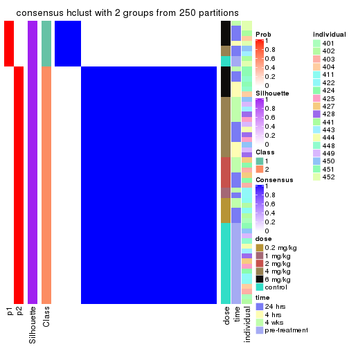</p>

</div>
<div id='tab-ATC-hclust-consensus-heatmap-2'>
<pre><code class="r">consensus_heatmap(res, k = 3)
</code></pre>

<p>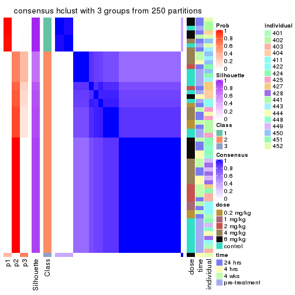</p>

</div>
<div id='tab-ATC-hclust-consensus-heatmap-3'>
<pre><code class="r">consensus_heatmap(res, k = 4)
</code></pre>

<p>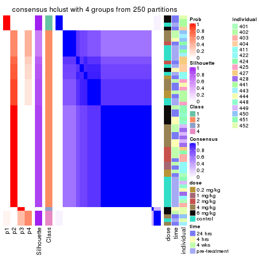</p>

</div>
<div id='tab-ATC-hclust-consensus-heatmap-4'>
<pre><code class="r">consensus_heatmap(res, k = 5)
</code></pre>

<p>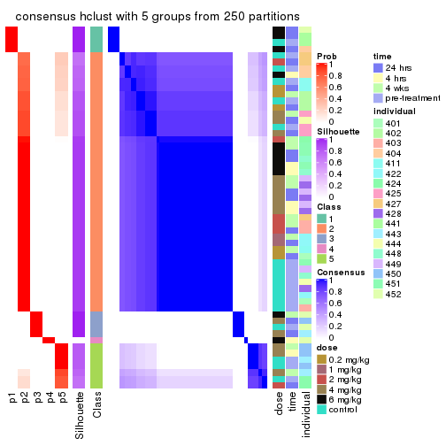</p>

</div>
<div id='tab-ATC-hclust-consensus-heatmap-5'>
<pre><code class="r">consensus_heatmap(res, k = 6)
</code></pre>

<p>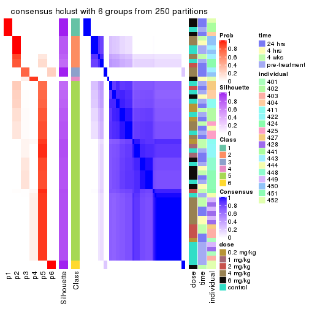</p>

</div>
</div>

Heatmaps for the membership of samples in all partitions to see how consistent they are:


<script>
$( function() {
	$( '#tabs-ATC-hclust-membership-heatmap' ).tabs();
} );
</script>
<div id='tabs-ATC-hclust-membership-heatmap'>
<ul>
<li><a href='#tab-ATC-hclust-membership-heatmap-1'>k = 2</a></li>
<li><a href='#tab-ATC-hclust-membership-heatmap-2'>k = 3</a></li>
<li><a href='#tab-ATC-hclust-membership-heatmap-3'>k = 4</a></li>
<li><a href='#tab-ATC-hclust-membership-heatmap-4'>k = 5</a></li>
<li><a href='#tab-ATC-hclust-membership-heatmap-5'>k = 6</a></li>
</ul>
<div id='tab-ATC-hclust-membership-heatmap-1'>
<pre><code class="r">membership_heatmap(res, k = 2)
</code></pre>

<p>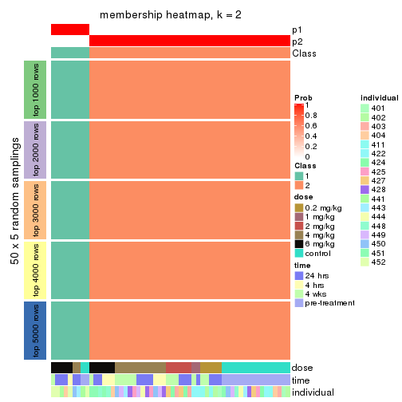</p>

</div>
<div id='tab-ATC-hclust-membership-heatmap-2'>
<pre><code class="r">membership_heatmap(res, k = 3)
</code></pre>

<p>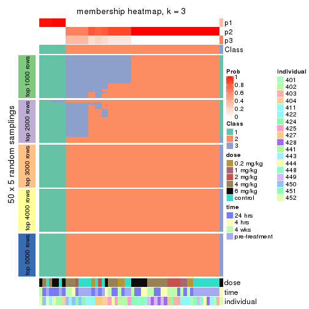</p>

</div>
<div id='tab-ATC-hclust-membership-heatmap-3'>
<pre><code class="r">membership_heatmap(res, k = 4)
</code></pre>

<p>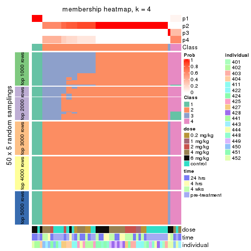</p>

</div>
<div id='tab-ATC-hclust-membership-heatmap-4'>
<pre><code class="r">membership_heatmap(res, k = 5)
</code></pre>

<p>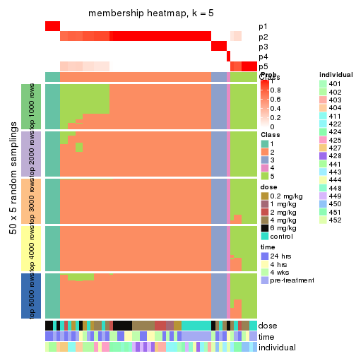</p>

</div>
<div id='tab-ATC-hclust-membership-heatmap-5'>
<pre><code class="r">membership_heatmap(res, k = 6)
</code></pre>

<p>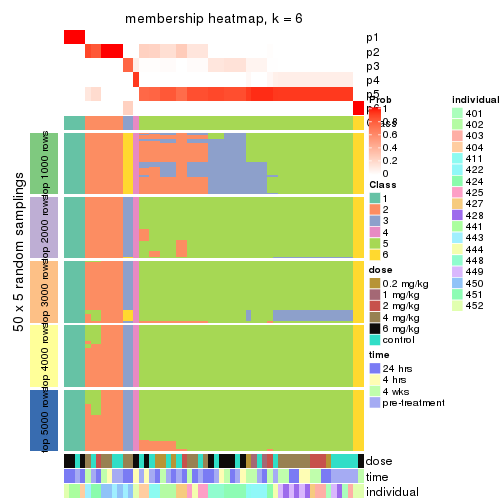</p>

</div>
</div>

As soon as we have had the classes for columns, we can look for signatures
which are significantly different between classes which can be candidate marks
for certain classes. Following are the heatmaps for signatures.


Signature heatmaps where rows are scaled:


<script>
$( function() {
	$( '#tabs-ATC-hclust-get-signatures' ).tabs();
} );
</script>
<div id='tabs-ATC-hclust-get-signatures'>
<ul>
<li><a href='#tab-ATC-hclust-get-signatures-1'>k = 2</a></li>
<li><a href='#tab-ATC-hclust-get-signatures-2'>k = 3</a></li>
<li><a href='#tab-ATC-hclust-get-signatures-3'>k = 4</a></li>
<li><a href='#tab-ATC-hclust-get-signatures-4'>k = 5</a></li>
<li><a href='#tab-ATC-hclust-get-signatures-5'>k = 6</a></li>
</ul>
<div id='tab-ATC-hclust-get-signatures-1'>
<pre><code class="r">get_signatures(res, k = 2)
</code></pre>

<p>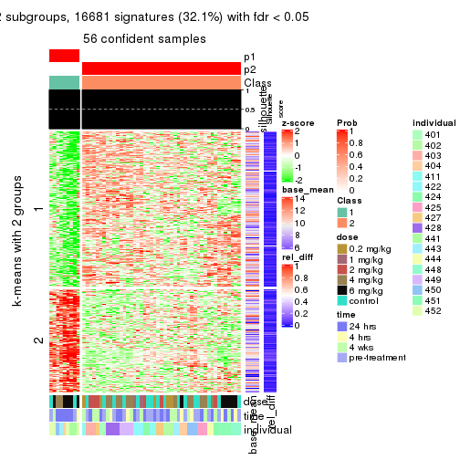</p>

</div>
<div id='tab-ATC-hclust-get-signatures-2'>
<pre><code class="r">get_signatures(res, k = 3)
</code></pre>

<p>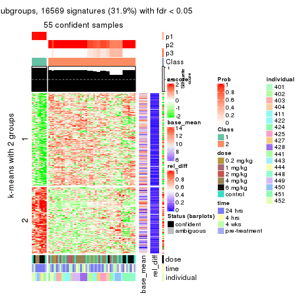</p>

</div>
<div id='tab-ATC-hclust-get-signatures-3'>
<pre><code class="r">get_signatures(res, k = 4)
</code></pre>

<p>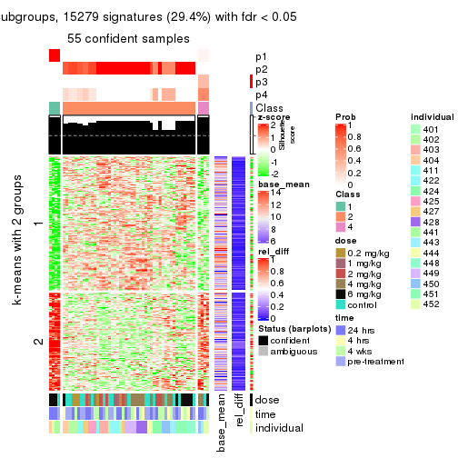</p>

</div>
<div id='tab-ATC-hclust-get-signatures-4'>
<pre><code class="r">get_signatures(res, k = 5)
</code></pre>

<p>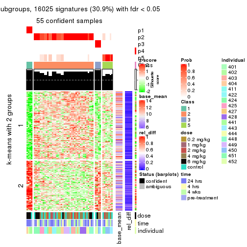</p>

</div>
<div id='tab-ATC-hclust-get-signatures-5'>
<pre><code class="r">get_signatures(res, k = 6)
</code></pre>

<p>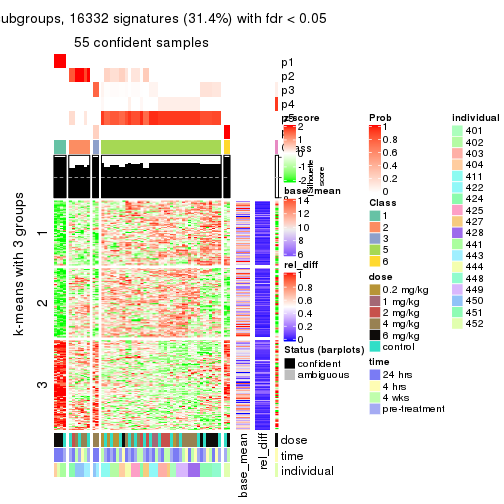</p>

</div>
</div>


Signature heatmaps where rows are not scaled:


<script>
$( function() {
	$( '#tabs-ATC-hclust-get-signatures-no-scale' ).tabs();
} );
</script>
<div id='tabs-ATC-hclust-get-signatures-no-scale'>
<ul>
<li><a href='#tab-ATC-hclust-get-signatures-no-scale-1'>k = 2</a></li>
<li><a href='#tab-ATC-hclust-get-signatures-no-scale-2'>k = 3</a></li>
<li><a href='#tab-ATC-hclust-get-signatures-no-scale-3'>k = 4</a></li>
<li><a href='#tab-ATC-hclust-get-signatures-no-scale-4'>k = 5</a></li>
<li><a href='#tab-ATC-hclust-get-signatures-no-scale-5'>k = 6</a></li>
</ul>
<div id='tab-ATC-hclust-get-signatures-no-scale-1'>
<pre><code class="r">get_signatures(res, k = 2, scale_rows = FALSE)
</code></pre>

<p>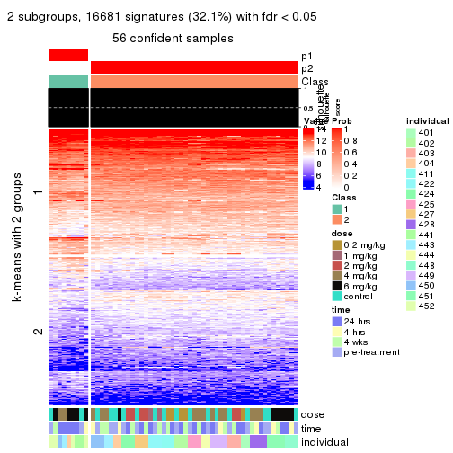</p>

</div>
<div id='tab-ATC-hclust-get-signatures-no-scale-2'>
<pre><code class="r">get_signatures(res, k = 3, scale_rows = FALSE)
</code></pre>

<p>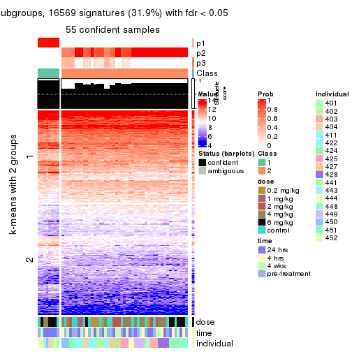</p>

</div>
<div id='tab-ATC-hclust-get-signatures-no-scale-3'>
<pre><code class="r">get_signatures(res, k = 4, scale_rows = FALSE)
</code></pre>

<p>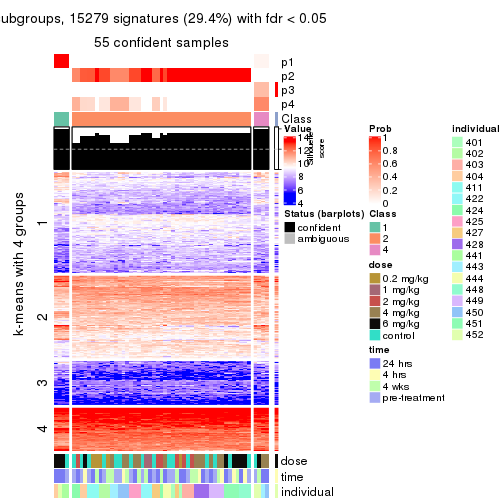</p>

</div>
<div id='tab-ATC-hclust-get-signatures-no-scale-4'>
<pre><code class="r">get_signatures(res, k = 5, scale_rows = FALSE)
</code></pre>

<p>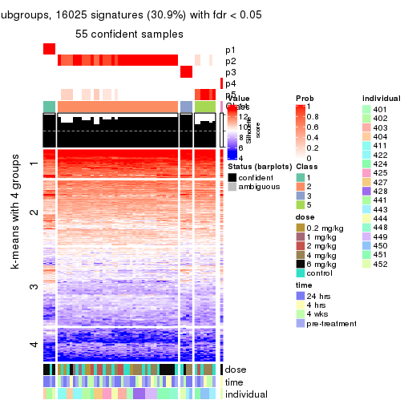</p>

</div>
<div id='tab-ATC-hclust-get-signatures-no-scale-5'>
<pre><code class="r">get_signatures(res, k = 6, scale_rows = FALSE)
</code></pre>

<p>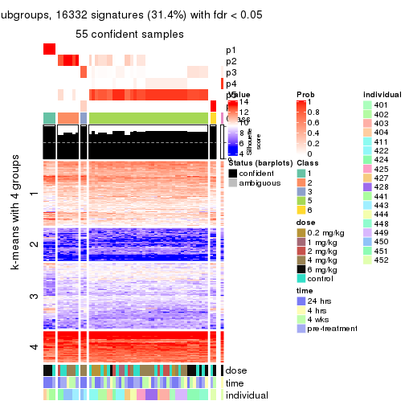</p>

</div>
</div>


Compare the overlap of signatures from different k:

```r
compare_signatures(res)
```

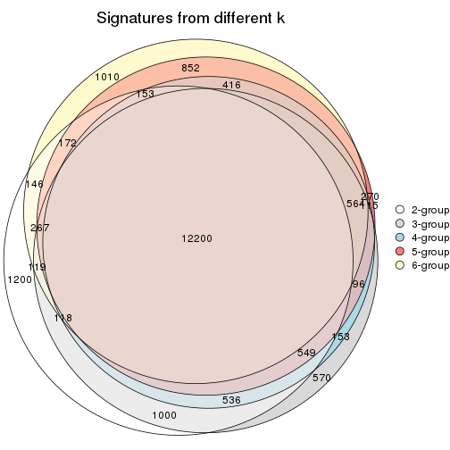

`get_signature()` returns a data frame invisibly. TO get the list of signatures, the function
call should be assigned to a variable explicitly. In following code, if `plot` argument is set
to `FALSE`, no heatmap is plotted while only the differential analysis is performed.

```r
# code only for demonstration
tb = get_signature(res, k = ..., plot = FALSE)
```

An example of the output of `tb` is:

```
#>   which_row         fdr    mean_1    mean_2 scaled_mean_1 scaled_mean_2 km
#> 1        38 0.042760348  8.373488  9.131774    -0.5533452     0.5164555  1
#> 2        40 0.018707592  7.106213  8.469186    -0.6173731     0.5762149  1
#> 3        55 0.019134737 10.221463 11.207825    -0.6159697     0.5749050  1
#> 4        59 0.006059896  5.921854  7.869574    -0.6899429     0.6439467  1
#> 5        60 0.018055526  8.928898 10.211722    -0.6204761     0.5791110  1
#> 6        98 0.009384629 15.714769 14.887706     0.6635654    -0.6193277  2
...
```

The columns in `tb` are:

1. `which_row`: row indices corresponding to the input matrix.
2. `fdr`: FDR for the differential test. 
3. `mean_x`: The mean value in group x.
4. `scaled_mean_x`: The mean value in group x after rows are scaled.
5. `km`: Row groups if k-means clustering is applied to rows.


UMAP plot which shows how samples are separated.


<script>
$( function() {
	$( '#tabs-ATC-hclust-dimension-reduction' ).tabs();
} );
</script>
<div id='tabs-ATC-hclust-dimension-reduction'>
<ul>
<li><a href='#tab-ATC-hclust-dimension-reduction-1'>k = 2</a></li>
<li><a href='#tab-ATC-hclust-dimension-reduction-2'>k = 3</a></li>
<li><a href='#tab-ATC-hclust-dimension-reduction-3'>k = 4</a></li>
<li><a href='#tab-ATC-hclust-dimension-reduction-4'>k = 5</a></li>
<li><a href='#tab-ATC-hclust-dimension-reduction-5'>k = 6</a></li>
</ul>
<div id='tab-ATC-hclust-dimension-reduction-1'>
<pre><code class="r">dimension_reduction(res, k = 2, method = &quot;UMAP&quot;)
</code></pre>

<p>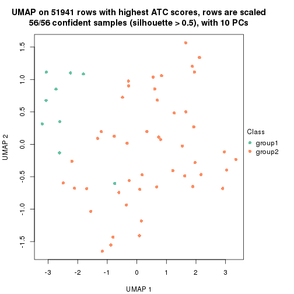</p>

</div>
<div id='tab-ATC-hclust-dimension-reduction-2'>
<pre><code class="r">dimension_reduction(res, k = 3, method = &quot;UMAP&quot;)
</code></pre>

<p>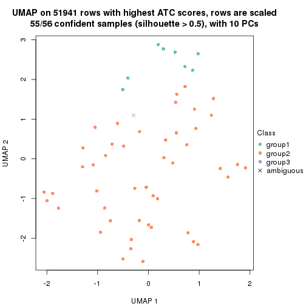</p>

</div>
<div id='tab-ATC-hclust-dimension-reduction-3'>
<pre><code class="r">dimension_reduction(res, k = 4, method = &quot;UMAP&quot;)
</code></pre>

<p>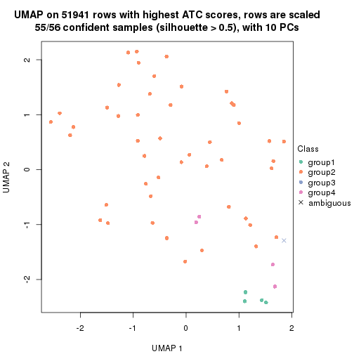</p>

</div>
<div id='tab-ATC-hclust-dimension-reduction-4'>
<pre><code class="r">dimension_reduction(res, k = 5, method = &quot;UMAP&quot;)
</code></pre>

<p>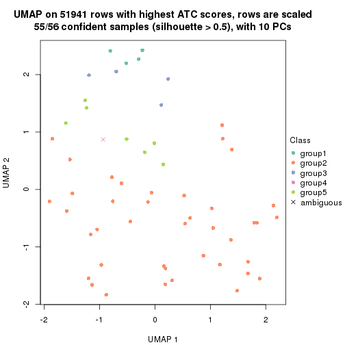</p>

</div>
<div id='tab-ATC-hclust-dimension-reduction-5'>
<pre><code class="r">dimension_reduction(res, k = 6, method = &quot;UMAP&quot;)
</code></pre>

<p>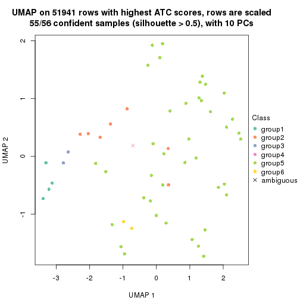</p>

</div>
</div>


Following heatmap shows how subgroups are split when increasing `k`:

```r
collect_classes(res)
```

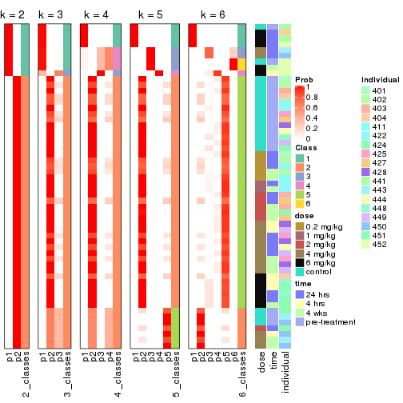


Test correlation between subgroups and known annotations. If the known
annotation is numeric, one-way ANOVA test is applied, and if the known
annotation is discrete, chi-squared contingency table test is applied.

```r
test_to_known_factors(res)
```

```
#>             n dose(p) time(p) individual(p) k
#> ATC:hclust 56  0.0784   0.415      1.08e-03 2
#> ATC:hclust 55  0.1799   0.239      2.28e-03 3
#> ATC:hclust 55  0.2648   0.527      3.35e-03 4
#> ATC:hclust 55  0.4047   0.757      5.24e-05 5
#> ATC:hclust 55  0.3552   0.555      2.34e-05 6
```


If matrix rows can be associated to genes, consider to use `functional_enrichment(res,
...)` to perform function enrichment for the signature genes. See [this vignette](http://bioconductor.org/packages/devel/bioc/vignettes/cola/inst/doc/functional_enrichment.html) for more detailed explanations.


 

---------------------------------------------------


### ATC:kmeans**


The object with results only for a single top-value method and a single partition method 
can be extracted as:

```r
res = res_list["ATC", "kmeans"]
# you can also extract it by
# res = res_list["ATC:kmeans"]
```

A summary of `res` and all the functions that can be applied to it:

```r
res
```

```
#> A 'ConsensusPartition' object with k = 2, 3, 4, 5, 6.
#>   On a matrix with 51941 rows and 56 columns.
#>   Top rows (1000, 2000, 3000, 4000, 5000) are extracted by 'ATC' method.
#>   Subgroups are detected by 'kmeans' method.
#>   Performed in total 1250 partitions by row resampling.
#>   Best k for subgroups seems to be 2.
#> 
#> Following methods can be applied to this 'ConsensusPartition' object:
#>  [1] "cola_report"             "collect_classes"         "collect_plots"          
#>  [4] "collect_stats"           "colnames"                "compare_signatures"     
#>  [7] "consensus_heatmap"       "dimension_reduction"     "functional_enrichment"  
#> [10] "get_anno_col"            "get_anno"                "get_classes"            
#> [13] "get_consensus"           "get_matrix"              "get_membership"         
#> [16] "get_param"               "get_signatures"          "get_stats"              
#> [19] "is_best_k"               "is_stable_k"             "membership_heatmap"     
#> [22] "ncol"                    "nrow"                    "plot_ecdf"              
#> [25] "rownames"                "select_partition_number" "show"                   
#> [28] "suggest_best_k"          "test_to_known_factors"
```

`collect_plots()` function collects all the plots made from `res` for all `k` (number of partitions)
into one single page to provide an easy and fast comparison between different `k`.

```r
collect_plots(res)
```

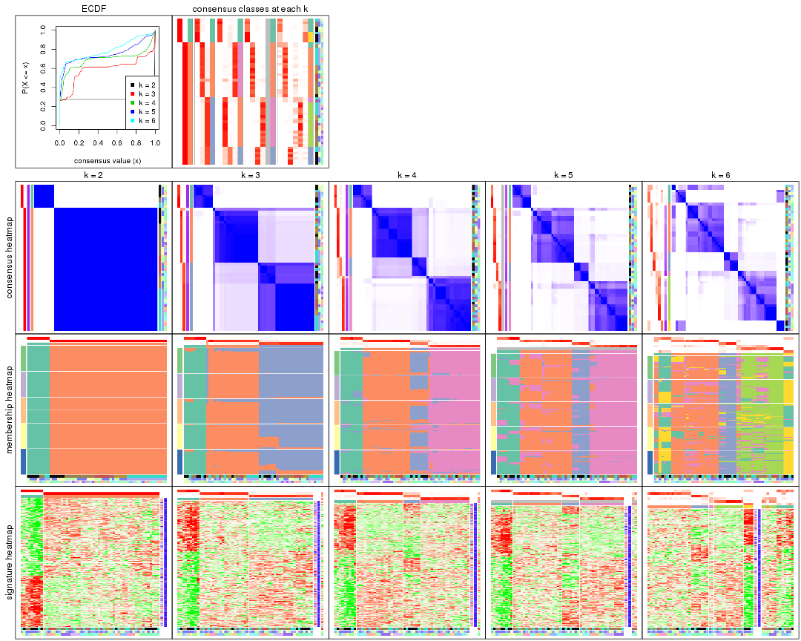

The plots are:

- The first row: a plot of the ECDF (empirical cumulative distribution
  function) curves of the consensus matrix for each `k` and the heatmap of
  predicted classes for each `k`.
- The second row: heatmaps of the consensus matrix for each `k`.
- The third row: heatmaps of the membership matrix for each `k`.
- The fouth row: heatmaps of the signatures for each `k`.

All the plots in panels can be made by individual functions and they are
plotted later in this section.

`select_partition_number()` produces several plots showing different
statistics for choosing "optimized" `k`. There are following statistics:

- ECDF curves of the consensus matrix for each `k`;
- 1-PAC. [The PAC
  score](https://en.wikipedia.org/wiki/Consensus_clustering#Over-interpretation_potential_of_consensus_clustering)
  measures the proportion of the ambiguous subgrouping.
- Mean silhouette score.
- Concordance. The mean probability of fiting the consensus class ids in all
  partitions.
- Area increased. Denote $A_k$ as the area under the ECDF curve for current
  `k`, the area increased is defined as $A_k - A_{k-1}$.
- Rand index. The percent of pairs of samples that are both in a same cluster
  or both are not in a same cluster in the partition of k and k-1.
- Jaccard index. The ratio of pairs of samples are both in a same cluster in
  the partition of k and k-1 and the pairs of samples are both in a same
  cluster in the partition k or k-1.

The detailed explanations of these statistics can be found in [the _cola_
vignette](http://bioconductor.org/packages/devel/bioc/vignettes/cola/inst/doc/cola.html#toc_13).

Generally speaking, lower PAC score, higher mean silhouette score or higher
concordance corresponds to better partition. Rand index and Jaccard index
measure how similar the current partition is compared to partition with `k-1`.
If they are too similar, we won't accept `k` is better than `k-1`.

```r
select_partition_number(res)
```

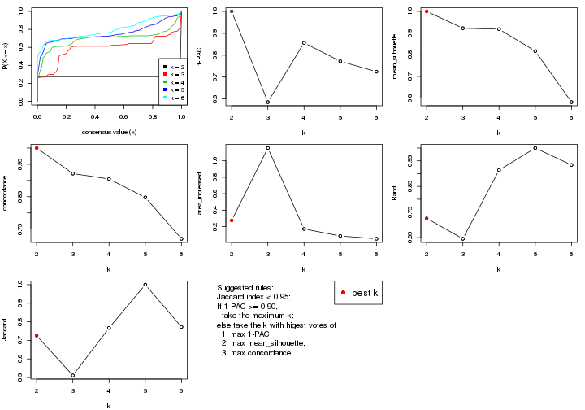

The numeric values for all these statistics can be obtained by `get_stats()`.

```r
get_stats(res)
```

```
#>   k 1-PAC mean_silhouette concordance area_increased  Rand Jaccard
#> 2 2 1.000           1.000       1.000         0.2754 0.725   0.725
#> 3 3 0.586           0.922       0.921         1.1557 0.645   0.511
#> 4 4 0.856           0.918       0.905         0.1717 0.914   0.767
#> 5 5 0.772           0.817       0.848         0.0854 1.000   1.000
#> 6 6 0.725           0.582       0.720         0.0519 0.934   0.772
```

`suggest_best_k()` suggests the best $k$ based on these statistics. The rules are as follows:

- All $k$ with Jaccard index larger than 0.95 are removed because increasing
  $k$ does not provide enough extra information. If all $k$ are removed, it is
  marked as no subgroup is detected.
- For all $k$ with 1-PAC score larger than 0.9, the maximal $k$ is taken as
  the best $k$, and other $k$ are marked as optional $k$.
- If it does not fit the second rule. The $k$ with the maximal vote of the
  highest 1-PAC score, highest mean silhouette, and highest concordance is
  taken as the best $k$.

```r
suggest_best_k(res)
```

```
#> [1] 2
```


Following shows the table of the partitions (You need to click the **show/hide
code output** link to see it). The membership matrix (columns with name `p*`)
is inferred by
[`clue::cl_consensus()`](https://www.rdocumentation.org/link/cl_consensus?package=clue)
function with the `SE` method. Basically the value in the membership matrix
represents the probability to belong to a certain group. The finall class
label for an item is determined with the group with highest probability it
belongs to.

In `get_classes()` function, the entropy is calculated from the membership
matrix and the silhouette score is calculated from the consensus matrix.


<script>
$( function() {
	$( '#tabs-ATC-kmeans-get-classes' ).tabs();
} );
</script>
<div id='tabs-ATC-kmeans-get-classes'>
<ul>
<li><a href='#tab-ATC-kmeans-get-classes-1'>k = 2</a></li>
<li><a href='#tab-ATC-kmeans-get-classes-2'>k = 3</a></li>
<li><a href='#tab-ATC-kmeans-get-classes-3'>k = 4</a></li>
<li><a href='#tab-ATC-kmeans-get-classes-4'>k = 5</a></li>
<li><a href='#tab-ATC-kmeans-get-classes-5'>k = 6</a></li>
</ul>

<div id='tab-ATC-kmeans-get-classes-1'>
<p><a id='tab-ATC-kmeans-get-classes-1-a' style='color:#0366d6' href='#'>show/hide code output</a></p>
<pre><code class="r">cbind(get_classes(res, k = 2), get_membership(res, k = 2))
</code></pre>

<pre><code>#&gt;           class entropy silhouette p1 p2
#&gt; GSM687644     2       0          1  0  1
#&gt; GSM687648     2       0          1  0  1
#&gt; GSM687653     2       0          1  0  1
#&gt; GSM687658     2       0          1  0  1
#&gt; GSM687663     2       0          1  0  1
#&gt; GSM687668     2       0          1  0  1
#&gt; GSM687673     2       0          1  0  1
#&gt; GSM687678     2       0          1  0  1
#&gt; GSM687683     2       0          1  0  1
#&gt; GSM687688     2       0          1  0  1
#&gt; GSM687695     1       0          1  1  0
#&gt; GSM687699     2       0          1  0  1
#&gt; GSM687704     2       0          1  0  1
#&gt; GSM687707     2       0          1  0  1
#&gt; GSM687712     2       0          1  0  1
#&gt; GSM687719     2       0          1  0  1
#&gt; GSM687724     2       0          1  0  1
#&gt; GSM687728     1       0          1  1  0
#&gt; GSM687646     2       0          1  0  1
#&gt; GSM687649     2       0          1  0  1
#&gt; GSM687665     2       0          1  0  1
#&gt; GSM687651     2       0          1  0  1
#&gt; GSM687667     2       0          1  0  1
#&gt; GSM687670     2       0          1  0  1
#&gt; GSM687671     2       0          1  0  1
#&gt; GSM687654     2       0          1  0  1
#&gt; GSM687675     2       0          1  0  1
#&gt; GSM687685     2       0          1  0  1
#&gt; GSM687656     2       0          1  0  1
#&gt; GSM687677     2       0          1  0  1
#&gt; GSM687687     2       0          1  0  1
#&gt; GSM687692     2       0          1  0  1
#&gt; GSM687716     2       0          1  0  1
#&gt; GSM687722     2       0          1  0  1
#&gt; GSM687680     2       0          1  0  1
#&gt; GSM687690     2       0          1  0  1
#&gt; GSM687700     1       0          1  1  0
#&gt; GSM687705     2       0          1  0  1
#&gt; GSM687714     2       0          1  0  1
#&gt; GSM687721     1       0          1  1  0
#&gt; GSM687682     2       0          1  0  1
#&gt; GSM687694     2       0          1  0  1
#&gt; GSM687702     2       0          1  0  1
#&gt; GSM687718     2       0          1  0  1
#&gt; GSM687723     2       0          1  0  1
#&gt; GSM687661     2       0          1  0  1
#&gt; GSM687710     2       0          1  0  1
#&gt; GSM687726     2       0          1  0  1
#&gt; GSM687730     1       0          1  1  0
#&gt; GSM687660     1       0          1  1  0
#&gt; GSM687697     1       0          1  1  0
#&gt; GSM687709     2       0          1  0  1
#&gt; GSM687725     2       0          1  0  1
#&gt; GSM687729     1       0          1  1  0
#&gt; GSM687727     2       0          1  0  1
#&gt; GSM687731     1       0          1  1  0
</code></pre>

<script>
$('#tab-ATC-kmeans-get-classes-1-a').parent().next().next().hide();
$('#tab-ATC-kmeans-get-classes-1-a').click(function(){
  $('#tab-ATC-kmeans-get-classes-1-a').parent().next().next().toggle();
  return(false);
});
</script>
</div>

<div id='tab-ATC-kmeans-get-classes-2'>
<p><a id='tab-ATC-kmeans-get-classes-2-a' style='color:#0366d6' href='#'>show/hide code output</a></p>
<pre><code class="r">cbind(get_classes(res, k = 3), get_membership(res, k = 3))
</code></pre>

<pre><code>#&gt;           class entropy silhouette    p1    p2    p3
#&gt; GSM687644     3  0.2165      0.942 0.000 0.064 0.936
#&gt; GSM687648     2  0.2537      0.961 0.000 0.920 0.080
#&gt; GSM687653     3  0.2165      0.942 0.000 0.064 0.936
#&gt; GSM687658     2  0.2537      0.961 0.000 0.920 0.080
#&gt; GSM687663     2  0.2537      0.961 0.000 0.920 0.080
#&gt; GSM687668     3  0.2165      0.942 0.000 0.064 0.936
#&gt; GSM687673     2  0.2356      0.958 0.000 0.928 0.072
#&gt; GSM687678     2  0.2537      0.961 0.000 0.920 0.080
#&gt; GSM687683     2  0.2537      0.961 0.000 0.920 0.080
#&gt; GSM687688     3  0.2165      0.942 0.000 0.064 0.936
#&gt; GSM687695     1  0.0000      0.978 1.000 0.000 0.000
#&gt; GSM687699     2  0.1964      0.945 0.000 0.944 0.056
#&gt; GSM687704     3  0.2165      0.942 0.000 0.064 0.936
#&gt; GSM687707     3  0.3752      0.837 0.000 0.144 0.856
#&gt; GSM687712     3  0.2165      0.942 0.000 0.064 0.936
#&gt; GSM687719     2  0.0237      0.884 0.000 0.996 0.004
#&gt; GSM687724     3  0.3412      0.850 0.000 0.124 0.876
#&gt; GSM687728     1  0.2448      0.971 0.924 0.076 0.000
#&gt; GSM687646     3  0.2165      0.942 0.000 0.064 0.936
#&gt; GSM687649     2  0.2878      0.947 0.000 0.904 0.096
#&gt; GSM687665     2  0.2448      0.960 0.000 0.924 0.076
#&gt; GSM687651     2  0.2537      0.961 0.000 0.920 0.080
#&gt; GSM687667     3  0.2165      0.942 0.000 0.064 0.936
#&gt; GSM687670     3  0.4062      0.872 0.000 0.164 0.836
#&gt; GSM687671     3  0.2165      0.942 0.000 0.064 0.936
#&gt; GSM687654     3  0.2165      0.942 0.000 0.064 0.936
#&gt; GSM687675     2  0.1964      0.945 0.000 0.944 0.056
#&gt; GSM687685     2  0.2537      0.961 0.000 0.920 0.080
#&gt; GSM687656     3  0.2165      0.942 0.000 0.064 0.936
#&gt; GSM687677     2  0.6260      0.133 0.000 0.552 0.448
#&gt; GSM687687     3  0.2165      0.942 0.000 0.064 0.936
#&gt; GSM687692     3  0.2165      0.942 0.000 0.064 0.936
#&gt; GSM687716     3  0.2165      0.942 0.000 0.064 0.936
#&gt; GSM687722     2  0.0237      0.884 0.000 0.996 0.004
#&gt; GSM687680     2  0.2537      0.961 0.000 0.920 0.080
#&gt; GSM687690     3  0.2165      0.942 0.000 0.064 0.936
#&gt; GSM687700     1  0.0892      0.978 0.980 0.020 0.000
#&gt; GSM687705     2  0.2537      0.961 0.000 0.920 0.080
#&gt; GSM687714     3  0.2165      0.942 0.000 0.064 0.936
#&gt; GSM687721     1  0.2448      0.971 0.924 0.076 0.000
#&gt; GSM687682     2  0.2537      0.961 0.000 0.920 0.080
#&gt; GSM687694     3  0.2165      0.942 0.000 0.064 0.936
#&gt; GSM687702     2  0.2356      0.958 0.000 0.928 0.072
#&gt; GSM687718     3  0.2165      0.942 0.000 0.064 0.936
#&gt; GSM687723     2  0.2448      0.960 0.000 0.924 0.076
#&gt; GSM687661     2  0.2537      0.961 0.000 0.920 0.080
#&gt; GSM687710     3  0.3752      0.837 0.000 0.144 0.856
#&gt; GSM687726     3  0.3412      0.850 0.000 0.124 0.876
#&gt; GSM687730     1  0.1964      0.975 0.944 0.056 0.000
#&gt; GSM687660     1  0.0000      0.978 1.000 0.000 0.000
#&gt; GSM687697     1  0.0000      0.978 1.000 0.000 0.000
#&gt; GSM687709     3  0.3752      0.837 0.000 0.144 0.856
#&gt; GSM687725     3  0.3816      0.827 0.000 0.148 0.852
#&gt; GSM687729     1  0.0000      0.978 1.000 0.000 0.000
#&gt; GSM687727     3  0.3412      0.850 0.000 0.124 0.876
#&gt; GSM687731     1  0.2448      0.971 0.924 0.076 0.000
</code></pre>

<script>
$('#tab-ATC-kmeans-get-classes-2-a').parent().next().next().hide();
$('#tab-ATC-kmeans-get-classes-2-a').click(function(){
  $('#tab-ATC-kmeans-get-classes-2-a').parent().next().next().toggle();
  return(false);
});
</script>
</div>

<div id='tab-ATC-kmeans-get-classes-3'>
<p><a id='tab-ATC-kmeans-get-classes-3-a' style='color:#0366d6' href='#'>show/hide code output</a></p>
<pre><code class="r">cbind(get_classes(res, k = 4), get_membership(res, k = 4))
</code></pre>

<pre><code>#&gt;           class entropy silhouette    p1    p2    p3    p4
#&gt; GSM687644     2  0.0376      0.958 0.000 0.992 0.004 0.004
#&gt; GSM687648     4  0.1510      0.931 0.000 0.028 0.016 0.956
#&gt; GSM687653     2  0.0376      0.958 0.000 0.992 0.004 0.004
#&gt; GSM687658     4  0.1733      0.931 0.000 0.024 0.028 0.948
#&gt; GSM687663     4  0.1510      0.931 0.000 0.028 0.016 0.956
#&gt; GSM687668     2  0.3009      0.853 0.000 0.892 0.056 0.052
#&gt; GSM687673     4  0.1767      0.919 0.000 0.012 0.044 0.944
#&gt; GSM687678     4  0.1733      0.930 0.000 0.028 0.024 0.948
#&gt; GSM687683     4  0.1256      0.932 0.000 0.028 0.008 0.964
#&gt; GSM687688     2  0.1209      0.951 0.000 0.964 0.032 0.004
#&gt; GSM687695     1  0.2408      0.918 0.896 0.000 0.104 0.000
#&gt; GSM687699     4  0.1854      0.918 0.000 0.012 0.048 0.940
#&gt; GSM687704     2  0.1109      0.953 0.000 0.968 0.028 0.004
#&gt; GSM687707     3  0.5810      0.960 0.000 0.256 0.672 0.072
#&gt; GSM687712     2  0.1209      0.950 0.000 0.964 0.032 0.004
#&gt; GSM687719     4  0.2530      0.863 0.000 0.000 0.112 0.888
#&gt; GSM687724     3  0.5471      0.953 0.000 0.268 0.684 0.048
#&gt; GSM687728     1  0.2623      0.914 0.908 0.000 0.064 0.028
#&gt; GSM687646     2  0.0376      0.958 0.000 0.992 0.004 0.004
#&gt; GSM687649     4  0.2796      0.876 0.000 0.092 0.016 0.892
#&gt; GSM687665     4  0.1510      0.933 0.000 0.028 0.016 0.956
#&gt; GSM687651     4  0.1510      0.931 0.000 0.028 0.016 0.956
#&gt; GSM687667     2  0.0188      0.958 0.000 0.996 0.000 0.004
#&gt; GSM687670     2  0.3533      0.803 0.000 0.864 0.056 0.080
#&gt; GSM687671     2  0.1661      0.914 0.000 0.944 0.052 0.004
#&gt; GSM687654     2  0.0376      0.958 0.000 0.992 0.004 0.004
#&gt; GSM687675     4  0.1854      0.918 0.000 0.012 0.048 0.940
#&gt; GSM687685     4  0.1256      0.932 0.000 0.028 0.008 0.964
#&gt; GSM687656     2  0.0376      0.958 0.000 0.992 0.004 0.004
#&gt; GSM687677     4  0.6340      0.303 0.000 0.344 0.076 0.580
#&gt; GSM687687     2  0.0376      0.958 0.000 0.992 0.004 0.004
#&gt; GSM687692     2  0.1209      0.951 0.000 0.964 0.032 0.004
#&gt; GSM687716     2  0.1305      0.950 0.000 0.960 0.036 0.004
#&gt; GSM687722     4  0.2530      0.863 0.000 0.000 0.112 0.888
#&gt; GSM687680     4  0.1733      0.930 0.000 0.028 0.024 0.948
#&gt; GSM687690     2  0.1209      0.951 0.000 0.964 0.032 0.004
#&gt; GSM687700     1  0.0000      0.922 1.000 0.000 0.000 0.000
#&gt; GSM687705     4  0.2131      0.923 0.000 0.032 0.036 0.932
#&gt; GSM687714     2  0.1209      0.950 0.000 0.964 0.032 0.004
#&gt; GSM687721     1  0.2699      0.913 0.904 0.000 0.068 0.028
#&gt; GSM687682     4  0.1936      0.927 0.000 0.028 0.032 0.940
#&gt; GSM687694     2  0.1209      0.951 0.000 0.964 0.032 0.004
#&gt; GSM687702     4  0.1854      0.918 0.000 0.012 0.048 0.940
#&gt; GSM687718     2  0.1305      0.950 0.000 0.960 0.036 0.004
#&gt; GSM687723     4  0.1854      0.918 0.000 0.012 0.048 0.940
#&gt; GSM687661     4  0.1733      0.931 0.000 0.024 0.028 0.948
#&gt; GSM687710     3  0.5810      0.960 0.000 0.256 0.672 0.072
#&gt; GSM687726     3  0.5471      0.953 0.000 0.268 0.684 0.048
#&gt; GSM687730     1  0.2805      0.907 0.888 0.000 0.100 0.012
#&gt; GSM687660     1  0.2408      0.918 0.896 0.000 0.104 0.000
#&gt; GSM687697     1  0.2408      0.918 0.896 0.000 0.104 0.000
#&gt; GSM687709     3  0.5910      0.951 0.000 0.244 0.672 0.084
#&gt; GSM687725     3  0.5783      0.942 0.000 0.220 0.692 0.088
#&gt; GSM687729     1  0.2408      0.918 0.896 0.000 0.104 0.000
#&gt; GSM687727     3  0.5312      0.946 0.000 0.268 0.692 0.040
#&gt; GSM687731     1  0.2623      0.914 0.908 0.000 0.064 0.028
</code></pre>

<script>
$('#tab-ATC-kmeans-get-classes-3-a').parent().next().next().hide();
$('#tab-ATC-kmeans-get-classes-3-a').click(function(){
  $('#tab-ATC-kmeans-get-classes-3-a').parent().next().next().toggle();
  return(false);
});
</script>
</div>

<div id='tab-ATC-kmeans-get-classes-4'>
<p><a id='tab-ATC-kmeans-get-classes-4-a' style='color:#0366d6' href='#'>show/hide code output</a></p>
<pre><code class="r">cbind(get_classes(res, k = 5), get_membership(res, k = 5))
</code></pre>

<pre><code>#&gt;           class entropy silhouette    p1    p2    p3    p4 p5
#&gt; GSM687644     4  0.1087      0.860 0.000 0.008 0.008 0.968 NA
#&gt; GSM687648     2  0.1686      0.838 0.000 0.944 0.020 0.008 NA
#&gt; GSM687653     4  0.0740      0.861 0.000 0.008 0.008 0.980 NA
#&gt; GSM687658     2  0.2136      0.833 0.000 0.904 0.008 0.000 NA
#&gt; GSM687663     2  0.1186      0.841 0.000 0.964 0.020 0.008 NA
#&gt; GSM687668     4  0.7188      0.506 0.000 0.216 0.064 0.532 NA
#&gt; GSM687673     2  0.3519      0.791 0.000 0.776 0.008 0.000 NA
#&gt; GSM687678     2  0.1597      0.838 0.000 0.948 0.020 0.008 NA
#&gt; GSM687683     2  0.0798      0.843 0.000 0.976 0.016 0.008 NA
#&gt; GSM687688     4  0.2358      0.845 0.000 0.008 0.000 0.888 NA
#&gt; GSM687695     1  0.0000      0.850 1.000 0.000 0.000 0.000 NA
#&gt; GSM687699     2  0.3461      0.790 0.000 0.772 0.004 0.000 NA
#&gt; GSM687704     4  0.2416      0.846 0.000 0.012 0.000 0.888 NA
#&gt; GSM687707     3  0.4492      0.911 0.000 0.020 0.776 0.060 NA
#&gt; GSM687712     4  0.2532      0.836 0.000 0.008 0.012 0.892 NA
#&gt; GSM687719     2  0.4288      0.657 0.000 0.612 0.004 0.000 NA
#&gt; GSM687724     3  0.1943      0.930 0.000 0.020 0.924 0.056 NA
#&gt; GSM687728     1  0.4755      0.842 0.672 0.008 0.028 0.000 NA
#&gt; GSM687646     4  0.0740      0.861 0.000 0.008 0.008 0.980 NA
#&gt; GSM687649     2  0.3924      0.755 0.000 0.824 0.020 0.060 NA
#&gt; GSM687665     2  0.0162      0.844 0.000 0.996 0.000 0.000 NA
#&gt; GSM687651     2  0.1299      0.842 0.000 0.960 0.020 0.008 NA
#&gt; GSM687667     4  0.3252      0.829 0.000 0.008 0.008 0.828 NA
#&gt; GSM687670     4  0.7232      0.493 0.000 0.224 0.064 0.524 NA
#&gt; GSM687671     4  0.5275      0.741 0.000 0.032 0.068 0.712 NA
#&gt; GSM687654     4  0.0740      0.861 0.000 0.008 0.008 0.980 NA
#&gt; GSM687675     2  0.3582      0.787 0.000 0.768 0.008 0.000 NA
#&gt; GSM687685     2  0.0798      0.843 0.000 0.976 0.016 0.008 NA
#&gt; GSM687656     4  0.0740      0.861 0.000 0.008 0.008 0.980 NA
#&gt; GSM687677     2  0.6527      0.474 0.000 0.612 0.064 0.112 NA
#&gt; GSM687687     4  0.0740      0.861 0.000 0.008 0.008 0.980 NA
#&gt; GSM687692     4  0.3455      0.817 0.000 0.008 0.000 0.784 NA
#&gt; GSM687716     4  0.2302      0.837 0.000 0.008 0.008 0.904 NA
#&gt; GSM687722     2  0.4288      0.657 0.000 0.612 0.004 0.000 NA
#&gt; GSM687680     2  0.1597      0.838 0.000 0.948 0.020 0.008 NA
#&gt; GSM687690     4  0.3582      0.810 0.000 0.008 0.000 0.768 NA
#&gt; GSM687700     1  0.3055      0.856 0.840 0.000 0.016 0.000 NA
#&gt; GSM687705     2  0.3509      0.769 0.000 0.832 0.020 0.016 NA
#&gt; GSM687714     4  0.3099      0.838 0.000 0.008 0.012 0.848 NA
#&gt; GSM687721     1  0.4579      0.839 0.668 0.008 0.016 0.000 NA
#&gt; GSM687682     2  0.2429      0.819 0.000 0.904 0.020 0.008 NA
#&gt; GSM687694     4  0.3551      0.811 0.000 0.008 0.000 0.772 NA
#&gt; GSM687702     2  0.3461      0.790 0.000 0.772 0.004 0.000 NA
#&gt; GSM687718     4  0.2302      0.837 0.000 0.008 0.008 0.904 NA
#&gt; GSM687723     2  0.3582      0.787 0.000 0.768 0.008 0.000 NA
#&gt; GSM687661     2  0.2470      0.829 0.000 0.884 0.012 0.000 NA
#&gt; GSM687710     3  0.4492      0.911 0.000 0.020 0.776 0.060 NA
#&gt; GSM687726     3  0.1943      0.930 0.000 0.020 0.924 0.056 NA
#&gt; GSM687730     1  0.4863      0.835 0.656 0.000 0.048 0.000 NA
#&gt; GSM687660     1  0.0000      0.850 1.000 0.000 0.000 0.000 NA
#&gt; GSM687697     1  0.0000      0.850 1.000 0.000 0.000 0.000 NA
#&gt; GSM687709     3  0.4516      0.910 0.000 0.024 0.776 0.056 NA
#&gt; GSM687725     3  0.1830      0.926 0.000 0.028 0.932 0.040 NA
#&gt; GSM687729     1  0.0000      0.850 1.000 0.000 0.000 0.000 NA
#&gt; GSM687727     3  0.1943      0.930 0.000 0.020 0.924 0.056 NA
#&gt; GSM687731     1  0.4755      0.842 0.672 0.008 0.028 0.000 NA
</code></pre>

<script>
$('#tab-ATC-kmeans-get-classes-4-a').parent().next().next().hide();
$('#tab-ATC-kmeans-get-classes-4-a').click(function(){
  $('#tab-ATC-kmeans-get-classes-4-a').parent().next().next().toggle();
  return(false);
});
</script>
</div>

<div id='tab-ATC-kmeans-get-classes-5'>
<p><a id='tab-ATC-kmeans-get-classes-5-a' style='color:#0366d6' href='#'>show/hide code output</a></p>
<pre><code class="r">cbind(get_classes(res, k = 6), get_membership(res, k = 6))
</code></pre>

<pre><code>#&gt;           class entropy silhouette    p1    p2    p3    p4    p5    p6
#&gt; GSM687644     5  0.1225     0.6558 0.000 0.000 0.012 0.036 0.952 0.000
#&gt; GSM687648     2  0.1793     0.7609 0.000 0.928 0.004 0.032 0.000 0.036
#&gt; GSM687653     5  0.0363     0.6753 0.000 0.000 0.012 0.000 0.988 0.000
#&gt; GSM687658     2  0.3049     0.7635 0.104 0.844 0.000 0.048 0.000 0.004
#&gt; GSM687663     2  0.1237     0.7721 0.000 0.956 0.004 0.020 0.000 0.020
#&gt; GSM687668     4  0.7475     1.0000 0.000 0.212 0.028 0.356 0.340 0.064
#&gt; GSM687673     2  0.4520     0.6561 0.220 0.688 0.000 0.092 0.000 0.000
#&gt; GSM687678     2  0.2462     0.7470 0.000 0.876 0.000 0.096 0.000 0.028
#&gt; GSM687683     2  0.0909     0.7803 0.012 0.968 0.000 0.020 0.000 0.000
#&gt; GSM687688     5  0.3421     0.5960 0.000 0.000 0.000 0.256 0.736 0.008
#&gt; GSM687695     6  0.3330     1.0000 0.284 0.000 0.000 0.000 0.000 0.716
#&gt; GSM687699     2  0.4702     0.6522 0.220 0.680 0.004 0.096 0.000 0.000
#&gt; GSM687704     5  0.4173     0.5538 0.000 0.012 0.000 0.268 0.696 0.024
#&gt; GSM687707     3  0.5767     0.8019 0.000 0.016 0.656 0.168 0.048 0.112
#&gt; GSM687712     5  0.4062     0.6163 0.000 0.000 0.000 0.176 0.744 0.080
#&gt; GSM687719     1  0.5421    -0.3272 0.452 0.432 0.000 0.116 0.000 0.000
#&gt; GSM687724     3  0.0865     0.8609 0.000 0.000 0.964 0.000 0.036 0.000
#&gt; GSM687728     1  0.3488     0.0750 0.744 0.000 0.004 0.008 0.000 0.244
#&gt; GSM687646     5  0.0363     0.6753 0.000 0.000 0.012 0.000 0.988 0.000
#&gt; GSM687649     2  0.3785     0.6179 0.000 0.792 0.004 0.144 0.008 0.052
#&gt; GSM687665     2  0.0912     0.7796 0.012 0.972 0.004 0.008 0.000 0.004
#&gt; GSM687651     2  0.1313     0.7702 0.000 0.952 0.004 0.016 0.000 0.028
#&gt; GSM687667     5  0.4164     0.3770 0.000 0.000 0.012 0.220 0.728 0.040
#&gt; GSM687670     4  0.7475     1.0000 0.000 0.212 0.028 0.356 0.340 0.064
#&gt; GSM687671     5  0.6224    -0.3586 0.000 0.040 0.028 0.356 0.512 0.064
#&gt; GSM687654     5  0.0363     0.6753 0.000 0.000 0.012 0.000 0.988 0.000
#&gt; GSM687675     2  0.4545     0.6522 0.224 0.684 0.000 0.092 0.000 0.000
#&gt; GSM687685     2  0.0909     0.7803 0.012 0.968 0.000 0.020 0.000 0.000
#&gt; GSM687656     5  0.0363     0.6753 0.000 0.000 0.012 0.000 0.988 0.000
#&gt; GSM687677     2  0.5564     0.0816 0.000 0.536 0.016 0.380 0.040 0.028
#&gt; GSM687687     5  0.0363     0.6753 0.000 0.000 0.012 0.000 0.988 0.000
#&gt; GSM687692     5  0.4032     0.4095 0.000 0.000 0.000 0.420 0.572 0.008
#&gt; GSM687716     5  0.3770     0.6314 0.000 0.000 0.000 0.148 0.776 0.076
#&gt; GSM687722     1  0.5421    -0.3272 0.452 0.432 0.000 0.116 0.000 0.000
#&gt; GSM687680     2  0.2462     0.7470 0.000 0.876 0.000 0.096 0.000 0.028
#&gt; GSM687690     5  0.4067     0.3763 0.000 0.000 0.000 0.444 0.548 0.008
#&gt; GSM687700     1  0.3869    -0.6183 0.500 0.000 0.000 0.000 0.000 0.500
#&gt; GSM687705     2  0.4161     0.5608 0.000 0.696 0.000 0.264 0.004 0.036
#&gt; GSM687714     5  0.4380     0.5941 0.000 0.000 0.000 0.220 0.700 0.080
#&gt; GSM687721     1  0.3720     0.0722 0.736 0.000 0.000 0.028 0.000 0.236
#&gt; GSM687682     2  0.3213     0.6993 0.000 0.808 0.000 0.160 0.000 0.032
#&gt; GSM687694     5  0.4039     0.4020 0.000 0.000 0.000 0.424 0.568 0.008
#&gt; GSM687702     2  0.4702     0.6522 0.220 0.680 0.004 0.096 0.000 0.000
#&gt; GSM687718     5  0.3806     0.6308 0.000 0.000 0.000 0.152 0.772 0.076
#&gt; GSM687723     2  0.4590     0.6512 0.224 0.680 0.000 0.096 0.000 0.000
#&gt; GSM687661     2  0.3220     0.7590 0.108 0.832 0.000 0.056 0.000 0.004
#&gt; GSM687710     3  0.5758     0.8017 0.000 0.016 0.656 0.172 0.048 0.108
#&gt; GSM687726     3  0.0865     0.8609 0.000 0.000 0.964 0.000 0.036 0.000
#&gt; GSM687730     1  0.4438     0.0310 0.712 0.000 0.024 0.040 0.000 0.224
#&gt; GSM687660     6  0.3330     1.0000 0.284 0.000 0.000 0.000 0.000 0.716
#&gt; GSM687697     6  0.3330     1.0000 0.284 0.000 0.000 0.000 0.000 0.716
#&gt; GSM687709     3  0.5779     0.7999 0.000 0.020 0.656 0.172 0.044 0.108
#&gt; GSM687725     3  0.1230     0.8556 0.000 0.008 0.956 0.000 0.028 0.008
#&gt; GSM687729     6  0.3330     1.0000 0.284 0.000 0.000 0.000 0.000 0.716
#&gt; GSM687727     3  0.0865     0.8609 0.000 0.000 0.964 0.000 0.036 0.000
#&gt; GSM687731     1  0.3488     0.0750 0.744 0.000 0.004 0.008 0.000 0.244
</code></pre>

<script>
$('#tab-ATC-kmeans-get-classes-5-a').parent().next().next().hide();
$('#tab-ATC-kmeans-get-classes-5-a').click(function(){
  $('#tab-ATC-kmeans-get-classes-5-a').parent().next().next().toggle();
  return(false);
});
</script>
</div>
</div>

Heatmaps for the consensus matrix. It visualizes the probability of two
samples to be in a same group.


<script>
$( function() {
	$( '#tabs-ATC-kmeans-consensus-heatmap' ).tabs();
} );
</script>
<div id='tabs-ATC-kmeans-consensus-heatmap'>
<ul>
<li><a href='#tab-ATC-kmeans-consensus-heatmap-1'>k = 2</a></li>
<li><a href='#tab-ATC-kmeans-consensus-heatmap-2'>k = 3</a></li>
<li><a href='#tab-ATC-kmeans-consensus-heatmap-3'>k = 4</a></li>
<li><a href='#tab-ATC-kmeans-consensus-heatmap-4'>k = 5</a></li>
<li><a href='#tab-ATC-kmeans-consensus-heatmap-5'>k = 6</a></li>
</ul>
<div id='tab-ATC-kmeans-consensus-heatmap-1'>
<pre><code class="r">consensus_heatmap(res, k = 2)
</code></pre>

<p>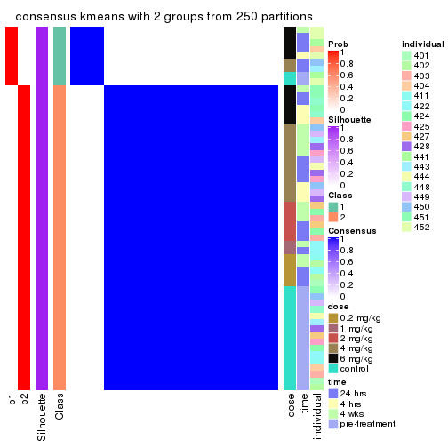</p>

</div>
<div id='tab-ATC-kmeans-consensus-heatmap-2'>
<pre><code class="r">consensus_heatmap(res, k = 3)
</code></pre>

<p>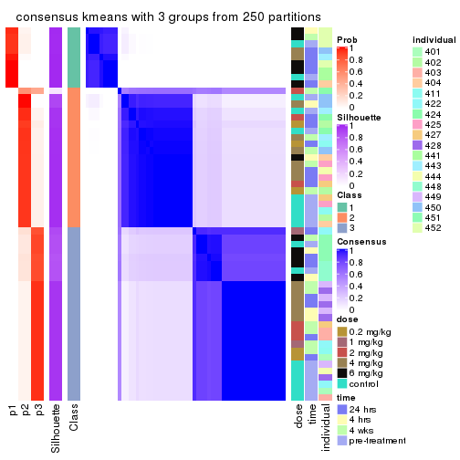</p>

</div>
<div id='tab-ATC-kmeans-consensus-heatmap-3'>
<pre><code class="r">consensus_heatmap(res, k = 4)
</code></pre>

<p>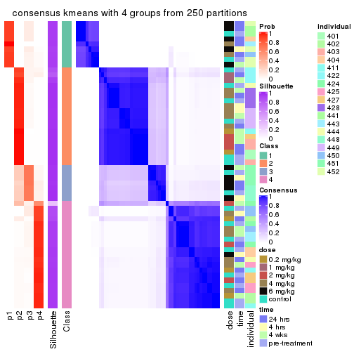</p>

</div>
<div id='tab-ATC-kmeans-consensus-heatmap-4'>
<pre><code class="r">consensus_heatmap(res, k = 5)
</code></pre>

<p>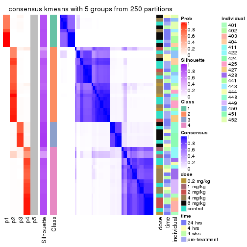</p>

</div>
<div id='tab-ATC-kmeans-consensus-heatmap-5'>
<pre><code class="r">consensus_heatmap(res, k = 6)
</code></pre>

<p>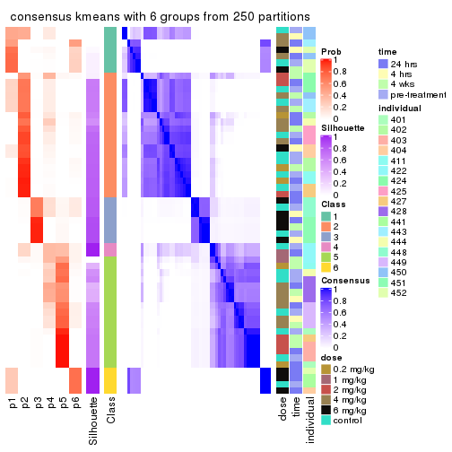</p>

</div>
</div>

Heatmaps for the membership of samples in all partitions to see how consistent they are:


<script>
$( function() {
	$( '#tabs-ATC-kmeans-membership-heatmap' ).tabs();
} );
</script>
<div id='tabs-ATC-kmeans-membership-heatmap'>
<ul>
<li><a href='#tab-ATC-kmeans-membership-heatmap-1'>k = 2</a></li>
<li><a href='#tab-ATC-kmeans-membership-heatmap-2'>k = 3</a></li>
<li><a href='#tab-ATC-kmeans-membership-heatmap-3'>k = 4</a></li>
<li><a href='#tab-ATC-kmeans-membership-heatmap-4'>k = 5</a></li>
<li><a href='#tab-ATC-kmeans-membership-heatmap-5'>k = 6</a></li>
</ul>
<div id='tab-ATC-kmeans-membership-heatmap-1'>
<pre><code class="r">membership_heatmap(res, k = 2)
</code></pre>

<p></p>

</div>
<div id='tab-ATC-kmeans-membership-heatmap-2'>
<pre><code class="r">membership_heatmap(res, k = 3)
</code></pre>

<p>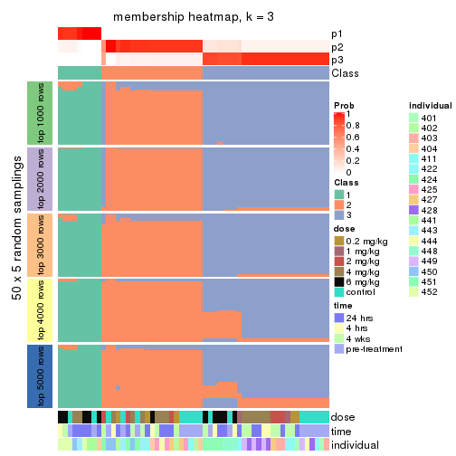</p>

</div>
<div id='tab-ATC-kmeans-membership-heatmap-3'>
<pre><code class="r">membership_heatmap(res, k = 4)
</code></pre>

<p>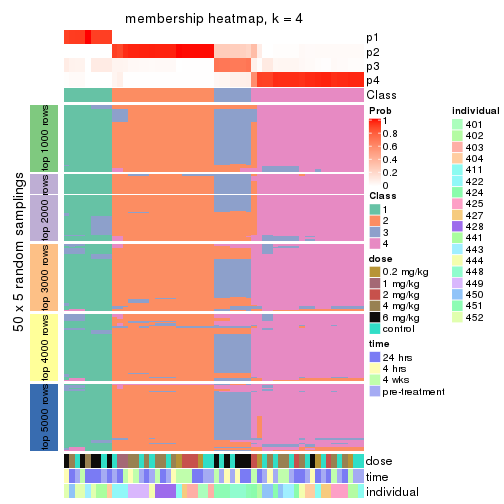</p>

</div>
<div id='tab-ATC-kmeans-membership-heatmap-4'>
<pre><code class="r">membership_heatmap(res, k = 5)
</code></pre>

<p>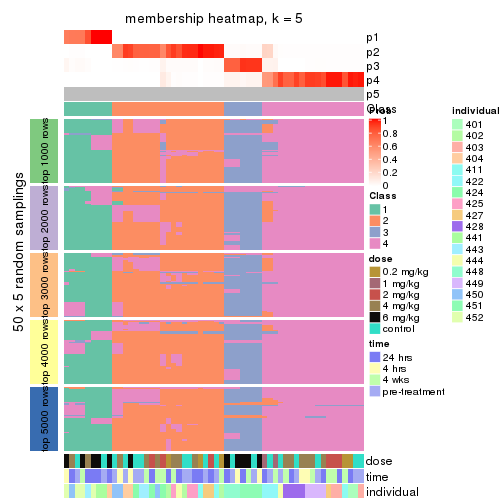</p>

</div>
<div id='tab-ATC-kmeans-membership-heatmap-5'>
<pre><code class="r">membership_heatmap(res, k = 6)
</code></pre>

<p>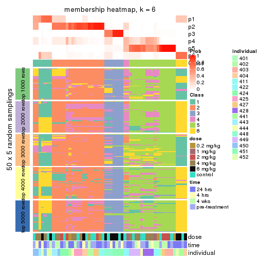</p>

</div>
</div>

As soon as we have had the classes for columns, we can look for signatures
which are significantly different between classes which can be candidate marks
for certain classes. Following are the heatmaps for signatures.


Signature heatmaps where rows are scaled:


<script>
$( function() {
	$( '#tabs-ATC-kmeans-get-signatures' ).tabs();
} );
</script>
<div id='tabs-ATC-kmeans-get-signatures'>
<ul>
<li><a href='#tab-ATC-kmeans-get-signatures-1'>k = 2</a></li>
<li><a href='#tab-ATC-kmeans-get-signatures-2'>k = 3</a></li>
<li><a href='#tab-ATC-kmeans-get-signatures-3'>k = 4</a></li>
<li><a href='#tab-ATC-kmeans-get-signatures-4'>k = 5</a></li>
<li><a href='#tab-ATC-kmeans-get-signatures-5'>k = 6</a></li>
</ul>
<div id='tab-ATC-kmeans-get-signatures-1'>
<pre><code class="r">get_signatures(res, k = 2)
</code></pre>

<p></p>

</div>
<div id='tab-ATC-kmeans-get-signatures-2'>
<pre><code class="r">get_signatures(res, k = 3)
</code></pre>

<p>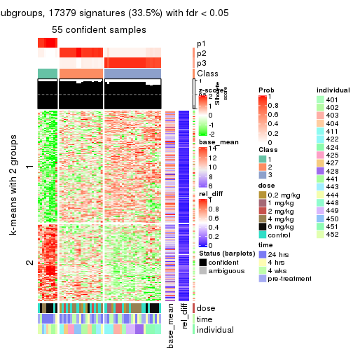</p>

</div>
<div id='tab-ATC-kmeans-get-signatures-3'>
<pre><code class="r">get_signatures(res, k = 4)
</code></pre>

<p>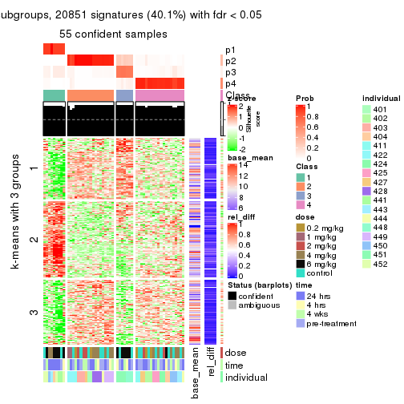</p>

</div>
<div id='tab-ATC-kmeans-get-signatures-4'>
<pre><code class="r">get_signatures(res, k = 5)
</code></pre>

<p>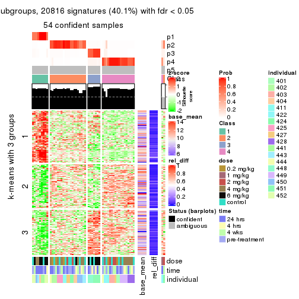</p>

</div>
<div id='tab-ATC-kmeans-get-signatures-5'>
<pre><code class="r">get_signatures(res, k = 6)
</code></pre>

<p>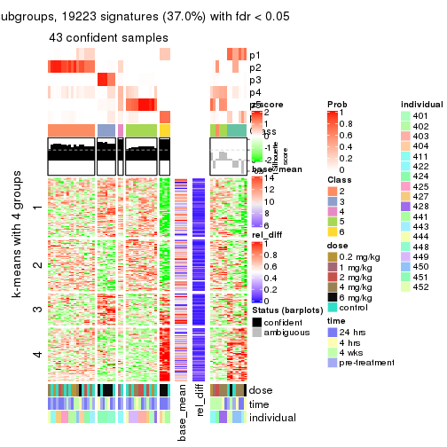</p>

</div>
</div>


Signature heatmaps where rows are not scaled:


<script>
$( function() {
	$( '#tabs-ATC-kmeans-get-signatures-no-scale' ).tabs();
} );
</script>
<div id='tabs-ATC-kmeans-get-signatures-no-scale'>
<ul>
<li><a href='#tab-ATC-kmeans-get-signatures-no-scale-1'>k = 2</a></li>
<li><a href='#tab-ATC-kmeans-get-signatures-no-scale-2'>k = 3</a></li>
<li><a href='#tab-ATC-kmeans-get-signatures-no-scale-3'>k = 4</a></li>
<li><a href='#tab-ATC-kmeans-get-signatures-no-scale-4'>k = 5</a></li>
<li><a href='#tab-ATC-kmeans-get-signatures-no-scale-5'>k = 6</a></li>
</ul>
<div id='tab-ATC-kmeans-get-signatures-no-scale-1'>
<pre><code class="r">get_signatures(res, k = 2, scale_rows = FALSE)
</code></pre>

<p></p>

</div>
<div id='tab-ATC-kmeans-get-signatures-no-scale-2'>
<pre><code class="r">get_signatures(res, k = 3, scale_rows = FALSE)
</code></pre>

<p>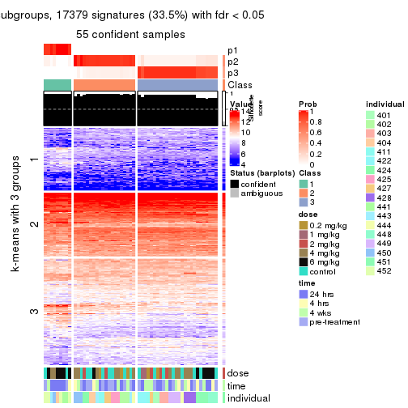</p>

</div>
<div id='tab-ATC-kmeans-get-signatures-no-scale-3'>
<pre><code class="r">get_signatures(res, k = 4, scale_rows = FALSE)
</code></pre>

<p>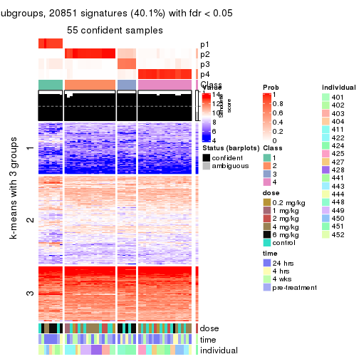</p>

</div>
<div id='tab-ATC-kmeans-get-signatures-no-scale-4'>
<pre><code class="r">get_signatures(res, k = 5, scale_rows = FALSE)
</code></pre>

<p>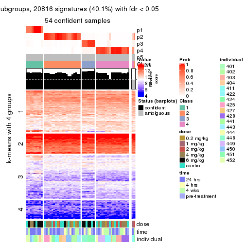</p>

</div>
<div id='tab-ATC-kmeans-get-signatures-no-scale-5'>
<pre><code class="r">get_signatures(res, k = 6, scale_rows = FALSE)
</code></pre>

<p>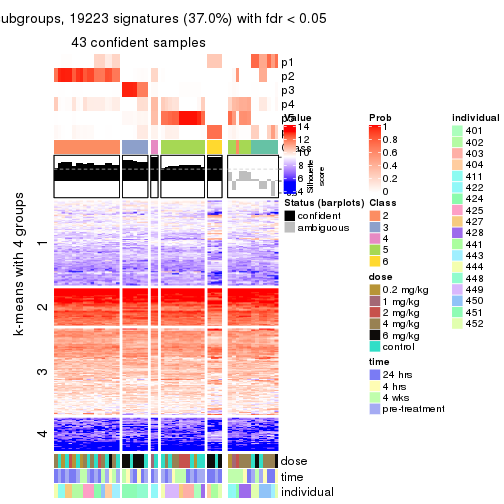</p>

</div>
</div>


Compare the overlap of signatures from different k:

```r
compare_signatures(res)
```

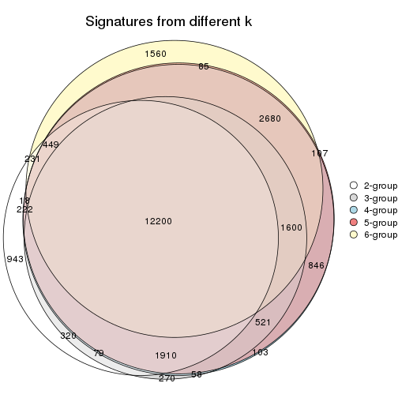

`get_signature()` returns a data frame invisibly. TO get the list of signatures, the function
call should be assigned to a variable explicitly. In following code, if `plot` argument is set
to `FALSE`, no heatmap is plotted while only the differential analysis is performed.

```r
# code only for demonstration
tb = get_signature(res, k = ..., plot = FALSE)
```

An example of the output of `tb` is:

```
#>   which_row         fdr    mean_1    mean_2 scaled_mean_1 scaled_mean_2 km
#> 1        38 0.042760348  8.373488  9.131774    -0.5533452     0.5164555  1
#> 2        40 0.018707592  7.106213  8.469186    -0.6173731     0.5762149  1
#> 3        55 0.019134737 10.221463 11.207825    -0.6159697     0.5749050  1
#> 4        59 0.006059896  5.921854  7.869574    -0.6899429     0.6439467  1
#> 5        60 0.018055526  8.928898 10.211722    -0.6204761     0.5791110  1
#> 6        98 0.009384629 15.714769 14.887706     0.6635654    -0.6193277  2
...
```

The columns in `tb` are:

1. `which_row`: row indices corresponding to the input matrix.
2. `fdr`: FDR for the differential test. 
3. `mean_x`: The mean value in group x.
4. `scaled_mean_x`: The mean value in group x after rows are scaled.
5. `km`: Row groups if k-means clustering is applied to rows.


UMAP plot which shows how samples are separated.


<script>
$( function() {
	$( '#tabs-ATC-kmeans-dimension-reduction' ).tabs();
} );
</script>
<div id='tabs-ATC-kmeans-dimension-reduction'>
<ul>
<li><a href='#tab-ATC-kmeans-dimension-reduction-1'>k = 2</a></li>
<li><a href='#tab-ATC-kmeans-dimension-reduction-2'>k = 3</a></li>
<li><a href='#tab-ATC-kmeans-dimension-reduction-3'>k = 4</a></li>
<li><a href='#tab-ATC-kmeans-dimension-reduction-4'>k = 5</a></li>
<li><a href='#tab-ATC-kmeans-dimension-reduction-5'>k = 6</a></li>
</ul>
<div id='tab-ATC-kmeans-dimension-reduction-1'>
<pre><code class="r">dimension_reduction(res, k = 2, method = &quot;UMAP&quot;)
</code></pre>

<p>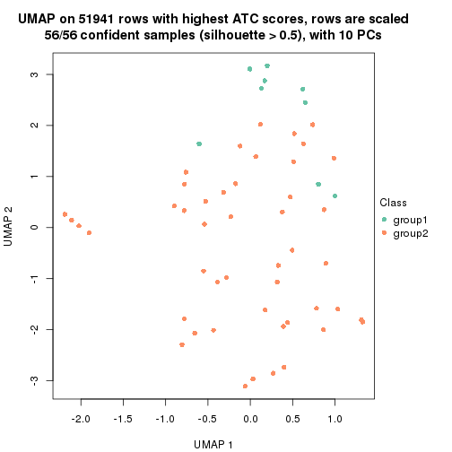</p>

</div>
<div id='tab-ATC-kmeans-dimension-reduction-2'>
<pre><code class="r">dimension_reduction(res, k = 3, method = &quot;UMAP&quot;)
</code></pre>

<p>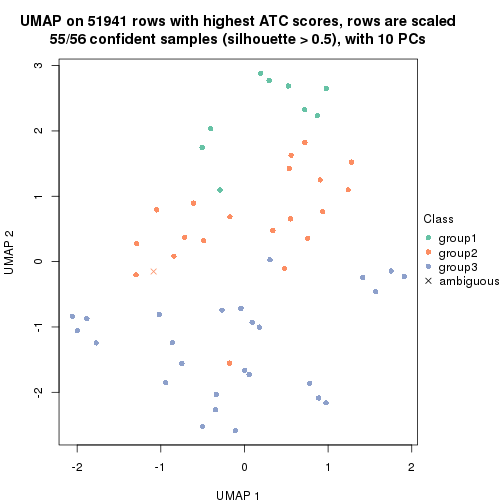</p>

</div>
<div id='tab-ATC-kmeans-dimension-reduction-3'>
<pre><code class="r">dimension_reduction(res, k = 4, method = &quot;UMAP&quot;)
</code></pre>

<p>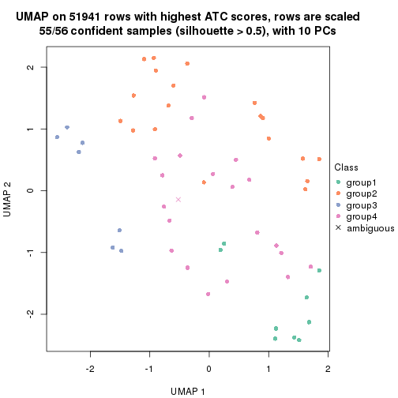</p>

</div>
<div id='tab-ATC-kmeans-dimension-reduction-4'>
<pre><code class="r">dimension_reduction(res, k = 5, method = &quot;UMAP&quot;)
</code></pre>

<p>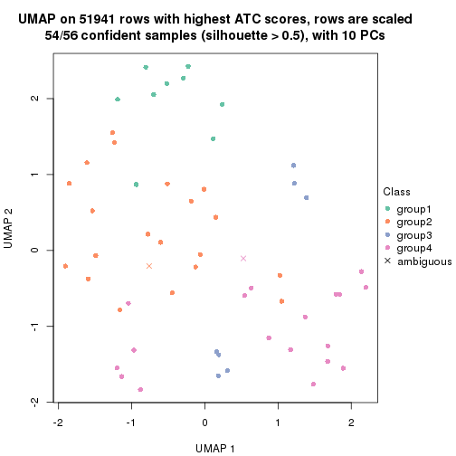</p>

</div>
<div id='tab-ATC-kmeans-dimension-reduction-5'>
<pre><code class="r">dimension_reduction(res, k = 6, method = &quot;UMAP&quot;)
</code></pre>

<p>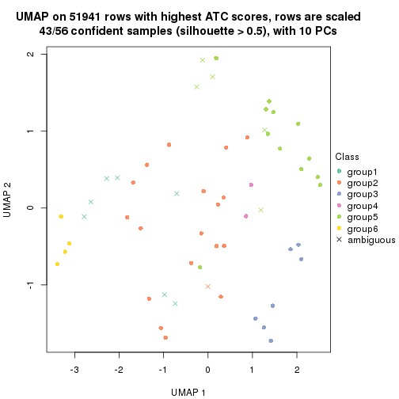</p>

</div>
</div>


Following heatmap shows how subgroups are split when increasing `k`:

```r
collect_classes(res)
```

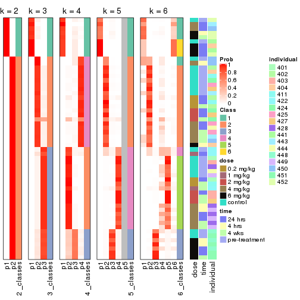


Test correlation between subgroups and known annotations. If the known
annotation is numeric, one-way ANOVA test is applied, and if the known
annotation is discrete, chi-squared contingency table test is applied.

```r
test_to_known_factors(res)
```

```
#>             n dose(p) time(p) individual(p) k
#> ATC:kmeans 56 0.07836   0.415      1.08e-03 2
#> ATC:kmeans 55 0.18511   0.744      6.29e-06 3
#> ATC:kmeans 55 0.00569   0.786      1.09e-09 4
#> ATC:kmeans 54 0.01104   0.731      2.65e-09 5
#> ATC:kmeans 43 0.00029   0.779      6.65e-09 6
```


If matrix rows can be associated to genes, consider to use `functional_enrichment(res,
...)` to perform function enrichment for the signature genes. See [this vignette](http://bioconductor.org/packages/devel/bioc/vignettes/cola/inst/doc/functional_enrichment.html) for more detailed explanations.


 

---------------------------------------------------


### ATC:skmeans**


The object with results only for a single top-value method and a single partition method 
can be extracted as:

```r
res = res_list["ATC", "skmeans"]
# you can also extract it by
# res = res_list["ATC:skmeans"]
```

A summary of `res` and all the functions that can be applied to it:

```r
res
```

```
#> A 'ConsensusPartition' object with k = 2, 3, 4, 5, 6.
#>   On a matrix with 51941 rows and 56 columns.
#>   Top rows (1000, 2000, 3000, 4000, 5000) are extracted by 'ATC' method.
#>   Subgroups are detected by 'skmeans' method.
#>   Performed in total 1250 partitions by row resampling.
#>   Best k for subgroups seems to be 2.
#> 
#> Following methods can be applied to this 'ConsensusPartition' object:
#>  [1] "cola_report"             "collect_classes"         "collect_plots"          
#>  [4] "collect_stats"           "colnames"                "compare_signatures"     
#>  [7] "consensus_heatmap"       "dimension_reduction"     "functional_enrichment"  
#> [10] "get_anno_col"            "get_anno"                "get_classes"            
#> [13] "get_consensus"           "get_matrix"              "get_membership"         
#> [16] "get_param"               "get_signatures"          "get_stats"              
#> [19] "is_best_k"               "is_stable_k"             "membership_heatmap"     
#> [22] "ncol"                    "nrow"                    "plot_ecdf"              
#> [25] "rownames"                "select_partition_number" "show"                   
#> [28] "suggest_best_k"          "test_to_known_factors"
```

`collect_plots()` function collects all the plots made from `res` for all `k` (number of partitions)
into one single page to provide an easy and fast comparison between different `k`.

```r
collect_plots(res)
```

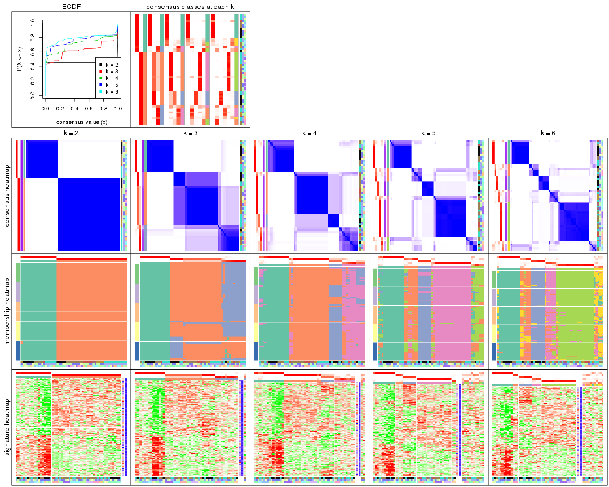

The plots are:

- The first row: a plot of the ECDF (empirical cumulative distribution
  function) curves of the consensus matrix for each `k` and the heatmap of
  predicted classes for each `k`.
- The second row: heatmaps of the consensus matrix for each `k`.
- The third row: heatmaps of the membership matrix for each `k`.
- The fouth row: heatmaps of the signatures for each `k`.

All the plots in panels can be made by individual functions and they are
plotted later in this section.

`select_partition_number()` produces several plots showing different
statistics for choosing "optimized" `k`. There are following statistics:

- ECDF curves of the consensus matrix for each `k`;
- 1-PAC. [The PAC
  score](https://en.wikipedia.org/wiki/Consensus_clustering#Over-interpretation_potential_of_consensus_clustering)
  measures the proportion of the ambiguous subgrouping.
- Mean silhouette score.
- Concordance. The mean probability of fiting the consensus class ids in all
  partitions.
- Area increased. Denote $A_k$ as the area under the ECDF curve for current
  `k`, the area increased is defined as $A_k - A_{k-1}$.
- Rand index. The percent of pairs of samples that are both in a same cluster
  or both are not in a same cluster in the partition of k and k-1.
- Jaccard index. The ratio of pairs of samples are both in a same cluster in
  the partition of k and k-1 and the pairs of samples are both in a same
  cluster in the partition k or k-1.

The detailed explanations of these statistics can be found in [the _cola_
vignette](http://bioconductor.org/packages/devel/bioc/vignettes/cola/inst/doc/cola.html#toc_13).

Generally speaking, lower PAC score, higher mean silhouette score or higher
concordance corresponds to better partition. Rand index and Jaccard index
measure how similar the current partition is compared to partition with `k-1`.
If they are too similar, we won't accept `k` is better than `k-1`.

```r
select_partition_number(res)
```

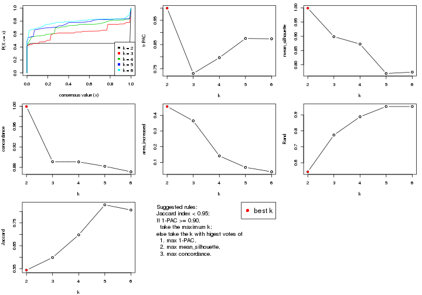

The numeric values for all these statistics can be obtained by `get_stats()`.

```r
get_stats(res)
```

```
#>   k 1-PAC mean_silhouette concordance area_increased  Rand Jaccard
#> 2 2 1.000           0.999       0.999         0.4567 0.544   0.544
#> 3 3 0.731           0.899       0.891         0.3651 0.774   0.599
#> 4 4 0.796           0.873       0.891         0.1413 0.888   0.698
#> 5 5 0.875           0.769       0.882         0.0681 0.953   0.829
#> 6 6 0.874           0.774       0.871         0.0398 0.953   0.806
```

`suggest_best_k()` suggests the best $k$ based on these statistics. The rules are as follows:

- All $k$ with Jaccard index larger than 0.95 are removed because increasing
  $k$ does not provide enough extra information. If all $k$ are removed, it is
  marked as no subgroup is detected.
- For all $k$ with 1-PAC score larger than 0.9, the maximal $k$ is taken as
  the best $k$, and other $k$ are marked as optional $k$.
- If it does not fit the second rule. The $k$ with the maximal vote of the
  highest 1-PAC score, highest mean silhouette, and highest concordance is
  taken as the best $k$.

```r
suggest_best_k(res)
```

```
#> [1] 2
```


Following shows the table of the partitions (You need to click the **show/hide
code output** link to see it). The membership matrix (columns with name `p*`)
is inferred by
[`clue::cl_consensus()`](https://www.rdocumentation.org/link/cl_consensus?package=clue)
function with the `SE` method. Basically the value in the membership matrix
represents the probability to belong to a certain group. The finall class
label for an item is determined with the group with highest probability it
belongs to.

In `get_classes()` function, the entropy is calculated from the membership
matrix and the silhouette score is calculated from the consensus matrix.


<script>
$( function() {
	$( '#tabs-ATC-skmeans-get-classes' ).tabs();
} );
</script>
<div id='tabs-ATC-skmeans-get-classes'>
<ul>
<li><a href='#tab-ATC-skmeans-get-classes-1'>k = 2</a></li>
<li><a href='#tab-ATC-skmeans-get-classes-2'>k = 3</a></li>
<li><a href='#tab-ATC-skmeans-get-classes-3'>k = 4</a></li>
<li><a href='#tab-ATC-skmeans-get-classes-4'>k = 5</a></li>
<li><a href='#tab-ATC-skmeans-get-classes-5'>k = 6</a></li>
</ul>

<div id='tab-ATC-skmeans-get-classes-1'>
<p><a id='tab-ATC-skmeans-get-classes-1-a' style='color:#0366d6' href='#'>show/hide code output</a></p>
<pre><code class="r">cbind(get_classes(res, k = 2), get_membership(res, k = 2))
</code></pre>

<pre><code>#&gt;           class entropy silhouette    p1    p2
#&gt; GSM687644     2  0.0000      1.000 0.000 1.000
#&gt; GSM687648     2  0.0000      1.000 0.000 1.000
#&gt; GSM687653     2  0.0000      1.000 0.000 1.000
#&gt; GSM687658     1  0.0000      0.998 1.000 0.000
#&gt; GSM687663     2  0.0000      1.000 0.000 1.000
#&gt; GSM687668     2  0.0000      1.000 0.000 1.000
#&gt; GSM687673     1  0.0000      0.998 1.000 0.000
#&gt; GSM687678     2  0.0000      1.000 0.000 1.000
#&gt; GSM687683     2  0.0000      1.000 0.000 1.000
#&gt; GSM687688     2  0.0000      1.000 0.000 1.000
#&gt; GSM687695     1  0.0000      0.998 1.000 0.000
#&gt; GSM687699     1  0.0000      0.998 1.000 0.000
#&gt; GSM687704     2  0.0000      1.000 0.000 1.000
#&gt; GSM687707     2  0.0000      1.000 0.000 1.000
#&gt; GSM687712     2  0.0000      1.000 0.000 1.000
#&gt; GSM687719     1  0.0000      0.998 1.000 0.000
#&gt; GSM687724     2  0.0000      1.000 0.000 1.000
#&gt; GSM687728     1  0.0000      0.998 1.000 0.000
#&gt; GSM687646     2  0.0000      1.000 0.000 1.000
#&gt; GSM687649     2  0.0000      1.000 0.000 1.000
#&gt; GSM687665     1  0.1843      0.971 0.972 0.028
#&gt; GSM687651     2  0.0000      1.000 0.000 1.000
#&gt; GSM687667     2  0.0000      1.000 0.000 1.000
#&gt; GSM687670     2  0.0000      1.000 0.000 1.000
#&gt; GSM687671     2  0.0000      1.000 0.000 1.000
#&gt; GSM687654     2  0.0000      1.000 0.000 1.000
#&gt; GSM687675     1  0.0000      0.998 1.000 0.000
#&gt; GSM687685     2  0.0000      1.000 0.000 1.000
#&gt; GSM687656     2  0.0000      1.000 0.000 1.000
#&gt; GSM687677     2  0.0000      1.000 0.000 1.000
#&gt; GSM687687     2  0.0000      1.000 0.000 1.000
#&gt; GSM687692     2  0.0000      1.000 0.000 1.000
#&gt; GSM687716     2  0.0000      1.000 0.000 1.000
#&gt; GSM687722     1  0.0000      0.998 1.000 0.000
#&gt; GSM687680     2  0.0000      1.000 0.000 1.000
#&gt; GSM687690     2  0.0000      1.000 0.000 1.000
#&gt; GSM687700     1  0.0000      0.998 1.000 0.000
#&gt; GSM687705     2  0.0000      1.000 0.000 1.000
#&gt; GSM687714     2  0.0000      1.000 0.000 1.000
#&gt; GSM687721     1  0.0000      0.998 1.000 0.000
#&gt; GSM687682     2  0.0000      1.000 0.000 1.000
#&gt; GSM687694     2  0.0000      1.000 0.000 1.000
#&gt; GSM687702     1  0.0000      0.998 1.000 0.000
#&gt; GSM687718     2  0.0000      1.000 0.000 1.000
#&gt; GSM687723     1  0.0000      0.998 1.000 0.000
#&gt; GSM687661     1  0.0376      0.995 0.996 0.004
#&gt; GSM687710     2  0.0000      1.000 0.000 1.000
#&gt; GSM687726     2  0.0000      1.000 0.000 1.000
#&gt; GSM687730     1  0.0000      0.998 1.000 0.000
#&gt; GSM687660     1  0.0000      0.998 1.000 0.000
#&gt; GSM687697     1  0.0000      0.998 1.000 0.000
#&gt; GSM687709     2  0.0000      1.000 0.000 1.000
#&gt; GSM687725     2  0.0000      1.000 0.000 1.000
#&gt; GSM687729     1  0.0000      0.998 1.000 0.000
#&gt; GSM687727     2  0.0000      1.000 0.000 1.000
#&gt; GSM687731     1  0.0000      0.998 1.000 0.000
</code></pre>

<script>
$('#tab-ATC-skmeans-get-classes-1-a').parent().next().next().hide();
$('#tab-ATC-skmeans-get-classes-1-a').click(function(){
  $('#tab-ATC-skmeans-get-classes-1-a').parent().next().next().toggle();
  return(false);
});
</script>
</div>

<div id='tab-ATC-skmeans-get-classes-2'>
<p><a id='tab-ATC-skmeans-get-classes-2-a' style='color:#0366d6' href='#'>show/hide code output</a></p>
<pre><code class="r">cbind(get_classes(res, k = 3), get_membership(res, k = 3))
</code></pre>

<pre><code>#&gt;           class entropy silhouette    p1    p2    p3
#&gt; GSM687644     2  0.4887      0.913 0.000 0.772 0.228
#&gt; GSM687648     3  0.0000      0.913 0.000 0.000 1.000
#&gt; GSM687653     2  0.4887      0.913 0.000 0.772 0.228
#&gt; GSM687658     3  0.1643      0.884 0.044 0.000 0.956
#&gt; GSM687663     3  0.0000      0.913 0.000 0.000 1.000
#&gt; GSM687668     2  0.4887      0.913 0.000 0.772 0.228
#&gt; GSM687673     1  0.0000      0.999 1.000 0.000 0.000
#&gt; GSM687678     3  0.0000      0.913 0.000 0.000 1.000
#&gt; GSM687683     3  0.4931      0.571 0.000 0.232 0.768
#&gt; GSM687688     2  0.4887      0.913 0.000 0.772 0.228
#&gt; GSM687695     1  0.0000      0.999 1.000 0.000 0.000
#&gt; GSM687699     1  0.0237      0.996 0.996 0.000 0.004
#&gt; GSM687704     2  0.4887      0.913 0.000 0.772 0.228
#&gt; GSM687707     2  0.0000      0.766 0.000 1.000 0.000
#&gt; GSM687712     2  0.4887      0.913 0.000 0.772 0.228
#&gt; GSM687719     1  0.0000      0.999 1.000 0.000 0.000
#&gt; GSM687724     2  0.0000      0.766 0.000 1.000 0.000
#&gt; GSM687728     1  0.0000      0.999 1.000 0.000 0.000
#&gt; GSM687646     2  0.4887      0.913 0.000 0.772 0.228
#&gt; GSM687649     3  0.0747      0.903 0.000 0.016 0.984
#&gt; GSM687665     3  0.1964      0.873 0.056 0.000 0.944
#&gt; GSM687651     3  0.0000      0.913 0.000 0.000 1.000
#&gt; GSM687667     2  0.4887      0.913 0.000 0.772 0.228
#&gt; GSM687670     2  0.4887      0.913 0.000 0.772 0.228
#&gt; GSM687671     2  0.4887      0.913 0.000 0.772 0.228
#&gt; GSM687654     2  0.4887      0.913 0.000 0.772 0.228
#&gt; GSM687675     1  0.0000      0.999 1.000 0.000 0.000
#&gt; GSM687685     3  0.0237      0.911 0.000 0.004 0.996
#&gt; GSM687656     2  0.4887      0.913 0.000 0.772 0.228
#&gt; GSM687677     2  0.5431      0.846 0.000 0.716 0.284
#&gt; GSM687687     2  0.4887      0.913 0.000 0.772 0.228
#&gt; GSM687692     2  0.4887      0.913 0.000 0.772 0.228
#&gt; GSM687716     2  0.4887      0.913 0.000 0.772 0.228
#&gt; GSM687722     1  0.0000      0.999 1.000 0.000 0.000
#&gt; GSM687680     3  0.0000      0.913 0.000 0.000 1.000
#&gt; GSM687690     2  0.4887      0.913 0.000 0.772 0.228
#&gt; GSM687700     1  0.0000      0.999 1.000 0.000 0.000
#&gt; GSM687705     3  0.5560      0.380 0.000 0.300 0.700
#&gt; GSM687714     2  0.4887      0.913 0.000 0.772 0.228
#&gt; GSM687721     1  0.0000      0.999 1.000 0.000 0.000
#&gt; GSM687682     3  0.0000      0.913 0.000 0.000 1.000
#&gt; GSM687694     2  0.4887      0.913 0.000 0.772 0.228
#&gt; GSM687702     1  0.0237      0.996 0.996 0.000 0.004
#&gt; GSM687718     2  0.4887      0.913 0.000 0.772 0.228
#&gt; GSM687723     1  0.0237      0.996 0.996 0.000 0.004
#&gt; GSM687661     3  0.3425      0.800 0.112 0.004 0.884
#&gt; GSM687710     2  0.0000      0.766 0.000 1.000 0.000
#&gt; GSM687726     2  0.0000      0.766 0.000 1.000 0.000
#&gt; GSM687730     1  0.0000      0.999 1.000 0.000 0.000
#&gt; GSM687660     1  0.0000      0.999 1.000 0.000 0.000
#&gt; GSM687697     1  0.0000      0.999 1.000 0.000 0.000
#&gt; GSM687709     2  0.0000      0.766 0.000 1.000 0.000
#&gt; GSM687725     2  0.0000      0.766 0.000 1.000 0.000
#&gt; GSM687729     1  0.0000      0.999 1.000 0.000 0.000
#&gt; GSM687727     2  0.0000      0.766 0.000 1.000 0.000
#&gt; GSM687731     1  0.0000      0.999 1.000 0.000 0.000
</code></pre>

<script>
$('#tab-ATC-skmeans-get-classes-2-a').parent().next().next().hide();
$('#tab-ATC-skmeans-get-classes-2-a').click(function(){
  $('#tab-ATC-skmeans-get-classes-2-a').parent().next().next().toggle();
  return(false);
});
</script>
</div>

<div id='tab-ATC-skmeans-get-classes-3'>
<p><a id='tab-ATC-skmeans-get-classes-3-a' style='color:#0366d6' href='#'>show/hide code output</a></p>
<pre><code class="r">cbind(get_classes(res, k = 4), get_membership(res, k = 4))
</code></pre>

<pre><code>#&gt;           class entropy silhouette    p1    p2    p3    p4
#&gt; GSM687644     2  0.0000      0.948 0.000 1.000 0.000 0.000
#&gt; GSM687648     4  0.4936      0.527 0.000 0.316 0.012 0.672
#&gt; GSM687653     2  0.0000      0.948 0.000 1.000 0.000 0.000
#&gt; GSM687658     4  0.4103      0.783 0.000 0.000 0.256 0.744
#&gt; GSM687663     4  0.0779      0.789 0.000 0.016 0.004 0.980
#&gt; GSM687668     2  0.0000      0.948 0.000 1.000 0.000 0.000
#&gt; GSM687673     1  0.1677      0.926 0.948 0.000 0.012 0.040
#&gt; GSM687678     4  0.4472      0.793 0.000 0.020 0.220 0.760
#&gt; GSM687683     4  0.5185      0.688 0.000 0.176 0.076 0.748
#&gt; GSM687688     2  0.0000      0.948 0.000 1.000 0.000 0.000
#&gt; GSM687695     1  0.0000      0.954 1.000 0.000 0.000 0.000
#&gt; GSM687699     1  0.4508      0.778 0.780 0.000 0.036 0.184
#&gt; GSM687704     2  0.0000      0.948 0.000 1.000 0.000 0.000
#&gt; GSM687707     3  0.4193      0.996 0.000 0.268 0.732 0.000
#&gt; GSM687712     2  0.0000      0.948 0.000 1.000 0.000 0.000
#&gt; GSM687719     1  0.0000      0.954 1.000 0.000 0.000 0.000
#&gt; GSM687724     3  0.4222      0.997 0.000 0.272 0.728 0.000
#&gt; GSM687728     1  0.0000      0.954 1.000 0.000 0.000 0.000
#&gt; GSM687646     2  0.0000      0.948 0.000 1.000 0.000 0.000
#&gt; GSM687649     4  0.5217      0.418 0.000 0.380 0.012 0.608
#&gt; GSM687665     4  0.0524      0.787 0.000 0.004 0.008 0.988
#&gt; GSM687651     4  0.1767      0.782 0.000 0.044 0.012 0.944
#&gt; GSM687667     2  0.0000      0.948 0.000 1.000 0.000 0.000
#&gt; GSM687670     2  0.0000      0.948 0.000 1.000 0.000 0.000
#&gt; GSM687671     2  0.0000      0.948 0.000 1.000 0.000 0.000
#&gt; GSM687654     2  0.0000      0.948 0.000 1.000 0.000 0.000
#&gt; GSM687675     1  0.0672      0.947 0.984 0.000 0.008 0.008
#&gt; GSM687685     4  0.2797      0.794 0.000 0.032 0.068 0.900
#&gt; GSM687656     2  0.0000      0.948 0.000 1.000 0.000 0.000
#&gt; GSM687677     2  0.4088      0.581 0.000 0.764 0.004 0.232
#&gt; GSM687687     2  0.0000      0.948 0.000 1.000 0.000 0.000
#&gt; GSM687692     2  0.0000      0.948 0.000 1.000 0.000 0.000
#&gt; GSM687716     2  0.0000      0.948 0.000 1.000 0.000 0.000
#&gt; GSM687722     1  0.0000      0.954 1.000 0.000 0.000 0.000
#&gt; GSM687680     4  0.4671      0.793 0.000 0.028 0.220 0.752
#&gt; GSM687690     2  0.0000      0.948 0.000 1.000 0.000 0.000
#&gt; GSM687700     1  0.0000      0.954 1.000 0.000 0.000 0.000
#&gt; GSM687705     2  0.7156     -0.074 0.000 0.492 0.140 0.368
#&gt; GSM687714     2  0.0000      0.948 0.000 1.000 0.000 0.000
#&gt; GSM687721     1  0.0000      0.954 1.000 0.000 0.000 0.000
#&gt; GSM687682     4  0.4671      0.793 0.000 0.028 0.220 0.752
#&gt; GSM687694     2  0.0000      0.948 0.000 1.000 0.000 0.000
#&gt; GSM687702     1  0.5429      0.710 0.720 0.000 0.072 0.208
#&gt; GSM687718     2  0.0000      0.948 0.000 1.000 0.000 0.000
#&gt; GSM687723     1  0.4356      0.807 0.804 0.000 0.148 0.048
#&gt; GSM687661     4  0.5713      0.777 0.020 0.032 0.256 0.692
#&gt; GSM687710     3  0.4193      0.996 0.000 0.268 0.732 0.000
#&gt; GSM687726     3  0.4222      0.997 0.000 0.272 0.728 0.000
#&gt; GSM687730     1  0.0000      0.954 1.000 0.000 0.000 0.000
#&gt; GSM687660     1  0.0000      0.954 1.000 0.000 0.000 0.000
#&gt; GSM687697     1  0.0000      0.954 1.000 0.000 0.000 0.000
#&gt; GSM687709     3  0.4193      0.996 0.000 0.268 0.732 0.000
#&gt; GSM687725     3  0.4222      0.997 0.000 0.272 0.728 0.000
#&gt; GSM687729     1  0.0000      0.954 1.000 0.000 0.000 0.000
#&gt; GSM687727     3  0.4222      0.997 0.000 0.272 0.728 0.000
#&gt; GSM687731     1  0.0000      0.954 1.000 0.000 0.000 0.000
</code></pre>

<script>
$('#tab-ATC-skmeans-get-classes-3-a').parent().next().next().hide();
$('#tab-ATC-skmeans-get-classes-3-a').click(function(){
  $('#tab-ATC-skmeans-get-classes-3-a').parent().next().next().toggle();
  return(false);
});
</script>
</div>

<div id='tab-ATC-skmeans-get-classes-4'>
<p><a id='tab-ATC-skmeans-get-classes-4-a' style='color:#0366d6' href='#'>show/hide code output</a></p>
<pre><code class="r">cbind(get_classes(res, k = 5), get_membership(res, k = 5))
</code></pre>

<pre><code>#&gt;           class entropy silhouette    p1    p2    p3    p4    p5
#&gt; GSM687644     4  0.0000    0.94076 0.000 0.000 0.000 1.000 0.000
#&gt; GSM687648     2  0.5218    0.45245 0.000 0.632 0.000 0.296 0.072
#&gt; GSM687653     4  0.0000    0.94076 0.000 0.000 0.000 1.000 0.000
#&gt; GSM687658     5  0.1270    0.53202 0.000 0.052 0.000 0.000 0.948
#&gt; GSM687663     2  0.0609    0.62871 0.000 0.980 0.000 0.000 0.020
#&gt; GSM687668     4  0.0162    0.93884 0.000 0.004 0.000 0.996 0.000
#&gt; GSM687673     1  0.6304    0.48709 0.624 0.188 0.036 0.000 0.152
#&gt; GSM687678     5  0.4404    0.47813 0.000 0.292 0.024 0.000 0.684
#&gt; GSM687683     2  0.5686    0.48843 0.000 0.704 0.076 0.072 0.148
#&gt; GSM687688     4  0.0324    0.93811 0.000 0.004 0.004 0.992 0.000
#&gt; GSM687695     1  0.0000    0.91936 1.000 0.000 0.000 0.000 0.000
#&gt; GSM687699     1  0.6479    0.31913 0.568 0.132 0.028 0.000 0.272
#&gt; GSM687704     4  0.0290    0.93780 0.000 0.008 0.000 0.992 0.000
#&gt; GSM687707     3  0.1830    0.99562 0.000 0.000 0.924 0.068 0.008
#&gt; GSM687712     4  0.0000    0.94076 0.000 0.000 0.000 1.000 0.000
#&gt; GSM687719     1  0.0000    0.91936 1.000 0.000 0.000 0.000 0.000
#&gt; GSM687724     3  0.1544    0.99672 0.000 0.000 0.932 0.068 0.000
#&gt; GSM687728     1  0.0000    0.91936 1.000 0.000 0.000 0.000 0.000
#&gt; GSM687646     4  0.0000    0.94076 0.000 0.000 0.000 1.000 0.000
#&gt; GSM687649     2  0.5143    0.39861 0.000 0.584 0.000 0.368 0.048
#&gt; GSM687665     2  0.0703    0.63080 0.000 0.976 0.000 0.000 0.024
#&gt; GSM687651     2  0.1638    0.61731 0.000 0.932 0.000 0.004 0.064
#&gt; GSM687667     4  0.0000    0.94076 0.000 0.000 0.000 1.000 0.000
#&gt; GSM687670     4  0.0162    0.93884 0.000 0.004 0.000 0.996 0.000
#&gt; GSM687671     4  0.0162    0.93884 0.000 0.004 0.000 0.996 0.000
#&gt; GSM687654     4  0.0000    0.94076 0.000 0.000 0.000 1.000 0.000
#&gt; GSM687675     1  0.3402    0.76808 0.832 0.012 0.016 0.000 0.140
#&gt; GSM687685     2  0.4248    0.51651 0.000 0.780 0.056 0.008 0.156
#&gt; GSM687656     4  0.0000    0.94076 0.000 0.000 0.000 1.000 0.000
#&gt; GSM687677     4  0.4854    0.34599 0.000 0.340 0.004 0.628 0.028
#&gt; GSM687687     4  0.0000    0.94076 0.000 0.000 0.000 1.000 0.000
#&gt; GSM687692     4  0.0324    0.93811 0.000 0.004 0.004 0.992 0.000
#&gt; GSM687716     4  0.0162    0.93970 0.000 0.004 0.000 0.996 0.000
#&gt; GSM687722     1  0.0000    0.91936 1.000 0.000 0.000 0.000 0.000
#&gt; GSM687680     5  0.4404    0.47813 0.000 0.292 0.024 0.000 0.684
#&gt; GSM687690     4  0.0324    0.93811 0.000 0.004 0.004 0.992 0.000
#&gt; GSM687700     1  0.0000    0.91936 1.000 0.000 0.000 0.000 0.000
#&gt; GSM687705     4  0.7239   -0.22722 0.000 0.292 0.020 0.392 0.296
#&gt; GSM687714     4  0.0000    0.94076 0.000 0.000 0.000 1.000 0.000
#&gt; GSM687721     1  0.0000    0.91936 1.000 0.000 0.000 0.000 0.000
#&gt; GSM687682     5  0.4404    0.47813 0.000 0.292 0.024 0.000 0.684
#&gt; GSM687694     4  0.0324    0.93811 0.000 0.004 0.004 0.992 0.000
#&gt; GSM687702     5  0.7373    0.00452 0.380 0.188 0.044 0.000 0.388
#&gt; GSM687718     4  0.0162    0.93970 0.000 0.004 0.000 0.996 0.000
#&gt; GSM687723     5  0.5656    0.22466 0.348 0.028 0.040 0.000 0.584
#&gt; GSM687661     5  0.1282    0.52954 0.000 0.044 0.000 0.004 0.952
#&gt; GSM687710     3  0.1830    0.99562 0.000 0.000 0.924 0.068 0.008
#&gt; GSM687726     3  0.1544    0.99672 0.000 0.000 0.932 0.068 0.000
#&gt; GSM687730     1  0.0000    0.91936 1.000 0.000 0.000 0.000 0.000
#&gt; GSM687660     1  0.0000    0.91936 1.000 0.000 0.000 0.000 0.000
#&gt; GSM687697     1  0.0000    0.91936 1.000 0.000 0.000 0.000 0.000
#&gt; GSM687709     3  0.1830    0.99562 0.000 0.000 0.924 0.068 0.008
#&gt; GSM687725     3  0.1544    0.99672 0.000 0.000 0.932 0.068 0.000
#&gt; GSM687729     1  0.0000    0.91936 1.000 0.000 0.000 0.000 0.000
#&gt; GSM687727     3  0.1544    0.99672 0.000 0.000 0.932 0.068 0.000
#&gt; GSM687731     1  0.0000    0.91936 1.000 0.000 0.000 0.000 0.000
</code></pre>

<script>
$('#tab-ATC-skmeans-get-classes-4-a').parent().next().next().hide();
$('#tab-ATC-skmeans-get-classes-4-a').click(function(){
  $('#tab-ATC-skmeans-get-classes-4-a').parent().next().next().toggle();
  return(false);
});
</script>
</div>

<div id='tab-ATC-skmeans-get-classes-5'>
<p><a id='tab-ATC-skmeans-get-classes-5-a' style='color:#0366d6' href='#'>show/hide code output</a></p>
<pre><code class="r">cbind(get_classes(res, k = 6), get_membership(res, k = 6))
</code></pre>

<pre><code>#&gt;           class entropy silhouette    p1    p2    p3    p4    p5    p6
#&gt; GSM687644     5  0.0146     0.9629 0.000 0.000 0.000 0.004 0.996 0.000
#&gt; GSM687648     4  0.3791     0.6221 0.000 0.028 0.000 0.800 0.128 0.044
#&gt; GSM687653     5  0.0000     0.9633 0.000 0.000 0.000 0.000 1.000 0.000
#&gt; GSM687658     2  0.4888     0.3870 0.000 0.560 0.004 0.056 0.000 0.380
#&gt; GSM687663     4  0.2365     0.6553 0.000 0.072 0.000 0.888 0.000 0.040
#&gt; GSM687668     5  0.1116     0.9431 0.000 0.004 0.000 0.028 0.960 0.008
#&gt; GSM687673     6  0.5876     0.4466 0.284 0.016 0.004 0.144 0.000 0.552
#&gt; GSM687678     2  0.1141     0.6669 0.000 0.948 0.000 0.052 0.000 0.000
#&gt; GSM687683     6  0.7033    -0.2199 0.000 0.232 0.036 0.352 0.016 0.364
#&gt; GSM687688     5  0.0622     0.9592 0.000 0.008 0.000 0.000 0.980 0.012
#&gt; GSM687695     1  0.0000     0.9425 1.000 0.000 0.000 0.000 0.000 0.000
#&gt; GSM687699     6  0.5209     0.4595 0.356 0.020 0.004 0.048 0.000 0.572
#&gt; GSM687704     5  0.1092     0.9463 0.000 0.020 0.000 0.000 0.960 0.020
#&gt; GSM687707     3  0.1994     0.9609 0.000 0.004 0.920 0.008 0.016 0.052
#&gt; GSM687712     5  0.0405     0.9625 0.000 0.000 0.000 0.004 0.988 0.008
#&gt; GSM687719     1  0.0260     0.9363 0.992 0.000 0.000 0.000 0.000 0.008
#&gt; GSM687724     3  0.0363     0.9709 0.000 0.000 0.988 0.000 0.012 0.000
#&gt; GSM687728     1  0.0000     0.9425 1.000 0.000 0.000 0.000 0.000 0.000
#&gt; GSM687646     5  0.0000     0.9633 0.000 0.000 0.000 0.000 1.000 0.000
#&gt; GSM687649     4  0.3989     0.5792 0.000 0.024 0.000 0.768 0.172 0.036
#&gt; GSM687665     4  0.2488     0.6414 0.000 0.044 0.000 0.880 0.000 0.076
#&gt; GSM687651     4  0.2197     0.6570 0.000 0.056 0.000 0.900 0.000 0.044
#&gt; GSM687667     5  0.0260     0.9611 0.000 0.000 0.000 0.008 0.992 0.000
#&gt; GSM687670     5  0.1116     0.9431 0.000 0.004 0.000 0.028 0.960 0.008
#&gt; GSM687671     5  0.1116     0.9431 0.000 0.004 0.000 0.028 0.960 0.008
#&gt; GSM687654     5  0.0000     0.9633 0.000 0.000 0.000 0.000 1.000 0.000
#&gt; GSM687675     1  0.5147    -0.1692 0.516 0.016 0.004 0.040 0.000 0.424
#&gt; GSM687685     4  0.6275    -0.0338 0.000 0.264 0.008 0.388 0.000 0.340
#&gt; GSM687656     5  0.0000     0.9633 0.000 0.000 0.000 0.000 1.000 0.000
#&gt; GSM687677     5  0.6338     0.3596 0.000 0.164 0.000 0.148 0.580 0.108
#&gt; GSM687687     5  0.0000     0.9633 0.000 0.000 0.000 0.000 1.000 0.000
#&gt; GSM687692     5  0.0405     0.9616 0.000 0.008 0.000 0.000 0.988 0.004
#&gt; GSM687716     5  0.0551     0.9617 0.000 0.004 0.000 0.004 0.984 0.008
#&gt; GSM687722     1  0.0260     0.9363 0.992 0.000 0.000 0.000 0.000 0.008
#&gt; GSM687680     2  0.1141     0.6669 0.000 0.948 0.000 0.052 0.000 0.000
#&gt; GSM687690     5  0.0291     0.9634 0.000 0.004 0.000 0.004 0.992 0.000
#&gt; GSM687700     1  0.0000     0.9425 1.000 0.000 0.000 0.000 0.000 0.000
#&gt; GSM687705     2  0.5847     0.3076 0.000 0.612 0.008 0.100 0.236 0.044
#&gt; GSM687714     5  0.0405     0.9625 0.000 0.000 0.000 0.004 0.988 0.008
#&gt; GSM687721     1  0.0000     0.9425 1.000 0.000 0.000 0.000 0.000 0.000
#&gt; GSM687682     2  0.1141     0.6669 0.000 0.948 0.000 0.052 0.000 0.000
#&gt; GSM687694     5  0.0520     0.9607 0.000 0.008 0.000 0.000 0.984 0.008
#&gt; GSM687702     6  0.4426     0.5176 0.156 0.032 0.000 0.064 0.000 0.748
#&gt; GSM687718     5  0.0551     0.9617 0.000 0.004 0.000 0.004 0.984 0.008
#&gt; GSM687723     6  0.4777     0.4466 0.168 0.096 0.000 0.024 0.000 0.712
#&gt; GSM687661     2  0.4920     0.3660 0.000 0.544 0.004 0.056 0.000 0.396
#&gt; GSM687710     3  0.1994     0.9609 0.000 0.004 0.920 0.008 0.016 0.052
#&gt; GSM687726     3  0.0363     0.9709 0.000 0.000 0.988 0.000 0.012 0.000
#&gt; GSM687730     1  0.0000     0.9425 1.000 0.000 0.000 0.000 0.000 0.000
#&gt; GSM687660     1  0.0000     0.9425 1.000 0.000 0.000 0.000 0.000 0.000
#&gt; GSM687697     1  0.0000     0.9425 1.000 0.000 0.000 0.000 0.000 0.000
#&gt; GSM687709     3  0.1994     0.9609 0.000 0.004 0.920 0.008 0.016 0.052
#&gt; GSM687725     3  0.0363     0.9709 0.000 0.000 0.988 0.000 0.012 0.000
#&gt; GSM687729     1  0.0000     0.9425 1.000 0.000 0.000 0.000 0.000 0.000
#&gt; GSM687727     3  0.0363     0.9709 0.000 0.000 0.988 0.000 0.012 0.000
#&gt; GSM687731     1  0.0000     0.9425 1.000 0.000 0.000 0.000 0.000 0.000
</code></pre>

<script>
$('#tab-ATC-skmeans-get-classes-5-a').parent().next().next().hide();
$('#tab-ATC-skmeans-get-classes-5-a').click(function(){
  $('#tab-ATC-skmeans-get-classes-5-a').parent().next().next().toggle();
  return(false);
});
</script>
</div>
</div>

Heatmaps for the consensus matrix. It visualizes the probability of two
samples to be in a same group.


<script>
$( function() {
	$( '#tabs-ATC-skmeans-consensus-heatmap' ).tabs();
} );
</script>
<div id='tabs-ATC-skmeans-consensus-heatmap'>
<ul>
<li><a href='#tab-ATC-skmeans-consensus-heatmap-1'>k = 2</a></li>
<li><a href='#tab-ATC-skmeans-consensus-heatmap-2'>k = 3</a></li>
<li><a href='#tab-ATC-skmeans-consensus-heatmap-3'>k = 4</a></li>
<li><a href='#tab-ATC-skmeans-consensus-heatmap-4'>k = 5</a></li>
<li><a href='#tab-ATC-skmeans-consensus-heatmap-5'>k = 6</a></li>
</ul>
<div id='tab-ATC-skmeans-consensus-heatmap-1'>
<pre><code class="r">consensus_heatmap(res, k = 2)
</code></pre>

<p>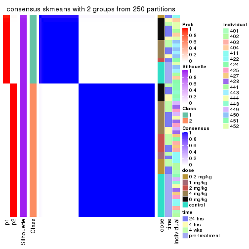</p>

</div>
<div id='tab-ATC-skmeans-consensus-heatmap-2'>
<pre><code class="r">consensus_heatmap(res, k = 3)
</code></pre>

<p>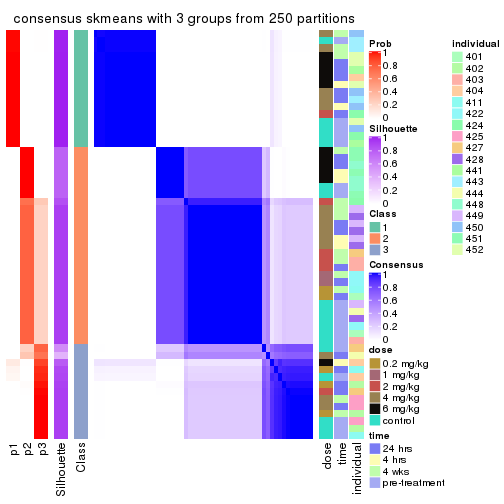</p>

</div>
<div id='tab-ATC-skmeans-consensus-heatmap-3'>
<pre><code class="r">consensus_heatmap(res, k = 4)
</code></pre>

<p>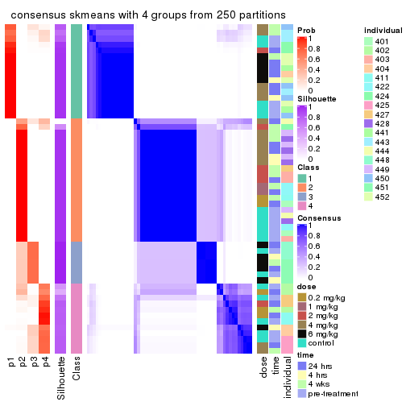</p>

</div>
<div id='tab-ATC-skmeans-consensus-heatmap-4'>
<pre><code class="r">consensus_heatmap(res, k = 5)
</code></pre>

<p></p>

</div>
<div id='tab-ATC-skmeans-consensus-heatmap-5'>
<pre><code class="r">consensus_heatmap(res, k = 6)
</code></pre>

<p>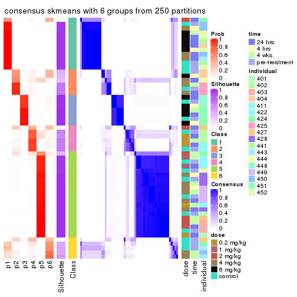</p>

</div>
</div>

Heatmaps for the membership of samples in all partitions to see how consistent they are:


<script>
$( function() {
	$( '#tabs-ATC-skmeans-membership-heatmap' ).tabs();
} );
</script>
<div id='tabs-ATC-skmeans-membership-heatmap'>
<ul>
<li><a href='#tab-ATC-skmeans-membership-heatmap-1'>k = 2</a></li>
<li><a href='#tab-ATC-skmeans-membership-heatmap-2'>k = 3</a></li>
<li><a href='#tab-ATC-skmeans-membership-heatmap-3'>k = 4</a></li>
<li><a href='#tab-ATC-skmeans-membership-heatmap-4'>k = 5</a></li>
<li><a href='#tab-ATC-skmeans-membership-heatmap-5'>k = 6</a></li>
</ul>
<div id='tab-ATC-skmeans-membership-heatmap-1'>
<pre><code class="r">membership_heatmap(res, k = 2)
</code></pre>

<p>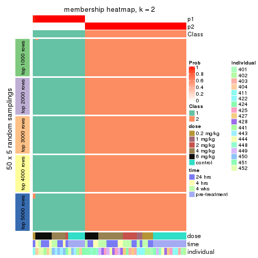</p>

</div>
<div id='tab-ATC-skmeans-membership-heatmap-2'>
<pre><code class="r">membership_heatmap(res, k = 3)
</code></pre>

<p>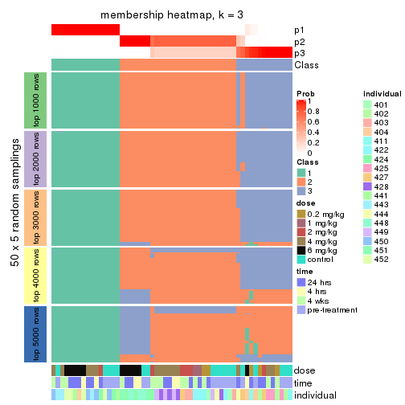</p>

</div>
<div id='tab-ATC-skmeans-membership-heatmap-3'>
<pre><code class="r">membership_heatmap(res, k = 4)
</code></pre>

<p>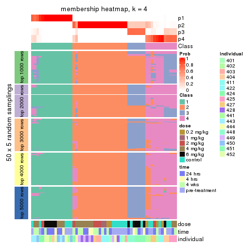</p>

</div>
<div id='tab-ATC-skmeans-membership-heatmap-4'>
<pre><code class="r">membership_heatmap(res, k = 5)
</code></pre>

<p>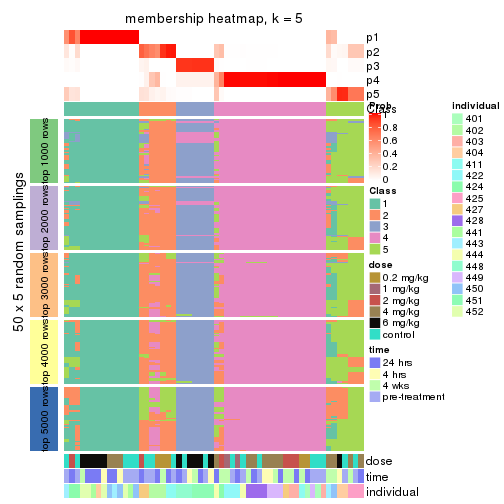</p>

</div>
<div id='tab-ATC-skmeans-membership-heatmap-5'>
<pre><code class="r">membership_heatmap(res, k = 6)
</code></pre>

<p>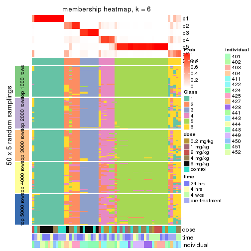</p>

</div>
</div>

As soon as we have had the classes for columns, we can look for signatures
which are significantly different between classes which can be candidate marks
for certain classes. Following are the heatmaps for signatures.


Signature heatmaps where rows are scaled:


<script>
$( function() {
	$( '#tabs-ATC-skmeans-get-signatures' ).tabs();
} );
</script>
<div id='tabs-ATC-skmeans-get-signatures'>
<ul>
<li><a href='#tab-ATC-skmeans-get-signatures-1'>k = 2</a></li>
<li><a href='#tab-ATC-skmeans-get-signatures-2'>k = 3</a></li>
<li><a href='#tab-ATC-skmeans-get-signatures-3'>k = 4</a></li>
<li><a href='#tab-ATC-skmeans-get-signatures-4'>k = 5</a></li>
<li><a href='#tab-ATC-skmeans-get-signatures-5'>k = 6</a></li>
</ul>
<div id='tab-ATC-skmeans-get-signatures-1'>
<pre><code class="r">get_signatures(res, k = 2)
</code></pre>

<p>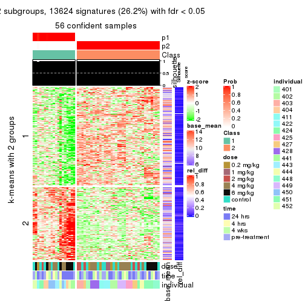</p>

</div>
<div id='tab-ATC-skmeans-get-signatures-2'>
<pre><code class="r">get_signatures(res, k = 3)
</code></pre>

<p>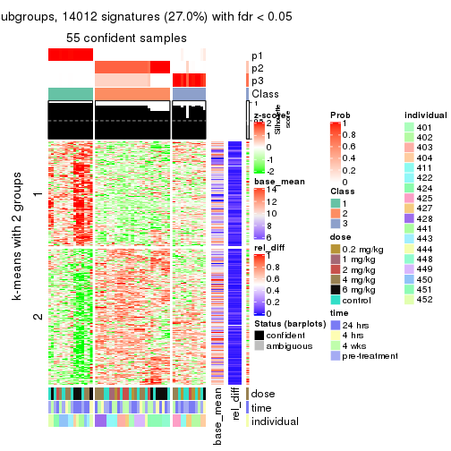</p>

</div>
<div id='tab-ATC-skmeans-get-signatures-3'>
<pre><code class="r">get_signatures(res, k = 4)
</code></pre>

<p>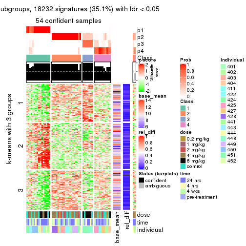</p>

</div>
<div id='tab-ATC-skmeans-get-signatures-4'>
<pre><code class="r">get_signatures(res, k = 5)
</code></pre>

<p>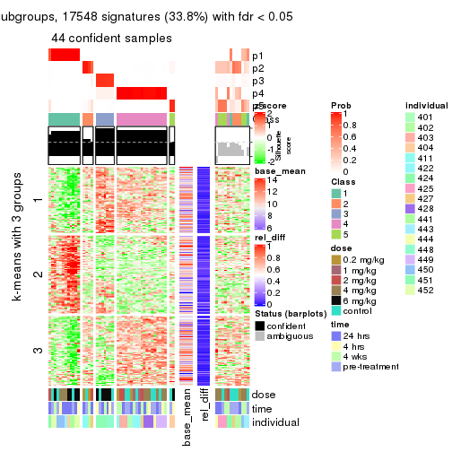</p>

</div>
<div id='tab-ATC-skmeans-get-signatures-5'>
<pre><code class="r">get_signatures(res, k = 6)
</code></pre>

<p>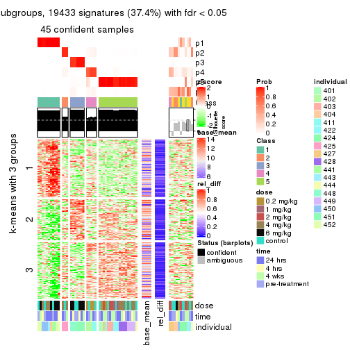</p>

</div>
</div>


Signature heatmaps where rows are not scaled:


<script>
$( function() {
	$( '#tabs-ATC-skmeans-get-signatures-no-scale' ).tabs();
} );
</script>
<div id='tabs-ATC-skmeans-get-signatures-no-scale'>
<ul>
<li><a href='#tab-ATC-skmeans-get-signatures-no-scale-1'>k = 2</a></li>
<li><a href='#tab-ATC-skmeans-get-signatures-no-scale-2'>k = 3</a></li>
<li><a href='#tab-ATC-skmeans-get-signatures-no-scale-3'>k = 4</a></li>
<li><a href='#tab-ATC-skmeans-get-signatures-no-scale-4'>k = 5</a></li>
<li><a href='#tab-ATC-skmeans-get-signatures-no-scale-5'>k = 6</a></li>
</ul>
<div id='tab-ATC-skmeans-get-signatures-no-scale-1'>
<pre><code class="r">get_signatures(res, k = 2, scale_rows = FALSE)
</code></pre>

<p>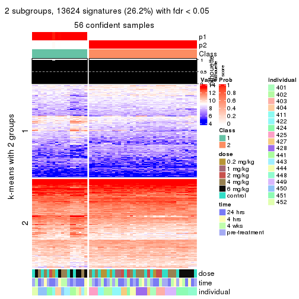</p>

</div>
<div id='tab-ATC-skmeans-get-signatures-no-scale-2'>
<pre><code class="r">get_signatures(res, k = 3, scale_rows = FALSE)
</code></pre>

<p>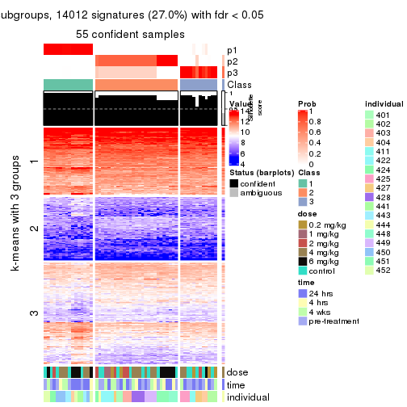</p>

</div>
<div id='tab-ATC-skmeans-get-signatures-no-scale-3'>
<pre><code class="r">get_signatures(res, k = 4, scale_rows = FALSE)
</code></pre>

<p>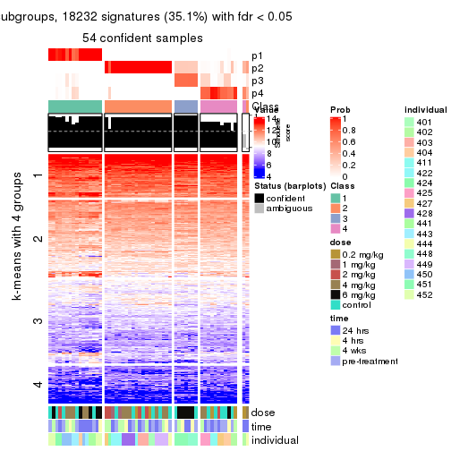</p>

</div>
<div id='tab-ATC-skmeans-get-signatures-no-scale-4'>
<pre><code class="r">get_signatures(res, k = 5, scale_rows = FALSE)
</code></pre>

<p>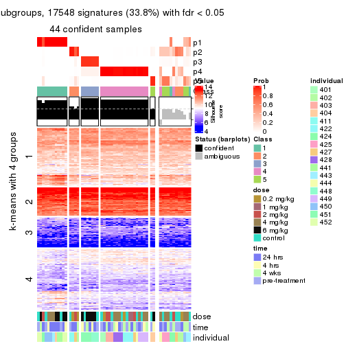</p>

</div>
<div id='tab-ATC-skmeans-get-signatures-no-scale-5'>
<pre><code class="r">get_signatures(res, k = 6, scale_rows = FALSE)
</code></pre>

<p>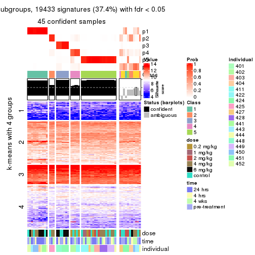</p>

</div>
</div>


Compare the overlap of signatures from different k:

```r
compare_signatures(res)
```

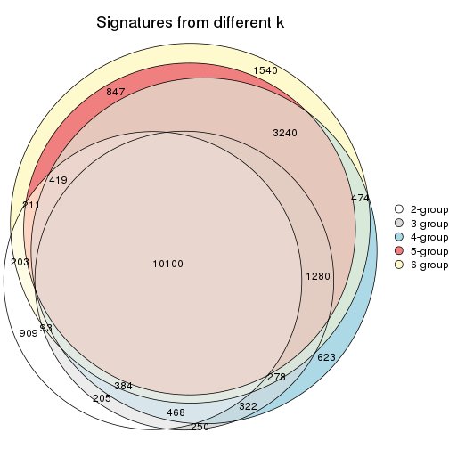

`get_signature()` returns a data frame invisibly. TO get the list of signatures, the function
call should be assigned to a variable explicitly. In following code, if `plot` argument is set
to `FALSE`, no heatmap is plotted while only the differential analysis is performed.

```r
# code only for demonstration
tb = get_signature(res, k = ..., plot = FALSE)
```

An example of the output of `tb` is:

```
#>   which_row         fdr    mean_1    mean_2 scaled_mean_1 scaled_mean_2 km
#> 1        38 0.042760348  8.373488  9.131774    -0.5533452     0.5164555  1
#> 2        40 0.018707592  7.106213  8.469186    -0.6173731     0.5762149  1
#> 3        55 0.019134737 10.221463 11.207825    -0.6159697     0.5749050  1
#> 4        59 0.006059896  5.921854  7.869574    -0.6899429     0.6439467  1
#> 5        60 0.018055526  8.928898 10.211722    -0.6204761     0.5791110  1
#> 6        98 0.009384629 15.714769 14.887706     0.6635654    -0.6193277  2
...
```

The columns in `tb` are:

1. `which_row`: row indices corresponding to the input matrix.
2. `fdr`: FDR for the differential test. 
3. `mean_x`: The mean value in group x.
4. `scaled_mean_x`: The mean value in group x after rows are scaled.
5. `km`: Row groups if k-means clustering is applied to rows.


UMAP plot which shows how samples are separated.


<script>
$( function() {
	$( '#tabs-ATC-skmeans-dimension-reduction' ).tabs();
} );
</script>
<div id='tabs-ATC-skmeans-dimension-reduction'>
<ul>
<li><a href='#tab-ATC-skmeans-dimension-reduction-1'>k = 2</a></li>
<li><a href='#tab-ATC-skmeans-dimension-reduction-2'>k = 3</a></li>
<li><a href='#tab-ATC-skmeans-dimension-reduction-3'>k = 4</a></li>
<li><a href='#tab-ATC-skmeans-dimension-reduction-4'>k = 5</a></li>
<li><a href='#tab-ATC-skmeans-dimension-reduction-5'>k = 6</a></li>
</ul>
<div id='tab-ATC-skmeans-dimension-reduction-1'>
<pre><code class="r">dimension_reduction(res, k = 2, method = &quot;UMAP&quot;)
</code></pre>

<p>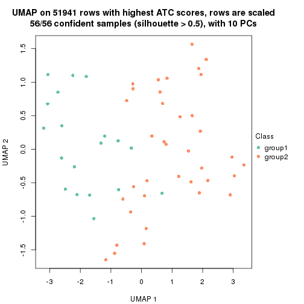</p>

</div>
<div id='tab-ATC-skmeans-dimension-reduction-2'>
<pre><code class="r">dimension_reduction(res, k = 3, method = &quot;UMAP&quot;)
</code></pre>

<p>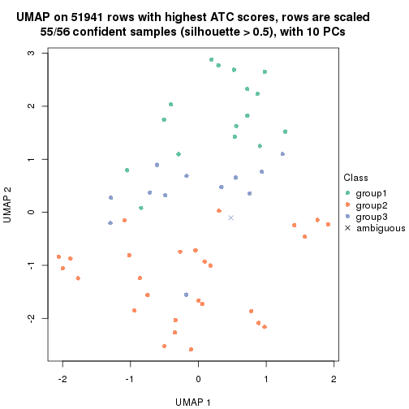</p>

</div>
<div id='tab-ATC-skmeans-dimension-reduction-3'>
<pre><code class="r">dimension_reduction(res, k = 4, method = &quot;UMAP&quot;)
</code></pre>

<p>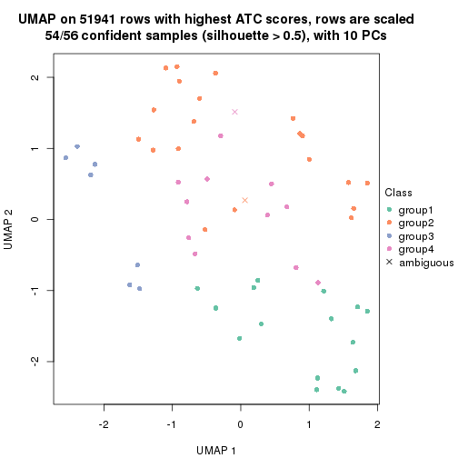</p>

</div>
<div id='tab-ATC-skmeans-dimension-reduction-4'>
<pre><code class="r">dimension_reduction(res, k = 5, method = &quot;UMAP&quot;)
</code></pre>

<p>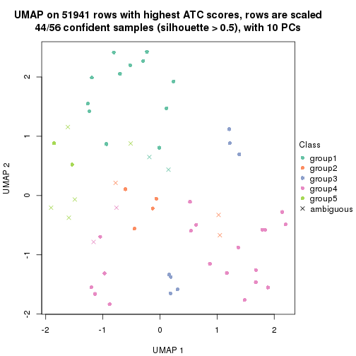</p>

</div>
<div id='tab-ATC-skmeans-dimension-reduction-5'>
<pre><code class="r">dimension_reduction(res, k = 6, method = &quot;UMAP&quot;)
</code></pre>

<p>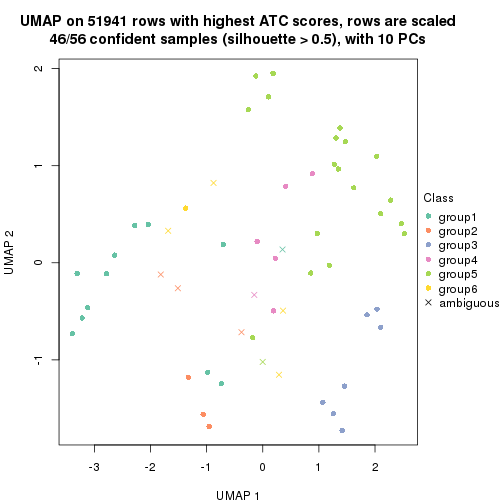</p>

</div>
</div>


Following heatmap shows how subgroups are split when increasing `k`:

```r
collect_classes(res)
```

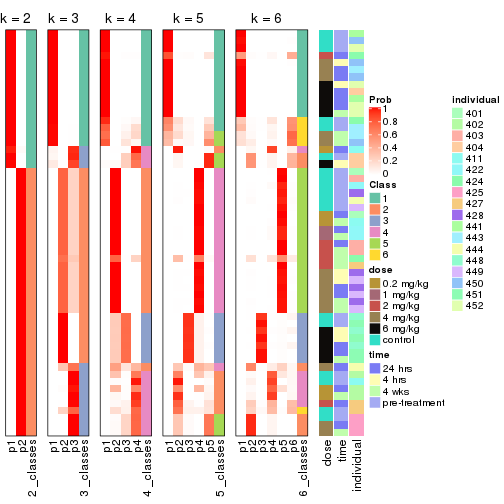


Test correlation between subgroups and known annotations. If the known
annotation is numeric, one-way ANOVA test is applied, and if the known
annotation is discrete, chi-squared contingency table test is applied.

```r
test_to_known_factors(res)
```

```
#>              n dose(p) time(p) individual(p) k
#> ATC:skmeans 56 0.49804   0.769      4.15e-05 2
#> ATC:skmeans 55 0.38738   0.925      2.88e-07 3
#> ATC:skmeans 54 0.02611   0.889      1.48e-10 4
#> ATC:skmeans 44 0.04307   0.750      5.15e-08 5
#> ATC:skmeans 46 0.00764   0.886      7.07e-12 6
```


If matrix rows can be associated to genes, consider to use `functional_enrichment(res,
...)` to perform function enrichment for the signature genes. See [this vignette](http://bioconductor.org/packages/devel/bioc/vignettes/cola/inst/doc/functional_enrichment.html) for more detailed explanations.


 

---------------------------------------------------


### ATC:pam**


The object with results only for a single top-value method and a single partition method 
can be extracted as:

```r
res = res_list["ATC", "pam"]
# you can also extract it by
# res = res_list["ATC:pam"]
```

A summary of `res` and all the functions that can be applied to it:

```r
res
```

```
#> A 'ConsensusPartition' object with k = 2, 3, 4, 5, 6.
#>   On a matrix with 51941 rows and 56 columns.
#>   Top rows (1000, 2000, 3000, 4000, 5000) are extracted by 'ATC' method.
#>   Subgroups are detected by 'pam' method.
#>   Performed in total 1250 partitions by row resampling.
#>   Best k for subgroups seems to be 2.
#> 
#> Following methods can be applied to this 'ConsensusPartition' object:
#>  [1] "cola_report"             "collect_classes"         "collect_plots"          
#>  [4] "collect_stats"           "colnames"                "compare_signatures"     
#>  [7] "consensus_heatmap"       "dimension_reduction"     "functional_enrichment"  
#> [10] "get_anno_col"            "get_anno"                "get_classes"            
#> [13] "get_consensus"           "get_matrix"              "get_membership"         
#> [16] "get_param"               "get_signatures"          "get_stats"              
#> [19] "is_best_k"               "is_stable_k"             "membership_heatmap"     
#> [22] "ncol"                    "nrow"                    "plot_ecdf"              
#> [25] "rownames"                "select_partition_number" "show"                   
#> [28] "suggest_best_k"          "test_to_known_factors"
```

`collect_plots()` function collects all the plots made from `res` for all `k` (number of partitions)
into one single page to provide an easy and fast comparison between different `k`.

```r
collect_plots(res)
```

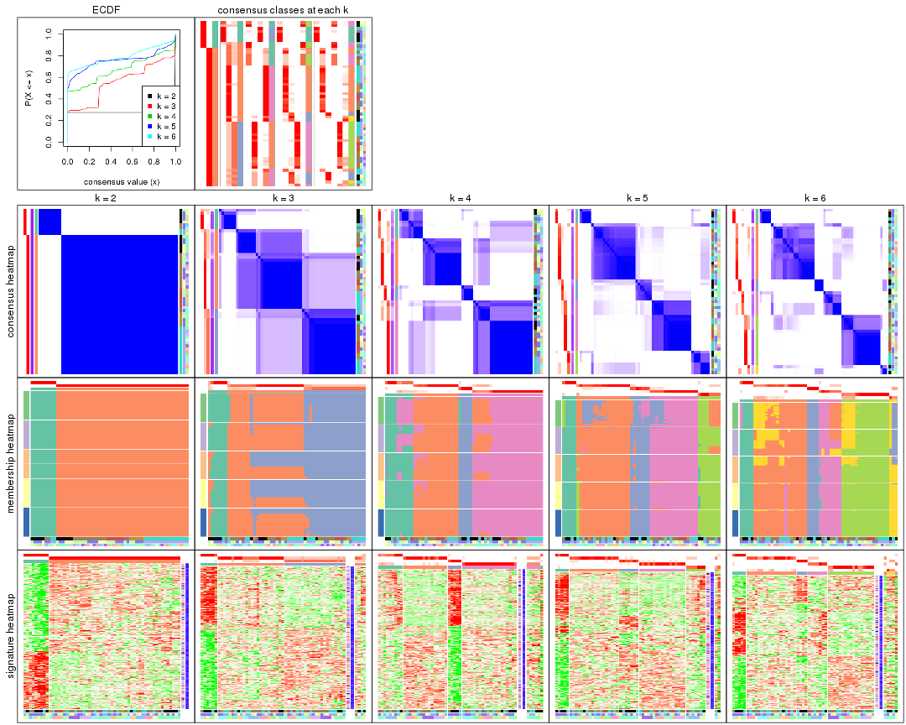

The plots are:

- The first row: a plot of the ECDF (empirical cumulative distribution
  function) curves of the consensus matrix for each `k` and the heatmap of
  predicted classes for each `k`.
- The second row: heatmaps of the consensus matrix for each `k`.
- The third row: heatmaps of the membership matrix for each `k`.
- The fouth row: heatmaps of the signatures for each `k`.

All the plots in panels can be made by individual functions and they are
plotted later in this section.

`select_partition_number()` produces several plots showing different
statistics for choosing "optimized" `k`. There are following statistics:

- ECDF curves of the consensus matrix for each `k`;
- 1-PAC. [The PAC
  score](https://en.wikipedia.org/wiki/Consensus_clustering#Over-interpretation_potential_of_consensus_clustering)
  measures the proportion of the ambiguous subgrouping.
- Mean silhouette score.
- Concordance. The mean probability of fiting the consensus class ids in all
  partitions.
- Area increased. Denote $A_k$ as the area under the ECDF curve for current
  `k`, the area increased is defined as $A_k - A_{k-1}$.
- Rand index. The percent of pairs of samples that are both in a same cluster
  or both are not in a same cluster in the partition of k and k-1.
- Jaccard index. The ratio of pairs of samples are both in a same cluster in
  the partition of k and k-1 and the pairs of samples are both in a same
  cluster in the partition k or k-1.

The detailed explanations of these statistics can be found in [the _cola_
vignette](http://bioconductor.org/packages/devel/bioc/vignettes/cola/inst/doc/cola.html#toc_13).

Generally speaking, lower PAC score, higher mean silhouette score or higher
concordance corresponds to better partition. Rand index and Jaccard index
measure how similar the current partition is compared to partition with `k-1`.
If they are too similar, we won't accept `k` is better than `k-1`.

```r
select_partition_number(res)
```

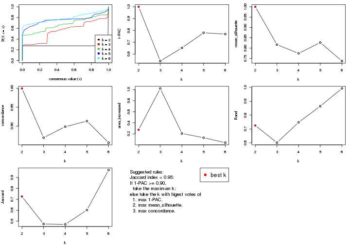

The numeric values for all these statistics can be obtained by `get_stats()`.

```r
get_stats(res)
```

```
#>   k 1-PAC mean_silhouette concordance area_increased  Rand Jaccard
#> 2 2 1.000           1.000       1.000         0.2754 0.725   0.725
#> 3 3 0.541           0.817       0.869         1.0214 0.601   0.474
#> 4 4 0.652           0.774       0.898         0.2072 0.748   0.471
#> 5 5 0.780           0.827       0.913         0.1311 0.864   0.602
#> 6 6 0.769           0.738       0.856         0.0413 0.992   0.967
```

`suggest_best_k()` suggests the best $k$ based on these statistics. The rules are as follows:

- All $k$ with Jaccard index larger than 0.95 are removed because increasing
  $k$ does not provide enough extra information. If all $k$ are removed, it is
  marked as no subgroup is detected.
- For all $k$ with 1-PAC score larger than 0.9, the maximal $k$ is taken as
  the best $k$, and other $k$ are marked as optional $k$.
- If it does not fit the second rule. The $k$ with the maximal vote of the
  highest 1-PAC score, highest mean silhouette, and highest concordance is
  taken as the best $k$.

```r
suggest_best_k(res)
```

```
#> [1] 2
```


Following shows the table of the partitions (You need to click the **show/hide
code output** link to see it). The membership matrix (columns with name `p*`)
is inferred by
[`clue::cl_consensus()`](https://www.rdocumentation.org/link/cl_consensus?package=clue)
function with the `SE` method. Basically the value in the membership matrix
represents the probability to belong to a certain group. The finall class
label for an item is determined with the group with highest probability it
belongs to.

In `get_classes()` function, the entropy is calculated from the membership
matrix and the silhouette score is calculated from the consensus matrix.


<script>
$( function() {
	$( '#tabs-ATC-pam-get-classes' ).tabs();
} );
</script>
<div id='tabs-ATC-pam-get-classes'>
<ul>
<li><a href='#tab-ATC-pam-get-classes-1'>k = 2</a></li>
<li><a href='#tab-ATC-pam-get-classes-2'>k = 3</a></li>
<li><a href='#tab-ATC-pam-get-classes-3'>k = 4</a></li>
<li><a href='#tab-ATC-pam-get-classes-4'>k = 5</a></li>
<li><a href='#tab-ATC-pam-get-classes-5'>k = 6</a></li>
</ul>

<div id='tab-ATC-pam-get-classes-1'>
<p><a id='tab-ATC-pam-get-classes-1-a' style='color:#0366d6' href='#'>show/hide code output</a></p>
<pre><code class="r">cbind(get_classes(res, k = 2), get_membership(res, k = 2))
</code></pre>

<pre><code>#&gt;           class entropy silhouette p1 p2
#&gt; GSM687644     2       0          1  0  1
#&gt; GSM687648     2       0          1  0  1
#&gt; GSM687653     2       0          1  0  1
#&gt; GSM687658     2       0          1  0  1
#&gt; GSM687663     2       0          1  0  1
#&gt; GSM687668     2       0          1  0  1
#&gt; GSM687673     2       0          1  0  1
#&gt; GSM687678     2       0          1  0  1
#&gt; GSM687683     2       0          1  0  1
#&gt; GSM687688     2       0          1  0  1
#&gt; GSM687695     1       0          1  1  0
#&gt; GSM687699     2       0          1  0  1
#&gt; GSM687704     2       0          1  0  1
#&gt; GSM687707     2       0          1  0  1
#&gt; GSM687712     2       0          1  0  1
#&gt; GSM687719     2       0          1  0  1
#&gt; GSM687724     2       0          1  0  1
#&gt; GSM687728     1       0          1  1  0
#&gt; GSM687646     2       0          1  0  1
#&gt; GSM687649     2       0          1  0  1
#&gt; GSM687665     2       0          1  0  1
#&gt; GSM687651     2       0          1  0  1
#&gt; GSM687667     2       0          1  0  1
#&gt; GSM687670     2       0          1  0  1
#&gt; GSM687671     2       0          1  0  1
#&gt; GSM687654     2       0          1  0  1
#&gt; GSM687675     2       0          1  0  1
#&gt; GSM687685     2       0          1  0  1
#&gt; GSM687656     2       0          1  0  1
#&gt; GSM687677     2       0          1  0  1
#&gt; GSM687687     2       0          1  0  1
#&gt; GSM687692     2       0          1  0  1
#&gt; GSM687716     2       0          1  0  1
#&gt; GSM687722     2       0          1  0  1
#&gt; GSM687680     2       0          1  0  1
#&gt; GSM687690     2       0          1  0  1
#&gt; GSM687700     1       0          1  1  0
#&gt; GSM687705     2       0          1  0  1
#&gt; GSM687714     2       0          1  0  1
#&gt; GSM687721     1       0          1  1  0
#&gt; GSM687682     2       0          1  0  1
#&gt; GSM687694     2       0          1  0  1
#&gt; GSM687702     2       0          1  0  1
#&gt; GSM687718     2       0          1  0  1
#&gt; GSM687723     2       0          1  0  1
#&gt; GSM687661     2       0          1  0  1
#&gt; GSM687710     2       0          1  0  1
#&gt; GSM687726     2       0          1  0  1
#&gt; GSM687730     1       0          1  1  0
#&gt; GSM687660     1       0          1  1  0
#&gt; GSM687697     1       0          1  1  0
#&gt; GSM687709     2       0          1  0  1
#&gt; GSM687725     2       0          1  0  1
#&gt; GSM687729     1       0          1  1  0
#&gt; GSM687727     2       0          1  0  1
#&gt; GSM687731     1       0          1  1  0
</code></pre>

<script>
$('#tab-ATC-pam-get-classes-1-a').parent().next().next().hide();
$('#tab-ATC-pam-get-classes-1-a').click(function(){
  $('#tab-ATC-pam-get-classes-1-a').parent().next().next().toggle();
  return(false);
});
</script>
</div>

<div id='tab-ATC-pam-get-classes-2'>
<p><a id='tab-ATC-pam-get-classes-2-a' style='color:#0366d6' href='#'>show/hide code output</a></p>
<pre><code class="r">cbind(get_classes(res, k = 3), get_membership(res, k = 3))
</code></pre>

<pre><code>#&gt;           class entropy silhouette    p1    p2    p3
#&gt; GSM687644     3   0.543      0.970 0.000 0.284 0.716
#&gt; GSM687648     2   0.000      0.834 0.000 1.000 0.000
#&gt; GSM687653     3   0.543      0.970 0.000 0.284 0.716
#&gt; GSM687658     2   0.000      0.834 0.000 1.000 0.000
#&gt; GSM687663     2   0.000      0.834 0.000 1.000 0.000
#&gt; GSM687668     3   0.614      0.806 0.000 0.404 0.596
#&gt; GSM687673     2   0.000      0.834 0.000 1.000 0.000
#&gt; GSM687678     2   0.000      0.834 0.000 1.000 0.000
#&gt; GSM687683     2   0.000      0.834 0.000 1.000 0.000
#&gt; GSM687688     3   0.543      0.970 0.000 0.284 0.716
#&gt; GSM687695     1   0.000      0.892 1.000 0.000 0.000
#&gt; GSM687699     2   0.543      0.630 0.000 0.716 0.284
#&gt; GSM687704     3   0.543      0.970 0.000 0.284 0.716
#&gt; GSM687707     3   0.619      0.782 0.000 0.420 0.580
#&gt; GSM687712     3   0.543      0.970 0.000 0.284 0.716
#&gt; GSM687719     2   0.543      0.630 0.000 0.716 0.284
#&gt; GSM687724     3   0.553      0.959 0.000 0.296 0.704
#&gt; GSM687728     2   0.918      0.329 0.188 0.528 0.284
#&gt; GSM687646     3   0.543      0.970 0.000 0.284 0.716
#&gt; GSM687649     2   0.470      0.446 0.000 0.788 0.212
#&gt; GSM687665     2   0.000      0.834 0.000 1.000 0.000
#&gt; GSM687651     2   0.000      0.834 0.000 1.000 0.000
#&gt; GSM687667     3   0.543      0.970 0.000 0.284 0.716
#&gt; GSM687670     2   0.129      0.796 0.000 0.968 0.032
#&gt; GSM687671     3   0.543      0.970 0.000 0.284 0.716
#&gt; GSM687654     3   0.543      0.970 0.000 0.284 0.716
#&gt; GSM687675     2   0.543      0.630 0.000 0.716 0.284
#&gt; GSM687685     2   0.000      0.834 0.000 1.000 0.000
#&gt; GSM687656     3   0.543      0.970 0.000 0.284 0.716
#&gt; GSM687677     2   0.000      0.834 0.000 1.000 0.000
#&gt; GSM687687     3   0.543      0.970 0.000 0.284 0.716
#&gt; GSM687692     3   0.543      0.970 0.000 0.284 0.716
#&gt; GSM687716     3   0.543      0.970 0.000 0.284 0.716
#&gt; GSM687722     2   0.543      0.630 0.000 0.716 0.284
#&gt; GSM687680     2   0.000      0.834 0.000 1.000 0.000
#&gt; GSM687690     3   0.543      0.970 0.000 0.284 0.716
#&gt; GSM687700     1   0.000      0.892 1.000 0.000 0.000
#&gt; GSM687705     2   0.000      0.834 0.000 1.000 0.000
#&gt; GSM687714     3   0.543      0.970 0.000 0.284 0.716
#&gt; GSM687721     2   0.543      0.630 0.000 0.716 0.284
#&gt; GSM687682     2   0.000      0.834 0.000 1.000 0.000
#&gt; GSM687694     3   0.543      0.970 0.000 0.284 0.716
#&gt; GSM687702     2   0.540      0.634 0.000 0.720 0.280
#&gt; GSM687718     3   0.543      0.970 0.000 0.284 0.716
#&gt; GSM687723     2   0.543      0.630 0.000 0.716 0.284
#&gt; GSM687661     2   0.000      0.834 0.000 1.000 0.000
#&gt; GSM687710     2   0.525      0.274 0.000 0.736 0.264
#&gt; GSM687726     3   0.627      0.719 0.000 0.452 0.548
#&gt; GSM687730     1   0.418      0.810 0.828 0.000 0.172
#&gt; GSM687660     1   0.000      0.892 1.000 0.000 0.000
#&gt; GSM687697     1   0.000      0.892 1.000 0.000 0.000
#&gt; GSM687709     2   0.000      0.834 0.000 1.000 0.000
#&gt; GSM687725     2   0.000      0.834 0.000 1.000 0.000
#&gt; GSM687729     1   0.000      0.892 1.000 0.000 0.000
#&gt; GSM687727     3   0.550      0.963 0.000 0.292 0.708
#&gt; GSM687731     1   0.992      0.150 0.392 0.324 0.284
</code></pre>

<script>
$('#tab-ATC-pam-get-classes-2-a').parent().next().next().hide();
$('#tab-ATC-pam-get-classes-2-a').click(function(){
  $('#tab-ATC-pam-get-classes-2-a').parent().next().next().toggle();
  return(false);
});
</script>
</div>

<div id='tab-ATC-pam-get-classes-3'>
<p><a id='tab-ATC-pam-get-classes-3-a' style='color:#0366d6' href='#'>show/hide code output</a></p>
<pre><code class="r">cbind(get_classes(res, k = 4), get_membership(res, k = 4))
</code></pre>

<pre><code>#&gt;           class entropy silhouette    p1    p2    p3    p4
#&gt; GSM687644     2   0.000      0.916 0.000 1.000 0.000 0.000
#&gt; GSM687648     4   0.000      0.847 0.000 0.000 0.000 1.000
#&gt; GSM687653     2   0.000      0.916 0.000 1.000 0.000 0.000
#&gt; GSM687658     4   0.000      0.847 0.000 0.000 0.000 1.000
#&gt; GSM687663     4   0.000      0.847 0.000 0.000 0.000 1.000
#&gt; GSM687668     4   0.302      0.732 0.000 0.148 0.000 0.852
#&gt; GSM687673     4   0.000      0.847 0.000 0.000 0.000 1.000
#&gt; GSM687678     4   0.000      0.847 0.000 0.000 0.000 1.000
#&gt; GSM687683     4   0.000      0.847 0.000 0.000 0.000 1.000
#&gt; GSM687688     2   0.000      0.916 0.000 1.000 0.000 0.000
#&gt; GSM687695     3   0.000      0.960 0.000 0.000 1.000 0.000
#&gt; GSM687699     1   0.476      0.682 0.628 0.000 0.000 0.372
#&gt; GSM687704     2   0.000      0.916 0.000 1.000 0.000 0.000
#&gt; GSM687707     4   0.489      0.344 0.000 0.412 0.000 0.588
#&gt; GSM687712     2   0.265      0.836 0.000 0.880 0.000 0.120
#&gt; GSM687719     1   0.422      0.759 0.728 0.000 0.000 0.272
#&gt; GSM687724     4   0.488      0.353 0.000 0.408 0.000 0.592
#&gt; GSM687728     1   0.000      0.620 1.000 0.000 0.000 0.000
#&gt; GSM687646     2   0.000      0.916 0.000 1.000 0.000 0.000
#&gt; GSM687649     4   0.000      0.847 0.000 0.000 0.000 1.000
#&gt; GSM687665     4   0.000      0.847 0.000 0.000 0.000 1.000
#&gt; GSM687651     4   0.000      0.847 0.000 0.000 0.000 1.000
#&gt; GSM687667     2   0.270      0.836 0.000 0.876 0.000 0.124
#&gt; GSM687670     4   0.000      0.847 0.000 0.000 0.000 1.000
#&gt; GSM687671     4   0.488      0.353 0.000 0.408 0.000 0.592
#&gt; GSM687654     2   0.000      0.916 0.000 1.000 0.000 0.000
#&gt; GSM687675     1   0.422      0.759 0.728 0.000 0.000 0.272
#&gt; GSM687685     4   0.000      0.847 0.000 0.000 0.000 1.000
#&gt; GSM687656     2   0.000      0.916 0.000 1.000 0.000 0.000
#&gt; GSM687677     4   0.000      0.847 0.000 0.000 0.000 1.000
#&gt; GSM687687     2   0.000      0.916 0.000 1.000 0.000 0.000
#&gt; GSM687692     2   0.000      0.916 0.000 1.000 0.000 0.000
#&gt; GSM687716     2   0.000      0.916 0.000 1.000 0.000 0.000
#&gt; GSM687722     1   0.422      0.759 0.728 0.000 0.000 0.272
#&gt; GSM687680     4   0.000      0.847 0.000 0.000 0.000 1.000
#&gt; GSM687690     2   0.365      0.748 0.000 0.796 0.000 0.204
#&gt; GSM687700     3   0.344      0.823 0.184 0.000 0.816 0.000
#&gt; GSM687705     4   0.000      0.847 0.000 0.000 0.000 1.000
#&gt; GSM687714     2   0.428      0.608 0.000 0.720 0.000 0.280
#&gt; GSM687721     1   0.000      0.620 1.000 0.000 0.000 0.000
#&gt; GSM687682     4   0.000      0.847 0.000 0.000 0.000 1.000
#&gt; GSM687694     2   0.344      0.778 0.000 0.816 0.000 0.184
#&gt; GSM687702     1   0.498      0.538 0.540 0.000 0.000 0.460
#&gt; GSM687718     2   0.000      0.916 0.000 1.000 0.000 0.000
#&gt; GSM687723     1   0.422      0.759 0.728 0.000 0.000 0.272
#&gt; GSM687661     4   0.000      0.847 0.000 0.000 0.000 1.000
#&gt; GSM687710     4   0.416      0.612 0.000 0.264 0.000 0.736
#&gt; GSM687726     4   0.489      0.344 0.000 0.412 0.000 0.588
#&gt; GSM687730     1   0.387      0.333 0.772 0.000 0.228 0.000
#&gt; GSM687660     3   0.000      0.960 0.000 0.000 1.000 0.000
#&gt; GSM687697     3   0.000      0.960 0.000 0.000 1.000 0.000
#&gt; GSM687709     4   0.000      0.847 0.000 0.000 0.000 1.000
#&gt; GSM687725     4   0.000      0.847 0.000 0.000 0.000 1.000
#&gt; GSM687729     3   0.000      0.960 0.000 0.000 1.000 0.000
#&gt; GSM687727     4   0.483      0.394 0.000 0.392 0.000 0.608
#&gt; GSM687731     1   0.000      0.620 1.000 0.000 0.000 0.000
</code></pre>

<script>
$('#tab-ATC-pam-get-classes-3-a').parent().next().next().hide();
$('#tab-ATC-pam-get-classes-3-a').click(function(){
  $('#tab-ATC-pam-get-classes-3-a').parent().next().next().toggle();
  return(false);
});
</script>
</div>

<div id='tab-ATC-pam-get-classes-4'>
<p><a id='tab-ATC-pam-get-classes-4-a' style='color:#0366d6' href='#'>show/hide code output</a></p>
<pre><code class="r">cbind(get_classes(res, k = 5), get_membership(res, k = 5))
</code></pre>

<pre><code>#&gt;           class entropy silhouette    p1    p2    p3    p4    p5
#&gt; GSM687644     4  0.0162      0.929 0.000 0.000 0.004 0.996 0.000
#&gt; GSM687648     2  0.1732      0.874 0.000 0.920 0.080 0.000 0.000
#&gt; GSM687653     4  0.0000      0.930 0.000 0.000 0.000 1.000 0.000
#&gt; GSM687658     2  0.0000      0.890 0.000 1.000 0.000 0.000 0.000
#&gt; GSM687663     2  0.0000      0.890 0.000 1.000 0.000 0.000 0.000
#&gt; GSM687668     2  0.4133      0.741 0.000 0.768 0.180 0.052 0.000
#&gt; GSM687673     2  0.0162      0.890 0.000 0.996 0.004 0.000 0.000
#&gt; GSM687678     2  0.0963      0.889 0.000 0.964 0.036 0.000 0.000
#&gt; GSM687683     2  0.0162      0.890 0.000 0.996 0.004 0.000 0.000
#&gt; GSM687688     4  0.0000      0.930 0.000 0.000 0.000 1.000 0.000
#&gt; GSM687695     1  0.0000      0.953 1.000 0.000 0.000 0.000 0.000
#&gt; GSM687699     2  0.4256     -0.104 0.000 0.564 0.000 0.000 0.436
#&gt; GSM687704     4  0.0000      0.930 0.000 0.000 0.000 1.000 0.000
#&gt; GSM687707     3  0.2471      0.809 0.000 0.000 0.864 0.136 0.000
#&gt; GSM687712     4  0.0693      0.922 0.000 0.012 0.008 0.980 0.000
#&gt; GSM687719     5  0.3561      0.775 0.000 0.260 0.000 0.000 0.740
#&gt; GSM687724     3  0.1043      0.809 0.000 0.000 0.960 0.040 0.000
#&gt; GSM687728     5  0.0000      0.733 0.000 0.000 0.000 0.000 1.000
#&gt; GSM687646     4  0.0000      0.930 0.000 0.000 0.000 1.000 0.000
#&gt; GSM687649     2  0.2929      0.800 0.000 0.820 0.180 0.000 0.000
#&gt; GSM687665     2  0.0000      0.890 0.000 1.000 0.000 0.000 0.000
#&gt; GSM687651     2  0.0000      0.890 0.000 1.000 0.000 0.000 0.000
#&gt; GSM687667     4  0.3209      0.823 0.000 0.008 0.180 0.812 0.000
#&gt; GSM687670     2  0.2929      0.800 0.000 0.820 0.180 0.000 0.000
#&gt; GSM687671     4  0.3419      0.816 0.000 0.016 0.180 0.804 0.000
#&gt; GSM687654     4  0.0000      0.930 0.000 0.000 0.000 1.000 0.000
#&gt; GSM687675     5  0.3561      0.775 0.000 0.260 0.000 0.000 0.740
#&gt; GSM687685     2  0.0000      0.890 0.000 1.000 0.000 0.000 0.000
#&gt; GSM687656     4  0.0000      0.930 0.000 0.000 0.000 1.000 0.000
#&gt; GSM687677     2  0.3318      0.789 0.000 0.808 0.180 0.012 0.000
#&gt; GSM687687     4  0.0000      0.930 0.000 0.000 0.000 1.000 0.000
#&gt; GSM687692     4  0.0404      0.926 0.000 0.000 0.012 0.988 0.000
#&gt; GSM687716     4  0.0000      0.930 0.000 0.000 0.000 1.000 0.000
#&gt; GSM687722     5  0.3561      0.775 0.000 0.260 0.000 0.000 0.740
#&gt; GSM687680     2  0.2074      0.860 0.000 0.896 0.104 0.000 0.000
#&gt; GSM687690     4  0.3209      0.823 0.000 0.008 0.180 0.812 0.000
#&gt; GSM687700     1  0.3109      0.790 0.800 0.000 0.000 0.000 0.200
#&gt; GSM687705     2  0.0880      0.890 0.000 0.968 0.032 0.000 0.000
#&gt; GSM687714     4  0.3141      0.837 0.000 0.016 0.152 0.832 0.000
#&gt; GSM687721     5  0.0000      0.733 0.000 0.000 0.000 0.000 1.000
#&gt; GSM687682     2  0.1608      0.877 0.000 0.928 0.072 0.000 0.000
#&gt; GSM687694     4  0.3419      0.816 0.000 0.016 0.180 0.804 0.000
#&gt; GSM687702     2  0.0703      0.872 0.000 0.976 0.000 0.000 0.024
#&gt; GSM687718     4  0.0000      0.930 0.000 0.000 0.000 1.000 0.000
#&gt; GSM687723     5  0.3561      0.775 0.000 0.260 0.000 0.000 0.740
#&gt; GSM687661     2  0.0000      0.890 0.000 1.000 0.000 0.000 0.000
#&gt; GSM687710     3  0.0290      0.779 0.000 0.008 0.992 0.000 0.000
#&gt; GSM687726     3  0.2230      0.816 0.000 0.000 0.884 0.116 0.000
#&gt; GSM687730     5  0.3366      0.452 0.232 0.000 0.000 0.000 0.768
#&gt; GSM687660     1  0.0000      0.953 1.000 0.000 0.000 0.000 0.000
#&gt; GSM687697     1  0.0000      0.953 1.000 0.000 0.000 0.000 0.000
#&gt; GSM687709     3  0.3177      0.604 0.000 0.208 0.792 0.000 0.000
#&gt; GSM687725     3  0.2891      0.692 0.000 0.176 0.824 0.000 0.000
#&gt; GSM687729     1  0.0000      0.953 1.000 0.000 0.000 0.000 0.000
#&gt; GSM687727     3  0.2648      0.788 0.000 0.000 0.848 0.152 0.000
#&gt; GSM687731     5  0.0000      0.733 0.000 0.000 0.000 0.000 1.000
</code></pre>

<script>
$('#tab-ATC-pam-get-classes-4-a').parent().next().next().hide();
$('#tab-ATC-pam-get-classes-4-a').click(function(){
  $('#tab-ATC-pam-get-classes-4-a').parent().next().next().toggle();
  return(false);
});
</script>
</div>

<div id='tab-ATC-pam-get-classes-5'>
<p><a id='tab-ATC-pam-get-classes-5-a' style='color:#0366d6' href='#'>show/hide code output</a></p>
<pre><code class="r">cbind(get_classes(res, k = 6), get_membership(res, k = 6))
</code></pre>

<pre><code>#&gt;           class entropy silhouette    p1    p2    p3    p4    p5    p6
#&gt; GSM687644     5  0.0000      0.852 0.000 0.000 0.000 0.000 1.000 0.000
#&gt; GSM687648     2  0.3175      0.737 0.000 0.744 0.000 0.000 0.000 0.256
#&gt; GSM687653     5  0.0000      0.852 0.000 0.000 0.000 0.000 1.000 0.000
#&gt; GSM687658     2  0.0000      0.781 0.000 1.000 0.000 0.000 0.000 0.000
#&gt; GSM687663     2  0.0937      0.790 0.000 0.960 0.000 0.000 0.000 0.040
#&gt; GSM687668     2  0.3937      0.585 0.000 0.572 0.000 0.000 0.004 0.424
#&gt; GSM687673     2  0.1957      0.772 0.000 0.888 0.000 0.000 0.000 0.112
#&gt; GSM687678     2  0.2135      0.785 0.000 0.872 0.000 0.000 0.000 0.128
#&gt; GSM687683     2  0.2219      0.764 0.000 0.864 0.000 0.000 0.000 0.136
#&gt; GSM687688     5  0.0000      0.852 0.000 0.000 0.000 0.000 1.000 0.000
#&gt; GSM687695     1  0.0000      0.947 1.000 0.000 0.000 0.000 0.000 0.000
#&gt; GSM687699     2  0.3797     -0.209 0.000 0.580 0.000 0.420 0.000 0.000
#&gt; GSM687704     5  0.0000      0.852 0.000 0.000 0.000 0.000 1.000 0.000
#&gt; GSM687707     6  0.3854      0.388 0.000 0.000 0.464 0.000 0.000 0.536
#&gt; GSM687712     5  0.1327      0.821 0.000 0.000 0.000 0.000 0.936 0.064
#&gt; GSM687719     4  0.3309      0.748 0.000 0.280 0.000 0.720 0.000 0.000
#&gt; GSM687724     3  0.0000      1.000 0.000 0.000 1.000 0.000 0.000 0.000
#&gt; GSM687728     4  0.1204      0.700 0.000 0.000 0.000 0.944 0.000 0.056
#&gt; GSM687646     5  0.0000      0.852 0.000 0.000 0.000 0.000 1.000 0.000
#&gt; GSM687649     2  0.3804      0.589 0.000 0.576 0.000 0.000 0.000 0.424
#&gt; GSM687665     2  0.0146      0.782 0.000 0.996 0.000 0.000 0.000 0.004
#&gt; GSM687651     2  0.0000      0.781 0.000 1.000 0.000 0.000 0.000 0.000
#&gt; GSM687667     5  0.3737      0.575 0.000 0.000 0.000 0.000 0.608 0.392
#&gt; GSM687670     2  0.3804      0.589 0.000 0.576 0.000 0.000 0.000 0.424
#&gt; GSM687671     5  0.3804      0.536 0.000 0.000 0.000 0.000 0.576 0.424
#&gt; GSM687654     5  0.0000      0.852 0.000 0.000 0.000 0.000 1.000 0.000
#&gt; GSM687675     4  0.3309      0.748 0.000 0.280 0.000 0.720 0.000 0.000
#&gt; GSM687685     2  0.0000      0.781 0.000 1.000 0.000 0.000 0.000 0.000
#&gt; GSM687656     5  0.0000      0.852 0.000 0.000 0.000 0.000 1.000 0.000
#&gt; GSM687677     2  0.3592      0.643 0.000 0.656 0.000 0.000 0.000 0.344
#&gt; GSM687687     5  0.0000      0.852 0.000 0.000 0.000 0.000 1.000 0.000
#&gt; GSM687692     5  0.0363      0.848 0.000 0.000 0.000 0.000 0.988 0.012
#&gt; GSM687716     5  0.0000      0.852 0.000 0.000 0.000 0.000 1.000 0.000
#&gt; GSM687722     4  0.3309      0.748 0.000 0.280 0.000 0.720 0.000 0.000
#&gt; GSM687680     2  0.2854      0.748 0.000 0.792 0.000 0.000 0.000 0.208
#&gt; GSM687690     5  0.3747      0.571 0.000 0.000 0.000 0.000 0.604 0.396
#&gt; GSM687700     1  0.2793      0.775 0.800 0.000 0.000 0.200 0.000 0.000
#&gt; GSM687705     2  0.2135      0.785 0.000 0.872 0.000 0.000 0.000 0.128
#&gt; GSM687714     5  0.3592      0.620 0.000 0.000 0.000 0.000 0.656 0.344
#&gt; GSM687721     4  0.0000      0.707 0.000 0.000 0.000 1.000 0.000 0.000
#&gt; GSM687682     2  0.2562      0.768 0.000 0.828 0.000 0.000 0.000 0.172
#&gt; GSM687694     5  0.3782      0.553 0.000 0.000 0.000 0.000 0.588 0.412
#&gt; GSM687702     2  0.0260      0.777 0.000 0.992 0.000 0.008 0.000 0.000
#&gt; GSM687718     5  0.0000      0.852 0.000 0.000 0.000 0.000 1.000 0.000
#&gt; GSM687723     4  0.3309      0.748 0.000 0.280 0.000 0.720 0.000 0.000
#&gt; GSM687661     2  0.0000      0.781 0.000 1.000 0.000 0.000 0.000 0.000
#&gt; GSM687710     6  0.3847      0.405 0.000 0.000 0.456 0.000 0.000 0.544
#&gt; GSM687726     3  0.0000      1.000 0.000 0.000 1.000 0.000 0.000 0.000
#&gt; GSM687730     4  0.4038      0.438 0.216 0.000 0.000 0.728 0.000 0.056
#&gt; GSM687660     1  0.0000      0.947 1.000 0.000 0.000 0.000 0.000 0.000
#&gt; GSM687697     1  0.0000      0.947 1.000 0.000 0.000 0.000 0.000 0.000
#&gt; GSM687709     6  0.1391      0.332 0.000 0.016 0.040 0.000 0.000 0.944
#&gt; GSM687725     3  0.0000      1.000 0.000 0.000 1.000 0.000 0.000 0.000
#&gt; GSM687729     1  0.0000      0.947 1.000 0.000 0.000 0.000 0.000 0.000
#&gt; GSM687727     3  0.0000      1.000 0.000 0.000 1.000 0.000 0.000 0.000
#&gt; GSM687731     4  0.1204      0.700 0.000 0.000 0.000 0.944 0.000 0.056
</code></pre>

<script>
$('#tab-ATC-pam-get-classes-5-a').parent().next().next().hide();
$('#tab-ATC-pam-get-classes-5-a').click(function(){
  $('#tab-ATC-pam-get-classes-5-a').parent().next().next().toggle();
  return(false);
});
</script>
</div>
</div>

Heatmaps for the consensus matrix. It visualizes the probability of two
samples to be in a same group.


<script>
$( function() {
	$( '#tabs-ATC-pam-consensus-heatmap' ).tabs();
} );
</script>
<div id='tabs-ATC-pam-consensus-heatmap'>
<ul>
<li><a href='#tab-ATC-pam-consensus-heatmap-1'>k = 2</a></li>
<li><a href='#tab-ATC-pam-consensus-heatmap-2'>k = 3</a></li>
<li><a href='#tab-ATC-pam-consensus-heatmap-3'>k = 4</a></li>
<li><a href='#tab-ATC-pam-consensus-heatmap-4'>k = 5</a></li>
<li><a href='#tab-ATC-pam-consensus-heatmap-5'>k = 6</a></li>
</ul>
<div id='tab-ATC-pam-consensus-heatmap-1'>
<pre><code class="r">consensus_heatmap(res, k = 2)
</code></pre>

<p>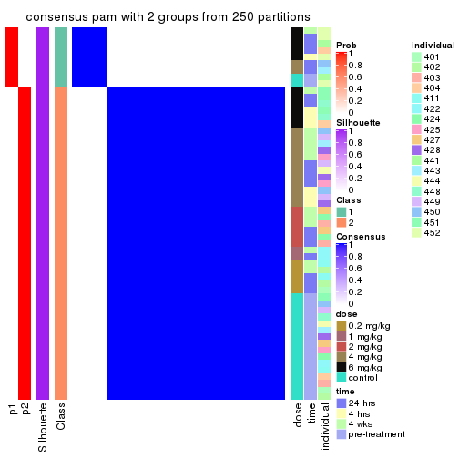</p>

</div>
<div id='tab-ATC-pam-consensus-heatmap-2'>
<pre><code class="r">consensus_heatmap(res, k = 3)
</code></pre>

<p>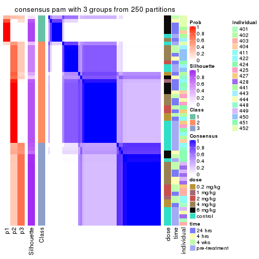</p>

</div>
<div id='tab-ATC-pam-consensus-heatmap-3'>
<pre><code class="r">consensus_heatmap(res, k = 4)
</code></pre>

<p>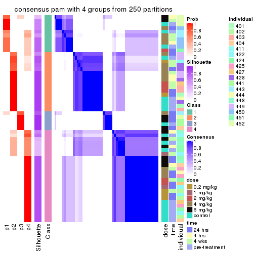</p>

</div>
<div id='tab-ATC-pam-consensus-heatmap-4'>
<pre><code class="r">consensus_heatmap(res, k = 5)
</code></pre>

<p>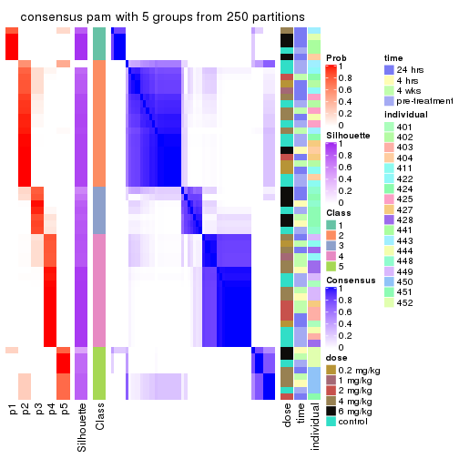</p>

</div>
<div id='tab-ATC-pam-consensus-heatmap-5'>
<pre><code class="r">consensus_heatmap(res, k = 6)
</code></pre>

<p>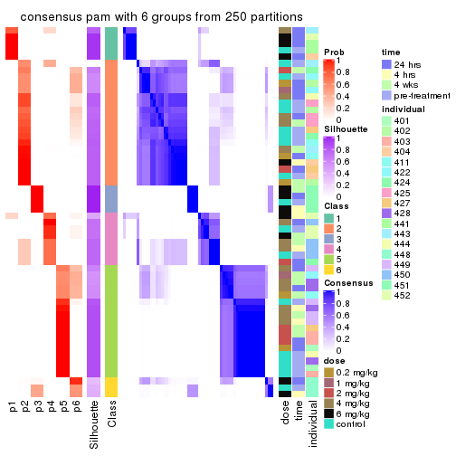</p>

</div>
</div>

Heatmaps for the membership of samples in all partitions to see how consistent they are:


<script>
$( function() {
	$( '#tabs-ATC-pam-membership-heatmap' ).tabs();
} );
</script>
<div id='tabs-ATC-pam-membership-heatmap'>
<ul>
<li><a href='#tab-ATC-pam-membership-heatmap-1'>k = 2</a></li>
<li><a href='#tab-ATC-pam-membership-heatmap-2'>k = 3</a></li>
<li><a href='#tab-ATC-pam-membership-heatmap-3'>k = 4</a></li>
<li><a href='#tab-ATC-pam-membership-heatmap-4'>k = 5</a></li>
<li><a href='#tab-ATC-pam-membership-heatmap-5'>k = 6</a></li>
</ul>
<div id='tab-ATC-pam-membership-heatmap-1'>
<pre><code class="r">membership_heatmap(res, k = 2)
</code></pre>

<p></p>

</div>
<div id='tab-ATC-pam-membership-heatmap-2'>
<pre><code class="r">membership_heatmap(res, k = 3)
</code></pre>

<p>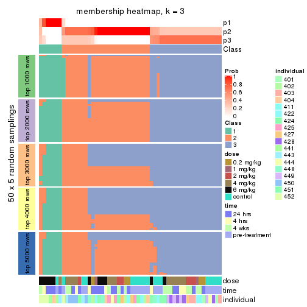</p>

</div>
<div id='tab-ATC-pam-membership-heatmap-3'>
<pre><code class="r">membership_heatmap(res, k = 4)
</code></pre>

<p>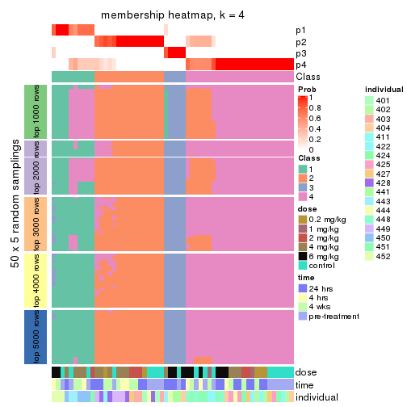</p>

</div>
<div id='tab-ATC-pam-membership-heatmap-4'>
<pre><code class="r">membership_heatmap(res, k = 5)
</code></pre>

<p>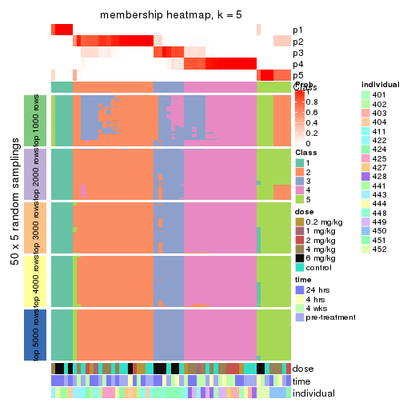</p>

</div>
<div id='tab-ATC-pam-membership-heatmap-5'>
<pre><code class="r">membership_heatmap(res, k = 6)
</code></pre>

<p>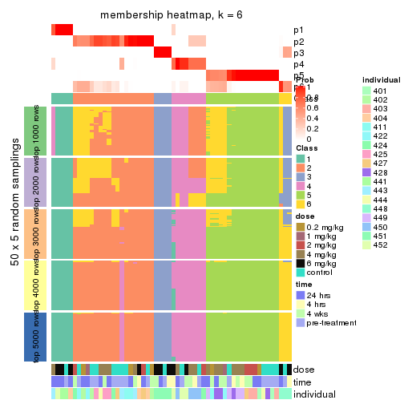</p>

</div>
</div>

As soon as we have had the classes for columns, we can look for signatures
which are significantly different between classes which can be candidate marks
for certain classes. Following are the heatmaps for signatures.


Signature heatmaps where rows are scaled:


<script>
$( function() {
	$( '#tabs-ATC-pam-get-signatures' ).tabs();
} );
</script>
<div id='tabs-ATC-pam-get-signatures'>
<ul>
<li><a href='#tab-ATC-pam-get-signatures-1'>k = 2</a></li>
<li><a href='#tab-ATC-pam-get-signatures-2'>k = 3</a></li>
<li><a href='#tab-ATC-pam-get-signatures-3'>k = 4</a></li>
<li><a href='#tab-ATC-pam-get-signatures-4'>k = 5</a></li>
<li><a href='#tab-ATC-pam-get-signatures-5'>k = 6</a></li>
</ul>
<div id='tab-ATC-pam-get-signatures-1'>
<pre><code class="r">get_signatures(res, k = 2)
</code></pre>

<p></p>

</div>
<div id='tab-ATC-pam-get-signatures-2'>
<pre><code class="r">get_signatures(res, k = 3)
</code></pre>

<p>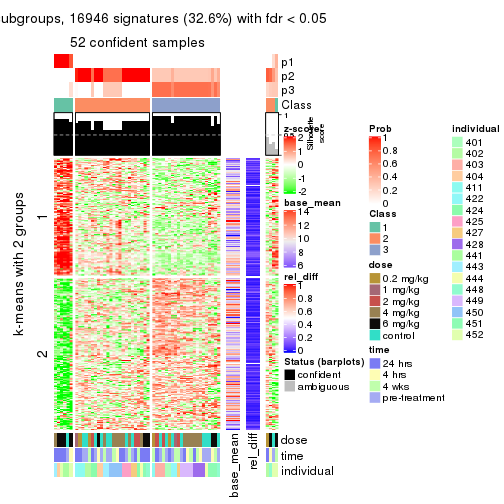</p>

</div>
<div id='tab-ATC-pam-get-signatures-3'>
<pre><code class="r">get_signatures(res, k = 4)
</code></pre>

<p>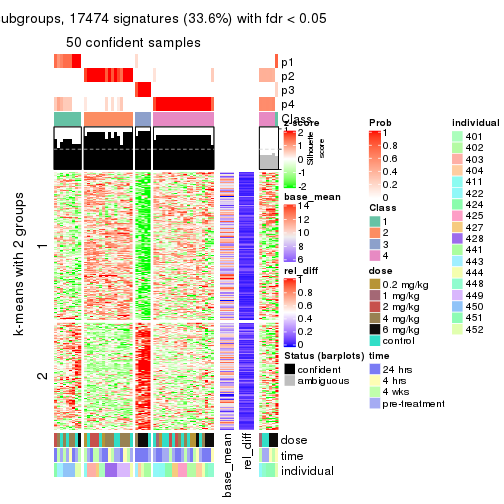</p>

</div>
<div id='tab-ATC-pam-get-signatures-4'>
<pre><code class="r">get_signatures(res, k = 5)
</code></pre>

<p>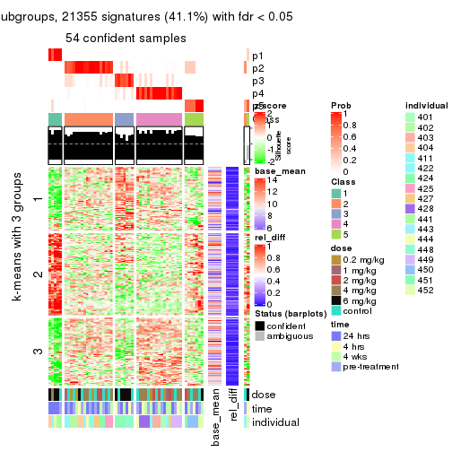</p>

</div>
<div id='tab-ATC-pam-get-signatures-5'>
<pre><code class="r">get_signatures(res, k = 6)
</code></pre>

<p>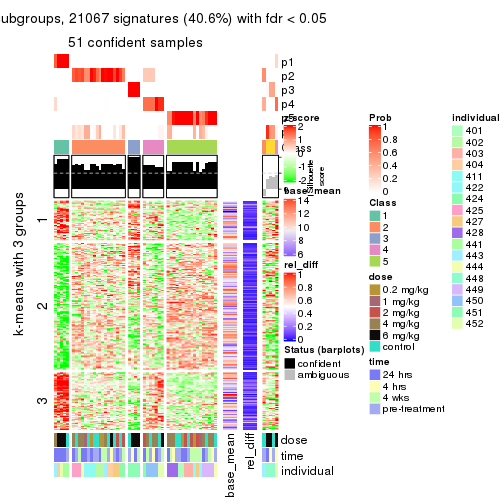</p>

</div>
</div>


Signature heatmaps where rows are not scaled:


<script>
$( function() {
	$( '#tabs-ATC-pam-get-signatures-no-scale' ).tabs();
} );
</script>
<div id='tabs-ATC-pam-get-signatures-no-scale'>
<ul>
<li><a href='#tab-ATC-pam-get-signatures-no-scale-1'>k = 2</a></li>
<li><a href='#tab-ATC-pam-get-signatures-no-scale-2'>k = 3</a></li>
<li><a href='#tab-ATC-pam-get-signatures-no-scale-3'>k = 4</a></li>
<li><a href='#tab-ATC-pam-get-signatures-no-scale-4'>k = 5</a></li>
<li><a href='#tab-ATC-pam-get-signatures-no-scale-5'>k = 6</a></li>
</ul>
<div id='tab-ATC-pam-get-signatures-no-scale-1'>
<pre><code class="r">get_signatures(res, k = 2, scale_rows = FALSE)
</code></pre>

<p></p>

</div>
<div id='tab-ATC-pam-get-signatures-no-scale-2'>
<pre><code class="r">get_signatures(res, k = 3, scale_rows = FALSE)
</code></pre>

<p>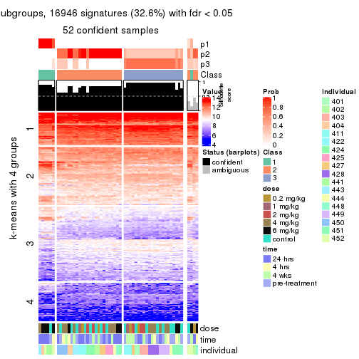</p>

</div>
<div id='tab-ATC-pam-get-signatures-no-scale-3'>
<pre><code class="r">get_signatures(res, k = 4, scale_rows = FALSE)
</code></pre>

<p>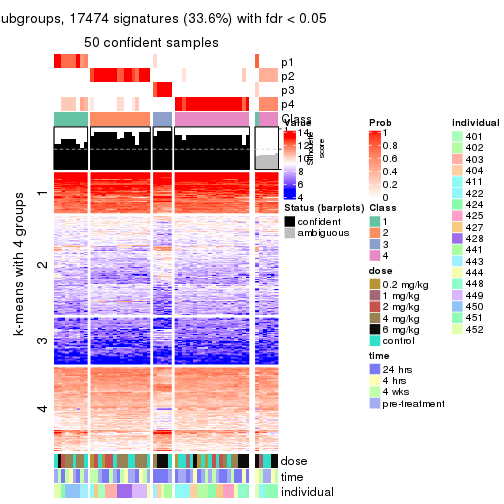</p>

</div>
<div id='tab-ATC-pam-get-signatures-no-scale-4'>
<pre><code class="r">get_signatures(res, k = 5, scale_rows = FALSE)
</code></pre>

<p>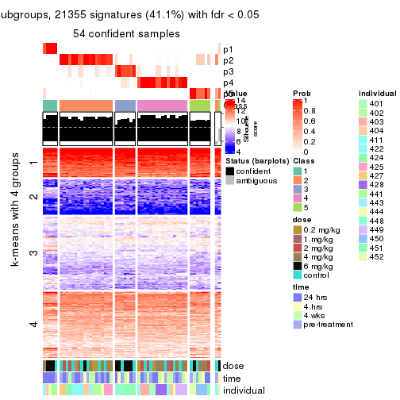</p>

</div>
<div id='tab-ATC-pam-get-signatures-no-scale-5'>
<pre><code class="r">get_signatures(res, k = 6, scale_rows = FALSE)
</code></pre>

<p>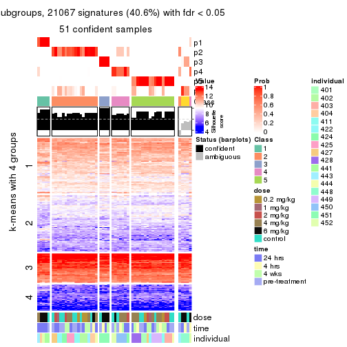</p>

</div>
</div>


Compare the overlap of signatures from different k:

```r
compare_signatures(res)
```

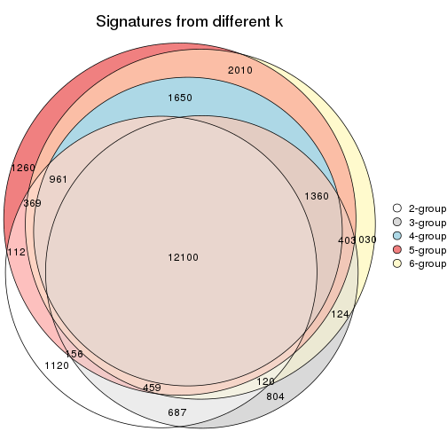

`get_signature()` returns a data frame invisibly. TO get the list of signatures, the function
call should be assigned to a variable explicitly. In following code, if `plot` argument is set
to `FALSE`, no heatmap is plotted while only the differential analysis is performed.

```r
# code only for demonstration
tb = get_signature(res, k = ..., plot = FALSE)
```

An example of the output of `tb` is:

```
#>   which_row         fdr    mean_1    mean_2 scaled_mean_1 scaled_mean_2 km
#> 1        38 0.042760348  8.373488  9.131774    -0.5533452     0.5164555  1
#> 2        40 0.018707592  7.106213  8.469186    -0.6173731     0.5762149  1
#> 3        55 0.019134737 10.221463 11.207825    -0.6159697     0.5749050  1
#> 4        59 0.006059896  5.921854  7.869574    -0.6899429     0.6439467  1
#> 5        60 0.018055526  8.928898 10.211722    -0.6204761     0.5791110  1
#> 6        98 0.009384629 15.714769 14.887706     0.6635654    -0.6193277  2
...
```

The columns in `tb` are:

1. `which_row`: row indices corresponding to the input matrix.
2. `fdr`: FDR for the differential test. 
3. `mean_x`: The mean value in group x.
4. `scaled_mean_x`: The mean value in group x after rows are scaled.
5. `km`: Row groups if k-means clustering is applied to rows.


UMAP plot which shows how samples are separated.


<script>
$( function() {
	$( '#tabs-ATC-pam-dimension-reduction' ).tabs();
} );
</script>
<div id='tabs-ATC-pam-dimension-reduction'>
<ul>
<li><a href='#tab-ATC-pam-dimension-reduction-1'>k = 2</a></li>
<li><a href='#tab-ATC-pam-dimension-reduction-2'>k = 3</a></li>
<li><a href='#tab-ATC-pam-dimension-reduction-3'>k = 4</a></li>
<li><a href='#tab-ATC-pam-dimension-reduction-4'>k = 5</a></li>
<li><a href='#tab-ATC-pam-dimension-reduction-5'>k = 6</a></li>
</ul>
<div id='tab-ATC-pam-dimension-reduction-1'>
<pre><code class="r">dimension_reduction(res, k = 2, method = &quot;UMAP&quot;)
</code></pre>

<p></p>

</div>
<div id='tab-ATC-pam-dimension-reduction-2'>
<pre><code class="r">dimension_reduction(res, k = 3, method = &quot;UMAP&quot;)
</code></pre>

<p>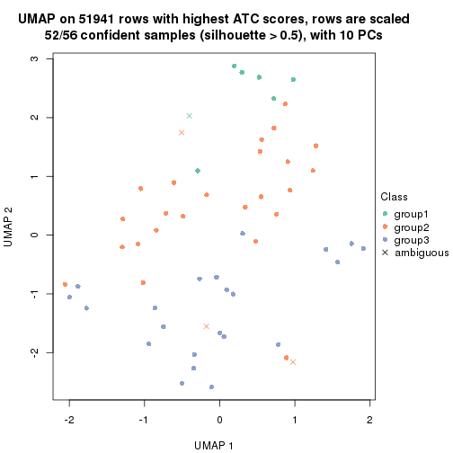</p>

</div>
<div id='tab-ATC-pam-dimension-reduction-3'>
<pre><code class="r">dimension_reduction(res, k = 4, method = &quot;UMAP&quot;)
</code></pre>

<p>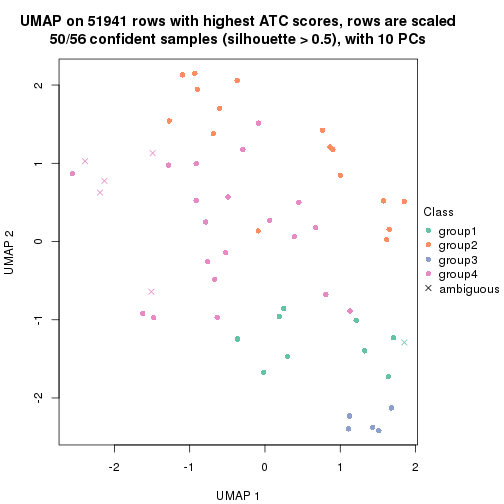</p>

</div>
<div id='tab-ATC-pam-dimension-reduction-4'>
<pre><code class="r">dimension_reduction(res, k = 5, method = &quot;UMAP&quot;)
</code></pre>

<p>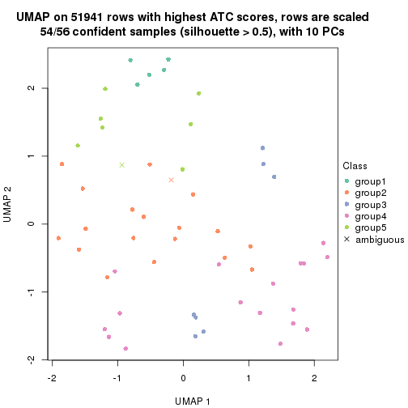</p>

</div>
<div id='tab-ATC-pam-dimension-reduction-5'>
<pre><code class="r">dimension_reduction(res, k = 6, method = &quot;UMAP&quot;)
</code></pre>

<p>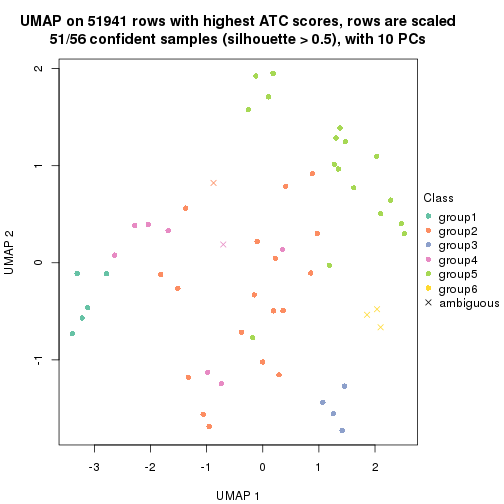</p>

</div>
</div>


Following heatmap shows how subgroups are split when increasing `k`:

```r
collect_classes(res)
```

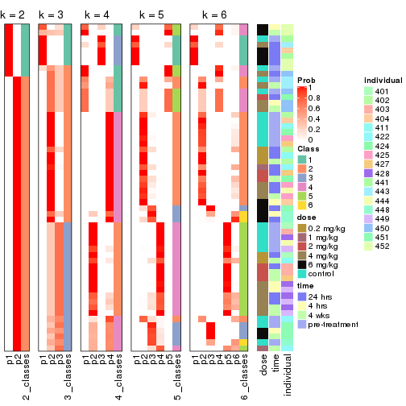


Test correlation between subgroups and known annotations. If the known
annotation is numeric, one-way ANOVA test is applied, and if the known
annotation is discrete, chi-squared contingency table test is applied.

```r
test_to_known_factors(res)
```

```
#>          n dose(p) time(p) individual(p) k
#> ATC:pam 56  0.0784   0.415      1.08e-03 2
#> ATC:pam 52  0.2810   0.333      1.30e-04 3
#> ATC:pam 50  0.3359   0.597      1.22e-05 4
#> ATC:pam 54  0.0688   0.621      4.95e-10 5
#> ATC:pam 51  0.1328   0.745      1.27e-09 6
```


If matrix rows can be associated to genes, consider to use `functional_enrichment(res,
...)` to perform function enrichment for the signature genes. See [this vignette](http://bioconductor.org/packages/devel/bioc/vignettes/cola/inst/doc/functional_enrichment.html) for more detailed explanations.


 

---------------------------------------------------


### ATC:mclust


The object with results only for a single top-value method and a single partition method 
can be extracted as:

```r
res = res_list["ATC", "mclust"]
# you can also extract it by
# res = res_list["ATC:mclust"]
```

A summary of `res` and all the functions that can be applied to it:

```r
res
```

```
#> A 'ConsensusPartition' object with k = 2, 3, 4, 5, 6.
#>   On a matrix with 51941 rows and 56 columns.
#>   Top rows (1000, 2000, 3000, 4000, 5000) are extracted by 'ATC' method.
#>   Subgroups are detected by 'mclust' method.
#>   Performed in total 1250 partitions by row resampling.
#>   Best k for subgroups seems to be 2.
#> 
#> Following methods can be applied to this 'ConsensusPartition' object:
#>  [1] "cola_report"             "collect_classes"         "collect_plots"          
#>  [4] "collect_stats"           "colnames"                "compare_signatures"     
#>  [7] "consensus_heatmap"       "dimension_reduction"     "functional_enrichment"  
#> [10] "get_anno_col"            "get_anno"                "get_classes"            
#> [13] "get_consensus"           "get_matrix"              "get_membership"         
#> [16] "get_param"               "get_signatures"          "get_stats"              
#> [19] "is_best_k"               "is_stable_k"             "membership_heatmap"     
#> [22] "ncol"                    "nrow"                    "plot_ecdf"              
#> [25] "rownames"                "select_partition_number" "show"                   
#> [28] "suggest_best_k"          "test_to_known_factors"
```

`collect_plots()` function collects all the plots made from `res` for all `k` (number of partitions)
into one single page to provide an easy and fast comparison between different `k`.

```r
collect_plots(res)
```

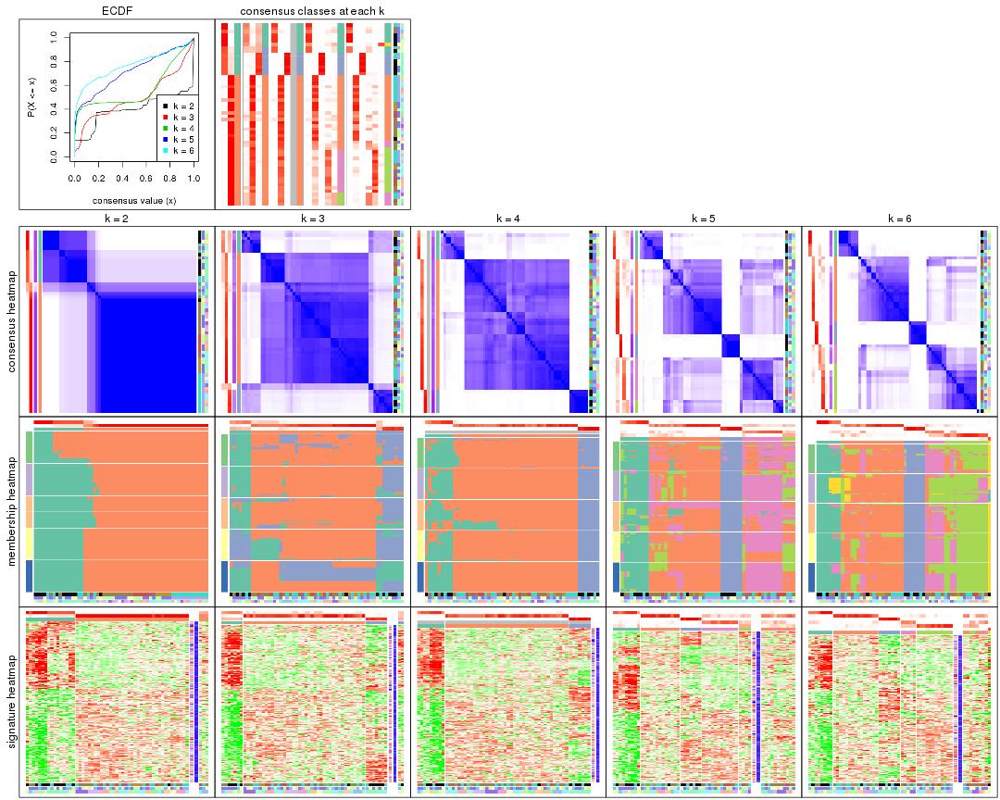

The plots are:

- The first row: a plot of the ECDF (empirical cumulative distribution
  function) curves of the consensus matrix for each `k` and the heatmap of
  predicted classes for each `k`.
- The second row: heatmaps of the consensus matrix for each `k`.
- The third row: heatmaps of the membership matrix for each `k`.
- The fouth row: heatmaps of the signatures for each `k`.

All the plots in panels can be made by individual functions and they are
plotted later in this section.

`select_partition_number()` produces several plots showing different
statistics for choosing "optimized" `k`. There are following statistics:

- ECDF curves of the consensus matrix for each `k`;
- 1-PAC. [The PAC
  score](https://en.wikipedia.org/wiki/Consensus_clustering#Over-interpretation_potential_of_consensus_clustering)
  measures the proportion of the ambiguous subgrouping.
- Mean silhouette score.
- Concordance. The mean probability of fiting the consensus class ids in all
  partitions.
- Area increased. Denote $A_k$ as the area under the ECDF curve for current
  `k`, the area increased is defined as $A_k - A_{k-1}$.
- Rand index. The percent of pairs of samples that are both in a same cluster
  or both are not in a same cluster in the partition of k and k-1.
- Jaccard index. The ratio of pairs of samples are both in a same cluster in
  the partition of k and k-1 and the pairs of samples are both in a same
  cluster in the partition k or k-1.

The detailed explanations of these statistics can be found in [the _cola_
vignette](http://bioconductor.org/packages/devel/bioc/vignettes/cola/inst/doc/cola.html#toc_13).

Generally speaking, lower PAC score, higher mean silhouette score or higher
concordance corresponds to better partition. Rand index and Jaccard index
measure how similar the current partition is compared to partition with `k-1`.
If they are too similar, we won't accept `k` is better than `k-1`.

```r
select_partition_number(res)
```

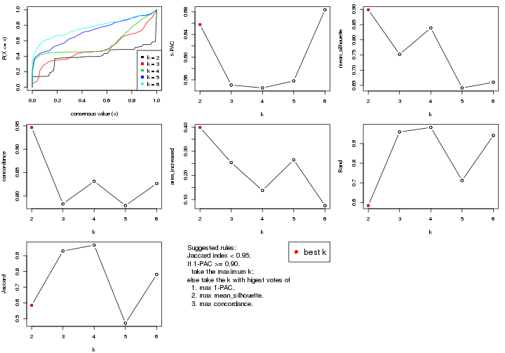

The numeric values for all these statistics can be obtained by `get_stats()`.

```r
get_stats(res)
```

```
#>   k 1-PAC mean_silhouette concordance area_increased  Rand Jaccard
#> 2 2 0.657           0.898       0.947         0.3989 0.584   0.584
#> 3 3 0.551           0.752       0.783         0.2532 0.959   0.930
#> 4 4 0.546           0.839       0.832         0.1376 0.982   0.967
#> 5 5 0.558           0.642       0.780         0.2644 0.712   0.471
#> 6 6 0.684           0.660       0.827         0.0749 0.941   0.781
```

`suggest_best_k()` suggests the best $k$ based on these statistics. The rules are as follows:

- All $k$ with Jaccard index larger than 0.95 are removed because increasing
  $k$ does not provide enough extra information. If all $k$ are removed, it is
  marked as no subgroup is detected.
- For all $k$ with 1-PAC score larger than 0.9, the maximal $k$ is taken as
  the best $k$, and other $k$ are marked as optional $k$.
- If it does not fit the second rule. The $k$ with the maximal vote of the
  highest 1-PAC score, highest mean silhouette, and highest concordance is
  taken as the best $k$.

```r
suggest_best_k(res)
```

```
#> [1] 2
```


Following shows the table of the partitions (You need to click the **show/hide
code output** link to see it). The membership matrix (columns with name `p*`)
is inferred by
[`clue::cl_consensus()`](https://www.rdocumentation.org/link/cl_consensus?package=clue)
function with the `SE` method. Basically the value in the membership matrix
represents the probability to belong to a certain group. The finall class
label for an item is determined with the group with highest probability it
belongs to.

In `get_classes()` function, the entropy is calculated from the membership
matrix and the silhouette score is calculated from the consensus matrix.


<script>
$( function() {
	$( '#tabs-ATC-mclust-get-classes' ).tabs();
} );
</script>
<div id='tabs-ATC-mclust-get-classes'>
<ul>
<li><a href='#tab-ATC-mclust-get-classes-1'>k = 2</a></li>
<li><a href='#tab-ATC-mclust-get-classes-2'>k = 3</a></li>
<li><a href='#tab-ATC-mclust-get-classes-3'>k = 4</a></li>
<li><a href='#tab-ATC-mclust-get-classes-4'>k = 5</a></li>
<li><a href='#tab-ATC-mclust-get-classes-5'>k = 6</a></li>
</ul>

<div id='tab-ATC-mclust-get-classes-1'>
<p><a id='tab-ATC-mclust-get-classes-1-a' style='color:#0366d6' href='#'>show/hide code output</a></p>
<pre><code class="r">cbind(get_classes(res, k = 2), get_membership(res, k = 2))
</code></pre>

<pre><code>#&gt;           class entropy silhouette    p1    p2
#&gt; GSM687644     2   0.000      0.959 0.000 1.000
#&gt; GSM687648     2   0.000      0.959 0.000 1.000
#&gt; GSM687653     2   0.000      0.959 0.000 1.000
#&gt; GSM687658     2   0.000      0.959 0.000 1.000
#&gt; GSM687663     2   0.000      0.959 0.000 1.000
#&gt; GSM687668     2   0.000      0.959 0.000 1.000
#&gt; GSM687673     2   0.506      0.834 0.112 0.888
#&gt; GSM687678     2   0.000      0.959 0.000 1.000
#&gt; GSM687683     2   0.000      0.959 0.000 1.000
#&gt; GSM687688     2   0.000      0.959 0.000 1.000
#&gt; GSM687695     1   0.000      0.879 1.000 0.000
#&gt; GSM687699     2   0.000      0.959 0.000 1.000
#&gt; GSM687704     2   0.000      0.959 0.000 1.000
#&gt; GSM687707     1   0.662      0.904 0.828 0.172
#&gt; GSM687712     2   0.000      0.959 0.000 1.000
#&gt; GSM687719     2   0.963      0.264 0.388 0.612
#&gt; GSM687724     1   0.662      0.904 0.828 0.172
#&gt; GSM687728     1   0.574      0.909 0.864 0.136
#&gt; GSM687646     2   0.000      0.959 0.000 1.000
#&gt; GSM687649     2   0.000      0.959 0.000 1.000
#&gt; GSM687665     2   0.000      0.959 0.000 1.000
#&gt; GSM687651     2   0.000      0.959 0.000 1.000
#&gt; GSM687667     2   0.000      0.959 0.000 1.000
#&gt; GSM687670     2   0.000      0.959 0.000 1.000
#&gt; GSM687671     2   0.000      0.959 0.000 1.000
#&gt; GSM687654     2   0.000      0.959 0.000 1.000
#&gt; GSM687675     2   0.958      0.289 0.380 0.620
#&gt; GSM687685     2   0.000      0.959 0.000 1.000
#&gt; GSM687656     2   0.000      0.959 0.000 1.000
#&gt; GSM687677     2   0.000      0.959 0.000 1.000
#&gt; GSM687687     2   0.000      0.959 0.000 1.000
#&gt; GSM687692     2   0.000      0.959 0.000 1.000
#&gt; GSM687716     2   0.000      0.959 0.000 1.000
#&gt; GSM687722     2   0.987      0.105 0.432 0.568
#&gt; GSM687680     2   0.000      0.959 0.000 1.000
#&gt; GSM687690     2   0.000      0.959 0.000 1.000
#&gt; GSM687700     1   0.000      0.879 1.000 0.000
#&gt; GSM687705     2   0.000      0.959 0.000 1.000
#&gt; GSM687714     2   0.000      0.959 0.000 1.000
#&gt; GSM687721     1   0.625      0.907 0.844 0.156
#&gt; GSM687682     2   0.000      0.959 0.000 1.000
#&gt; GSM687694     2   0.000      0.959 0.000 1.000
#&gt; GSM687702     2   0.000      0.959 0.000 1.000
#&gt; GSM687718     2   0.000      0.959 0.000 1.000
#&gt; GSM687723     2   0.278      0.911 0.048 0.952
#&gt; GSM687661     2   0.000      0.959 0.000 1.000
#&gt; GSM687710     1   0.662      0.904 0.828 0.172
#&gt; GSM687726     1   0.662      0.904 0.828 0.172
#&gt; GSM687730     1   0.000      0.879 1.000 0.000
#&gt; GSM687660     1   0.000      0.879 1.000 0.000
#&gt; GSM687697     1   0.000      0.879 1.000 0.000
#&gt; GSM687709     1   0.662      0.904 0.828 0.172
#&gt; GSM687725     1   0.662      0.904 0.828 0.172
#&gt; GSM687729     1   0.000      0.879 1.000 0.000
#&gt; GSM687727     1   0.662      0.904 0.828 0.172
#&gt; GSM687731     1   0.574      0.909 0.864 0.136
</code></pre>

<script>
$('#tab-ATC-mclust-get-classes-1-a').parent().next().next().hide();
$('#tab-ATC-mclust-get-classes-1-a').click(function(){
  $('#tab-ATC-mclust-get-classes-1-a').parent().next().next().toggle();
  return(false);
});
</script>
</div>

<div id='tab-ATC-mclust-get-classes-2'>
<p><a id='tab-ATC-mclust-get-classes-2-a' style='color:#0366d6' href='#'>show/hide code output</a></p>
<pre><code class="r">cbind(get_classes(res, k = 3), get_membership(res, k = 3))
</code></pre>

<pre><code>#&gt;           class entropy silhouette    p1    p2    p3
#&gt; GSM687644     2  0.3356     0.8578 0.056 0.908 0.036
#&gt; GSM687648     2  0.0000     0.8682 0.000 1.000 0.000
#&gt; GSM687653     2  0.3461     0.8545 0.076 0.900 0.024
#&gt; GSM687658     2  0.0000     0.8682 0.000 1.000 0.000
#&gt; GSM687663     2  0.0424     0.8686 0.008 0.992 0.000
#&gt; GSM687668     2  0.2173     0.8638 0.048 0.944 0.008
#&gt; GSM687673     2  0.4565     0.8241 0.064 0.860 0.076
#&gt; GSM687678     2  0.0237     0.8685 0.004 0.996 0.000
#&gt; GSM687683     2  0.1620     0.8669 0.012 0.964 0.024
#&gt; GSM687688     2  0.6507     0.6742 0.284 0.688 0.028
#&gt; GSM687695     1  0.5706     0.8495 0.680 0.000 0.320
#&gt; GSM687699     2  0.0237     0.8688 0.000 0.996 0.004
#&gt; GSM687704     2  0.6507     0.6742 0.284 0.688 0.028
#&gt; GSM687707     3  0.2492     0.6585 0.016 0.048 0.936
#&gt; GSM687712     2  0.4790     0.8279 0.056 0.848 0.096
#&gt; GSM687719     2  0.5804     0.7713 0.088 0.800 0.112
#&gt; GSM687724     3  0.2569     0.6453 0.032 0.032 0.936
#&gt; GSM687728     3  0.9911    -0.0877 0.304 0.296 0.400
#&gt; GSM687646     2  0.3713     0.8518 0.076 0.892 0.032
#&gt; GSM687649     2  0.0747     0.8693 0.000 0.984 0.016
#&gt; GSM687665     2  0.0424     0.8686 0.008 0.992 0.000
#&gt; GSM687651     2  0.0424     0.8686 0.008 0.992 0.000
#&gt; GSM687667     2  0.2173     0.8638 0.048 0.944 0.008
#&gt; GSM687670     2  0.2280     0.8625 0.052 0.940 0.008
#&gt; GSM687671     2  0.2599     0.8625 0.052 0.932 0.016
#&gt; GSM687654     2  0.3499     0.8563 0.072 0.900 0.028
#&gt; GSM687675     2  0.6936     0.6367 0.064 0.704 0.232
#&gt; GSM687685     2  0.5797     0.6885 0.280 0.712 0.008
#&gt; GSM687656     2  0.3590     0.8547 0.076 0.896 0.028
#&gt; GSM687677     2  0.6507     0.6742 0.284 0.688 0.028
#&gt; GSM687687     2  0.2773     0.8627 0.048 0.928 0.024
#&gt; GSM687692     2  0.1163     0.8655 0.000 0.972 0.028
#&gt; GSM687716     2  0.6730     0.6720 0.284 0.680 0.036
#&gt; GSM687722     2  0.7211     0.6469 0.128 0.716 0.156
#&gt; GSM687680     2  0.0237     0.8685 0.004 0.996 0.000
#&gt; GSM687690     2  0.0592     0.8672 0.000 0.988 0.012
#&gt; GSM687700     1  0.7742     0.7757 0.584 0.060 0.356
#&gt; GSM687705     2  0.5986     0.6803 0.284 0.704 0.012
#&gt; GSM687714     2  0.3237     0.8590 0.056 0.912 0.032
#&gt; GSM687721     1  0.8543     0.6144 0.496 0.096 0.408
#&gt; GSM687682     2  0.5450     0.7297 0.228 0.760 0.012
#&gt; GSM687694     2  0.5268     0.7416 0.212 0.776 0.012
#&gt; GSM687702     2  0.1031     0.8673 0.000 0.976 0.024
#&gt; GSM687718     2  0.6507     0.6742 0.284 0.688 0.028
#&gt; GSM687723     2  0.3998     0.8388 0.060 0.884 0.056
#&gt; GSM687661     2  0.1031     0.8676 0.000 0.976 0.024
#&gt; GSM687710     3  0.2492     0.6585 0.016 0.048 0.936
#&gt; GSM687726     3  0.2569     0.6453 0.032 0.032 0.936
#&gt; GSM687730     1  0.7809     0.6780 0.548 0.056 0.396
#&gt; GSM687660     1  0.6587     0.8358 0.632 0.016 0.352
#&gt; GSM687697     1  0.5706     0.8495 0.680 0.000 0.320
#&gt; GSM687709     3  0.3610     0.6093 0.016 0.096 0.888
#&gt; GSM687725     3  0.1289     0.6484 0.000 0.032 0.968
#&gt; GSM687729     1  0.5706     0.8495 0.680 0.000 0.320
#&gt; GSM687727     3  0.3369     0.6285 0.040 0.052 0.908
#&gt; GSM687731     3  0.9910    -0.0913 0.308 0.292 0.400
</code></pre>

<script>
$('#tab-ATC-mclust-get-classes-2-a').parent().next().next().hide();
$('#tab-ATC-mclust-get-classes-2-a').click(function(){
  $('#tab-ATC-mclust-get-classes-2-a').parent().next().next().toggle();
  return(false);
});
</script>
</div>

<div id='tab-ATC-mclust-get-classes-3'>
<p><a id='tab-ATC-mclust-get-classes-3-a' style='color:#0366d6' href='#'>show/hide code output</a></p>
<pre><code class="r">cbind(get_classes(res, k = 4), get_membership(res, k = 4))
</code></pre>

<pre><code>#&gt;           class entropy silhouette    p1    p2    p3 p4
#&gt; GSM687644     2  0.4914      0.786 0.000 0.676 0.012 NA
#&gt; GSM687648     2  0.0921      0.854 0.000 0.972 0.000 NA
#&gt; GSM687653     2  0.4655      0.787 0.000 0.684 0.004 NA
#&gt; GSM687658     2  0.0921      0.854 0.000 0.972 0.000 NA
#&gt; GSM687663     2  0.1557      0.852 0.000 0.944 0.000 NA
#&gt; GSM687668     2  0.1807      0.862 0.000 0.940 0.008 NA
#&gt; GSM687673     2  0.4205      0.814 0.008 0.804 0.016 NA
#&gt; GSM687678     2  0.0592      0.855 0.000 0.984 0.000 NA
#&gt; GSM687683     2  0.2859      0.847 0.000 0.880 0.008 NA
#&gt; GSM687688     2  0.4624      0.780 0.000 0.660 0.000 NA
#&gt; GSM687695     1  0.1716      0.847 0.936 0.000 0.000 NA
#&gt; GSM687699     2  0.1109      0.855 0.000 0.968 0.004 NA
#&gt; GSM687704     2  0.4406      0.780 0.000 0.700 0.000 NA
#&gt; GSM687707     3  0.0000      0.988 0.000 0.000 1.000 NA
#&gt; GSM687712     2  0.5108      0.785 0.000 0.672 0.020 NA
#&gt; GSM687719     2  0.6110      0.743 0.092 0.704 0.016 NA
#&gt; GSM687724     3  0.0188      0.986 0.000 0.000 0.996 NA
#&gt; GSM687728     1  0.4020      0.819 0.820 0.016 0.008 NA
#&gt; GSM687646     2  0.4969      0.783 0.004 0.676 0.008 NA
#&gt; GSM687649     2  0.1059      0.857 0.000 0.972 0.012 NA
#&gt; GSM687665     2  0.1970      0.850 0.000 0.932 0.008 NA
#&gt; GSM687651     2  0.1557      0.852 0.000 0.944 0.000 NA
#&gt; GSM687667     2  0.3032      0.850 0.000 0.868 0.008 NA
#&gt; GSM687670     2  0.3401      0.856 0.000 0.840 0.008 NA
#&gt; GSM687671     2  0.3725      0.853 0.000 0.812 0.008 NA
#&gt; GSM687654     2  0.4401      0.806 0.000 0.724 0.004 NA
#&gt; GSM687675     2  0.4173      0.817 0.004 0.804 0.020 NA
#&gt; GSM687685     2  0.2345      0.843 0.000 0.900 0.000 NA
#&gt; GSM687656     2  0.4632      0.789 0.000 0.688 0.004 NA
#&gt; GSM687677     2  0.3907      0.815 0.000 0.768 0.000 NA
#&gt; GSM687687     2  0.3908      0.821 0.000 0.784 0.004 NA
#&gt; GSM687692     2  0.3400      0.850 0.000 0.820 0.000 NA
#&gt; GSM687716     2  0.4406      0.805 0.000 0.700 0.000 NA
#&gt; GSM687722     2  0.6732      0.688 0.144 0.656 0.016 NA
#&gt; GSM687680     2  0.0469      0.856 0.000 0.988 0.000 NA
#&gt; GSM687690     2  0.1557      0.862 0.000 0.944 0.000 NA
#&gt; GSM687700     1  0.3539      0.820 0.820 0.004 0.000 NA
#&gt; GSM687705     2  0.2859      0.829 0.008 0.880 0.000 NA
#&gt; GSM687714     2  0.4744      0.796 0.000 0.704 0.012 NA
#&gt; GSM687721     1  0.6448      0.675 0.632 0.100 0.004 NA
#&gt; GSM687682     2  0.2081      0.854 0.000 0.916 0.000 NA
#&gt; GSM687694     2  0.2469      0.857 0.000 0.892 0.000 NA
#&gt; GSM687702     2  0.1174      0.859 0.000 0.968 0.012 NA
#&gt; GSM687718     2  0.4624      0.780 0.000 0.660 0.000 NA
#&gt; GSM687723     2  0.4018      0.819 0.004 0.812 0.016 NA
#&gt; GSM687661     2  0.1411      0.859 0.000 0.960 0.020 NA
#&gt; GSM687710     3  0.0000      0.988 0.000 0.000 1.000 NA
#&gt; GSM687726     3  0.0000      0.988 0.000 0.000 1.000 NA
#&gt; GSM687730     1  0.4972      0.620 0.544 0.000 0.000 NA
#&gt; GSM687660     1  0.1940      0.844 0.924 0.000 0.000 NA
#&gt; GSM687697     1  0.1474      0.847 0.948 0.000 0.000 NA
#&gt; GSM687709     3  0.1042      0.954 0.000 0.020 0.972 NA
#&gt; GSM687725     3  0.0000      0.988 0.000 0.000 1.000 NA
#&gt; GSM687729     1  0.1474      0.847 0.948 0.000 0.000 NA
#&gt; GSM687727     3  0.0844      0.975 0.004 0.004 0.980 NA
#&gt; GSM687731     1  0.4020      0.819 0.820 0.016 0.008 NA
</code></pre>

<script>
$('#tab-ATC-mclust-get-classes-3-a').parent().next().next().hide();
$('#tab-ATC-mclust-get-classes-3-a').click(function(){
  $('#tab-ATC-mclust-get-classes-3-a').parent().next().next().toggle();
  return(false);
});
</script>
</div>

<div id='tab-ATC-mclust-get-classes-4'>
<p><a id='tab-ATC-mclust-get-classes-4-a' style='color:#0366d6' href='#'>show/hide code output</a></p>
<pre><code class="r">cbind(get_classes(res, k = 5), get_membership(res, k = 5))
</code></pre>

<pre><code>#&gt;           class entropy silhouette    p1    p2    p3    p4    p5
#&gt; GSM687644     4  0.3183   0.757259 0.000 0.156 0.016 0.828 0.000
#&gt; GSM687648     2  0.1117   0.708537 0.000 0.964 0.000 0.016 0.020
#&gt; GSM687653     4  0.3497   0.746158 0.012 0.140 0.000 0.828 0.020
#&gt; GSM687658     2  0.1117   0.708537 0.000 0.964 0.000 0.016 0.020
#&gt; GSM687663     2  0.0671   0.705349 0.000 0.980 0.000 0.004 0.016
#&gt; GSM687668     4  0.4341   0.588286 0.000 0.404 0.004 0.592 0.000
#&gt; GSM687673     2  0.5431   0.400268 0.044 0.672 0.004 0.252 0.028
#&gt; GSM687678     2  0.1012   0.707985 0.000 0.968 0.000 0.012 0.020
#&gt; GSM687683     2  0.3371   0.615424 0.008 0.848 0.000 0.040 0.104
#&gt; GSM687688     5  0.6824   0.861304 0.000 0.308 0.004 0.260 0.428
#&gt; GSM687695     1  0.1012   0.868410 0.968 0.000 0.000 0.012 0.020
#&gt; GSM687699     2  0.1117   0.708537 0.000 0.964 0.000 0.016 0.020
#&gt; GSM687704     5  0.6773   0.754489 0.000 0.228 0.004 0.344 0.424
#&gt; GSM687707     3  0.0000   0.983099 0.000 0.000 1.000 0.000 0.000
#&gt; GSM687712     4  0.3951   0.740426 0.020 0.140 0.032 0.808 0.000
#&gt; GSM687719     2  0.6198   0.471711 0.084 0.676 0.004 0.132 0.104
#&gt; GSM687724     3  0.0000   0.983099 0.000 0.000 1.000 0.000 0.000
#&gt; GSM687728     1  0.3340   0.845030 0.824 0.016 0.000 0.004 0.156
#&gt; GSM687646     4  0.4135   0.725624 0.044 0.136 0.000 0.800 0.020
#&gt; GSM687649     2  0.0566   0.707257 0.000 0.984 0.000 0.012 0.004
#&gt; GSM687665     2  0.0510   0.705683 0.000 0.984 0.000 0.000 0.016
#&gt; GSM687651     2  0.0898   0.701480 0.000 0.972 0.000 0.008 0.020
#&gt; GSM687667     4  0.4288   0.615775 0.000 0.384 0.004 0.612 0.000
#&gt; GSM687670     4  0.4434   0.651780 0.004 0.348 0.008 0.640 0.000
#&gt; GSM687671     4  0.4327   0.645212 0.000 0.360 0.008 0.632 0.000
#&gt; GSM687654     4  0.2929   0.747273 0.000 0.152 0.000 0.840 0.008
#&gt; GSM687675     2  0.5464   0.394331 0.040 0.668 0.004 0.256 0.032
#&gt; GSM687685     2  0.4169   0.343530 0.000 0.732 0.000 0.028 0.240
#&gt; GSM687656     4  0.3219   0.746048 0.004 0.136 0.000 0.840 0.020
#&gt; GSM687677     5  0.6672   0.712629 0.000 0.384 0.004 0.196 0.416
#&gt; GSM687687     4  0.3875   0.716659 0.000 0.228 0.004 0.756 0.012
#&gt; GSM687692     2  0.6105  -0.311430 0.000 0.512 0.004 0.368 0.116
#&gt; GSM687716     4  0.6583  -0.583475 0.000 0.276 0.000 0.468 0.256
#&gt; GSM687722     2  0.7520   0.252476 0.136 0.536 0.004 0.128 0.196
#&gt; GSM687680     2  0.0510   0.706904 0.000 0.984 0.000 0.016 0.000
#&gt; GSM687690     2  0.5559   0.000688 0.000 0.600 0.004 0.316 0.080
#&gt; GSM687700     1  0.2997   0.851033 0.840 0.000 0.000 0.012 0.148
#&gt; GSM687705     2  0.4752   0.032947 0.000 0.648 0.000 0.036 0.316
#&gt; GSM687714     4  0.3456   0.758526 0.000 0.184 0.016 0.800 0.000
#&gt; GSM687721     1  0.5665   0.691739 0.660 0.016 0.000 0.108 0.216
#&gt; GSM687682     2  0.3454   0.473803 0.000 0.816 0.000 0.028 0.156
#&gt; GSM687694     2  0.6250  -0.252852 0.000 0.564 0.004 0.232 0.200
#&gt; GSM687702     2  0.0898   0.706691 0.000 0.972 0.000 0.020 0.008
#&gt; GSM687718     5  0.6835   0.860962 0.000 0.292 0.004 0.276 0.428
#&gt; GSM687723     2  0.4238   0.583203 0.056 0.792 0.004 0.140 0.008
#&gt; GSM687661     2  0.0865   0.706177 0.000 0.972 0.000 0.024 0.004
#&gt; GSM687710     3  0.0000   0.983099 0.000 0.000 1.000 0.000 0.000
#&gt; GSM687726     3  0.0000   0.983099 0.000 0.000 1.000 0.000 0.000
#&gt; GSM687730     1  0.6157   0.615788 0.524 0.000 0.004 0.128 0.344
#&gt; GSM687660     1  0.1341   0.856174 0.944 0.000 0.000 0.056 0.000
#&gt; GSM687697     1  0.1012   0.868410 0.968 0.000 0.000 0.012 0.020
#&gt; GSM687709     3  0.1393   0.941631 0.000 0.024 0.956 0.012 0.008
#&gt; GSM687725     3  0.0000   0.983099 0.000 0.000 1.000 0.000 0.000
#&gt; GSM687729     1  0.1012   0.868410 0.968 0.000 0.000 0.012 0.020
#&gt; GSM687727     3  0.1195   0.953947 0.000 0.000 0.960 0.028 0.012
#&gt; GSM687731     1  0.3340   0.845030 0.824 0.016 0.000 0.004 0.156
</code></pre>

<script>
$('#tab-ATC-mclust-get-classes-4-a').parent().next().next().hide();
$('#tab-ATC-mclust-get-classes-4-a').click(function(){
  $('#tab-ATC-mclust-get-classes-4-a').parent().next().next().toggle();
  return(false);
});
</script>
</div>

<div id='tab-ATC-mclust-get-classes-5'>
<p><a id='tab-ATC-mclust-get-classes-5-a' style='color:#0366d6' href='#'>show/hide code output</a></p>
<pre><code class="r">cbind(get_classes(res, k = 6), get_membership(res, k = 6))
</code></pre>

<pre><code>#&gt;           class entropy silhouette    p1    p2    p3    p4    p5    p6
#&gt; GSM687644     5  0.0692     0.7455 0.000 0.020 0.000 0.004 0.976 0.000
#&gt; GSM687648     2  0.1124     0.7955 0.000 0.956 0.000 0.008 0.036 0.000
#&gt; GSM687653     5  0.2924     0.6959 0.000 0.012 0.000 0.012 0.840 0.136
#&gt; GSM687658     2  0.1367     0.7963 0.000 0.944 0.000 0.012 0.044 0.000
#&gt; GSM687663     2  0.1462     0.7706 0.000 0.936 0.000 0.056 0.008 0.000
#&gt; GSM687668     5  0.3713     0.5047 0.000 0.284 0.000 0.008 0.704 0.004
#&gt; GSM687673     2  0.4386     0.4306 0.000 0.620 0.000 0.028 0.348 0.004
#&gt; GSM687678     2  0.1151     0.7942 0.000 0.956 0.000 0.012 0.032 0.000
#&gt; GSM687683     2  0.3053     0.7103 0.000 0.812 0.000 0.012 0.172 0.004
#&gt; GSM687688     4  0.4313     0.7920 0.000 0.048 0.000 0.668 0.284 0.000
#&gt; GSM687695     1  0.0000     0.8366 1.000 0.000 0.000 0.000 0.000 0.000
#&gt; GSM687699     2  0.1464     0.7947 0.000 0.944 0.000 0.016 0.036 0.004
#&gt; GSM687704     4  0.4201     0.7786 0.000 0.036 0.000 0.664 0.300 0.000
#&gt; GSM687707     3  0.0363     0.9565 0.000 0.000 0.988 0.000 0.012 0.000
#&gt; GSM687712     5  0.0837     0.7439 0.000 0.020 0.004 0.004 0.972 0.000
#&gt; GSM687719     2  0.4060     0.6445 0.000 0.752 0.000 0.188 0.048 0.012
#&gt; GSM687724     3  0.0000     0.9571 0.000 0.000 1.000 0.000 0.000 0.000
#&gt; GSM687728     1  0.4164     0.7617 0.708 0.032 0.000 0.252 0.004 0.004
#&gt; GSM687646     5  0.2806     0.6959 0.000 0.016 0.000 0.004 0.844 0.136
#&gt; GSM687649     2  0.1349     0.7967 0.000 0.940 0.000 0.000 0.056 0.004
#&gt; GSM687665     2  0.0520     0.7898 0.000 0.984 0.000 0.008 0.008 0.000
#&gt; GSM687651     2  0.0622     0.7890 0.000 0.980 0.000 0.012 0.008 0.000
#&gt; GSM687667     5  0.2700     0.6812 0.000 0.156 0.000 0.004 0.836 0.004
#&gt; GSM687670     5  0.3357     0.5897 0.000 0.224 0.000 0.008 0.764 0.004
#&gt; GSM687671     5  0.2009     0.7216 0.000 0.084 0.000 0.008 0.904 0.004
#&gt; GSM687654     5  0.1364     0.7404 0.000 0.012 0.000 0.016 0.952 0.020
#&gt; GSM687675     2  0.4331     0.4706 0.000 0.636 0.000 0.028 0.332 0.004
#&gt; GSM687685     2  0.3991    -0.0417 0.000 0.524 0.000 0.472 0.004 0.000
#&gt; GSM687656     5  0.2924     0.6959 0.000 0.012 0.000 0.012 0.840 0.136
#&gt; GSM687677     4  0.4537     0.7901 0.000 0.072 0.000 0.664 0.264 0.000
#&gt; GSM687687     5  0.1149     0.7447 0.000 0.024 0.000 0.008 0.960 0.008
#&gt; GSM687692     5  0.5545    -0.5014 0.000 0.116 0.000 0.420 0.460 0.004
#&gt; GSM687716     5  0.4756    -0.4360 0.000 0.032 0.000 0.456 0.504 0.008
#&gt; GSM687722     2  0.4229     0.6332 0.000 0.732 0.000 0.200 0.060 0.008
#&gt; GSM687680     2  0.1007     0.7977 0.000 0.956 0.000 0.000 0.044 0.000
#&gt; GSM687690     2  0.5363     0.0667 0.000 0.496 0.000 0.096 0.404 0.004
#&gt; GSM687700     1  0.2504     0.8188 0.856 0.004 0.000 0.136 0.000 0.004
#&gt; GSM687705     4  0.3756     0.3482 0.000 0.352 0.000 0.644 0.004 0.000
#&gt; GSM687714     5  0.0713     0.7462 0.000 0.028 0.000 0.000 0.972 0.000
#&gt; GSM687721     1  0.4496     0.7549 0.700 0.020 0.008 0.252 0.008 0.012
#&gt; GSM687682     2  0.4284     0.0826 0.000 0.544 0.000 0.440 0.012 0.004
#&gt; GSM687694     4  0.5742     0.6715 0.000 0.160 0.000 0.532 0.300 0.008
#&gt; GSM687702     2  0.1349     0.7970 0.000 0.940 0.000 0.004 0.056 0.000
#&gt; GSM687718     4  0.4201     0.7809 0.000 0.036 0.000 0.664 0.300 0.000
#&gt; GSM687723     2  0.2203     0.7699 0.000 0.896 0.000 0.016 0.084 0.004
#&gt; GSM687661     2  0.1918     0.7862 0.000 0.904 0.000 0.008 0.088 0.000
#&gt; GSM687710     3  0.0363     0.9565 0.000 0.000 0.988 0.000 0.012 0.000
#&gt; GSM687726     3  0.0000     0.9571 0.000 0.000 1.000 0.000 0.000 0.000
#&gt; GSM687730     6  0.2910     0.0000 0.068 0.000 0.000 0.080 0.000 0.852
#&gt; GSM687660     1  0.0000     0.8366 1.000 0.000 0.000 0.000 0.000 0.000
#&gt; GSM687697     1  0.0000     0.8366 1.000 0.000 0.000 0.000 0.000 0.000
#&gt; GSM687709     3  0.0717     0.9447 0.000 0.008 0.976 0.000 0.016 0.000
#&gt; GSM687725     3  0.0000     0.9571 0.000 0.000 1.000 0.000 0.000 0.000
#&gt; GSM687729     1  0.0000     0.8366 1.000 0.000 0.000 0.000 0.000 0.000
#&gt; GSM687727     3  0.2997     0.7885 0.000 0.000 0.844 0.096 0.060 0.000
#&gt; GSM687731     1  0.3942     0.7709 0.720 0.020 0.000 0.252 0.004 0.004
</code></pre>

<script>
$('#tab-ATC-mclust-get-classes-5-a').parent().next().next().hide();
$('#tab-ATC-mclust-get-classes-5-a').click(function(){
  $('#tab-ATC-mclust-get-classes-5-a').parent().next().next().toggle();
  return(false);
});
</script>
</div>
</div>

Heatmaps for the consensus matrix. It visualizes the probability of two
samples to be in a same group.


<script>
$( function() {
	$( '#tabs-ATC-mclust-consensus-heatmap' ).tabs();
} );
</script>
<div id='tabs-ATC-mclust-consensus-heatmap'>
<ul>
<li><a href='#tab-ATC-mclust-consensus-heatmap-1'>k = 2</a></li>
<li><a href='#tab-ATC-mclust-consensus-heatmap-2'>k = 3</a></li>
<li><a href='#tab-ATC-mclust-consensus-heatmap-3'>k = 4</a></li>
<li><a href='#tab-ATC-mclust-consensus-heatmap-4'>k = 5</a></li>
<li><a href='#tab-ATC-mclust-consensus-heatmap-5'>k = 6</a></li>
</ul>
<div id='tab-ATC-mclust-consensus-heatmap-1'>
<pre><code class="r">consensus_heatmap(res, k = 2)
</code></pre>

<p>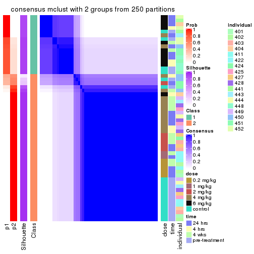</p>

</div>
<div id='tab-ATC-mclust-consensus-heatmap-2'>
<pre><code class="r">consensus_heatmap(res, k = 3)
</code></pre>

<p>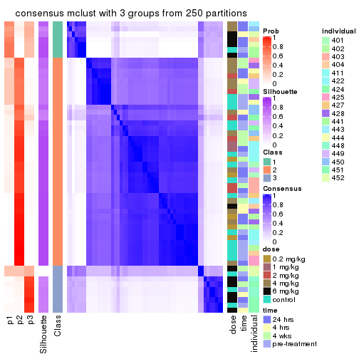</p>

</div>
<div id='tab-ATC-mclust-consensus-heatmap-3'>
<pre><code class="r">consensus_heatmap(res, k = 4)
</code></pre>

<p>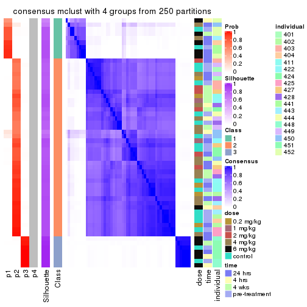</p>

</div>
<div id='tab-ATC-mclust-consensus-heatmap-4'>
<pre><code class="r">consensus_heatmap(res, k = 5)
</code></pre>

<p>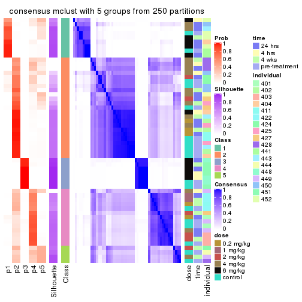</p>

</div>
<div id='tab-ATC-mclust-consensus-heatmap-5'>
<pre><code class="r">consensus_heatmap(res, k = 6)
</code></pre>

<p>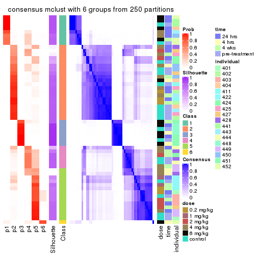</p>

</div>
</div>

Heatmaps for the membership of samples in all partitions to see how consistent they are:


<script>
$( function() {
	$( '#tabs-ATC-mclust-membership-heatmap' ).tabs();
} );
</script>
<div id='tabs-ATC-mclust-membership-heatmap'>
<ul>
<li><a href='#tab-ATC-mclust-membership-heatmap-1'>k = 2</a></li>
<li><a href='#tab-ATC-mclust-membership-heatmap-2'>k = 3</a></li>
<li><a href='#tab-ATC-mclust-membership-heatmap-3'>k = 4</a></li>
<li><a href='#tab-ATC-mclust-membership-heatmap-4'>k = 5</a></li>
<li><a href='#tab-ATC-mclust-membership-heatmap-5'>k = 6</a></li>
</ul>
<div id='tab-ATC-mclust-membership-heatmap-1'>
<pre><code class="r">membership_heatmap(res, k = 2)
</code></pre>

<p>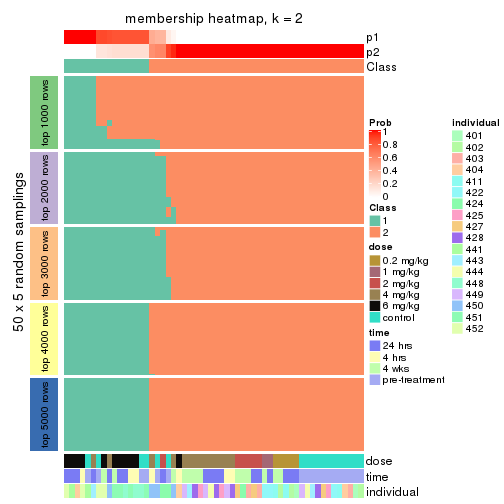</p>

</div>
<div id='tab-ATC-mclust-membership-heatmap-2'>
<pre><code class="r">membership_heatmap(res, k = 3)
</code></pre>

<p>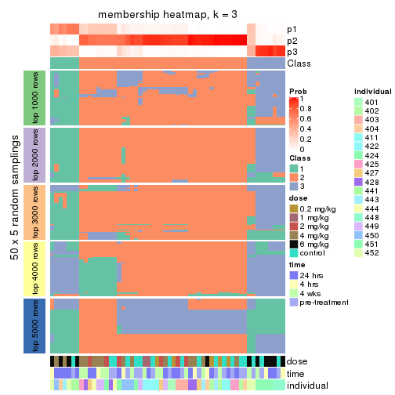</p>

</div>
<div id='tab-ATC-mclust-membership-heatmap-3'>
<pre><code class="r">membership_heatmap(res, k = 4)
</code></pre>

<p>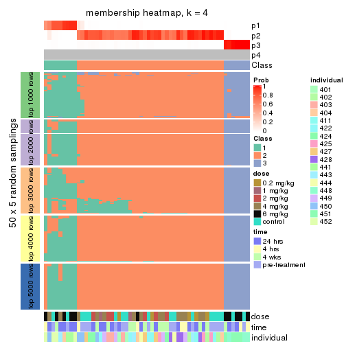</p>

</div>
<div id='tab-ATC-mclust-membership-heatmap-4'>
<pre><code class="r">membership_heatmap(res, k = 5)
</code></pre>

<p>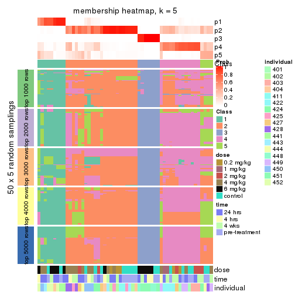</p>

</div>
<div id='tab-ATC-mclust-membership-heatmap-5'>
<pre><code class="r">membership_heatmap(res, k = 6)
</code></pre>

<p>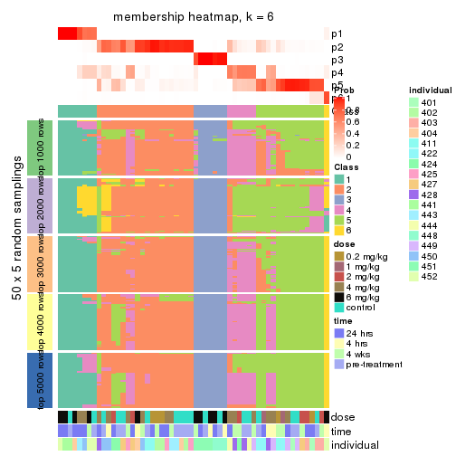</p>

</div>
</div>

As soon as we have had the classes for columns, we can look for signatures
which are significantly different between classes which can be candidate marks
for certain classes. Following are the heatmaps for signatures.


Signature heatmaps where rows are scaled:


<script>
$( function() {
	$( '#tabs-ATC-mclust-get-signatures' ).tabs();
} );
</script>
<div id='tabs-ATC-mclust-get-signatures'>
<ul>
<li><a href='#tab-ATC-mclust-get-signatures-1'>k = 2</a></li>
<li><a href='#tab-ATC-mclust-get-signatures-2'>k = 3</a></li>
<li><a href='#tab-ATC-mclust-get-signatures-3'>k = 4</a></li>
<li><a href='#tab-ATC-mclust-get-signatures-4'>k = 5</a></li>
<li><a href='#tab-ATC-mclust-get-signatures-5'>k = 6</a></li>
</ul>
<div id='tab-ATC-mclust-get-signatures-1'>
<pre><code class="r">get_signatures(res, k = 2)
</code></pre>

<p>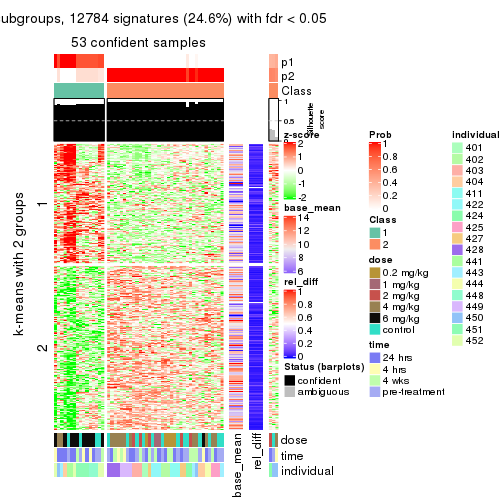</p>

</div>
<div id='tab-ATC-mclust-get-signatures-2'>
<pre><code class="r">get_signatures(res, k = 3)
</code></pre>

<p>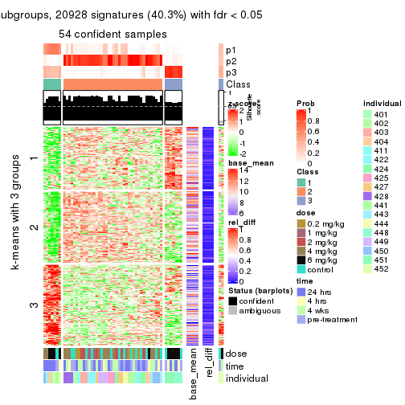</p>

</div>
<div id='tab-ATC-mclust-get-signatures-3'>
<pre><code class="r">get_signatures(res, k = 4)
</code></pre>

<p>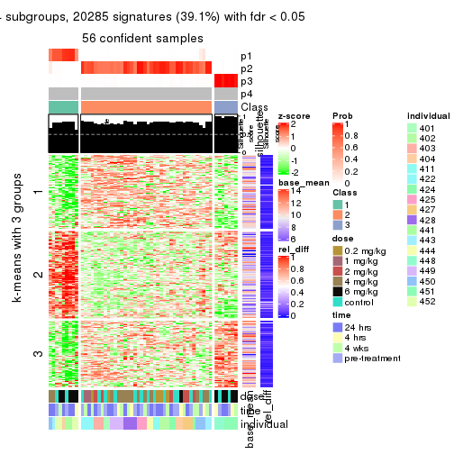</p>

</div>
<div id='tab-ATC-mclust-get-signatures-4'>
<pre><code class="r">get_signatures(res, k = 5)
</code></pre>

<p>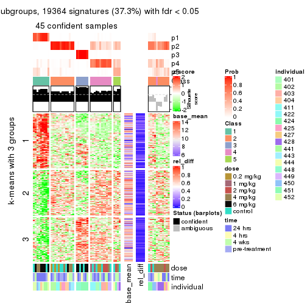</p>

</div>
<div id='tab-ATC-mclust-get-signatures-5'>
<pre><code class="r">get_signatures(res, k = 6)
</code></pre>

<p>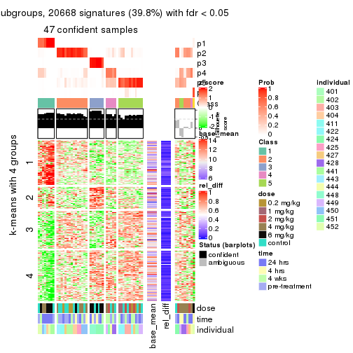</p>

</div>
</div>


Signature heatmaps where rows are not scaled:


<script>
$( function() {
	$( '#tabs-ATC-mclust-get-signatures-no-scale' ).tabs();
} );
</script>
<div id='tabs-ATC-mclust-get-signatures-no-scale'>
<ul>
<li><a href='#tab-ATC-mclust-get-signatures-no-scale-1'>k = 2</a></li>
<li><a href='#tab-ATC-mclust-get-signatures-no-scale-2'>k = 3</a></li>
<li><a href='#tab-ATC-mclust-get-signatures-no-scale-3'>k = 4</a></li>
<li><a href='#tab-ATC-mclust-get-signatures-no-scale-4'>k = 5</a></li>
<li><a href='#tab-ATC-mclust-get-signatures-no-scale-5'>k = 6</a></li>
</ul>
<div id='tab-ATC-mclust-get-signatures-no-scale-1'>
<pre><code class="r">get_signatures(res, k = 2, scale_rows = FALSE)
</code></pre>

<p>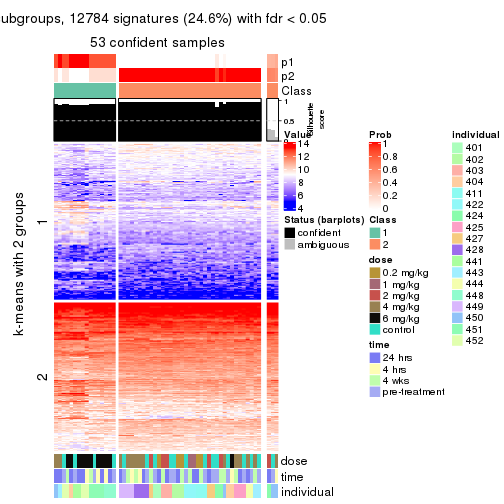</p>

</div>
<div id='tab-ATC-mclust-get-signatures-no-scale-2'>
<pre><code class="r">get_signatures(res, k = 3, scale_rows = FALSE)
</code></pre>

<p>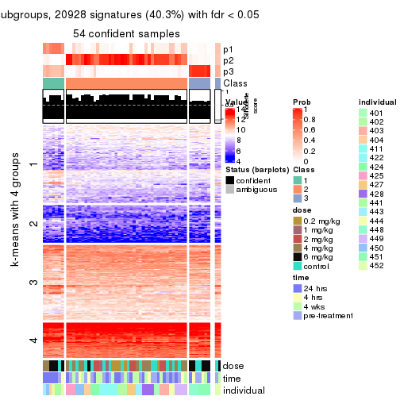</p>

</div>
<div id='tab-ATC-mclust-get-signatures-no-scale-3'>
<pre><code class="r">get_signatures(res, k = 4, scale_rows = FALSE)
</code></pre>

<p>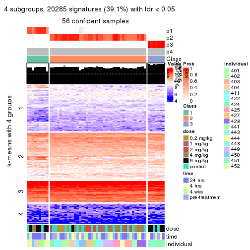</p>

</div>
<div id='tab-ATC-mclust-get-signatures-no-scale-4'>
<pre><code class="r">get_signatures(res, k = 5, scale_rows = FALSE)
</code></pre>

<p>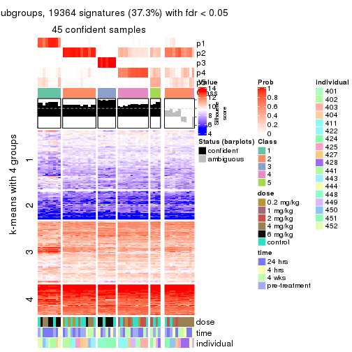</p>

</div>
<div id='tab-ATC-mclust-get-signatures-no-scale-5'>
<pre><code class="r">get_signatures(res, k = 6, scale_rows = FALSE)
</code></pre>

<p>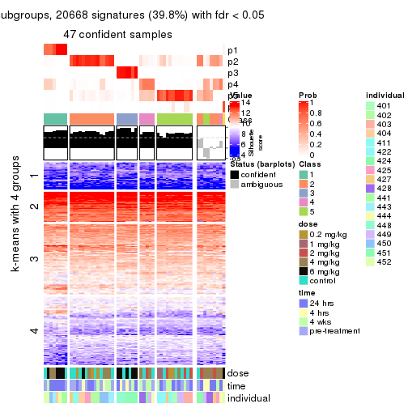</p>

</div>
</div>


Compare the overlap of signatures from different k:

```r
compare_signatures(res)
```

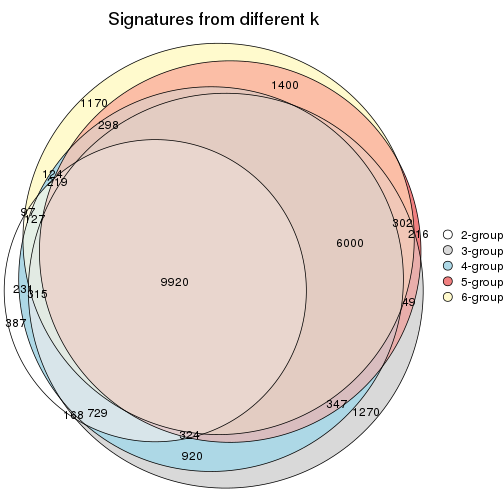

`get_signature()` returns a data frame invisibly. TO get the list of signatures, the function
call should be assigned to a variable explicitly. In following code, if `plot` argument is set
to `FALSE`, no heatmap is plotted while only the differential analysis is performed.

```r
# code only for demonstration
tb = get_signature(res, k = ..., plot = FALSE)
```

An example of the output of `tb` is:

```
#>   which_row         fdr    mean_1    mean_2 scaled_mean_1 scaled_mean_2 km
#> 1        38 0.042760348  8.373488  9.131774    -0.5533452     0.5164555  1
#> 2        40 0.018707592  7.106213  8.469186    -0.6173731     0.5762149  1
#> 3        55 0.019134737 10.221463 11.207825    -0.6159697     0.5749050  1
#> 4        59 0.006059896  5.921854  7.869574    -0.6899429     0.6439467  1
#> 5        60 0.018055526  8.928898 10.211722    -0.6204761     0.5791110  1
#> 6        98 0.009384629 15.714769 14.887706     0.6635654    -0.6193277  2
...
```

The columns in `tb` are:

1. `which_row`: row indices corresponding to the input matrix.
2. `fdr`: FDR for the differential test. 
3. `mean_x`: The mean value in group x.
4. `scaled_mean_x`: The mean value in group x after rows are scaled.
5. `km`: Row groups if k-means clustering is applied to rows.


UMAP plot which shows how samples are separated.


<script>
$( function() {
	$( '#tabs-ATC-mclust-dimension-reduction' ).tabs();
} );
</script>
<div id='tabs-ATC-mclust-dimension-reduction'>
<ul>
<li><a href='#tab-ATC-mclust-dimension-reduction-1'>k = 2</a></li>
<li><a href='#tab-ATC-mclust-dimension-reduction-2'>k = 3</a></li>
<li><a href='#tab-ATC-mclust-dimension-reduction-3'>k = 4</a></li>
<li><a href='#tab-ATC-mclust-dimension-reduction-4'>k = 5</a></li>
<li><a href='#tab-ATC-mclust-dimension-reduction-5'>k = 6</a></li>
</ul>
<div id='tab-ATC-mclust-dimension-reduction-1'>
<pre><code class="r">dimension_reduction(res, k = 2, method = &quot;UMAP&quot;)
</code></pre>

<p>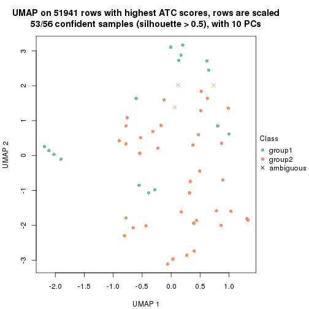</p>

</div>
<div id='tab-ATC-mclust-dimension-reduction-2'>
<pre><code class="r">dimension_reduction(res, k = 3, method = &quot;UMAP&quot;)
</code></pre>

<p>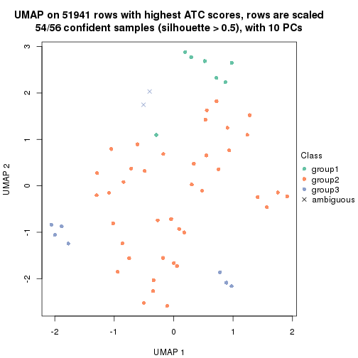</p>

</div>
<div id='tab-ATC-mclust-dimension-reduction-3'>
<pre><code class="r">dimension_reduction(res, k = 4, method = &quot;UMAP&quot;)
</code></pre>

<p>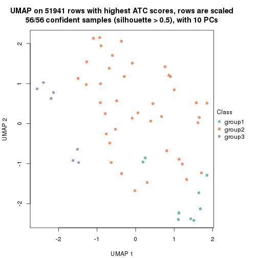</p>

</div>
<div id='tab-ATC-mclust-dimension-reduction-4'>
<pre><code class="r">dimension_reduction(res, k = 5, method = &quot;UMAP&quot;)
</code></pre>

<p>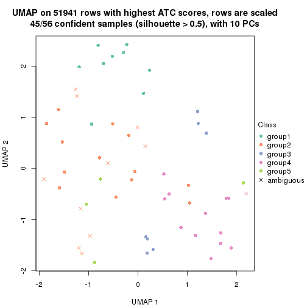</p>

</div>
<div id='tab-ATC-mclust-dimension-reduction-5'>
<pre><code class="r">dimension_reduction(res, k = 6, method = &quot;UMAP&quot;)
</code></pre>

<p>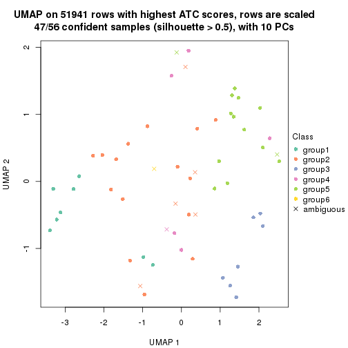</p>

</div>
</div>


Following heatmap shows how subgroups are split when increasing `k`:

```r
collect_classes(res)
```

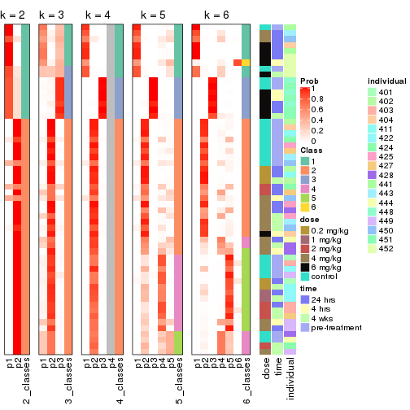


Test correlation between subgroups and known annotations. If the known
annotation is numeric, one-way ANOVA test is applied, and if the known
annotation is discrete, chi-squared contingency table test is applied.

```r
test_to_known_factors(res)
```

```
#>             n  dose(p) time(p) individual(p) k
#> ATC:mclust 53 8.37e-05   0.284      3.09e-04 2
#> ATC:mclust 54 1.14e-03   0.225      7.88e-07 3
#> ATC:mclust 56 1.14e-03   0.541      7.68e-08 4
#> ATC:mclust 45 1.57e-02   0.491      1.23e-07 5
#> ATC:mclust 47 8.97e-03   0.225      2.22e-08 6
```


If matrix rows can be associated to genes, consider to use `functional_enrichment(res,
...)` to perform function enrichment for the signature genes. See [this vignette](http://bioconductor.org/packages/devel/bioc/vignettes/cola/inst/doc/functional_enrichment.html) for more detailed explanations.


 

---------------------------------------------------


### ATC:NMF**


The object with results only for a single top-value method and a single partition method 
can be extracted as:

```r
res = res_list["ATC", "NMF"]
# you can also extract it by
# res = res_list["ATC:NMF"]
```

A summary of `res` and all the functions that can be applied to it:

```r
res
```

```
#> A 'ConsensusPartition' object with k = 2, 3, 4, 5, 6.
#>   On a matrix with 51941 rows and 56 columns.
#>   Top rows (1000, 2000, 3000, 4000, 5000) are extracted by 'ATC' method.
#>   Subgroups are detected by 'NMF' method.
#>   Performed in total 1250 partitions by row resampling.
#>   Best k for subgroups seems to be 2.
#> 
#> Following methods can be applied to this 'ConsensusPartition' object:
#>  [1] "cola_report"             "collect_classes"         "collect_plots"          
#>  [4] "collect_stats"           "colnames"                "compare_signatures"     
#>  [7] "consensus_heatmap"       "dimension_reduction"     "functional_enrichment"  
#> [10] "get_anno_col"            "get_anno"                "get_classes"            
#> [13] "get_consensus"           "get_matrix"              "get_membership"         
#> [16] "get_param"               "get_signatures"          "get_stats"              
#> [19] "is_best_k"               "is_stable_k"             "membership_heatmap"     
#> [22] "ncol"                    "nrow"                    "plot_ecdf"              
#> [25] "rownames"                "select_partition_number" "show"                   
#> [28] "suggest_best_k"          "test_to_known_factors"
```

`collect_plots()` function collects all the plots made from `res` for all `k` (number of partitions)
into one single page to provide an easy and fast comparison between different `k`.

```r
collect_plots(res)
```

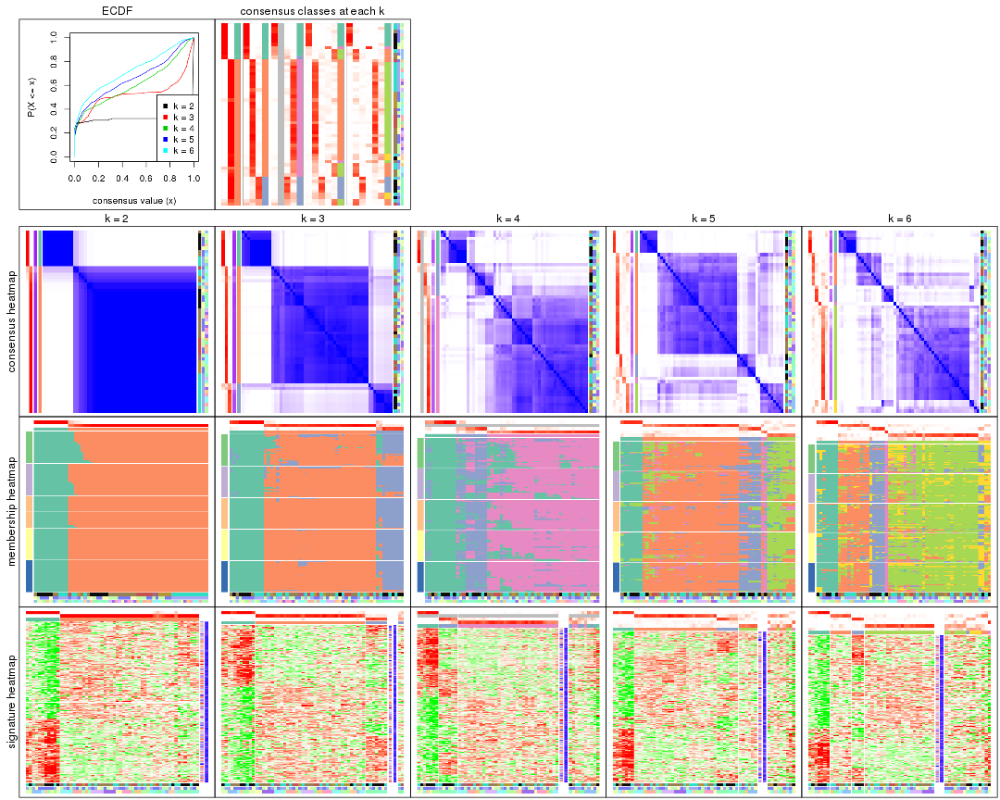

The plots are:

- The first row: a plot of the ECDF (empirical cumulative distribution
  function) curves of the consensus matrix for each `k` and the heatmap of
  predicted classes for each `k`.
- The second row: heatmaps of the consensus matrix for each `k`.
- The third row: heatmaps of the membership matrix for each `k`.
- The fouth row: heatmaps of the signatures for each `k`.

All the plots in panels can be made by individual functions and they are
plotted later in this section.

`select_partition_number()` produces several plots showing different
statistics for choosing "optimized" `k`. There are following statistics:

- ECDF curves of the consensus matrix for each `k`;
- 1-PAC. [The PAC
  score](https://en.wikipedia.org/wiki/Consensus_clustering#Over-interpretation_potential_of_consensus_clustering)
  measures the proportion of the ambiguous subgrouping.
- Mean silhouette score.
- Concordance. The mean probability of fiting the consensus class ids in all
  partitions.
- Area increased. Denote $A_k$ as the area under the ECDF curve for current
  `k`, the area increased is defined as $A_k - A_{k-1}$.
- Rand index. The percent of pairs of samples that are both in a same cluster
  or both are not in a same cluster in the partition of k and k-1.
- Jaccard index. The ratio of pairs of samples are both in a same cluster in
  the partition of k and k-1 and the pairs of samples are both in a same
  cluster in the partition k or k-1.

The detailed explanations of these statistics can be found in [the _cola_
vignette](http://bioconductor.org/packages/devel/bioc/vignettes/cola/inst/doc/cola.html#toc_13).

Generally speaking, lower PAC score, higher mean silhouette score or higher
concordance corresponds to better partition. Rand index and Jaccard index
measure how similar the current partition is compared to partition with `k-1`.
If they are too similar, we won't accept `k` is better than `k-1`.

```r
select_partition_number(res)
```

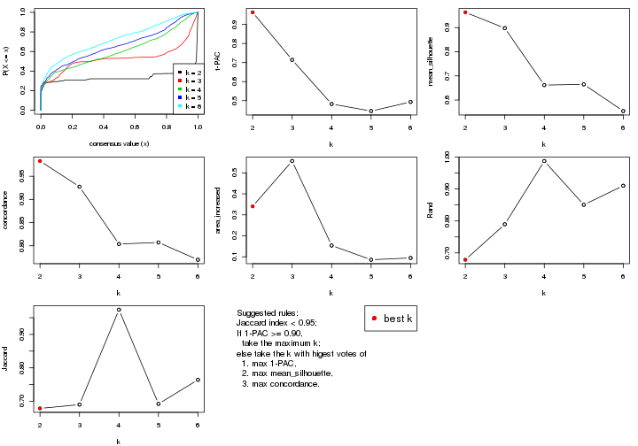

The numeric values for all these statistics can be obtained by `get_stats()`.

```r
get_stats(res)
```

```
#>   k 1-PAC mean_silhouette concordance area_increased  Rand Jaccard
#> 2 2 0.963           0.963       0.983         0.3406 0.679   0.679
#> 3 3 0.714           0.898       0.927         0.5564 0.790   0.690
#> 4 4 0.483           0.662       0.804         0.1538 0.988   0.974
#> 5 5 0.446           0.665       0.807         0.0860 0.851   0.692
#> 6 6 0.493           0.554       0.770         0.0945 0.910   0.764
```

`suggest_best_k()` suggests the best $k$ based on these statistics. The rules are as follows:

- All $k$ with Jaccard index larger than 0.95 are removed because increasing
  $k$ does not provide enough extra information. If all $k$ are removed, it is
  marked as no subgroup is detected.
- For all $k$ with 1-PAC score larger than 0.9, the maximal $k$ is taken as
  the best $k$, and other $k$ are marked as optional $k$.
- If it does not fit the second rule. The $k$ with the maximal vote of the
  highest 1-PAC score, highest mean silhouette, and highest concordance is
  taken as the best $k$.

```r
suggest_best_k(res)
```

```
#> [1] 2
```


Following shows the table of the partitions (You need to click the **show/hide
code output** link to see it). The membership matrix (columns with name `p*`)
is inferred by
[`clue::cl_consensus()`](https://www.rdocumentation.org/link/cl_consensus?package=clue)
function with the `SE` method. Basically the value in the membership matrix
represents the probability to belong to a certain group. The finall class
label for an item is determined with the group with highest probability it
belongs to.

In `get_classes()` function, the entropy is calculated from the membership
matrix and the silhouette score is calculated from the consensus matrix.


<script>
$( function() {
	$( '#tabs-ATC-NMF-get-classes' ).tabs();
} );
</script>
<div id='tabs-ATC-NMF-get-classes'>
<ul>
<li><a href='#tab-ATC-NMF-get-classes-1'>k = 2</a></li>
<li><a href='#tab-ATC-NMF-get-classes-2'>k = 3</a></li>
<li><a href='#tab-ATC-NMF-get-classes-3'>k = 4</a></li>
<li><a href='#tab-ATC-NMF-get-classes-4'>k = 5</a></li>
<li><a href='#tab-ATC-NMF-get-classes-5'>k = 6</a></li>
</ul>

<div id='tab-ATC-NMF-get-classes-1'>
<p><a id='tab-ATC-NMF-get-classes-1-a' style='color:#0366d6' href='#'>show/hide code output</a></p>
<pre><code class="r">cbind(get_classes(res, k = 2), get_membership(res, k = 2))
</code></pre>

<pre><code>#&gt;           class entropy silhouette    p1    p2
#&gt; GSM687644     2  0.0000      0.978 0.000 1.000
#&gt; GSM687648     2  0.0000      0.978 0.000 1.000
#&gt; GSM687653     2  0.0000      0.978 0.000 1.000
#&gt; GSM687658     2  0.1184      0.966 0.016 0.984
#&gt; GSM687663     2  0.0000      0.978 0.000 1.000
#&gt; GSM687668     2  0.0000      0.978 0.000 1.000
#&gt; GSM687673     2  0.5946      0.839 0.144 0.856
#&gt; GSM687678     2  0.0000      0.978 0.000 1.000
#&gt; GSM687683     2  0.0000      0.978 0.000 1.000
#&gt; GSM687688     2  0.0000      0.978 0.000 1.000
#&gt; GSM687695     1  0.0000      1.000 1.000 0.000
#&gt; GSM687699     2  0.8661      0.626 0.288 0.712
#&gt; GSM687704     2  0.0000      0.978 0.000 1.000
#&gt; GSM687707     2  0.0000      0.978 0.000 1.000
#&gt; GSM687712     2  0.0000      0.978 0.000 1.000
#&gt; GSM687719     1  0.0000      1.000 1.000 0.000
#&gt; GSM687724     2  0.0000      0.978 0.000 1.000
#&gt; GSM687728     1  0.0000      1.000 1.000 0.000
#&gt; GSM687646     2  0.0000      0.978 0.000 1.000
#&gt; GSM687649     2  0.0000      0.978 0.000 1.000
#&gt; GSM687665     2  0.5178      0.871 0.116 0.884
#&gt; GSM687651     2  0.0000      0.978 0.000 1.000
#&gt; GSM687667     2  0.0000      0.978 0.000 1.000
#&gt; GSM687670     2  0.0000      0.978 0.000 1.000
#&gt; GSM687671     2  0.0000      0.978 0.000 1.000
#&gt; GSM687654     2  0.0000      0.978 0.000 1.000
#&gt; GSM687675     2  0.8861      0.596 0.304 0.696
#&gt; GSM687685     2  0.0000      0.978 0.000 1.000
#&gt; GSM687656     2  0.0000      0.978 0.000 1.000
#&gt; GSM687677     2  0.0000      0.978 0.000 1.000
#&gt; GSM687687     2  0.0000      0.978 0.000 1.000
#&gt; GSM687692     2  0.0000      0.978 0.000 1.000
#&gt; GSM687716     2  0.0000      0.978 0.000 1.000
#&gt; GSM687722     1  0.0376      0.996 0.996 0.004
#&gt; GSM687680     2  0.0000      0.978 0.000 1.000
#&gt; GSM687690     2  0.0000      0.978 0.000 1.000
#&gt; GSM687700     1  0.0000      1.000 1.000 0.000
#&gt; GSM687705     2  0.0000      0.978 0.000 1.000
#&gt; GSM687714     2  0.0000      0.978 0.000 1.000
#&gt; GSM687721     1  0.0000      1.000 1.000 0.000
#&gt; GSM687682     2  0.0000      0.978 0.000 1.000
#&gt; GSM687694     2  0.0000      0.978 0.000 1.000
#&gt; GSM687702     2  0.3733      0.916 0.072 0.928
#&gt; GSM687718     2  0.0000      0.978 0.000 1.000
#&gt; GSM687723     2  0.1184      0.966 0.016 0.984
#&gt; GSM687661     2  0.0376      0.975 0.004 0.996
#&gt; GSM687710     2  0.0000      0.978 0.000 1.000
#&gt; GSM687726     2  0.0000      0.978 0.000 1.000
#&gt; GSM687730     1  0.0000      1.000 1.000 0.000
#&gt; GSM687660     1  0.0000      1.000 1.000 0.000
#&gt; GSM687697     1  0.0000      1.000 1.000 0.000
#&gt; GSM687709     2  0.0000      0.978 0.000 1.000
#&gt; GSM687725     2  0.0000      0.978 0.000 1.000
#&gt; GSM687729     1  0.0000      1.000 1.000 0.000
#&gt; GSM687727     2  0.0000      0.978 0.000 1.000
#&gt; GSM687731     1  0.0000      1.000 1.000 0.000
</code></pre>

<script>
$('#tab-ATC-NMF-get-classes-1-a').parent().next().next().hide();
$('#tab-ATC-NMF-get-classes-1-a').click(function(){
  $('#tab-ATC-NMF-get-classes-1-a').parent().next().next().toggle();
  return(false);
});
</script>
</div>

<div id='tab-ATC-NMF-get-classes-2'>
<p><a id='tab-ATC-NMF-get-classes-2-a' style='color:#0366d6' href='#'>show/hide code output</a></p>
<pre><code class="r">cbind(get_classes(res, k = 3), get_membership(res, k = 3))
</code></pre>

<pre><code>#&gt;           class entropy silhouette    p1    p2    p3
#&gt; GSM687644     2  0.2878      0.895 0.000 0.904 0.096
#&gt; GSM687648     2  0.0592      0.939 0.000 0.988 0.012
#&gt; GSM687653     2  0.1860      0.928 0.000 0.948 0.052
#&gt; GSM687658     2  0.2434      0.913 0.024 0.940 0.036
#&gt; GSM687663     2  0.0237      0.938 0.004 0.996 0.000
#&gt; GSM687668     2  0.1163      0.937 0.000 0.972 0.028
#&gt; GSM687673     3  0.9193      0.473 0.156 0.364 0.480
#&gt; GSM687678     2  0.1289      0.927 0.000 0.968 0.032
#&gt; GSM687683     2  0.2400      0.921 0.004 0.932 0.064
#&gt; GSM687688     2  0.0892      0.938 0.000 0.980 0.020
#&gt; GSM687695     1  0.0000      0.982 1.000 0.000 0.000
#&gt; GSM687699     2  0.5689      0.725 0.184 0.780 0.036
#&gt; GSM687704     2  0.0892      0.938 0.000 0.980 0.020
#&gt; GSM687707     3  0.3686      0.866 0.000 0.140 0.860
#&gt; GSM687712     2  0.4654      0.744 0.000 0.792 0.208
#&gt; GSM687719     1  0.0000      0.982 1.000 0.000 0.000
#&gt; GSM687724     3  0.3192      0.863 0.000 0.112 0.888
#&gt; GSM687728     1  0.0000      0.982 1.000 0.000 0.000
#&gt; GSM687646     2  0.1860      0.928 0.000 0.948 0.052
#&gt; GSM687649     2  0.0592      0.939 0.000 0.988 0.012
#&gt; GSM687665     2  0.3826      0.841 0.124 0.868 0.008
#&gt; GSM687651     2  0.0475      0.938 0.004 0.992 0.004
#&gt; GSM687667     2  0.1163      0.937 0.000 0.972 0.028
#&gt; GSM687670     2  0.2959      0.890 0.000 0.900 0.100
#&gt; GSM687671     2  0.2356      0.914 0.000 0.928 0.072
#&gt; GSM687654     2  0.1411      0.934 0.000 0.964 0.036
#&gt; GSM687675     3  0.9277      0.455 0.328 0.176 0.496
#&gt; GSM687685     2  0.0983      0.934 0.004 0.980 0.016
#&gt; GSM687656     2  0.1753      0.929 0.000 0.952 0.048
#&gt; GSM687677     2  0.0747      0.934 0.000 0.984 0.016
#&gt; GSM687687     2  0.0747      0.938 0.000 0.984 0.016
#&gt; GSM687692     2  0.1031      0.931 0.000 0.976 0.024
#&gt; GSM687716     2  0.1163      0.937 0.000 0.972 0.028
#&gt; GSM687722     1  0.3116      0.902 0.892 0.000 0.108
#&gt; GSM687680     2  0.0000      0.938 0.000 1.000 0.000
#&gt; GSM687690     2  0.0424      0.937 0.000 0.992 0.008
#&gt; GSM687700     1  0.0000      0.982 1.000 0.000 0.000
#&gt; GSM687705     2  0.1964      0.912 0.000 0.944 0.056
#&gt; GSM687714     2  0.1411      0.935 0.000 0.964 0.036
#&gt; GSM687721     1  0.1753      0.955 0.952 0.000 0.048
#&gt; GSM687682     2  0.2384      0.906 0.008 0.936 0.056
#&gt; GSM687694     2  0.1860      0.915 0.000 0.948 0.052
#&gt; GSM687702     2  0.3293      0.875 0.088 0.900 0.012
#&gt; GSM687718     2  0.1163      0.937 0.000 0.972 0.028
#&gt; GSM687723     2  0.6037      0.750 0.112 0.788 0.100
#&gt; GSM687661     2  0.1620      0.934 0.024 0.964 0.012
#&gt; GSM687710     3  0.3619      0.867 0.000 0.136 0.864
#&gt; GSM687726     3  0.3267      0.866 0.000 0.116 0.884
#&gt; GSM687730     1  0.1964      0.948 0.944 0.000 0.056
#&gt; GSM687660     1  0.0000      0.982 1.000 0.000 0.000
#&gt; GSM687697     1  0.0000      0.982 1.000 0.000 0.000
#&gt; GSM687709     3  0.3752      0.863 0.000 0.144 0.856
#&gt; GSM687725     3  0.2066      0.799 0.000 0.060 0.940
#&gt; GSM687729     1  0.0000      0.982 1.000 0.000 0.000
#&gt; GSM687727     3  0.3267      0.866 0.000 0.116 0.884
#&gt; GSM687731     1  0.0000      0.982 1.000 0.000 0.000
</code></pre>

<script>
$('#tab-ATC-NMF-get-classes-2-a').parent().next().next().hide();
$('#tab-ATC-NMF-get-classes-2-a').click(function(){
  $('#tab-ATC-NMF-get-classes-2-a').parent().next().next().toggle();
  return(false);
});
</script>
</div>

<div id='tab-ATC-NMF-get-classes-3'>
<p><a id='tab-ATC-NMF-get-classes-3-a' style='color:#0366d6' href='#'>show/hide code output</a></p>
<pre><code class="r">cbind(get_classes(res, k = 4), get_membership(res, k = 4))
</code></pre>

<pre><code>#&gt;           class entropy silhouette    p1 p2    p3    p4
#&gt; GSM687644     4  0.4781     0.6231 0.000 NA 0.212 0.752
#&gt; GSM687648     4  0.1022     0.8169 0.000 NA 0.000 0.968
#&gt; GSM687653     4  0.3278     0.7592 0.000 NA 0.116 0.864
#&gt; GSM687658     4  0.2797     0.8051 0.032 NA 0.000 0.900
#&gt; GSM687663     4  0.2076     0.8165 0.004 NA 0.008 0.932
#&gt; GSM687668     4  0.1677     0.8049 0.000 NA 0.040 0.948
#&gt; GSM687673     3  0.8996     0.3552 0.068 NA 0.412 0.240
#&gt; GSM687678     4  0.1824     0.8137 0.004 NA 0.000 0.936
#&gt; GSM687683     4  0.6897     0.4554 0.000 NA 0.168 0.588
#&gt; GSM687688     4  0.2125     0.8103 0.000 NA 0.004 0.920
#&gt; GSM687695     1  0.0000     0.8298 1.000 NA 0.000 0.000
#&gt; GSM687699     4  0.6374     0.5309 0.084 NA 0.000 0.592
#&gt; GSM687704     4  0.2376     0.8145 0.000 NA 0.016 0.916
#&gt; GSM687707     3  0.5636     0.5193 0.000 NA 0.648 0.308
#&gt; GSM687712     4  0.3286     0.7895 0.000 NA 0.080 0.876
#&gt; GSM687719     1  0.7453     0.4174 0.564 NA 0.128 0.024
#&gt; GSM687724     3  0.1661     0.6037 0.000 NA 0.944 0.052
#&gt; GSM687728     1  0.1305     0.8193 0.960 NA 0.004 0.000
#&gt; GSM687646     4  0.3552     0.7470 0.000 NA 0.128 0.848
#&gt; GSM687649     4  0.1388     0.8140 0.000 NA 0.012 0.960
#&gt; GSM687665     4  0.4468     0.7572 0.052 NA 0.004 0.808
#&gt; GSM687651     4  0.2149     0.8075 0.000 NA 0.000 0.912
#&gt; GSM687667     4  0.2845     0.7845 0.000 NA 0.076 0.896
#&gt; GSM687670     4  0.4199     0.6988 0.000 NA 0.164 0.804
#&gt; GSM687671     4  0.3205     0.7663 0.000 NA 0.104 0.872
#&gt; GSM687654     4  0.2775     0.7804 0.000 NA 0.084 0.896
#&gt; GSM687675     3  0.9216     0.0780 0.300 NA 0.356 0.076
#&gt; GSM687685     4  0.5040     0.5849 0.000 NA 0.008 0.628
#&gt; GSM687656     4  0.3219     0.7621 0.000 NA 0.112 0.868
#&gt; GSM687677     4  0.5400     0.5578 0.000 NA 0.020 0.608
#&gt; GSM687687     4  0.1820     0.8031 0.000 NA 0.036 0.944
#&gt; GSM687692     4  0.0779     0.8155 0.000 NA 0.004 0.980
#&gt; GSM687716     4  0.0937     0.8132 0.000 NA 0.012 0.976
#&gt; GSM687722     3  0.8472    -0.1049 0.320 NA 0.336 0.020
#&gt; GSM687680     4  0.1474     0.8152 0.000 NA 0.000 0.948
#&gt; GSM687690     4  0.0672     0.8146 0.000 NA 0.008 0.984
#&gt; GSM687700     1  0.1474     0.8100 0.948 NA 0.000 0.000
#&gt; GSM687705     4  0.5535     0.4538 0.000 NA 0.020 0.560
#&gt; GSM687714     4  0.1510     0.8145 0.000 NA 0.016 0.956
#&gt; GSM687721     1  0.7329     0.3531 0.516 NA 0.188 0.000
#&gt; GSM687682     4  0.4632     0.7006 0.004 NA 0.012 0.740
#&gt; GSM687694     4  0.2944     0.7873 0.000 NA 0.004 0.868
#&gt; GSM687702     4  0.5579     0.5955 0.028 NA 0.004 0.640
#&gt; GSM687718     4  0.1716     0.8154 0.000 NA 0.000 0.936
#&gt; GSM687723     4  0.8450    -0.0452 0.028 NA 0.244 0.420
#&gt; GSM687661     4  0.4060     0.7773 0.044 NA 0.008 0.840
#&gt; GSM687710     3  0.5546     0.5401 0.000 NA 0.664 0.292
#&gt; GSM687726     3  0.2385     0.6019 0.000 NA 0.920 0.052
#&gt; GSM687730     1  0.5581     0.4495 0.532 NA 0.020 0.000
#&gt; GSM687660     1  0.0000     0.8298 1.000 NA 0.000 0.000
#&gt; GSM687697     1  0.0000     0.8298 1.000 NA 0.000 0.000
#&gt; GSM687709     3  0.5812     0.4843 0.000 NA 0.624 0.328
#&gt; GSM687725     3  0.3377     0.5261 0.000 NA 0.848 0.012
#&gt; GSM687729     1  0.0000     0.8298 1.000 NA 0.000 0.000
#&gt; GSM687727     3  0.2797     0.6077 0.000 NA 0.900 0.068
#&gt; GSM687731     1  0.1022     0.8228 0.968 NA 0.000 0.000
</code></pre>

<script>
$('#tab-ATC-NMF-get-classes-3-a').parent().next().next().hide();
$('#tab-ATC-NMF-get-classes-3-a').click(function(){
  $('#tab-ATC-NMF-get-classes-3-a').parent().next().next().toggle();
  return(false);
});
</script>
</div>

<div id='tab-ATC-NMF-get-classes-4'>
<p><a id='tab-ATC-NMF-get-classes-4-a' style='color:#0366d6' href='#'>show/hide code output</a></p>
<pre><code class="r">cbind(get_classes(res, k = 5), get_membership(res, k = 5))
</code></pre>

<pre><code>#&gt;           class entropy silhouette    p1    p2    p3    p4    p5
#&gt; GSM687644     2  0.3800     0.7249 0.000 0.828 0.092 0.068 0.012
#&gt; GSM687648     2  0.2408     0.7980 0.000 0.892 0.000 0.016 0.092
#&gt; GSM687653     2  0.2270     0.7773 0.000 0.908 0.072 0.016 0.004
#&gt; GSM687658     2  0.5691     0.6090 0.040 0.676 0.000 0.076 0.208
#&gt; GSM687663     2  0.3598     0.7764 0.004 0.844 0.008 0.056 0.088
#&gt; GSM687668     2  0.2931     0.8041 0.000 0.888 0.028 0.044 0.040
#&gt; GSM687673     5  0.5505     0.5854 0.012 0.100 0.220 0.000 0.668
#&gt; GSM687678     2  0.3776     0.7570 0.012 0.820 0.000 0.040 0.128
#&gt; GSM687683     5  0.5066     0.5207 0.000 0.296 0.028 0.020 0.656
#&gt; GSM687688     2  0.2037     0.7912 0.000 0.920 0.004 0.064 0.012
#&gt; GSM687695     1  0.1914     0.9262 0.928 0.000 0.008 0.008 0.056
#&gt; GSM687699     5  0.5386     0.4647 0.016 0.328 0.008 0.028 0.620
#&gt; GSM687704     2  0.2378     0.7895 0.000 0.908 0.016 0.064 0.012
#&gt; GSM687707     3  0.7206     0.5684 0.020 0.276 0.536 0.128 0.040
#&gt; GSM687712     2  0.2693     0.7987 0.000 0.896 0.028 0.016 0.060
#&gt; GSM687719     5  0.4295     0.5856 0.136 0.020 0.032 0.012 0.800
#&gt; GSM687724     3  0.2585     0.6548 0.000 0.064 0.896 0.004 0.036
#&gt; GSM687728     1  0.1907     0.8760 0.928 0.000 0.000 0.044 0.028
#&gt; GSM687646     2  0.2792     0.7679 0.000 0.884 0.072 0.040 0.004
#&gt; GSM687649     2  0.3288     0.7917 0.004 0.864 0.012 0.084 0.036
#&gt; GSM687665     2  0.5547     0.4772 0.028 0.620 0.004 0.032 0.316
#&gt; GSM687651     2  0.2921     0.7764 0.000 0.856 0.000 0.020 0.124
#&gt; GSM687667     2  0.3628     0.7534 0.016 0.848 0.080 0.052 0.004
#&gt; GSM687670     2  0.4711     0.7318 0.000 0.780 0.080 0.096 0.044
#&gt; GSM687671     2  0.2728     0.7867 0.000 0.888 0.040 0.068 0.004
#&gt; GSM687654     2  0.1990     0.7818 0.000 0.920 0.068 0.008 0.004
#&gt; GSM687675     5  0.5323     0.5838 0.052 0.036 0.196 0.004 0.712
#&gt; GSM687685     2  0.5904    -0.0894 0.000 0.464 0.012 0.068 0.456
#&gt; GSM687656     2  0.2407     0.7700 0.000 0.896 0.088 0.012 0.004
#&gt; GSM687677     2  0.5546     0.4670 0.000 0.656 0.008 0.228 0.108
#&gt; GSM687687     2  0.0955     0.7999 0.000 0.968 0.028 0.004 0.000
#&gt; GSM687692     2  0.1041     0.8025 0.000 0.964 0.000 0.032 0.004
#&gt; GSM687716     2  0.0486     0.8042 0.000 0.988 0.004 0.004 0.004
#&gt; GSM687722     5  0.4378     0.5669 0.052 0.008 0.148 0.008 0.784
#&gt; GSM687680     2  0.3804     0.7382 0.000 0.796 0.000 0.044 0.160
#&gt; GSM687690     2  0.0727     0.8051 0.000 0.980 0.004 0.012 0.004
#&gt; GSM687700     1  0.3599     0.8206 0.812 0.000 0.008 0.020 0.160
#&gt; GSM687705     4  0.4951     0.0853 0.000 0.420 0.012 0.556 0.012
#&gt; GSM687714     2  0.2011     0.8082 0.000 0.928 0.008 0.020 0.044
#&gt; GSM687721     5  0.5114     0.4659 0.176 0.000 0.096 0.012 0.716
#&gt; GSM687682     2  0.5464     0.5800 0.004 0.680 0.004 0.188 0.124
#&gt; GSM687694     2  0.2664     0.7836 0.000 0.892 0.004 0.064 0.040
#&gt; GSM687702     5  0.4675     0.4746 0.000 0.336 0.004 0.020 0.640
#&gt; GSM687718     2  0.1377     0.8042 0.000 0.956 0.004 0.020 0.020
#&gt; GSM687723     5  0.4681     0.6125 0.000 0.180 0.056 0.016 0.748
#&gt; GSM687661     2  0.6658     0.2764 0.032 0.540 0.008 0.096 0.324
#&gt; GSM687710     3  0.6932     0.5973 0.016 0.244 0.576 0.124 0.040
#&gt; GSM687726     3  0.2580     0.6522 0.000 0.064 0.892 0.000 0.044
#&gt; GSM687730     4  0.4453    -0.0589 0.212 0.000 0.020 0.744 0.024
#&gt; GSM687660     1  0.1571     0.9274 0.936 0.000 0.000 0.004 0.060
#&gt; GSM687697     1  0.1597     0.9293 0.940 0.000 0.000 0.012 0.048
#&gt; GSM687709     3  0.7459     0.5231 0.028 0.304 0.500 0.128 0.040
#&gt; GSM687725     3  0.1956     0.5613 0.000 0.000 0.916 0.008 0.076
#&gt; GSM687729     1  0.1357     0.9294 0.948 0.000 0.000 0.004 0.048
#&gt; GSM687727     3  0.3956     0.6428 0.000 0.132 0.812 0.028 0.028
#&gt; GSM687731     1  0.1469     0.8920 0.948 0.000 0.000 0.036 0.016
</code></pre>

<script>
$('#tab-ATC-NMF-get-classes-4-a').parent().next().next().hide();
$('#tab-ATC-NMF-get-classes-4-a').click(function(){
  $('#tab-ATC-NMF-get-classes-4-a').parent().next().next().toggle();
  return(false);
});
</script>
</div>

<div id='tab-ATC-NMF-get-classes-5'>
<p><a id='tab-ATC-NMF-get-classes-5-a' style='color:#0366d6' href='#'>show/hide code output</a></p>
<pre><code class="r">cbind(get_classes(res, k = 6), get_membership(res, k = 6))
</code></pre>

<pre><code>#&gt;           class entropy silhouette    p1    p2    p3    p4    p5    p6
#&gt; GSM687644     5  0.3514     0.5809 0.000 0.000 0.020 0.000 0.752 0.228
#&gt; GSM687648     5  0.2536     0.7332 0.000 0.064 0.004 0.004 0.888 0.040
#&gt; GSM687653     5  0.1890     0.7258 0.000 0.000 0.024 0.000 0.916 0.060
#&gt; GSM687658     6  0.6517     0.0698 0.000 0.252 0.004 0.016 0.328 0.400
#&gt; GSM687663     5  0.6381     0.5113 0.004 0.112 0.028 0.060 0.616 0.180
#&gt; GSM687668     5  0.4631     0.6316 0.000 0.112 0.028 0.000 0.736 0.124
#&gt; GSM687673     2  0.4293     0.5786 0.004 0.744 0.192 0.000 0.028 0.032
#&gt; GSM687678     5  0.5795     0.4271 0.000 0.144 0.000 0.024 0.572 0.260
#&gt; GSM687683     2  0.4333     0.5802 0.000 0.760 0.032 0.004 0.156 0.048
#&gt; GSM687688     5  0.1659     0.7370 0.000 0.008 0.004 0.020 0.940 0.028
#&gt; GSM687695     1  0.0146     0.8898 0.996 0.004 0.000 0.000 0.000 0.000
#&gt; GSM687699     2  0.5550     0.4743 0.028 0.652 0.004 0.004 0.192 0.120
#&gt; GSM687704     5  0.3119     0.7191 0.000 0.016 0.064 0.012 0.864 0.044
#&gt; GSM687707     6  0.4992    -0.2534 0.000 0.000 0.460 0.000 0.068 0.472
#&gt; GSM687712     5  0.3472     0.6641 0.000 0.092 0.000 0.000 0.808 0.100
#&gt; GSM687719     2  0.2641     0.6252 0.072 0.876 0.004 0.000 0.000 0.048
#&gt; GSM687724     3  0.1844     0.7645 0.000 0.016 0.928 0.000 0.040 0.016
#&gt; GSM687728     1  0.4055     0.6889 0.724 0.024 0.004 0.008 0.000 0.240
#&gt; GSM687646     5  0.2398     0.7119 0.000 0.000 0.020 0.000 0.876 0.104
#&gt; GSM687649     5  0.3896     0.6859 0.000 0.048 0.012 0.004 0.784 0.152
#&gt; GSM687665     5  0.6702     0.2747 0.012 0.272 0.012 0.024 0.504 0.176
#&gt; GSM687651     5  0.4310     0.6669 0.000 0.144 0.004 0.024 0.764 0.064
#&gt; GSM687667     5  0.3315     0.6853 0.000 0.000 0.076 0.000 0.820 0.104
#&gt; GSM687670     5  0.6425    -0.1235 0.000 0.052 0.132 0.000 0.432 0.384
#&gt; GSM687671     5  0.4283     0.6150 0.000 0.012 0.068 0.000 0.740 0.180
#&gt; GSM687654     5  0.1930     0.7317 0.000 0.000 0.036 0.000 0.916 0.048
#&gt; GSM687675     2  0.3963     0.5851 0.044 0.796 0.124 0.000 0.004 0.032
#&gt; GSM687685     2  0.6026     0.0728 0.000 0.468 0.004 0.028 0.396 0.104
#&gt; GSM687656     5  0.1890     0.7268 0.000 0.000 0.024 0.000 0.916 0.060
#&gt; GSM687677     5  0.4680     0.6699 0.000 0.068 0.040 0.060 0.776 0.056
#&gt; GSM687687     5  0.0891     0.7379 0.000 0.000 0.008 0.000 0.968 0.024
#&gt; GSM687692     5  0.1527     0.7384 0.000 0.008 0.012 0.012 0.948 0.020
#&gt; GSM687716     5  0.2226     0.7250 0.000 0.028 0.000 0.008 0.904 0.060
#&gt; GSM687722     2  0.3394     0.5955 0.040 0.836 0.092 0.000 0.000 0.032
#&gt; GSM687680     5  0.6096     0.2778 0.000 0.168 0.000 0.024 0.512 0.296
#&gt; GSM687690     5  0.1705     0.7418 0.000 0.012 0.008 0.016 0.940 0.024
#&gt; GSM687700     1  0.2728     0.7843 0.864 0.100 0.004 0.000 0.000 0.032
#&gt; GSM687705     5  0.5605     0.3787 0.000 0.012 0.028 0.360 0.548 0.052
#&gt; GSM687714     5  0.2658     0.7079 0.000 0.036 0.000 0.000 0.864 0.100
#&gt; GSM687721     2  0.5303     0.4490 0.208 0.664 0.068 0.000 0.000 0.060
#&gt; GSM687682     5  0.7387     0.2061 0.000 0.084 0.028 0.268 0.448 0.172
#&gt; GSM687694     5  0.2400     0.7272 0.000 0.040 0.004 0.008 0.900 0.048
#&gt; GSM687702     2  0.4149     0.5140 0.004 0.728 0.000 0.000 0.212 0.056
#&gt; GSM687718     5  0.2371     0.7265 0.000 0.032 0.000 0.016 0.900 0.052
#&gt; GSM687723     2  0.2580     0.6361 0.004 0.884 0.004 0.000 0.072 0.036
#&gt; GSM687661     6  0.5960     0.2068 0.000 0.264 0.004 0.000 0.244 0.488
#&gt; GSM687710     3  0.4941    -0.0931 0.000 0.000 0.492 0.000 0.064 0.444
#&gt; GSM687726     3  0.1718     0.7636 0.000 0.016 0.932 0.000 0.044 0.008
#&gt; GSM687730     4  0.1297     0.0000 0.040 0.000 0.012 0.948 0.000 0.000
#&gt; GSM687660     1  0.0146     0.8898 0.996 0.004 0.000 0.000 0.000 0.000
#&gt; GSM687697     1  0.0000     0.8891 1.000 0.000 0.000 0.000 0.000 0.000
#&gt; GSM687709     6  0.5146    -0.1174 0.000 0.000 0.396 0.000 0.088 0.516
#&gt; GSM687725     3  0.1965     0.7016 0.000 0.040 0.924 0.008 0.004 0.024
#&gt; GSM687729     1  0.0291     0.8887 0.992 0.004 0.004 0.000 0.000 0.000
#&gt; GSM687727     3  0.2958     0.7036 0.000 0.004 0.860 0.028 0.096 0.012
#&gt; GSM687731     1  0.3184     0.8035 0.832 0.024 0.004 0.008 0.000 0.132
</code></pre>

<script>
$('#tab-ATC-NMF-get-classes-5-a').parent().next().next().hide();
$('#tab-ATC-NMF-get-classes-5-a').click(function(){
  $('#tab-ATC-NMF-get-classes-5-a').parent().next().next().toggle();
  return(false);
});
</script>
</div>
</div>

Heatmaps for the consensus matrix. It visualizes the probability of two
samples to be in a same group.


<script>
$( function() {
	$( '#tabs-ATC-NMF-consensus-heatmap' ).tabs();
} );
</script>
<div id='tabs-ATC-NMF-consensus-heatmap'>
<ul>
<li><a href='#tab-ATC-NMF-consensus-heatmap-1'>k = 2</a></li>
<li><a href='#tab-ATC-NMF-consensus-heatmap-2'>k = 3</a></li>
<li><a href='#tab-ATC-NMF-consensus-heatmap-3'>k = 4</a></li>
<li><a href='#tab-ATC-NMF-consensus-heatmap-4'>k = 5</a></li>
<li><a href='#tab-ATC-NMF-consensus-heatmap-5'>k = 6</a></li>
</ul>
<div id='tab-ATC-NMF-consensus-heatmap-1'>
<pre><code class="r">consensus_heatmap(res, k = 2)
</code></pre>

<p>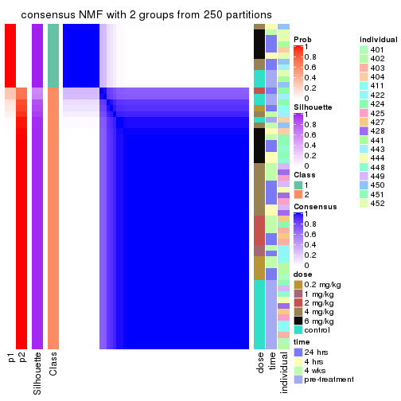</p>

</div>
<div id='tab-ATC-NMF-consensus-heatmap-2'>
<pre><code class="r">consensus_heatmap(res, k = 3)
</code></pre>

<p>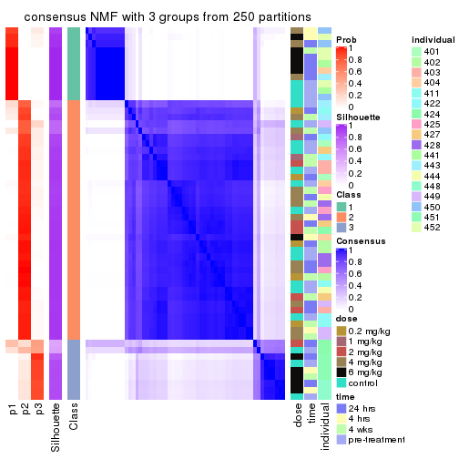</p>

</div>
<div id='tab-ATC-NMF-consensus-heatmap-3'>
<pre><code class="r">consensus_heatmap(res, k = 4)
</code></pre>

<p>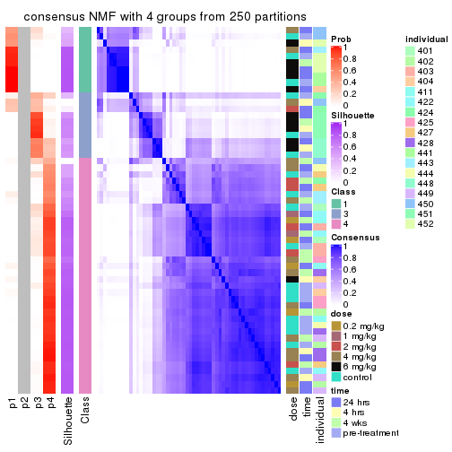</p>

</div>
<div id='tab-ATC-NMF-consensus-heatmap-4'>
<pre><code class="r">consensus_heatmap(res, k = 5)
</code></pre>

<p>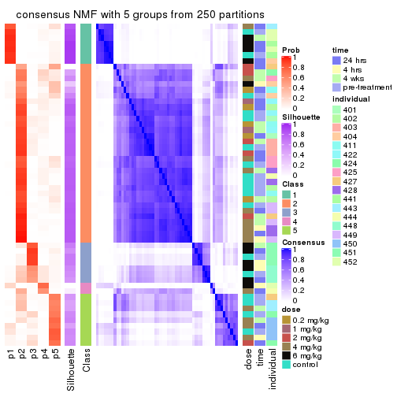</p>

</div>
<div id='tab-ATC-NMF-consensus-heatmap-5'>
<pre><code class="r">consensus_heatmap(res, k = 6)
</code></pre>

<p>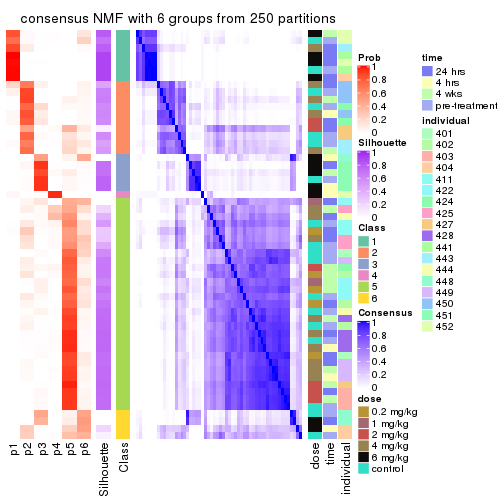</p>

</div>
</div>

Heatmaps for the membership of samples in all partitions to see how consistent they are:


<script>
$( function() {
	$( '#tabs-ATC-NMF-membership-heatmap' ).tabs();
} );
</script>
<div id='tabs-ATC-NMF-membership-heatmap'>
<ul>
<li><a href='#tab-ATC-NMF-membership-heatmap-1'>k = 2</a></li>
<li><a href='#tab-ATC-NMF-membership-heatmap-2'>k = 3</a></li>
<li><a href='#tab-ATC-NMF-membership-heatmap-3'>k = 4</a></li>
<li><a href='#tab-ATC-NMF-membership-heatmap-4'>k = 5</a></li>
<li><a href='#tab-ATC-NMF-membership-heatmap-5'>k = 6</a></li>
</ul>
<div id='tab-ATC-NMF-membership-heatmap-1'>
<pre><code class="r">membership_heatmap(res, k = 2)
</code></pre>

<p>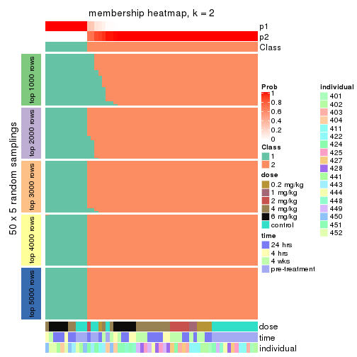</p>

</div>
<div id='tab-ATC-NMF-membership-heatmap-2'>
<pre><code class="r">membership_heatmap(res, k = 3)
</code></pre>

<p>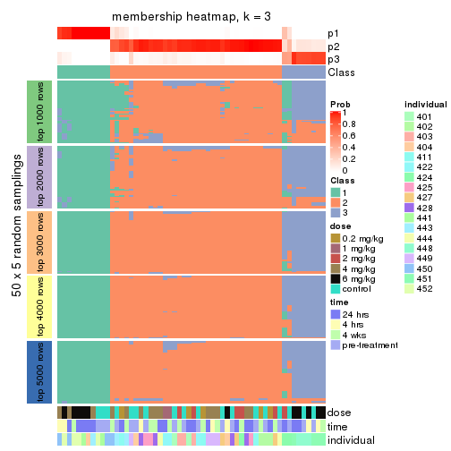</p>

</div>
<div id='tab-ATC-NMF-membership-heatmap-3'>
<pre><code class="r">membership_heatmap(res, k = 4)
</code></pre>

<p>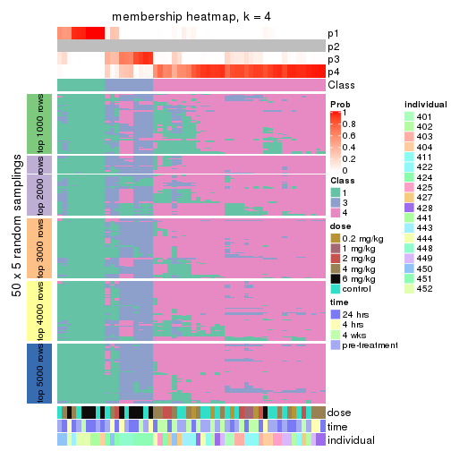</p>

</div>
<div id='tab-ATC-NMF-membership-heatmap-4'>
<pre><code class="r">membership_heatmap(res, k = 5)
</code></pre>

<p>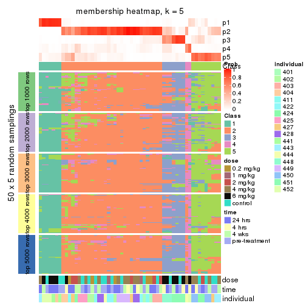</p>

</div>
<div id='tab-ATC-NMF-membership-heatmap-5'>
<pre><code class="r">membership_heatmap(res, k = 6)
</code></pre>

<p>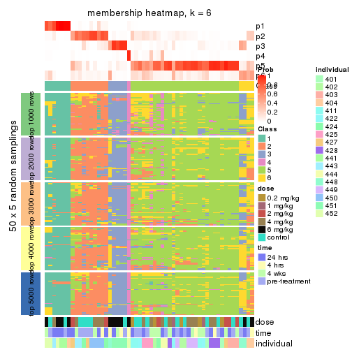</p>

</div>
</div>

As soon as we have had the classes for columns, we can look for signatures
which are significantly different between classes which can be candidate marks
for certain classes. Following are the heatmaps for signatures.


Signature heatmaps where rows are scaled:


<script>
$( function() {
	$( '#tabs-ATC-NMF-get-signatures' ).tabs();
} );
</script>
<div id='tabs-ATC-NMF-get-signatures'>
<ul>
<li><a href='#tab-ATC-NMF-get-signatures-1'>k = 2</a></li>
<li><a href='#tab-ATC-NMF-get-signatures-2'>k = 3</a></li>
<li><a href='#tab-ATC-NMF-get-signatures-3'>k = 4</a></li>
<li><a href='#tab-ATC-NMF-get-signatures-4'>k = 5</a></li>
<li><a href='#tab-ATC-NMF-get-signatures-5'>k = 6</a></li>
</ul>
<div id='tab-ATC-NMF-get-signatures-1'>
<pre><code class="r">get_signatures(res, k = 2)
</code></pre>

<p>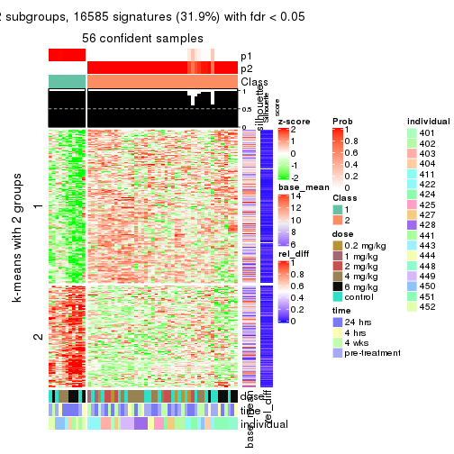</p>

</div>
<div id='tab-ATC-NMF-get-signatures-2'>
<pre><code class="r">get_signatures(res, k = 3)
</code></pre>

<p>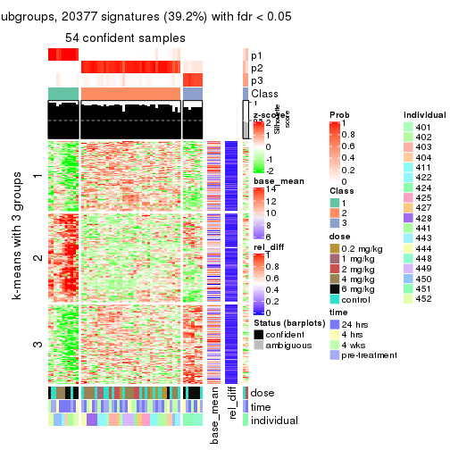</p>

</div>
<div id='tab-ATC-NMF-get-signatures-3'>
<pre><code class="r">get_signatures(res, k = 4)
</code></pre>

<p>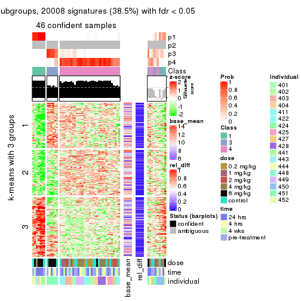</p>

</div>
<div id='tab-ATC-NMF-get-signatures-4'>
<pre><code class="r">get_signatures(res, k = 5)
</code></pre>

<p>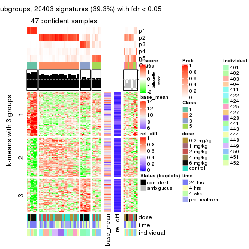</p>

</div>
<div id='tab-ATC-NMF-get-signatures-5'>
<pre><code class="r">get_signatures(res, k = 6)
</code></pre>

<p>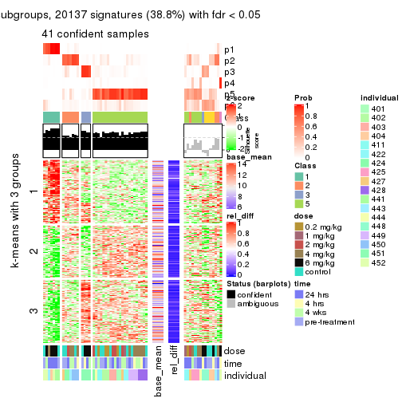</p>

</div>
</div>


Signature heatmaps where rows are not scaled:


<script>
$( function() {
	$( '#tabs-ATC-NMF-get-signatures-no-scale' ).tabs();
} );
</script>
<div id='tabs-ATC-NMF-get-signatures-no-scale'>
<ul>
<li><a href='#tab-ATC-NMF-get-signatures-no-scale-1'>k = 2</a></li>
<li><a href='#tab-ATC-NMF-get-signatures-no-scale-2'>k = 3</a></li>
<li><a href='#tab-ATC-NMF-get-signatures-no-scale-3'>k = 4</a></li>
<li><a href='#tab-ATC-NMF-get-signatures-no-scale-4'>k = 5</a></li>
<li><a href='#tab-ATC-NMF-get-signatures-no-scale-5'>k = 6</a></li>
</ul>
<div id='tab-ATC-NMF-get-signatures-no-scale-1'>
<pre><code class="r">get_signatures(res, k = 2, scale_rows = FALSE)
</code></pre>

<p>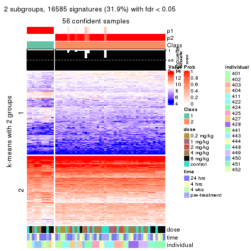</p>

</div>
<div id='tab-ATC-NMF-get-signatures-no-scale-2'>
<pre><code class="r">get_signatures(res, k = 3, scale_rows = FALSE)
</code></pre>

<p>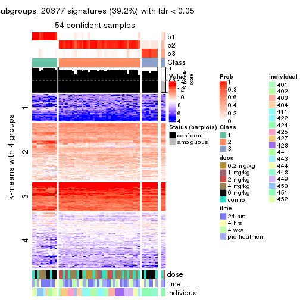</p>

</div>
<div id='tab-ATC-NMF-get-signatures-no-scale-3'>
<pre><code class="r">get_signatures(res, k = 4, scale_rows = FALSE)
</code></pre>

<p>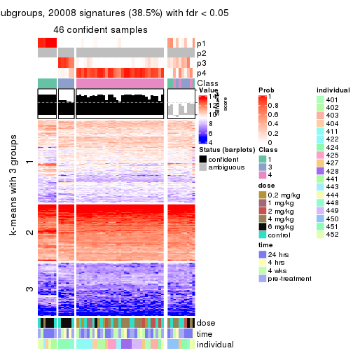</p>

</div>
<div id='tab-ATC-NMF-get-signatures-no-scale-4'>
<pre><code class="r">get_signatures(res, k = 5, scale_rows = FALSE)
</code></pre>

<p>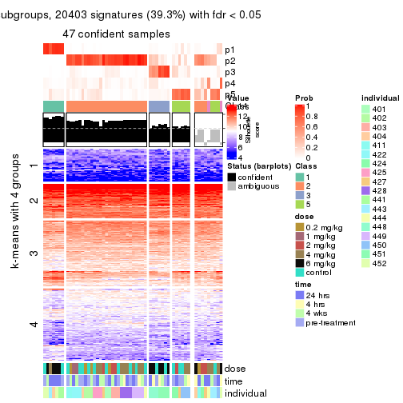</p>

</div>
<div id='tab-ATC-NMF-get-signatures-no-scale-5'>
<pre><code class="r">get_signatures(res, k = 6, scale_rows = FALSE)
</code></pre>

<p>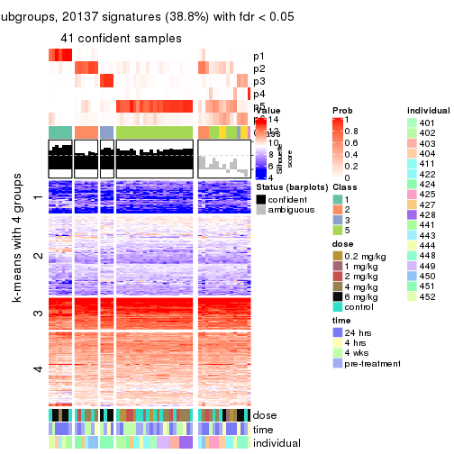</p>

</div>
</div>


Compare the overlap of signatures from different k:

```r
compare_signatures(res)
```

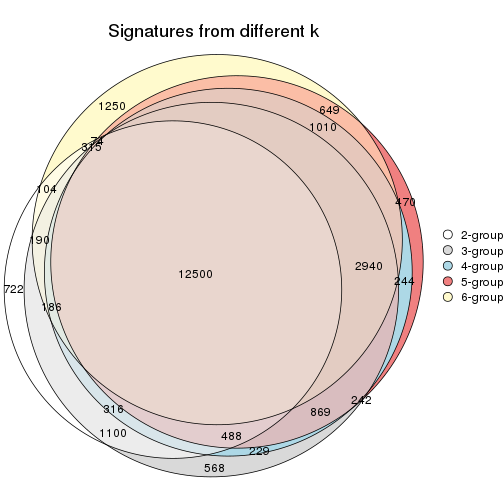

`get_signature()` returns a data frame invisibly. TO get the list of signatures, the function
call should be assigned to a variable explicitly. In following code, if `plot` argument is set
to `FALSE`, no heatmap is plotted while only the differential analysis is performed.

```r
# code only for demonstration
tb = get_signature(res, k = ..., plot = FALSE)
```

An example of the output of `tb` is:

```
#>   which_row         fdr    mean_1    mean_2 scaled_mean_1 scaled_mean_2 km
#> 1        38 0.042760348  8.373488  9.131774    -0.5533452     0.5164555  1
#> 2        40 0.018707592  7.106213  8.469186    -0.6173731     0.5762149  1
#> 3        55 0.019134737 10.221463 11.207825    -0.6159697     0.5749050  1
#> 4        59 0.006059896  5.921854  7.869574    -0.6899429     0.6439467  1
#> 5        60 0.018055526  8.928898 10.211722    -0.6204761     0.5791110  1
#> 6        98 0.009384629 15.714769 14.887706     0.6635654    -0.6193277  2
...
```

The columns in `tb` are:

1. `which_row`: row indices corresponding to the input matrix.
2. `fdr`: FDR for the differential test. 
3. `mean_x`: The mean value in group x.
4. `scaled_mean_x`: The mean value in group x after rows are scaled.
5. `km`: Row groups if k-means clustering is applied to rows.


UMAP plot which shows how samples are separated.


<script>
$( function() {
	$( '#tabs-ATC-NMF-dimension-reduction' ).tabs();
} );
</script>
<div id='tabs-ATC-NMF-dimension-reduction'>
<ul>
<li><a href='#tab-ATC-NMF-dimension-reduction-1'>k = 2</a></li>
<li><a href='#tab-ATC-NMF-dimension-reduction-2'>k = 3</a></li>
<li><a href='#tab-ATC-NMF-dimension-reduction-3'>k = 4</a></li>
<li><a href='#tab-ATC-NMF-dimension-reduction-4'>k = 5</a></li>
<li><a href='#tab-ATC-NMF-dimension-reduction-5'>k = 6</a></li>
</ul>
<div id='tab-ATC-NMF-dimension-reduction-1'>
<pre><code class="r">dimension_reduction(res, k = 2, method = &quot;UMAP&quot;)
</code></pre>

<p>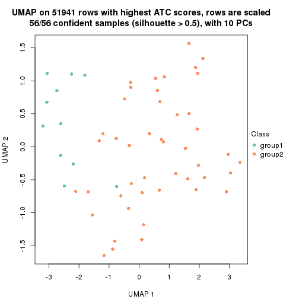</p>

</div>
<div id='tab-ATC-NMF-dimension-reduction-2'>
<pre><code class="r">dimension_reduction(res, k = 3, method = &quot;UMAP&quot;)
</code></pre>

<p>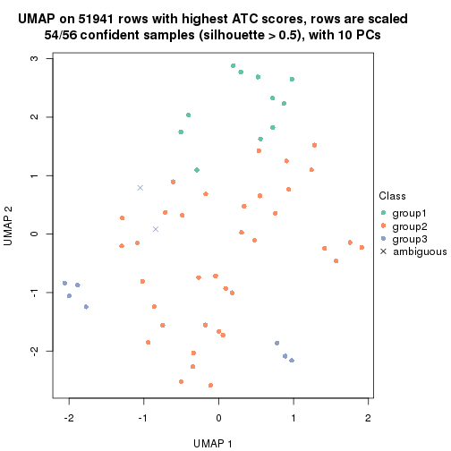</p>

</div>
<div id='tab-ATC-NMF-dimension-reduction-3'>
<pre><code class="r">dimension_reduction(res, k = 4, method = &quot;UMAP&quot;)
</code></pre>

<p>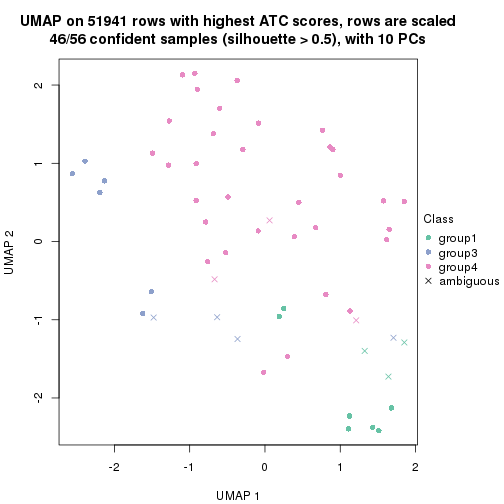</p>

</div>
<div id='tab-ATC-NMF-dimension-reduction-4'>
<pre><code class="r">dimension_reduction(res, k = 5, method = &quot;UMAP&quot;)
</code></pre>

<p>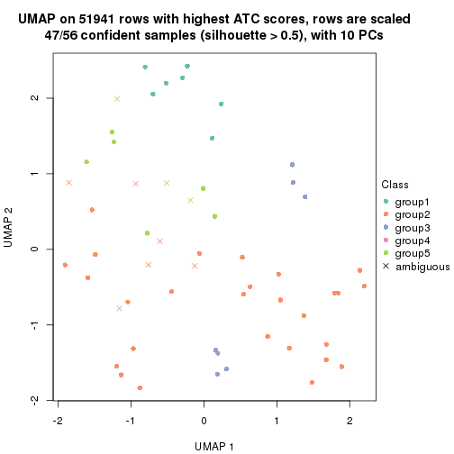</p>

</div>
<div id='tab-ATC-NMF-dimension-reduction-5'>
<pre><code class="r">dimension_reduction(res, k = 6, method = &quot;UMAP&quot;)
</code></pre>

<p>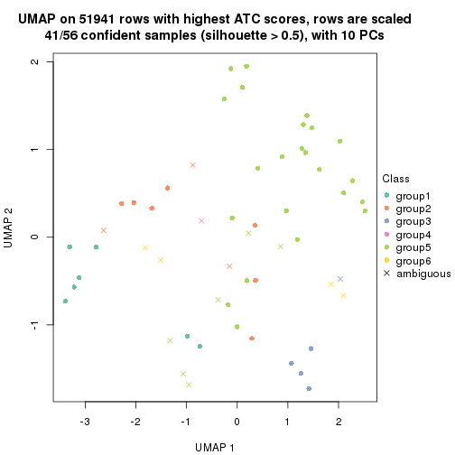</p>

</div>
</div>


Following heatmap shows how subgroups are split when increasing `k`:

```r
collect_classes(res)
```

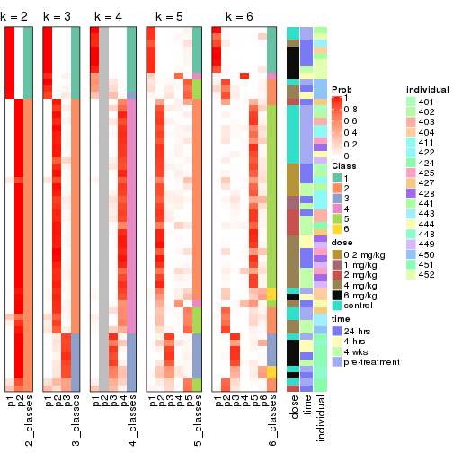


Test correlation between subgroups and known annotations. If the known
annotation is numeric, one-way ANOVA test is applied, and if the known
annotation is discrete, chi-squared contingency table test is applied.

```r
test_to_known_factors(res)
```

```
#>          n dose(p) time(p) individual(p) k
#> ATC:NMF 56 0.15901   0.496      5.13e-04 2
#> ATC:NMF 54 0.00365   0.537      1.26e-07 3
#> ATC:NMF 46 0.01009   0.359      3.51e-06 4
#> ATC:NMF 47 0.00868   0.618      4.20e-09 5
#> ATC:NMF 41 0.02189   0.743      3.98e-07 6
```


If matrix rows can be associated to genes, consider to use `functional_enrichment(res,
...)` to perform function enrichment for the signature genes. See [this vignette](http://bioconductor.org/packages/devel/bioc/vignettes/cola/inst/doc/functional_enrichment.html) for more detailed explanations.


 

## Session info


```r
sessionInfo()
```

```
#> R version 3.6.0 (2019-04-26)
#> Platform: x86_64-pc-linux-gnu (64-bit)
#> Running under: CentOS Linux 7 (Core)
#> 
#> Matrix products: default
#> BLAS:   /usr/lib64/libblas.so.3.4.2
#> LAPACK: /usr/lib64/liblapack.so.3.4.2
#> 
#> locale:
#>  [1] LC_CTYPE=en_GB.UTF-8       LC_NUMERIC=C               LC_TIME=en_GB.UTF-8       
#>  [4] LC_COLLATE=en_GB.UTF-8     LC_MONETARY=en_GB.UTF-8    LC_MESSAGES=en_GB.UTF-8   
#>  [7] LC_PAPER=en_GB.UTF-8       LC_NAME=C                  LC_ADDRESS=C              
#> [10] LC_TELEPHONE=C             LC_MEASUREMENT=en_GB.UTF-8 LC_IDENTIFICATION=C       
#> 
#> attached base packages:
#> [1] grid      stats     graphics  grDevices utils     datasets  methods   base     
#> 
#> other attached packages:
#> [1] genefilter_1.66.0    ComplexHeatmap_2.3.1 markdown_1.1         knitr_1.26          
#> [5] GetoptLong_0.1.7     cola_1.3.2          
#> 
#> loaded via a namespace (and not attached):
#>  [1] circlize_0.4.8       shape_1.4.4          xfun_0.11            slam_0.1-46         
#>  [5] lattice_0.20-38      splines_3.6.0        colorspace_1.4-1     vctrs_0.2.0         
#>  [9] stats4_3.6.0         blob_1.2.0           XML_3.98-1.20        survival_2.44-1.1   
#> [13] rlang_0.4.2          pillar_1.4.2         DBI_1.0.0            BiocGenerics_0.30.0 
#> [17] bit64_0.9-7          RColorBrewer_1.1-2   matrixStats_0.55.0   stringr_1.4.0       
#> [21] GlobalOptions_0.1.1  evaluate_0.14        memoise_1.1.0        Biobase_2.44.0      
#> [25] IRanges_2.18.3       parallel_3.6.0       AnnotationDbi_1.46.1 highr_0.8           
#> [29] Rcpp_1.0.3           xtable_1.8-4         backports_1.1.5      S4Vectors_0.22.1    
#> [33] annotate_1.62.0      skmeans_0.2-11       bit_1.1-14           microbenchmark_1.4-7
#> [37] brew_1.0-6           impute_1.58.0        rjson_0.2.20         png_0.1-7           
#> [41] digest_0.6.23        stringi_1.4.3        polyclip_1.10-0      clue_0.3-57         
#> [45] tools_3.6.0          bitops_1.0-6         magrittr_1.5         eulerr_6.0.0        
#> [49] RCurl_1.95-4.12      RSQLite_2.1.4        tibble_2.1.3         cluster_2.1.0       
#> [53] crayon_1.3.4         pkgconfig_2.0.3      zeallot_0.1.0        Matrix_1.2-17       
#> [57] xml2_1.2.2           httr_1.4.1           R6_2.4.1             mclust_5.4.5        
#> [61] compiler_3.6.0
```


